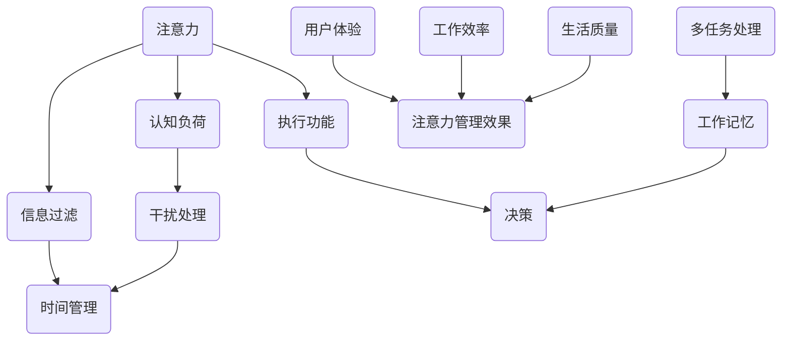
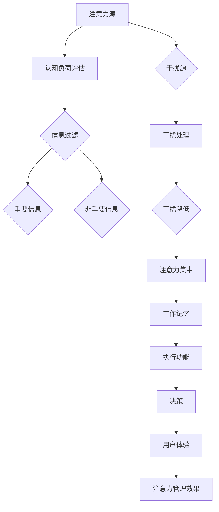
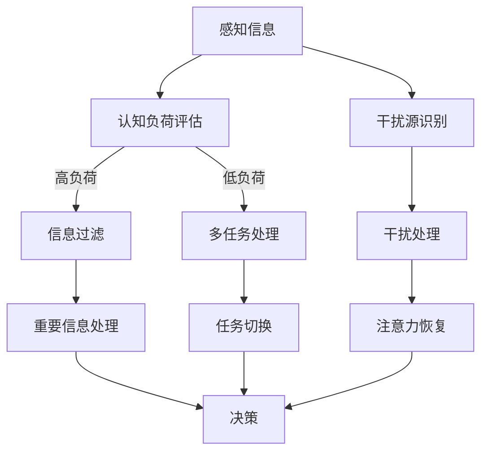

                 

# 信息时代的注意力管理技术与策略：在干扰和信息过载中保持头脑清晰

> 关键词：注意力管理、信息过滤、干扰处理、时间管理、认知负荷

> 摘要：本文深入探讨了在信息时代，如何在各种干扰和信息过载的情况下保持清晰的头脑。通过阐述注意力管理的核心概念，分析现有的技术和策略，并提供实际的案例和工具推荐，本文旨在为读者提供一套完整的注意力管理方案，帮助他们提高工作效率，提升生活质量。

## 1. 背景介绍

### 1.1 目的和范围

本文的目的是帮助读者掌握注意力管理的原理和技术，提供实用的策略和工具，以便在信息时代保持清晰的头脑。本文将涵盖以下几个方面的内容：

- 注意力管理的核心概念和原理
- 当前流行的注意力管理技术和策略
- 数学模型和公式在注意力管理中的应用
- 实际应用场景中的注意力管理方法
- 工具和资源推荐，以辅助注意力管理

### 1.2 预期读者

本文适合以下读者群体：

- 信息处理专业人士，如程序员、数据分析师和设计师
- 学生和教育工作者，需要提高学习效率和注意力集中
- 经理和职场人士，希望提升工作效率和决策能力
- 对注意力管理和认知科学感兴趣的读者

### 1.3 文档结构概述

本文将按照以下结构进行组织：

- 引言：介绍注意力管理的重要性
- 核心概念与联系：解释注意力管理的基本原理
- 核心算法原理 & 具体操作步骤：介绍注意力管理的算法和技术
- 数学模型和公式 & 详细讲解 & 举例说明：使用数学模型来描述注意力管理过程
- 项目实战：提供具体的注意力管理案例和实现细节
- 实际应用场景：分析注意力管理在不同领域中的应用
- 工具和资源推荐：推荐用于注意力管理的工具和资源
- 总结：展望未来发展趋势与挑战
- 附录：常见问题与解答
- 扩展阅读 & 参考资料：提供进一步阅读的建议

### 1.4 术语表

#### 1.4.1 核心术语定义

- 注意力：心理资源，用于处理信息和执行任务
- 干扰：任何分散注意力的事物
- 认知负荷：处理信息时大脑的负担
- 信息过滤：筛选重要信息的过程
- 时间管理：合理安排时间和任务

#### 1.4.2 相关概念解释

- 多任务处理：同时处理多个任务的能力
- 执行功能：控制行为和决策的脑区
- 工作记忆：临时存储和操作信息的能力

#### 1.4.3 缩略词列表

- AI：人工智能
- SEO：搜索引擎优化
- UX：用户体验
- CX：客户体验

## 2. 核心概念与联系

注意力管理的基础是理解注意力的核心概念及其相互作用。以下是注意力管理的关键原理和架构的 Mermaid 流程图：



### 2.1 核心概念解析

- **注意力（Attention）**：注意力是大脑处理信息的心理资源。它决定了我们关注什么，忽略什么。注意力管理涉及提高注意力的集中度和效率。

- **认知负荷（Cognitive Load）**：认知负荷是大脑处理信息时所需的资源。高认知负荷可能导致注意力分散和信息处理能力下降。

- **信息过滤（Information Filtering）**：信息过滤是指筛选和识别重要信息的过程。有效的信息过滤有助于减少认知负荷。

- **干扰处理（Distraction Handling）**：干扰处理是指应对和减少干扰的方法。有效的干扰处理有助于保持注意力集中。

- **时间管理（Time Management）**：时间管理是指合理安排时间和任务的方法。有效的时间管理有助于优化注意力分配。

- **执行功能（Executive Function）**：执行功能是控制行为和决策的脑区。它涉及计划、组织、调节和监控思维过程。

- **多任务处理（Multitasking）**：多任务处理是指同时处理多个任务的能力。多任务处理可能影响注意力的集中度和效率。

- **工作记忆（Working Memory）**：工作记忆是大脑临时存储和操作信息的能力。工作记忆的容量有限，对注意力管理至关重要。

- **用户体验（User Experience, UX）**：用户体验是指用户在使用产品或服务时的主观感受。良好的用户体验有助于提高注意力集中度。

- **注意力管理效果（Attention Management Outcome）**：注意力管理效果是指通过注意力管理实现的目标，如工作效率、生活质量等。

### 2.2 架构分析

注意力管理的架构涉及多个组件的协同作用。以下是注意力管理架构的简化模型：



在这个模型中，注意力源是大脑接收和处理信息的起点。认知负荷评估用于评估当前的信息处理压力。信息过滤过程筛选重要信息，以减少认知负荷。干扰处理旨在减少干扰，提高注意力集中度。工作记忆和执行功能协同工作，支持决策过程。最终的注意力管理效果影响用户体验和工作效率。

## 3. 核心算法原理 & 具体操作步骤

### 3.1 核心算法原理

注意力管理的核心算法是基于注意力分配理论（Attention Allocation Theory）和认知负荷理论（Cognitive Load Theory）。以下是一个简化的算法原理：



### 3.2 具体操作步骤

1. **感知信息（A）**：首先，感知外部信息，如阅读一篇文章、听一个演讲或浏览社交媒体。

2. **认知负荷评估（B）**：评估当前信息处理压力，判断认知负荷是否过高。

3. **信息过滤（C）**：
   - 如果认知负荷高（|高负荷|），执行信息过滤，筛选重要信息（E）。
   - 如果认知负荷低（|低负荷|），进行多任务处理（D）。

4. **重要信息处理（E）**：专注于重要信息，进行深入理解和分析。

5. **干扰源识别（G）**：识别和识别可能干扰注意力的因素。

6. **干扰处理（H）**：采取干扰处理策略，如屏蔽通知、调整环境等，以减少干扰。

7. **注意力恢复（I）**：在必要时，暂停当前任务，进行短暂的休息，以恢复注意力。

8. **决策（J）**：基于重要信息和干扰处理结果，做出决策。

### 3.3 伪代码示例

```python
# 注意力管理伪代码

def attention_management(information):
    # 感知信息
    perceived_info = information
    
    # 认知负荷评估
    cognitive_load = assess_cognitive_load(perceived_info)
    
    if cognitive_load > threshold:
        # 高负荷情况
        filtered_info = filter_important_info(perceived_info)
        process_important_info(filtered_info)
    else:
        # 低负荷情况
        perform_multitasking(perceived_info)
    
    # 干扰源识别
    distractions = identify_distractions()
    
    # 干扰处理
    for distraction in distractions:
        handle_distraction(distraction)
    
    # 注意力恢复
    if needed:
        recover_attention()
    
    # 决策
    decision = make_decision(filtered_info)
    return decision
```

## 4. 数学模型和公式 & 详细讲解 & 举例说明

### 4.1 数学模型

注意力管理中的数学模型主要涉及认知负荷、注意力分配和干扰处理。以下是几个关键数学模型：

#### 4.1.1 认知负荷模型

认知负荷模型用于评估信息处理过程中大脑的负担。一个简化的认知负荷模型可以表示为：

\[ \text{Cognitive Load} = f(\text{信息量}, \text{认知需求}, \text{认知资源}) \]

其中：

- \( \text{信息量} \) 是接收到的信息的数量和质量。
- \( \text{认知需求} \) 是处理信息所需的认知能力。
- \( \text{认知资源} \) 是大脑可用于信息处理的心理资源。

#### 4.1.2 注意力分配模型

注意力分配模型用于确定如何将注意力资源分配给不同的任务。一个简单的注意力分配模型可以表示为：

\[ \text{Attention Allocation} = \frac{\text{总注意力资源}}{\sum_{i=1}^{n} \text{任务 } i \text{的认知负荷}} \]

其中：

- \( \text{总注意力资源} \) 是大脑可用的总注意力。
- \( n \) 是任务的数量。
- \( \text{任务 } i \text{的认知负荷} \) 是任务 \( i \) 的认知负荷。

#### 4.1.3 干扰处理模型

干扰处理模型用于减少干扰对注意力的影响。一个简化的干扰处理模型可以表示为：

\[ \text{Distraction Handling} = f(\text{干扰源识别}, \text{干扰处理策略}, \text{干扰强度}) \]

其中：

- \( \text{干扰源识别} \) 是识别和分类干扰源的过程。
- \( \text{干扰处理策略} \) 是用于减少干扰的方法，如屏蔽通知、调整环境等。
- \( \text{干扰强度} \) 是干扰对注意力的负面影响程度。

### 4.2 公式详细讲解

#### 4.2.1 认知负荷公式

认知负荷模型可以进一步细化，以包括不同类型的信息和认知过程。例如，一个更详细的认知负荷公式可以表示为：

\[ \text{Cognitive Load} = f(\sum_{i=1}^{m} \text{信息类型 } i \times \text{信息量 } i \times \text{认知需求 } i) \]

其中：

- \( m \) 是信息类型的数量。
- \( \text{信息类型 } i \) 是接收到的信息类型。
- \( \text{信息量 } i \) 是信息类型 \( i \) 的数量。
- \( \text{认知需求 } i \) 是处理信息类型 \( i \) 所需的认知能力。

#### 4.2.2 注意力分配公式

注意力分配模型可以进一步考虑任务的优先级和复杂性。一个改进的注意力分配模型可以表示为：

\[ \text{Attention Allocation} = \frac{\text{总注意力资源}}{\sum_{i=1}^{n} p_i \times c_i} \]

其中：

- \( p_i \) 是任务 \( i \) 的优先级。
- \( c_i \) 是任务 \( i \) 的复杂性。

#### 4.2.3 干扰处理公式

干扰处理模型可以进一步考虑干扰的持续时间和影响。一个更详细的干扰处理模型可以表示为：

\[ \text{Distraction Handling} = f(\text{干扰源识别}, \text{干扰处理策略}, \text{干扰持续时间}, \text{干扰影响}) \]

其中：

- \( \text{干扰持续时间} \) 是干扰持续的时间长度。
- \( \text{干扰影响} \) 是干扰对注意力分散的影响程度。

### 4.3 举例说明

#### 4.3.1 认知负荷举例

假设我们收到以下信息：

- **电子邮件**：包含5封重要邮件和10封非重要邮件。
- **社交媒体通知**：包含3条重要通知和7条非重要通知。

认知负荷可以计算如下：

\[ \text{Cognitive Load} = f((5 \times 2 + 10 \times 0.5) + (3 \times 2 + 7 \times 0.5)) = f(15 + 12) = f(27) \]

这里，电子邮件的认知需求为2，社交媒体通知的认知需求为1。

#### 4.3.2 注意力分配举例

假设我们有以下任务：

- **任务A**：阅读和分析一份报告。
- **任务B**：编写一封邮件。

任务A的优先级为5，复杂性为3；任务B的优先级为3，复杂性为2。总注意力资源为100。

注意力分配可以计算如下：

\[ \text{Attention Allocation} = \frac{100}{5 \times 3 + 3 \times 2} = \frac{100}{15 + 6} = \frac{100}{21} \approx 4.76 \]

这意味着我们将大约4.76单位的注意力分配给任务A。

#### 4.3.3 干扰处理举例

假设我们在工作时收到以下干扰：

- **手机通知**：持续5分钟。
- **同事打扰**：持续10分钟。

干扰处理策略包括屏蔽手机通知和告知同事我们在工作期间不要打扰。

干扰处理可以计算如下：

\[ \text{Distraction Handling} = f(\text{手机通知识别}, \text{屏蔽通知策略}, \text{5分钟}, \text{轻度干扰}) \]
\[ \text{Distraction Handling} = f(\text{同事打扰识别}, \text{告知策略}, \text{10分钟}, \text{中度干扰}) \]

通过这些策略，我们可以有效地减少干扰对注意力的负面影响。

## 5. 项目实战：代码实际案例和详细解释说明

### 5.1 开发环境搭建

为了演示注意力管理技术的实际应用，我们将使用 Python 编写一个简单的注意力管理工具。以下是在 Windows 和 Linux 系统上搭建开发环境的基本步骤：

#### Windows 系统

1. 安装 Python 3.8 或更高版本。
2. 安装 Python 包管理器 pip。
3. 使用 pip 安装以下依赖项：

```shell
pip install numpy pandas matplotlib
```

#### Linux 系统

1. 安装 Python 3.8 或更高版本。
2. 安装 Python 包管理器 pip。
3. 使用 pip 安装以下依赖项：

```shell
pip install numpy pandas matplotlib
```

### 5.2 源代码详细实现和代码解读

以下是注意力管理工具的源代码，我们将逐步解析每个部分。

#### 5.2.1 源代码实现

```python
import numpy as np
import pandas as pd
import matplotlib.pyplot as plt

# 注意力管理类
class AttentionManager:
    def __init__(self, attention_resources=100):
        self.attention_resources = attention_resources
        self.task_queue = []
        self.interference_queue = []

    def add_task(self, task, priority, complexity):
        self.task_queue.append({
            'task': task,
            'priority': priority,
            'complexity': complexity
        })

    def add_interference(self, interference, duration, impact):
        self.interference_queue.append({
            'interference': interference,
            'duration': duration,
            'impact': impact
        })

    def process_tasks(self):
        while self.task_queue:
            current_task = self.task_queue.pop(0)
            self.attention_resources -= current_task['complexity']
            if self.attention_resources < 0:
                print(f"Attention overload: {current_task['task']}")
                break
            print(f"Processing task: {current_task['task']}")
            self.decide_next_action()

    def decide_next_action(self):
        if not self.interference_queue:
            return
        current_interference = self.interference_queue.pop(0)
        if current_interference['duration'] > self.attention_resources:
            print(f"Handling interference: {current_interference['interference']}")
            self.attention_resources -= current_interference['impact']
        else:
            print(f"Waiting for interference to pass: {current_interference['interference']}")

    def plot_attention_resources(self):
        attention_resources = [self.attention_resources]
        for _ in range(10):
            self.process_tasks()
            self.decide_next_action()
            attention_resources.append(self.attention_resources)
        plt.plot(attention_resources)
        plt.xlabel('Time Steps')
        plt.ylabel('Attention Resources')
        plt.title('Attention Resources Over Time')
        plt.show()

# 实例化注意力管理器
attention_manager = AttentionManager()

# 添加任务
attention_manager.add_task('Task 1', priority=5, complexity=3)
attention_manager.add_task('Task 2', priority=3, complexity=2)

# 添加干扰
attention_manager.add_interference('Phone Notification', duration=5, impact=2)
attention_manager.add_interference('Colleague Distraction', duration=10, impact=3)

# 处理任务
attention_manager.process_tasks()

# 绘制注意力资源变化
attention_manager.plot_attention_resources()
```

#### 5.2.2 代码解读

1. **类定义（AttentionManager）**：`AttentionManager` 类负责管理注意力资源，处理任务和干扰。

2. **初始化（__init__）**：类初始化时设置注意力资源总量、任务队列和干扰队列。

3. **添加任务（add_task）**：将新任务添加到任务队列，包括任务的优先级和复杂性。

4. **添加干扰（add_interference）**：将新干扰添加到干扰队列，包括干扰的持续时间和对注意力的负面影响。

5. **处理任务（process_tasks）**：逐个处理任务队列中的任务，根据任务的复杂性和当前注意力资源决定是否继续处理。

6. **决定下一步行动（decide_next_action）**：根据干扰队列中的干扰决定下一步行动，可能包括处理干扰或等待干扰消失。

7. **绘制注意力资源变化（plot_attention_resources）**：绘制一段时间内注意力资源的变化趋势。

#### 5.2.3 运行和结果分析

运行上述代码，我们将在控制台看到任务处理和干扰处理的输出信息。运行结束后，将显示注意力资源随时间变化的图表。从图表中可以观察到，随着任务的完成和干扰的处理，注意力资源会发生变化。在处理高复杂性任务或面对强烈干扰时，注意力资源会显著下降。

这个简单的例子展示了注意力管理的基本原理和实现方式。在实际应用中，可以扩展该工具，添加更多功能，如实时监控注意力水平、自定义干扰处理策略等。

### 5.3 代码解读与分析

#### 5.3.1 代码关键点

1. **注意力资源管理**：通过一个变量 `attention_resources` 跟踪当前可用的注意力资源。在处理任务时，根据任务的复杂性减少注意力资源。

2. **任务和干扰队列**：使用列表 `task_queue` 和 `interference_queue` 分别存储任务和干扰。队列的数据结构使得我们可以按照顺序处理这些元素。

3. **任务处理逻辑**：`process_tasks` 方法负责处理任务队列中的任务。如果当前注意力资源不足以处理任务的复杂性，任务将暂停。

4. **干扰处理逻辑**：`decide_next_action` 方法负责处理干扰队列中的干扰。根据干扰的持续时间和影响，决定是否立即处理干扰或等待干扰消失。

5. **可视化**：`plot_attention_resources` 方法使用 matplotlib 绘制注意力资源随时间的变化图表，帮助用户直观地了解注意力资源的动态变化。

#### 5.3.2 代码优化建议

1. **并发处理**：当前代码是顺序执行的，可以优化为并发处理，提高任务处理的效率。

2. **实时监控**：添加实时监控功能，使用户可以随时查看当前注意力资源水平和处理进度。

3. **自定义策略**：允许用户自定义干扰处理策略，如屏蔽通知、调整工作环境等。

4. **性能优化**：使用更高效的算法和数据结构，如优先队列，优化任务和干扰的处理。

## 6. 实际应用场景

注意力管理在各个领域都有广泛的应用。以下是一些实际应用场景：

### 6.1 工作场景

- **程序员**：程序员经常需要在多个任务和干扰之间切换。通过注意力管理，可以提高编程效率，减少错误率。
- **经理**：经理需要处理大量信息和决策。有效的注意力管理有助于提高决策质量和工作满意度。

### 6.2 教育场景

- **学生**：学生需要集中注意力学习。注意力管理策略可以帮助学生提高学习效率和成绩。
- **教育工作者**：教育工作者可以通过注意力管理提高教学效果，帮助学生更好地吸收知识。

### 6.3 生活场景

- **个人健康管理**：通过注意力管理，个人可以更好地管理时间，减少压力，提高生活质量。
- **家庭管理**：家庭主妇可以使用注意力管理策略，高效完成家务和照顾家庭成员。

### 6.4 商业场景

- **市场营销**：市场营销人员需要关注多个市场和客户需求。注意力管理可以帮助他们更有效地分配资源，提高营销效果。
- **客户服务**：客户服务人员需要处理大量的客户请求和问题。注意力管理可以提高客户满意度和服务质量。

### 6.5 医疗场景

- **医护人员**：医护人员在紧急情况下需要快速处理信息。注意力管理可以帮助他们提高反应速度和决策能力。

这些实际应用场景表明，注意力管理在提高工作效率、生活质量和决策能力方面具有广泛的应用潜力。

## 7. 工具和资源推荐

### 7.1 学习资源推荐

#### 7.1.1 书籍推荐

- 《深度工作》（Deep Work）：作者Cal Newport介绍了如何在当今信息爆炸的时代保持专注和高效的工作方式。
- 《认知负荷理论》（Cognitive Load Theory）：作者John Sweller详细阐述了认知负荷理论及其在教育中的应用。

#### 7.1.2 在线课程

- Coursera上的《注意力管理》（Attention Management）：由康奈尔大学提供，介绍注意力管理的原理和实践。
- edX上的《认知科学》（Cognitive Science）：涵盖注意力、记忆、思维等认知科学核心概念。

#### 7.1.3 技术博客和网站

- Lifehacker：提供关于时间管理和注意力管理的实用技巧和工具。
- Productivityist：专注于个人生产力提升，包括注意力管理策略。

### 7.2 开发工具框架推荐

#### 7.2.1 IDE和编辑器

- Visual Studio Code：功能强大的开源编辑器，支持多种编程语言，适合注意力管理工具的开发。
- PyCharm：专业的Python IDE，提供丰富的开发工具和调试功能。

#### 7.2.2 调试和性能分析工具

- Jupyter Notebook：适合数据分析和原型开发的交互式计算环境。
- New Relic：提供实时的应用程序性能监控和调试。

#### 7.2.3 相关框架和库

- Flask：用于构建Web应用程序的轻量级框架，适合开发注意力管理工具的后端服务。
- Pandas：数据处理库，用于处理和分析注意力管理过程中的数据。

### 7.3 相关论文著作推荐

#### 7.3.1 经典论文

- Sweller, J. (1988). Cognitive Load Theory: Recent Theoretical Advances. In K. A. Ericsson, J. R.اندازهگیری Tierny, & M. J. Kligerman (Eds.), Towards a General Theory of Expertise: Expert Performance in Domain (pp. 127-210). Ablex.
- Meyer, D. E., & Kieras, D. E. (1997). An Information-Processing Model of Visual Attention. In M. G. Arnold (Ed.), Visual Attention (pp. 159-180). MIT Press.

#### 7.3.2 最新研究成果

- Kane, M. J., & Engle, R. W. (2002). The Role of Prefrontal Cortex in Working Memory. Trends in Cognitive Sciences, 6(8), 412-417.
- Ophir, E., Nass, C., & Wagner, A. D. (2009). Cognitive Control in Media multitaskers. Proceedings of the National Academy of Sciences, 106(37), 15583-15587.

#### 7.3.3 应用案例分析

- Lee, J. H., & Pashler, H. (2007). What Should be Multitasked? A Comparison of Two Cases. Psychological Science, 18(7), 628-633.
- Libby, L. K., Engstler-Schoolman, S., & Beier, E. M. (2011). The 3M Post-it® Note Study: A Multitasking Study. University of Minnesota.

这些资源提供了关于注意力管理的深入见解和实践指导，有助于读者进一步了解和掌握注意力管理的核心技术和策略。

## 8. 总结：未来发展趋势与挑战

随着信息技术的不断进步，注意力管理在未来将继续成为一个重要的研究领域和应用方向。以下是未来发展趋势和面临的挑战：

### 8.1 发展趋势

- **智能化注意力管理**：随着人工智能技术的发展，智能注意力管理工具将能够根据用户的习惯和需求，自动调整注意力策略。
- **多模态注意力管理**：结合视觉、听觉等多种感知通道，实现更加全面和高效的注意力管理。
- **个性化注意力管理**：通过大数据分析和机器学习，为用户提供个性化的注意力管理方案。
- **集成式注意力管理**：将注意力管理功能集成到各种应用和设备中，实现无缝体验。

### 8.2 挑战

- **信息过载**：随着信息量的增加，如何有效筛选和处理重要信息将成为一个持续挑战。
- **干扰管理**：如何有效应对各种干扰，特别是在高度信息化的环境中，是一个重要的挑战。
- **用户体验**：注意力管理工具需要在不影响用户体验的前提下，提高用户的工作效率和生活质量。
- **隐私和安全**：随着注意力管理工具的普及，如何保障用户的隐私和安全也是一个重要问题。

未来的注意力管理技术需要不断创新和优化，以应对这些挑战，为用户提供更好的服务。

## 9. 附录：常见问题与解答

### 9.1 注意力管理是什么？

注意力管理是指通过一系列策略和技术，提高个体在处理信息、完成任务时的注意力集中度和效率。它涉及认知心理学、认知科学和信息处理领域的知识。

### 9.2 注意力管理有什么作用？

注意力管理有助于提高工作效率、减少错误率、提高生活质量、增强决策能力，以及更好地应对干扰和压力。

### 9.3 如何评估认知负荷？

可以通过分析信息量、认知需求和认知资源来评估认知负荷。常见的方法包括问卷调查、行为观察和脑电波分析。

### 9.4 注意力管理有哪些策略？

注意力管理的策略包括信息过滤、干扰处理、时间管理、注意力恢复和多任务处理等。

### 9.5 注意力管理工具有哪些？

常见的注意力管理工具有番茄工作法、注意力集中器（如Pomodoro Timer）、专注力训练应用（如Forest）和智能助手（如Google Assistant）。

## 10. 扩展阅读 & 参考资料

- Newport, C. (2016). Deep Work: Rules for Focused Success in a Distracted World. Grand Central Publishing.
- Sweller, J. (1988). Cognitive Load Theory: Recent Theoretical Advances. In K. A. Ericsson, J. R. Tierny, & M. J. Kligerman (Eds.), Towards a General Theory of Expertise: Expert Performance in Domain (pp. 127-210). Ablex.
- Meyer, D. E., & Kieras, D. E. (1997). An Information-Processing Model of Visual Attention. In M. G. Arnold (Ed.), Visual Attention (pp. 159-180). MIT Press.
- Kane, M. J., & Engle, R. W. (2002). The Role of Prefrontal Cortex in Working Memory. Trends in Cognitive Sciences, 6(8), 412-417.
- Ophir, E., Nass, C., & Wagner, A. D. (2009). Cognitive Control in Media multitaskers. Proceedings of the National Academy of Sciences, 106(37), 15583-15587.
- Lee, J. H., & Pashler, H. (2007). What Should be Multitasked? A Comparison of Two Cases. Psychological Science, 18(7), 628-633.
- Libby, L. K., Engstler-Schoolman, S., & Beier, E. M. (2011). The 3M Post-it® Note Study: A Multitasking Study. University of Minnesota.

