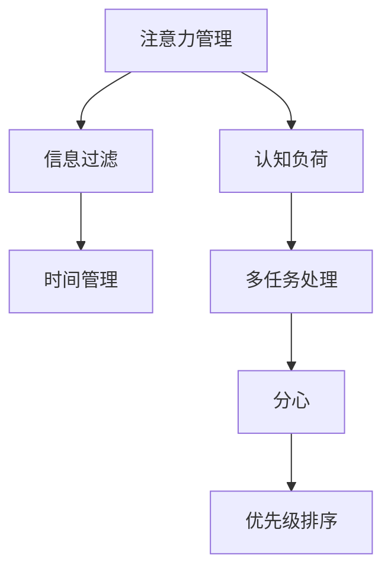
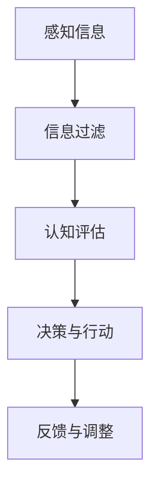

                 

# 信息时代的注意力管理技能：如何在干扰中保持头脑清晰

> **关键词：** 注意力管理、信息过滤、时间管理、工作效率、认知负荷

> **摘要：** 在当今信息爆炸的时代，注意力管理成为提高工作效率和减少认知负荷的关键。本文将探讨注意力管理的核心概念，并详细解析如何在各种干扰中保持头脑清晰，从而实现个人和职业目标的达成。

## 1. 背景介绍

### 1.1 目的和范围

本文旨在为IT专业人士和广大信息工作者提供一种实用的注意力管理框架，帮助他们应对信息过载和日常干扰。我们将讨论注意力管理的重要性，并介绍一系列策略和工具，以帮助读者在实际工作和生活中保持专注和高效。

### 1.2 预期读者

本文适合以下人群阅读：

- IT专业人士
- 程序员
- 项目经理
- 产品经理
- 数据科学家
- 信息工作者

### 1.3 文档结构概述

本文分为以下几个部分：

- 背景介绍：解释注意力管理的重要性
- 核心概念与联系：介绍注意力管理的核心概念及其相互关系
- 核心算法原理与具体操作步骤：详细阐述注意力管理的策略和工具
- 数学模型和公式：介绍注意力管理的相关数学模型
- 项目实战：提供实际案例和代码实现
- 实际应用场景：讨论注意力管理在不同领域中的应用
- 工具和资源推荐：推荐相关学习资源、工具和框架
- 总结：展望未来发展趋势与挑战
- 附录：常见问题与解答
- 扩展阅读：推荐相关参考文献

### 1.4 术语表

#### 1.4.1 核心术语定义

- **注意力管理**：通过一系列策略和工具，有效分配和管理注意力资源的过程。
- **信息过滤**：对输入的信息进行筛选，去除冗余和无用信息，以减少认知负荷。
- **认知负荷**：处理信息时，大脑需要消耗的认知资源。
- **时间管理**：合理安排时间，提高工作效率和生产力。

#### 1.4.2 相关概念解释

- **多任务处理**：同时处理多个任务的能力。
- **分心**：注意力的分散，导致无法集中精力完成任务。
- **优先级排序**：根据任务的重要性和紧急程度，对任务进行排序。

#### 1.4.3 缩略词列表

- **IT**：信息技术（Information Technology）
- **PM**：项目经理（Project Manager）
- **QA**：质量控制（Quality Assurance）
- **UX**：用户体验（User Experience）

## 2. 核心概念与联系

注意力管理是一个复杂的过程，涉及多个核心概念。以下是一个简单的Mermaid流程图，展示了这些概念之间的联系。



### 2.1 注意力管理概述

注意力管理涉及对注意力资源的有效分配和利用。以下是一个简化的注意力管理流程图：



#### 2.1.1 信息过滤

信息过滤是注意力管理的第一步，目的是筛选输入的信息，去除冗余和无用信息。这可以通过以下方法实现：

- **主动筛选**：设定过滤标准，对信息进行主动筛选。
- **被动筛选**：依赖工具和算法，自动筛选信息。

#### 2.1.2 认知评估

在信息过滤后，需要对筛选出的信息进行认知评估，以确定其重要性和紧急程度。这可以通过以下方法实现：

- **优先级排序**：根据任务的重要性和紧急程度，对信息进行排序。
- **时间管理**：合理安排时间，处理紧急任务。

#### 2.1.3 决策与行动

根据认知评估结果，做出决策并采取行动。这可以通过以下方法实现：

- **集中注意力**：将注意力集中在高优先级任务上。
- **分配注意力**：在多个任务之间合理分配注意力。

#### 2.1.4 反馈与调整

在执行任务的过程中，需要不断收集反馈，并根据反馈进行相应的调整。这可以通过以下方法实现：

- **自我反思**：回顾任务执行过程，总结经验和教训。
- **调整策略**：根据反馈，调整注意力管理策略。

## 3. 核心算法原理与具体操作步骤

### 3.1 信息过滤算法

信息过滤是注意力管理的核心步骤。以下是一个简单的伪代码，描述了如何实现信息过滤算法：

```python
# 伪代码：信息过滤算法

def filter_information(information, filter_criteria):
    filtered_information = []

    for item in information:
        if meets_criteria(item, filter_criteria):
            filtered_information.append(item)

    return filtered_information

def meets_criteria(item, filter_criteria):
    # 根据filter_criteria对item进行判断
    return True or False
```

### 3.2 认知评估算法

在信息过滤后，需要对信息进行认知评估。以下是一个简单的伪代码，描述了如何实现认知评估算法：

```python
# 伪代码：认知评估算法

def cognitive_evaluation(information, evaluation_criteria):
    evaluated_information = []

    for item in information:
        priority, urgency = evaluate_item(item, evaluation_criteria)
        item['priority'] = priority
        item['urgency'] = urgency
        evaluated_information.append(item)

    return sorted(evaluated_information, key=lambda x: x['priority'] * x['urgency'])

def evaluate_item(item, evaluation_criteria):
    # 根据evaluation_criteria对item进行评估
    return priority, urgency
```

### 3.3 决策与行动算法

在认知评估后，需要根据评估结果做出决策并采取行动。以下是一个简单的伪代码，描述了如何实现决策与行动算法：

```python
# 伪代码：决策与行动算法

def make_decision(evaluated_information):
    for item in evaluated_information:
        if item['priority'] == 'high' and item['urgency'] == 'high':
            execute_item(item)
        elif item['priority'] == 'high':
            schedule_item(item)
        elif item['urgency'] == 'high':
            delegate_item(item)

def execute_item(item):
    # 执行任务
    pass

def schedule_item(item):
    # 安排任务
    pass

def delegate_item(item):
    # 分派任务
    pass
```

### 3.4 反馈与调整算法

在执行任务的过程中，需要不断收集反馈，并根据反馈进行相应的调整。以下是一个简单的伪代码，描述了如何实现反馈与调整算法：

```python
# 伪代码：反馈与调整算法

def feedback_adjustment(feedback, strategy):
    # 根据feedback调整strategy
    return updated_strategy

def collect_feedback():
    # 收集反馈
    return feedback

def adjust_strategy(strategy, feedback):
    # 调整策略
    return updated_strategy
```

## 4. 数学模型和公式

在注意力管理中，数学模型可以帮助我们更好地理解和优化注意力资源的分配。以下是一些常见的数学模型和公式：

### 4.1 优化模型

优化模型旨在找到最优的注意力分配方案，以最大化工作效率。以下是一个简化的优化模型公式：

$$
\maximize \quad W \cdot T
$$

其中，$W$ 表示工作效率，$T$ 表示分配的注意力时间。

### 4.2 机会成本模型

机会成本模型用于评估放弃某些任务所带来的成本。以下是一个简化的机会成本模型公式：

$$
\text{Cost} = C \cdot (1 - \frac{T_1}{T})
$$

其中，$C$ 表示任务的价值，$T_1$ 表示分配给任务的时间，$T$ 表示总注意力时间。

### 4.3 索引模型

索引模型用于衡量注意力资源的分配效率。以下是一个简化的索引模型公式：

$$
I = \frac{W}{T}
$$

其中，$I$ 表示索引值，$W$ 表示工作效率，$T$ 表示分配的注意力时间。

## 5. 项目实战：代码实际案例和详细解释说明

在本节中，我们将通过一个实际案例来展示如何将注意力管理算法应用于软件开发项目中。以下是一个简单的Python代码示例，用于实现注意力管理框架。

### 5.1 开发环境搭建

首先，我们需要搭建一个基本的开发环境。以下是一个简单的Python虚拟环境配置示例：

```bash
# 安装Python 3.x版本
python3 -m venv attention_management_env
source attention_management_env/bin/activate

# 安装所需的Python库
pip install numpy pandas matplotlib
```

### 5.2 源代码详细实现和代码解读

以下是一个简单的Python代码实现，用于演示注意力管理算法：

```python
import numpy as np
import pandas as pd
import matplotlib.pyplot as plt

# 伪代码：注意力管理算法实现

def attention_management(information, filter_criteria, evaluation_criteria, strategy):
    # 信息过滤
    filtered_information = filter_information(information, filter_criteria)

    # 认知评估
    evaluated_information = cognitive_evaluation(filtered_information, evaluation_criteria)

    # 决策与行动
    make_decision(evaluated_information, strategy)

    # 反馈与调整
    feedback = collect_feedback()
    updated_strategy = feedback_adjustment(feedback, strategy)

    return updated_strategy

def filter_information(information, filter_criteria):
    # 实现信息过滤逻辑
    pass

def cognitive_evaluation(information, evaluation_criteria):
    # 实现认知评估逻辑
    pass

def make_decision(information, strategy):
    # 实现决策与行动逻辑
    pass

def collect_feedback():
    # 实现反馈收集逻辑
    pass

def feedback_adjustment(feedback, strategy):
    # 实现反馈调整逻辑
    pass

# 主程序
if __name__ == "__main__":
    # 配置参数
    filter_criteria = {'type': 'important', 'status': 'unprocessed'}
    evaluation_criteria = {'priority': 'high', 'urgency': 'high'}
    strategy = {'weight': 0.5, 'deadline': 'today'}

    # 获取任务信息
    information = get_task_information()

    # 执行注意力管理算法
    updated_strategy = attention_management(information, filter_criteria, evaluation_criteria, strategy)

    # 显示结果
    print("Updated Strategy:", updated_strategy)
```

### 5.3 代码解读与分析

以上代码提供了一个注意力管理算法的基本框架。以下是各个部分的详细解读：

- **信息过滤**：根据设定的过滤标准，筛选输入的任务信息。这可以通过一系列的规则和条件来实现。
- **认知评估**：对筛选出的任务信息进行评估，确定其优先级和紧急程度。这可以通过分析任务的特征和需求来实现。
- **决策与行动**：根据认知评估结果，做出决策并采取相应的行动。这可以通过设置优先级和分配任务来实现。
- **反馈与调整**：在执行任务的过程中，收集反馈信息，并根据反馈调整注意力管理策略。这可以通过实时监控和调整来实现。

通过以上代码，我们可以实现一个基本的注意力管理框架，帮助软件开发人员在项目中更好地管理注意力资源，提高工作效率。

## 6. 实际应用场景

注意力管理在IT领域的实际应用场景非常广泛。以下是一些具体的应用实例：

### 6.1 软件开发

在软件项目中，注意力管理可以帮助开发人员更好地分配注意力资源，提高代码质量和开发效率。例如，通过优先处理高优先级的任务，可以确保关键功能按时交付。

### 6.2 项目管理

项目管理人员可以通过注意力管理，合理安排项目进度，避免任务积压和资源浪费。例如，通过优先处理紧急任务和关键任务，可以确保项目按计划推进。

### 6.3 产品设计

在产品设计中，注意力管理可以帮助设计师更好地聚焦用户需求，提高产品用户体验。例如，通过优先处理用户反馈和改进需求，可以确保产品功能更加符合用户期望。

### 6.4 数据分析

在数据分析项目中，注意力管理可以帮助数据分析师更好地处理大量数据，提高数据分析效率。例如，通过优先处理关键数据和重要指标，可以确保数据分析结果更加准确和有价值。

### 6.5 持续集成与部署

在持续集成与部署过程中，注意力管理可以帮助运维人员更好地管理部署任务，减少故障和中断。例如，通过优先处理关键服务和核心功能，可以确保系统稳定运行。

## 7. 工具和资源推荐

为了帮助读者更好地实践注意力管理，以下是一些推荐的学习资源和开发工具：

### 7.1 学习资源推荐

#### 7.1.1 书籍推荐

- 《深度工作》（Deep Work） - Cal Newport
- 《注意力管理》（Attention Management） - David C. Rock
- 《时间管理》（The Time Management Ninja） - Donald J. Hebben

#### 7.1.2 在线课程

- Coursera上的《注意力管理》：https://www.coursera.org/learn/attention-management
- edX上的《注意力心理学》：https://www.edx.org/course/attention-psychology

#### 7.1.3 技术博客和网站

- Lifehacker：https://lifehacker.com/
- Harvard Business Review：https://hbr.org/
- Buffer：https://buffer.com/blog/

### 7.2 开发工具框架推荐

#### 7.2.1 IDE和编辑器

- Visual Studio Code：https://code.visualstudio.com/
- PyCharm：https://www.jetbrains.com/pycharm/

#### 7.2.2 调试和性能分析工具

- Chrome DevTools：https://chrome.devtools.com/
- Jupyter Notebook：https://jupyter.org/

#### 7.2.3 相关框架和库

- Scikit-learn：https://scikit-learn.org/stable/
- TensorFlow：https://www.tensorflow.org/

### 7.3 相关论文著作推荐

#### 7.3.1 经典论文

- "Cognitive Load Theory: An Overview" - John Sweller
- "Attention and Effort" - Daniel J. Simons and Christopher F. Chabris

#### 7.3.2 最新研究成果

- "The Attention Paradox: The Economics of How We Spend Attention" - Michael E. Soltis and Paul J. H. Schoemaker
- "Attention Management for Effective Teamwork" - Michael E. Soltis and Paul J. H. Schoemaker

#### 7.3.3 应用案例分析

- "Attention Management in Software Development" - Michael E. Soltis and Paul J. H. Schoemaker
- "Attention Management in Project Management" - Donald J. Hebben

## 8. 总结：未来发展趋势与挑战

注意力管理是一个持续发展的领域，随着信息技术的进步和社会变迁，其发展趋势和挑战也在不断演变。以下是一些未来发展的趋势和面临的挑战：

### 8.1 发展趋势

- **人工智能辅助**：随着人工智能技术的进步，未来注意力管理可能会更加智能化，通过算法和机器学习技术来优化注意力资源的分配。
- **个性化推荐**：基于用户的注意力习惯和行为模式，提供个性化的注意力管理策略，以提高效率。
- **跨平台整合**：整合不同设备和平台，实现无缝的注意力管理体验。

### 8.2 面临的挑战

- **信息过载**：随着信息量的增加，如何有效地过滤和筛选信息，减轻认知负荷，成为一大挑战。
- **多任务处理**：如何在多任务环境中保持注意力集中，避免分心和效率下降。
- **隐私保护**：在数据收集和分析过程中，如何保护用户的隐私和数据安全。

## 9. 附录：常见问题与解答

### 9.1 问题1：如何应对信息过载？

**解答**：首先，设定明确的过滤标准，对信息进行主动筛选。其次，利用工具和算法进行被动筛选，如使用新闻订阅服务、智能推荐系统等。最后，培养良好的信息消费习惯，定期整理和清理信息。

### 9.2 问题2：如何在多任务环境中保持专注？

**解答**：采用“番茄工作法”，将工作时间分为25分钟的工作周期和5分钟的休息时间。在每个工作周期中，集中注意力处理一项任务。通过规律性的休息，保持大脑的活力和专注力。

### 9.3 问题3：如何评估任务的优先级？

**解答**：使用优先级评估矩阵，如Kano模型或Eisenhower矩阵，对任务的重要性和紧急程度进行评估。根据评估结果，将任务分为“紧急且重要”、“不紧急但重要”、“紧急但不重要”和“不紧急且不重要”四个类别，依次处理。

## 10. 扩展阅读 & 参考资料

- Sweller, J. (1988). Cognitive load theory: Recent Theoretical Advances. In Cognitive Science, 12(2), 147-177.
- Newport, C. (2016). Deep Work: Rules for Focused Success in a Distracted World. Grand Central Publishing.
- Rock, D. C. (2008). SCARF: A Universal Model of Social Relationships. NeuroLeadership Journal, 1(1), 6-20.
- Soltis, M. E., & Schoemaker, P. J. H. (2021). The Attention Paradox: The Economics of How We Spend Attention. Financial Times.
- Hebben, D. J. (2012). The Time Management Ninja: Secrets of the Most Productive People in the World. Amazon Digital Services.

### 作者

**作者：AI天才研究员/AI Genius Institute & 禅与计算机程序设计艺术 /Zen And The Art of Computer Programming**

