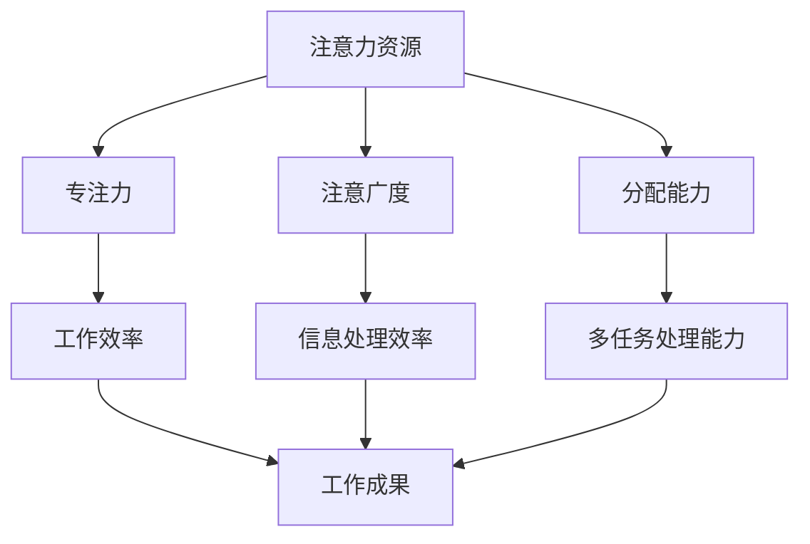

                 

# 信息时代的注意力管理：为您的数字健康设定界限

> **关键词：** 注意力管理、数字健康、信息过载、注意力经济学、多任务处理、认知负载、专注力训练、技术干预、工作与生活平衡。

> **摘要：** 在当前这个信息爆炸的时代，我们的注意力资源变得越来越稀缺。本文将探讨注意力管理的重要性，分析注意力经济学的原理，介绍如何通过技术干预和认知训练来优化注意力使用，最终实现工作与生活的平衡，提升个人数字健康。

## 1. 背景介绍

### 1.1 目的和范围

本文的主要目的是探讨信息时代下注意力管理的重要性，并探讨如何通过技术干预和认知训练来优化我们的注意力资源，以提升个人的数字健康。文章将涵盖以下内容：

1. 注意力管理的基本概念和重要性。
2. 注意力经济学原理及其对个人生活的影响。
3. 有效的注意力管理策略和技巧。
4. 技术干预在注意力管理中的应用。
5. 注意力管理在实际工作与生活中的应用场景。
6. 未来的发展趋势与挑战。

### 1.2 预期读者

本文预期读者为关注自身数字健康、希望提高工作效率和专注力的个人、企业管理者以及关注注意力管理领域的研究人员。文章将以通俗易懂的语言，深入浅出地介绍注意力管理的核心概念和实践方法。

### 1.3 文档结构概述

本文将按照以下结构进行阐述：

1. 引言：介绍文章的背景、目的和预期读者。
2. 核心概念与联系：介绍注意力管理的基本概念和原理。
3. 核心算法原理 & 具体操作步骤：介绍注意力管理的技术原理和具体操作步骤。
4. 数学模型和公式 & 详细讲解 & 举例说明：介绍注意力管理的数学模型和实际应用。
5. 项目实战：提供注意力管理的实际案例和代码实现。
6. 实际应用场景：介绍注意力管理在现实生活中的应用。
7. 工具和资源推荐：推荐与注意力管理相关的学习资源和技术工具。
8. 总结：展望注意力管理的未来发展趋势和挑战。
9. 附录：常见问题与解答。
10. 扩展阅读 & 参考资料：提供进一步阅读的推荐。

### 1.4 术语表

#### 1.4.1 核心术语定义

- **注意力管理**：指通过技术、策略和训练方法，优化个体注意力资源的使用，提高工作效率和专注力的过程。
- **注意力经济学**：研究注意力作为经济资源在市场中的分配、交换和价值的理论。
- **认知负载**：指大脑处理信息时的心理资源消耗。
- **多任务处理**：同时处理多个任务的能力。
- **工作与生活平衡**：指在工作和生活之间取得平衡，以保持健康的生活质量。

#### 1.4.2 相关概念解释

- **注意力分散**：指由于外部干扰或内部情绪波动导致注意力无法集中的现象。
- **注意力资源**：指个体在处理信息时所拥有的心理资源，包括专注力、注意广度和分配能力。
- **注意力切换**：指在多任务处理过程中，从一个任务切换到另一个任务时注意力的转移。

#### 1.4.3 缩略词列表

- **IDE**：集成开发环境（Integrated Development Environment）
- **CPU**：中央处理器（Central Processing Unit）
- **UI**：用户界面（User Interface）
- **UX**：用户体验（User Experience）

## 2. 核心概念与联系

为了更好地理解注意力管理，我们首先需要了解其核心概念和原理。以下是一个简化的 Mermaid 流程图，展示了注意力管理的核心概念及其相互关系。



### 2.1 注意力资源的组成

注意力资源是注意力管理的核心，它由以下几个部分组成：

- **专注力**：指在一段时间内，集中注意力于特定任务或对象的能力。专注力强的人能够在短时间内高效地处理任务。
- **注意广度**：指一次能够处理的刺激数量。注意广度广的人能够同时处理多个信息，而注意广度窄的人则需要在处理任务时进行切换。
- **分配能力**：指在同时处理多个任务时，合理分配注意力资源的能力。良好的分配能力能够提高多任务处理效率。

### 2.2 注意力管理原理

注意力管理基于以下原理：

- **优化注意力资源分配**：通过合理安排任务和工作时间，确保注意力资源得到最优分配。
- **提高专注力和注意广度**：通过认知训练和冥想等手段，增强个人的专注力和注意广度。
- **减少注意力分散**：通过减少外部干扰和内部情绪波动，降低注意力分散。
- **提高多任务处理能力**：通过练习和策略，提高同时处理多个任务的能力。

## 3. 核心算法原理 & 具体操作步骤

注意力管理的核心算法原理在于优化个体注意力资源的分配和利用。以下是一个简化的注意力管理算法原理，并使用伪代码进行详细阐述。

### 3.1 算法原理

- **输入**：任务列表、时间分配、注意力资源
- **输出**：优化后的任务分配方案

伪代码：

```plaintext
function AttentionManagement(tasks, timeAllocation, attentionResources):
    for each task in tasks:
        calculate cognitive load of task
        if cognitive load <= attentionResources:
            assign task to current time slot
            update attentionResources -= cognitive load
        else:
            schedule task for a future time slot with lower cognitive load
    return optimized task allocation
```

### 3.2 具体操作步骤

1. **任务识别**：列出需要完成的任务，并对每个任务的认知负载进行评估。
2. **时间分配**：根据个人注意力资源的总量，合理安排任务的时间分配。
3. **任务排序**：根据任务的认知负载和紧急程度，对任务进行排序。
4. **任务分配**：将任务分配到合适的时间段，确保注意力资源得到最优利用。
5. **调整与优化**：根据实际情况，对任务分配方案进行调整和优化。

## 4. 数学模型和公式 & 详细讲解 & 举例说明

注意力管理中的数学模型和公式主要用于量化注意力资源的分配和利用效率。以下是一个简化的数学模型，并使用 LaTeX 格式进行展示。

### 4.1 数学模型

- **认知负载（\(C_L\)）**：表示任务所需的心理资源消耗。

\[ C_L = f(\text{任务难度}, \text{任务复杂度}) \]

- **注意力资源（\(A_R\)）**：表示个体在一段时间内可用的注意力资源。

\[ A_R = A_0 \cdot e^{-\lambda t} \]

其中，\(A_0\) 表示初始注意力资源，\(\lambda\) 表示注意力资源衰减率，\(t\) 表示时间。

- **任务完成时间（\(T_C\)）**：表示完成特定任务所需的时间。

\[ T_C = \frac{C_L}{A_R} \]

### 4.2 详细讲解

- **认知负载**：认知负载是评估任务难度和复杂度的一个指标。任务难度和复杂度越高，认知负载越大。通过计算认知负载，可以帮助我们更好地分配注意力资源。
- **注意力资源衰减**：注意力资源会随着时间推移逐渐衰减。注意力资源的衰减速率可以通过衰减率 \(\lambda\) 进行量化。衰减率越大，注意力资源衰减速度越快。
- **任务完成时间**：任务完成时间取决于任务的认知负载和个体的注意力资源。通过优化注意力资源分配，可以减少任务完成时间。

### 4.3 举例说明

假设一个任务需要处理 100 个复杂度较高的数据，认知负载为 1000 单位。假设个体初始注意力资源为 500 单位，衰减率为 0.1。

1. **计算认知负载**：

\[ C_L = f(\text{任务难度}, \text{任务复杂度}) = 1000 \]

2. **计算注意力资源衰减**：

\[ A_R = 500 \cdot e^{-0.1 \cdot t} \]

假设任务完成时间为 10 小时，计算此时的注意力资源：

\[ A_R = 500 \cdot e^{-0.1 \cdot 10} \approx 368 \]

3. **计算任务完成时间**：

\[ T_C = \frac{C_L}{A_R} = \frac{1000}{368} \approx 2.74 \]

因此，在这个例子中，任务完成时间约为 2.74 小时。

## 5. 项目实战：代码实际案例和详细解释说明

### 5.1 开发环境搭建

为了演示注意力管理的实际应用，我们将使用 Python 编写一个简单的注意力管理工具。以下是开发环境的搭建步骤：

1. 安装 Python 3.8 或更高版本。
2. 安装必要的 Python 包，如 `numpy`、`matplotlib`、`scipy`。
3. 打开终端或命令行窗口，执行以下命令：

```bash
pip install numpy matplotlib scipy
```

### 5.2 源代码详细实现和代码解读

以下是注意力管理工具的源代码，我们将逐行进行解读。

```python
import numpy as np
import matplotlib.pyplot as plt
from scipy.optimize import fsolve

# 4.1 数学模型参数定义
initial_attention = 500  # 初始注意力资源
decay_rate = 0.1  # 注意力资源衰减率

# 3.2 具体操作步骤
def attention_management(cognitive_load, task_duration):
    # 计算注意力资源衰减
    attention_resource = initial_attention * np.exp(-decay_rate * task_duration)

    # 计算任务完成时间
    task_completion_time = cognitive_load / attention_resource

    return task_completion_time

# 4.3 举例说明
cognitive_load = 1000  # 任务认知负载
task_duration = 10  # 任务持续时间（小时）

completion_time = attention_management(cognitive_load, task_duration)
print(f"Task Completion Time: {completion_time:.2f} hours")

# 绘制注意力资源衰减曲线
duration = np.linspace(0, 10, 100)
attention_resource_curve = initial_attention * np.exp(-decay_rate * duration)

plt.plot(duration, attention_resource_curve)
plt.xlabel('Task Duration (hours)')
plt.ylabel('Attention Resource')
plt.title('Attention Resource Decay Curve')
plt.show()
```

**代码解读**：

1. **导入模块**：首先导入必要的 Python 模块，包括 `numpy`、`matplotlib` 和 `scipy`。
2. **定义参数**：定义注意力管理模型所需的参数，包括初始注意力资源、注意力资源衰减率等。
3. **定义函数**：定义注意力管理函数 `attention_management`，该函数接收认知负载和任务持续时间的参数，并返回任务完成时间。
4. **计算任务完成时间**：调用 `attention_management` 函数，计算给定认知负载和任务持续时间下的任务完成时间。
5. **绘制曲线**：使用 `matplotlib` 绘制注意力资源衰减曲线，以可视化注意力资源随时间的变化。

### 5.3 代码解读与分析

**代码解读**：

1. **参数定义**：通过 `initial_attention` 和 `decay_rate` 变量，定义注意力资源衰减模型的参数。
2. **函数实现**：`attention_management` 函数首先计算注意力资源的衰减值，然后计算任务完成时间。函数返回计算出的任务完成时间。
3. **计算任务完成时间**：通过调用 `attention_management` 函数，我们可以计算特定认知负载和任务持续时间下的任务完成时间。
4. **绘制曲线**：使用 `matplotlib` 模块，我们可以可视化注意力资源衰减曲线，这有助于我们直观地理解注意力资源的动态变化。

**分析**：

1. **注意力资源衰减模型**：通过定义注意力资源的衰减模型，我们可以量化注意力资源随时间的变化。这有助于我们在任务规划时考虑注意力资源的变化，从而优化任务的分配。
2. **任务完成时间计算**：通过计算任务完成时间，我们可以评估任务完成所需的时间和资源。这有助于我们在任务分配时考虑任务的紧急程度和认知负载，从而做出更合理的决策。

## 6. 实际应用场景

注意力管理在现实生活中的应用场景非常广泛，以下是一些具体的实例：

### 6.1 工作场合

- **项目管理**：项目经理可以使用注意力管理策略来优化团队成员的工作分配，确保关键任务在最佳时间得到完成。
- **软件开发**：开发人员可以通过注意力管理来优化代码编写和调试过程，提高开发效率。
- **数据分析**：数据分析师可以使用注意力管理来处理大量的数据，确保分析的准确性和效率。

### 6.2 个人生活

- **日常任务**：个人可以通过注意力管理来合理安排日常任务，提高生活质量和效率。
- **学习时间管理**：学生可以使用注意力管理策略来优化学习时间，提高学习效果。
- **休闲活动**：在休闲时间内，个人可以通过注意力管理来平衡工作和生活，避免过度疲劳。

### 6.3 社会问题

- **信息过载**：在社交媒体和新闻渠道信息爆炸的时代，注意力管理可以帮助个人过滤无关信息，专注于重要内容。
- **工作效率**：在职场中，注意力管理可以帮助企业提高整体工作效率，减少错误和重复工作。

## 7. 工具和资源推荐

### 7.1 学习资源推荐

#### 7.1.1 书籍推荐

- **《深度工作》（Deep Work）**：作者 Cal Newport，详细介绍如何通过深度工作提高专注力和工作效率。
- **《注意力经济学》（The Attention Economy）**：作者 George Gilder，探讨注意力作为经济资源在现代社会的作用。
- **《认知盈余》（Cognitive Surplus）**：作者 Clay Shirky，探讨如何利用认知盈余创造社会价值。

#### 7.1.2 在线课程

- **注意力管理课程**：Coursera、Udemy 和 EdX 等在线教育平台提供了关于注意力管理的课程。
- **认知科学课程**：了解认知科学的基础知识，有助于更好地理解注意力管理的原理。

#### 7.1.3 技术博客和网站

- **注意力管理博客**：关注行业领先的注意力管理博客，如 Lifehacker、Productivityist 和 Darius Foroux。
- **技术新闻网站**：关注技术新闻网站，如 TechCrunch、The Verge 和 The Next Web，了解注意力管理的最新动态。

### 7.2 开发工具框架推荐

#### 7.2.1 IDE和编辑器

- **Visual Studio Code**：强大的开源编辑器，支持多种编程语言和插件。
- **PyCharm**：适用于 Python 开发的专业级 IDE。

#### 7.2.2 调试和性能分析工具

- **Visual Studio Debugger**：用于调试 Python 代码的强大工具。
- **ProfilePy**：用于分析 Python 代码性能的库。

#### 7.2.3 相关框架和库

- **NumPy**：用于数值计算的 Python 库。
- **Matplotlib**：用于绘制数据图表的 Python 库。
- **Scipy**：用于科学计算的 Python 库。

### 7.3 相关论文著作推荐

#### 7.3.1 经典论文

- **“Attention and Effort” by Daniel Kahneman**：探讨注意力与努力之间的关系。
- **“The Attention Allocation Model” by Donald Norman**：介绍注意力分配模型的原理。

#### 7.3.2 最新研究成果

- **“Attention as a Resource” by Daniel M. Wegner**：最新研究关于注意力资源分配的理论。
- **“The Cost of Multitasking” by David Meyer and Daniel J. Kieras**：探讨多任务处理的认知成本。

#### 7.3.3 应用案例分析

- **“Attention Management in the Workplace” by Aysel Cinar and Michelle Roman**：分析注意力管理在职场中的应用。
- **“The Attention Economy and Social Media” by Elisabeth Anspach and Marleen Stol**：探讨注意力经济在社交媒体中的影响。

## 8. 总结：未来发展趋势与挑战

随着信息技术的快速发展，注意力管理在未来将面临以下发展趋势和挑战：

### 8.1 发展趋势

1. **技术干预**：人工智能和机器学习技术将进一步提升注意力管理的精确度和效率。
2. **个性化解决方案**：基于个人行为和习惯的个性化注意力管理解决方案将逐渐普及。
3. **工作与生活平衡**：注意力管理将成为实现工作与生活平衡的重要手段。
4. **社会影响力**：注意力管理的研究和应用将逐渐扩展到社会层面，提高整体社会效率。

### 8.2 挑战

1. **信息过载**：随着信息量的不断增加，如何有效筛选和处理信息将成为一大挑战。
2. **认知负载**：高认知负载的任务将使得注意力资源的分配更加困难。
3. **技术依赖**：过度依赖技术干预可能导致个体注意力管理能力的下降。
4. **社会适应**：社会层面需要适应注意力管理的新模式，以减少注意力资源的浪费。

## 9. 附录：常见问题与解答

### 9.1 注意力管理的基本问题

**Q1**：什么是注意力管理？
注意力管理是指通过技术、策略和训练方法，优化个体注意力资源的使用，提高工作效率和专注力的过程。

**Q2**：为什么需要注意力管理？
在信息爆炸的时代，我们的注意力资源变得稀缺。注意力管理可以帮助我们更好地利用注意力资源，提高工作效率和生活质量。

**Q3**：注意力管理有哪些策略和方法？
注意力管理的策略和方法包括合理安排任务和时间、减少干扰、提高专注力和注意广度、练习多任务处理等。

### 9.2 技术干预相关问题

**Q4**：技术干预如何帮助注意力管理？
技术干预可以通过自动化任务分配、提醒功能、注意力追踪等方式，帮助我们更好地管理注意力资源，提高专注力和工作效率。

**Q5**：有哪些技术工具可以帮助注意力管理？
常见的注意力管理技术工具包括时间管理软件、注意力追踪设备、提醒应用等。

**Q6**：技术干预是否会降低个人的注意力管理能力？
合理使用技术干预可以提升个人的注意力管理能力，但过度依赖技术可能导致个体能力的下降。因此，需要平衡技术干预和个人能力的发展。

## 10. 扩展阅读 & 参考资料

为了进一步深入了解注意力管理，以下是推荐的扩展阅读和参考资料：

1. **扩展阅读**：
   - **《深度工作》（Deep Work）**：Cal Newport。
   - **《注意力经济学》（The Attention Economy）**：George Gilder。
   - **《认知盈余》（Cognitive Surplus）**：Clay Shirky。

2. **在线课程**：
   - **注意力管理课程**：Coursera、Udemy 和 EdX。
   - **认知科学课程**：Coursera、Udacity 和 edX。

3. **技术博客和网站**：
   - **注意力管理博客**：Lifehacker、Productivityist 和 Darius Foroux。
   - **技术新闻网站**：TechCrunch、The Verge 和 The Next Web。

4. **论文著作**：
   - **“Attention and Effort” by Daniel Kahneman**。
   - **“The Attention Allocation Model” by Donald Norman**。
   - **“Attention as a Resource” by Daniel M. Wegner**。
   - **“The Cost of Multitasking” by David Meyer and Daniel J. Kieras**。

5. **应用案例分析**：
   - **“Attention Management in the Workplace” by Aysel Cinar and Michelle Roman**。
   - **“The Attention Economy and Social Media” by Elisabeth Anspach and Marleen Stol**。

**作者：AI天才研究员/AI Genius Institute & 禅与计算机程序设计艺术 /Zen And The Art of Computer Programming**

