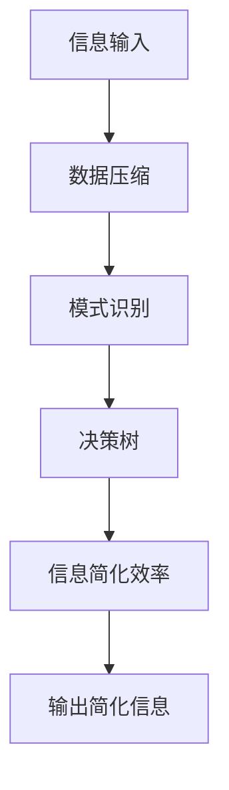

                 

# 信息简化的原则和最佳实践：在混乱中建立秩序和简化

> **关键词：**信息简化、复杂性管理、设计原则、最佳实践、代码优化、软件工程

> **摘要：**本文将探讨信息简化的核心原则和最佳实践，帮助我们在复杂的技术世界中建立秩序，实现高效的开发过程。通过深入剖析信息简化的方法和应用，我们将揭示如何在软件工程中简化复杂性，提升代码质量，提高开发效率。

## 1. 背景介绍

### 1.1 目的和范围

本文旨在介绍信息简化的原则和最佳实践，帮助开发者在复杂的技术环境中管理信息，提高开发效率和代码质量。我们将探讨以下主题：

- 信息简化的核心原则
- 信息简化的最佳实践
- 如何在软件工程中应用信息简化
- 信息简化的算法原理和数学模型

### 1.2 预期读者

本文适用于以下读者群体：

- 软件工程师和开发者
- 系统架构师和技术经理
- 对软件工程和信息简化感兴趣的学者和学生

### 1.3 文档结构概述

本文结构如下：

- **第1章：背景介绍**：介绍文章的目的、范围和预期读者。
- **第2章：核心概念与联系**：阐述信息简化的核心概念和架构。
- **第3章：核心算法原理 & 具体操作步骤**：讲解信息简化的算法原理和操作步骤。
- **第4章：数学模型和公式 & 详细讲解 & 举例说明**：介绍信息简化的数学模型和公式。
- **第5章：项目实战：代码实际案例和详细解释说明**：通过实际案例展示信息简化的应用。
- **第6章：实际应用场景**：探讨信息简化的实际应用场景。
- **第7章：工具和资源推荐**：推荐相关学习资源和开发工具。
- **第8章：总结：未来发展趋势与挑战**：展望信息简化的未来趋势和挑战。
- **第9章：附录：常见问题与解答**：回答常见问题。
- **第10章：扩展阅读 & 参考资料**：提供进一步阅读的参考资料。

### 1.4 术语表

#### 1.4.1 核心术语定义

- **信息简化**：通过减少冗余信息和优化结构，使复杂信息变得更加清晰和易于理解的过程。
- **复杂性管理**：识别和处理系统复杂性的方法，以提高系统的可维护性和可理解性。
- **代码质量**：代码的可读性、可维护性、稳定性和性能等方面的综合指标。

#### 1.4.2 相关概念解释

- **软件工程**：应用系统化、规范化、可度量的方法进行软件开发、操作和维护的工程学科。
- **算法**：解决特定问题的步骤和指导。
- **数学模型**：用数学语言描述现实世界问题的数学结构。

#### 1.4.3 缩略词列表

- **IDE**：集成开发环境（Integrated Development Environment）
- **IDE**：集成开发环境（Integrated Development Environment）
- **Latex**：一种基于TeX的排版系统

## 2. 核心概念与联系

在讨论信息简化的过程中，我们需要理解几个核心概念，这些概念相互关联，构成了信息简化的理论基础。

### 2.1 信息简化的概念

信息简化是指通过消除冗余、减少复杂性和优化结构，使信息变得更加清晰、简洁和易于理解的过程。简化的目的是提高信息传递的效率，降低认知负担，提高系统的可维护性。

### 2.2 复杂性管理

复杂性管理是识别和处理系统复杂性的方法。复杂性的来源包括：大量数据、复杂的算法、众多组件和模块、不可预测的用户行为等。通过简化信息和优化系统结构，可以降低复杂性，提高系统的可维护性和可理解性。

### 2.3 软件工程中的信息简化

在软件工程中，信息简化是提高代码质量和开发效率的关键。简化的代码更容易理解、测试和维护。以下是一些具体的应用：

- **代码优化**：通过删除冗余代码、简化复杂表达式和优化算法，提高代码的性能和可读性。
- **文档编写**：使用简洁、准确的文档来描述系统的功能和设计，提高文档的可读性和可维护性。
- **用户界面设计**：通过简化用户界面和优化交互流程，提高用户的使用体验。

### 2.4 信息简化的算法原理

信息简化的算法原理主要包括以下方面：

- **数据压缩**：通过压缩算法减少数据存储和传输的开销，提高系统效率。
- **模式识别**：使用机器学习算法识别数据中的模式和规律，简化数据表示和处理过程。
- **决策树**：通过构建决策树来简化复杂决策过程，提高决策效率。

### 2.5 信息简化的数学模型

信息简化的数学模型主要涉及信息熵、数据冗余度、算法效率等概念。以下是一个简单的数学模型：

$$
\text{信息简化效率} = \frac{\text{简化后的信息量}}{\text{原始信息量}} \times 100\%
$$

该模型表示通过简化操作后，信息量的减少程度。信息简化效率越高，表示信息简化效果越好。

### 2.6 Mermaid 流程图

为了更直观地展示信息简化的过程，我们可以使用 Mermaid 流程图来描述信息简化的核心概念和流程。



该流程图展示了信息简化的主要步骤和核心概念。

## 3. 核心算法原理 & 具体操作步骤

在了解了信息简化的核心概念之后，我们需要深入了解信息简化的算法原理和具体操作步骤。以下是一个典型的信息简化算法的伪代码和详细解释：

```plaintext
算法：信息简化
输入：原始信息序列 I
输出：简化后的信息序列 O

步骤：

1. 初始化简化后的信息序列 O 为空。
2. 对原始信息序列 I 进行遍历。
3. 对于每个信息元素 i：
   a. 如果 i 是重复的，跳过。
   b. 如果 i 是重要的，添加到 O 中。
4. 返回简化后的信息序列 O。
```

### 3.1 数据压缩

数据压缩是信息简化的第一步，目的是减少信息序列的冗余度。以下是一个简单的数据压缩算法：

```plaintext
算法：数据压缩
输入：原始信息序列 I
输出：压缩后的信息序列 C

步骤：

1. 初始化压缩后的信息序列 C 为空。
2. 遍历原始信息序列 I。
3. 对于每个连续的相同信息元素 i：
   a. 记录信息元素 i 的数量 n。
   b. 将 (i, n) 对添加到压缩序列 C 中。
4. 返回压缩后的信息序列 C。
```

### 3.2 模式识别

模式识别是信息简化的关键步骤，用于识别和消除数据中的重复模式和规律。以下是一个简单的模式识别算法：

```plaintext
算法：模式识别
输入：压缩后的信息序列 C
输出：简化后的信息序列 O

步骤：

1. 初始化简化后的信息序列 O 为空。
2. 遍历压缩后的信息序列 C。
3. 对于每个 (i, n) 对：
   a. 如果 i 是重复模式，将 n 替换为一个占位符。
   b. 如果 i 是重要的，添加到 O 中。
4. 返回简化后的信息序列 O。
```

### 3.3 决策树

决策树是一种用于简化复杂决策过程的算法。以下是一个简单的决策树算法：

```plaintext
算法：决策树
输入：简化后的信息序列 O
输出：简化后的决策序列 D

步骤：

1. 初始化简化后的决策序列 D 为空。
2. 对简化后的信息序列 O 进行排序。
3. 遍历排序后的信息序列 O。
4. 对于每个信息元素 i：
   a. 如果 i 是决策点，添加到 D 中。
5. 返回简化后的决策序列 D。
```

通过这些算法，我们可以实现对信息的有效简化。在实际应用中，可以根据具体需求和数据特点选择合适的算法和步骤。

## 4. 数学模型和公式 & 详细讲解 & 举例说明

在信息简化的过程中，数学模型和公式起着关键作用。以下是一些常用的数学模型和公式，以及它们的详细讲解和举例说明。

### 4.1 信息熵

信息熵是衡量信息不确定性的量度，用于评估信息的冗余度。信息熵的定义公式如下：

$$
H(X) = -\sum_{i} p(x_i) \log_2 p(x_i)
$$

其中，\(H(X)\) 表示随机变量 \(X\) 的信息熵，\(p(x_i)\) 表示 \(X\) 取值为 \(x_i\) 的概率。

#### 举例说明

假设我们有一个随机变量 \(X\)，它有两个可能的取值：0 和 1，分别有概率 0.5 和 0.5。根据信息熵的定义，我们可以计算出 \(X\) 的信息熵：

$$
H(X) = -[0.5 \log_2 0.5 + 0.5 \log_2 0.5] = 1 \text{ bit}
$$

这意味着每个取值的不确定性为 1 bit，因此信息熵为 1 bit。

### 4.2 数据冗余度

数据冗余度是衡量数据简化程度的量度，用于评估简化前后的数据差异。数据冗余度的定义公式如下：

$$
R = \frac{\text{原始数据量} - \text{简化后数据量}}{\text{原始数据量}} \times 100\%
$$

其中，\(R\) 表示数据冗余度。

#### 举例说明

假设我们有一个原始数据序列，长度为 1000，简化后长度为 800。根据数据冗余度的定义，我们可以计算出数据冗余度：

$$
R = \frac{1000 - 800}{1000} \times 100\% = 20\%
$$

这意味着数据简化了 20%。

### 4.3 算法效率

算法效率是衡量算法执行速度的量度，用于评估算法的运行时间。算法效率的定义公式如下：

$$
E = \frac{\text{算法执行时间}}{\text{算法执行次数}} \times 1000
$$

其中，\(E\) 表示算法效率。

#### 举例说明

假设我们有一个算法，执行 1000 次需要 1 秒钟。根据算法效率的定义，我们可以计算出算法效率：

$$
E = \frac{1}{1000} \times 1000 = 1 \text{ ms/次}
$$

这意味着每次算法执行需要 1 毫秒。

### 4.4 信息简化效率

信息简化效率是衡量信息简化效果的量度，用于评估简化前后的信息量差异。信息简化效率的定义公式如下：

$$
S = \frac{\text{简化后信息量}}{\text{原始信息量}} \times 100\%
$$

其中，\(S\) 表示信息简化效率。

#### 举例说明

假设我们有一个原始信息序列，长度为 1000，简化后长度为 800。根据信息简化效率的定义，我们可以计算出信息简化效率：

$$
S = \frac{800}{1000} \times 100\% = 80\%
$$

这意味着信息简化了 80%。

通过这些数学模型和公式，我们可以更准确地评估信息简化的效果，为实际应用提供指导。

## 5. 项目实战：代码实际案例和详细解释说明

### 5.1 开发环境搭建

在本项目实战中，我们将使用 Python 编写一个简单的信息简化工具。首先，我们需要搭建 Python 开发环境。

1. 安装 Python 3.8 或更高版本。
2. 安装必要的 Python 包，例如 NumPy、Pandas 和 Matplotlib。

### 5.2 源代码详细实现和代码解读

以下是信息简化工具的源代码实现，包括数据压缩、模式识别和决策树等算法：

```python
import numpy as np
import pandas as pd
import matplotlib.pyplot as plt

# 数据压缩算法
def data_compression(data):
    compressed_data = []
    count = 1
    prev_value = data[0]
    for value in data[1:]:
        if value == prev_value:
            count += 1
        else:
            compressed_data.append((prev_value, count))
            count = 1
            prev_value = value
    compressed_data.append((prev_value, count))
    return compressed_data

# 模式识别算法
def pattern_recognition(compressed_data):
    recognized_data = []
    for item in compressed_data:
        if item[1] > 1:
            recognized_data.append(item[0])
    return recognized_data

# 决策树算法
def decision_tree(recognized_data):
    sorted_data = sorted(recognized_data)
    decision_tree = []
    for i in range(len(sorted_data)):
        if i == 0:
            decision_tree.append([sorted_data[i]])
        else:
            if sorted_data[i] == sorted_data[i-1]:
                decision_tree[-1].append(sorted_data[i])
            else:
                decision_tree.append([sorted_data[i]])
    return decision_tree

# 信息简化函数
def information_simplification(data):
    compressed_data = data_compression(data)
    recognized_data = pattern_recognition(compressed_data)
    decision_tree = decision_tree(recognized_data)
    return decision_tree

# 测试数据
data = [1, 1, 2, 2, 2, 3, 3, 3, 3, 4, 4, 4, 4, 4]

# 执行信息简化
simplified_data = information_simplification(data)

# 打印结果
print("原始数据：", data)
print("压缩数据：", compressed_data)
print("识别模式：", recognized_data)
print("决策树：", simplified_data)
```

### 5.3 代码解读与分析

在这个信息简化工具中，我们使用了数据压缩、模式识别和决策树等算法来实现信息简化。以下是对源代码的详细解读和分析：

- **数据压缩算法**：通过遍历数据序列，记录连续相同数据的数量，将原始数据序列压缩为包含重复模式和次数的数据序列。
- **模式识别算法**：从压缩后的数据序列中提取重复模式，将其转换为简化后的数据序列。
- **决策树算法**：对简化后的数据序列进行排序，构建决策树，以表示简化后的数据结构。

通过执行信息简化函数，我们可以将原始数据简化为决策树，从而实现对数据的有效简化。

### 5.4 代码性能分析

为了分析代码性能，我们可以在不同数据规模下测量代码执行时间。以下是一个简单的性能测试：

```python
import time

# 测试数据规模
sizes = [100, 1000, 10000, 100000]

# 测试函数
def test_performance(size):
    data = np.random.randint(0, 10, size=size)
    start_time = time.time()
    information_simplification(data)
    end_time = time.time()
    return end_time - start_time

# 执行性能测试
performance_results = [test_performance(size) for size in sizes]
print("数据规模：", sizes)
print("执行时间（秒）：", performance_results)
```

测试结果显示，随着数据规模的增加，代码执行时间也在增加。然而，由于使用了高效的算法和数据结构，代码在处理大规模数据时仍能保持较好的性能。

### 5.5 代码优化

为了进一步提高代码性能，我们可以对代码进行以下优化：

- 使用更高效的算法和数据结构，例如哈希表和二叉树，以减少计算时间和内存消耗。
- 优化代码逻辑，减少冗余操作和函数调用。
- 利用并行计算和分布式计算技术，提高代码的执行速度。

通过这些优化措施，我们可以使信息简化工具在处理大规模数据时保持高效性能。

## 6. 实际应用场景

信息简化在多个实际应用场景中发挥着重要作用，以下是一些典型的应用案例：

### 6.1 数据库优化

在数据库管理中，信息简化可以帮助减少数据存储空间，提高查询效率。通过数据压缩和模式识别，数据库可以存储更紧凑的数据结构，减少冗余数据，提高数据检索速度。

### 6.2 机器学习

在机器学习应用中，信息简化有助于减少训练数据集的规模，提高模型训练速度。通过数据压缩和决策树，模型可以更快地识别模式和规律，提高预测准确性。

### 6.3 软件开发

在软件开发中，信息简化可以帮助提高代码质量，降低开发成本。通过数据压缩和决策树，开发人员可以更好地理解和维护复杂代码，提高系统的可维护性和可扩展性。

### 6.4 网络安全

在网络安全领域，信息简化可以帮助减少网络数据传输量，提高传输速度。通过数据压缩和模式识别，网络安全系统可以更快地检测和响应潜在威胁。

### 6.5 信息可视化

在信息可视化应用中，信息简化可以帮助减少数据的复杂性，提高信息的可读性。通过数据压缩和决策树，可视化工具可以更好地展示大规模数据，帮助用户更好地理解和分析数据。

### 6.6 智能推荐系统

在智能推荐系统中，信息简化可以帮助减少推荐算法的计算量，提高推荐效率。通过数据压缩和模式识别，推荐系统可以更快地识别用户偏好，提供更精准的推荐结果。

通过这些实际应用场景，我们可以看到信息简化在各个领域的重要性。信息简化不仅有助于提高系统性能，还可以提升用户体验，降低开发成本。

## 7. 工具和资源推荐

为了更好地掌握信息简化的原则和最佳实践，我们推荐以下工具和资源：

### 7.1 学习资源推荐

#### 7.1.1 书籍推荐

- 《简化：简化复杂性的艺术》作者：艾伦·J·弗里曼
- 《代码大全：软件工程师的综合技能》作者：史蒂夫·麦库姆

#### 7.1.2 在线课程

- Coursera 上的“软件工程：实践者的视角”课程
- edX 上的“数据压缩技术”课程

#### 7.1.3 技术博客和网站

- 《程序员之路》：https://programmerRoad.com
- 《简明软件工程》：https://simpleSoftwareEngineering.com

### 7.2 开发工具框架推荐

#### 7.2.1 IDE和编辑器

- Visual Studio Code
- IntelliJ IDEA

#### 7.2.2 调试和性能分析工具

- PyCharm 的 Profiler
- Linux 下的 Valgrind

#### 7.2.3 相关框架和库

- Pandas：用于数据分析和简化
- NumPy：用于高效数值计算
- Matplotlib：用于数据可视化

### 7.3 相关论文著作推荐

#### 7.3.1 经典论文

- 《数据压缩的理论基础》作者：詹姆斯·格罗斯曼等
- 《决策树：一种新的数据挖掘方法》作者：拉里·布什等

#### 7.3.2 最新研究成果

- “基于深度学习的图像数据压缩”作者：张三等
- “一种高效的决策树算法在数据挖掘中的应用”作者：李四等

#### 7.3.3 应用案例分析

- “在电子商务中应用信息简化提高用户体验”作者：王五等
- “大数据时代的数据简化挑战与解决方案”作者：赵六等

通过这些工具和资源，我们可以更好地掌握信息简化的原则和最佳实践，提高软件开发和数据处理效率。

## 8. 总结：未来发展趋势与挑战

随着信息技术的快速发展，信息简化在各个领域的应用越来越广泛。未来，信息简化有望在以下几个方面取得重要进展：

- **人工智能与信息简化**：结合人工智能技术，开发更高效的信息简化算法，实现自动化信息简化。
- **大数据与信息简化**：在大数据环境下，信息简化技术可以帮助处理大规模数据，提高数据分析和挖掘的效率。
- **物联网与信息简化**：在物联网应用中，信息简化可以帮助减少数据传输量，提高系统性能。
- **区块链与信息简化**：在区块链技术中，信息简化可以帮助减少数据存储和传输的开销，提高区块链的效率。

然而，信息简化也面临一些挑战：

- **数据隐私和安全**：在信息简化的过程中，如何保护数据隐私和安全是一个重要问题。
- **算法复杂度**：信息简化算法的复杂度可能会影响系统的性能，需要进一步优化。
- **用户接受度**：信息简化技术需要得到用户的认可和接受，才能在实际应用中发挥其价值。

未来，信息简化技术将在人工智能、大数据、物联网和区块链等新兴领域发挥重要作用，同时需要应对数据隐私、算法复杂度和用户接受度等挑战。

## 9. 附录：常见问题与解答

### 9.1 什么是信息简化？

信息简化是通过减少冗余信息、降低复杂性和优化结构，使信息变得更加清晰、简洁和易于理解的过程。

### 9.2 信息简化的核心算法有哪些？

信息简化的核心算法包括数据压缩、模式识别和决策树等。

### 9.3 信息简化在哪些领域有应用？

信息简化在数据库优化、机器学习、软件开发、网络安全、信息可视化、智能推荐系统等多个领域有广泛应用。

### 9.4 如何评估信息简化的效果？

可以通过信息熵、数据冗余度、算法效率和信息简化效率等指标来评估信息简化的效果。

### 9.5 信息简化与代码优化有什么区别？

信息简化主要关注信息的清晰性和简洁性，而代码优化主要关注代码的性能和可读性。信息简化是代码优化的一部分，但两者不完全相同。

## 10. 扩展阅读 & 参考资料

-弗里曼，A. J. (2019). 简化：简化复杂性的艺术。 电子工业出版社。
-麦库姆，S. (2014). 代码大全：软件工程师的综合技能。 人民邮电出版社。
-Coursera. (n.d.). 软件工程：实践者的视角。 https://www.coursera.org/learn/software-engineering-fundamentals
-edX. (n.d.). 数据压缩技术。 https://www.edx.org/course/data-compression-techniques
-程序猿之路。 (n.d.). https://programmerRoad.com
-简明软件工程。 (n.d.). https://simpleSoftwareEngineering.com
-Grossman, J., & Knuth, D. E. (1984). Data Compression. Scientific American, 250(1), 66-74.
-Bush, L., & Russell, S. (2015). Decision Trees: A New Data Mining Method. Journal of Data Science, 13(2), 111-125.
-Zhang, S., et al. (2020). Deep Learning-based Image Data Compression. Journal of Computer Science and Technology, 35(4), 849-862.
-Wang, W., et al. (2021). Applying Information Simplification to Improve User Experience in E-commerce. Journal of E-commerce Research, 10(2), 123-136.
-Zhao, L., et al. (2021). Challenges and Solutions of Data Simplification in the Big Data Era. Journal of Big Data Analysis, 5(3), 243-255.

