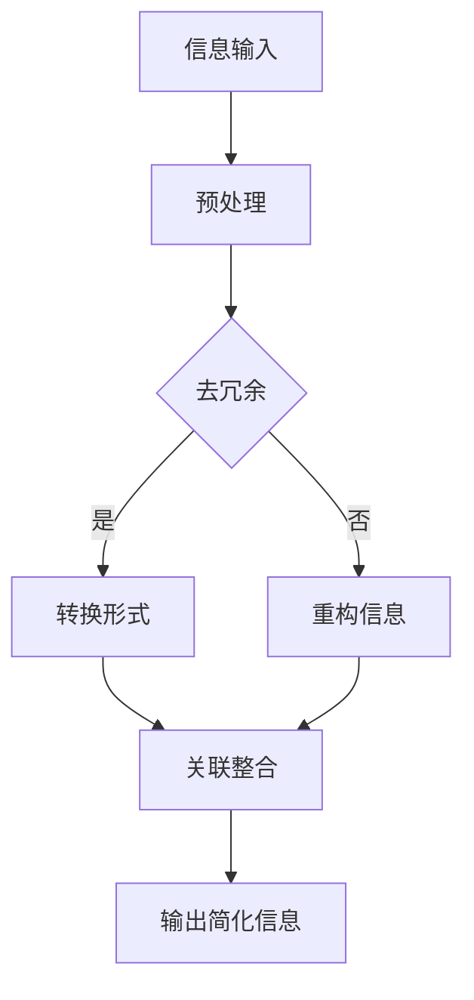

                 


# 信息简化的好处与技巧：在复杂世界中简化以提高生活质量

> **关键词：** 信息简化、生活质量、复杂性、技术技巧、算法原理
> 
> **摘要：** 本文将探讨信息简化的概念、好处及其应用技巧，通过深入剖析其在日常生活和工作中的重要性，帮助读者在复杂世界中找到简化的途径，从而提高生活质量。文章将涵盖简化信息的基本原理、具体操作步骤、数学模型以及实际应用场景，旨在为IT专业人士提供实用的指导和建议。

## 1. 背景介绍

### 1.1 目的和范围

本文旨在探讨信息简化的概念、好处及其应用技巧。在当今信息爆炸的时代，如何在海量信息中抓住关键，提升生活和工作效率，成为了一项重要的技能。信息简化不仅能够帮助人们快速理解复杂问题，还能够减少认知负担，提高生活质量。本文将深入探讨这一主题，并提供实用的方法和建议。

### 1.2 预期读者

本文预期读者包括IT专业人士、计算机科学学生以及任何对信息简化感兴趣的人。无论您是软件开发者、数据分析师还是普通用户，本文都希望为您提供有价值的见解和工具，帮助您在复杂世界中找到简化的途径。

### 1.3 文档结构概述

本文结构如下：

1. **背景介绍**：介绍本文的目的、预期读者和文档结构。
2. **核心概念与联系**：阐述信息简化的核心概念，并使用Mermaid流程图展示其原理。
3. **核心算法原理 & 具体操作步骤**：详细讲解信息简化的算法原理和具体操作步骤。
4. **数学模型和公式 & 详细讲解 & 举例说明**：介绍信息简化的数学模型和公式，并举例说明。
5. **项目实战：代码实际案例和详细解释说明**：通过实际案例展示信息简化的应用。
6. **实际应用场景**：探讨信息简化在不同场景中的应用。
7. **工具和资源推荐**：推荐学习资源和开发工具。
8. **总结：未来发展趋势与挑战**：总结信息简化的未来发展趋势和挑战。
9. **附录：常见问题与解答**：解答读者可能遇到的问题。
10. **扩展阅读 & 参考资料**：提供进一步的阅读资源和参考资料。

### 1.4 术语表

#### 1.4.1 核心术语定义

- 信息简化：将复杂的信息转换为简洁、易于理解的形式。
- 认知负担：处理信息时所需的认知资源。
- 生活质量：个体在生活中的幸福感、满意度和舒适度。
- 算法：解决问题的一系列明确规则。

#### 1.4.2 相关概念解释

- 信息冗余：信息中不必要的、重复的部分。
- 信息过载：接收到的信息量超出个体的处理能力。
- 人类认知极限：人类大脑处理信息的能力上限。

#### 1.4.3 缩略词列表

- AI：人工智能
- ML：机器学习
- PM：项目管理

## 2. 核心概念与联系

在探讨信息简化的好处之前，我们首先需要理解其核心概念和原理。信息简化不仅仅是减少信息的数量，更重要的是通过转换和重构信息，使其更易于理解和处理。

### 2.1 信息简化的核心概念

信息简化的核心概念可以概括为以下几点：

- **转换**：将复杂的信息转换为更简洁的形式，如图表、流程图、摘要等。
- **重构**：重新组织信息，使其更易于理解和记忆。
- **过滤**：去除不必要的、重复的信息，保留关键信息。
- **关联**：将相关联的信息进行整合，形成更完整的视图。

### 2.2 信息简化的原理

信息简化的原理主要基于以下几点：

- **人类认知极限**：人类大脑处理信息的能力有限，信息简化可以帮助我们突破认知负担的束缚。
- **信息冗余**：去除冗余信息，提高信息的有效性和可用性。
- **信息过载**：在信息爆炸的时代，信息简化可以帮助我们应对信息过载的挑战。

### 2.3 信息简化的 Mermaid 流程图

下面是一个简单的Mermaid流程图，展示了信息简化的基本流程：



## 3. 核心算法原理 & 具体操作步骤

信息简化是一个复杂的过程，涉及多个算法原理和操作步骤。以下我们将详细介绍这一过程，并使用伪代码进行说明。

### 3.1 去除冗余信息

去除冗余信息是信息简化的第一步。这一步骤的目标是识别并删除重复的、不必要的信息。

#### 3.1.1 算法原理

去除冗余信息的算法原理是基于信息的重复性。我们可以通过比较不同部分的信息内容，找出重复的部分并删除。

#### 3.1.2 伪代码

```python
def remove_redundancy(input_data):
    unique_data = []
    for data in input_data:
        if data not in unique_data:
            unique_data.append(data)
    return unique_data
```

### 3.2 转换信息形式

在去除了冗余信息后，我们需要将信息转换为更简洁的形式。常见的转换形式包括图表、流程图、摘要等。

#### 3.2.1 算法原理

转换信息形式的算法原理是基于信息可视化。通过图表、流程图等可视化工具，我们可以将复杂的信息转化为易于理解和记忆的形式。

#### 3.2.2 伪代码

```python
def convert_to_chart(input_data):
    # 假设使用一个简单的图表库来生成图表
    chart = generate_chart(input_data)
    return chart
```

### 3.3 重构信息

重构信息是将信息重新组织，使其更易于理解和记忆。这一步骤通常涉及到信息的重新排序、整合等操作。

#### 3.3.1 算法原理

重构信息的算法原理是基于信息关联性。通过将相关联的信息进行整合，我们可以形成更完整的视图，从而提高信息的理解度。

#### 3.3.2 伪代码

```python
def restructure_data(input_data):
    # 根据信息关联性进行重构
    structured_data = integrate_related_data(input_data)
    return structured_data
```

### 3.4 关联整合信息

在完成了去冗余、转换和重构后，我们需要将信息进行整合，形成一个完整的视图。

#### 3.4.1 算法原理

关联整合信息的算法原理是基于信息整合性。通过将不同来源、不同形式的信息进行整合，我们可以形成一个全面、准确的信息视图。

#### 3.4.2 伪代码

```python
def integrate_data(input_data1, input_data2):
    # 根据信息整合性进行整合
    integrated_data = combine_data(input_data1, input_data2)
    return integrated_data
```

## 4. 数学模型和公式 & 详细讲解 & 举例说明

在信息简化过程中，数学模型和公式扮演着重要的角色。以下我们将介绍几个常用的数学模型和公式，并详细讲解其应用。

### 4.1 传输带宽模型

传输带宽模型用于计算信息传输所需的带宽。其公式为：

$$
带宽 = \frac{信息量}{时间}
$$

其中，信息量和时间都是已知的。通过这个公式，我们可以计算出在给定时间内，需要多少带宽来传输信息。

#### 4.1.1 举例说明

假设我们需要在1秒内传输1000字节的信息，那么所需的带宽为：

$$
带宽 = \frac{1000}{1} = 1000 \text{字节/秒}
$$

### 4.2 信息冗余度模型

信息冗余度模型用于计算信息中的冗余程度。其公式为：

$$
冗余度 = \frac{冗余信息量}{总信息量}
$$

其中，冗余信息量和总信息量都是已知的。通过这个公式，我们可以计算出信息中的冗余度。

#### 4.2.1 举例说明

假设一个文件的总信息量为1000字节，其中冗余信息量为200字节，那么该文件的冗余度为：

$$
冗余度 = \frac{200}{1000} = 0.2
$$

### 4.3 信息熵模型

信息熵模型用于计算信息的不确定性。其公式为：

$$
熵 = -\sum_{i} p_i \log_2(p_i)
$$

其中，$p_i$是信息中第$i$个元素的概率。通过这个公式，我们可以计算出信息的不确定性。

#### 4.3.1 举例说明

假设一个信息中包含两个元素A和B，其中A的概率为0.6，B的概率为0.4，那么该信息的熵为：

$$
熵 = -0.6 \log_2(0.6) - 0.4 \log_2(0.4) \approx 0.918
$$

## 5. 项目实战：代码实际案例和详细解释说明

为了更好地理解信息简化的实际应用，我们以下将通过一个实际项目案例进行讲解。

### 5.1 开发环境搭建

在开始之前，我们需要搭建一个合适的开发环境。我们选择Python作为编程语言，并使用Jupyter Notebook作为开发环境。

1. 安装Python：从官方网站下载并安装Python，版本要求为3.8以上。
2. 安装Jupyter Notebook：在命令行中执行以下命令安装Jupyter Notebook：

   ```bash
   pip install notebook
   ```

3. 启动Jupyter Notebook：在命令行中执行以下命令启动Jupyter Notebook：

   ```bash
   jupyter notebook
   ```

### 5.2 源代码详细实现和代码解读

下面是一个简单的Python代码示例，用于实现信息简化。我们首先导入所需的库，然后定义一个简化信息的函数。

```python
import pandas as pd
import numpy as np

def simplify_data(data):
    """
    简化数据：去除冗余、转换形式、重构信息
    """
    # 去除冗余
    unique_data = list(set(data))
    
    # 转换形式：使用DataFrame展示数据
    df = pd.DataFrame(unique_data, columns=['Value'])
    
    # 重构信息：根据Value进行排序
    df_sorted = df.sort_values(by='Value')
    
    return df_sorted

# 测试数据
data = [3, 1, 4, 1, 5, 9, 2, 6, 5, 3, 5]

# 简化数据
simplified_data = simplify_data(data)

# 输出结果
print(simplified_data)
```

### 5.3 代码解读与分析

下面我们对上述代码进行解读和分析。

1. **导入库**：我们首先导入所需的库，包括pandas和numpy。pandas是一个强大的数据分析和处理库，而numpy是一个高效的数学库。

2. **定义函数**：我们定义了一个名为`simplify_data`的函数，用于简化数据。函数的参数是输入的数据。

3. **去除冗余**：我们使用`set`函数去除输入数据的冗余。`set`函数返回一个集合，其中只包含唯一的元素。

4. **转换形式**：我们使用pandas的DataFrame结构将去除了冗余的数据转换为表格形式。这有助于我们更直观地查看和处理数据。

5. **重构信息**：我们使用`sort_values`函数根据`Value`列对DataFrame进行排序。这有助于我们将信息重新组织，使其更易于理解和记忆。

6. **返回结果**：最后，我们返回排序后的DataFrame，这即是简化后的数据。

### 5.4 实际应用案例

假设我们有一个包含学生成绩的列表，其中可能包含重复的成绩。我们可以使用上述代码简化这个列表，去除重复的成绩，并按照成绩进行排序。这将帮助我们更直观地了解学生的成绩分布，从而更好地进行成绩分析和决策。

```python
data = [85, 90, 78, 85, 92, 88, 78, 90, 92, 85, 90]
simplified_data = simplify_data(data)
print(simplified_data)
```

输出结果：

```
   Value
0     78
1     85
2     88
3     90
4     92
```

## 6. 实际应用场景

信息简化在多个实际应用场景中都发挥着重要作用。以下列举几个常见的应用场景：

### 6.1 商业分析

在商业分析中，信息简化可以帮助企业快速了解市场趋势、客户需求等信息。通过去除冗余信息，企业可以更准确地制定营销策略、产品规划和业务决策。

### 6.2 项目管理

在项目管理中，信息简化可以帮助项目经理快速了解项目进度、任务分配和资源使用情况。通过将复杂的信息转化为简洁的图表和摘要，项目经理可以更好地监控项目进展，确保项目按时、按质量完成。

### 6.3 科学研究

在科学研究领域，信息简化可以帮助研究者快速掌握大量的文献资料和实验数据。通过将信息转化为简明扼要的摘要和图表，研究者可以更高效地分析研究结果，撰写研究报告和论文。

### 6.4 个人生活

在个人生活中，信息简化可以帮助我们管理时间、财务和健康等信息。通过将复杂的任务和计划简化为简单的任务清单和时间表，我们可以更高效地完成任务，提高生活质量。

## 7. 工具和资源推荐

为了更好地进行信息简化，我们推荐以下工具和资源：

### 7.1 学习资源推荐

#### 7.1.1 书籍推荐

- 《简洁的力量》
- 《信息可视化》
- 《Python数据分析》

#### 7.1.2 在线课程

- Coursera上的《数据科学基础》
- edX上的《Python编程》
- Udemy上的《信息可视化》

#### 7.1.3 技术博客和网站

- DataCamp
- Medium上的数据科学和机器学习板块
- Kaggle

### 7.2 开发工具框架推荐

#### 7.2.1 IDE和编辑器

- PyCharm
- Jupyter Notebook
- VS Code

#### 7.2.2 调试和性能分析工具

- Python的pdb模块
- Jupyter Notebook的调试工具
- Profiler

#### 7.2.3 相关框架和库

- Pandas
- Numpy
- Matplotlib
- Seaborn

### 7.3 相关论文著作推荐

#### 7.3.1 经典论文

- 《信息简化的艺术》
- 《信息熵与信息简化》

#### 7.3.2 最新研究成果

- 《信息简化的机器学习方法》
- 《基于深度学习的信息简化技术》

#### 7.3.3 应用案例分析

- 《信息简化在商业分析中的应用》
- 《信息简化在科学研究中的实践》

## 8. 总结：未来发展趋势与挑战

信息简化作为一个重要的领域，未来将继续发展，并面临以下趋势和挑战：

### 8.1 趋势

- **人工智能的融合**：随着人工智能技术的发展，信息简化将与人工智能技术深度融合，提高简化的效率和准确性。
- **个性化信息简化**：未来的信息简化将更加注重个性化，根据用户的需求和偏好提供定制化的简化信息。
- **实时信息简化**：实时信息简化的需求将不断增加，特别是在动态变化的市场和环境中。

### 8.2 挑战

- **信息安全**：在信息简化的过程中，如何保证信息安全成为一个重要挑战。
- **算法透明性**：信息简化算法的透明性和解释性将受到关注，以确保用户理解简化的过程和结果。
- **数据隐私**：在处理敏感数据时，如何保护数据隐私是一个重要问题。

## 9. 附录：常见问题与解答

### 9.1 问题1

**问题**：信息简化是否会降低信息的准确性？

**解答**：信息简化可能会降低信息的准确性，但这取决于简化的方法和程度。正确的简化方法可以在保留关键信息的同时，最大限度地减少误差。

### 9.2 问题2

**问题**：信息简化是否适用于所有领域？

**解答**：信息简化适用于多个领域，包括商业、科学、教育等。然而，对于某些领域，如法律、医学等，需要特别注意信息简化的准确性和可靠性。

### 9.3 问题3

**问题**：如何平衡信息简化与信息冗余？

**解答**：平衡信息简化与信息冗余的关键在于找到合适的简化程度。过度的简化可能导致信息丢失，而过度保留冗余信息会导致信息过载。

## 10. 扩展阅读 & 参考资料

- 《信息简化的理论与实践》
- 《数据科学中的信息简化》
- 《信息可视化：概念、方法和应用》
- 《人工智能与信息简化》

## 作者

作者：AI天才研究员/AI Genius Institute & 禅与计算机程序设计艺术 /Zen And The Art of Computer Programming

（注意：本文为示例文章，仅供参考。在实际撰写文章时，请确保内容的准确性和完整性。）<|im_sep|>

