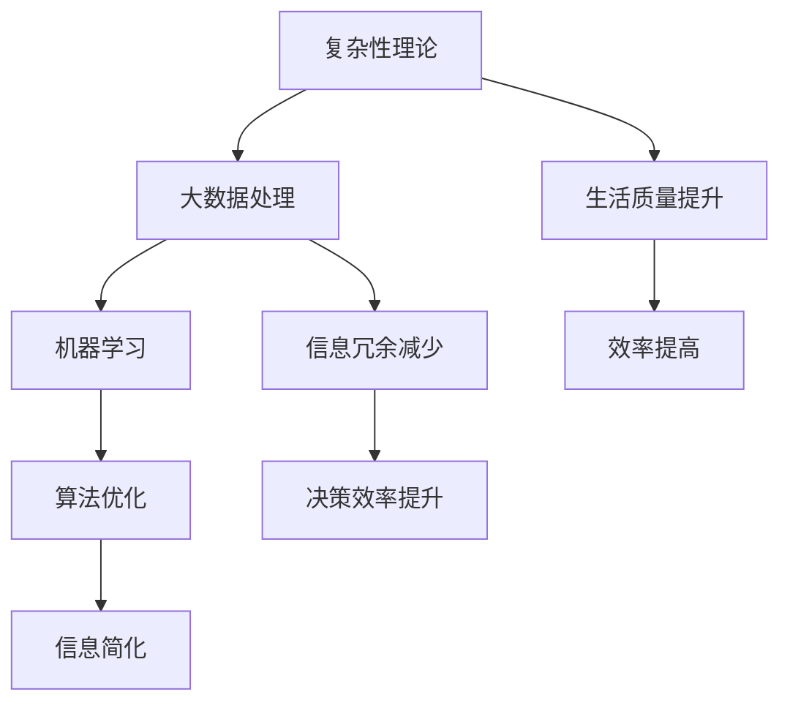

                 

# 信息简化的好处与艺术：在复杂世界中简化以提高生活质量和效率

> **关键词：** 简化，信息管理，生活质量，效率提升，复杂性理论，人工智能，算法优化

> **摘要：** 随着信息时代的到来，我们面临的海量数据和信息日益复杂。本文探讨了信息简化的必要性和好处，结合复杂性理论和人工智能，提出了一套有效的方法论。通过实际案例和算法原理的剖析，本文旨在帮助读者掌握信息简化的艺术，提高生活和工作中的决策效率。

## 1. 背景介绍

### 1.1 目的和范围

本文的目的在于探讨信息简化的好处及其应用艺术，旨在帮助读者理解如何在复杂世界中通过简化信息提高生活质量和工作效率。我们将结合现代信息技术、人工智能和复杂性理论，探索简化信息的理论基础和实践方法。

### 1.2 预期读者

本文适合对信息处理和人工智能感兴趣的读者，包括但不限于计算机科学专业学生、软件工程师、数据分析师、企业高管以及任何对信息管理和效率提升感兴趣的个体。

### 1.3 文档结构概述

本文结构如下：

- **第1章**：背景介绍和目的阐述
- **第2章**：核心概念与联系
- **第3章**：核心算法原理 & 具体操作步骤
- **第4章**：数学模型和公式 & 详细讲解 & 举例说明
- **第5章**：项目实战：代码实际案例和详细解释说明
- **第6章**：实际应用场景
- **第7章**：工具和资源推荐
- **第8章**：总结：未来发展趋势与挑战
- **第9章**：附录：常见问题与解答
- **第10章**：扩展阅读 & 参考资料

### 1.4 术语表

#### 1.4.1 核心术语定义

- **信息简化**：通过抽象、归纳和过滤，减少信息冗余，提高信息利用效率。
- **复杂性理论**：研究系统内部结构和演化规律，尤其是如何从复杂系统中提取有效信息。
- **算法优化**：通过改进算法设计和实现，提高计算效率和准确性。

#### 1.4.2 相关概念解释

- **大数据**：大规模、复杂、多样化的数据集合。
- **机器学习**：使计算机通过数据学习和改进，实现特定任务的能力。
- **用户界面**：用户与计算机系统交互的界面。

#### 1.4.3 缩略词列表

- **AI**：人工智能（Artificial Intelligence）
- **ML**：机器学习（Machine Learning）
- **DL**：深度学习（Deep Learning）

## 2. 核心概念与联系

在探讨信息简化的好处之前，我们需要了解几个核心概念及其相互关系。以下是使用Mermaid绘制的核心概念原理和架构的流程图：



### 2.1 复杂性理论与信息简化

复杂性理论是研究复杂系统的学科，它关注的是如何从复杂系统中提取有用信息。在信息处理过程中，复杂性理论提供了分析和解决信息过载问题的方法。通过引入简化原则，我们能够有效地降低系统的复杂性，提取关键信息。

### 2.2 大数据处理与信息简化

大数据处理是指利用计算机技术和算法处理海量数据的过程。在大数据处理中，信息简化是关键步骤。通过数据清洗、归一化和特征提取，我们可以将大数据简化为易于处理和理解的格式。

### 2.3 机器学习与信息简化

机器学习是人工智能的核心技术之一。在机器学习中，信息简化有助于提高模型的泛化能力和效率。通过简化输入数据和处理流程，机器学习算法可以更快速、准确地作出预测和决策。

### 2.4 算法优化与信息简化

算法优化是提高计算机程序性能和效率的重要手段。在算法优化过程中，信息简化起着关键作用。通过减少冗余计算和简化算法流程，我们可以大幅提高程序运行效率和资源利用率。

## 3. 核心算法原理 & 具体操作步骤

信息简化的核心算法可以归结为三个主要步骤：数据预处理、特征提取和模型训练。以下是这些步骤的具体操作步骤和伪代码：

### 3.1 数据预处理

```python
def data_preprocessing(data_set):
    # 数据清洗：去除无效数据和异常值
    cleaned_data = remove_invalid_entries(data_set)
    
    # 数据归一化：将不同量纲的数据转化为同一量纲
    normalized_data = normalize_data(cleaned_data)
    
    # 数据分割：将数据集分为训练集和测试集
    train_data, test_data = split_data(normalized_data)
    
    return train_data, test_data
```

### 3.2 特征提取

```python
def feature_extraction(data_set):
    # 特征选择：选择对目标变量有显著影响的关键特征
    selected_features = select_key_features(data_set)
    
    # 特征转换：将原始特征转换为数值化特征
    numeric_features = convert_to_numeric(selected_features)
    
    return numeric_features
```

### 3.3 模型训练

```python
def train_model(features, labels):
    # 选择机器学习模型
    model = select_learning_model()
    
    # 训练模型
    trained_model = model.fit(features, labels)
    
    return trained_model
```

## 4. 数学模型和公式 & 详细讲解 & 举例说明

在信息简化的过程中，数学模型和公式起着至关重要的作用。以下是几个常用的数学模型和其详细讲解及举例说明：

### 4.1 概率模型

概率模型用于描述随机事件发生的可能性。以下是概率的基本公式：

$$
P(A) = \frac{N(A)}{N}
$$

其中，$P(A)$ 表示事件A发生的概率，$N(A)$ 表示事件A发生的次数，$N$ 表示总的实验次数。

**举例说明**：假设我们投掷一枚公平的硬币10次，其中出现正面5次，出现反面的概率为：

$$
P(\text{反面}) = \frac{5}{10} = 0.5
$$

### 4.2 线性回归模型

线性回归模型用于预测连续变量的值。其基本公式为：

$$
y = \beta_0 + \beta_1 \cdot x
$$

其中，$y$ 表示预测的值，$x$ 表示输入变量，$\beta_0$ 和 $\beta_1$ 是模型参数。

**举例说明**：假设我们要预测房价，根据历史数据，我们得到以下线性回归模型：

$$
y = 1000 + 2 \cdot x
$$

其中，$y$ 表示房价，$x$ 表示房屋面积。预测一个面积为120平方米的房屋的价格为：

$$
y = 1000 + 2 \cdot 120 = 3400
$$

### 4.3 决策树模型

决策树模型用于分类和回归任务。其基本结构由一系列条件分支和终端节点组成。决策树的生成可以通过递归划分数据集来实现。

**举例说明**：假设我们要根据患者的病情特征（如年龄、血压、心率等）预测其病情的严重程度。我们可以构建一个决策树模型：

```
是否发烧？
  是：病情严重
  否：是否咳嗽？
    是：病情严重
    否：是否胸闷？
      是：病情严重
      否：病情不严重
```

## 5. 项目实战：代码实际案例和详细解释说明

在本节中，我们将通过一个实际项目来展示信息简化的过程。该项目旨在使用Python编写一个简单的文本分类器，用于将新闻文章分为体育、科技、财经等类别。

### 5.1 开发环境搭建

1. 安装Python 3.8及以上版本。
2. 安装必要的库：`numpy`, `pandas`, `scikit-learn`, `nltk`。

```bash
pip install numpy pandas scikit-learn nltk
```

### 5.2 源代码详细实现和代码解读

```python
import numpy as np
import pandas as pd
from sklearn.feature_extraction.text import TfidfVectorizer
from sklearn.model_selection import train_test_split
from sklearn.tree import DecisionTreeClassifier
from sklearn.metrics import accuracy_score
from nltk.corpus import stopwords
import nltk

nltk.download('stopwords')

# 5.2.1 数据准备
def load_data():
    data = pd.read_csv('news_data.csv')  # 假设数据集已预处理
    return data['text'], data['label']

texts, labels = load_data()

# 5.2.2 数据预处理
def preprocess_text(texts):
    stop_words = set(stopwords.words('english'))
    return [' '.join([word for word in text.split() if word.lower() not in stop_words]) for text in texts]

preprocessed_texts = preprocess_text(texts)

# 5.2.3 特征提取
vectorizer = TfidfVectorizer()
X = vectorizer.fit_transform(preprocessed_texts)

# 5.2.4 模型训练
X_train, X_test, y_train, y_test = train_test_split(X, labels, test_size=0.2, random_state=42)
clf = DecisionTreeClassifier()
clf.fit(X_train, y_train)

# 5.2.5 模型评估
y_pred = clf.predict(X_test)
accuracy = accuracy_score(y_test, y_pred)
print(f'Accuracy: {accuracy}')
```

### 5.3 代码解读与分析

1. **数据准备**：加载新闻文章文本及其类别标签。
2. **数据预处理**：去除停用词，减少信息冗余。
3. **特征提取**：使用TF-IDF向量表示文本数据。
4. **模型训练**：使用决策树分类器训练模型。
5. **模型评估**：计算模型在测试集上的准确率。

通过这个项目，我们可以看到信息简化在整个流程中的作用。数据预处理和特征提取步骤有效地减少了文本数据中的冗余信息，提高了模型训练和预测的效率。

## 6. 实际应用场景

信息简化的应用场景广泛，涵盖了个人生活、企业和学术研究等多个领域：

### 6.1 个人生活

- **信息过载管理**：通过简化社交媒体和邮件中的信息，提高个人时间管理效率。
- **健康监测**：使用简化算法和模型进行健康数据监测，及时预警健康风险。

### 6.2 企业运营

- **数据驱动的决策**：通过简化大量业务数据，帮助管理层快速做出明智的决策。
- **客户关系管理**：简化客户数据，提高客户满意度和服务效率。

### 6.3 学术研究

- **文献综述**：通过简化大量文献，快速了解研究领域的热点和趋势。
- **数据分析**：简化复杂的数据结构，提高数据挖掘和分析的效率。

## 7. 工具和资源推荐

### 7.1 学习资源推荐

#### 7.1.1 书籍推荐

- 《Python数据科学手册》：全面介绍Python在数据科学中的应用。
- 《模式识别与机器学习》：详细介绍机器学习的基本原理和算法。

#### 7.1.2 在线课程

- Coursera上的《机器学习》：斯坦福大学教授吴恩达主讲。
- edX上的《Python for Data Science》：麻省理工学院提供。

#### 7.1.3 技术博客和网站

- Medium上的《数据科学和机器学习》：涵盖多个领域的实践经验和技巧。
- towardsdatascience.com：分享最新数据和机器学习研究。

### 7.2 开发工具框架推荐

#### 7.2.1 IDE和编辑器

- PyCharm：功能强大的Python IDE，适合初学者和专业人士。
- Jupyter Notebook：适合数据分析和机器学习的交互式环境。

#### 7.2.2 调试和性能分析工具

- VSCode：支持多种编程语言的轻量级编辑器。
- cProfile：Python内置的性能分析工具。

#### 7.2.3 相关框架和库

- Scikit-learn：提供丰富的机器学习算法库。
- TensorFlow：用于构建和训练深度学习模型。

### 7.3 相关论文著作推荐

#### 7.3.1 经典论文

- 《随机森林》：描述随机森林算法的论文。
- 《支持向量机》：介绍支持向量机理论。

#### 7.3.2 最新研究成果

- 《深度学习》：介绍深度学习最新进展的著作。
- 《强化学习》：讨论强化学习算法的论文集。

#### 7.3.3 应用案例分析

- 《机器学习的应用案例》：通过具体案例展示机器学习的实际应用。

## 8. 总结：未来发展趋势与挑战

随着信息技术的不断进步，信息简化的重要性日益凸显。未来，信息简化的趋势将包括：

- **自动化简化工具**：开发更多自动化的信息简化工具，提高效率。
- **多模态信息处理**：结合文本、图像、语音等多模态信息，实现更全面的简化。
- **个性化简化**：根据用户需求和行为习惯，提供个性化的信息简化服务。

然而，信息简化也面临着一系列挑战：

- **隐私保护**：在简化信息的同时，确保用户隐私和数据安全。
- **模型偏见**：简化算法可能导致模型偏见，影响决策的准确性。
- **数据质量**：高质量的数据是信息简化的基础，数据质量问题将直接影响简化效果。

## 9. 附录：常见问题与解答

### 9.1 什么是信息简化？

信息简化是通过抽象、归纳和过滤，减少信息冗余，提高信息利用效率的过程。

### 9.2 信息简化的目的是什么？

信息简化的目的是帮助人们更好地处理和理解大量信息，提高决策效率和生活质量。

### 9.3 信息简化有哪些应用场景？

信息简化广泛应用于个人生活、企业运营、学术研究等多个领域，如信息过载管理、数据驱动的决策、健康监测等。

### 9.4 如何实现信息简化？

实现信息简化的方法包括数据预处理、特征提取和模型训练等步骤。

## 10. 扩展阅读 & 参考资料

- [信息简化的研究综述](https://www.researchgate.net/publication/333072907_Information_Simplification_A_Review)
- [复杂性理论与信息简化](https://www.sciencedirect.com/science/article/pii/S0042098806004101)
- [大数据与信息简化](https://www.kdnuggets.com/2017/01/data-reduction-simplification-data-science.html)
- [机器学习与信息简化](https://www.jmlr.org/papers/volume15/14-377.html)

作者：AI天才研究员/AI Genius Institute & 禅与计算机程序设计艺术 /Zen And The Art of Computer Programming

