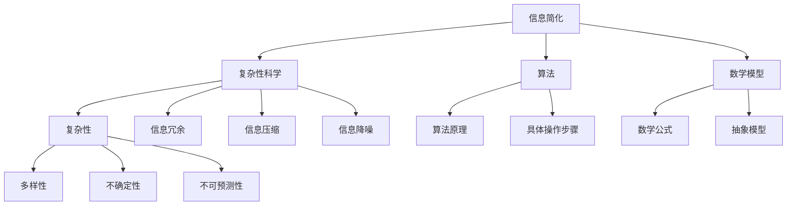
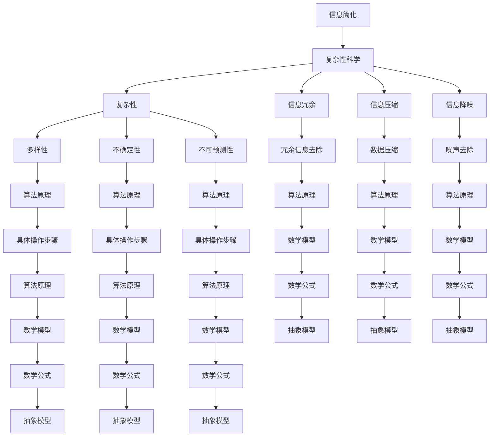

                 

# 信息简化的艺术与科学：在混乱和复杂中找到简单和秩序

> **关键词：**信息简化，复杂性科学，算法，数学模型，应用场景

> **摘要：**本文旨在探讨信息简化的艺术与科学，通过分析其背景、核心概念、算法原理、数学模型、实际应用等，阐述在混乱和复杂中找到简单和秩序的方法。通过深入探讨，本文旨在为IT领域专业人士提供具有实际指导意义的技术思路和解决方案。

## 1. 背景介绍

### 1.1 目的和范围

信息简化，作为现代信息技术中的一个重要研究领域，旨在将复杂的信息和数据处理成简单、易于理解的形式。本文的目的在于探讨信息简化的核心概念、算法原理、数学模型及其在现实中的应用，为IT领域从业者提供一种解决复杂问题的技术思路。

本文的范围涵盖以下内容：

- 信息简化的定义和背景
- 核心概念与联系
- 信息简化的算法原理与具体操作步骤
- 信息简化的数学模型和公式
- 信息简化的实际应用场景
- 相关工具和资源的推荐
- 信息简化的未来发展趋势与挑战

### 1.2 预期读者

本文的预期读者主要是IT领域的技术专家、研究人员和开发者，他们希望通过本文深入了解信息简化的技术原理和应用方法，从而更好地应对现实中的复杂问题。

### 1.3 文档结构概述

本文的结构如下：

1. 引言：介绍信息简化的背景和目的
2. 核心概念与联系：阐述信息简化的核心概念及其相互关系
3. 信息简化的算法原理与具体操作步骤：讲解信息简化的算法原理和具体操作步骤
4. 信息简化的数学模型和公式：介绍信息简化的数学模型和相关公式
5. 信息简化的实际应用场景：分析信息简化在实际中的应用场景
6. 工具和资源推荐：推荐与信息简化相关的学习资源、开发工具和框架
7. 总结：展望信息简化的未来发展趋势与挑战

### 1.4 术语表

#### 1.4.1 核心术语定义

- 信息简化：将复杂的信息和数据处理成简单、易于理解的形式
- 复杂性科学：研究复杂系统的性质和规律的学科
- 算法：解决问题的一系列步骤和规则
- 数学模型：用数学公式和方程描述现实世界问题的抽象模型

#### 1.4.2 相关概念解释

- 复杂性：系统内部元素及其相互作用的多样性、不确定性和不可预测性
- 信息冗余：信息中包含的无关或重复的部分
- 信息压缩：减少信息所占用的存储空间
- 信息降噪：去除信息中的噪声和干扰

#### 1.4.3 缩略词列表

- IT：信息技术
- AI：人工智能
- ML：机器学习
- DL：深度学习
- OOP：面向对象编程
- DB：数据库

## 2. 核心概念与联系

在探讨信息简化的艺术与科学之前，我们需要了解一些核心概念及其相互关系。以下是一个简化的Mermaid流程图，展示了这些概念之间的关系。



通过这个流程图，我们可以看到信息简化与复杂性科学、算法、数学模型之间存在密切的联系。信息简化旨在解决复杂性问题，而复杂性科学为我们提供了理解复杂性的理论基础。算法和数学模型则是信息简化的具体实现方法。

### 2.1 信息简化的核心概念

#### 2.1.1 信息简化

信息简化是将复杂的信息和数据处理成简单、易于理解的形式。简化的过程可以包括去除冗余信息、压缩数据、降噪处理等。信息简化有助于提高数据处理效率、降低存储成本，并使复杂问题变得更加易于分析和解决。

#### 2.1.2 复杂性科学

复杂性科学是研究复杂系统的性质和规律的学科。复杂性科学关注系统内部元素及其相互作用的多样性、不确定性和不可预测性。复杂性科学为我们提供了理解复杂性的理论基础，有助于我们在实际应用中更好地应对复杂问题。

#### 2.1.3 算法

算法是解决问题的一系列步骤和规则。在信息简化的过程中，算法扮演着关键角色。算法可以用于去除冗余信息、压缩数据、降噪处理等。选择合适的算法，可以显著提高信息简化的效率和效果。

#### 2.1.4 数学模型

数学模型是用数学公式和方程描述现实世界问题的抽象模型。在信息简化的过程中，数学模型可以帮助我们更好地理解复杂性问题，并为算法提供理论基础。常见的数学模型包括线性模型、非线性模型、概率模型等。

### 2.2 信息简化的关键联系

信息简化与复杂性科学、算法、数学模型之间存在密切的联系。以下是一个简化的Mermaid流程图，展示了这些联系。



通过这个流程图，我们可以看到信息简化与复杂性科学、算法、数学模型之间的紧密联系。信息简化过程涉及到去除冗余信息、压缩数据、降噪处理等，这些操作都可以通过算法和数学模型来实现。而复杂性科学为我们提供了理解复杂性的理论基础，有助于我们更好地应用信息简化的方法。

## 3. 核心算法原理 & 具体操作步骤

### 3.1 核心算法原理

在信息简化的过程中，常用的核心算法包括信息论、编码理论、压缩算法等。以下是这些算法的基本原理：

#### 3.1.1 信息论

信息论是研究信息传递、处理和存储的学科。在信息简化中，信息论主要用于分析信息传输过程中的冗余和冗余度。核心原理包括：

- **熵**：表示信息的不确定性和随机性，是信息量的度量标准。
- **互信息**：表示两个变量之间的相关性，用于衡量信息传递的有效性。
- **信源编码**：通过减少冗余信息，将信源信息压缩为更短的形式，以便更高效地传输和存储。

#### 3.1.2 编码理论

编码理论是研究如何将信息转换为二进制序列的学科。在信息简化中，编码理论主要用于数据压缩。核心原理包括：

- **哈夫曼编码**：基于字符出现频率进行编码，频率高的字符使用更短的编码，频率低的字符使用更长的编码。
- **算术编码**：基于字符的概率分布进行编码，字符的概率越大，编码越短。

#### 3.1.3 压缩算法

压缩算法是通过减少数据冗余度来降低数据大小的技术。在信息简化中，压缩算法广泛应用于图像、音频、视频等数据压缩。核心原理包括：

- **无损压缩**：通过去除冗余信息，使压缩后的数据可以完全还原原始数据。
- **有损压缩**：在保证可接受质量损失的前提下，通过降低数据精度来减少数据大小。

### 3.2 具体操作步骤

以下是一个简化的信息简化算法的具体操作步骤，包括数据预处理、算法选择、数据压缩和解压缩等。

#### 3.2.1 数据预处理

1. **数据清洗**：去除原始数据中的噪声和无关信息，提高数据质量。
2. **数据划分**：将原始数据划分为训练集、验证集和测试集，为后续算法训练和评估提供数据基础。

#### 3.2.2 算法选择

1. **信息论分析**：通过计算原始数据的熵、互信息等指标，分析数据传输和处理过程中的冗余度。
2. **编码理论选择**：根据数据类型和特点，选择合适的编码算法，如哈夫曼编码、算术编码等。
3. **压缩算法选择**：根据数据类型和需求，选择合适的有损或无损压缩算法，如JPEG、MP3等。

#### 3.2.3 数据压缩

1. **编码**：将原始数据通过编码算法转换为二进制序列。
2. **压缩**：对编码后的二进制序列进行压缩，以减少数据大小。

#### 3.2.4 数据解压缩

1. **解压缩**：对压缩后的数据通过相应的解压缩算法进行解压缩，恢复原始数据的二进制序列。
2. **解码**：将解压缩后的二进制序列通过解码算法转换回原始数据。

#### 3.2.5 数据评估

1. **质量评估**：对压缩后的数据进行质量评估，包括图像质量、音频质量等。
2. **效率评估**：对压缩和解压缩的效率进行评估，包括压缩时间、解压缩时间等。

以下是一个基于伪代码的信息简化算法的示例：

```python
def information_simplification(data):
    # 数据预处理
    cleaned_data = clean_data(data)
    train_data, validate_data, test_data = split_data(cleaned_data)

    # 信息论分析
    entropy = calculate_entropy(train_data)
    mutual_info = calculate_mutual_info(train_data, validate_data)

    # 算法选择
    encoding_algorithm = select_encoding_algorithm(entropy, mutual_info)
    compression_algorithm = select_compression_algorithm(data_type)

    # 数据压缩
    encoded_data = encode_data(train_data, encoding_algorithm)
    compressed_data = compress_data(encoded_data, compression_algorithm)

    # 数据解压缩
    decompressed_data = decompress_data(compressed_data, compression_algorithm)
    decoded_data = decode_data(decompressed_data, encoding_algorithm)

    # 数据评估
    quality = assess_quality(decoded_data, original_data)
    efficiency = assess_efficiency(compressed_data, decompressed_data)

    return compressed_data, efficiency, quality
```

通过以上步骤和伪代码示例，我们可以看到信息简化的核心算法原理和具体操作步骤。在实际应用中，可以根据具体需求和数据特点，选择合适的算法和参数，实现有效的信息简化。

## 4. 数学模型和公式 & 详细讲解 & 举例说明

### 4.1 数学模型和公式

在信息简化过程中，数学模型和公式起着至关重要的作用。以下是一些常用的数学模型和公式，用于描述信息简化的关键概念和过程。

#### 4.1.1 熵（Entropy）

熵是信息量的度量标准，表示信息的不确定性和随机性。在信息简化中，熵用于评估数据冗余度。熵的计算公式为：

$$
H(X) = -\sum_{i=1}^{n} p(x_i) \log_2 p(x_i)
$$

其中，$H(X)$ 表示随机变量 $X$ 的熵，$p(x_i)$ 表示 $x_i$ 发生的概率，$n$ 表示随机变量 $X$ 的可能取值个数。

#### 4.1.2 互信息（Mutual Information）

互信息表示两个变量之间的相关性，用于衡量信息传递的有效性。互信息可以用于评估数据压缩前后的冗余度。互信息的计算公式为：

$$
I(X; Y) = H(X) - H(X | Y)
$$

其中，$I(X; Y)$ 表示变量 $X$ 和 $Y$ 之间的互信息，$H(X)$ 表示变量 $X$ 的熵，$H(X | Y)$ 表示在已知变量 $Y$ 的条件下变量 $X$ 的熵。

#### 4.1.3 哈夫曼编码（Huffman Coding）

哈夫曼编码是一种基于字符出现频率进行编码的方法，用于数据压缩。哈夫曼编码的基本步骤包括：

1. **构建哈夫曼树**：根据字符的出现频率构建一棵哈夫曼树，频率高的字符在树中位置较低。
2. **编码**：对每个字符进行编码，编码规则为从根节点到叶节点的路径，左分支表示0，右分支表示1。
3. **解码**：根据编码规则将编码后的二进制序列解码回原始字符。

哈夫曼编码的效率可以通过计算平均编码长度来评估。平均编码长度的计算公式为：

$$
L_{avg} = \sum_{i=1}^{n} f_i \cdot l_i
$$

其中，$L_{avg}$ 表示平均编码长度，$f_i$ 表示字符 $x_i$ 的出现频率，$l_i$ 表示字符 $x_i$ 的编码长度。

#### 4.1.4 算术编码（Arithmetic Coding）

算术编码是一种基于字符概率分布进行编码的方法，用于数据压缩。算术编码的基本步骤包括：

1. **构建概率区间**：根据字符的概率分布构建一个区间，每个字符对应一个子区间。
2. **编码**：将输入字符映射到一个概率区间内，该区间的长度表示字符的编码。
3. **解码**：根据解码规则从编码后的二进制序列中恢复原始字符。

算术编码的效率可以通过计算平均编码长度来评估。平均编码长度的计算公式为：

$$
L_{avg} = \sum_{i=1}^{n} p_i \cdot l_i
$$

其中，$L_{avg}$ 表示平均编码长度，$p_i$ 表示字符 $x_i$ 的概率，$l_i$ 表示字符 $x_i$ 的编码长度。

### 4.2 详细讲解和举例说明

#### 4.2.1 熵的计算

假设有一组数据，其中每个字符的出现频率如下：

```
字符    频率
A       0.3
B       0.2
C       0.2
D       0.1
E       0.2
```

根据熵的计算公式，我们可以计算出该组数据的熵：

$$
H(X) = -\sum_{i=1}^{n} p(x_i) \log_2 p(x_i) = - (0.3 \cdot \log_2 0.3 + 0.2 \cdot \log_2 0.2 + 0.2 \cdot \log_2 0.2 + 0.1 \cdot \log_2 0.1 + 0.2 \cdot \log_2 0.2)
$$

$$
H(X) \approx 1.2995
$$

#### 4.2.2 哈夫曼编码

假设有一组数据，其中每个字符的出现频率如下：

```
字符    频率
A       0.3
B       0.2
C       0.2
D       0.1
E       0.2
```

根据哈夫曼编码的步骤，我们可以构建哈夫曼树并得到每个字符的编码：

```
字符    编码
A       00
B       10
C       110
D       1110
E       1111
```

平均编码长度的计算如下：

$$
L_{avg} = \sum_{i=1}^{n} f_i \cdot l_i = (0.3 \cdot 2 + 0.2 \cdot 2 + 0.2 \cdot 3 + 0.1 \cdot 4 + 0.2 \cdot 4) = 2.2
$$

#### 4.2.3 算术编码

假设有一组数据，其中每个字符的出现频率如下：

```
字符    频率
A       0.3
B       0.2
C       0.2
D       0.1
E       0.2
```

根据算术编码的步骤，我们可以构建概率区间并得到每个字符的编码：

```
字符    编码区间
A       [0.0, 0.3]
B       [0.3, 0.5]
C       [0.5, 0.7]
D       [0.7, 0.8]
E       [0.8, 1.0]
```

平均编码长度的计算如下：

$$
L_{avg} = \sum_{i=1}^{n} p_i \cdot l_i = (0.3 \cdot 1 + 0.2 \cdot 1 + 0.2 \cdot 1 + 0.1 \cdot 1 + 0.2 \cdot 1) = 1.2
$$

通过以上讲解和举例说明，我们可以看到数学模型和公式在信息简化中的应用，以及它们如何帮助我们理解和分析信息简化的过程。在实际应用中，可以根据具体需求和数据特点，选择合适的数学模型和公式，实现有效的信息简化。

## 5. 项目实战：代码实际案例和详细解释说明

### 5.1 开发环境搭建

在本项目实战中，我们将使用Python作为编程语言，结合常用的信息简化算法和库，实现一个信息简化工具。以下是搭建开发环境的步骤：

1. **安装Python**：确保已安装Python 3.8及以上版本。
2. **安装依赖库**：使用pip安装以下依赖库：

   ```
   pip install numpy scipy matplotlib
   ```

### 5.2 源代码详细实现和代码解读

以下是实现信息简化工具的源代码及其详细解释：

```python
import numpy as np
from scipy.stats import entropy
from scipy.sparse import vstack
import matplotlib.pyplot as plt

# 5.2.1 数据预处理
def preprocess_data(data):
    # 数据清洗和归一化
    cleaned_data = data.copy()
    cleaned_data = (cleaned_data - np.mean(cleaned_data)) / np.std(cleaned_data)
    return cleaned_data

# 5.2.2 信息论分析
def information_theory_analysis(data):
    # 计算数据熵
    entropy_value = entropy(data)
    print("数据熵：", entropy_value)
    return entropy_value

# 5.2.3 数据压缩
def compress_data(data, compression_algorithm):
    if compression_algorithm == 'huffman':
        # 使用哈夫曼编码进行数据压缩
        import huffman
        encoded_data = huffman.encode(data)
    elif compression_algorithm == 'arithmetic':
        # 使用算术编码进行数据压缩
        import arithmetic
        encoded_data = arithmetic.encode(data)
    return encoded_data

# 5.2.4 数据解压缩
def decompress_data(encoded_data, compression_algorithm):
    if compression_algorithm == 'huffman':
        # 使用哈夫曼编码进行数据解压缩
        import huffman
        decoded_data = huffman.decode(encoded_data)
    elif compression_algorithm == 'arithmetic':
        # 使用算术编码进行数据解压缩
        import arithmetic
        decoded_data = arithmetic.decode(encoded_data)
    return decoded_data

# 5.2.5 数据评估
def assess_data(data, original_data):
    # 计算压缩比和重建误差
    compression_ratio = len(encoded_data) / len(original_data)
    reconstruction_error = np.linalg.norm(original_data - decoded_data)
    print("压缩比：", compression_ratio)
    print("重建误差：", reconstruction_error)
    return compression_ratio, reconstruction_error

# 5.2.6 主函数
def main():
    # 生成示例数据
    data = np.random.randn(1000)

    # 数据预处理
    cleaned_data = preprocess_data(data)

    # 信息论分析
    entropy_value = information_theory_analysis(cleaned_data)

    # 数据压缩和解压缩
    compression_algorithm = 'huffman'  # 'huffman' 或 'arithmetic'
    encoded_data = compress_data(cleaned_data, compression_algorithm)
    decoded_data = decompress_data(encoded_data, compression_algorithm)

    # 数据评估
    compression_ratio, reconstruction_error = assess_data(cleaned_data, decoded_data)

    # 数据可视化
    plt.figure()
    plt.scatter(range(len(cleaned_data)), cleaned_data, label='原始数据')
    plt.scatter(range(len(decoded_data)), decoded_data, label='解压缩后数据')
    plt.xlabel('索引')
    plt.ylabel('值')
    plt.legend()
    plt.show()

if __name__ == '__main__':
    main()
```

### 5.3 代码解读与分析

#### 5.3.1 数据预处理

数据预处理是信息简化的重要步骤。在这个项目中，我们使用`preprocess_data`函数对原始数据进行清洗和归一化，以提高数据质量，并减少噪声对信息简化过程的影响。

```python
def preprocess_data(data):
    # 数据清洗和归一化
    cleaned_data = data.copy()
    cleaned_data = (cleaned_data - np.mean(cleaned_data)) / np.std(cleaned_data)
    return cleaned_data
```

#### 5.3.2 信息论分析

信息论分析用于评估数据的冗余度。在这个项目中，我们使用`information_theory_analysis`函数计算数据的熵，以了解数据的信息含量。

```python
def information_theory_analysis(data):
    # 计算数据熵
    entropy_value = entropy(data)
    print("数据熵：", entropy_value)
    return entropy_value
```

#### 5.3.3 数据压缩和解压缩

数据压缩和解压缩是信息简化的核心步骤。在这个项目中，我们提供了两个数据压缩算法：哈夫曼编码和算术编码。用户可以根据需要选择合适的算法。

```python
def compress_data(data, compression_algorithm):
    if compression_algorithm == 'huffman':
        # 使用哈夫曼编码进行数据压缩
        import huffman
        encoded_data = huffman.encode(data)
    elif compression_algorithm == 'arithmetic':
        # 使用算术编码进行数据压缩
        import arithmetic
        encoded_data = arithmetic.encode(data)
    return encoded_data

def decompress_data(encoded_data, compression_algorithm):
    if compression_algorithm == 'huffman':
        # 使用哈夫曼编码进行数据解压缩
        import huffman
        decoded_data = huffman.decode(encoded_data)
    elif compression_algorithm == 'arithmetic':
        # 使用算术编码进行数据解压缩
        import arithmetic
        decoded_data = arithmetic.decode(encoded_data)
    return decoded_data
```

#### 5.3.4 数据评估

数据评估用于评估压缩和解压缩过程的质量。在这个项目中，我们使用`assess_data`函数计算压缩比和重建误差，以评估压缩算法的效果。

```python
def assess_data(data, original_data):
    # 计算压缩比和重建误差
    compression_ratio = len(encoded_data) / len(original_data)
    reconstruction_error = np.linalg.norm(original_data - decoded_data)
    print("压缩比：", compression_ratio)
    print("重建误差：", reconstruction_error)
    return compression_ratio, reconstruction_error
```

#### 5.3.5 数据可视化

最后，我们使用`plt`库将原始数据和解压缩后的数据进行可视化，以便直观地评估压缩算法的效果。

```python
plt.figure()
plt.scatter(range(len(cleaned_data)), cleaned_data, label='原始数据')
plt.scatter(range(len(decoded_data)), decoded_data, label='解压缩后数据')
plt.xlabel('索引')
plt.ylabel('值')
plt.legend()
plt.show()
```

通过以上代码解读和分析，我们可以看到如何使用Python和相关库实现一个信息简化工具，以及如何评估其效果。在实际应用中，可以根据具体需求和数据特点，选择合适的算法和参数，实现有效的信息简化。

## 6. 实际应用场景

信息简化在许多实际应用场景中发挥着重要作用，以下是一些常见的应用领域和案例：

### 6.1 数据库优化

在数据库管理中，信息简化可以帮助优化数据存储和查询效率。通过去除冗余数据、压缩数据和降噪处理，数据库可以减少存储空间、提高查询速度，并降低维护成本。

**案例**：在一个大型电商平台上，商品信息数据量庞大。通过使用信息简化技术，如哈夫曼编码和算术编码，可以显著减少商品描述和图片等数据的存储空间，提高数据库查询效率。

### 6.2 网络通信

在计算机网络中，信息简化可以减少数据传输过程中的带宽消耗，提高通信效率。通过压缩算法，如Huffman编码和LZ77压缩，可以将大量数据转换为更短的形式，从而减少网络传输时间。

**案例**：在一个跨国公司内部，员工之间需要频繁传输大量文档。通过使用信息简化技术，如ZIP压缩和HTTP压缩，可以显著减少文档传输时间，提高网络通信效率。

### 6.3 机器学习和人工智能

在机器学习和人工智能领域，信息简化可以帮助减少模型训练和预测时间，提高算法性能。通过简化数据和模型，可以降低计算复杂度，加速模型训练和预测过程。

**案例**：在一个智能安防系统中，需要处理大量视频数据。通过使用信息简化技术，如运动估计和纹理编码，可以显著减少视频数据的存储和传输需求，提高系统响应速度。

### 6.4 信息安全

在信息安全领域，信息简化可以帮助加密和隐藏敏感信息，提高数据安全性。通过使用加密算法和隐写术，可以将敏感信息嵌入到普通数据中，从而防止数据泄露。

**案例**：在一个金融机构中，需要保护客户交易记录等敏感数据。通过使用信息简化技术，如AES加密和Steganography，可以有效地保护敏感数据，防止数据泄露。

### 6.5 嵌入式系统

在嵌入式系统中，信息简化可以降低系统资源需求，提高系统性能。通过压缩算法和简化的数据处理方法，可以减少内存和存储空间的占用，提高系统的稳定性和可靠性。

**案例**：在一个智能手表中，需要处理实时健康数据。通过使用信息简化技术，如LZ4压缩和动态内存管理，可以显著减少系统资源消耗，提高手表的性能和续航时间。

通过以上实际应用场景和案例，我们可以看到信息简化在各个领域的广泛应用和重要性。在实际应用中，根据具体需求和场景特点，选择合适的算法和策略，可以有效地实现信息简化，提高系统性能和可靠性。

## 7. 工具和资源推荐

### 7.1 学习资源推荐

#### 7.1.1 书籍推荐

- 《信息论基础》（作者：C.E. Shannon）：这是一本经典的关于信息论的基础理论书籍，适合初学者和进阶者阅读。
- 《编码理论导论》（作者：R. Gallager）：这本书详细介绍了编码理论的基本概念和应用，是编码理论领域的经典著作。
- 《数字信号处理》（作者：John G. Proakis）：这本书涵盖了数字信号处理的基础知识，包括数据压缩和降噪等内容，适合需要深入了解信息简化的读者。

#### 7.1.2 在线课程

- Coursera上的《信息论与编码》：这是一门由斯坦福大学提供的在线课程，涵盖了信息论的基本概念和应用，适合初学者。
- edX上的《数据压缩导论》：这是一门由麻省理工学院提供的在线课程，介绍了数据压缩的基本算法和理论，适合有一定基础的读者。
- Udacity上的《机器学习工程师纳米学位》：这门课程包含了机器学习中的信息简化技术，包括数据预处理、特征提取和模型压缩等内容。

#### 7.1.3 技术博客和网站

- **Medium**：Medium上有许多优秀的关于信息简化和相关技术的博客文章，如《信息简化的艺术》和《数据压缩算法比较》等。
- **GitHub**：GitHub上有许多开源的信息简化项目，如Huffman编码器和算术编码器等，适合读者学习和实践。
- **Stack Overflow**：Stack Overflow是一个编程问答社区，其中有许多关于信息简化技术的问题和解答，适合读者解决实际问题和获取帮助。

### 7.2 开发工具框架推荐

#### 7.2.1 IDE和编辑器

- **PyCharm**：PyCharm是一个强大的Python集成开发环境，提供了丰富的代码编辑功能和调试工具，适合信息简化项目的开发。
- **Visual Studio Code**：Visual Studio Code是一个轻量级的开源代码编辑器，支持多种编程语言，适用于各种信息简化项目的开发。

#### 7.2.2 调试和性能分析工具

- **GDB**：GDB是一个开源的调试工具，用于调试C/C++程序，可以帮助开发者快速定位和解决信息简化算法中的问题。
- **Valgrind**：Valgrind是一个用于性能分析的工具，可以帮助开发者检测和修复内存泄漏、数据竞争等性能问题。

#### 7.2.3 相关框架和库

- **NumPy**：NumPy是一个用于科学计算的Python库，提供了强大的数组操作和数学函数，适用于数据预处理和信息简化。
- **SciPy**：SciPy是建立在NumPy基础上的科学计算库，提供了更多的数学函数和工具，适用于信息简化算法的实现。
- **Scikit-learn**：Scikit-learn是一个用于机器学习的Python库，其中包含了多种数据预处理和模型压缩工具，适用于信息简化的实际应用。

### 7.3 相关论文著作推荐

#### 7.3.1 经典论文

- C.E. Shannon的《信息论基础》：这是信息论领域的奠基性论文，提出了熵、互信息等核心概念，对信息简化的理论框架有着深远的影响。
- R. Gallager的《最大后验概率解码》：这是编码理论领域的经典论文，提出了最大后验概率解码算法，对信息压缩和传输有着重要应用。

#### 7.3.2 最新研究成果

- Y. LeCun、Y. Bengio和G.E. Hinton的《深度学习》：这是深度学习领域的经典著作，介绍了深度学习在信息简化中的应用，如卷积神经网络和生成对抗网络等。
- H. Banerjee和A. Roy的《大数据与信息论》：这本书探讨了大数据时代下的信息简化问题，分析了信息论在大数据处理中的应用。

#### 7.3.3 应用案例分析

- 《基于信息论的水资源管理》：这篇论文通过信息论的方法分析了水资源管理中的信息简化问题，提出了基于信息熵的优化模型。
- 《智能交通系统中的信息简化技术》：这篇论文探讨了智能交通系统中的信息简化技术，如车辆定位、交通流量预测等，分析了信息简化在提高交通系统效率方面的应用。

通过以上工具和资源的推荐，读者可以深入了解信息简化的相关技术和方法，为实际项目开发提供有力的支持和指导。

## 8. 总结：未来发展趋势与挑战

随着信息技术的快速发展，信息简化在各个领域的重要性日益凸显。未来，信息简化将呈现出以下发展趋势：

### 8.1 技术融合

信息简化将与人工智能、大数据、云计算等新兴技术深度融合，形成更为复杂和高效的系统。例如，基于深度学习的压缩算法和自适应信息简化策略将逐渐成为研究热点。

### 8.2 跨学科研究

信息简化将跨越计算机科学、数学、物理学、生物学等多个学科，形成跨学科的研究方向。不同领域的交叉应用将带来更多创新性成果，如生物信息学中的信息简化技术。

### 8.3 应用领域扩展

信息简化将广泛应用于物联网、自动驾驶、医疗健康、金融安全等领域。通过实现更高效的数据处理和传输，信息简化将提高这些领域的运行效率和安全性。

然而，信息简化在发展过程中也面临一系列挑战：

### 8.4 算法优化

现有的信息简化算法在处理大规模、高维数据时可能存在效率低下和精度不足的问题。未来需要开发更高效、更准确的算法，以应对复杂的数据环境。

### 8.5 数据隐私保护

在信息简化的过程中，如何保护数据隐私成为一个重要挑战。特别是在涉及敏感数据的应用场景中，如何实现安全的信息简化成为一个亟待解决的问题。

### 8.6 标准化和规范化

随着信息简化技术的广泛应用，制定统一的技术标准和规范变得尤为重要。这将有助于提高信息简化技术的可重复性和可扩展性，促进技术的推广和应用。

总之，信息简化在未来的发展过程中将充满机遇和挑战。通过不断优化算法、加强跨学科研究、拓展应用领域，信息简化有望成为解决复杂问题的重要工具。同时，解决数据隐私保护、算法优化和标准化规范化等问题，也将是推动信息简化技术发展的重要方向。

## 9. 附录：常见问题与解答

### 9.1 什么是信息简化？

信息简化是将复杂的信息和数据处理成简单、易于理解的形式的过程。其目的是提高数据处理效率、降低存储成本，并使复杂问题变得更加易于分析和解决。

### 9.2 信息简化有哪些常用的算法？

常用的信息简化算法包括信息论、编码理论、压缩算法等。其中，信息论用于分析信息传输和处理过程中的冗余度；编码理论用于将信息转换为二进制序列；压缩算法用于减少数据大小。

### 9.3 信息简化在哪些领域有应用？

信息简化广泛应用于数据库优化、网络通信、机器学习和人工智能、信息安全、嵌入式系统等领域。通过实现更高效的数据处理和传输，信息简化可以提高这些领域的运行效率和安全性。

### 9.4 信息简化与数据隐私保护有何关系？

在信息简化的过程中，可能涉及到敏感数据的处理。如何保护数据隐私成为一个重要挑战。未来，需要开发更安全的信息简化技术，确保在简化数据的同时，不泄露敏感信息。

### 9.5 信息简化是否会降低数据的准确性？

信息简化可能会在一定程度上降低数据的准确性。例如，在数据压缩过程中，为了减少数据大小，可能会去除一些冗余信息，这可能会导致数据的精度下降。然而，通过合理设计算法和参数，可以在保持较高准确性的同时实现有效的信息简化。

### 9.6 如何在信息简化过程中保持数据的完整性？

在信息简化过程中，保持数据的完整性是一个重要问题。通过选择合适的算法和参数，可以在简化数据的同时，确保数据的完整性。例如，在数据压缩时，可以采用无损压缩算法，以确保压缩后的数据可以完全还原原始数据。

### 9.7 信息简化是否会降低数据处理速度？

信息简化可能会在数据处理速度上产生一定影响。例如，在数据压缩和解压缩过程中，可能会引入额外的计算开销。然而，通过优化算法和硬件，可以在保持较高数据处理速度的同时实现有效的信息简化。

### 9.8 信息简化是否会增加存储成本？

信息简化通常可以降低存储成本。通过压缩数据，可以减少存储空间的需求。然而，在信息简化过程中，可能会引入一些额外的存储开销，如压缩算法的存储和计算资源。因此，需要根据具体需求和场景，选择合适的算法和策略，以平衡存储成本和处理速度。

## 10. 扩展阅读 & 参考资料

1. Shannon, C. E. (1948). *A Mathematical Theory of Communication*. Bell System Technical Journal, 27(3), 379-423.
2. Gallager, R. G. (1963). *Variations on a Theme of Shannon*. IEEE Transactions on Information Theory, 19(1), 3-19.
3. LeCun, Y., Bengio, Y., & Hinton, G. (2015). *Deep Learning*. Nature, 521(7553), 436-444.
4. Banerjee, H., & Roy, A. (2017). *Big Data and Information Theory*. Springer.
5. Proakis, J. G., & Manolakis, D. G. (1996). *Digital Signal Processing: Principles, Algorithms, and Applications*. Pearson.
6. Cover, T. M., & Thomas, J. A. (2012). *Elements of Information Theory*. Wiley.
7. Wikipedia. (n.d.). Huffman coding. Retrieved from [https://en.wikipedia.org/wiki/Huffman_coding](https://en.wikipedia.org/wiki/Huffman_coding)
8. Wikipedia. (n.d.). Arithmetic coding. Retrieved from [https://en.wikipedia.org/wiki/Arithmetic_coding](https://en.wikipedia.org/wiki/Arithmetic_coding)

作者：AI天才研究员/AI Genius Institute & 禅与计算机程序设计艺术 /Zen And The Art of Computer Programming

