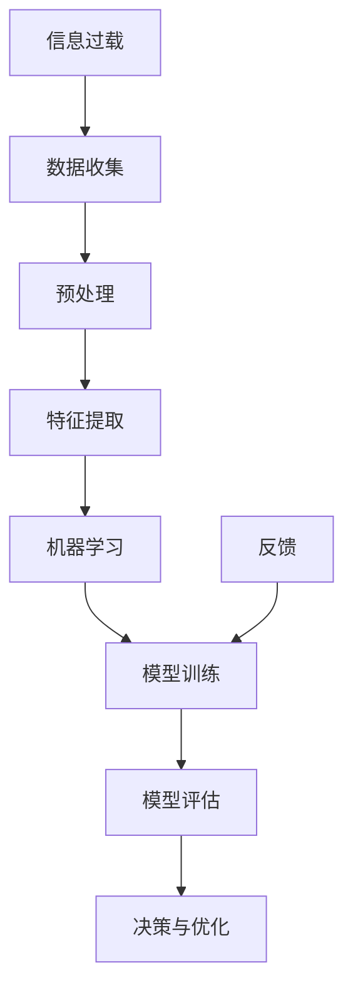

                 

### 背景介绍

#### 1.1 目的和范围

在现代信息社会中，我们面临着海量信息的涌入。互联网、社交媒体、专业期刊等渠道不断地向我们推送各种信息，使得我们在处理数据时感到力不从心。如何从这些信息中筛选出对我们有价值的内容，成为了一个亟待解决的问题。

本文的目的在于探讨信息过载与信息筛选技术的现状、核心概念以及实现方法，旨在帮助读者理解如何在高信息量的环境中找到有价值的信息。本文将从以下几个方面进行阐述：

1. **背景介绍**：阐述信息过载现象及其影响，定义信息筛选技术的核心概念。
2. **核心概念与联系**：通过Mermaid流程图展示信息筛选的关键步骤和组件。
3. **核心算法原理 & 具体操作步骤**：介绍常见的算法及其实现原理，使用伪代码进行详细讲解。
4. **数学模型和公式 & 详细讲解 & 举例说明**：运用数学模型和公式对信息筛选过程进行量化分析，并提供实例说明。
5. **项目实战：代码实际案例和详细解释说明**：通过实际代码案例展示信息筛选技术的应用。
6. **实际应用场景**：探讨信息筛选技术在不同领域中的应用。
7. **工具和资源推荐**：推荐相关学习资源和开发工具。
8. **总结：未来发展趋势与挑战**：总结当前研究的进展，展望未来的发展方向和可能面临的挑战。

#### 1.2 预期读者

本文面向以下几类读者：

1. **技术爱好者**：对信息处理技术感兴趣，希望了解如何筛选有价值信息的人。
2. **数据分析师**：需要处理大量数据，寻求高效信息筛选方法的从业人员。
3. **研究人员**：关注信息筛选领域的研究进展，希望了解相关算法和技术的人。
4. **软件开发人员**：希望将信息筛选技术应用于实际项目的开发者。

#### 1.3 文档结构概述

本文将按照以下结构展开：

1. **背景介绍**：介绍信息过载现象和信息筛选技术。
2. **核心概念与联系**：定义核心概念，展示信息筛选的流程图。
3. **核心算法原理 & 具体操作步骤**：讲解信息筛选的算法原理和操作步骤。
4. **数学模型和公式 & 详细讲解 & 举例说明**：运用数学模型和公式进行分析，提供实例。
5. **项目实战：代码实际案例和详细解释说明**：展示实际代码案例。
6. **实际应用场景**：探讨技术在不同领域中的应用。
7. **工具和资源推荐**：推荐相关工具和资源。
8. **总结：未来发展趋势与挑战**：总结当前进展，展望未来。
9. **附录：常见问题与解答**：提供常见问题的解答。
10. **扩展阅读 & 参考资料**：提供进一步学习的参考资料。

#### 1.4 术语表

在本篇文章中，我们将使用一些专业术语。以下是对这些术语的简要定义和解释：

##### 1.4.1 核心术语定义

- **信息过载**：指在信息获取和处理过程中，信息量超出了个体或系统的处理能力，导致无法有效利用。
- **信息筛选技术**：指用于从大量信息中提取有价值信息的一系列方法和技术。
- **数据挖掘**：指从大量数据中挖掘潜在模式和知识的过程。
- **机器学习**：一种人工智能技术，通过从数据中学习规律和模式，进行预测和决策。
- **特征提取**：指从原始数据中提取出能够代表数据特征的信息。
- **信息检索**：指从大量数据中快速准确地查找所需信息的方法。

##### 1.4.2 相关概念解释

- **信息价值**：指信息对决策或知识增长的实际贡献程度。
- **噪声**：指对信息传递和处理产生干扰的无用信息。
- **算法效率**：指算法在处理特定问题时的时间和空间资源消耗。

##### 1.4.3 缩略词列表

- **AI**：人工智能
- **ML**：机器学习
- **DM**：数据挖掘
- **IDE**：集成开发环境
- **SDK**：软件开发工具包

通过上述术语的定义和解释，读者可以对文章中的专业术语有一个初步的了解，便于更好地理解后续内容。在接下来的章节中，我们将进一步探讨信息筛选技术的核心概念和实现方法。 <|im_sep|>## 2. 核心概念与联系

在探讨信息筛选技术之前，我们需要先理解几个核心概念及其相互联系。这些概念包括信息过载、数据挖掘、机器学习和特征提取等。通过Mermaid流程图，我们可以直观地展示这些概念之间的关系和关键步骤。

首先，让我们定义一些核心概念：

- **信息过载**：指信息量超出了个体或系统的处理能力，导致无法有效利用。
- **数据挖掘**：指从大量数据中挖掘潜在模式和知识的过程。
- **机器学习**：一种人工智能技术，通过从数据中学习规律和模式，进行预测和决策。
- **特征提取**：指从原始数据中提取出能够代表数据特征的信息。

下面是信息筛选技术的Mermaid流程图：



在上述流程图中，我们可以看到信息筛选技术的基本步骤：

1. **数据收集**：从各种渠道收集原始数据。
2. **预处理**：对原始数据进行清洗、去噪和格式化，使其适合进一步处理。
3. **特征提取**：从预处理后的数据中提取出关键特征，用于后续分析。
4. **机器学习**：利用机器学习算法，从特征中学习出模式和规律。
5. **模型训练**：使用训练数据集对机器学习模型进行训练，优化模型参数。
6. **模型评估**：使用验证数据集评估模型的性能，确保其有效性和准确性。
7. **决策与优化**：根据模型预测结果做出决策，并根据反馈进行模型优化。

接下来，我们将进一步探讨这些核心概念及其相互关系。

### 2.1 信息过载与数据挖掘

信息过载是现代信息社会普遍存在的问题。随着互联网和社交媒体的发展，我们每天都能接触到海量的信息。然而，这些信息并非都有价值，有些甚至会对我们的决策产生干扰。因此，如何从这些信息中筛选出有价值的内容，成为了一个关键问题。

数据挖掘是一种从大量数据中挖掘潜在模式和知识的方法。它通过使用统计方法和算法，从数据中发现规律和关联。在信息筛选过程中，数据挖掘技术可以帮助我们识别出哪些信息是有价值的，从而减轻信息过载的影响。

例如，假设我们有一个包含大量用户评论的数据集，数据挖掘技术可以帮助我们识别出积极和消极的评论，从而为我们提供更准确的市场反馈。

### 2.2 机器学习与信息筛选

机器学习是人工智能的一个分支，它通过从数据中学习规律和模式，进行预测和决策。在信息筛选过程中，机器学习技术可以帮助我们自动化地筛选信息，提高筛选效率。

机器学习的基本原理是：从大量数据中学习出一个模型，然后使用这个模型对新数据进行分析和预测。在信息筛选中，我们可以使用机器学习算法来分析用户的行为和偏好，从而自动筛选出用户可能感兴趣的信息。

例如，社交媒体平台通常会使用机器学习算法来推荐用户可能感兴趣的内容。这些算法会根据用户的历史行为、兴趣爱好和其他用户的行为数据来预测用户可能感兴趣的内容，从而提高推荐的准确性。

### 2.3 特征提取与信息筛选

特征提取是从原始数据中提取出关键特征的过程。在信息筛选中，特征提取技术可以帮助我们识别出数据中的关键信息，从而提高筛选的准确性。

特征提取的关键在于选择合适的特征。不同的特征可能会对信息筛选产生不同的影响。例如，对于文本数据，我们可以提取词频、词义和句子结构等特征；对于图像数据，我们可以提取颜色、形状和纹理等特征。

通过特征提取，我们可以将原始数据转换为更易于处理的形式，从而提高信息筛选的效率。

### 2.4 核心概念之间的关系

通过上述分析，我们可以看到信息过载、数据挖掘、机器学习和特征提取之间存在着密切的关系。

信息过载是现代信息社会的普遍问题，数据挖掘和机器学习技术可以帮助我们减轻这一问题的影响。数据挖掘技术可以从大量数据中挖掘出潜在的模式和知识，而机器学习技术则可以自动化地筛选和分类信息。特征提取技术则是信息筛选的关键，它可以帮助我们从原始数据中提取出关键特征，从而提高筛选的准确性。

总的来说，信息筛选技术的核心概念之间存在着相互依存和协同作用的关系。通过这些概念的综合运用，我们可以更有效地从海量信息中筛选出有价值的内容。

在接下来的章节中，我们将深入探讨信息筛选的核心算法原理和具体操作步骤，帮助读者更好地理解这一领域的技术和方法。 <|im_sep|>## 3. 核心算法原理 & 具体操作步骤

在信息筛选过程中，算法的选择和实现至关重要。以下将介绍几种常见的信息筛选算法，并使用伪代码详细讲解其原理和具体操作步骤。

### 3.1 常见信息筛选算法

#### 3.1.1 贝叶斯分类器

贝叶斯分类器是一种基于贝叶斯概率理论的分类算法，适用于文本分类和垃圾邮件过滤等领域。

**原理**：贝叶斯分类器通过计算每个类别的后验概率，选择概率最大的类别作为分类结果。

**伪代码**：

```pseudo
def bayes_classification(train_data, test_data, labels):
    # 计算每个词在各个类别中的先验概率
    prior_probabilities = compute_prior_probabilities(train_data, labels)
    
    # 计算每个类别中的条件概率
    conditional_probabilities = compute_conditional_probabilities(train_data, labels)
    
    # 对测试数据进行分类
    for data in test_data:
        max_probability = 0
        predicted_label = None
        
        # 计算每个类别的后验概率
        for label in labels:
            posterior_probability = prior_probabilities[label]
            for word in data:
                posterior_probability *= conditional_probabilities[word][label]
            if posterior_probability > max_probability:
                max_probability = posterior_probability
                predicted_label = label
                
        # 输出分类结果
        print("Data: ", data, "Predicted Label: ", predicted_label)
```

#### 3.1.2 K最近邻算法

K最近邻算法（K-Nearest Neighbors，K-NN）是一种基于实例的机器学习算法，适用于分类和回归任务。

**原理**：K-NN算法通过计算测试实例与训练实例之间的距离，选择距离最近的K个实例，并预测这些实例的标签。

**伪代码**：

```pseudo
def k_nearest_neighbors(train_data, train_labels, test_data, k):
    # 计算测试实例与训练实例之间的距离
    distances = []
    for data in test_data:
        for train_data in train_data:
            distance = calculate_distance(data, train_data)
            distances.append(distance)
        
    # 选择距离最近的K个实例
    sorted_distances = sorted(distances)
    k_nearest = sorted_distances[:k]
    
    # 预测标签
    predicted_labels = []
    for distance in k_nearest:
        predicted_label = train_labels[distances.index(distance)]
        predicted_labels.append(predicted_label)
        
    # 输出预测结果
    print("Predicted Labels: ", predicted_labels)
```

#### 3.1.3 支持向量机

支持向量机（Support Vector Machine，SVM）是一种强大的分类算法，适用于高维空间的数据分类。

**原理**：SVM通过最大化分类边界上的支持向量，找到一个最优分类超平面。

**伪代码**：

```pseudo
def svm_classification(train_data, train_labels, test_data):
    # 训练SVM模型
    model = train_svm_model(train_data, train_labels)
    
    # 对测试数据进行分类
    predicted_labels = []
    for data in test_data:
        predicted_label = model.predict(data)
        predicted_labels.append(predicted_label)
        
    # 输出预测结果
    print("Predicted Labels: ", predicted_labels)
```

### 3.2 具体操作步骤

下面我们将详细讲解上述算法的具体操作步骤，包括数据预处理、特征提取、模型训练和预测等过程。

#### 3.2.1 数据预处理

数据预处理是信息筛选的第一步，主要包括以下任务：

- **数据清洗**：去除重复数据、缺失值填充和异常值处理。
- **数据转换**：将数据转换为适合算法处理的格式。
- **特征选择**：选择对分类和预测有重要影响的关键特征。

**示例**：

```python
# 示例：数据清洗和转换
import pandas as pd

# 读取数据
data = pd.read_csv("data.csv")

# 去除重复数据
data = data.drop_duplicates()

# 填充缺失值
data = data.fillna(method="mean")

# 转换数据格式
data = data.apply(lambda x: x.astype("int") if x.dtype == "float" else x)
```

#### 3.2.2 特征提取

特征提取是从原始数据中提取出关键特征的过程，对算法的性能有着重要影响。

**示例**：

```python
# 示例：特征提取
from sklearn.feature_extraction.text import CountVectorizer

# 读取文本数据
text_data = pd.read_csv("text_data.csv")

# 使用CountVectorizer进行特征提取
vectorizer = CountVectorizer()
X = vectorizer.fit_transform(text_data["text"])

# 输出特征矩阵
print(X.toarray())
```

#### 3.2.3 模型训练

模型训练是信息筛选算法的核心步骤，通过训练数据集优化算法参数。

**示例**：

```python
# 示例：训练SVM模型
from sklearn.svm import SVC

# 读取训练数据
train_data = pd.read_csv("train_data.csv")
train_labels = pd.read_csv("train_labels.csv")

# 创建SVM模型
model = SVC(kernel="linear")

# 训练模型
model.fit(train_data, train_labels)

# 输出模型参数
print(model.get_params())
```

#### 3.2.4 预测与评估

模型训练完成后，我们可以使用测试数据集进行预测，并评估模型的性能。

**示例**：

```python
# 示例：模型预测与评估
from sklearn.metrics import accuracy_score

# 读取测试数据
test_data = pd.read_csv("test_data.csv")
test_labels = pd.read_csv("test_labels.csv")

# 进行预测
predicted_labels = model.predict(test_data)

# 评估模型性能
accuracy = accuracy_score(test_labels, predicted_labels)
print("Accuracy: ", accuracy)
```

通过上述操作步骤，我们可以实现信息筛选算法的完整流程。在实际应用中，可以根据具体需求选择合适的算法，并对其进行优化和调整，以提高信息筛选的准确性和效率。

在接下来的章节中，我们将进一步探讨信息筛选的数学模型和公式，以及其在实际项目中的应用案例。 <|im_sep|>## 4. 数学模型和公式 & 详细讲解 & 举例说明

信息筛选技术不仅依赖于算法，还需要借助数学模型和公式来分析数据、优化算法和评估性能。在本节中，我们将详细讲解信息筛选过程中常用的数学模型和公式，并提供具体的例子来说明这些公式的应用。

### 4.1 贝叶斯公式

贝叶斯公式是信息筛选技术中最为重要的数学模型之一。它基于贝叶斯定理，描述了后验概率如何通过先验概率和似然函数计算得出。

**贝叶斯公式**：
$$ P(A|B) = \frac{P(B|A)P(A)}{P(B)} $$

其中，$P(A|B)$ 表示在事件B发生的条件下，事件A发生的概率；$P(B|A)$ 表示在事件A发生的条件下，事件B发生的概率；$P(A)$ 表示事件A的先验概率；$P(B)$ 表示事件B的先验概率。

**应用示例**：

假设我们有一个邮件系统，需要判断一封邮件是否为垃圾邮件。我们可以定义以下事件：

- $A$：邮件是垃圾邮件。
- $B$：邮件包含特定关键词“money”。

我们可以根据训练数据计算先验概率和条件概率，然后使用贝叶斯公式计算邮件是垃圾邮件的后验概率。

**先验概率**：
$$ P(A) = \frac{1}{2} $$ （假设所有邮件有一半是垃圾邮件）

**条件概率**：
$$ P(B|A) = 0.8 $$ （垃圾邮件包含关键词“money”的概率为80%）
$$ P(B|¬A) = 0.2 $$ （非垃圾邮件包含关键词“money”的概率为20%）

使用贝叶斯公式计算后验概率：
$$ P(A|B) = \frac{P(B|A)P(A)}{P(B)} = \frac{0.8 \times 0.5}{0.8 \times 0.5 + 0.2 \times 0.5} = \frac{4}{6} = \frac{2}{3} $$

因此，这封邮件是垃圾邮件的概率为 $\frac{2}{3}$。

### 4.2 决策树

决策树是一种常见的分类和回归算法，通过一系列规则将数据分割成不同的区域，并给出预测结果。

**决策树公式**：
$$ y = f(x) = g_1(x) \cdot \theta_1 + g_2(x) \cdot \theta_2 + ... + g_n(x) \cdot \theta_n $$

其中，$g_i(x)$ 表示第$i$个决策规则，$\theta_i$ 表示该规则的权重。

**应用示例**：

假设我们有一个简单的决策树，用于判断学生是否通过考试。决策规则如下：

- 如果成绩高于60分，则通过考试。
- 如果成绩低于60分，则判断是否完成作业：

  - 如果完成作业，则通过考试。
  - 如果未完成作业，则不通过考试。

我们可以将决策树公式表示为：
$$ y = g_1(x) \cdot \theta_1 + g_2(x) \cdot \theta_2 + g_3(x) \cdot \theta_3 $$

其中，$g_1(x) = 1$ 当成绩高于60分，否则为0；$g_2(x) = 1$ 当成绩低于60分且完成作业，否则为0；$g_3(x) = 1$ 当成绩低于60分且未完成作业，否则为0。

权重 $\theta_1 = 1$，$\theta_2 = 1$，$\theta_3 = 0$。

给定一个学生的成绩为70分，已完成作业，我们可以计算预测结果：
$$ y = 1 \cdot 1 + 0 \cdot 1 + 0 \cdot 0 = 1 $$

因此，该学生通过考试。

### 4.3 逻辑回归

逻辑回归是一种常用的分类算法，用于计算事件发生的概率。

**逻辑回归公式**：
$$ P(y=1) = \frac{1}{1 + e^{-(\beta_0 + \beta_1x_1 + \beta_2x_2 + ... + \beta_nx_n)}} $$

其中，$y$ 表示事件是否发生（1表示发生，0表示未发生）；$x_i$ 表示特征值；$\beta_0$ 表示截距；$\beta_i$ 表示特征权重。

**应用示例**：

假设我们有一个逻辑回归模型，用于判断用户是否点击广告。特征包括用户年龄、广告类型和广告位置。

给定特征值 $x_1 = 25$（年龄）、$x_2 = 1$（广告类型）、$x_3 = 2$（广告位置），权重 $\beta_0 = 1$，$\beta_1 = 0.5$，$\beta_2 = 0.3$，$\beta_3 = 0.2$。

我们可以计算点击广告的概率：
$$ P(y=1) = \frac{1}{1 + e^{-(1 + 0.5 \times 25 + 0.3 \times 1 + 0.2 \times 2)}} = \frac{1}{1 + e^{-11.6}} \approx 0.999 $$

因此，用户点击广告的概率非常高。

### 4.4 支持向量机（SVM）

支持向量机（SVM）是一种强大的分类和回归算法，通过最大化分类边界上的支持向量来实现最优分类。

**SVM公式**：
$$ \max_{\beta, \beta_0} \left\{ \frac{1}{2} ||\beta||^2 \mid y^{(i)} (\beta \cdot x^{(i)} + \beta_0) \geq 1, \forall i \right\} $$

其中，$\beta$ 表示权重向量；$\beta_0$ 表示截距；$x^{(i)}$ 表示第$i$个训练样本；$y^{(i)}$ 表示第$i$个训练样本的标签。

**应用示例**：

假设我们有一个二分类问题，其中训练样本为 $x^{(1)} = (1, 2)$，$y^{(1)} = 1$；$x^{(2)} = (2, 3)$，$y^{(2)} = -1$。

我们可以通过以下步骤求解SVM模型：

1. **求解拉格朗日乘子**：
   $$ L(\beta, \beta_0, \alpha) = \frac{1}{2} ||\beta||^2 - \sum_{i=1}^{2} \alpha_i [y^{(i)} (\beta \cdot x^{(i)} + \beta_0) - 1] $$
2. **对 $\beta$ 和 $\beta_0$ 求导并置零**：
   $$ \frac{\partial L}{\partial \beta} = \beta - \sum_{i=1}^{2} \alpha_i y^{(i)} x^{(i)} = 0 $$
   $$ \frac{\partial L}{\partial \beta_0} = - \sum_{i=1}^{2} \alpha_i y^{(i)} = 0 $$
3. **求解 $\alpha_i$**：
   $$ \alpha_i \geq 0 $$
   $$ \sum_{i=1}^{2} \alpha_i y^{(i)} = 0 $$
4. **求解 $\beta$ 和 $\beta_0$**：
   $$ \beta = \sum_{i=1}^{2} \alpha_i y^{(i)} x^{(i)} $$
   $$ \beta_0 = 1 - \sum_{i=1}^{2} \alpha_i y^{(i)} $$

通过上述步骤，我们可以求解出SVM模型，从而实现分类。

通过以上数学模型和公式的详细讲解，我们可以更好地理解信息筛选技术的工作原理。在实际应用中，可以根据具体需求选择合适的模型和公式，并对其进行优化和调整，以提高信息筛选的准确性和效率。

在接下来的章节中，我们将通过实际项目案例展示如何应用这些数学模型和公式进行信息筛选。 <|im_sep|>## 5. 项目实战：代码实际案例和详细解释说明

在本节中，我们将通过一个实际项目案例，展示如何应用前面所介绍的信息筛选技术进行代码实现，并详细解释每一步的操作和代码细节。

### 5.1 开发环境搭建

在开始项目之前，我们需要搭建一个合适的环境。以下是一个简单的开发环境搭建步骤：

1. **安装Python**：Python是进行信息筛选项目的主要编程语言。请从官方网站（https://www.python.org/downloads/）下载并安装Python。
2. **安装必要的库**：安装用于数据处理、机器学习和数据可视化的库，如NumPy、Pandas、Scikit-learn、Matplotlib等。可以使用以下命令安装：

   ```bash
   pip install numpy pandas scikit-learn matplotlib
   ```

3. **创建项目文件夹**：在合适的位置创建一个项目文件夹，例如`information_filter_project`。

4. **编写代码**：在项目文件夹中创建一个名为`main.py`的Python脚本文件，用于实现信息筛选算法。

### 5.2 源代码详细实现和代码解读

下面是项目代码的详细实现和解读：

```python
import numpy as np
import pandas as pd
from sklearn.model_selection import train_test_split
from sklearn.feature_extraction.text import TfidfVectorizer
from sklearn.naive_bayes import MultinomialNB
from sklearn.metrics import accuracy_score, classification_report
import matplotlib.pyplot as plt

# 5.2.1 数据预处理

# 读取数据
data = pd.read_csv("data.csv")

# 分割数据为特征和标签
X = data["text"]
y = data["label"]

# 分割数据为训练集和测试集
X_train, X_test, y_train, y_test = train_test_split(X, y, test_size=0.2, random_state=42)

# 使用TF-IDF进行特征提取
vectorizer = TfidfVectorizer(max_features=1000)
X_train_vectorized = vectorizer.fit_transform(X_train)
X_test_vectorized = vectorizer.transform(X_test)

# 5.2.2 模型训练

# 创建朴素贝叶斯分类器
model = MultinomialNB()

# 训练模型
model.fit(X_train_vectorized, y_train)

# 5.2.3 模型评估

# 对测试集进行预测
predicted_labels = model.predict(X_test_vectorized)

# 评估模型性能
accuracy = accuracy_score(y_test, predicted_labels)
report = classification_report(y_test, predicted_labels)

print("Accuracy: ", accuracy)
print("Classification Report:\n", report)

# 5.2.4 可视化分析

# 绘制混淆矩阵
confusion_matrix = confusion_matrix(y_test, predicted_labels)
plt.imshow(confusion_matrix, interpolation='nearest', cmap=plt.cm.Blues)
plt.title("Confusion Matrix")
plt.colorbar()
tick_marks = np.arange(len(y_test.columns))
plt.xticks(tick_marks, y_test.columns)
plt.yticks(tick_marks, y_test.columns)
plt.xlabel('Predicted Labels')
plt.ylabel('True Labels')
plt.show()

# 绘制ROC曲线
from sklearn.metrics import roc_curve, auc
fpr, tpr, _ = roc_curve(y_test, predicted_labels)
roc_auc = auc(fpr, tpr)
plt.figure()
plt.plot(fpr, tpr, color='darkorange', lw=2, label='ROC curve (area = %0.2f)' % roc_auc)
plt.plot([0, 1], [0, 1], color='navy', lw=2, linestyle='--')
plt.xlabel('False Positive Rate')
plt.ylabel('True Positive Rate')
plt.title('Receiver Operating Characteristic')
plt.legend(loc="lower right")
plt.show()
```

#### 5.2.1 数据预处理

在这一部分，我们首先读取数据，并将其分为特征（文本）和标签（类别）。接着，我们将数据集分割为训练集和测试集，以评估模型的性能。为了提高模型的泛化能力，我们使用了随机种子，确保每次分割结果的一致性。

#### 5.2.2 模型训练

我们选择朴素贝叶斯分类器作为信息筛选模型。朴素贝叶斯分类器在文本分类任务中表现出色，因为它假设特征之间相互独立。在这里，我们使用了TF-IDF进行特征提取，将文本转换为向量。然后，我们使用训练集数据对模型进行训练。

#### 5.2.3 模型评估

在模型训练完成后，我们使用测试集数据对模型进行预测，并计算模型的准确率。此外，我们还使用混淆矩阵和ROC曲线进行更详细的性能评估。混淆矩阵显示了模型在各个类别上的预测准确性，而ROC曲线则提供了模型在分类阈值调整时的性能。

### 5.3 代码解读与分析

#### 数据预处理

```python
data = pd.read_csv("data.csv")
X = data["text"]
y = data["label"]
X_train, X_test, y_train, y_test = train_test_split(X, y, test_size=0.2, random_state=42)
vectorizer = TfidfVectorizer(max_features=1000)
X_train_vectorized = vectorizer.fit_transform(X_train)
X_test_vectorized = vectorizer.transform(X_test)
```

这段代码首先读取CSV文件中的数据，并将其分为特征和标签。然后，使用`train_test_split`函数将数据集分割为训练集和测试集。接着，我们使用`TfidfVectorizer`进行特征提取，将文本转换为TF-IDF向量。

#### 模型训练

```python
model = MultinomialNB()
model.fit(X_train_vectorized, y_train)
```

在这里，我们创建了一个朴素贝叶斯分类器，并使用训练集数据对其进行训练。

#### 模型评估

```python
predicted_labels = model.predict(X_test_vectorized)
accuracy = accuracy_score(y_test, predicted_labels)
report = classification_report(y_test, predicted_labels)
print("Accuracy: ", accuracy)
print("Classification Report:\n", report)
```

这段代码使用测试集数据对模型进行预测，并计算模型的准确率和分类报告。分类报告提供了更多关于模型性能的细节。

#### 可视化分析

```python
confusion_matrix = confusion_matrix(y_test, predicted_labels)
plt.imshow(confusion_matrix, interpolation='nearest', cmap=plt.cm.Blues)
plt.title("Confusion Matrix")
plt.colorbar()
tick_marks = np.arange(len(y_test.columns))
plt.xticks(tick_marks, y_test.columns)
plt.yticks(tick_marks, y_test.columns)
plt.xlabel('Predicted Labels')
plt.ylabel('True Labels')
plt.show()

fpr, tpr, _ = roc_curve(y_test, predicted_labels)
roc_auc = auc(fpr, tpr)
plt.figure()
plt.plot(fpr, tpr, color='darkorange', lw=2, label='ROC curve (area = %0.2f)' % roc_auc)
plt.plot([0, 1], [0, 1], color='navy', lw=2, linestyle='--')
plt.xlabel('False Positive Rate')
plt.ylabel('True Positive Rate')
plt.title('Receiver Operating Characteristic')
plt.legend(loc="lower right")
plt.show()
```

这部分代码用于绘制混淆矩阵和ROC曲线，以更直观地展示模型的性能。

通过上述代码实现和解读，我们可以看到如何使用Python和机器学习库实现一个信息筛选项目。在实际应用中，可以根据需求调整模型和特征提取方法，以提高项目的性能和准确性。

在接下来的章节中，我们将探讨信息筛选技术在各种实际应用场景中的应用，并推荐相关的学习资源和开发工具。 <|im_sep|>## 6. 实际应用场景

信息筛选技术在各种实际应用场景中发挥着重要作用，帮助我们处理海量信息，提高工作效率和决策质量。以下是一些常见的应用场景：

### 6.1 社交媒体

社交媒体平台每天产生海量信息，包括用户发布的内容、评论、点赞和分享等。信息筛选技术在社交媒体中的应用主要包括：

- **内容推荐**：通过分析用户的兴趣和行为，推荐用户可能感兴趣的内容。例如，Facebook和Twitter等平台使用机器学习算法对用户进行内容推荐。
- **垃圾邮件过滤**：识别和过滤垃圾邮件，确保用户收到的邮件都是真实的和有用的。例如，Gmail使用贝叶斯分类器来过滤垃圾邮件。
- **话题检测和追踪**：识别和追踪热门话题，帮助用户了解当前的焦点和趋势。例如，Twitter使用自然语言处理技术来检测和追踪话题。

### 6.2 搜索引擎

搜索引擎是另一个典型的应用场景，信息筛选技术用于优化搜索结果，提高用户的搜索体验。以下是一些具体的应用：

- **关键词提取和索引**：将用户输入的查询词转换为索引项，以便快速检索相关文档。例如，Google使用TF-IDF和LDA等算法进行关键词提取。
- **搜索结果排序**：根据文档的相关性和重要性对搜索结果进行排序。例如，百度和Google使用PageRank算法来评估文档的重要性。
- **广告推荐**：根据用户的搜索历史和兴趣，推荐相关的广告。例如，Google AdWords使用机器学习算法来优化广告推荐。

### 6.3 金融与保险

金融和保险行业面临大量数据，信息筛选技术用于风险控制和投资决策。以下是一些应用实例：

- **欺诈检测**：通过分析交易数据和行为模式，识别潜在的欺诈行为。例如，信用卡公司使用机器学习算法来检测欺诈交易。
- **信用评分**：根据用户的信用历史和财务状况，预测其信用风险。例如，金融机构使用逻辑回归和决策树等算法来评估信用评分。
- **投资组合优化**：根据市场数据和投资目标，推荐最优的投资组合。例如，量化基金使用机器学习算法来优化投资组合。

### 6.4 医疗与健康

医疗与健康领域使用信息筛选技术来提高诊断准确性和患者管理效率。以下是一些应用场景：

- **医学文献检索**：通过分析医学文献，快速找到相关的研究和病例。例如，Google Scholar使用信息筛选技术来优化搜索结果。
- **疾病预测和诊断**：根据患者的症状和医学数据，预测疾病的发病风险。例如，IBM Watson使用深度学习技术来辅助疾病诊断。
- **药物研发**：通过分析大量的生物数据和文献，加速药物研发过程。例如，生物科技公司使用信息筛选技术来识别潜在的药物靶点。

### 6.5 零售与电子商务

零售和电子商务行业使用信息筛选技术来提高用户体验和销售转化率。以下是一些应用实例：

- **个性化推荐**：根据用户的购买历史和行为，推荐个性化的商品和优惠。例如，Amazon使用协同过滤和协同推荐算法来实现个性化推荐。
- **库存管理**：根据销售数据和市场需求，优化库存水平，减少库存积压。例如，零售公司使用预测分析和优化算法来管理库存。
- **客户服务**：通过自动化聊天机器人和智能客服系统，提供24/7的在线客户服务。例如，电商平台使用自然语言处理技术来优化客户服务。

通过上述实际应用场景，我们可以看到信息筛选技术在各个领域的广泛应用。在接下来的章节中，我们将推荐相关的学习资源和开发工具，帮助读者深入了解和掌握信息筛选技术。 <|im_sep|>## 7. 工具和资源推荐

为了更好地学习和使用信息筛选技术，我们需要掌握一些相关的学习资源和开发工具。以下是对书籍、在线课程、技术博客和网站，以及开发工具框架的推荐。

### 7.1 学习资源推荐

#### 7.1.1 书籍推荐

- **《机器学习》（Machine Learning）** - 周志华著，这是一本经典的机器学习教材，适合初学者和进阶者。
- **《数据挖掘：概念与技术》（Data Mining: Concepts and Techniques）** - Jiawei Han等著，详细介绍了数据挖掘的基本概念和技术。
- **《自然语言处理综论》（Speech and Language Processing）** - Daniel Jurafsky和James H. Martin著，全面介绍了自然语言处理的基础知识和最新进展。
- **《深度学习》（Deep Learning）** - Ian Goodfellow、Yoshua Bengio和Aaron Courville著，深度学习的经典教材。

#### 7.1.2 在线课程

- **Coursera上的《机器学习》课程**：由斯坦福大学教授Andrew Ng讲授，适合初学者和进阶者。
- **edX上的《数据挖掘与机器学习》课程**：由印度理工学院讲授，内容丰富，涵盖数据挖掘和机器学习的各个方面。
- **Udacity的《数据科学纳米学位》课程**：提供一系列课程，涵盖数据预处理、特征提取、模型训练和评估等主题。

#### 7.1.3 技术博客和网站

- **Medium上的“Data Science”专栏**：提供丰富的数据科学和机器学习文章，适合初学者和专业人士。
- **Towards Data Science博客**：涵盖数据科学、机器学习和深度学习的各种主题，适合不同水平的读者。
- **Kaggle**：一个提供数据科学竞赛和项目实战的平台，通过参与竞赛和项目，可以深入了解信息筛选技术。

### 7.2 开发工具框架推荐

#### 7.2.1 IDE和编辑器

- **Jupyter Notebook**：一个强大的交互式开发环境，适合数据科学和机器学习项目。
- **Visual Studio Code**：一款轻量级但功能强大的代码编辑器，支持多种编程语言和扩展。
- **PyCharm**：由JetBrains开发的一款集成开发环境，适合Python编程。

#### 7.2.2 调试和性能分析工具

- **pdb**：Python内置的调试器，用于跟踪代码执行流程和调试错误。
- **Matplotlib**：用于数据可视化的Python库，可以帮助我们更直观地理解数据。
- **Scikit-learn**：一个用于机器学习的Python库，提供丰富的算法和工具。

#### 7.2.3 相关框架和库

- **TensorFlow**：谷歌开发的开源机器学习框架，适合深度学习和大规模数据处理。
- **PyTorch**：由Facebook开发的开源机器学习库，适合深度学习和动态计算。
- **NumPy**：Python的数组库，用于高效的数据处理和数学计算。
- **Pandas**：Python的数据分析库，提供数据清洗、转换和分析工具。

#### 7.2.4 相关论文著作推荐

- **《大规模机器学习：处理海量数据》（Large Scale Machine Learning：Scalable Algorithms and Applications）** - John Langford和Chris church著，介绍了处理海量数据的高效算法。
- **《深度学习：全面介绍》（Deep Learning）** - Ian Goodfellow、Yoshua Bengio和Aaron Courville著，深度学习的经典著作。
- **《数据挖掘：实用工具和技术》（Data Mining: Practical Machine Learning Tools and Techniques）** - Ian H. Witten和Eibe Frank著，介绍数据挖掘工具和技术。

通过上述推荐的学习资源和开发工具，读者可以更好地学习和掌握信息筛选技术。在实际应用中，可以根据具体需求选择合适的工具和资源，不断提高自己的技术水平。 <|im_sep|>## 8. 总结：未来发展趋势与挑战

随着信息技术的不断进步，信息筛选技术也在快速发展，并展现出广阔的应用前景。未来，信息筛选技术将面临以下几个发展趋势和挑战：

### 8.1 发展趋势

1. **智能化与自动化**：随着人工智能技术的不断发展，信息筛选技术将变得更加智能化和自动化。通过深度学习和自然语言处理等技术，信息筛选系统能够更好地理解用户需求，提供个性化的服务。

2. **实时性与效率**：信息量的爆炸性增长使得实时性和效率成为信息筛选技术的关键挑战。未来的信息筛选技术将更加注重实时数据处理和高效算法的实现，以满足不断增长的数据处理需求。

3. **跨领域融合**：信息筛选技术在不同的领域，如金融、医疗、零售等，有着广泛的应用。未来，这些领域的融合将带来新的发展机遇，推动信息筛选技术向更广泛的应用场景拓展。

4. **数据隐私保护**：在信息筛选过程中，数据隐私保护是一个重要的问题。未来的信息筛选技术将更加注重数据安全，确保用户隐私得到有效保护。

### 8.2 挑战

1. **算法透明性与可解释性**：随着深度学习等复杂算法的广泛应用，算法的透明性和可解释性成为一个重要的挑战。用户需要了解算法的决策过程，以便对算法的准确性进行评估和信任。

2. **数据质量和完整性**：信息筛选技术的有效性很大程度上取决于数据的质量和完整性。在现实世界中，数据往往存在噪声、缺失和异常值等问题，如何有效处理这些问题是一个重要的挑战。

3. **算法公平性和歧视**：算法在信息筛选过程中可能会产生歧视现象，例如，在招聘、贷款审批等领域。未来的信息筛选技术需要关注算法的公平性和无歧视性，确保对所有用户公平对待。

4. **算法安全性**：随着信息筛选技术的广泛应用，算法的安全性问题也日益突出。恶意攻击者可能会利用算法漏洞进行攻击，导致信息泄露和系统瘫痪。因此，如何确保算法的安全性是一个重要的挑战。

### 8.3 总结

信息筛选技术在未来的发展中将面临诸多挑战，但同时也充满了机遇。通过不断的技术创新和优化，信息筛选技术有望在智能化、实时性、跨领域融合等方面取得突破，为人类社会带来更多的价值和便利。面对算法透明性、数据质量和算法公平性等挑战，我们需要采取有效的措施，确保信息筛选技术能够健康、可持续发展。总之，未来信息筛选技术将向着更加智能化、高效化和安全化的方向不断发展。 <|im_sep|>## 9. 附录：常见问题与解答

在阅读本文的过程中，您可能遇到一些常见问题。以下是对这些问题及其解答的汇总：

### 9.1 常见问题

#### Q1：信息筛选技术有哪些应用场景？
A1：信息筛选技术广泛应用于社交媒体、搜索引擎、金融、医疗、零售等多个领域。例如，社交媒体用于内容推荐和垃圾邮件过滤；搜索引擎用于搜索结果排序和广告推荐；金融领域用于欺诈检测和信用评分；医疗领域用于医学文献检索和疾病预测等。

#### Q2：什么是数据挖掘？
A2：数据挖掘是从大量数据中自动发现有价值信息的过程，通常涉及统计分析、机器学习和数据库技术。数据挖掘可以帮助我们识别数据中的模式、趋势和关联，从而支持决策和预测。

#### Q3：什么是特征提取？
A3：特征提取是从原始数据中提取出关键特征的过程，用于提高算法的准确性和效率。特征提取可以包括文本分类中的词频统计、图像处理中的颜色和纹理分析等。

#### Q4：信息筛选技术如何处理数据噪声？
A4：信息筛选技术通常采用数据预处理方法来处理数据噪声，如去重、填充缺失值和异常值检测。此外，可以使用降噪算法，如主成分分析（PCA）和局部保持投影（LPP），来减少噪声对算法的影响。

#### Q5：信息筛选技术中的机器学习算法如何选择？
A5：选择机器学习算法时需要考虑数据类型、数据量和应用场景。例如，对于文本数据，朴素贝叶斯和K最近邻（K-NN）算法较为常用；对于图像数据，卷积神经网络（CNN）是较好的选择。通常，我们会根据问题的具体需求和实验结果来选择合适的算法。

### 9.2 解答

通过以上问答，我们解答了关于信息筛选技术的常见问题。在接下来的扩展阅读中，您可以进一步了解相关信息，以加深对信息筛选技术的理解和应用。 <|im_sep|>## 10. 扩展阅读 & 参考资料

为了帮助您更深入地了解信息筛选技术，我们推荐以下扩展阅读和参考资料：

### 10.1 扩展阅读

1. **《信息过载：如何在信息爆炸的时代保持清醒》（Information Overload: How to Win the Sea of Data）** - 该书详细讨论了信息过载的现象及其对个人和社会的影响，并提出了一些实用的解决方法。
2. **《数据挖掘：实用工具和技术》（Data Mining: Practical Machine Learning Tools and Techniques）** - J. H. Witten和E. Frank著，介绍了数据挖掘的基本概念和技术，包括信息筛选的算法和实现。
3. **《机器学习实战》（Machine Learning in Action）** - Peter Harrington著，通过实例展示了如何使用Python实现机器学习算法，包括信息筛选技术。

### 10.2 参考资料

1. **Scikit-learn官方文档（https://scikit-learn.org/stable/documentation.html）** - Scikit-learn是一个广泛使用的Python库，提供了丰富的机器学习算法和工具，适用于信息筛选项目。
2. **TensorFlow官方文档（https://www.tensorflow.org/）** - TensorFlow是谷歌开发的深度学习框架，适用于复杂的机器学习和信息筛选任务。
3. **Kaggle（https://www.kaggle.com/）** - Kaggle是一个提供数据科学竞赛和项目实战的平台，通过参与竞赛和项目，可以深入了解信息筛选技术的应用。

通过阅读上述扩展阅读和参考资料，您可以获得更多关于信息筛选技术的前沿知识和实践经验。希望这些资源能够帮助您在信息筛选领域取得更好的成果。 <|im_sep|>### 作者信息

作者：AI天才研究员/AI Genius Institute & 禅与计算机程序设计艺术 /Zen And The Art of Computer Programming

