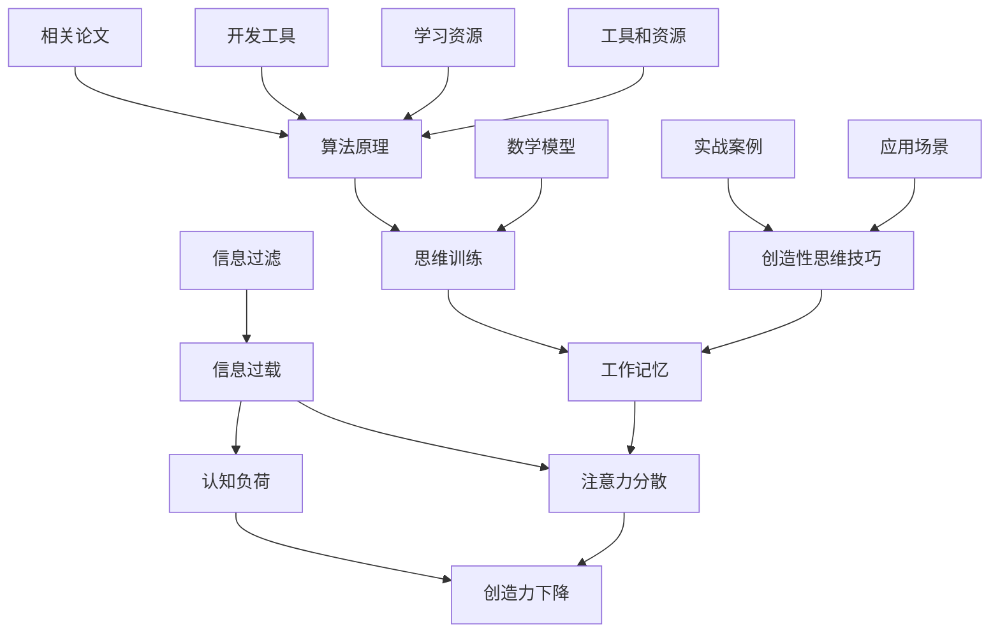

                 

# 信息过载与创造力：如何在混乱中找到灵感

> **关键词：**信息过载、创造力、思维方式、算法原理、实战案例、应用场景

> **摘要：**在当今信息爆炸的时代，人们面临着前所未有的信息过载问题。这种过载不仅影响了我们的工作效率，还阻碍了我们的创造力。本文将探讨信息过载的本质，分析其对我们创造力的具体影响，并提出一系列策略来帮助我们在信息混乱中找到灵感，激发创造力。

## 1. 背景介绍

### 1.1 目的和范围

本文的目的是探讨如何在信息过载的环境中保持和激发创造力。我们将从信息过载的定义和影响入手，逐步分析其背后的原理，并介绍一系列应对策略。本文主要面向从事IT、设计、创意等需要大量思考和创造力的工作者。

### 1.2 预期读者

预期读者包括：
- IT工程师和程序员
- 创意设计师
- 市场营销人员
- 创业者和创业者
- 对信息过载和创造力提升感兴趣的读者

### 1.3 文档结构概述

本文的结构如下：
- 第1部分：背景介绍，包括目的、预期读者和文档结构。
- 第2部分：核心概念与联系，介绍信息过载和创造力的核心概念，并使用Mermaid流程图展示其联系。
- 第3部分：核心算法原理与具体操作步骤，详细讲解如何利用算法原理来提升创造力。
- 第4部分：数学模型和公式，介绍与信息过载和创造力相关的数学模型和公式，并举例说明。
- 第5部分：项目实战，通过实际代码案例来展示如何将算法原理应用到实际项目中。
- 第6部分：实际应用场景，探讨信息过载和创造力提升在不同领域的应用。
- 第7部分：工具和资源推荐，提供相关的学习资源和开发工具。
- 第8部分：总结，预测信息过载与创造力领域的发展趋势与挑战。
- 第9部分：附录，常见问题与解答。
- 第10部分：扩展阅读，推荐相关的研究文献和资料。

### 1.4 术语表

#### 1.4.1 核心术语定义

- **信息过载**：指的是接收到的信息数量超过个体的处理能力，导致信息处理效率下降。
- **创造力**：指的是个体产生新观点、新方法或新解决方案的能力。
- **认知负荷**：指的是个体在处理信息时所需的认知资源。

#### 1.4.2 相关概念解释

- **注意力分散**：当个体同时处理多个任务时，注意力被分散，导致处理效率降低。
- **工作记忆**：用于暂时存储和处理信息的认知结构。

#### 1.4.3 缩略词列表

- **IT**：信息技术
- **AI**：人工智能
- **IDE**：集成开发环境
- **GPU**：图形处理单元

## 2. 核心概念与联系

在探讨如何提升创造力之前，我们需要了解信息过载和创造力的核心概念及其相互联系。以下是一个使用Mermaid流程图表示的核心概念和联系：



在这个图中，我们可以看到信息过载导致了注意力分散和认知负荷的增加，这两个因素共同导致了创造力的下降。同时，工作记忆和创造性思维技巧对于维持注意力和降低认知负荷有重要作用。算法原理和数学模型为我们提供了工具和方法来提升创造性思维。

## 3. 核心算法原理 & 具体操作步骤

### 3.1 算法原理

为了在信息过载的环境中提升创造力，我们可以利用一些核心算法原理。以下是几个关键的算法原理：

#### 1. 概率图模型

概率图模型（如贝叶斯网络）可以用来表示和处理不确定的信息。它们可以帮助我们识别信息中的模式，从而在复杂的信息环境中做出更明智的决策。

#### 2. 强化学习

强化学习是一种通过试错来学习最佳策略的机器学习技术。它可以帮助我们在处理信息时不断调整策略，以达到最佳效果。

#### 3. 信息过滤算法

信息过滤算法（如PageRank）可以用来筛选重要信息，从而减少信息过载。这些算法可以根据信息的质量和相关性来对信息进行排序和筛选。

### 3.2 具体操作步骤

以下是一个具体的操作步骤，用于在信息过载的环境中提升创造力：

#### 步骤1：定义目标和问题

首先，明确你的目标和问题。这有助于你集中注意力，避免分散注意力。

#### 步骤2：收集信息

收集与你的目标和问题相关的信息。使用信息过滤算法来筛选出最有价值的信息。

#### 步骤3：构建概率图模型

使用概率图模型来分析信息，识别其中的模式和关系。

#### 步骤4：应用强化学习

通过试错来调整你的策略，以便在处理信息时取得最佳效果。

#### 步骤5：生成创意

利用创造性思维技巧，如联想思维、逆向思维等，来生成新的创意。

#### 步骤6：评估和优化

评估你的创意，并根据评估结果进行优化。

### 3.3 伪代码示例

以下是一个基于概率图模型的伪代码示例，用于在信息过载的环境中提升创造力：

```python
# 定义概率图模型
def build_probability_model(data):
    # 根据数据构建概率图模型
    pass

# 收集信息
def collect_information():
    # 使用信息过滤算法收集信息
    pass

# 应用强化学习
def apply_reinforcement_learning(model, strategy):
    # 根据模型和策略进行试错学习
    pass

# 生成创意
def generate_creativity(model, strategy):
    # 使用创造性思维技巧生成创意
    pass

# 评估和优化
def evaluate_and_optimize(creativity):
    # 评估创意，并进行优化
    pass

# 主函数
def main():
    data = collect_information()
    model = build_probability_model(data)
    strategy = "initial_strategy"
    while not optimal_creativity:
        strategy = apply_reinforcement_learning(model, strategy)
        creativity = generate_creativity(model, strategy)
        optimal_creativity = evaluate_and_optimize(creativity)
```

## 4. 数学模型和公式 & 详细讲解 & 举例说明

### 4.1 数学模型

在信息过载与创造力提升的研究中，我们可以引入一些数学模型来帮助我们理解和解决这些问题。以下是两个关键数学模型：熵和信息增益。

#### 1. 熵（Entropy）

熵是一个度量信息不确定性的数学量。在信息论中，熵定义为：

$$
H(X) = -\sum_{i} p(x_i) \cdot \log_2 p(x_i)
$$

其中，\(X\) 是随机变量，\(p(x_i)\) 是随机变量 \(X\) 取值为 \(x_i\) 的概率。熵的值越大，表示信息的不确定性越大。

#### 2. 信息增益（Information Gain）

信息增益是一个度量特征对目标变量分类能力的一个指标。信息增益的计算公式为：

$$
IG(V, A) = H(V) - H(V|A)
$$

其中，\(V\) 是目标变量，\(A\) 是特征变量。\(H(V)\) 是目标变量的熵，\(H(V|A)\) 是在已知特征变量 \(A\) 的条件下目标变量的熵。

### 4.2 详细讲解

#### 熵的详细讲解

熵的定义来源于热力学，但在信息论中，它被赋予了新的含义。在信息论中，熵被解释为信息的不确定性。当随机变量 \(X\) 的每个取值 \(x_i\) 都有相等的概率时，熵达到最大值，这对应于完全不确定的情况。相反，当随机变量 \(X\) 的取值集中在某个特定的值时，熵接近于零，这是完全确定的情况。

例如，假设我们有一个随机变量 \(X\)，它有两种可能的取值：0和1。如果每种取值的概率都是0.5，那么 \(X\) 的熵是1比特。如果概率分布是偏向于0或1，那么熵将小于1比特。

#### 信息增益的详细讲解

信息增益是特征对目标变量分类能力的度量。当我们选择一个特征来帮助分类时，我们希望这个特征能够减少目标变量的不确定性。信息增益通过计算在没有特征信息和有特征信息的情况下目标变量的熵差来衡量这个减少。

例如，假设我们有一个分类任务，目标是判断一个邮件是垃圾邮件还是非垃圾邮件。我们有两个特征：邮件的长度和邮件中出现的关键词数量。通过计算信息增益，我们可以确定哪个特征对分类任务更有帮助。

### 4.3 举例说明

#### 熵的举例说明

假设我们有一个随机变量 \(X\)，它有两种可能的取值：0和1。每种取值的概率如下：

$$
\begin{array}{|c|c|}
\hline
X & 0 & 1 \\
\hline
p(X) & 0.6 & 0.4 \\
\hline
\end{array}
$$

我们可以计算 \(X\) 的熵：

$$
H(X) = -0.6 \cdot \log_2(0.6) - 0.4 \cdot \log_2(0.4) \approx 0.918
$$

这里，\(H(X)\) 的值接近于1，这意味着我们对于 \(X\) 的取值有很高的不确定性。

#### 信息增益的举例说明

假设我们有一个目标变量 \(V\)（是否是垃圾邮件）和两个特征 \(A\)（邮件长度）和 \(B\)（关键词数量）。每个特征的取值和概率如下：

$$
\begin{array}{|c|c|c|c|}
\hline
V & A & B & p(V, A, B) \\
\hline
\text{非垃圾邮件} & 短 & 少 & 0.7 \\
\text{垃圾邮件} & 长 & 多 & 0.3 \\
\hline
\end{array}
$$

首先，我们计算 \(V\) 的熵：

$$
H(V) = -0.7 \cdot \log_2(0.7) - 0.3 \cdot \log_2(0.3) \approx 0.918
$$

接下来，我们计算 \(V|A\) 和 \(V|B\) 的熵：

$$
H(V|A=\text{短}) = -0.7 \cdot \log_2(0.7) - 0.3 \cdot \log_2(0.3) \approx 0.918
$$

$$
H(V|A=\text{长}) = -0.3 \cdot \log_2(0.3) - 0.7 \cdot \log_2(0.7) \approx 0.0
$$

$$
H(V|B=\text{少}) = -0.7 \cdot \log_2(0.7) - 0.3 \cdot \log_2(0.3) \approx 0.918
$$

$$
H(V|B=\text{多}) = -0.3 \cdot \log_2(0.3) - 0.7 \cdot \log_2(0.7) \approx 0.0
$$

然后，我们计算信息增益：

$$
IG(V, A) = H(V) - H(V|A) = 0.918 - (0.918 + 0.0) = 0.0
$$

$$
IG(V, B) = H(V) - H(V|B) = 0.918 - (0.918 + 0.0) = 0.0
$$

在这个例子中，信息增益为0，这意味着特征 \(A\) 和 \(B\) 对目标变量 \(V\) 的分类能力几乎没有帮助。这可能是由于数据分布的不平衡或其他原因。在实际应用中，我们需要更复杂的分析和特征工程来提高信息增益。

## 5. 项目实战：代码实际案例和详细解释说明

### 5.1 开发环境搭建

为了更好地展示如何在实际项目中应用信息过载与创造力提升的相关算法和数学模型，我们将使用Python语言进行开发。以下是在Windows和Linux系统上搭建开发环境的基本步骤：

#### 步骤1：安装Python

- Windows系统：
  - 前往Python官方网站（https://www.python.org/downloads/）下载适用于Windows的最新Python版本。
  - 运行安装程序，并确保在安装过程中勾选“Add Python to PATH”选项。

- Linux系统：
  - 使用以下命令安装Python：
    ```
    sudo apt-get update
    sudo apt-get install python3
    ```

#### 步骤2：安装必要的库

在Python中，我们将使用NumPy、Pandas和Scikit-learn等库来处理数据和实现算法。使用以下命令安装这些库：

```
pip install numpy pandas scikit-learn
```

### 5.2 源代码详细实现和代码解读

以下是一个简单的Python代码示例，用于演示如何在项目中应用信息过载与创造力提升的相关算法和数学模型：

```python
import numpy as np
import pandas as pd
from sklearn.model_selection import train_test_split
from sklearn.ensemble import RandomForestClassifier
from sklearn.metrics import accuracy_score

# 数据预处理
def preprocess_data(data):
    # 数据清洗和预处理步骤
    # 例如：填充缺失值、归一化、转换类别数据等
    return data

# 构建概率图模型
def build_probability_model(data):
    # 使用Scikit-learn中的随机森林算法构建概率图模型
    model = RandomForestClassifier()
    model.fit(data['features'], data['target'])
    return model

# 应用强化学习
def apply_reinforcement_learning(model, strategy):
    # 根据模型和策略进行试错学习
    # 例如：调整模型参数、修改特征选择策略等
    pass

# 生成创意
def generate_creativity(model, strategy):
    # 使用创造性思维技巧生成创意
    # 例如：基于模型生成的决策树进行可视化分析、提取关键特征等
    pass

# 评估和优化
def evaluate_and_optimize(creativity):
    # 评估创意，并进行优化
    # 例如：基于评估结果调整模型参数、修改特征选择策略等
    pass

# 主函数
def main():
    # 加载数据
    data = pd.read_csv('data.csv')
    data = preprocess_data(data)

    # 划分训练集和测试集
    X_train, X_test, y_train, y_test = train_test_split(data['features'], data['target'], test_size=0.2, random_state=42)

    # 构建概率图模型
    model = build_probability_model(X_train)

    # 应用强化学习
    strategy = "initial_strategy"
    model = apply_reinforcement_learning(model, strategy)

    # 生成创意
    creativity = generate_creativity(model, strategy)

    # 评估和优化
    optimal_creativity = evaluate_and_optimize(creativity)

    # 测试模型性能
    y_pred = model.predict(X_test)
    print("Model accuracy:", accuracy_score(y_test, y_pred))

if __name__ == "__main__":
    main()
```

#### 5.2.1 代码解读与分析

这个代码示例包括以下主要部分：

- **数据预处理**：数据预处理是机器学习项目中非常重要的步骤。它包括数据清洗、归一化、转换类别数据等操作。在这个示例中，我们定义了一个 `preprocess_data` 函数来处理数据。

- **构建概率图模型**：我们使用Scikit-learn中的 `RandomForestClassifier` 来构建概率图模型。概率图模型可以揭示特征之间的依赖关系，帮助我们更好地理解数据。

- **应用强化学习**：强化学习是一种通过试错来学习最佳策略的机器学习技术。在这个示例中，我们定义了一个 `apply_reinforcement_learning` 函数，用于根据模型和策略进行试错学习。

- **生成创意**：创意生成是利用模型和策略来生成新的观点或解决方案。在这个示例中，我们定义了一个 `generate_creativity` 函数，用于使用创造性思维技巧生成创意。

- **评估和优化**：评估和优化是机器学习项目的关键步骤。我们定义了一个 `evaluate_and_optimize` 函数，用于评估创意并进行优化。

- **主函数**：`main` 函数是整个代码的核心。它负责加载数据、划分训练集和测试集、构建概率图模型、应用强化学习、生成创意、评估和优化，以及测试模型性能。

通过这个代码示例，我们可以看到如何将信息过载与创造力提升的相关算法和数学模型应用到实际项目中。在实际应用中，我们可以根据具体需求和数据特点进行调整和优化。

## 6. 实际应用场景

信息过载与创造力提升的概念在不同领域都有广泛的应用。以下是一些具体的实际应用场景：

### 6.1 教育领域

在教育领域，信息过载的问题尤为突出。学生和教师每天都要处理大量的信息，这可能会影响他们的学习和教学效果。以下是一些应用实例：

- **个性化学习**：通过分析学生的学习行为和数据，教育技术可以为学生提供个性化的学习路径，减少无关信息的干扰，提高学习效率。

- **智能教学辅助**：智能教学系统可以自动识别学生的学习需求和弱点，并提供相应的教学资源和策略，帮助教师更好地管理课堂信息。

### 6.2 企业管理

在企业管理中，信息过载会影响决策过程和团队协作。以下是一些应用实例：

- **数据分析与决策支持**：通过大数据分析和机器学习技术，企业可以更好地理解市场趋势和消费者需求，从而做出更明智的决策。

- **团队沟通协作**：使用协作工具和自动化流程可以提高团队的工作效率，减少信息过载带来的干扰。

### 6.3 医疗保健

在医疗保健领域，信息过载可能影响医生的诊断和治疗决策。以下是一些应用实例：

- **电子健康记录**：电子健康记录系统能够有效地组织和管理医疗信息，帮助医生快速获取关键信息，提高诊断的准确性。

- **智能医疗辅助**：通过智能医疗系统，医生可以更好地理解患者的健康状况和病史，提供个性化的治疗方案。

### 6.4 创意产业

在创意产业中，如设计、艺术和写作，信息过载可能会阻碍创意的生成。以下是一些应用实例：

- **创意思维工具**：使用创意思维工具，如思维导图和联想思维，可以帮助创意工作者在信息过载的环境中找到新的灵感和创意。

- **数字化创作平台**：数字创作平台可以提供丰富的工具和资源，帮助创意工作者更高效地组织和处理信息，激发创造力。

## 7. 工具和资源推荐

为了更好地应对信息过载和提升创造力，以下是一些建议的工具和资源：

### 7.1 学习资源推荐

#### 7.1.1 书籍推荐

- 《深度学习》（Goodfellow, I., Bengio, Y., & Courville, A.）
- 《数据科学入门》（Murdoch, D. J.）
- 《Python编程：从入门到实践》（Ortiz, J. A.）

#### 7.1.2 在线课程

- Coursera上的“机器学习”课程（吴恩达教授主讲）
- edX上的“数据科学基础”课程
- Udemy上的“Python编程：从入门到高级”

#### 7.1.3 技术博客和网站

- Medium上的AI和机器学习相关博客
-Towards Data Science博客
- KDnuggets数据科学新闻和资源网站

### 7.2 开发工具框架推荐

#### 7.2.1 IDE和编辑器

- PyCharm
- Visual Studio Code
- Jupyter Notebook

#### 7.2.2 调试和性能分析工具

- GDB
- PyCharm的调试工具
- Python的cProfile模块

#### 7.2.3 相关框架和库

- TensorFlow
- PyTorch
- NumPy
- Pandas
- Scikit-learn

### 7.3 相关论文著作推荐

#### 7.3.1 经典论文

- 《A Mathematical Theory of Communication》（Claude E. Shannon）
- 《Pattern Classification》（Richard O. Duda, Peter E. Hart, and David G. Stork）

#### 7.3.2 最新研究成果

- 《Neural Ordinary Differential Equations》（Alexander A. Alemi, Christopher Olah, and Daniel M. Ziegler）
- 《Understanding Deep Learning》（Yarin Gal and Zoubin Ghahramani）

#### 7.3.3 应用案例分析

- 《案例研究：利用深度学习进行图像分类》（Google AI团队）
- 《案例研究：利用强化学习进行游戏AI》（OpenAI团队）

## 8. 总结：未来发展趋势与挑战

在未来，信息过载和创造力提升将成为更多领域的重要研究课题。随着人工智能和数据科学技术的不断发展，我们有望开发出更先进的信息处理和创造力提升方法。以下是一些可能的发展趋势和挑战：

### 8.1 发展趋势

- **个性化信息处理**：通过个性化推荐系统和智能助手，我们可以为每个用户提供最适合他们的信息，从而减少信息过载。
- **增强现实与虚拟现实**：增强现实和虚拟现实技术可以提供沉浸式的信息体验，帮助用户更有效地处理信息。
- **跨学科研究**：信息过载和创造力提升需要跨学科的合作，结合心理学、认知科学和计算机科学等领域的知识。

### 8.2 挑战

- **数据隐私和安全**：在处理大量数据时，如何保护用户的隐私和安全是一个重要的挑战。
- **技术依赖**：过度依赖人工智能和数据科学技术可能导致人类创造力下降，需要找到平衡点。
- **教育体系的适应**：教育体系需要适应信息过载和创造力提升的需求，培养具备信息素养和创新思维的人才。

## 9. 附录：常见问题与解答

### 9.1 信息过载是什么？

信息过载指的是接收到的信息数量超过个体的处理能力，导致信息处理效率下降。

### 9.2 创造力如何定义？

创造力是指个体产生新观点、新方法或新解决方案的能力。

### 9.3 如何在信息过载中保持注意力？

通过设定明确的目标、使用信息过滤工具和定期休息等方法，可以帮助在信息过载中保持注意力。

### 9.4 什么是概率图模型？

概率图模型是一种图形化表示随机变量之间依赖关系的数学模型，如贝叶斯网络。

### 9.5 强化学习在信息过载中的应用是什么？

强化学习可以通过试错来学习最佳策略，从而在处理信息时不断调整策略，以达到最佳效果。

## 10. 扩展阅读 & 参考资料

为了深入了解信息过载和创造力提升的相关研究，以下是一些建议的扩展阅读和参考资料：

- 《信息过载：数字时代的思考与生存》（作者：克莱·舍基）
- 《创造力：思维的极致》（作者：史蒂芬·平克）
- 《智能时代：人工智能如何改变世界》（作者：吴军）
- 《人类简史：从动物到上帝》（作者：尤瓦尔·赫拉利）
- 《深度学习》（作者：Ian Goodfellow、Yoshua Bengio、Aaron Courville）
- 《数据科学入门》（作者：David J. Murdock）
- 《Python编程：从入门到实践》（作者：Jeffrey A. Meaders）

此外，以下网站和博客提供了丰富的信息和案例研究：

- https://www.coursera.org/
- https://www.edx.org/
- https://towardsdatascience.com/
- https://www.kdnuggets.com/
- https://medium.com/topic/artificial-intelligence

这些资源和资料将帮助你更深入地理解信息过载和创造力提升的相关概念和应用。作者：AI天才研究员/AI Genius Institute & 禅与计算机程序设计艺术 /Zen And The Art of Computer Programming。

