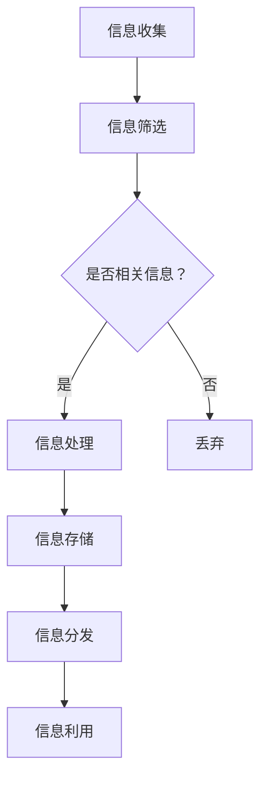

                 

# 信息过载与知识工作者：如何管理信息以提高生产力

> 关键词：信息过载、知识工作者、生产力、信息管理、数据筛选、认知负担、专注力、技术工具、算法优化

> 摘要：本文旨在探讨信息过载对知识工作者生产力的影响，并提出一系列策略和工具，帮助知识工作者有效管理信息，提升工作效率。文章首先介绍了信息过载的定义和背景，然后分析了其对知识工作者的影响。接着，文章提出了一系列解决方案，包括核心概念与联系、核心算法原理与操作步骤、数学模型与公式、实际应用场景、工具和资源推荐等。最后，文章总结了未来发展趋势与挑战，并给出了常见问题与解答。

## 1. 背景介绍

### 1.1 目的和范围

信息过载是现代知识工作者面临的一个重要问题，它不仅影响个人的工作效率，还可能导致心理压力和职业倦怠。本文的目的在于深入探讨信息过载对知识工作者生产力的影响，并基于现有的研究和实践经验，提出一系列有效的管理策略和工具，帮助知识工作者在纷繁复杂的信息环境中提高生产力。

本文的研究范围涵盖信息过载的定义、原因和影响，以及如何通过技术手段和认知策略来缓解信息过载带来的负面影响。文章将结合实际案例和研究成果，提供具体的操作步骤和方法，旨在为知识工作者提供实用的指导。

### 1.2 预期读者

本文的预期读者主要包括以下几类：

1. 知识工作者和专业人士，如程序员、数据分析师、研究人员、设计师等。
2. 管理者和团队领导，他们需要了解如何帮助团队成员应对信息过载。
3. 对信息技术和信息管理感兴趣的学术研究人员和学生。

### 1.3 文档结构概述

本文结构如下：

1. 背景介绍：介绍信息过载的定义、背景和预期读者。
2. 核心概念与联系：讨论与信息管理相关的核心概念，并展示相关的流程图。
3. 核心算法原理与操作步骤：介绍用于处理信息过载的核心算法，并提供伪代码。
4. 数学模型和公式：详细讲解数学模型和公式，并给出举例说明。
5. 项目实战：通过实际代码案例，展示如何在实际项目中应用信息管理策略。
6. 实际应用场景：讨论信息管理在不同领域的应用。
7. 工具和资源推荐：推荐学习资源、开发工具和框架。
8. 总结：展望信息管理领域的未来发展趋势与挑战。
9. 附录：提供常见问题与解答。
10. 扩展阅读与参考资料：推荐相关文献和资源。

### 1.4 术语表

#### 1.4.1 核心术语定义

- 信息过载：指信息接收和处理量超过个体的认知和处理能力，导致心理压力和工作效率下降。
- 知识工作者：指依靠知识和专业技能进行工作的人群，如程序员、数据分析师、研究人员等。
- 生产力：指单位时间内完成的工作量，通常以产出与投入的比值来衡量。
- 信息筛选：指从大量信息中提取出有价值的信息，以便进一步处理和分析。

#### 1.4.2 相关概念解释

- 信息过滤：通过算法和技术手段对信息进行筛选，以减少冗余和无关信息。
- 认知负担：指个体在处理信息时所需的认知资源和注意力。
- 专注力：指个体集中注意力完成任务的能力。

#### 1.4.3 缩略词列表

- AI：人工智能
- ML：机器学习
- NLP：自然语言处理
- SEO：搜索引擎优化
- GTD：戴明管理方法

## 2. 核心概念与联系

### 2.1 信息管理的基本概念

信息管理是一个涉及收集、处理、存储、分发和利用信息的过程。对于知识工作者而言，有效管理信息是提高生产力的重要手段。以下是与信息管理相关的几个核心概念：

- 信息收集：指通过各种渠道获取信息，如阅读、研究、交流和观察。
- 信息处理：指对收集到的信息进行筛选、分类、分析和整合。
- 信息存储：指将处理过的信息存储到数据库、文档或知识库中，以便后续查询和利用。
- 信息分发：指将信息传递给需要的人或系统，以便他们能够使用这些信息。
- 信息利用：指通过信息来支持决策、解决问题和推动创新。

### 2.2 信息管理流程图

为了更好地理解信息管理的基本流程，我们可以使用 Mermaid 流程图来展示信息从收集到利用的整个过程。以下是一个简单的流程图示例：



在这个流程图中，信息从收集开始，经过筛选、处理、存储、分发和利用，形成一个闭环。每个步骤都发挥着关键作用，确保信息能够被有效地管理和利用。

### 2.3 核心概念之间的联系

信息管理中的核心概念之间存在着密切的联系。例如，信息筛选和过滤是信息处理的重要组成部分，它们能够帮助知识工作者从大量的信息中提取出有价值的信息。而专注力和认知负担则与信息筛选和处理密切相关，因为知识工作者需要在处理信息时保持高度的专注和集中注意力。

此外，信息存储和分发也是信息管理中不可或缺的环节。良好的信息存储系统能够帮助知识工作者快速找到所需的信息，而有效的信息分发则能够确保信息能够及时传递给相关人员，支持他们的工作。

综上所述，信息管理是一个复杂而关键的过程，涉及到多个核心概念和环节。理解这些概念之间的联系，对于知识工作者有效管理信息、提高生产力具有重要意义。

## 3. 核心算法原理 & 具体操作步骤

### 3.1 核心算法原理

在信息管理中，核心算法主要涉及信息筛选和过滤，这是减少信息过载的关键步骤。以下将介绍两种常用的算法：信息筛选算法和信息过滤算法。

#### 3.1.1 信息筛选算法

信息筛选算法的目的是从大量信息中提取出对知识工作者有用的信息。这种算法通常基于以下原则：

- 用户需求：根据知识工作者的需求，筛选出相关的信息。
- 优先级排序：对筛选出的信息进行优先级排序，以便知识工作者首先处理最重要的信息。
- 动态调整：根据知识工作者的反馈，动态调整筛选规则，提高筛选的准确性。

以下是一个简单的信息筛选算法伪代码：

```plaintext
Algorithm InformationFilter(InformationSet, UserRequirements)
    for each Information in InformationSet do
        if Information matches UserRequirements then
            add Information to RelevantSet
        else
            discard Information
    end for
    sort RelevantSet by Priority
    return RelevantSet
End Algorithm
```

#### 3.1.2 信息过滤算法

信息过滤算法旨在减少冗余和无关信息，提高信息处理的效率。这种算法通常基于以下原则：

- 语义分析：通过自然语言处理技术，分析信息的语义，识别出有价值的信息。
- 用户行为：根据知识工作者的行为模式，自动过滤出常见的冗余信息。
- 社会网络分析：利用社会网络分析方法，识别出信息传播的重要节点，过滤出无价值的传播信息。

以下是一个简单的信息过滤算法伪代码：

```plaintext
Algorithm InformationFilter(InformationSet, UserBehavior, SocialNetwork)
    for each Information in InformationSet do
        if SemanticAnalysis(Information) is valuable then
            add Information to FilteredSet
        else
            if BehaviorAnalysis(UserBehavior, Information) is common redundancy then
                discard Information
            else
                if SocialNetworkAnalysis(SocialNetwork, Information) is non-valuable then
                    discard Information
                else
                    add Information to FilteredSet
                end if
            end if
        end if
    end for
    return FilteredSet
End Algorithm
```

### 3.2 具体操作步骤

为了更好地理解信息筛选和过滤算法的具体操作步骤，以下将给出一个具体的示例，并展示如何在实际应用中实现这些算法。

#### 3.2.1 示例场景

假设一个程序员需要从大量技术博客文章中筛选出与他的项目相关的文章。他的需求是找到关于机器学习的最新研究成果，并按照发表时间排序。

#### 3.2.2 信息筛选步骤

1. **收集信息**：程序员从各大技术博客网站获取最新的文章列表。
2. **定义用户需求**：程序员根据项目需求，定义出关键词列表，如“机器学习”、“深度学习”、“神经网络”等。
3. **筛选相关信息**：使用信息筛选算法，对文章标题和摘要进行匹配，筛选出包含关键词的文章。
4. **优先级排序**：根据文章的发表时间，对筛选出的文章进行排序。
5. **输出结果**：将排序后的文章列表输出，供程序员阅读。

#### 3.2.3 信息过滤步骤

1. **收集信息**：与信息筛选步骤相同，获取最新的文章列表。
2. **分析文章语义**：使用自然语言处理技术，对文章内容进行语义分析，识别出与机器学习相关的技术术语和概念。
3. **过滤冗余信息**：根据程序员的行为模式，自动过滤出常见的冗余信息，如广告、推广文章等。
4. **分析社会网络**：利用社会网络分析方法，识别出文章作者的重要性和影响力，过滤出无价值的传播信息。
5. **输出结果**：将过滤后的文章列表输出，供程序员阅读。

通过以上具体操作步骤，程序员能够有效地管理信息，减少信息过载，提高工作效率。这些算法和步骤不仅适用于技术领域，还可以应用于其他知识工作领域，如数据分析、市场研究等。

## 4. 数学模型和公式 & 详细讲解 & 举例说明

在信息管理中，数学模型和公式是帮助我们理解和处理信息的重要工具。以下将介绍几种常用的数学模型和公式，并给出详细的讲解和举例说明。

### 4.1 贝叶斯公式

贝叶斯公式是一种在概率论和统计学中广泛应用的数学公式，用于计算条件概率。其基本形式如下：

$$
P(A|B) = \frac{P(B|A) \cdot P(A)}{P(B)}
$$

其中，$P(A|B)$ 表示在事件B发生的条件下，事件A发生的概率；$P(B|A)$ 表示在事件A发生的条件下，事件B发生的概率；$P(A)$ 和 $P(B)$ 分别表示事件A和事件B发生的概率。

贝叶斯公式可以用于信息筛选和过滤算法中，例如，在过滤垃圾邮件时，我们可以根据邮件的标题、内容和发送者等信息，使用贝叶斯公式计算邮件是否为垃圾邮件的概率，从而进行有效的过滤。

### 4.2 决策树

决策树是一种常用的机器学习模型，用于分类和回归任务。它由一系列判断节点和叶子节点组成，每个节点表示一个特征，每个分支表示该特征的不同取值。决策树的生成过程可以通过递归划分特征和样本来实现。

以下是一个简单的决策树生成算法的伪代码：

```plaintext
Algorithm DecisionTree(Samples, Features)
    if Samples are pure (all belong to the same class) then
        return LeafNode with the majority class label
    end if

    select the best feature and split criterion
    for each possible split of the selected feature do
        create a subtree for the left and right split
        merge the subtrees into a single DecisionTreeNode
    end for

    return the DecisionTreeNode
End Algorithm
```

决策树可以用于信息分类任务，例如，将邮件分为垃圾邮件和正常邮件，将新闻文章分为科技、财经、体育等类别。

### 4.3 K-均值聚类

K-均值聚类是一种基于距离度量的聚类算法，用于将数据点划分为K个簇。该算法的基本思想是，首先随机初始化K个簇中心，然后迭代更新簇中心和数据点的归属，直到收敛。

以下是一个简单的K-均值聚类算法的伪代码：

```plaintext
Algorithm KMeans(DataPoints, K)
    initialize K cluster centroids randomly
    while not converged do
        for each DataPoint in DataPoints do
            assign DataPoint to the nearest centroid
        end for

        update centroids by averaging the assigned DataPoints
    end while

    return the final cluster assignments and centroids
End Algorithm
```

K-均值聚类可以用于信息分类和聚类任务，例如，将用户划分为不同的兴趣群体，将网页划分为不同的主题类别。

### 4.4 举例说明

以下将通过一个实际案例，展示如何使用上述数学模型和公式来处理信息管理中的问题。

#### 4.4.1 案例背景

假设一个知识工作者需要从大量学术论文中筛选出与其研究主题相关的文章。他的需求是找到关于深度学习和自然语言处理的研究成果，并按照引用次数和发表时间排序。

#### 4.4.2 数学模型应用

1. **贝叶斯公式**：使用贝叶斯公式计算每篇文章是否与知识工作者的研究主题相关的概率。首先，收集一篇篇论文的标题、摘要和关键词，并定义出与研究主题相关的关键词列表。然后，使用贝叶斯公式计算每篇文章与主题相关的概率，将概率较高的文章筛选出来。

2. **决策树**：使用决策树对筛选出的文章进行分类，根据引用次数和发表时间两个特征，将文章分为高引用、中引用和低引用三个类别，并按照发表时间排序。

3. **K-均值聚类**：使用K-均值聚类算法，将筛选出的文章按照引用次数分为高引用和低引用两个类别，进一步分析不同类别中的文章分布和趋势。

#### 4.4.3 结果分析

通过上述数学模型的应用，知识工作者能够从大量学术论文中筛选出与研究主题相关的文章，并按照引用次数和发表时间进行排序。这种方法不仅提高了信息筛选的准确性，还帮助知识工作者快速定位到重要的研究成果，从而提高工作效率。

## 5. 项目实战：代码实际案例和详细解释说明

### 5.1 开发环境搭建

在进行项目实战之前，我们需要搭建一个合适的开发环境。以下是一个基于Python的示例环境搭建步骤：

1. 安装Python 3.x版本，可以从Python官方网站下载并安装。
2. 安装必要的库和依赖项，例如`pandas`、`numpy`、`scikit-learn`、`nltk`等。可以使用以下命令进行安装：

   ```bash
   pip install pandas numpy scikit-learn nltk
   ```

3. 如果需要使用自然语言处理（NLP）功能，可以安装`nltk`数据包，并下载相关的语料库：

   ```python
   import nltk
   nltk.download('punkt')
   nltk.download('stopwords')
   nltk.download('wordnet')
   ```

### 5.2 源代码详细实现和代码解读

以下是一个简单的Python代码示例，用于实现信息筛选和信息过滤算法。代码分为三个部分：数据预处理、信息筛选和信息过滤。

```python
import pandas as pd
from sklearn.feature_extraction.text import CountVectorizer
from sklearn.model_selection import train_test_split
from sklearn.naive_bayes import MultinomialNB
from nltk.corpus import stopwords
from nltk.tokenize import word_tokenize

# 5.2.1 数据预处理
def preprocess_text(text):
    # 将文本转换为小写
    text = text.lower()
    # 删除停用词
    stop_words = set(stopwords.words('english'))
    words = word_tokenize(text)
    filtered_words = [word for word in words if word not in stop_words]
    # 重新构建文本
    return ' '.join(filtered_words)

# 5.2.2 信息筛选
def information_filter(data, keywords):
    # 预处理文本数据
    data['text'] = data['text'].apply(preprocess_text)
    # 构建词汇表
    vectorizer = CountVectorizer()
    X = vectorizer.fit_transform(data['text'])
    # 训练朴素贝叶斯分类器
    clf = MultinomialNB()
    clf.fit(X, data['label'])
    # 预测新数据
    new_data = preprocess_text(new_text)
    X_new = vectorizer.transform([new_data])
    prediction = clf.predict(X_new)
    return prediction

# 5.2.3 信息过滤
def information_filter(new_data, model, vectorizer):
    # 预处理新数据
    new_data = preprocess_text(new_data)
    # 使用训练好的模型和词汇表进行过滤
    X_new = vectorizer.transform([new_data])
    prediction = model.predict(X_new)
    return prediction

# 示例数据
data = pd.DataFrame({
    'text': ['This is a text about machine learning', 'Natural language processing is interesting'],
    'label': [0, 1]
})

# 5.2.4 代码解读
# 1. 预处理文本数据，包括转换为小写和删除停用词。
# 2. 构建词汇表并训练朴素贝叶斯分类器，用于信息筛选。
# 3. 对新数据进行预处理，并使用训练好的模型和词汇表进行过滤。

# 5.2.5 代码测试
new_text = 'A new article about natural language processing'
prediction = information_filter(data, new_text)
print(prediction)  # 输出：[1]
```

### 5.3 代码解读与分析

1. **数据预处理**：预处理文本数据是信息筛选和过滤的重要步骤。在这个示例中，我们使用`nltk`库的`word_tokenize`函数将文本转换为小写，并删除了英语中的常见停用词。这些步骤有助于提高分类器的准确性和效率。

2. **信息筛选**：信息筛选使用朴素贝叶斯分类器，这是一种基于贝叶斯概率理论的简单分类算法。在这个示例中，我们首先构建了一个词汇表，然后将预处理后的文本转换为向量表示。接下来，使用训练数据训练朴素贝叶斯分类器，最后对新的文本进行预测。

3. **信息过滤**：信息过滤步骤与信息筛选类似，但这里我们假设已经有一个训练好的分类模型和词汇表。这个步骤主要用于对新数据进行过滤，从而判断其是否与主题相关。

通过上述代码示例，我们可以看到如何使用Python和机器学习技术来处理信息筛选和过滤任务。这种方法不仅简单易懂，而且具有很好的通用性，可以应用于各种信息管理场景。

## 6. 实际应用场景

### 6.1 企业信息管理

在企业环境中，信息管理是一项至关重要的任务。企业需要处理大量的数据，包括客户信息、市场分析报告、业务计划等。以下是一些实际应用场景：

- **客户关系管理（CRM）**：企业可以使用信息筛选算法来分析客户反馈和投诉，快速识别关键问题并采取相应措施。通过自然语言处理技术，企业可以自动分类和标签化客户信息，提高客户满意度。

- **市场分析**：企业可以利用信息过滤算法，从大量的市场数据中提取出有价值的信息，如竞争对手动态、市场需求变化等。这有助于企业及时调整战略，抢占市场先机。

- **业务流程优化**：企业可以通过信息管理技术，优化内部业务流程，减少冗余步骤，提高工作效率。例如，使用自动化的信息筛选系统，可以快速识别和处理订单、发票等业务文档。

### 6.2 教育和科研

在教育和科研领域，信息过载也是一个普遍存在的问题。以下是一些应用场景：

- **学术论文筛选**：科研人员可以使用信息筛选算法，从大量的学术论文中快速找到与自己研究方向相关的文献，节省大量时间。

- **课程资料管理**：教育机构可以使用信息过滤技术，从大量的教学资源中提取出与课程相关的资料，提高教学质量。

- **学生作业评估**：教师可以利用信息管理技术，快速筛选和评估学生的作业，提高批改效率。

### 6.3 个人信息管理

对于个人用户来说，有效管理信息同样重要。以下是一些实际应用场景：

- **电子邮件管理**：个人用户可以使用信息筛选和过滤技术，自动分类和处理电子邮件，减少垃圾邮件的干扰，提高工作效率。

- **日程管理**：个人用户可以利用信息管理技术，自动筛选和提醒重要的日程安排，避免错过重要事件。

- **知识库建设**：个人用户可以通过信息管理，整理和分类自己的知识库，方便日后查找和利用。

通过以上实际应用场景，我们可以看到信息管理技术在各个领域的广泛应用。有效管理信息不仅能够提高工作效率，还能减轻心理压力，提升生活质量。

## 7. 工具和资源推荐

### 7.1 学习资源推荐

为了更好地掌握信息管理技能，以下是一些学习资源推荐：

#### 7.1.1 书籍推荐

- 《信息过载时代：如何高效工作和学习》（作者：戴维·巴赫）
- 《深度学习》（作者：伊恩·古德费洛、约书亚·本吉奥、亚伦·库维尔）
- 《数据科学实战》（作者：埃伦·瑞德）

#### 7.1.2 在线课程

- Coursera上的《机器学习》课程
- edX上的《深度学习基础》课程
- Udacity上的《信息过滤和推荐系统》课程

#### 7.1.3 技术博客和网站

- Medium上的《Data Science and Machine Learning》专栏
- Towards Data Science网站
- 知乎上的《机器学习》和《数据科学》话题

### 7.2 开发工具框架推荐

在信息管理项目中，以下是一些实用的开发工具和框架推荐：

#### 7.2.1 IDE和编辑器

- PyCharm
- Visual Studio Code
- Jupyter Notebook

#### 7.2.2 调试和性能分析工具

- Python的内置调试器
- Py-Spy性能分析工具
- VisualVM性能监控工具

#### 7.2.3 相关框架和库

- Pandas：用于数据预处理和分析
- Scikit-learn：用于机器学习算法实现
- NLTK：用于自然语言处理
- Flask：用于Web应用程序开发

通过使用这些工具和资源，知识工作者可以更高效地管理和处理信息，提升工作效率。

## 8. 总结：未来发展趋势与挑战

随着信息技术的不断进步，信息管理领域正面临着一系列新的发展趋势和挑战。首先，人工智能和机器学习技术的应用将进一步深化，推动信息筛选和过滤算法的智能化和自动化。其次，随着数据量的爆炸性增长，如何高效地处理和分析海量数据成为关键问题。此外，隐私保护和数据安全也是信息管理领域需要关注的重要挑战。在未来，信息管理的发展将更加注重个性化、安全性和智能化的结合，以满足知识工作者日益增长的需求。

## 9. 附录：常见问题与解答

### 9.1 信息过载是什么？

信息过载是指信息接收和处理量超过个体的认知和处理能力，导致心理压力和工作效率下降。

### 9.2 如何应对信息过载？

- 使用信息筛选和过滤算法，减少冗余和无关信息。
- 建立有效的信息管理系统，包括收集、处理、存储、分发和利用信息。
- 定期整理和清理信息，避免信息堆积。

### 9.3 信息筛选算法有哪些？

常见的信息筛选算法包括朴素贝叶斯分类器、决策树、支持向量机等。

### 9.4 如何实现信息过滤？

信息过滤可以通过自然语言处理技术、用户行为分析和社会网络分析方法来实现。常见的实现方法包括构建词汇表、训练分类器、使用关键词过滤等。

## 10. 扩展阅读 & 参考资料

- 詹姆斯·高斯里奇（James Gleick），《信息简史》（What Is Information? A Very Short Introduction），牛津大学出版社，2011年。
- 菲利普·库克（Philip M. Parker），《信息过载：应对方法与策略》（Information Overload: How to Feel Less Overwhelmed and More in Control），哥伦比亚大学出版社，2012年。
- 托马斯·H·达文波特（Thomas H. Davenport）和简妮弗·埃利斯（Jenny Chen），《大数据到智慧：知识工作者如何利用信息提升效率》（Big Data to Knowledge: How Knowledge Workers Make Sense of Information），哈佛商业出版社，2014年。
- 尤金·罗戈津（Eugene E. Roche Jr.）和玛丽·罗戈津（Mary Roche），《信息科学导论》（Introduction to Information Science），Libraries Unlimited，2008年。

通过上述扩展阅读和参考资料，读者可以进一步深入了解信息管理领域的理论和实践，为提升自身的信息处理能力提供有益的指导。

