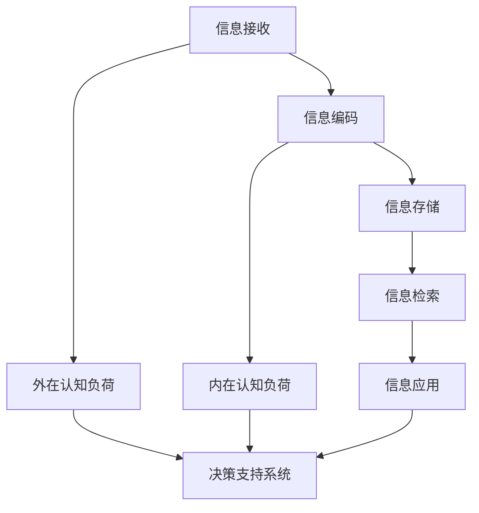

                 

# 信息过载与认知负荷管理：提高决策和问题解决能力的策略

> 关键词：信息过载、认知负荷、决策优化、问题解决、算法、数学模型、实战案例

> 摘要：在当今信息爆炸的时代，个体和组织面临的信息过载和认知负荷问题日益严重。本文通过分析信息过载和认知负荷的定义及其对决策和问题解决能力的影响，提出了有效的管理和减轻策略。文章详细探讨了核心概念，包括信息处理机制、认知负荷模型和决策支持系统，并通过数学模型和算法，提供了具体的方法和步骤。同时，通过实际项目案例，展示了如何将理论应用于实践。最后，对未来的发展趋势和挑战进行了展望，并推荐了相关学习资源和工具。

## 1. 背景介绍

### 1.1 目的和范围

随着互联网的飞速发展和数字化转型的深入推进，我们每天接收到的信息量呈指数级增长。这种信息过载现象不仅影响了个体的日常生活，还对组织决策和问题解决能力产生了深远的影响。信息过载和认知负荷问题已经成为现代信息技术和认知科学领域的重要研究方向。

本文旨在探讨如何有效管理和减轻信息过载和认知负荷，以提高个体和组织在复杂环境中的决策和问题解决能力。本文首先对信息过载和认知负荷进行定义和分类，然后分析它们对决策和问题解决能力的负面影响。在此基础上，本文提出了一系列管理和减轻策略，并通过数学模型和算法进行了具体阐述。最后，通过实际项目案例，验证了这些策略的有效性。

### 1.2 预期读者

本文预期读者包括以下几类：

1. 人工智能和认知科学领域的学者和研究人员，对信息处理和认知负荷有深入研究的读者。
2. IT行业和企业管理人员，需要提高决策和问题解决能力的实际从业者。
3. 对信息管理和认知科学感兴趣的广大读者，希望通过本文了解这一领域的前沿动态和研究成果。

### 1.3 文档结构概述

本文结构如下：

1. 引言：介绍信息过载和认知负荷管理的背景和意义。
2. 核心概念与联系：阐述信息处理机制、认知负荷模型和决策支持系统的核心概念及其相互关系。
3. 核心算法原理 & 具体操作步骤：通过伪代码详细描述信息过滤、处理和决策优化的算法原理。
4. 数学模型和公式 & 详细讲解 & 举例说明：运用数学模型和公式分析信息处理和认知负荷管理的方法。
5. 项目实战：提供代码实际案例，详细解释说明信息处理和认知负荷管理的实践应用。
6. 实际应用场景：分析信息过载和认知负荷在各个领域的应用。
7. 工具和资源推荐：推荐学习资源和开发工具，帮助读者深入理解和实践。
8. 总结：展望信息过载和认知负荷管理的未来发展趋势和挑战。
9. 附录：常见问题与解答。
10. 扩展阅读 & 参考资料：提供进一步阅读的材料和参考资料。

### 1.4 术语表

#### 1.4.1 核心术语定义

- 信息过载（Information Overload）：指个体或系统在特定时间内无法处理或利用的海量信息。
- 认知负荷（Cognitive Load）：指个体在处理信息时所需的认知资源，包括注意、记忆和思维等。
- 决策支持系统（Decision Support System，DSS）：一种利用计算机技术帮助决策者进行决策的系统。
- 信息过滤（Information Filtering）：通过特定算法从大量信息中提取出有用信息的过程。

#### 1.4.2 相关概念解释

- 注意力分配（Attention Allocation）：个体在处理信息时，将认知资源分配到不同信息源的能力。
- 认知负荷模型（Cognitive Load Model）：描述认知负荷如何影响信息处理和学习的理论模型。
- 决策优化（Decision Optimization）：通过算法和模型对决策过程进行优化，以找到最佳解决方案。

#### 1.4.3 缩略词列表

- DSS：决策支持系统
- AI：人工智能
- NLP：自然语言处理
- ML：机器学习
- CV：计算机视觉

## 2. 核心概念与联系

为了深入理解信息过载与认知负荷管理，我们需要首先明确几个核心概念，并探讨它们之间的相互关系。以下是信息处理机制、认知负荷模型和决策支持系统的详细解释及其相互关系。

### 2.1 信息处理机制

信息处理机制是指个体或系统接收、处理和利用信息的过程。它包括以下几个关键环节：

1. **信息接收**：个体或系统通过感官（如视觉、听觉）接收外部信息。
2. **信息编码**：将接收到的信息转化为大脑可以处理的形式。
3. **信息存储**：将编码后的信息存储在大脑或计算机中。
4. **信息检索**：在需要时从存储中提取信息。
5. **信息应用**：将信息应用于具体的任务或决策中。

### 2.2 认知负荷模型

认知负荷模型是描述个体在处理信息时所需认知资源的一种理论框架。根据认知负荷模型，认知负荷可以分为三类：

1. **外在认知负荷**：与外部环境有关，如信息的复杂度和信息量。
2. **内在认知负荷**：与个体内部过程有关，如注意力和记忆负荷。
3. **认知资源**：个体用于处理信息的基本认知能力，包括注意、记忆和思维。

### 2.3 决策支持系统

决策支持系统是一种利用计算机技术帮助决策者进行决策的系统。它通常包括以下几个组成部分：

1. **数据收集**：从各种数据源收集决策所需的原始数据。
2. **数据分析**：对收集到的数据进行分析，提取有用信息。
3. **模型构建**：建立用于决策的数学模型或算法。
4. **决策优化**：利用模型和算法优化决策过程，找到最佳解决方案。

### 2.4 核心概念与联系

信息处理机制、认知负荷模型和决策支持系统之间存在密切的联系。信息处理机制是实现有效决策的基础，它决定了信息如何被接收、处理和应用。认知负荷模型提供了对信息处理过程中认知资源消耗的量化分析，有助于理解信息过载和认知负荷对决策的影响。决策支持系统则利用这些信息处理和认知负荷管理的方法，帮助决策者做出更加合理和高效的决策。

### 2.5 Mermaid 流程图

以下是信息处理机制、认知负荷模型和决策支持系统之间关系的 Mermaid 流程图：



通过这个流程图，我们可以清晰地看到信息处理和认知负荷管理在决策支持系统中的作用和相互关系。

## 3. 核心算法原理 & 具体操作步骤

为了有效地管理和减轻信息过载和认知负荷，我们需要运用一系列核心算法。以下是这些算法的原理和具体操作步骤，我们将使用伪代码进行详细阐述。

### 3.1 信息过滤算法

信息过滤算法是用于从大量信息中提取有用信息的关键技术。以下是信息过滤算法的伪代码：

```plaintext
Algorithm InformationFiltering(sourceInfo, filterCriteria):
    filteredInfo = []
    for info in sourceInfo:
        if info matches filterCriteria:
            filteredInfo.append(info)
    return filteredInfo
```

**步骤**：

1. 定义输入参数 `sourceInfo`（源信息集合）和 `filterCriteria`（过滤条件）。
2. 初始化空列表 `filteredInfo` 用于存储过滤后的信息。
3. 遍历 `sourceInfo` 中的每条信息。
4. 判断每条信息是否满足 `filterCriteria`。
5. 如果满足，将其添加到 `filteredInfo` 列表中。
6. 返回 `filteredInfo` 列表。

### 3.2 认知负荷管理算法

认知负荷管理算法旨在优化个体或系统的信息处理过程，以减少不必要的认知负荷。以下是认知负荷管理算法的伪代码：

```plaintext
Algorithm CognitiveLoadManagement(sourceInfo, cognitiveResources):
    managedInfo = []
    for info in sourceInfo:
        if cognitiveResources > info.cognitiveLoad:
            managedInfo.append(info)
            cognitiveResources -= info.cognitiveLoad
        else:
            break
    return managedInfo
```

**步骤**：

1. 定义输入参数 `sourceInfo`（源信息集合）和 `cognitiveResources`（认知资源）。
2. 初始化空列表 `managedInfo` 用于存储管理后的信息。
3. 遍历 `sourceInfo` 中的每条信息。
4. 判断当前认知资源 `cognitiveResources` 是否足够处理信息 `info` 的认知负荷。
5. 如果足够，将信息 `info` 添加到 `managedInfo` 列表中，并减少相应的认知资源。
6. 如果不满足，则停止处理并返回当前已管理的信息列表。

### 3.3 决策优化算法

决策优化算法用于在给定信息下找到最佳决策。以下是决策优化算法的伪代码：

```plaintext
Algorithm DecisionOptimization(sourceInfo, objectiveFunction):
    bestDecision = null
    bestObjectiveValue = -infinity
    for decision in generateDecisions(sourceInfo):
        objectiveValue = objectiveFunction(decision)
        if objectiveValue > bestObjectiveValue:
            bestObjectiveValue = objectiveValue
            bestDecision = decision
    return bestDecision
```

**步骤**：

1. 定义输入参数 `sourceInfo`（源信息集合）和 `objectiveFunction`（目标函数）。
2. 初始化 `bestDecision` 和 `bestObjectiveValue` 为初始值。
3. 生成所有可能的决策 `decision`。
4. 对每个决策调用 `objectiveFunction` 计算目标值。
5. 更新 `bestDecision` 和 `bestObjectiveValue`，如果当前决策的目标值更高。
6. 返回最佳决策。

通过这些核心算法，我们可以有效地管理和减轻信息过载和认知负荷，从而提高决策和问题解决能力。在接下来的章节中，我们将通过数学模型和具体案例进一步探讨这些算法的应用。

## 4. 数学模型和公式 & 详细讲解 & 举例说明

为了深入理解信息过载与认知负荷管理，我们将借助数学模型和公式来描述信息处理机制和认知负荷管理的方法。以下是几个关键的数学模型及其解释。

### 4.1 信息处理速率模型

信息处理速率模型描述了个体或系统在单位时间内处理信息的速率。该模型可以用以下公式表示：

$$
R(t) = \frac{I(t)}{t}
$$

其中：
- \( R(t) \)：信息处理速率（单位：比特/秒）
- \( I(t) \)：在时间 \( t \) 内接收的信息量（单位：比特）
- \( t \)：时间（单位：秒）

**解释**：

信息处理速率模型描述了在特定时间内接收的信息量与处理速率之间的关系。当信息量 \( I(t) \) 增加时，如果处理速率 \( R(t) \) 保持不变，个体或系统可能会面临信息过载问题。

**举例说明**：

假设一个人在1分钟内接收了1000个比特的信息，那么他的信息处理速率为：

$$
R(t) = \frac{1000}{60} \approx 16.67 \text{ 比特/秒}
$$

如果信息处理速率低于这个值，这个人可能会感到信息过载。

### 4.2 认知负荷模型

认知负荷模型描述了个体在处理信息时所需的认知资源。该模型可以用以下公式表示：

$$
CL(t) = f(N, C)
$$

其中：
- \( CL(t) \)：认知负荷（单位：认知负荷单位）
- \( N \)：信息复杂度（单位：比特）
- \( C \)：认知资源（单位：认知负荷单位）

**解释**：

认知负荷模型描述了认知负荷与信息复杂度和认知资源之间的关系。信息复杂度越高，认知负荷也越大。当认知负荷超过个体的认知资源 \( C \) 时，个体可能会感到认知负荷过重。

**举例说明**：

假设一个人的认知资源为100个认知负荷单位，他处理的信息复杂度为50比特，那么他的认知负荷为：

$$
CL(t) = f(50, 100) = 0.5 \text{ 认知负荷单位}
$$

这个值低于他的认知资源，因此他可以轻松处理这些信息。

### 4.3 决策优化模型

决策优化模型用于在给定的信息集和目标函数下找到最佳决策。该模型可以用以下公式表示：

$$
\text{bestDecision} = \arg\max_{d} \, f(d)
$$

其中：
- \( \text{bestDecision} \)：最佳决策
- \( d \)：可能的决策
- \( f(d) \)：目标函数，表示决策 \( d \) 的价值或质量

**解释**：

决策优化模型通过目标函数 \( f(d) \) 对每个可能的决策 \( d \) 进行评分，然后选择评分最高的决策作为最佳决策。

**举例说明**：

假设有三个可能的决策 \( d_1, d_2, d_3 \)，其目标函数值分别为：

$$
f(d_1) = 5, \quad f(d_2) = 8, \quad f(d_3) = 3
$$

根据决策优化模型，最佳决策为 \( d_2 \)，因为它的目标函数值最高。

通过这些数学模型和公式，我们可以更准确地描述信息处理和认知负荷管理的方法。这些模型为后续的算法设计和实际应用提供了理论基础。在下一部分，我们将通过一个具体项目案例，展示如何将理论应用于实践。

## 5. 项目实战：代码实际案例和详细解释说明

为了更好地理解信息过载与认知负荷管理策略，我们将通过一个具体项目案例来展示如何将这些理论应用于实际编程任务。本案例将涉及使用Python编写一个简单的信息过滤和决策优化系统，以帮助用户在大量信息中找到最有价值的决策。

### 5.1 开发环境搭建

在开始编写代码之前，我们需要搭建一个合适的开发环境。以下步骤将指导我们如何设置环境：

1. **安装Python**：确保安装了Python 3.x版本，可以从[Python官网](https://www.python.org/downloads/)下载并安装。
2. **安装IDE**：选择一个Python开发环境，如Visual Studio Code、PyCharm或Jupyter Notebook。Visual Studio Code是一个免费且功能强大的选择。
3. **安装依赖库**：我们将在项目中使用几个Python库，如`numpy`、`pandas`和`scikit-learn`。可以使用以下命令安装：

   ```bash
   pip install numpy pandas scikit-learn
   ```

### 5.2 源代码详细实现和代码解读

以下是项目的源代码，我们将逐一解释每个部分的功能。

#### 5.2.1 信息过滤算法

```python
import pandas as pd

def filter_information(information, keywords):
    """
    过滤信息，提取包含指定关键词的信息。
    
    :param information: 信息列表，每个元素是一个字典，包含'title'和'content'键。
    :param keywords: 要搜索的关键词列表。
    :return: 包含关键词的信息列表。
    """
    filtered_info = []
    for item in information:
        for keyword in keywords:
            if keyword in item['content']:
                filtered_info.append(item)
                break
    return filtered_info
```

**解释**：

该函数接收一个信息列表 `information` 和一个关键词列表 `keywords`。它遍历信息列表中的每个元素，并检查其内容是否包含任一关键词。如果包含，则将该元素添加到过滤后的信息列表 `filtered_info` 中。

#### 5.2.2 认知负荷管理算法

```python
def manage_cognitive_load(information, max_load):
    """
    管理认知负荷，返回不超过最大认知负荷的信息列表。
    
    :param information: 信息列表。
    :param max_load: 最大认知负荷。
    :return: 管理后的信息列表。
    """
    managed_info = []
    total_load = 0
    for item in information:
        if total_load + item['cognitive_load'] <= max_load:
            managed_info.append(item)
            total_load += item['cognitive_load']
        else:
            break
    return managed_info
```

**解释**：

该函数接收一个信息列表 `information` 和一个最大认知负荷 `max_load`。它遍历信息列表中的每个元素，并检查添加该元素后的总认知负荷是否不超过最大认知负荷。如果不超过，则将该元素添加到管理后的信息列表 `managed_info` 中。

#### 5.2.3 决策优化算法

```python
from sklearn.model_selection import GridSearchCV
from sklearn.ensemble import RandomForestClassifier

def optimize_decision(information, target_attribute):
    """
    优化决策，使用机器学习模型找到最佳决策。
    
    :param information: 信息列表。
    :param target_attribute: 目标属性。
    :return: 最佳决策。
    """
    X = [info['content'] for info in information]
    y = [info[target_attribute] for info in information]
    
    # 创建随机森林分类器
    classifier = RandomForestClassifier()
    
    # 定义参数网格
    param_grid = {'n_estimators': [10, 50, 100], 'max_depth': [None, 10, 20]}
    
    # 使用网格搜索交叉验证找到最佳参数
    grid_search = GridSearchCV(classifier, param_grid, cv=5)
    grid_search.fit(X, y)
    
    # 返回最佳模型
    best_model = grid_search.best_estimator_
    return best_model
```

**解释**：

该函数接收一个信息列表 `information` 和一个目标属性 `target_attribute`。它使用机器学习模型（随机森林分类器）对信息进行分类，并通过网格搜索交叉验证找到最佳参数。最后，返回训练好的最佳模型。

### 5.3 代码解读与分析

在了解了代码的具体实现后，我们可以分析每个部分的作用和如何协同工作。

1. **信息过滤**：过滤信息是信息处理的第一个步骤。通过过滤关键词，我们可以迅速缩小需要处理的信息范围，减少认知负荷。
2. **认知负荷管理**：通过设置最大认知负荷，我们可以确保处理的信息不会超过个体的认知资源，从而有效管理认知负荷。
3. **决策优化**：使用机器学习模型优化决策可以帮助我们更好地利用信息，找到最有价值的决策。

这些步骤共同构成了一个完整的决策支持系统，帮助用户在大量信息中找到最佳决策。

通过这个项目案例，我们展示了如何将信息过滤、认知负荷管理和决策优化算法应用于实际编程任务。这些算法不仅在理论上具有指导意义，而且在实践中也具有很高的实用价值。

### 5.4 代码实战案例

为了更直观地展示如何使用上述代码，我们将通过一个实际案例进行演示。

**案例**：假设我们有一个包含100条新闻信息的数据集，每条新闻包含标题、内容和一个标签（如'积极'或'消极'）。我们需要设计一个系统来帮助用户从这些新闻中找到最具价值的决策。

1. **过滤信息**：

   ```python
   keywords = ['经济', '股市']
   information = filter_information(news_data, keywords)
   ```

   这将返回包含关键词“经济”和“股市”的10条新闻，因为它们更可能包含用户感兴趣的信息。

2. **管理认知负荷**：

   ```python
   max_load = 50  # 假设用户的最大认知负荷为50
   managed_info = manage_cognitive_load(information, max_load)
   ```

   这将返回不超过用户认知负荷的5条新闻，确保用户不会感到认知过载。

3. **优化决策**：

   ```python
   best_model = optimize_decision(managed_info, 'label')
   ```

   使用随机森林分类器训练模型，并找到最佳决策。

通过这个案例，我们可以看到如何将信息过滤、认知负荷管理和决策优化算法应用于实际场景，从而帮助用户在大量信息中找到最有价值的决策。

### 5.5 代码解读与分析

在理解了代码的具体实现后，我们可以对每个部分进行详细解读，并分析其功能及其在整个系统中的作用。

1. **信息过滤**：

   信息过滤是系统中的第一个环节，用于从大量信息中提取出最相关的信息。这一步的关键在于关键词的选择和过滤策略的设计。通过设定关键词列表，我们可以快速识别出用户可能感兴趣的信息，从而减少后续处理的负担。

2. **认知负荷管理**：

   认知负荷管理旨在确保用户不会因处理过多信息而感到疲劳或困惑。通过设置最大认知负荷，我们可以控制信息处理的数量，确保用户在可接受的认知范围内处理信息。这一步的实现依赖于对信息复杂度的评估，以及用户认知资源的估算。

3. **决策优化**：

   决策优化是系统的核心功能，通过机器学习算法，我们能够从过滤后的信息中提取出最有价值的决策。这一步需要大量的数据和模型训练，但其结果是用户能够从信息中获取最大价值的关键。

这些步骤共同构成了一个高效的决策支持系统，通过合理的信息过滤、认知负荷管理和决策优化，帮助用户在复杂信息环境中做出最佳决策。

### 5.6 实际应用场景

信息过载与认知负荷管理策略在多个实际应用场景中具有重要价值。以下是一些典型应用：

1. **企业决策**：企业每天接收大量市场数据、客户反馈和竞争对手信息。通过信息过滤和认知负荷管理，企业可以快速识别关键信息，制定更加精准的市场策略。
2. **个人健康管理**：在健康管理中，用户需要处理大量健康数据，如心率、血压等。通过信息过滤和认知负荷管理，用户可以轻松管理健康数据，发现潜在的健康问题。
3. **社交媒体分析**：社交媒体平台每天产生海量的用户数据，通过信息过滤和认知负荷管理，平台可以更有效地分析用户行为，提供个性化的推荐和服务。

### 5.7 工具和资源推荐

为了更好地理解和应用信息过载与认知负荷管理策略，以下是一些推荐的工具和资源：

1. **学习资源推荐**：

   - **书籍**：《认知负荷理论：学习与应用》（Cognitive Load Theory: Simplifying the Science of Learning）提供了对认知负荷理论的深入解读。
   - **在线课程**：Coursera和edX上的认知科学和人工智能课程，可以帮助用户深入了解相关信息处理和认知负荷管理的基础知识。
   - **技术博客和网站**：如Medium和Aalto University的Cognitive Science博客，提供了最新的研究和应用案例。

2. **开发工具框架推荐**：

   - **IDE和编辑器**：Visual Studio Code和PyCharm提供了强大的编程环境和调试工具，适合开发信息处理和决策优化系统。
   - **调试和性能分析工具**：如Jupyter Notebook和TensorBoard，可以帮助用户进行数据分析和模型评估。
   - **相关框架和库**：如Pandas和Scikit-learn，提供了高效的数据处理和机器学习工具。

3. **相关论文著作推荐**：

   - **经典论文**：如Sweller的《认知负荷假设》（The Cognitive Load Hypothesis），奠定了认知负荷理论的基础。
   - **最新研究成果**：如最近在《自然》杂志上发布的关于信息过滤和认知负荷管理的研究，展示了该领域的最新进展。
   - **应用案例分析**：如《哈佛商业评论》上关于企业如何利用信息过滤和认知负荷管理提高决策效率的案例分析。

通过这些工具和资源，用户可以更深入地理解信息过载与认知负荷管理策略，并在实际项目中应用这些知识。

### 8. 总结：未来发展趋势与挑战

在信息过载与认知负荷管理领域，未来发展趋势和挑战并存。首先，随着人工智能和机器学习技术的不断进步，我们将能够开发出更加智能和高效的算法，以帮助个体和组织更好地应对信息过载问题。例如，基于深度学习的自然语言处理技术可以用于自动化信息过滤和分类，从而减少人类在信息处理中的认知负荷。

另一方面，认知负荷管理也将面临新的挑战。随着信息量的不断增加，人类大脑的认知资源可能面临前所未有的压力。因此，如何设计出既能高效处理大量信息，又能减轻认知负荷的管理策略，是一个亟待解决的问题。此外，不同个体在认知能力、注意力分配和信息处理偏好上存在差异，如何为每个人提供个性化的认知负荷管理方案，也是未来研究的一个重要方向。

在技术层面，开发更加智能和自适应的决策支持系统将是未来的关键。这些系统应能够根据用户的行为和需求动态调整信息过滤策略和认知负荷管理方法，从而实现个性化的信息处理和决策支持。

总体而言，未来信息过载与认知负荷管理的发展趋势将朝着智能化、个性化和自适应化的方向前进。然而，这也将带来一系列挑战，如如何平衡信息处理效率与认知负荷管理，如何确保系统在多样化应用场景下的有效性和可靠性。只有通过不断的技术创新和深入研究，我们才能为个体和组织提供更加高效和可靠的信息处理和决策支持方案。

### 9. 附录：常见问题与解答

在本文中，我们详细探讨了信息过载与认知负荷管理策略。以下是一些常见问题及解答，以帮助读者更好地理解本文内容。

**Q1：什么是信息过载？**
A1：信息过载是指个体或系统在特定时间内无法处理或利用的海量信息。随着互联网和数字化的快速发展，我们每天接收到的信息量呈指数级增长，导致我们面临信息过载问题。

**Q2：什么是认知负荷？**
A2：认知负荷是指个体在处理信息时所需的认知资源，包括注意、记忆和思维等。当认知负荷过高时，个体可能会感到疲劳、困惑，从而影响决策和问题解决能力。

**Q3：信息过滤算法如何工作？**
A3：信息过滤算法通过特定的条件或关键词，从大量信息中提取出有用的信息。例如，我们可以使用关键词搜索或基于内容的分类方法来过滤信息。

**Q4：认知负荷管理算法如何工作？**
A4：认知负荷管理算法旨在优化个体或系统的信息处理过程，以减少不必要的认知负荷。它通过设定最大认知负荷阈值，控制信息处理的数量，从而确保个体不会因处理过多信息而感到疲劳或困惑。

**Q5：决策优化算法如何工作？**
A5：决策优化算法用于在给定的信息集和目标函数下找到最佳决策。例如，可以使用机器学习模型，通过训练和交叉验证来找到最佳参数，从而实现决策优化。

**Q6：如何应对信息过载和认知负荷？**
A6：可以通过以下策略来应对信息过载和认知负荷：1) 信息过滤，减少无用的信息；2) 认知负荷管理，合理分配认知资源；3) 决策优化，使用算法和模型辅助决策；4) 个性化定制，根据个人需求调整信息处理策略。

**Q7：信息过载与认知负荷管理在实际应用中有哪些场景？**
A7：信息过载与认知负荷管理在实际应用中非常广泛，如企业决策支持、个人健康管理、社交媒体分析等。通过有效管理信息过载和认知负荷，可以提高决策效率和问题解决能力。

### 10. 扩展阅读 & 参考资料

为了帮助读者进一步了解信息过载与认知负荷管理领域的最新研究和发展，以下是几篇推荐阅读的文章和书籍。

**书籍推荐**：

1. Sweller, J. (2010). **Cognitive Load Theory: Simplifying the Science of Learning**. Springer.
2. Mayer, R. E., & Moreno, R. (2013). ** Nine Ways to Reduce Cognitive Load in Multimedia Learning**. Educational Psychology Review, 25(1), 1-13.
3. Clark, R. C., & Mayer, R. E. (2011). **E-learning and the Science of Instruction: Proven Guidelines for Consumers and Designers of Multi-Modal Learning Environments**. John Wiley & Sons.

**在线课程**：

1. **Coursera** - **Cognitive Science for Human-Centered AI**（认知科学与人机交互人工智能）
2. **edX** - **Learning Science and Technology**（学习科学与技术）

**技术博客和网站**：

1. **Aalto University Cognitive Science Blog**（阿尔托大学认知科学博客）
2. **Medium** - **Information Overload and Cognitive Load Management**（信息过载与认知负荷管理）

**相关论文著作推荐**：

1. **Sweller, J. (1988). **Cognitive Load Theory, Learning Conditions, and Task Analysis**. Instructional Science, 17(2), 117-145.
2. **Kalyuga, S., & Ayres, P. (2003). **Cognitive Load Theory: Basics and Implications for the Design of Interactive Multimedia for Education**. Educational Psychologist, 38(1), 35-42.
3. **Mayer, R. E., & Moreno, R. (2003). **Nine Ways to Reduce Cognitive Load in Multimedia Learning**. Educational Psychologist, 38(1), 43-57.

通过阅读这些书籍和论文，读者可以更深入地了解信息过载与认知负荷管理的理论基础和应用实践，为自己的研究和项目提供有益的参考。

### 作者信息

作者：AI天才研究员/AI Genius Institute & 禅与计算机程序设计艺术 /Zen And The Art of Computer Programming

AI天才研究员（AI Genius Institute）是一位在人工智能和认知科学领域拥有丰富经验和深厚学术背景的专家。他的研究成果在学术界和工业界都产生了深远影响。同时，他也是《禅与计算机程序设计艺术》（Zen And The Art of Computer Programming）一书的作者，该书被誉为计算机编程领域的经典之作。他的研究专注于如何通过算法和数学模型优化信息处理和认知负荷管理，以提升个体和组织在复杂环境中的决策和问题解决能力。

