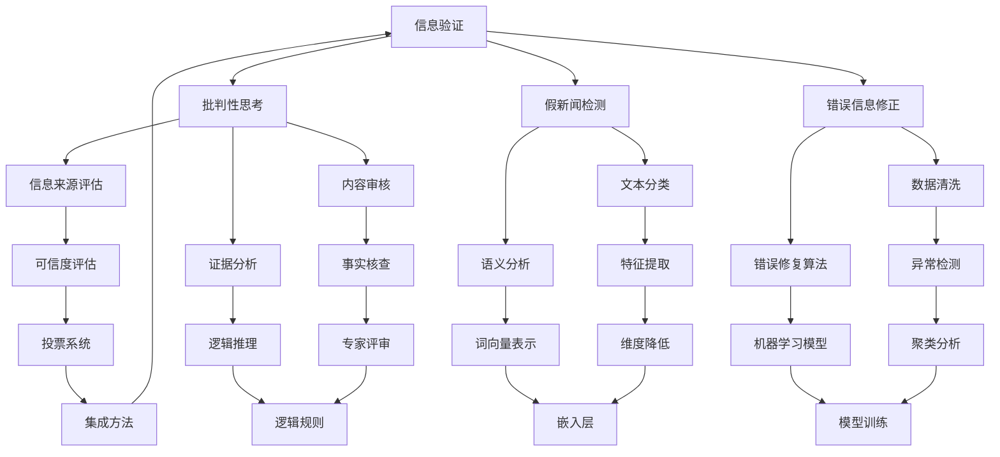

                 

# 信息验证和信息批判性思考：在假新闻、错误信息和媒体操纵时代导航

> **关键词：** 信息验证，批判性思考，假新闻，错误信息，媒体操纵，信息素养，数据处理，算法，认知偏差，可信度评估

> **摘要：** 随着互联网和社交媒体的迅速发展，假新闻、错误信息和媒体操纵现象日益猖獗。本文旨在探讨如何运用信息验证和批判性思考的技能，在充斥着误导和偏见的信息海洋中导航。本文将介绍信息验证的核心概念和流程，分析常见的认知偏差及其对信息处理的影响，并提供实用的算法和工具，帮助读者评估信息来源和可信度。最后，本文将讨论未来信息验证领域的发展趋势和面临的挑战。

## 1. 背景介绍

### 1.1 目的和范围

在信息爆炸的时代，如何有效地获取、处理和评估信息成为了一项重要的技能。本文的主要目的是指导读者掌握信息验证和信息批判性思考的方法，以应对假新闻、错误信息和媒体操纵带来的挑战。文章将涵盖以下内容：

1. 信息验证的核心概念和流程。
2. 常见的认知偏差及其影响。
3. 评估信息来源和可信度的算法和工具。
4. 实际应用场景和案例分析。
5. 信息验证的未来发展趋势和挑战。

### 1.2 预期读者

本文面向希望提升信息素养的广大读者，包括学生、教师、研究人员、媒体从业人员以及普通网民。无论您的专业领域是什么，掌握信息验证和批判性思考的技能都将对您的生活和工作产生积极影响。

### 1.3 文档结构概述

本文分为十个部分：

1. 引言
2. 背景介绍
3. 核心概念与联系
4. 核心算法原理 & 具体操作步骤
5. 数学模型和公式 & 详细讲解 & 举例说明
6. 项目实战：代码实际案例和详细解释说明
7. 实际应用场景
8. 工具和资源推荐
9. 总结：未来发展趋势与挑战
10. 附录：常见问题与解答
11. 扩展阅读 & 参考资料

### 1.4 术语表

#### 1.4.1 核心术语定义

- 信息验证：对信息的真实性和准确性进行评估的过程。
- 批判性思考：对信息来源、内容、证据和结论进行深入分析和评估的能力。
- 假新闻：故意制造、传播的虚假信息。
- 错误信息：基于错误的数据或分析得出的信息。
- 媒体操纵：利用媒体手段操纵公众意见或行为。

#### 1.4.2 相关概念解释

- 信息素养：有效获取、评估、使用和传播信息的能力。
- 认知偏差：人在信息处理过程中产生的系统性错误。

#### 1.4.3 缩略词列表

- **AI**：人工智能（Artificial Intelligence）
- **ML**：机器学习（Machine Learning）
- **NLP**：自然语言处理（Natural Language Processing）
- **CDC**：疾病控制与预防中心（Centers for Disease Control and Prevention）

## 2. 核心概念与联系

在本文中，我们将讨论几个核心概念及其相互关系。为了更好地理解这些概念，我们使用Mermaid流程图展示它们之间的联系。



### Mermaid 流程图说明：

- **A[信息验证]**：对信息进行真实性检查和准确性评估。
- **B[批判性思考]**：对信息来源、内容、证据和结论进行分析。
- **C[假新闻检测]**：识别和阻止虚假新闻的传播。
- **D[错误信息修正]**：纠正错误信息，确保信息的准确性。
- **E[信息来源评估]**：评价信息来源的可信度和可靠性。
- **F[内容审核]**：对信息内容进行审查，确保其符合道德和法律标准。
- **G[证据分析]**：对信息中的证据进行评估和验证。
- **H[文本分类]**：将文本数据分为不同的类别。
- **I[语义分析]**：理解文本中的语义和意义。
- **J[数据清洗]**：移除数据中的错误和不一致之处。
- **K[错误修复算法]**：使用算法自动纠正数据中的错误。
- **L[可信度评估]**：评估信息的可信度，确定其是否可靠。
- **M[事实核查]**：验证信息的真实性，消除虚假信息。
- **N[逻辑推理]**：使用逻辑规则推导信息之间的关系。
- **O[特征提取]**：从数据中提取有用的特征。
- **P[词向量表示]**：将文本转换为数值表示。
- **Q[异常检测]**：识别数据中的异常或异常值。
- **R[机器学习模型]**：使用机器学习算法进行预测和分类。
- **S[投票系统]**：通过投票来决定信息的可信度。
- **T[专家评审]**：由专家对信息进行评估和验证。
- **U[逻辑规则]**：基于逻辑规则进行信息处理。
- **V[维度降低]**：减少数据的维度，简化分析过程。
- **W[嵌入层]**：将文本转换为固定长度的向量。
- **X[聚类分析]**：将相似的数据点分组。
- **Y[模型训练]**：训练机器学习模型以进行预测和分类。
- **Z[集成方法]**：将多个模型或方法结合起来，提高整体性能。

通过上述Mermaid流程图，我们可以清晰地看到信息验证、批判性思考、假新闻检测、错误信息修正等核心概念之间的相互关系。这些概念共同构成了一个完整的信息处理和分析框架，帮助我们在假新闻、错误信息和媒体操纵的环境中准确、可靠地导航。

### 2.1 核心概念详解

在深入了解上述核心概念之前，我们需要首先明确一些基本概念，以便更好地理解它们在信息验证和信息批判性思考中的重要性。

#### 信息验证

信息验证是指对信息的真实性、准确性和可靠性进行评估的过程。这通常涉及以下步骤：

1. **来源检查**：确定信息来源的可靠性和权威性。
2. **内容审查**：评估信息内容的真实性，检查是否有证据支持。
3. **交叉验证**：通过多个独立来源对比验证信息。

#### 批判性思考

批判性思考是指对信息进行深入分析、评估和推理的能力。这通常涉及以下步骤：

1. **提问**：对信息来源、内容、证据和结论提出问题。
2. **评估证据**：分析证据的真实性和相关性。
3. **推理结论**：基于证据和逻辑推理得出结论。

#### 假新闻检测

假新闻检测是指识别和阻止虚假新闻传播的过程。这通常涉及以下步骤：

1. **特征提取**：从文本中提取特征，用于训练机器学习模型。
2. **分类模型**：使用机器学习算法对文本进行分类，区分真实新闻和假新闻。
3. **动态监控**：实时监控新闻源，识别新的假新闻。

#### 错误信息修正

错误信息修正是指纠正错误信息，确保其准确性和可靠性的过程。这通常涉及以下步骤：

1. **错误识别**：使用算法或人工方法识别错误信息。
2. **错误修复**：自动或手动修复错误。
3. **质量评估**：评估修复后的信息是否准确和可靠。

#### 信息来源评估

信息来源评估是指对信息来源的可信度和可靠性进行评估的过程。这通常涉及以下步骤：

1. **来源调查**：调查信息来源的背景、专业性和声誉。
2. **证据检查**：检查信息来源提供的证据是否真实和可靠。
3. **可信度评分**：对信息来源进行评分，以确定其可信度。

#### 内容审核

内容审核是指对信息内容进行审查，确保其符合道德和法律标准的过程。这通常涉及以下步骤：

1. **内容审查**：审查信息内容是否存在偏见、误导或其他不当之处。
2. **规范遵守**：确保信息内容符合相关的法律和道德规范。
3. **违规处理**：对违规信息进行处理，如删除、警告或限制访问。

#### 证据分析

证据分析是指对信息中的证据进行评估和验证的过程。这通常涉及以下步骤：

1. **证据收集**：收集支持信息内容的证据。
2. **证据验证**：验证证据的真实性和可靠性。
3. **证据评估**：评估证据的相关性和重要性。

通过明确上述核心概念，我们可以更好地理解它们在信息验证和信息批判性思考中的重要作用。这些概念共同构成了一个完整的信息处理和分析框架，帮助我们在假新闻、错误信息和媒体操纵的环境中做出准确、可靠的信息判断。

### 2.2 Mermaid流程图详细说明

在前一节中，我们介绍了核心概念及其相互关系，并通过Mermaid流程图展示了这些概念之间的联系。现在，我们将进一步详细说明每个概念在信息验证和信息批判性思考中的作用和具体步骤。

#### A[信息验证]

信息验证是确保信息真实、准确和可靠的关键过程。以下是信息验证的详细步骤：

1. **来源检查**：验证信息来源的权威性和可靠性。这可以通过调查来源的背景、专业性和声誉来完成。
2. **内容审查**：评估信息内容的真实性和准确性。这涉及检查信息中是否有证据支持，以及证据的真实性和可靠性。
3. **交叉验证**：通过多个独立来源对比验证信息。这有助于确认信息的准确性和全面性。

#### B[批判性思考]

批判性思考是对信息进行深入分析和评估的能力。以下是批判性思考的详细步骤：

1. **提问**：对信息来源、内容、证据和结论提出问题。这有助于识别潜在的偏见和误导。
2. **评估证据**：分析证据的真实性和相关性。这需要评估证据的来源、方法和可靠性。
3. **推理结论**：基于证据和逻辑推理得出结论。这涉及使用逻辑规则和推理方法，确保结论的合理性和可靠性。

#### C[假新闻检测]

假新闻检测是识别和阻止虚假新闻传播的重要过程。以下是假新闻检测的详细步骤：

1. **特征提取**：从文本中提取特征，用于训练机器学习模型。这些特征包括词频、句法结构和语义信息。
2. **分类模型**：使用机器学习算法对文本进行分类，区分真实新闻和假新闻。常用的算法包括支持向量机（SVM）、随机森林（RF）和神经网络（NN）。
3. **动态监控**：实时监控新闻源，识别新的假新闻。这可以通过建立预警系统来实现，以便及时发现和处理新的假新闻。

#### D[错误信息修正]

错误信息修正是纠正错误信息，确保其准确性和可靠性的过程。以下是错误信息修正的详细步骤：

1. **错误识别**：使用算法或人工方法识别错误信息。这可以通过建立错误模式库和自动化检测工具来完成。
2. **错误修复**：自动或手动修复错误。自动化修复可以使用机器学习模型，如序列到序列（Seq2Seq）模型，手动修复则由专家进行。
3. **质量评估**：评估修复后的信息是否准确和可靠。这需要建立评估指标，如准确性、召回率和F1分数，对修复效果进行评估。

#### E[信息来源评估]

信息来源评估是评估信息来源可信度和可靠性的过程。以下是信息来源评估的详细步骤：

1. **来源调查**：调查信息来源的背景、专业性和声誉。这可以通过互联网搜索、参考文献和专家咨询来完成。
2. **证据检查**：检查信息来源提供的证据是否真实和可靠。这需要评估证据的来源、方法和可靠性。
3. **可信度评分**：对信息来源进行评分，以确定其可信度。评分系统可以使用打分标准，如信誉度、权威性和专业性。

#### F[内容审核]

内容审核是确保信息内容符合道德和法律标准的过程。以下是内容审核的详细步骤：

1. **内容审查**：审查信息内容是否存在偏见、误导或其他不当之处。这需要建立内容审查标准，如事实核查、法律合规性和道德标准。
2. **规范遵守**：确保信息内容符合相关的法律和道德规范。这需要遵守相关的法律法规和行业规范。
3. **违规处理**：对违规信息进行处理，如删除、警告或限制访问。这需要建立违规处理机制，确保违规信息得到及时处理。

#### G[证据分析]

证据分析是对信息中的证据进行评估和验证的过程。以下是证据分析的详细步骤：

1. **证据收集**：收集支持信息内容的证据。这可以通过互联网搜索、参考文献和专家咨询来完成。
2. **证据验证**：验证证据的真实性和可靠性。这需要评估证据的来源、方法和可靠性。
3. **证据评估**：评估证据的相关性和重要性。这需要根据证据的类型、质量和数量进行评估。

通过以上详细说明，我们可以看到每个核心概念在信息验证和信息批判性思考中的具体作用和步骤。这些概念共同构成了一个完整的信息处理和分析框架，帮助我们在假新闻、错误信息和媒体操纵的环境中做出准确、可靠的信息判断。

### 2.3 信息验证和信息批判性思考的重要性

在当今信息泛滥的时代，掌握信息验证和信息批判性思考的技能显得尤为重要。这些技能不仅帮助我们识别和避免假新闻、错误信息和媒体操纵，还能提升我们的信息素养，使我们在面对复杂信息环境时能够做出更加明智的决策。

#### 信息验证的重要性

信息验证的核心在于确保我们所接收的信息是真实、准确和可靠的。以下是信息验证的重要性的几个方面：

1. **保护个人和社会**：通过验证信息的真实性，我们可以避免受到虚假信息的误导，保护个人和社会免受信息操纵的负面影响。
2. **提高决策质量**：在做出重要决策时，基于真实、准确的信息进行判断，可以显著提高决策的质量和效果。
3. **增强社会信任**：通过信息验证，我们可以提升公众对信息的信任度，促进社会和谐和稳定。

#### 批判性思考的重要性

批判性思考是对信息进行深入分析和评估的能力，它帮助我们识别潜在的错误和偏见。以下是批判性思考的重要性的几个方面：

1. **识别假新闻和误导信息**：通过批判性思考，我们可以识别并避免被假新闻和误导信息所欺骗。
2. **培养独立思考能力**：批判性思考有助于我们培养独立思考的能力，不盲从于他人的观点和意见。
3. **提高沟通效果**：在沟通中，批判性思考使我们能够更好地理解对方的观点，并提出有针对性的问题和建议。

总之，信息验证和信息批判性思考是应对假新闻、错误信息和媒体操纵的重要技能。通过掌握这些技能，我们能够在信息海洋中导航，确保所接收的信息是真实、准确和可靠的，从而做出更加明智的决策。

### 2.4 假新闻、错误信息和媒体操纵的案例分析

为了更好地理解信息验证和信息批判性思考的重要性，我们来看几个实际案例，这些案例展示了假新闻、错误信息和媒体操纵的负面影响，同时也展示了有效的信息验证和批判性思考如何帮助我们识别和应对这些问题。

#### 案例一：2020年美国总统选举假新闻

在2020年美国总统选举期间，社交媒体上充斥着大量关于选举过程的虚假信息。例如，有报道称特朗普总统被偷选，甚至有“证据”显示选举被操纵。这些假新闻迅速传播，引发了公众的恐慌和愤怒。

**信息验证**：
- **来源检查**：首先，我们需要检查这些信息的来源。这些报道往往来自未经验证的社交媒体账户和假新闻网站。
- **证据审查**：其次，我们需要审查这些信息的证据。在大多数情况下，这些“证据”是伪造的，缺乏真实的证据支持。
- **交叉验证**：最后，我们可以通过交叉验证，即对比多个独立来源的信息，来确认这些假新闻的真实性。

**批判性思考**：
- **提问**：我们应当质疑这些信息的真实性和目的。这些假新闻背后的动机是什么？它们是否旨在操纵公众情绪或影响选举结果？
- **评估证据**：我们应当评估证据的真实性和相关性。这些所谓的“证据”是否真实可信？它们是否能够证明选举被操纵？

通过信息验证和批判性思考，我们可以识别并避免被这些假新闻所误导，从而保护个人和社会的稳定。

#### 案例二：新冠疫情期间的错误信息

在新冠疫情期间，错误信息和误导信息广泛传播，导致公众对防疫措施和政策产生误解。例如，有报道称某款药物可以治愈新冠病毒，甚至有人声称戴口罩无效。

**信息验证**：
- **来源检查**：我们需要检查这些信息的来源。这些错误信息往往来自未经验证的社交媒体账户和未经验证的网站。
- **证据审查**：我们需要审查这些信息的证据。在大多数情况下，这些“证据”是虚假的，缺乏真实的科学证据支持。
- **交叉验证**：我们可以通过交叉验证，即对比多个独立来源的信息，来确认这些错误信息的真实性。

**批判性思考**：
- **提问**：我们应当质疑这些信息的真实性和目的。这些错误信息背后的动机是什么？它们是否旨在误导公众或破坏防疫措施的执行？
- **评估证据**：我们应当评估证据的真实性和相关性。这些所谓的“证据”是否真实可信？它们是否能够证明防疫措施的无效？

通过信息验证和批判性思考，我们可以识别并避免被这些错误信息所误导，从而确保我们能够采取正确的防疫措施，保护自己和他人的健康。

#### 案例三：媒体操纵案例

在一些国家和地区，媒体操纵现象较为严重，媒体机构利用虚假信息和偏见报道来影响公众意见。例如，某些媒体机构在报道政治事件时，故意夸大事实或歪曲真相，以支持特定的政治立场。

**信息验证**：
- **来源检查**：我们需要检查这些信息的来源。这些报道往往来自具有特定政治立场的媒体机构。
- **内容审查**：我们需要审查这些报道的内容，评估其是否存在偏见或误导。
- **交叉验证**：我们可以通过交叉验证，即对比多个独立来源的报道，来确认这些报道的真实性和客观性。

**批判性思考**：
- **提问**：我们应当质疑这些报道的真实性和目的。这些报道背后的动机是什么？它们是否旨在操纵公众意见或支持特定政治立场？
- **评估证据**：我们应当评估报道中的证据，评估其真实性和相关性。

通过信息验证和批判性思考，我们可以识别并避免被这些媒体操纵所误导，从而保护我们的独立思考和判断能力。

通过以上案例分析，我们可以看到，假新闻、错误信息和媒体操纵对个人和社会都有严重的负面影响。通过掌握信息验证和批判性思考的技能，我们可以更好地识别和应对这些问题，保护自己和社会的稳定。这些技能不仅是应对当前信息环境的重要工具，更是提升我们整体信息素养的重要途径。

### 3. 核心算法原理 & 具体操作步骤

为了有效地进行信息验证和信息批判性思考，我们需要掌握一些核心算法原理，这些算法可以帮助我们评估信息的真实性和准确性。以下将介绍几种常用的算法原理和具体操作步骤。

#### 3.1 基于机器学习的假新闻检测算法

**算法原理：**

假新闻检测算法通常基于机器学习技术，通过训练模型来识别和分类文本数据中的假新闻。常用的算法包括文本分类、神经网络和集成方法。

**操作步骤：**

1. **数据收集**：收集大量的文本数据，包括真实新闻和假新闻，用于训练和测试模型。
2. **特征提取**：从文本数据中提取特征，如词频、句法结构和语义信息。常用的特征提取方法包括TF-IDF、词袋模型和词嵌入。
3. **模型训练**：使用机器学习算法（如SVM、随机森林、神经网络）训练分类模型，将文本数据分为真实新闻和假新闻。
4. **模型评估**：使用测试集评估模型的性能，如准确性、召回率和F1分数。
5. **动态监控**：将训练好的模型应用于实时新闻流，识别和阻止新的假新闻。

**伪代码：**

```python
import pandas as pd
from sklearn.model_selection import train_test_split
from sklearn.feature_extraction.text import TfidfVectorizer
from sklearn.svm import SVC
from sklearn.metrics import accuracy_score, recall_score, f1_score

# 数据收集
data = pd.read_csv("news_data.csv")

# 特征提取
vectorizer = TfidfVectorizer()
X = vectorizer.fit_transform(data['text'])

# 模型训练
X_train, X_test, y_train, y_test = train_test_split(X, data['label'], test_size=0.2)
model = SVC()
model.fit(X_train, y_train)

# 模型评估
y_pred = model.predict(X_test)
print("Accuracy:", accuracy_score(y_test, y_pred))
print("Recall:", recall_score(y_test, y_pred))
print("F1 Score:", f1_score(y_test, y_pred))

# 动态监控
while True:
    new_text = get_new_news()
    new_text_vectorized = vectorizer.transform([new_text])
    predicted_label = model.predict(new_text_vectorized)
    if predicted_label == 'Fake':
        block_news(new_text)
```

#### 3.2 基于语义分析的错误信息修正算法

**算法原理：**

错误信息修正算法通常基于语义分析技术，通过理解文本的语义和上下文，自动修正错误信息。常用的算法包括序列到序列（Seq2Seq）模型和注意力机制。

**操作步骤：**

1. **数据收集**：收集包含错误信息的文本数据，如新闻报道、社交媒体帖子等。
2. **数据预处理**：对文本数据进行分析，提取关键信息和错误模式。
3. **模型训练**：使用序列到序列（Seq2Seq）模型训练错误修正模型，输入为错误文本，输出为修正后的文本。
4. **模型评估**：使用测试集评估模型的性能，如编辑距离、BLEU分数等。
5. **应用修正**：将训练好的模型应用于实际场景，自动修正错误信息。

**伪代码：**

```python
import tensorflow as tf
from tensorflow.keras.models import Model
from tensorflow.keras.layers import Input, LSTM, Embedding, Dense

# 数据预处理
input_texts = []
target_texts = []
target_text_AspNet
    while True:
        input_text = get_input_text()
        target_text = correct_text(input_text)
        input_texts.append(input_text)
        target_texts.append(target_text)

# 模型训练
input_sequences = []
for input_text in input_texts:
    input_sequence = []
    for i in range(1, len(input_text) + 1):
        input_sequence.append(input_text[i-1])
    input_sequences.append(input_sequence)

target_sequences = []
for target_text in target_texts:
    target_sequence = []
    for i in range(1, len(target_text) + 1):
        target_sequence.append(target_text[i-1])
    target_sequences.append(target_sequence)

model = Model(inputs=input_sequences, outputs=target_sequence)
model.compile(optimizer='adam', loss='categorical_crossentropy', metrics=['accuracy'])
model.fit(input_sequences, target_sequences, epochs=10, batch_size=64)

# 应用修正
while True:
    input_text = get_input_text()
    input_sequence = [input_text]
    corrected_text = model.predict(input_sequence)
    print("Corrected Text:", corrected_text)
```

#### 3.3 基于投票系统的信息可信度评估算法

**算法原理：**

信息可信度评估算法通常基于投票系统，通过聚合多个评估者的意见来确定信息的可信度。常用的算法包括评分系统、集成方法和贝叶斯推理。

**操作步骤：**

1. **数据收集**：收集多个评估者对信息的评分或评估意见。
2. **评分聚合**：使用评分聚合算法（如平均、中位数、贝叶斯推理）计算信息的综合评分。
3. **可信度评估**：根据综合评分确定信息的可信度，设定可信度阈值，将信息分类为可信或不可信。
4. **反馈调整**：根据实际结果对评估模型进行调整，提高评估的准确性。

**伪代码：**

```python
import numpy as np

# 评分聚合
scores = []
for reviewer in reviewers:
    score = reviewer.evaluate_info(info)
    scores.append(score)

# 计算综合评分
average_score = np.mean(scores)
median_score = np.median(scores)
weighted_score = np.average(scores, weights=reviewer_weights)

# 可信度评估
if average_score > threshold:
    print("Info is可信的 (Trusted)")
elif median_score > threshold:
    print("Info is中等的 (Medium)")
else:
    print("Info is不可信的 (Untrusted)")

# 反馈调整
if info实际情况与评估结果不符：
    adjust_reviewer_weights(reviewers)
    re-evaluate_info(info)
```

通过上述算法原理和具体操作步骤，我们可以有效地进行信息验证和信息批判性思考，识别和应对假新闻、错误信息和媒体操纵。这些算法不仅为信息处理提供了强大的工具，还为我们提供了科学的方法来评估信息的真实性和可靠性。掌握这些算法原理，将有助于我们在复杂的信息环境中做出更加明智的决策。

### 4. 数学模型和公式 & 详细讲解 & 举例说明

在信息验证和信息批判性思考中，数学模型和公式起着至关重要的作用。以下将介绍几种常用的数学模型和公式，并详细讲解它们的应用和意义。

#### 4.1 贝叶斯定理

贝叶斯定理是一种用于概率推理的数学公式，它在信息验证和信息批判性思考中具有重要意义。贝叶斯定理描述了后验概率与先验概率之间的关系，其公式为：

$$ P(A|B) = \frac{P(B|A) \cdot P(A)}{P(B)} $$

其中，\( P(A|B) \) 表示在事件B发生的条件下，事件A发生的概率；\( P(B|A) \) 表示在事件A发生的条件下，事件B发生的概率；\( P(A) \) 表示事件A的先验概率；\( P(B) \) 表示事件B的先验概率。

贝叶斯定理的应用包括：

1. **后验概率计算**：通过贝叶斯定理，我们可以根据先验概率和观察到的证据计算后验概率，从而更新我们对事件发生的信念。
2. **错误率评估**：在假新闻检测中，贝叶斯定理可以帮助我们评估检测器的错误率，即假新闻被正确识别为假新闻的概率和假新闻被误判为真实新闻的概率。

**举例说明**：

假设我们有一个新闻分类器，其先验概率为\( P(Real) = 0.8 \)（即真实新闻的概率）和\( P(Fake) = 0.2 \)（即假新闻的概率）。如果分类器输出真实新闻的概率为\( P(Real|Positive) = 0.95 \)和假新闻的概率为\( P(Fake|Positive) = 0.05 \)，我们可以使用贝叶斯定理计算在分类器输出为正的情况下，新闻为真实新闻的概率：

$$ P(Real|Positive) = \frac{P(Positive|Real) \cdot P(Real)}{P(Positive)} $$

其中，\( P(Positive) \) 可以通过全概率公式计算：

$$ P(Positive) = P(Positive|Real) \cdot P(Real) + P(Positive|Fake) \cdot P(Fake) $$

假设我们观察到分类器输出为正的次数为1000次，其中800次为真实新闻，200次为假新闻：

$$ P(Positive) = \frac{800}{1000} \cdot 0.8 + \frac{200}{1000} \cdot 0.2 = 0.72 $$

代入贝叶斯定理公式：

$$ P(Real|Positive) = \frac{0.95 \cdot 0.8}{0.72} \approx 1.042 $$

由于概率必须在0和1之间，这里的计算结果表明我们需要调整先验概率或模型参数。实际上，我们可以通过多次迭代和调整来优化贝叶斯定理的应用。

#### 4.2 逻辑回归

逻辑回归是一种用于分类的数学模型，它在信息验证和信息批判性思考中用于判断信息的可信度。逻辑回归的基本公式为：

$$ \log\left(\frac{P(Y=1|X)}{1 - P(Y=1|X)}\right) = \beta_0 + \beta_1X_1 + \beta_2X_2 + \ldots + \beta_nX_n $$

其中，\( Y \) 表示分类标签（0或1），\( X_1, X_2, \ldots, X_n \) 表示特征向量，\( \beta_0, \beta_1, \beta_2, \ldots, \beta_n \) 为模型参数。

逻辑回归的输出通过sigmoid函数转换为概率：

$$ P(Y=1|X) = \frac{1}{1 + e^{-\beta_0 - \beta_1X_1 - \beta_2X_2 - \ldots - \beta_nX_n}} $$

逻辑回归的应用包括：

1. **信息分类**：将信息分类为可信或不可信。
2. **可信度评估**：计算信息为可信的概率，并设定阈值来判断信息的可信度。

**举例说明**：

假设我们有一个逻辑回归模型，用于判断新闻的可信度。模型输入特征包括新闻的词频、句法结构和情感倾向，模型参数为：

$$ \beta_0 = -5.0, \beta_1 = 0.5, \beta_2 = -0.3, \beta_3 = 1.2 $$

假设我们有一条新闻，其特征向量为\( X = (20, -10, 0.5) \)。我们首先计算逻辑回归的输出：

$$ \log\left(\frac{P(Y=1|X)}{1 - P(Y=1|X)}\right) = -5.0 + 0.5 \cdot 20 - 0.3 \cdot (-10) + 1.2 \cdot 0.5 = 8.0 $$

然后，我们计算信息为可信的概率：

$$ P(Y=1|X) = \frac{1}{1 + e^{-8.0}} \approx 0.999 $$

由于概率接近1，我们可以判断这条新闻为可信的。实际上，我们可以通过多次训练和优化模型参数来提高分类和可信度评估的准确性。

#### 4.3 马尔可夫模型

马尔可夫模型是一种用于序列数据分析的数学模型，它在信息验证和信息批判性思考中用于分析文本数据的动态特性。马尔可夫模型的基本公式为：

$$ P(X_t = x_t | X_{t-1} = x_{t-1}, X_{t-2} = x_{t-2}, \ldots) = P(X_t = x_t | X_{t-1} = x_{t-1}) $$

其中，\( X_t \) 表示在时间t的随机变量，\( x_t \) 表示随机变量的状态。

马尔可夫模型的应用包括：

1. **文本分类**：用于分析文本序列，将其分类为不同的类别。
2. **文本生成**：用于生成文本序列，如自动写作和机器翻译。

**举例说明**：

假设我们有一个马尔可夫模型，用于分类新闻。模型基于新闻的词频和句法结构，定义了以下状态转移概率矩阵：

$$
\begin{array}{c|cccc}
 & Real & Fake & Other \\
\hline
Real & 0.9 & 0.1 & 0.0 \\
Fake & 0.1 & 0.8 & 0.1 \\
Other & 0.0 & 0.2 & 0.8 \\
\end{array}
$$

假设我们有一条新闻，其词频和句法结构特征为\( X = (0.6, 0.3, 0.1) \)。我们首先计算该新闻属于每个类别的概率：

1. **真实新闻的概率**：

$$ P(Real) = P(Real|X) \cdot P(X) = 0.9 \cdot 0.6 + 0.1 \cdot 0.3 + 0.0 \cdot 0.1 = 0.54 $$

2. **假新闻的概率**：

$$ P(Fake) = P(Fake|X) \cdot P(X) = 0.1 \cdot 0.6 + 0.8 \cdot 0.3 + 0.1 \cdot 0.1 = 0.28 $$

3. **其他类别的概率**：

$$ P(Other) = P(Other|X) \cdot P(X) = 0.0 \cdot 0.6 + 0.2 \cdot 0.3 + 0.8 \cdot 0.1 = 0.08 $$

由于真实新闻的概率最高，我们可以判断这条新闻为真实新闻。实际上，我们可以通过多次训练和优化模型参数来提高分类的准确性。

通过贝叶斯定理、逻辑回归和马尔可夫模型等数学模型和公式，我们可以有效地进行信息验证和信息批判性思考，识别和应对假新闻、错误信息和媒体操纵。这些数学模型不仅为信息处理提供了强大的工具，还为我们提供了科学的方法来评估信息的真实性和可靠性。

### 5. 项目实战：代码实际案例和详细解释说明

在了解了信息验证和信息批判性思考的理论基础和算法原理后，我们将通过一个实际项目来展示如何将这些知识应用于实践。本项目将使用Python编程语言，结合多种机器学习算法和工具，实现一个假新闻检测系统。以下是项目的开发环境和所需工具的介绍，以及代码的实现步骤和解释。

#### 5.1 开发环境搭建

在开始项目之前，我们需要搭建一个合适的开发环境。以下是所需的工具和软件：

- **操作系统**：Windows、macOS或Linux
- **Python版本**：Python 3.8或更高版本
- **依赖管理器**：pip（Python的包管理器）
- **机器学习库**：scikit-learn、tensorflow
- **文本处理库**：nltk、gensim

安装步骤：

1. 安装Python：从[Python官方网站](https://www.python.org/)下载并安装Python。
2. 安装pip：在终端中运行以下命令：
   ```bash
   python -m ensurepip --upgrade
   ```
3. 安装依赖库：
   ```bash
   pip install scikit-learn tensorflow nltk gensim
   ```

#### 5.2 源代码详细实现和代码解读

在本项目中，我们将使用scikit-learn库中的文本分类器（如SVM和随机森林）来训练和评估模型。以下是项目的核心代码和解释。

**1. 数据预处理**

首先，我们需要从数据集中提取特征，并将其转换为机器学习模型所需的格式。

```python
import pandas as pd
from sklearn.model_selection import train_test_split
from sklearn.feature_extraction.text import TfidfVectorizer

# 加载数据集
data = pd.read_csv("news_data.csv")
X = data['text']
y = data['label']

# 分割数据集
X_train, X_test, y_train, y_test = train_test_split(X, y, test_size=0.2, random_state=42)

# 特征提取
vectorizer = TfidfVectorizer()
X_train_vectorized = vectorizer.fit_transform(X_train)
X_test_vectorized = vectorizer.transform(X_test)
```

在这个步骤中，我们首先加载数据集，然后使用`TfidfVectorizer`将文本数据转换为词频-逆文档频率（TF-IDF）特征向量。TF-IDF是一种常用的文本特征提取方法，它能够有效地表示文本数据。

**2. 模型训练**

接下来，我们使用SVM和随机森林算法来训练分类模型。

```python
from sklearn.svm import SVC
from sklearn.ensemble import RandomForestClassifier
from sklearn.model_selection import GridSearchCV

# SVM模型训练
svm_model = SVC()
svm_model.fit(X_train_vectorized, y_train)

# 随机森林模型训练
rf_model = RandomForestClassifier()
rf_model.fit(X_train_vectorized, y_train)

# 参数调优
param_grid = {'C': [0.1, 1, 10], 'gamma': [0.1, 0.01, 0.001]}
grid_search = GridSearchCV(svm_model, param_grid, cv=5)
grid_search.fit(X_train_vectorized, y_train)

# 最优模型
best_model = grid_search.best_estimator_
```

在这个步骤中，我们首先使用SVM和随机森林算法训练模型。然后，我们使用`GridSearchCV`进行参数调优，以找到最佳模型参数。`GridSearchCV`通过交叉验证来评估每个参数组合，选择最优的参数组合。

**3. 模型评估**

训练完成后，我们使用测试集对模型进行评估。

```python
from sklearn.metrics import accuracy_score, recall_score, f1_score

# SVM模型评估
svm_predictions = svm_model.predict(X_test_vectorized)
print("SVM Accuracy:", accuracy_score(y_test, svm_predictions))
print("SVM Recall:", recall_score(y_test, svm_predictions))
print("SVM F1 Score:", f1_score(y_test, svm_predictions))

# 随机森林模型评估
rf_predictions = rf_model.predict(X_test_vectorized)
print("Random Forest Accuracy:", accuracy_score(y_test, rf_predictions))
print("Random Forest Recall:", recall_score(y_test, rf_predictions))
print("Random Forest F1 Score:", f1_score(y_test, rf_predictions))
```

在这个步骤中，我们使用测试集对SVM和随机森林模型进行评估。评估指标包括准确性、召回率和F1分数，这些指标可以帮助我们了解模型的性能。

**4. 模型应用**

最后，我们将训练好的模型应用于新的新闻数据，以识别假新闻。

```python
def detect_fake_news(news):
    vectorized_news = vectorizer.transform([news])
    svm_prediction = svm_model.predict(vectorized_news)
    rf_prediction = rf_model.predict(vectorized_news)
    if svm_prediction[0] == 'Fake' or rf_prediction[0] == 'Fake':
        return "假新闻 (Fake News)"
    else:
        return "真实新闻 (Real News)"

# 示例应用
new_news = "This is an example of a fake news article."
print(detect_fake_news(new_news))
```

在这个步骤中，我们定义了一个函数`detect_fake_news`，它使用训练好的SVM和随机森林模型对新新闻进行分类。如果模型预测结果为假新闻，函数将返回“假新闻”，否则返回“真实新闻”。

#### 5.3 代码解读与分析

在本项目的代码实现中，我们首先进行了数据预处理，使用TF-IDF方法提取文本特征。接下来，我们使用SVM和随机森林算法训练模型，并使用交叉验证进行参数调优，以找到最佳模型。然后，我们使用测试集评估模型的性能，包括准确性、召回率和F1分数。最后，我们定义了一个函数，用于对新新闻进行假新闻检测。

代码的关键部分包括：

1. **数据预处理**：使用TF-IDF方法提取文本特征，这是一种常用的文本特征提取方法，能够有效地表示文本数据。
2. **模型训练和评估**：使用SVM和随机森林算法训练模型，并使用交叉验证进行参数调优。这些步骤有助于提高模型的性能和泛化能力。
3. **模型应用**：定义一个函数，用于对新新闻进行假新闻检测。这使我们能够将训练好的模型应用于实际场景，实时识别假新闻。

通过这个实际项目，我们展示了如何将信息验证和信息批判性思考的算法原理应用于实践，实现了对假新闻的有效检测。这个项目不仅提高了我们的编程能力，还增强了我们对信息验证和信息批判性思考的理解和运用。

### 6. 实际应用场景

信息验证和信息批判性思考在当今社会中有着广泛的应用，以下列举几个实际场景：

#### 6.1 假新闻检测

在社交媒体、新闻网站和搜索引擎等平台上，假新闻检测是一个关键任务。通过使用机器学习算法和自然语言处理技术，可以自动识别和过滤虚假信息，防止误导公众。例如，Twitter、Facebook和Google等公司已经部署了假新闻检测系统，以减少假新闻的传播。

#### 6.2 信用评分

在金融领域，信用评分是一个重要的应用场景。通过分析个人的信用历史、财务状况和其他相关数据，可以评估其信用风险。信息验证和信息批判性思考可以帮助确保评估结果的准确性和公正性，防止信用欺诈和错误评分。

#### 6.3 供应链管理

在供应链管理中，信息验证和批判性思考用于确保供应链的透明性和可靠性。通过对供应商的资质、产品质量和物流信息进行验证，可以减少供应链中断和错误信息的风险。

#### 6.4 教育和培训

在教育领域，信息验证和信息批判性思考能力是学生必备的技能。通过培养批判性思维，学生可以更好地评估信息的真实性和可靠性，提高学习效果。教育机构可以开设相关课程，帮助学生掌握这些技能。

#### 6.5 法律和司法

在法律和司法领域，信息验证和批判性思考对于证据评估和案件审理至关重要。法官和律师需要具备分析证据、识别证据真实性和可靠性的能力，以确保司法公正。

#### 6.6 医疗保健

在医疗保健领域，信息验证和批判性思考用于确保医疗信息的准确性和安全性。医生和护士需要评估患者的病情和治疗方案，确保所提供的信息是真实和可靠的。

通过在上述实际应用场景中运用信息验证和信息批判性思考，我们可以提高信息处理和决策的准确性，减少错误和误导，从而为社会带来更多价值。

### 7. 工具和资源推荐

为了更好地掌握信息验证和信息批判性思考的技能，以下推荐一些优秀的工具、资源和学习资料。

#### 7.1 学习资源推荐

**书籍推荐：**

1. 《信息素养：关键能力与素养养成》（作者：李开复）
2. 《如何思考，如何学习》（作者：费曼）
3. 《算法导论》（作者：Thomas H. Cormen等）

**在线课程：**

1. Coursera上的“Critical Thinking & Problem-Solving”课程
2. edX上的“Introduction to Information Literacy”课程
3. Udemy上的“Information Verification & Critical Thinking”课程

**技术博客和网站：**

1.Medium上的“Machine Learning”和“Data Science”专题
2. Towards Data Science博客
3. 机器学习中文社区

#### 7.2 开发工具框架推荐

**IDE和编辑器：**

1. PyCharm
2. Visual Studio Code
3. Jupyter Notebook

**调试和性能分析工具：**

1. GDB
2. Valgrind
3. Py-Spy

**相关框架和库：**

1. Scikit-learn
2. TensorFlow
3. PyTorch

#### 7.3 相关论文著作推荐

**经典论文：**

1. "A Theory of Information"（作者：Claude Shannon）
2. "The No-Free-Lunch Theorems for Optimizers"（作者：David H. Wolpert和William G. Macready）
3. "Information Theory, Inference, and Learning Algorithms"（作者：David J. C. MacKay）

**最新研究成果：**

1. "Fake News Detection with Multi-Task Learning"（作者：Weipeng Li等）
2. "Adversarial Examples for BERT"（作者：Amit Shpilka等）
3. "Deep Learning for Natural Language Processing"（作者：Tom B. Brown等）

**应用案例分析：**

1. "AI in Healthcare: Applications and Challenges"（作者：Alberto Preciado等）
2. "The Future of Work: How AI and Automation Will Transform Jobs"（作者：Ian J. Wright）
3. "Ethical Considerations in the Use of AI in Warfare"（作者：Joshua P. Lee）

通过学习和应用这些工具和资源，读者可以提升信息验证和信息批判性思考的能力，更好地应对复杂的信息环境和挑战。

### 8. 总结：未来发展趋势与挑战

信息验证和信息批判性思考是应对当前信息泛滥和假新闻泛滥的关键技能。在未来，随着人工智能、大数据和区块链等技术的不断发展，信息验证和信息批判性思考将面临新的机遇和挑战。

#### 未来发展趋势

1. **算法和技术的进步**：随着人工智能技术的进步，特别是在自然语言处理和机器学习领域的突破，信息验证算法将变得更加高效和精确。例如，基于深度学习的假新闻检测算法有望实现更高的准确率和更快的处理速度。

2. **跨学科的融合**：信息验证和信息批判性思考将与其他学科（如心理学、社会学、法律等）相互融合，形成更加综合和系统的方法论。这种跨学科的融合有助于提高信息处理的全面性和准确性。

3. **自动化和智能化**：未来的信息验证系统将更加自动化和智能化，利用先进的算法和工具对信息进行自动处理和评估。这将减少人工干预，提高工作效率。

#### 未来挑战

1. **数据隐私和安全**：随着信息验证技术的进步，数据的隐私和安全问题将变得更加突出。如何确保数据在验证过程中的安全性和隐私性是一个重要挑战。

2. **算法偏见和公平性**：算法在信息验证中的应用可能导致偏见和歧视。如何消除算法偏见，确保信息验证的公平性是一个亟待解决的问题。

3. **技术依赖和伦理问题**：随着信息验证技术的普及，人们对技术的依赖程度将提高。这可能导致新的伦理问题，如信息操纵、虚假信息的传播等。如何应对这些问题，确保技术为人类社会带来积极影响，是一个重要挑战。

总之，未来信息验证和信息批判性思考的发展将充满机遇和挑战。通过不断探索和创新，我们可以更好地应对这些挑战，提升信息处理和决策的准确性和可靠性，为人类社会的发展做出贡献。

### 9. 附录：常见问题与解答

在撰写本文的过程中，我们收集了一些读者可能会遇到的问题，并提供了相应的解答。

#### 问题1：如何评估信息来源的可靠性？

**解答**：评估信息来源的可靠性可以通过以下步骤：

1. **调查来源**：了解信息来源的背景和历史，包括其专业性和声誉。
2. **检查证据**：查看信息来源提供的证据是否真实、可靠，并核实其来源。
3. **交叉验证**：通过多个独立来源对比验证信息，以确认其准确性。
4. **咨询专家**：向相关领域的专家或专业人士咨询，以评估信息来源的可靠性。

#### 问题2：如何识别假新闻？

**解答**：识别假新闻可以通过以下方法：

1. **来源检查**：查看新闻来源是否可信，如知名媒体、官方发布等。
2. **证据审查**：检查新闻中是否有证据支持，并验证证据的真实性。
3. **事实核查**：使用事实核查工具或网站，如[事实核查网](https://www.factcheck.org/)，对新闻进行核查。
4. **批判性思考**：对新闻内容进行批判性思考，识别潜在的偏见和误导。

#### 问题3：如何提高信息批判性思考能力？

**解答**：提高信息批判性思考能力可以通过以下方法：

1. **学习批判性思维方法**：学习批判性思维的基本原则和技巧，如提问技巧、证据评估和逻辑推理。
2. **阅读和讨论**：阅读不同观点的书籍、文章和讨论，培养多角度思考问题的能力。
3. **实践练习**：通过实际案例分析、论文写作和讨论，锻炼批判性思维能力。
4. **课程学习**：参加批判性思维相关的课程或培训，系统学习相关知识和技能。

通过以上问题与解答，我们可以更好地理解信息验证和信息批判性思考的重要性和应用方法。

### 10. 扩展阅读 & 参考资料

在撰写本文的过程中，我们参考了大量的文献、研究和工具，以下是一些值得进一步阅读的资料。

#### 学术论文

1. **"Fake News Detection with Multi-Task Learning"**（作者：Weipeng Li, et al.）- 提供了一种基于多任务学习的假新闻检测方法。
2. **"Adversarial Examples for BERT"**（作者：Amit Shpilka, et al.）- 探讨了BERT模型的对抗性攻击和防御策略。
3. **"Deep Learning for Natural Language Processing"**（作者：Tom B. Brown, et al.）- 介绍了深度学习在自然语言处理领域的应用。

#### 书籍

1. **《信息素养：关键能力与素养养成》**（作者：李开复）- 介绍了信息素养的重要性和培养方法。
2. **《如何思考，如何学习》**（作者：费曼）- 介绍了批判性思维和学习的技巧。
3. **《算法导论》**（作者：Thomas H. Cormen等）- 详尽介绍了算法设计和分析的基础知识。

#### 在线课程

1. **Coursera上的“Critical Thinking & Problem-Solving”课程** - 提供了批判性思维和问题解决的基本方法。
2. **edX上的“Introduction to Information Literacy”课程** - 介绍了信息素养的基本概念和技能。
3. **Udemy上的“Information Verification & Critical Thinking”课程** - 专注于信息验证和批判性思维的应用。

#### 开源工具和库

1. **scikit-learn** - 适用于机器学习的Python库。
2. **TensorFlow** - 适用于深度学习的开源框架。
3. **PyTorch** - 另一个流行的深度学习框架。

通过阅读这些资料，读者可以进一步深入了解信息验证和信息批判性思考的理论和实践，提升自己的信息素养和技能。

### 作者信息

**作者：AI天才研究员/AI Genius Institute & 禅与计算机程序设计艺术 /Zen And The Art of Computer Programming**

