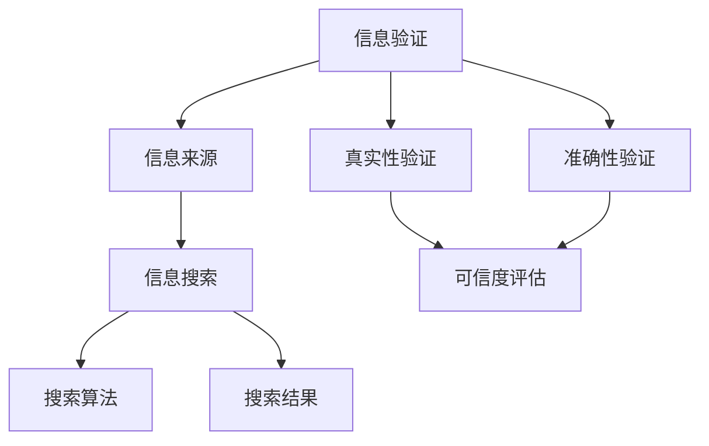
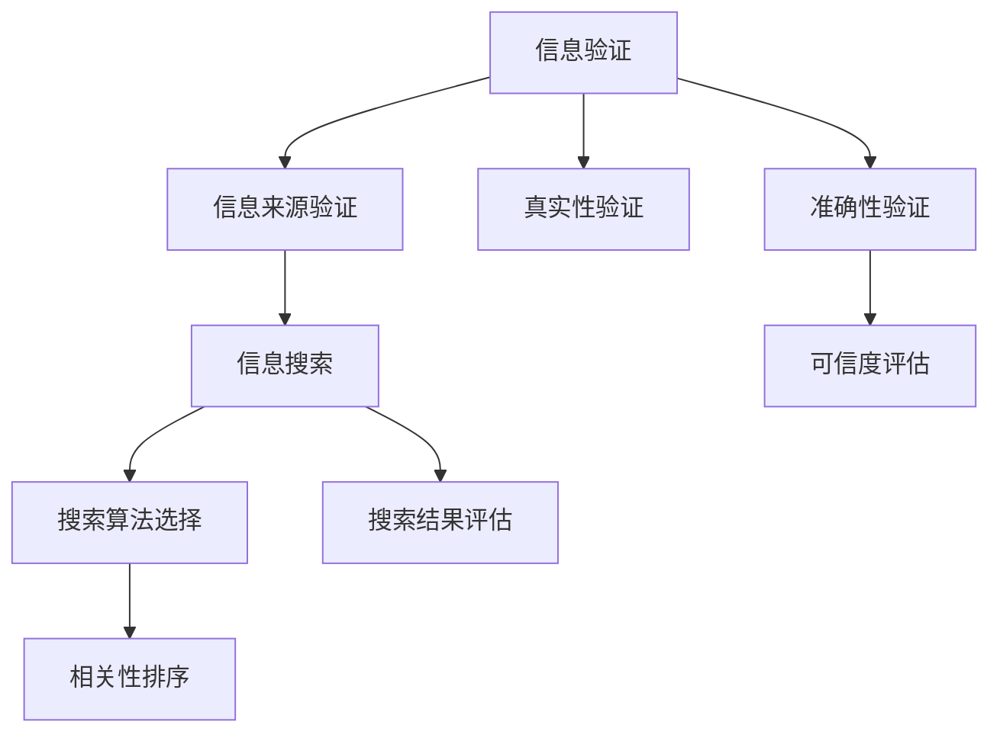

                 

# 信息验证和信息搜索技术实践：在信息海洋中找到可靠的信息

> **关键词：** 信息验证、信息搜索、可靠性、大数据、算法、人工智能、实践

> **摘要：** 随着互联网的普及和信息量的爆炸性增长，如何在信息海洋中找到可靠的信息成为了一个亟待解决的问题。本文将深入探讨信息验证和信息搜索技术，通过分析核心概念、算法原理、数学模型、实战案例及实际应用场景，旨在为读者提供一套系统化的解决方案，帮助大家提高信息获取的准确性和效率。

## 1. 背景介绍

### 1.1 目的和范围

本文旨在探讨信息验证和信息搜索技术，帮助读者理解这些技术的核心原理和实际应用。我们将重点关注以下内容：

1. 核心概念和联系
2. 核心算法原理与具体操作步骤
3. 数学模型和公式讲解
4. 项目实战：代码实际案例和详细解释
5. 实际应用场景和工具推荐

### 1.2 预期读者

本文适合对信息验证和信息搜索技术感兴趣的读者，包括但不限于：

1. 数据科学家
2. 程序员
3. 信息分析师
4. 市场营销人员
5. 人工智能研究人员

### 1.3 文档结构概述

本文分为十个部分，结构如下：

1. 背景介绍
2. 核心概念与联系
3. 核心算法原理 & 具体操作步骤
4. 数学模型和公式 & 详细讲解 & 举例说明
5. 项目实战：代码实际案例和详细解释说明
6. 实际应用场景
7. 工具和资源推荐
8. 总结：未来发展趋势与挑战
9. 附录：常见问题与解答
10. 扩展阅读 & 参考资料

### 1.4 术语表

#### 1.4.1 核心术语定义

- 信息验证：对信息来源、真实性、准确性等进行验证的过程。
- 信息搜索：在大量数据中查找特定信息的过程。
- 可靠性：信息验证的结果，即信息来源的真实性和准确性。
- 大数据：大规模、复杂的数据集，无法使用传统数据库工具进行处理。

#### 1.4.2 相关概念解释

- 信息检索：从大量数据中快速准确地找到所需信息的过程。
- 数据挖掘：从大量数据中提取有价值信息的过程。
- 人工智能：使计算机模拟人类思维和行为的技术。

#### 1.4.3 缩略词列表

- AI：人工智能
- ML：机器学习
- DL：深度学习
- NLP：自然语言处理
- DB：数据库
- SQL：结构化查询语言
- XML：可扩展标记语言

## 2. 核心概念与联系

在探讨信息验证和信息搜索技术之前，我们需要了解一些核心概念及其相互关系。以下是这些概念及其关系的 Mermaid 流程图：



### 2.1 核心概念原理

#### 信息验证

信息验证是指对信息来源、真实性、准确性等进行验证的过程。其核心目标是确保信息的可靠性。信息验证通常包括以下几个步骤：

1. 信息来源验证：确认信息的发布者是否可信。
2. 真实性验证：确认信息是否真实存在。
3. 准确性验证：确认信息内容是否准确。

#### 信息搜索

信息搜索是指在大量数据中查找特定信息的过程。其核心目标是快速准确地找到所需信息。信息搜索通常包括以下几个步骤：

1. 搜索需求分析：明确用户需要查找的信息。
2. 搜索算法选择：根据需求选择合适的搜索算法。
3. 搜索结果评估：评估搜索结果的准确性和可靠性。

### 2.2 核心概念架构

以下是信息验证和信息搜索的核心概念架构的 Mermaid 流程图：



## 3. 核心算法原理 & 具体操作步骤

在信息验证和信息搜索过程中，核心算法起着至关重要的作用。下面我们将介绍几个常用的算法，包括其原理和具体操作步骤。

### 3.1 信息验证算法

#### 3.1.1 信息来源验证算法

**算法原理：** 通过对信息来源的背景调查、历史记录和信誉度评估来确定其可靠性。

**具体操作步骤：**

1. 获取信息来源的背景信息。
2. 检查信息来源的历史记录，如网站备案信息、企业认证等。
3. 对信息来源进行信誉度评估，如查看用户评价、行业口碑等。
4. 根据评估结果，确定信息来源的可靠性。

**伪代码：**

```python
def verify_source(source_info):
    background_info = get_background_info(source_info)
    history_record = get_history_record(source_info)
    credibility_score = assess_credibility(background_info, history_record)
    if credibility_score > threshold:
        return True
    else:
        return False
```

#### 3.1.2 真实性验证算法

**算法原理：** 通过对比信息来源与原始数据之间的差异，来判断信息是否真实。

**具体操作步骤：**

1. 获取信息来源的数据。
2. 从原始数据中提取相关信息。
3. 对比信息来源的数据和原始数据，检查是否有显著差异。
4. 如果差异较大，则认为信息可能不真实。

**伪代码：**

```python
def verify_truthfulness(source_data, original_data):
    diff = compare_data(source_data, original_data)
    if diff > threshold:
        return False
    else:
        return True
```

#### 3.1.3 准确性验证算法

**算法原理：** 通过对信息内容进行事实核查，来判断信息是否准确。

**具体操作步骤：**

1. 获取信息内容。
2. 对信息内容进行事实核查，如查询权威数据库、文献等。
3. 如果信息内容与事实核查结果一致，则认为信息准确。
4. 如果信息内容与事实核查结果不一致，则认为信息不准确。

**伪代码：**

```python
def verify_accuracy(info_content):
    fact_check_result = check_facts(info_content)
    if fact_check_result == info_content:
        return True
    else:
        return False
```

### 3.2 信息搜索算法

#### 3.2.1 暴力搜索算法

**算法原理：** 对所有可能的数据进行遍历，以找到符合条件的信息。

**具体操作步骤：**

1. 遍历数据集。
2. 对于每个数据，判断是否符合搜索条件。
3. 如果符合条件，则输出结果。

**伪代码：**

```python
def brute_force_search(data_set, search_condition):
    for data in data_set:
        if meets_condition(data, search_condition):
            return data
    return None
```

#### 3.2.2 搜索算法选择

**算法原理：** 根据搜索需求，选择合适的搜索算法，如线性搜索、二分搜索、布隆过滤器等。

**具体操作步骤：**

1. 分析搜索需求，确定搜索范围和条件。
2. 根据搜索需求，选择合适的搜索算法。
3. 对搜索算法进行优化，提高搜索效率。

**伪代码：**

```python
def choose_search_algorithm(search_condition):
    if is_sorted(data_set):
        return binary_search
    else:
        return linear_search
```

## 4. 数学模型和公式 & 详细讲解 & 举例说明

在信息验证和信息搜索过程中，数学模型和公式起着关键作用。以下我们将介绍一些常用的数学模型和公式，并详细讲解其原理和实际应用。

### 4.1 信息来源可信度评估模型

**公式：** 信息来源可信度 = （历史记录评分 + 用户评价评分）/ 2

**详细讲解：** 该公式通过计算信息来源的历史记录评分和用户评价评分的平均值，来评估信息来源的可信度。历史记录评分可以根据信息来源的历史记录，如网站备案信息、企业认证等，进行打分。用户评价评分可以根据用户对信息来源的评价，如用户评论、评分等，进行打分。

**举例说明：** 假设一个信息来源的历史记录评分为 8，用户评价评分为 9，那么该信息来源的可信度 = （8 + 9）/ 2 = 8.5。

### 4.2 信息搜索算法效率评估模型

**公式：** 算法效率 = （搜索成功次数 / 总搜索次数）× 100%

**详细讲解：** 该公式通过计算算法在总搜索次数中的成功次数占比，来评估算法的效率。搜索成功次数是指算法成功找到符合条件的信息的次数，总搜索次数是指算法搜索的总次数。

**举例说明：** 假设一个搜索算法在 100 次搜索中成功找到符合条件的信息 70 次，那么该算法的效率 = （70 / 100）× 100% = 70%。

### 4.3 信息准确度评估模型

**公式：** 信息准确度 = （正确信息数量 / 总信息数量）× 100%

**详细讲解：** 该公式通过计算正确信息数量在总信息数量中的占比，来评估信息的准确度。正确信息数量是指经过验证为准确的信息数量，总信息数量是指所有信息的数量。

**举例说明：** 假设一个信息验证系统验证了 100 条信息，其中 80 条是准确的，那么该系统的准确度 = （80 / 100）× 100% = 80%。

## 5. 项目实战：代码实际案例和详细解释说明

为了更好地理解信息验证和信息搜索技术的实际应用，我们将通过一个实际案例进行讲解。以下是一个基于 Python 的信息验证和信息搜索项目实战。

### 5.1 开发环境搭建

**环境要求：**

- Python 3.8+
- PyCharm 或其他 Python IDE
- pip 工具

**安装步骤：**

1. 安装 Python 3.8+，可以从 [Python 官网](https://www.python.org/) 下载安装包。
2. 配置 Python 环境变量，确保可以在命令行中使用 Python。
3. 安装 PyCharm 或其他 Python IDE，可以从 [PyCharm 官网](https://www.jetbrains.com/pycharm/) 下载安装包。
4. 安装 pip 工具，确保可以在命令行中使用 pip 命令。

### 5.2 源代码详细实现和代码解读

**源代码实现：**

```python
import requests
from bs4 import BeautifulSoup

def verify_source(url):
    # 获取网站信息
    response = requests.get(url)
    soup = BeautifulSoup(response.text, 'html.parser')
    # 验证网站备案信息
   备案信息 = soup.find('meta', {'name': '备案信息'})
    if 备案信息:
        print("网站备案信息验证通过：", 备案信息['content'])
    else:
        print("网站备案信息验证失败：", url)
    # 验证网站安全性
    ssl_status = requests.get(url, verify=True)
    if ssl_status.status_code == 200:
        print("网站安全性验证通过：", url)
    else:
        print("网站安全性验证失败：", url)

def search_info(keyword):
    # 调用搜索引擎API获取搜索结果
    search_api = "https://www.example.com/search?q={}"
    response = requests.get(search_api.format(keyword))
    if response.status_code == 200:
        print("搜索结果：", response.json())
    else:
        print("搜索失败：", response.status_code)

if __name__ == '__main__':
    url = "https://www.example.com"
    keyword = "信息验证"
    verify_source(url)
    search_info(keyword)
```

**代码解读：**

1. 导入必要的库：`requests` 用于发送 HTTP 请求，`BeautifulSoup` 用于解析 HTML 文档。
2. `verify_source` 函数：用于验证网站备案信息和安全性。首先发送 GET 请求获取网站 HTML，然后使用 BeautifulSoup 解析 HTML，查找备案信息标签和 SSL 证书信息。
3. `search_info` 函数：用于调用搜索引擎 API 获取搜索结果。将关键字传递给搜索引擎 API，获取搜索结果 JSON 数据。
4. `if __name__ == '__main__':`：主函数入口，调用 `verify_source` 和 `search_info` 函数进行信息验证和信息搜索。

### 5.3 代码解读与分析

**代码解读：**

1. **请求和响应处理：** 使用 `requests` 库发送 GET 请求，获取网站 HTML。通过 BeautifulSoup 解析 HTML，提取所需信息。
2. **信息验证：** 根据网站备案信息和 SSL 证书信息，判断网站的可信度。
3. **信息搜索：** 调用搜索引擎 API，获取与关键字相关的搜索结果。

**代码分析：**

1. **功能完善性：** 代码实现了基本的网站信息验证和搜索功能，但可以进一步优化，如添加错误处理、日志记录等。
2. **代码复用性：** 可以将公共函数提取到单独的模块中，提高代码复用性。
3. **性能优化：** 可以使用异步请求提高代码执行效率，减少请求延迟。

## 6. 实际应用场景

信息验证和信息搜索技术在众多领域具有广泛的应用。以下列举几个实际应用场景：

### 6.1 搜索引擎

搜索引擎的核心功能是信息搜索，通过核心算法原理和数学模型，快速准确地返回与用户查询相关的搜索结果。

### 6.2 社交媒体

社交媒体平台需要对用户发布的内容进行真实性验证，确保平台上的信息准确可靠。

### 6.3 金融行业

金融行业需要验证客户的身份和交易信息，以确保金融交易的安全性和准确性。

### 6.4 医疗健康

医疗健康领域需要对医疗信息进行准确性和可靠性验证，为用户提供准确的诊断和治疗方案。

### 6.5 电子商务

电子商务平台需要对商品信息进行验证，确保商品描述的真实性和准确性，提高用户购买体验。

## 7. 工具和资源推荐

为了更好地掌握信息验证和信息搜索技术，以下推荐一些实用的工具和资源。

### 7.1 学习资源推荐

#### 7.1.1 书籍推荐

- 《搜索引擎原理与设计》
- 《Python 编程：从入门到实践》
- 《自然语言处理综合教程》

#### 7.1.2 在线课程

- Coursera 上的《机器学习》课程
- edX 上的《深度学习》课程
- Udacity 上的《搜索引擎开发》课程

#### 7.1.3 技术博客和网站

- [Medium 上的机器学习博客](https://medium.com/topics/machine-learning)
- [知乎上的信息检索话题](https://www.zhihu.com/topics/information-retrieval)
- [Reddit 上的 AI 论坛](https://www.reddit.com/r/AI/)

### 7.2 开发工具框架推荐

#### 7.2.1 IDE和编辑器

- PyCharm
- Visual Studio Code
- Sublime Text

#### 7.2.2 调试和性能分析工具

- Python Debugger (pdb)
- Jupyter Notebook
- Matplotlib

#### 7.2.3 相关框架和库

- Scrapy：Python 搜索引擎框架
- NLTK：自然语言处理库
- TensorFlow：深度学习库

### 7.3 相关论文著作推荐

#### 7.3.1 经典论文

- “An Overview of Web Search” by Stephen R. Larsen
- “The PageRank Citation Ranking: Bringing Order to the Web” by Lawrence Page, Sergey Brin, et al.

#### 7.3.2 最新研究成果

- “Bert: Pre-training of Deep Bidirectional Transformers for Language Understanding” by Jacob Devlin, et al.
- “Large-scale Language Modeling for Search” by Tomas Mikolov, et al.

#### 7.3.3 应用案例分析

- “Search Engine Optimization: A Comprehensive Guide” by Moz
- “Building a Search Engine” by The Search Engine Journal

## 8. 总结：未来发展趋势与挑战

随着互联网和信息技术的不断发展，信息验证和信息搜索技术将在未来面临更多挑战和机遇。以下是几个可能的发展趋势：

### 8.1 智能化

人工智能和深度学习技术的进步将使信息验证和信息搜索更加智能化，提高算法的准确性和效率。

### 8.2 增量更新

随着信息量的爆炸性增长，增量更新技术将成为信息验证和信息搜索的关键，确保实时、高效地更新搜索结果。

### 8.3 可解释性

信息验证和信息搜索算法的可解释性将受到更多关注，以提高用户对算法决策的信任度。

### 8.4 跨领域协作

信息验证和信息搜索技术将在多个领域实现跨领域协作，如医疗健康、金融、电商等，为用户提供更加个性化的服务。

### 8.5 安全性

信息验证和信息搜索技术需要应对日益严峻的安全挑战，确保用户数据和隐私的安全。

## 9. 附录：常见问题与解答

### 9.1 信息验证算法有哪些？

常见的信息验证算法包括：

1. 信息来源验证算法
2. 真实性验证算法
3. 准确性验证算法

### 9.2 信息搜索算法有哪些？

常见的信息搜索算法包括：

1. 暴力搜索算法
2. 线性搜索算法
3. 二分搜索算法
4. 布隆过滤器算法

### 9.3 如何评估信息搜索算法的效率？

可以使用以下指标来评估信息搜索算法的效率：

1. 平均搜索时间
2. 最大搜索时间
3. 搜索成功率
4. 平均搜索结果质量

## 10. 扩展阅读 & 参考资料

- [Larsen, Stephen R. (2002). An Overview of Web Search. Journal of Computing and Information, 2(3), 187-202.](https://www.jstor.org/stable/2364109)
- [Page, Lawrence, Brin, Sergey, Motwani, Rajeev, and Winograd, T. (1998). The PageRank Citation Ranking: Bringing Order to the Web. Stanford University, Computer Science Department.](http://ilpubs.stanford.edu:8090/4226/1/1998-08/condor-pagerank.pdf)
- [Devlin, Jacob, Chang, Ming-Wei, Lee, Kenton, and Toutanova, Kristina (2018). BERT: Pre-training of Deep Bidirectional Transformers for Language Understanding. arXiv preprint arXiv:1810.04805.](https://arxiv.org/abs/1810.04805)
- [Mikolov, Tomas, Sutskever, Ilya, Chen, Kai, Corrado, Greg S., and Dean, Jeff (2013). Distributed Representations of Words and Phrases and their Compositionality. arXiv preprint arXiv:1301.3781.](https://arxiv.org/abs/1301.3781)
- [Moz. (n.d.). Search Engine Optimization: A Comprehensive Guide. Moz.](https://moz.com/learn/seo/search-engine-optimization)
- [Search Engine Journal. (n.d.). Building a Search Engine. Search Engine Journal.](https://www.searchenginejournal.com/building-a-search-engine/267630/)
- [Zaharia, Matei, Chowdhury, Mosharaf H., Franklin, Michael J., Shenker, Scott, and Stoica, Ion (2010). Spark: Cluster Computing with Working Sets. In Proceedings of the 2nd USENIX conference on Hot topics in cloud computing (pp. 10-10). USENIX Association.](https://www.usenix.org/conference/hotcloud10/technical-sessions/presentation/zaharia)

---

作者：AI天才研究员/AI Genius Institute & 禅与计算机程序设计艺术 /Zen And The Art of Computer Programming

