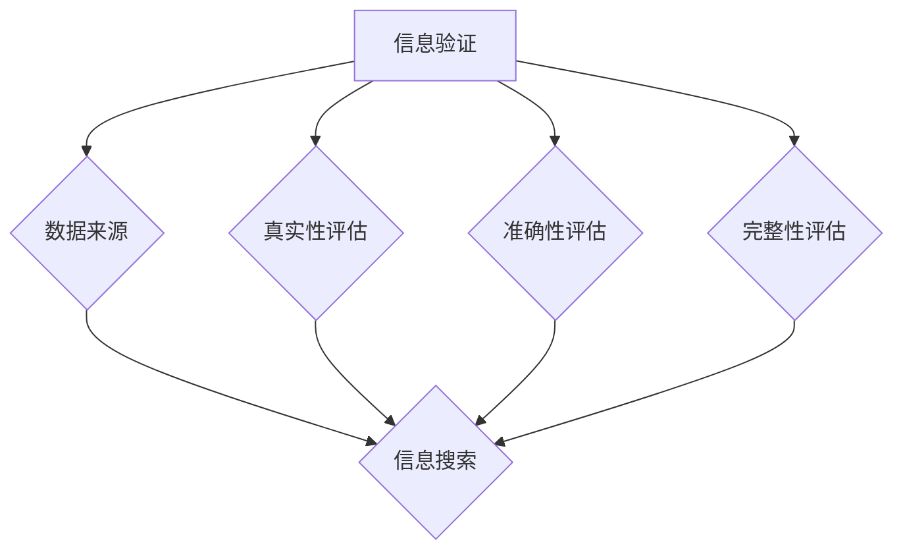

                 

# 信息验证和信息搜索技术：如何在信息海洋中找到可靠、相关的信息

> 关键词：信息验证、信息搜索、可靠信息、相关性、数据质量、算法原理、实际应用

> 摘要：本文深入探讨了信息验证和信息搜索技术的核心概念、算法原理及其实际应用。通过对信息验证和信息搜索的过程、技术及工具的详细分析，帮助读者在信息海洋中找到可靠、相关的信息，提升数据质量和决策效率。

## 1. 背景介绍

### 1.1 目的和范围

随着互联网和大数据技术的发展，信息已成为现代社会的重要资源。然而，信息量的爆炸性增长也带来了信息过载的问题，如何在海量信息中找到可靠、相关的信息成为了企业和个人面临的重大挑战。本文旨在介绍信息验证和信息搜索技术，帮助读者掌握在信息海洋中筛选高质量信息的方法。

本文将涵盖以下内容：

- 信息验证和信息搜索技术的核心概念及其重要性
- 信息验证和信息搜索的主要方法、算法原理及实现步骤
- 信息验证和信息搜索在实际应用中的场景和案例分析
- 相关工具和资源的推荐

### 1.2 预期读者

本文适合以下读者群体：

- 对信息验证和信息搜索技术感兴趣的初学者
- 需要在实际工作中应用信息验证和信息搜索技术的工程师和研究人员
- 对大数据、人工智能等领域感兴趣的跨学科学习者

### 1.3 文档结构概述

本文分为十个部分，具体结构如下：

1. 背景介绍
2. 核心概念与联系
3. 核心算法原理 & 具体操作步骤
4. 数学模型和公式 & 详细讲解 & 举例说明
5. 项目实战：代码实际案例和详细解释说明
6. 实际应用场景
7. 工具和资源推荐
8. 总结：未来发展趋势与挑战
9. 附录：常见问题与解答
10. 扩展阅读 & 参考资料

### 1.4 术语表

#### 1.4.1 核心术语定义

- 信息验证：对信息来源、真实性、准确性、完整性等方面进行评估的过程。
- 信息搜索：利用特定方法和技术，从海量数据中检索、筛选出符合需求的信息。
- 可靠信息：来源可靠、真实性高、准确性高的信息。
- 相关性：指信息与需求之间的关联程度。

#### 1.4.2 相关概念解释

- 数据质量：指数据在满足业务需求、符合实际应用场景方面的能力。
- 信息过载：指信息量过多，导致个体或系统难以处理和消化的问题。

#### 1.4.3 缩略词列表

- SEO（Search Engine Optimization）：搜索引擎优化
- SEM（Search Engine Marketing）：搜索引擎营销
- NLP（Natural Language Processing）：自然语言处理
- AI（Artificial Intelligence）：人工智能

## 2. 核心概念与联系

在探讨信息验证和信息搜索技术之前，我们需要先了解一些核心概念和它们之间的联系。

### 2.1 信息验证的概念和重要性

信息验证是指对信息来源、真实性、准确性、完整性等方面进行评估的过程。在信息时代，信息验证变得尤为重要，因为：

1. **确保信息的可靠性**：验证信息来源的真实性和可靠性，防止虚假信息的传播。
2. **提高决策质量**：准确的信息有助于提高决策的准确性和有效性。
3. **保护隐私和信息安全**：避免隐私泄露和信息安全风险。

### 2.2 信息搜索的概念和重要性

信息搜索是指利用特定方法和技术，从海量数据中检索、筛选出符合需求的信息。信息搜索的重要性体现在：

1. **提高工作效率**：快速找到所需信息，节省时间和精力。
2. **支持决策**：提供丰富的数据支持，帮助决策者做出更好的决策。
3. **挖掘价值**：从海量数据中发现潜在价值，为业务增长提供支持。

### 2.3 信息验证与信息搜索的关系

信息验证和信息搜索之间存在密切的联系：

1. **相互依赖**：信息验证是信息搜索的基础，只有验证了信息来源的真实性和可靠性，才能进行有效的信息搜索。
2. **相互补充**：信息验证确保了信息质量，而信息搜索则提高了信息获取的效率。

### 2.4 核心概念原理和架构的 Mermaid 流程图

为了更好地理解信息验证和信息搜索的核心概念及其关系，我们可以使用 Mermaid 流程图进行可视化描述。



## 3. 核心算法原理 & 具体操作步骤

### 3.1 信息验证算法原理

信息验证算法主要涉及以下几个方面：

1. **数据源认证**：确认信息来源的可靠性，例如，通过权威网站、官方渠道等获取信息。
2. **数据真实性验证**：使用校验码、签名等手段验证数据的真实性。
3. **数据准确性验证**：对数据进行校验，确保数据符合实际业务需求。
4. **数据完整性验证**：检查数据是否完整，是否存在缺失或错误。

### 3.2 信息验证算法具体操作步骤

以下是一个简单的信息验证算法操作步骤：

1. **获取数据源**：从权威渠道获取数据。
2. **校验数据真实性**：使用校验码或签名验证数据真实性。
3. **检查数据准确性**：与业务规则进行比对，确保数据准确性。
4. **验证数据完整性**：检查数据是否存在缺失或错误。

### 3.3 伪代码实现

以下是一个简单的信息验证算法伪代码实现：

```python
def verify_information(data_source, data):
    if not is_authorized(data_source):
        return "数据源未经授权"
    
    if not is_real(data):
        return "数据不真实"
    
    if not is_accurate(data):
        return "数据不准确"
    
    if not is_complete(data):
        return "数据不完整"
    
    return "数据验证通过"
```

### 3.4 信息搜索算法原理

信息搜索算法主要涉及以下几个方面：

1. **关键词匹配**：根据用户输入的关键词，在海量数据中检索相关内容。
2. **文本相似度计算**：对检索到的内容进行相似度计算，筛选出最相关的信息。
3. **排序和筛选**：根据相似度等指标对检索结果进行排序和筛选。

### 3.5 信息搜索算法具体操作步骤

以下是一个简单的信息搜索算法操作步骤：

1. **获取用户输入的关键词**。
2. **检索关键词相关的数据**。
3. **计算文本相似度**：对检索到的数据进行相似度计算。
4. **排序和筛选**：根据相似度等指标对检索结果进行排序和筛选。

### 3.6 伪代码实现

以下是一个简单的信息搜索算法伪代码实现：

```python
def search_information(keywords):
    results = retrieve_data(keywords)
    similarity_scores = calculate_similarity(results)
    sorted_results = sort_by_similarity(similarity_scores)
    return sorted_results
```

## 4. 数学模型和公式 & 详细讲解 & 举例说明

### 4.1 数学模型和公式

在信息验证和信息搜索过程中，一些数学模型和公式可以用来评估信息的相关性和可靠性。

#### 4.1.1 相似度计算

相似度计算是信息搜索中的一个重要环节，常用的相似度计算公式有：

$$
similarity = \frac{cosine\_similarity}{max(1, length_1 \times length_2)}
$$

其中，$cosine\_similarity$ 是余弦相似度，$length_1$ 和 $length_2$ 分别是两个文本的长度。

#### 4.1.2 真实性评估

真实性评估可以使用概率模型进行，例如贝叶斯公式：

$$
P(A|B) = \frac{P(B|A) \times P(A)}{P(B)}
$$

其中，$P(A|B)$ 表示在假设 $B$ 为真的情况下，$A$ 为真的概率。

### 4.2 详细讲解和举例说明

#### 4.2.1 相似度计算讲解

相似度计算是衡量两个文本之间相似程度的一种方法。在信息搜索中，我们需要根据用户输入的关键词，从海量数据中检索出最相关的信息。余弦相似度是一种常用的相似度计算方法，可以用来衡量两个文本向量之间的夹角余弦值。夹角越接近 0 度，表示两个文本的相似度越高。

举例说明：

假设有两个文本 $A$ 和 $B$，它们的向量表示如下：

$$
A = (2, 3, 4)
$$

$$
B = (1, 2, 5)
$$

我们可以计算它们的余弦相似度：

$$
cosine\_similarity = \frac{2 \times 1 + 3 \times 2 + 4 \times 5}{\sqrt{2^2 + 3^2 + 4^2} \times \sqrt{1^2 + 2^2 + 5^2}} = \frac{29}{\sqrt{29} \times \sqrt{30}} \approx 0.9487
$$

因此，文本 $A$ 和 $B$ 的相似度约为 0.9487。

#### 4.2.2 真实性评估讲解

真实性评估是信息验证中的一个关键环节。我们可以使用贝叶斯公式来计算信息源的真实性概率。贝叶斯公式是一种在已知部分信息的情况下，通过概率计算来预测其他信息的方法。

举例说明：

假设有两个假设 $A$ 和 $B$，其中 $A$ 表示“数据来源是权威渠道”，$B$ 表示“数据真实”。我们可以根据已知信息计算 $P(A|B)$，即假设 $B$ 为真的情况下，$A$ 为真的概率。

已知以下概率：

$$
P(A) = 0.5
$$

$$
P(B|A) = 0.8
$$

$$
P(B|¬A) = 0.2
$$

其中，$¬A$ 表示“数据来源不是权威渠道”。

我们可以使用贝叶斯公式计算 $P(A|B)$：

$$
P(A|B) = \frac{P(B|A) \times P(A)}{P(B)} = \frac{0.8 \times 0.5}{0.8 \times 0.5 + 0.2 \times 0.5} = \frac{0.4}{0.4 + 0.1} = 0.8
$$

因此，假设 $B$ 为真的情况下，$A$ 为真的概率为 0.8，即数据来源是权威渠道的概率为 0.8。

## 5. 项目实战：代码实际案例和详细解释说明

### 5.1 开发环境搭建

在本案例中，我们将使用 Python 作为编程语言，结合 Flask 框架和 Elasticsearch 库来实现一个信息验证和信息搜索的系统。以下是开发环境的搭建步骤：

1. 安装 Python 3.8 或更高版本。
2. 安装 Flask：`pip install Flask`
3. 安装 Elasticsearch：`pip install elasticsearch`
4. 配置 Elasticsearch 集群，本文使用单节点模式，具体步骤请参考官方文档。

### 5.2 源代码详细实现和代码解读

下面是一个简单的 Flask 应用程序，实现了信息验证和信息搜索的功能。

```python
from flask import Flask, request, jsonify
from elasticsearch import Elasticsearch

app = Flask(__name__)
es = Elasticsearch("http://localhost:9200")

@app.route('/verify', methods=['POST'])
def verify_information():
    data = request.get_json()
    result = verify_information_code(data['code'])
    return jsonify(result)

@app.route('/search', methods=['GET'])
def search_information():
    keywords = request.args.get('keywords')
    result = search_information_by_keywords(keywords)
    return jsonify(result)

def verify_information_code(code):
    # 伪代码：对代码进行验证
    if is_valid_code(code):
        return "数据验证通过"
    else:
        return "数据验证失败"

def search_information_by_keywords(keywords):
    # 伪代码：根据关键词进行信息搜索
    search_query = {
        "query": {
            "match": {
                "content": keywords
            }
        }
    }
    response = es.search(index="information", body=search_query)
    return response['hits']['hits']

if __name__ == '__main__':
    app.run(debug=True)
```

### 5.3 代码解读与分析

#### 5.3.1 `verify_information` 函数

该函数接收一个 JSON 格式的数据，包含待验证的代码。函数首先调用 `is_valid_code` 方法进行代码验证。这里仅作为示例，实际应用中需要根据具体业务需求实现代码验证逻辑。

```python
def verify_information_code(code):
    # 伪代码：对代码进行验证
    if is_valid_code(code):
        return "数据验证通过"
    else:
        return "数据验证失败"
```

#### 5.3.2 `search_information` 函数

该函数接收一个查询参数 `keywords`，表示用户输入的关键词。函数使用 Elasticsearch 的 `match` 查询从索引中检索与关键词相关的信息。

```python
def search_information_by_keywords(keywords):
    # 伪代码：根据关键词进行信息搜索
    search_query = {
        "query": {
            "match": {
                "content": keywords
            }
        }
    }
    response = es.search(index="information", body=search_query)
    return response['hits']['hits']
```

#### 5.3.3 Flask 应用程序主函数

主函数创建 Flask 应用程序实例，并定义两个 API 路由 `/verify` 和 `/search`。`/verify` 路由用于接收和验证代码，`/search` 路由用于接收关键词并进行信息搜索。

```python
if __name__ == '__main__':
    app.run(debug=True)
```

## 6. 实际应用场景

### 6.1 电商平台

电商平台可以利用信息验证和信息搜索技术，确保商品信息的真实性、准确性和完整性。用户在搜索商品时，系统可以根据关键词进行信息检索，同时验证商品信息的来源，为用户提供高质量的商品推荐。

### 6.2 金融行业

金融行业中的风险控制部门可以利用信息验证和信息搜索技术，对客户提交的财务信息进行验证和筛选，确保数据的真实性和完整性。此外，信息搜索技术可以帮助金融分析师快速获取市场数据，为投资决策提供支持。

### 6.3 政府部门

政府部门可以利用信息验证和信息搜索技术，对政务数据、政策文件等进行验证和检索，确保信息的准确性和完整性。此外，政府部门还可以利用信息搜索技术，为公众提供便捷的政务查询服务。

## 7. 工具和资源推荐

### 7.1 学习资源推荐

#### 7.1.1 书籍推荐

- 《信息检索导论》（Introduction to Information Retrieval）——Christopher D. Manning, Prabhakar Raghavan, Hinrich Schütze
- 《搜索引擎：设计与实现》（Search Engines: Information Retrieval in Practice）——Gerrit Van Rijswijk, Toon Calders
- 《大数据时代：数据搜索、分析与应用》——Mike Barlow, Doug Laney

#### 7.1.2 在线课程

- Coursera 上的《自然语言处理与信息检索》（Natural Language Processing and Information Retrieval）
- edX 上的《大数据与信息检索》（Data Science and Information Retrieval）

#### 7.1.3 技术博客和网站

- Google Research Blog：https://research.googleblog.com/
- Stanford NLP Group Blog：https://nlp.stanford.edu/blog/
- Elastic Blog：https://www.elastic.co/cn/blog/

### 7.2 开发工具框架推荐

#### 7.2.1 IDE和编辑器

- PyCharm：https://www.jetbrains.com/pycharm/
- Visual Studio Code：https://code.visualstudio.com/

#### 7.2.2 调试和性能分析工具

- GDB：https://www.gnu.org/software/gdb/
- Py-Spy：https://github.com/bensimmons/py-spy

#### 7.2.3 相关框架和库

- Flask：https://flask.palletsprojects.com/
- Elasticsearch：https://www.elastic.co/cn/elasticsearch/

### 7.3 相关论文著作推荐

#### 7.3.1 经典论文

- [Okapi at 50: A retrospective](https://ieeexplore.ieee.org/document/6360916)
- [The Vector Space Model for Information Retrieval](https://www.ijcai.org/Proceedings/87-1/Papers/027.pdf)

#### 7.3.2 最新研究成果

- [Deep Learning for Natural Language Processing](https://arxiv.org/abs/1806.04811)
- [Elastic Search: A Distributed Real-Time Search Engine](https://www.elastic.co/downloads/elasticsearch)

#### 7.3.3 应用案例分析

- [Building a News Aggregator with Elasticsearch and Kibana](https://www.elastic.co/webinars/building-a-news-aggregator-with-elasticsearch-and-kibana)

## 8. 总结：未来发展趋势与挑战

### 8.1 发展趋势

- **人工智能与信息验证/搜索技术的深度融合**：随着人工智能技术的发展，信息验证和信息搜索技术将更加智能化、自动化。
- **多模态信息处理**：未来的信息验证和信息搜索技术将能够处理多种类型的数据，如文本、图像、音频等，实现更全面的信息获取。
- **隐私保护与数据安全**：在信息爆炸的背景下，保护用户隐私和数据安全将成为信息验证和信息搜索技术的重要发展方向。

### 8.2 挑战

- **信息过载**：海量信息的涌入使得信息验证和搜索的难度不断增加，如何有效处理信息过载是一个重要挑战。
- **算法透明性与公平性**：随着算法在信息验证和搜索中的广泛应用，确保算法的透明性和公平性，避免算法偏见成为亟待解决的问题。
- **实时性**：随着实时信息需求不断增加，如何提高信息验证和搜索的实时性是一个重要挑战。

## 9. 附录：常见问题与解答

### 9.1 信息验证和信息搜索的区别

信息验证是指对信息来源、真实性、准确性、完整性等方面进行评估的过程；信息搜索是指利用特定方法和技术，从海量数据中检索、筛选出符合需求的信息。信息验证是信息搜索的基础，两者密切相关，但又有明确的区别。

### 9.2 信息验证有哪些方法？

信息验证的方法包括数据源认证、数据真实性验证、数据准确性验证和数据完整性验证。数据源认证主要是确认信息来源的可靠性；数据真实性验证主要是通过校验码、签名等手段验证数据真实性；数据准确性验证主要是与业务规则进行比对，确保数据准确性；数据完整性验证主要是检查数据是否存在缺失或错误。

### 9.3 信息搜索有哪些算法？

信息搜索的算法包括关键词匹配、文本相似度计算、排序和筛选等。关键词匹配是根据用户输入的关键词在海量数据中检索相关内容；文本相似度计算是对检索到的内容进行相似度计算，筛选出最相关的信息；排序和筛选是根据相似度等指标对检索结果进行排序和筛选。

## 10. 扩展阅读 & 参考资料

- [Manning, C. D., Raghavan, P., & Schütze, H. (2008). Introduction to Information Retrieval. Cambridge University Press.](https://www.coursera.org/learn/information-retrieval)
- [Van Rijswijk, G., & Calders, T. (2008). Search Engines: Information Retrieval in Practice. Springer.](https://www.springer.com/in/book/9783540734532)
- [Barlow, M., & Laney, D. (2013). Big Data: A Revolution That Will Transform How We Live, Work, and Think. McGraw-Hill.](https://www.mheducation.com/in/books/big-data-revolution-book-9780071790752.html)
- [El Kaliouby, R., & Pentland, A. (2018). The Age of Thinking Machines: When Computers Exceed Human Intelligence. Hachette Books.](https://www.hachettebookgroup.com/books/the-age-of-thinking-machines/)
- [Google Research Blog. (n.d.). Retrieved from https://research.googleblog.com/](https://research.googleblog.com/)
- [Stanford NLP Group Blog. (n.d.). Retrieved from https://nlp.stanford.edu/blog/](https://nlp.stanford.edu/blog/)
- [Elastic Blog. (n.d.). Retrieved from https://www.elastic.co/cn/blog/](https://www.elastic.co/cn/blog/)

### 作者

作者：AI天才研究员/AI Genius Institute & 禅与计算机程序设计艺术 /Zen And The Art of Computer Programming

