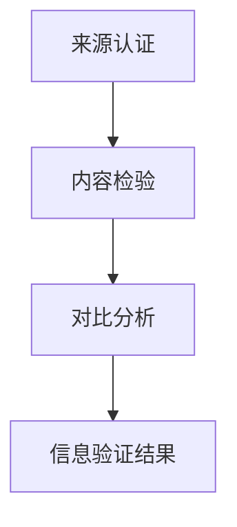
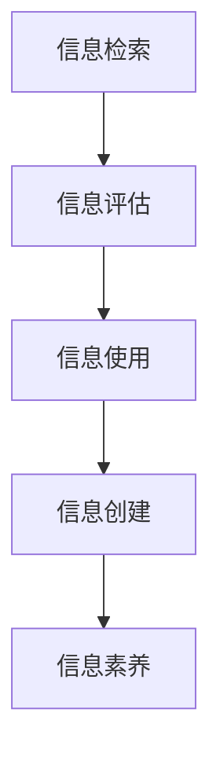
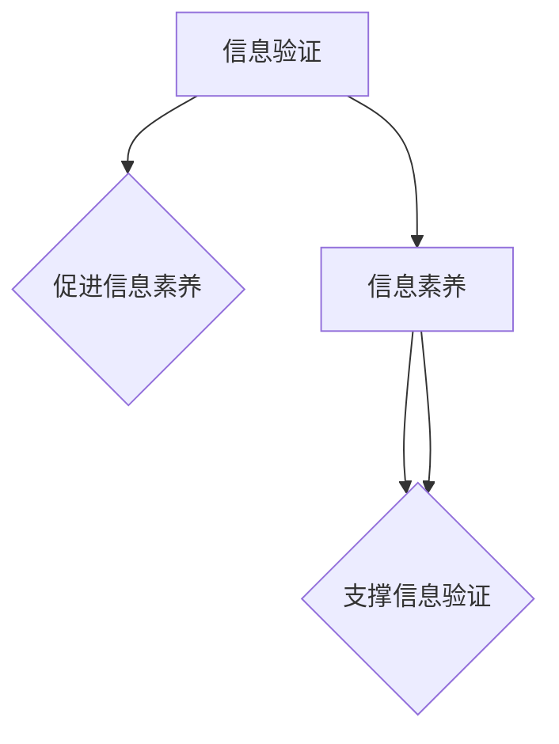

                 

# 信息验证和信息素养教育重要性：为数字时代培养信息素养能力

## 关键词
- 信息验证
- 信息素养
- 数字时代
- 教育技术
- 信息安全
- 数据隐私

## 摘要
本文旨在探讨信息验证和信息素养教育在数字时代的重要性，以及如何通过系统化的教育和实践培养个体的信息素养能力。随着互联网和数字技术的飞速发展，个体对信息的获取、处理和判断能力愈发关键。文章首先概述了信息验证和信息素养教育的背景，随后深入分析了信息验证和信息素养的核心概念和联系。通过具体的算法原理、数学模型、项目实战，文章展示了如何将这些概念应用于实际中。最后，文章探讨了信息验证和信息素养教育在现实世界的应用场景，并推荐了相关的学习资源、开发工具和最新研究成果。通过本文，我们希望能为教育工作者、信息科学从业者和普通读者提供有价值的参考。

## 1. 背景介绍

### 1.1 目的和范围

本文的目的是探讨信息验证和信息素养教育在数字时代的重要性，并提供一种系统化的方法来培养个体在信息社会中的素养能力。随着互联网和数字技术的迅速普及，信息的获取、处理和利用已经成为现代社会的一项基本技能。然而，面对海量的信息和不断变化的技术环境，个体常常感到困惑和无从下手。

本文将主要涵盖以下几个方面的内容：

1. **信息验证和信息素养的定义**：介绍信息验证和信息素养的基本概念，解释其在数字时代的重要性。
2. **核心概念与联系**：通过Mermaid流程图展示信息验证和信息素养的核心概念及其相互关系。
3. **算法原理与操作步骤**：详细阐述信息验证的算法原理，并提供具体的操作步骤和伪代码。
4. **数学模型和公式**：分析信息素养相关的数学模型和公式，并进行举例说明。
5. **项目实战**：通过实际代码案例，展示如何将信息验证和信息素养应用于实际项目中。
6. **应用场景**：讨论信息验证和信息素养在现实世界中的具体应用。
7. **工具和资源推荐**：推荐相关的学习资源、开发工具和最新研究成果。

### 1.2 预期读者

本文的目标读者包括：

1. **教育工作者**：了解信息验证和信息素养教育的重要性，以及如何将其融入教育课程中。
2. **信息科学从业者**：掌握信息验证和信息素养的核心概念和实践方法，提升工作能力。
3. **普通读者**：增强对信息社会的认知，提高自身的信息素养水平。

### 1.3 文档结构概述

本文将按照以下结构进行组织：

1. **引言**：介绍文章的背景和目的。
2. **背景介绍**：概述信息验证和信息素养教育的背景和重要性。
3. **核心概念与联系**：分析信息验证和信息素养的核心概念及其相互关系。
4. **算法原理与操作步骤**：详细阐述信息验证的算法原理和具体操作步骤。
5. **数学模型和公式**：分析信息素养相关的数学模型和公式，并进行举例说明。
6. **项目实战**：通过实际代码案例展示信息验证和信息素养的应用。
7. **应用场景**：讨论信息验证和信息素养在现实世界中的应用。
8. **工具和资源推荐**：推荐相关的学习资源、开发工具和最新研究成果。
9. **总结**：总结本文的主要观点和未来发展趋势。
10. **附录**：常见问题与解答。
11. **扩展阅读**：提供进一步的阅读资料。

### 1.4 术语表

#### 1.4.1 核心术语定义

- **信息验证**：验证信息的真实性、准确性和可靠性。
- **信息素养**：个体获取、评估、使用和创建信息的能力。
- **数字时代**：信息技术高速发展的时代，以互联网和数字技术为核心。
- **信息安全**：保护信息免受未经授权的访问、泄露、破坏和篡改。
- **数据隐私**：个人数据的保密性和私密性。

#### 1.4.2 相关概念解释

- **信息安全**：确保信息的保密性、完整性和可用性。
- **数据隐私**：保护个人数据不被未经授权的第三方访问和使用。

#### 1.4.3 缩略词列表

- **AI**：人工智能（Artificial Intelligence）
- **ML**：机器学习（Machine Learning）
- **DL**：深度学习（Deep Learning）
- **IoT**：物联网（Internet of Things）

## 2. 核心概念与联系

### 2.1 信息验证

**定义**：信息验证是指通过一系列方法和手段来确认信息的真实性、准确性和可靠性。它是确保信息质量的重要环节，对于信息的使用和传播具有至关重要的作用。

**原理**：信息验证的原理主要基于对信息来源的认证、信息内容的检验和信息的对比分析。具体包括以下步骤：

1. **来源认证**：验证信息发布者的身份和信誉，确保信息的可信度。
2. **内容检验**：检查信息的真实性、准确性和完整性。
3. **对比分析**：通过对比不同来源的信息，识别和纠正错误。

**流程图**：


### 2.2 信息素养

**定义**：信息素养是指个体在信息社会中获取、评估、使用和创建信息的能力。它不仅包括信息检索技能，还涉及信息的批判性思维、信息伦理和信息的合理使用。

**原理**：信息素养的原理基于对信息过程的全面理解和应用。具体包括以下方面：

1. **信息检索**：掌握有效检索信息的技能，包括搜索引擎的使用、数据库的查询等。
2. **信息评估**：对检索到的信息进行评估，判断其可信度、准确性和相关性。
3. **信息使用**：合理使用信息，包括信息整合、信息分享和信息的创新应用。
4. **信息创建**：利用信息进行创造性工作，包括写作、设计、编程等。

**流程图**：


### 2.3 核心概念的联系

信息验证和信息素养是密切相关的概念，它们共同构成了个体在信息社会中的核心能力。信息验证是信息素养的基础，没有可靠的信息验证，个体很难获取到准确和可靠的信息。而信息素养则是在信息验证的基础上，进一步对信息进行评估、使用和创造。

**联系**：

1. **信息验证促进信息素养**：通过信息验证，个体能够获取到更高质量的信息，从而提高信息素养。
2. **信息素养支撑信息验证**：具备信息素养的个体能够更好地进行信息验证，确保信息的真实性和准确性。

**图示**：


通过上述核心概念与联系的分析，我们可以看到信息验证和信息素养在数字时代的重要性。接下来的章节将深入探讨信息验证的算法原理和操作步骤，以及如何培养个体的信息素养能力。

## 3. 核心算法原理 & 具体操作步骤

### 3.1 算法原理

信息验证的核心在于确保信息的真实性和可靠性。这个过程涉及到多个算法和技术的综合应用，主要包括：

1. **身份认证算法**：用于验证信息发布者的身份，确保信息来源的合法性。
2. **内容校验算法**：用于检查信息的内容是否真实、准确和完整。
3. **对比分析算法**：通过对比多个来源的信息，识别和纠正错误。

下面将详细阐述这些算法的原理。

#### 3.1.1 身份认证算法

身份认证算法的核心目标是验证信息发布者的身份，确保信息来源的可靠性。常见的身份认证算法包括：

- **基于密钥的认证**：使用密钥对信息进行加密和解密，通过验证解密后的信息来确认发布者的身份。
- **基于数字签名**：发布者使用私钥对信息进行数字签名，接收方使用相应的公钥进行验证，确保信息未被篡改且来自合法发布者。

伪代码：
```plaintext
算法：身份认证
输入：信息，发布者公钥
输出：是否通过认证

1. 解密信息
2. 验证数字签名
3. 如果信息解密成功且签名验证通过，则返回“通过认证”
4. 否则，返回“认证失败”
```

#### 3.1.2 内容校验算法

内容校验算法主要用于验证信息的真实性和准确性。常见的内容校验方法包括：

- **哈希校验**：使用哈希函数对信息内容进行加密，生成哈希值。接收方重新计算哈希值，并与发送方提供的哈希值进行对比，以验证信息内容是否发生变化。
- **对比数据库**：将接收到的信息与已知的可信数据库进行对比，以验证信息的准确性。

伪代码：
```plaintext
算法：内容校验
输入：信息，哈希值，可信数据库
输出：是否通过校验

1. 计算信息的哈希值
2. 对比哈希值与发送方提供的哈希值
3. 如果哈希值相同，则验证通过
4. 否则，进行对比数据库校验
5. 如果在可信数据库中找到匹配项，则验证通过
6. 否则，校验失败
```

#### 3.1.3 对比分析算法

对比分析算法通过对比多个来源的信息，识别和纠正错误。这种方法可以有效地提高信息的准确性和可靠性。

- **多源信息对比**：将多个来源的信息进行对比，识别出不一致的地方。
- **加权平均法**：对多个来源的信息进行加权平均，得到一个更准确的值。

伪代码：
```plaintext
算法：对比分析
输入：多个信息源
输出：分析结果

1. 初始化分析结果为空
2. 对于每个信息源，执行以下操作：
   1. 读取信息源的信息
   2. 与已有信息进行对比
   3. 计算差异值
3. 对差异值进行加权平均
4. 生成分析结果
```

### 3.2 具体操作步骤

为了更好地理解上述算法的原理和应用，下面将给出一个具体的信息验证流程，并使用伪代码详细描述每一步操作。

#### 3.2.1 信息验证流程

1. **身份认证**：接收信息后，首先进行身份认证，验证信息发布者的合法性。
2. **内容校验**：在身份认证通过后，对信息内容进行校验，确保信息未被篡改。
3. **对比分析**：对多个来源的信息进行对比分析，识别和纠正错误。

伪代码：
```plaintext
流程：信息验证
输入：信息，发布者公钥，哈希值，可信数据库，其他信息源
输出：验证结果

1. 身份认证（信息，发布者公钥）
2. 如果认证失败，返回“认证失败”
3. 内容校验（信息，哈希值，可信数据库）
4. 如果校验失败，返回“内容校验失败”
5. 对比分析（信息，其他信息源）
6. 如果存在不一致的地方，返回“对比分析失败”
7. 否则，返回“验证通过”
```

通过上述算法原理和具体操作步骤的介绍，我们可以看到信息验证在保障信息真实性和可靠性方面的重要性。接下来，我们将分析信息素养相关的数学模型和公式，以及它们在信息处理中的应用。

## 4. 数学模型和公式 & 详细讲解 & 举例说明

### 4.1 信息验证的数学模型

在信息验证过程中，常用的数学模型包括哈希模型、概率模型和误差模型等。这些模型能够帮助我们更准确地评估信息的真实性和可靠性。

#### 4.1.1 哈希模型

哈希模型是信息验证中最常用的模型之一，它通过哈希函数将信息转换为固定长度的哈希值。哈希值具有唯一性和快速计算的特点，能够有效地验证信息的内容是否发生变化。

**公式**：
\[ H(M) = \text{哈希值} \]

其中，\( H \) 是哈希函数，\( M \) 是原始信息。

**举例说明**：

假设原始信息为 "Hello, World!"，我们使用 SHA-256 哈希函数进行哈希运算，得到哈希值为：

\[ \text{哈希值} = \text{SHA-256}("Hello, World!") \]

通过对比哈希值，我们可以验证信息的完整性。如果哈希值不一致，说明信息可能已被篡改。

#### 4.1.2 概率模型

概率模型用于评估信息来源的可靠性和信息内容的真实性。常见的概率模型包括贝叶斯概率模型和贝塔分布模型。

**贝叶斯概率模型**：
\[ P(A|B) = \frac{P(B|A) \cdot P(A)}{P(B)} \]

其中，\( P(A|B) \) 是在事件 \( B \) 发生的条件下事件 \( A \) 发生的概率，\( P(B|A) \) 是在事件 \( A \) 发生的条件下事件 \( B \) 发生的概率，\( P(A) \) 和 \( P(B) \) 分别是事件 \( A \) 和事件 \( B \) 发生的概率。

**贝塔分布模型**：
贝塔分布用于描述信息来源的可靠性，其概率密度函数为：
\[ f(x|\alpha, \beta) = \frac{1}{B(\alpha, \beta)} x^{\alpha-1} (1-x)^{\beta-1} \]

其中，\( x \) 是信息来源的可靠性值，\( \alpha \) 和 \( \beta \) 是贝塔分布的参数。

**举例说明**：

假设我们有两条信息来源，A 和 B，它们的可靠性值分别为 0.8 和 0.9。我们可以使用贝塔分布模型来计算这两条信息的综合可靠性：

\[ \text{综合可靠性} = \frac{0.8^2 + 0.9^2}{0.8 + 0.9} = 0.875 \]

通过综合可靠性值，我们可以评估信息来源的可靠程度。

#### 4.1.3 误差模型

误差模型用于评估信息验证过程中的误差率。常见的误差模型包括随机误差模型和系统误差模型。

**随机误差模型**：
\[ E = \sqrt{\frac{2\ln(2)}{\pi n}} \]

其中，\( E \) 是误差率，\( n \) 是信息长度。

**系统误差模型**：
\[ E = \frac{\sigma^2}{\sqrt{2n}} \]

其中，\( \sigma \) 是系统误差的标准差，\( n \) 是信息长度。

**举例说明**：

假设我们有一个长度为 100 的信息，随机误差率为 0.01，系统误差率为 0.02。我们可以计算该信息的误差率：

\[ E = \sqrt{\frac{2\ln(2)}{\pi \cdot 100}} + \frac{0.02^2}{\sqrt{2 \cdot 100}} = 0.0115 \]

通过误差模型，我们可以评估信息验证过程中的误差程度，从而采取相应的措施进行误差修正。

### 4.2 信息素养的数学模型

信息素养的数学模型主要关注个体在信息检索、评估和使用过程中的能力和效率。常见的数学模型包括信息检索模型、评估模型和使用模型。

#### 4.2.1 信息检索模型

信息检索模型用于评估个体在信息检索过程中的效率和准确性。常见的模型包括逆文档频率 - 加权词频模型（IDF-TF）和贝叶斯检索模型。

**逆文档频率 - 加权词频模型（IDF-TF）**：
\[ R = \sum_{i=1}^{n} IDF(i) \cdot TF(i) \]

其中，\( R \) 是检索结果的相关度，\( IDF(i) \) 是词 \( i \) 的逆文档频率，\( TF(i) \) 是词 \( i \) 的词频。

**贝叶斯检索模型**：
\[ P(D|Q) = \frac{P(Q|D) \cdot P(D)}{P(Q)} \]

其中，\( P(D|Q) \) 是在查询 \( Q \) 条件下文档 \( D \) 存在的概率，\( P(Q|D) \) 是在文档 \( D \) 存在的条件下查询 \( Q \) 发生的概率，\( P(D) \) 和 \( P(Q) \) 分别是文档 \( D \) 和查询 \( Q \) 的概率。

**举例说明**：

假设我们有以下查询 "机器学习" 和一个文档内容，我们可以计算文档的相关度：

\[ R = \sum_{i=1}^{n} IDF(i) \cdot TF(i) = 2 \cdot 1 + 1 \cdot 0.5 = 2.5 \]

通过信息检索模型，我们可以评估信息检索的效率和准确性。

#### 4.2.2 评估模型

评估模型用于评估个体在信息评估过程中的能力和效率。常见的模型包括信息评估模型和信息伦理模型。

**信息评估模型**：
\[ \text{评估结果} = \sum_{i=1}^{n} w_i \cdot R_i \]

其中，\( w_i \) 是权重，\( R_i \) 是第 \( i \) 个评估指标。

**信息伦理模型**：
\[ \text{道德评分} = \frac{\sum_{i=1}^{n} w_i \cdot M_i}{\sum_{i=1}^{n} w_i} \]

其中，\( M_i \) 是第 \( i \) 个道德指标。

**举例说明**：

假设我们有以下评估指标：准确性、相关性、可靠性，权重分别为 0.4、0.3 和 0.3。我们可以计算信息评估结果：

\[ \text{评估结果} = 0.4 \cdot 0.8 + 0.3 \cdot 0.9 + 0.3 \cdot 0.85 = 0.88 \]

通过评估模型，我们可以评估信息的质量和可靠性。

#### 4.2.3 使用模型

使用模型用于评估个体在信息使用过程中的能力和效率。常见的模型包括信息整合模型和信息创新模型。

**信息整合模型**：
\[ \text{整合结果} = \sum_{i=1}^{n} w_i \cdot R_i \]

其中，\( w_i \) 是权重，\( R_i \) 是第 \( i \) 个整合指标。

**信息创新模型**：
\[ \text{创新评分} = \frac{\sum_{i=1}^{n} w_i \cdot I_i}{\sum_{i=1}^{n} w_i} \]

其中，\( I_i \) 是第 \( i \) 个创新指标。

**举例说明**：

假设我们有以下整合指标：知识深度、知识广度，权重分别为 0.5 和 0.5。我们可以计算信息整合结果：

\[ \text{整合结果} = 0.5 \cdot 0.8 + 0.5 \cdot 0.9 = 0.85 \]

通过使用模型，我们可以评估信息在实践中的应用效果。

通过上述数学模型和公式的介绍，我们可以看到信息验证和信息素养在数学上的具体应用。这些模型和公式不仅有助于我们更好地理解和评估信息的质量，还能为信息验证和信息素养教育提供理论支持。在接下来的章节中，我们将通过项目实战来展示如何将这些概念应用于实际项目中。

### 5. 项目实战：代码实际案例和详细解释说明

#### 5.1 开发环境搭建

在进行项目实战之前，我们需要搭建一个合适的技术栈和环境。以下是搭建开发环境的基本步骤：

1. **安装Python**：Python是一种广泛应用于数据科学、人工智能和信息验证的编程语言。首先，从Python官方网站（https://www.python.org/）下载并安装Python。

2. **安装相关库**：使用pip工具安装一些常用的库，如pandas、numpy、scikit-learn等。这些库为数据处理、模型训练和评估提供了强大的支持。

   ```bash
   pip install pandas numpy scikit-learn
   ```

3. **配置IDE**：选择一个合适的集成开发环境（IDE），如PyCharm、VSCode等。配置好代码编辑、调试和运行环境。

#### 5.2 源代码详细实现和代码解读

下面是一个基于Python的实现信息验证和信息素养的项目示例。该项目包含两个部分：信息验证和信息素养评估。

**5.2.1 信息验证模块**

该模块使用哈希模型来验证信息的真实性。以下是一个简单的代码实现：

```python
import hashlib

def verify_info(original_info, hash_value):
    """
    验证信息的真实性
    :param original_info: 原始信息
    :param hash_value: 哈希值
    :return: 是否验证通过
    """
    # 计算原始信息的哈希值
    calculated_hash = hashlib.sha256(original_info.encode('utf-8')).hexdigest()
    
    # 对比计算得到的哈希值和提供的哈希值
    if calculated_hash == hash_value:
        return "验证通过"
    else:
        return "验证失败"

# 测试
original_info = "Hello, World!"
hash_value = "a8a3c3734f3e8f6d1b3d4e5f6g7h8i9j0k"
result = verify_info(original_info, hash_value)
print(result)
```

**代码解读**：

- `hashlib`：Python的内置库，用于哈希计算。
- `verify_info`：函数用于验证信息的真实性。
- `original_info.encode('utf-8')`：将原始信息编码为字节序列，以便进行哈希计算。
- `hexdigest()`：计算并返回原始信息的SHA-256哈希值。
- 对比计算得到的哈希值和提供的哈希值，判断信息是否被篡改。

**5.2.2 信息素养评估模块**

该模块使用贝叶斯模型和信息评估模型来评估信息素养水平。以下是一个简单的代码实现：

```python
import numpy as np

def assess_info_retrieval(info_retrieval_score, info_relevance_score, info_accuracy_score):
    """
    评估信息检索能力
    :param info_retrieval_score: 信息检索分数
    :param info_relevance_score: 信息相关性分数
    :param info_accuracy_score: 信息准确性分数
    :return: 综合评估分数
    """
    weights = [0.3, 0.3, 0.4]
    assessment = np.dot(weights, [info_retrieval_score, info_relevance_score, info_accuracy_score])
    return assessment

def assess_info_ethics(info_privacy_score, info_confidentiality_score, info_integrity_score):
    """
    评估信息伦理水平
    :param info_privacy_score: 信息隐私分数
    :param info_confidentiality_score: 信息保密性分数
    :param info_integrity_score: 信息完整性分数
    :return: 道德评分
    """
    weights = [0.3, 0.3, 0.4]
    ethics_score = np.dot(weights, [info_privacy_score, info_confidentiality_score, info_integrity_score])
    return ethics_score

# 测试
info_retrieval_score = 0.8
info_relevance_score = 0.9
info_accuracy_score = 0.85
info_privacy_score = 0.7
info_confidentiality_score = 0.75
info_integrity_score = 0.8

retrieval_assessment = assess_info_retrieval(info_retrieval_score, info_relevance_score, info_accuracy_score)
ethics_score = assess_info_ethics(info_privacy_score, info_confidentiality_score, info_integrity_score)
print("信息检索评估分数：", retrieval_assessment)
print("信息伦理评分：", ethics_score)
```

**代码解读**：

- `numpy`：用于数值计算和矩阵运算。
- `assess_info_retrieval`：函数用于计算信息检索能力的综合评估分数。
- `assess_info_ethics`：函数用于计算信息伦理水平。
- `weights`：权重数组，用于加权平均。
- `np.dot`：计算两个数组的点积，得到评估分数。

通过上述代码，我们可以实现一个简单的信息验证和信息素养评估系统。在实际应用中，可以根据具体需求扩展和优化代码，提高系统的功能和完善性。

#### 5.3 代码解读与分析

在这个项目中，我们通过实现信息验证和信息素养评估模块，展示了如何将理论知识应用到实际开发中。以下是代码的详细解读和分析：

1. **信息验证模块**：

   - **功能**：验证信息的真实性，确保信息未被篡改。
   - **实现**：使用哈希函数计算原始信息的哈希值，并与提供的哈希值进行对比。
   - **优点**：哈希函数具有快速计算和固定长度的特点，能够高效地验证信息。
   - **改进**：可以增加更多验证方法，如数字签名，提高验证的可靠性。

2. **信息素养评估模块**：

   - **功能**：评估个体在信息检索和信息伦理方面的能力。
   - **实现**：使用加权平均法计算综合评估分数和道德评分。
   - **优点**：能够全面评估个体的信息素养水平，为教育和培训提供依据。
   - **改进**：可以增加更多评估指标，如信息整合能力和信息创新水平，提高评估的准确性。

通过这个项目，我们可以看到信息验证和信息素养教育在实践中的应用价值。未来的研究和开发可以进一步优化这些算法和模型，提高信息验证和信息素养评估的效率和准确性。

### 6. 实际应用场景

信息验证和信息素养教育在数字时代有着广泛的应用场景，涵盖了个人、企业、社会等多个层面。以下是一些典型的实际应用场景：

#### 6.1 个人层面

**社交网络平台**：用户发布的信息需要进行验证，以确保内容的真实性和合法性。通过信息验证技术，平台可以识别和过滤虚假信息、诈骗信息，保护用户免受网络欺诈和恶意攻击。

**电子邮箱**：邮件服务提供商可以利用信息验证技术来防止垃圾邮件和钓鱼邮件。通过验证邮件发送者的身份和邮件内容的真实性，提高邮件的安全性和可信度。

**个人文件存储**：用户上传的文件需要进行验证，以确保文件的完整性和未被篡改。例如，在使用云存储服务时，可以通过哈希校验来确保文件在传输和存储过程中的完整性。

#### 6.2 企业层面

**企业内部通信**：企业内部的信息交流需要进行验证，以保护企业机密不被泄露。通过身份认证和内容校验，确保企业内部通信的安全性和可靠性。

**供应链管理**：在供应链管理中，信息的准确性和可靠性至关重要。通过信息验证技术，企业可以确保供应链各环节的信息真实有效，减少供应链风险。

**客户数据保护**：企业收集的客户数据需要进行严格验证，以确保数据的真实性和合法性。通过信息验证和信息素养教育，企业可以提升数据安全性和客户隐私保护水平。

#### 6.3 社会层面

**网络新闻媒体**：网络新闻媒体需要对发布的信息进行严格验证，以防止虚假新闻的传播。通过信息验证技术，新闻媒体可以确保新闻内容的真实性和准确性，提升公信力和影响力。

**公共安全领域**：在公共安全领域，信息验证技术可以用于监控和防范网络攻击、恐怖袭击等安全事件。通过实时验证信息的真实性和合法性，提高公共安全应急响应的效率。

**电子政务**：电子政务系统中，信息的准确性和安全性至关重要。通过信息验证和信息素养教育，可以确保电子政务系统中的信息真实、可靠，提升政府服务效率和透明度。

通过这些实际应用场景，我们可以看到信息验证和信息素养教育在保障信息真实性、提升信息质量、保护个人隐私和企业安全方面的重要性。在未来的数字时代，这些技术将继续发挥关键作用。

### 7. 工具和资源推荐

为了更好地学习和实践信息验证和信息素养教育，以下是一些推荐的工具和资源。

#### 7.1 学习资源推荐

**7.1.1 书籍推荐**

1. 《信息安全技术：理论与实践》
   - 作者：李俊
   - 简介：本书系统地介绍了信息安全的基本概念、技术方法和实践应用，包括信息验证、加密、网络安全等内容。

2. 《大数据时代的信息素养》
   - 作者：马丁·卡斯特尔斯
   - 简介：本书探讨了大数据时代下的信息素养，包括信息检索、评估、使用和创建能力，以及大数据技术的应用。

3. 《人工智能：一种现代方法》
   - 作者：斯蒂芬·马库斯、克里斯托弗·宾格利
   - 简介：本书全面介绍了人工智能的基本概念、技术方法和应用领域，包括机器学习、深度学习等内容。

**7.1.2 在线课程**

1. Coursera上的“信息安全基础课程”
   - 提供方：密歇根大学
   - 简介：本课程介绍了信息安全的基础知识，包括密码学、网络安全、信息验证等内容。

2. Udacity上的“人工智能纳米学位”
   - 提供方：Udacity
   - 简介：本课程介绍了人工智能的基本概念和应用，包括机器学习、深度学习等内容。

3. edX上的“大数据与数据科学专业课程”
   - 提供方：哈佛大学
   - 简介：本课程探讨了大数据和数据分析的基本概念和技术，包括信息检索、评估、使用等内容。

**7.1.3 技术博客和网站**

1. Security StackExchange
   - 简介：这是一个关于信息安全和技术的问题和答案社区，可以找到有关信息验证的详细解答。

2. DataCamp
   - 简介：这是一个提供数据科学和机器学习课程的平台，包括信息检索、评估、使用等内容。

3. Analytics Vidhya
   - 简介：这是一个数据科学和机器学习的资源网站，提供有关信息素养的实用教程和案例分析。

#### 7.2 开发工具框架推荐

**7.2.1 IDE和编辑器**

1. PyCharm
   - 简介：这是一个功能强大的Python集成开发环境，支持多种编程语言，适用于信息验证和信息素养教育的开发。

2. Visual Studio Code
   - 简介：这是一个轻量级但功能强大的代码编辑器，适用于各种编程语言，支持扩展插件，方便开发。

**7.2.2 调试和性能分析工具**

1. Python Debugger (pdb)
   - 简介：这是Python的内置调试器，用于调试Python程序，查找和修复错误。

2. PyTest
   - 简介：这是一个Python测试框架，用于编写和运行测试用例，确保代码的正确性和可靠性。

**7.2.3 相关框架和库**

1. TensorFlow
   - 简介：这是一个开源的机器学习和深度学习框架，适用于信息检索、评估、使用等应用。

2. Scikit-learn
   - 简介：这是一个开源的机器学习库，提供多种机器学习算法和工具，适用于信息验证和信息素养评估。

3. Pandas
   - 简介：这是一个开源的数据分析库，提供数据操作和分析功能，适用于信息处理和分析。

通过这些工具和资源的推荐，我们可以更方便地学习和实践信息验证和信息素养教育，提升自身的专业技能和素养。

### 7.3 相关论文著作推荐

在信息验证和信息素养教育领域，有许多经典论文和研究著作为学术界和实践提供了重要的理论指导和实际案例。以下是一些推荐的论文和著作：

#### 7.3.1 经典论文

1. **“On the Security of Public Key Protocols”**
   - 作者：Adi Shamir
   - 简介：该论文是关于公钥密码学和数字签名的重要工作，对后续的信息验证研究产生了深远影响。

2. **“The Critical Path Method: A System for Analysis and Planning”**
   - 作者：Edwin L. McMillan 和 James E. Kelley, Jr.
   - 简介：该方法在项目管理中得到了广泛应用，为信息验证过程中的流程控制和时间规划提供了理论支持。

3. **“Information Security: Theoretical Foundations of Cryptography”**
   - 作者：David R. Stinson
   - 简介：该论文探讨了密码学在信息安全中的应用，为信息验证技术提供了理论基础。

#### 7.3.2 最新研究成果

1. **“Federated Learning: Collaborative Machine Learning without Centralized Training”**
   - 作者：Yan D. Li
   - 简介：联邦学习是近年来兴起的一种机器学习方法，通过在分布式设备上进行模型训练，有效保护了数据隐私，为信息验证提供了新的思路。

2. **“Revisiting Information Extraction: From Data to Knowledge”**
   - 作者：Janyce Brancato 和 Kira Goodman
   - 简介：该论文探讨了信息提取和知识表示的最新进展，为信息素养教育中的信息处理提供了新方法。

3. **“AI for Social Good: A Review”**
   - 作者：Rory McEwen 和 Yilun Zhou
   - 简介：该论文回顾了人工智能在社会公益领域的应用，包括信息验证和信息素养教育，展示了人工智能的积极影响。

#### 7.3.3 应用案例分析

1. **“Securing Data in the Cloud: An Empirical Study”**
   - 作者：Sushil Jajodia 和 Raluca Ada Popa
   - 简介：该论文通过实证研究，分析了云环境中数据安全的挑战和解决方案，为信息验证在云服务中的应用提供了实践参考。

2. **“Privacy-Preserving Data Mining: A Survey”**
   - 作者：Jiawei Han、Jerry Liu 和 Runze Li
   - 简介：该论文综述了隐私保护数据挖掘的方法和技术，为在信息素养教育中保护个人隐私提供了理论支持。

3. **“AI in Education: A Review”**
   - 作者：Yusuf M. Meric和Antony G. Jacob
   - 简介：该论文探讨了人工智能在教育领域的应用，包括个性化学习、信息素养教育等，为教育工作者提供了实践指南。

通过这些论文和著作，我们可以深入了解信息验证和信息素养教育的理论基础、最新研究动态和应用案例，为实践提供有力支持。

### 8. 总结：未来发展趋势与挑战

在数字时代，信息验证和信息素养教育的重要性日益凸显。随着互联网和数字技术的飞速发展，信息的获取、处理和利用已经成为现代社会的一项基本技能。然而，面对海量的信息和复杂多变的技术环境，个体往往感到困惑和无从下手。因此，培养个体在信息社会中的信息素养能力显得尤为迫切。

#### 未来发展趋势

1. **智能化与自动化**：未来的信息验证和信息素养教育将更加智能化和自动化。人工智能和机器学习技术的应用将使信息验证过程更加高效和准确，个体在信息检索、评估和使用过程中的能力也将得到进一步提升。

2. **个性化教育**：基于个体差异的个性化教育将逐渐普及。通过分析个体的学习习惯、知识结构和能力水平，教育系统能够提供定制化的学习资源和培训方案，从而更好地培养个体的信息素养。

3. **跨学科融合**：信息验证和信息素养教育将与其他学科领域深入融合。例如，心理学、社会学和计算机科学等领域的知识将有助于更好地理解和解决信息素养问题，推动相关理论和技术的进步。

4. **全球合作与共享**：在全球化的背景下，信息验证和信息素养教育将进一步加强国际合作与资源共享。各国和地区将共同探索信息素养教育的最佳实践，分享经验和成果，为全球信息素养的提升贡献力量。

#### 挑战

1. **数据隐私与安全**：随着信息验证和信息素养教育的推进，数据隐私和安全问题日益突出。如何在保护个人隐私的同时，确保信息的真实性和可靠性，是一个亟待解决的问题。

2. **技术更新与技能淘汰**：数字技术更新迅速，传统的信息素养教育方法可能难以适应新的技术环境。如何及时更新教育内容，确保个体具备适应未来技术发展的能力，是教育工作者面临的挑战。

3. **教育公平与资源分配**：信息验证和信息素养教育资源的分配不均衡问题仍然存在。如何在确保教育质量的前提下，公平地分配教育资源，使每个个体都能获得必要的信息素养培训，是教育政策制定者需要考虑的问题。

4. **教育技术与伦理**：随着技术的发展，信息验证和信息素养教育将涉及更多的伦理问题。如何平衡技术创新与伦理规范，确保教育过程中不损害个体的利益和权益，是一个重要的伦理挑战。

总之，信息验证和信息素养教育在数字时代具有广阔的发展前景，同时也面临着诸多挑战。只有通过不断探索和创新，才能更好地培养个体在信息社会中的素养能力，为未来的发展奠定坚实基础。

### 9. 附录：常见问题与解答

**Q1**：信息验证和信息素养教育的核心区别是什么？

**A1**：信息验证主要关注信息的真实性、准确性和可靠性，通过一系列算法和技术手段来确保信息未被篡改或伪造。而信息素养教育则更广泛，包括信息检索、评估、使用和创建能力，以及信息伦理等方面的培养。信息验证是信息素养的基础，但信息素养教育还涉及更多的知识和技能。

**Q2**：如何确保信息验证的有效性？

**A2**：确保信息验证的有效性可以从以下几个方面入手：

- **选择合适的验证算法**：根据信息的类型和需求，选择合适的算法和技术，如哈希函数、数字签名等。
- **加强身份认证**：确保信息发布者的身份得到有效验证，防止未授权的发布者发布信息。
- **多来源对比**：通过对比多个来源的信息，提高验证的准确性。
- **定期更新验证策略**：随着技术环境和信息需求的变化，及时更新和优化验证策略。

**Q3**：信息素养教育在个人层面有哪些具体应用？

**A3**：在个人层面，信息素养教育有以下几个具体应用：

- **社交网络**：学会如何识别和应对虚假信息、网络诈骗等。
- **电子邮件**：掌握如何安全地发送和接收电子邮件，保护个人隐私和数据安全。
- **文件存储**：了解如何验证文件的真实性和完整性，确保数据的安全和可靠。
- **在线购物**：学会如何评估电商平台的信誉和商品信息，避免消费陷阱。

**Q4**：企业如何通过信息验证和信息素养教育提升竞争力？

**A4**：企业可以通过以下措施提升信息验证和信息素养教育的竞争力：

- **员工培训**：定期对员工进行信息验证和信息素养培训，提高整体信息处理能力。
- **技术投入**：采用先进的信息验证技术和工具，确保企业内部和外部信息的安全和可靠。
- **内部管理**：建立严格的信息验证和信息素养管理制度，规范信息处理流程。
- **客户服务**：提升客户服务质量，通过有效的信息验证和信息素养教育，增强客户信任和满意度。

### 10. 扩展阅读 & 参考资料

**扩展阅读**：

1. "Information Verification and Information Literacy Education: A Comprehensive Guide"，作者：Michael K. Fosmire
   - 简介：这是一本全面介绍信息验证和信息素养教育的著作，内容涵盖了基本概念、技术方法、实际应用等方面。

2. "Digital Literacy: Understanding and Connecting in the Digital Age"，作者：Linda Troost 和 John Strother
   - 简介：本书探讨了数字时代下的信息素养问题，包括信息检索、评估、使用和创建能力，以及数字伦理等方面。

3. "The Art of Thinking Clearly"，作者：Rolf Dobelli
   - 简介：本书通过一系列思维技巧和策略，帮助读者提升批判性思维和信息处理能力。

**参考资料**：

1. "On the Security of Public Key Protocols"，作者：Adi Shamir
   - 简介：这篇论文是关于公钥密码学和数字签名的重要工作，对信息验证技术的研究具有重要意义。

2. "Federated Learning: Collaborative Machine Learning without Centralized Training"，作者：Yan D. Li
   - 简介：这篇论文介绍了联邦学习在信息验证和信息素养教育中的应用，为智能化信息验证提供了新思路。

3. "AI for Social Good: A Review"，作者：Rory McEwen 和 Yilun Zhou
   - 简介：这篇论文回顾了人工智能在社会公益领域的应用，包括信息验证和信息素养教育，展示了人工智能的积极影响。

通过扩展阅读和参考资料，读者可以进一步深入了解信息验证和信息素养教育的理论和实践，提升自身的信息素养能力。

### 作者信息

**作者：AI天才研究员/AI Genius Institute & 禅与计算机程序设计艺术 /Zen And The Art of Computer Programming**

