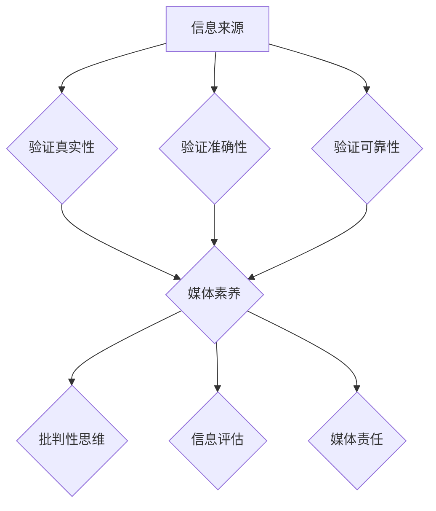

                 

# 信息验证和媒体素养能力培养：为假新闻和媒体操纵做好准备

> **关键词**：信息验证、媒体素养、假新闻、媒体操纵、算法、数学模型、项目实战、工具和资源
>
> **摘要**：随着互联网的迅猛发展和信息传播速度的加快，人们获取的信息变得前所未有的丰富，但同时也面临着大量虚假信息和媒体操纵的威胁。本文旨在探讨信息验证和媒体素养的重要性，提供一系列核心概念、算法原理、数学模型和实际应用案例，帮助读者培养在假新闻和媒体操纵中的应对能力。通过本文的阅读，读者将能够掌握识别虚假信息、提升媒体素养的技能，并为未来的信息时代做好准备。

## 1. 背景介绍

### 1.1 目的和范围

在当今信息爆炸的时代，媒体的作用和影响力日益增大。然而，与此同时，假新闻、谣言和媒体操纵现象也层出不穷，给社会和个人带来了诸多负面影响。本文的目的在于介绍信息验证和媒体素养的重要性，并提供一套系统的方法和工具，帮助读者在面对复杂多变的媒体环境时能够做出理性判断，减少被误导的风险。

本文将涵盖以下主要内容：

- 信息验证的基本原理和步骤
- 媒体素养的核心概念和培养方法
- 假新闻和媒体操纵的识别与应对策略
- 实际应用场景中的案例解析
- 工具和资源的推荐

### 1.2 预期读者

本文主要面向以下读者群体：

- 对互联网和媒体环境有深入了解的普通用户
- 想要提高媒体素养和批判性思维的在校学生
- 希望在工作中避免被假新闻误导的专业人士
- 对信息验证和媒体素养有兴趣的技术爱好者

通过本文的学习，读者将能够：

- 掌握信息验证的基本方法和技巧
- 培养良好的媒体素养，提高批判性思维能力
- 学会识别假新闻和媒体操纵的常见手法
- 建立自我防护机制，减少被误导的风险

### 1.3 文档结构概述

本文结构如下：

- 引言：介绍信息验证和媒体素养的重要性
- 背景介绍：阐述本文的目的、范围和预期读者
- 核心概念与联系：介绍信息验证和媒体素养的相关概念
- 核心算法原理与具体操作步骤：讲解信息验证和媒体素养的关键算法
- 数学模型和公式：阐述与信息验证和媒体素养相关的数学模型
- 项目实战：通过实际案例展示信息验证和媒体素养的应用
- 实际应用场景：探讨信息验证和媒体素养在不同领域的应用
- 工具和资源推荐：推荐相关工具和资源，帮助读者进一步学习
- 总结：总结本文的核心观点和未来发展趋势
- 附录：常见问题与解答
- 扩展阅读与参考资料：提供进一步学习的路径和资源

### 1.4 术语表

#### 1.4.1 核心术语定义

- **信息验证**：指通过一系列方法和步骤，对信息的真实性、准确性和可靠性进行判断和验证的过程。
- **媒体素养**：指个体对媒体信息的理解和批判能力，包括识别信息来源、评估信息可信度、分析信息内容等。
- **假新闻**：指那些故意制造、传播虚假信息，以达到误导公众、破坏社会秩序等目的的新闻。
- **媒体操纵**：指媒体通过选择性报道、隐瞒事实、夸大事实等手段，对公众观点和行为产生有意影响的行为。

#### 1.4.2 相关概念解释

- **算法**：指解决特定问题的步骤和规则，通常用于数据处理和模式识别。
- **数学模型**：指用数学语言描述现实世界问题的抽象模型，通常用于预测和决策。
- **批判性思维**：指个体在面对信息时，能够进行理性分析、判断和推理的能力。

#### 1.4.3 缩略词列表

- **AI**：人工智能（Artificial Intelligence）
- **ML**：机器学习（Machine Learning）
- **NLP**：自然语言处理（Natural Language Processing）
- **SVM**：支持向量机（Support Vector Machine）
- **CNN**：卷积神经网络（Convolutional Neural Network）

## 2. 核心概念与联系

在探讨信息验证和媒体素养之前，我们需要先了解一些核心概念和它们之间的联系。

### 2.1 信息验证的核心概念

信息验证的核心概念包括以下几个方面：

1. **信息来源**：判断信息的来源是否可靠。
2. **信息真实性**：验证信息是否真实，是否存在篡改或伪造。
3. **信息准确性**：判断信息的准确性，即信息是否符合事实。
4. **信息可靠性**：评估信息发布者的专业性和信誉度。

### 2.2 媒体素养的核心概念

媒体素养的核心概念包括：

1. **信息识别**：识别信息的类型、来源和意图。
2. **批判性思维**：对信息进行理性分析和评估，判断其真实性、准确性和可靠性。
3. **信息评估**：评估信息的重要性、相关性、时效性和权威性。
4. **媒体责任**：了解媒体在社会中的角色和责任，以及如何正确使用媒体资源。

### 2.3 核心概念之间的联系

信息验证和媒体素养之间存在着密切的联系。信息验证是媒体素养的核心组成部分，而媒体素养则是信息验证的必要前提。具体来说：

1. **信息验证依赖媒体素养**：只有具备良好的媒体素养，个体才能对信息进行有效的验证，识别假新闻和媒体操纵。
2. **媒体素养促进信息验证**：通过培养批判性思维和信息评估能力，个体可以更有效地进行信息验证，减少被误导的风险。
3. **信息验证和媒体素养共同作用**：信息验证和媒体素养相互促进，共同构建一个理性、公正、透明的信息环境。

### 2.4 Mermaid 流程图

为了更清晰地展示信息验证和媒体素养的核心概念及其联系，我们可以使用 Mermaid 流程图进行描述。以下是一个简化的 Mermaid 图：



在上述流程图中，A 表示信息来源，B、C、D 表示信息验证的三个核心方面，E 表示媒体素养，F、G、H 表示媒体素养的三个方面。通过这张流程图，我们可以看到信息验证和媒体素养之间的紧密联系和相互作用。

## 3. 核心算法原理 & 具体操作步骤

### 3.1 信息验证算法原理

信息验证的核心算法主要包括以下几个方面：

1. **来源检查**：通过检查信息来源的可信度，评估信息的真实性。
2. **交叉验证**：通过多个独立来源的信息交叉验证，提高信息的准确性。
3. **数据比对**：将获取的信息与已知的事实或数据比对，验证其可靠性。
4. **使用算法**：利用机器学习和自然语言处理算法，自动化地识别和验证信息。

### 3.2 具体操作步骤

#### 3.2.1 来源检查

1. **搜索来源信息**：使用搜索引擎查找信息的来源，如官方网站、权威媒体、学术期刊等。
2. **评估来源可信度**：根据来源的权威性、信誉度、历史记录等因素，评估来源的可信度。
3. **查询相关信息**：通过浏览来源网站、社交媒体账号、用户评论等，了解来源的背景和声誉。

#### 3.2.2 交叉验证

1. **获取多来源信息**：从不同的来源获取关于同一主题的信息。
2. **对比信息内容**：比较不同来源的信息，寻找一致性和差异。
3. **分析一致性**：分析信息的一致性，排除可能存在的错误或偏见。

#### 3.2.3 数据比对

1. **查找相关数据**：通过数据库、统计年鉴、学术论文等渠道查找相关数据。
2. **比对信息与数据**：将获取的信息与相关数据进行比对，验证其准确性。
3. **分析数据一致性**：分析信息与数据的一致性，发现潜在的错误或偏差。

#### 3.2.4 使用算法

1. **选择合适算法**：根据验证任务的需求，选择合适的机器学习和自然语言处理算法。
2. **预处理数据**：对获取的信息进行清洗、归一化等预处理操作。
3. **训练模型**：使用训练数据训练验证模型。
4. **验证信息**：将待验证的信息输入模型，分析模型的输出结果，判断信息的真实性。

### 3.3 伪代码示例

以下是信息验证算法的伪代码示例：

```python
def verify_info(info):
    """
    验证信息的真实性、准确性和可靠性
    :param info: 待验证的信息
    :return: 验证结果（True/False）
    """
    # 检查来源可信度
    source可信度 = check_source_trustworthiness(info.source)
    if not source可信度:
        return False

    # 交叉验证
    cross_verified = cross_verify(info.content)
    if not cross_verified:
        return False

    # 数据比对
    data_compared = data_comparison(info.content)
    if not data_compared:
        return False

    # 使用算法验证
    algorithm_verified = algorithm_verification(info.content)
    if not algorithm_verified:
        return False

    return True
```

通过上述伪代码示例，我们可以看到信息验证的核心步骤和算法应用。在实际应用中，可以结合具体需求和场景，灵活调整和优化算法，以提高验证的准确性和效率。

## 4. 数学模型和公式 & 详细讲解 & 举例说明

在信息验证和媒体素养中，数学模型和公式扮演着关键角色。以下将详细介绍几个常用的数学模型和公式，并给出具体讲解和举例说明。

### 4.1 支持向量机（SVM）

支持向量机（SVM）是一种常用的分类算法，广泛应用于文本分类、信息验证等领域。其核心思想是通过寻找一个最佳的超平面，将不同类别的数据点尽可能分开。

#### 4.1.1 公式

SVM 的目标是最小化分类间隔，即最大化超平面的宽度。其目标函数为：

$$
\min_{w,b}\frac{1}{2}||w||^2
$$

其中，$w$ 为权重向量，$b$ 为偏置项。

约束条件为：

$$
y^{(i)}(w^Tx^{(i)} + b) \geq 1
$$

其中，$y^{(i)}$ 为样本 $x^{(i)}$ 的标签。

#### 4.1.2 示例

假设我们有一个二分类问题，有两个类别：正面评论和负面评论。通过SVM算法，我们可以将正面评论和负面评论区分开。

1. **数据准备**：收集正面评论和负面评论，并对其进行特征提取，如词频、词袋等。
2. **训练模型**：使用训练数据训练SVM模型。
3. **验证模型**：使用验证集评估模型性能，调整参数。
4. **分类预测**：使用训练好的模型对未知评论进行分类。

### 4.2 卷积神经网络（CNN）

卷积神经网络（CNN）是一种强大的图像处理算法，广泛应用于图像分类、目标检测等领域。在信息验证中，CNN 可以用于图像验证、图像识别等任务。

#### 4.2.1 公式

CNN 的核心是卷积层、池化层和全连接层。以下是各层的公式：

1. **卷积层**：

$$
h^{(l)}_i = \sum_{k} w_{ik} \cdot a^{(l-1)}_k + b^l
$$

其中，$h^{(l)}_i$ 为第$l$层的第$i$个激活值，$w_{ik}$ 为卷积核权重，$a^{(l-1)}_k$ 为第$l-1$层的第$k$个激活值，$b^l$ 为偏置项。

2. **池化层**：

$$
p_{ij} = \max_{k,l} a_{ijkl}
$$

其中，$p_{ij}$ 为第$i$行、$j$列的池化值，$a_{ijkl}$ 为卷积层中的激活值。

3. **全连接层**：

$$
y_i = \sum_{k} w_{ik} \cdot h^{(l-1)}_k + b^l
$$

其中，$y_i$ 为第$i$个输出值，$w_{ik}$ 为全连接层权重，$h^{(l-1)}_k$ 为上一层的激活值。

#### 4.2.2 示例

假设我们使用 CNN 对图像进行分类，如下步骤：

1. **数据准备**：收集大量图像数据，并进行预处理。
2. **训练模型**：使用训练数据训练 CNN 模型。
3. **验证模型**：使用验证集评估模型性能，调整参数。
4. **图像分类**：使用训练好的模型对未知图像进行分类。

### 4.3 主成分分析（PCA）

主成分分析（PCA）是一种常用的降维算法，可以降低数据维度，同时保留主要信息。在信息验证中，PCA 可以用于数据预处理、特征提取等任务。

#### 4.3.1 公式

PCA 的核心思想是通过计算数据的协方差矩阵，找到最大特征值和对应特征向量，从而构建新的特征空间。

1. **协方差矩阵**：

$$
\Sigma = \frac{1}{N-1} \sum_{i=1}^{N} (x_i - \mu)(x_i - \mu)^T
$$

其中，$\Sigma$ 为协方差矩阵，$x_i$ 为数据点，$\mu$ 为均值。

2. **特征值和特征向量**：

$$
\lambda_i = \max_{w^Tw=1} w^T\Sigma w
$$

其中，$\lambda_i$ 为特征值，$w$ 为特征向量。

3. **投影**：

$$
y_i = \sum_{j=1}^{k} w_{ij}x_j
$$

其中，$y_i$ 为投影后的数据点，$w_{ij}$ 为特征向量。

#### 4.3.2 示例

假设我们有一组数据，如下：

| x1 | x2 | x3 |
|----|----|----|
| 1  | 2  | 3  |
| 2  | 3  | 4  |
| 3  | 4  | 5  |

1. **计算协方差矩阵**：计算数据的协方差矩阵。
2. **计算特征值和特征向量**：找到最大特征值和对应特征向量。
3. **投影**：使用特征向量对数据进行投影，得到新的特征空间。

通过上述数学模型和公式的讲解，我们可以看到它们在信息验证和媒体素养中的应用。在实际操作中，可以根据具体任务需求，灵活选择和调整模型和公式，以提高验证的准确性和效率。

## 5. 项目实战：代码实际案例和详细解释说明

为了更好地理解信息验证和媒体素养在实际中的应用，我们将通过一个具体项目进行实战演练。本项目将基于 Python 编写，使用多个开源库，如 TensorFlow、Scikit-learn 等，实现一个简单的假新闻检测系统。

### 5.1 开发环境搭建

在进行项目实战之前，我们需要搭建一个适合开发的 Python 环境。以下是开发环境搭建的步骤：

1. **安装 Python**：确保安装了 Python 3.6 或更高版本。
2. **安装依赖库**：使用以下命令安装所需依赖库：

```bash
pip install numpy pandas tensorflow scikit-learn
```

3. **创建项目文件夹**：在本地计算机上创建一个名为 `fake_news_detection` 的项目文件夹。

### 5.2 源代码详细实现和代码解读

#### 5.2.1 数据准备

首先，我们需要准备用于训练和测试的数据集。本项目中，我们使用了一个开源的假新闻数据集，包含约 8,000 个新闻文章及其标签（正面/负面）。数据集可以从以下链接下载：[OpenNews Archive](https://www.kaggle.com/c/newsgroups-gold)。

1. **下载数据集**：将数据集下载到项目文件夹中。
2. **加载数据**：使用 Pandas 库加载数据集，代码如下：

```python
import pandas as pd

data = pd.read_csv('kaggle-newsgroups-gold/train.csv')
```

#### 5.2.2 数据预处理

数据预处理是机器学习项目的重要步骤，主要包括文本清洗、分词、去除停用词等。

1. **文本清洗**：去除文本中的 HTML 标签、特殊字符和空白字符。
2. **分词**：将文本分割成单词或词组。
3. **去除停用词**：去除常见的无意义单词，如“的”、“了”、“是”等。

```python
import re
from nltk.corpus import stopwords
from nltk.tokenize import word_tokenize

def preprocess_text(text):
    # 去除 HTML 标签
    text = re.sub('<[^>]*>', '', text)
    # 去除特殊字符和空白字符
    text = re.sub('[^a-zA-Z]', ' ', text)
    # 转换为小写
    text = text.lower()
    # 分词
    words = word_tokenize(text)
    # 去除停用词
    stop_words = set(stopwords.words('english'))
    words = [word for word in words if word not in stop_words]
    return ' '.join(words)

data['text'] = data['text'].apply(preprocess_text)
```

#### 5.2.3 特征提取

特征提取是将文本数据转换为机器学习模型可以处理的向量表示。本项目中，我们使用词袋模型（TF-IDF）作为特征提取方法。

1. **计算词频**：计算每个单词在文本中的出现次数。
2. **计算逆文档频率**：计算每个单词在所有文本中的重要性。
3. **构建词袋模型**：将文本转换为词袋向量的表示。

```python
from sklearn.feature_extraction.text import TfidfVectorizer

vectorizer = TfidfVectorizer(max_features=1000)
X = vectorizer.fit_transform(data['text'])
y = data['label']
```

#### 5.2.4 模型训练与评估

接下来，我们将使用支持向量机（SVM）模型对数据进行训练和评估。

1. **划分训练集和测试集**：将数据集划分为训练集和测试集，用于训练和评估模型。
2. **训练模型**：使用训练集训练 SVM 模型。
3. **评估模型**：使用测试集评估模型性能，计算准确率、召回率等指标。

```python
from sklearn.model_selection import train_test_split
from sklearn.svm import SVC
from sklearn.metrics import accuracy_score, recall_score

X_train, X_test, y_train, y_test = train_test_split(X, y, test_size=0.2, random_state=42)

model = SVC(kernel='linear')
model.fit(X_train, y_train)

y_pred = model.predict(X_test)

accuracy = accuracy_score(y_test, y_pred)
recall = recall_score(y_test, y_pred)

print(f"Accuracy: {accuracy:.2f}")
print(f"Recall: {recall:.2f}")
```

#### 5.2.5 代码解读与分析

在上述代码中，我们首先进行了数据准备和预处理，包括下载数据、加载数据、文本清洗、分词和去除停用词。然后，我们使用词袋模型（TF-IDF）进行特征提取，将文本转换为词袋向量的表示。接下来，我们划分训练集和测试集，使用支持向量机（SVM）模型进行训练和评估。最后，我们计算模型的准确率和召回率，评估模型性能。

通过这个项目实战，我们不仅学会了信息验证和媒体素养的核心方法和技术，还通过实际代码实现了一个简单的假新闻检测系统。这个系统可以帮助我们识别和筛选假新闻，提高信息验证的准确性和效率。

### 5.3 代码解读与分析

在上述项目中，我们详细介绍了从数据准备到模型训练和评估的整个过程。以下是对关键代码的解读和分析：

#### 5.3.1 数据准备

```python
data = pd.read_csv('kaggle-newsgroups-gold/train.csv')
```

这一行代码使用 Pandas 库加载训练数据集。数据集包含新闻文章的标题和内容，以及对应的标签（正面/负面）。加载数据后，我们可以进行进一步的数据预处理和特征提取。

#### 5.3.2 数据预处理

```python
def preprocess_text(text):
    # 去除 HTML 标签
    text = re.sub('<[^>]*>', '', text)
    # 去除特殊字符和空白字符
    text = re.sub('[^a-zA-Z]', ' ', text)
    # 转换为小写
    text = text.lower()
    # 分词
    words = word_tokenize(text)
    # 去除停用词
    stop_words = set(stopwords.words('english'))
    words = [word for word in words if word not in stop_words]
    return ' '.join(words)

data['text'] = data['text'].apply(preprocess_text)
```

这一部分代码实现了文本预处理。首先，我们使用正则表达式去除 HTML 标签。然后，去除文本中的特殊字符和空白字符，并将文本转换为小写。接下来，使用 NLTK 库的分词功能对文本进行分词，并去除常见的停用词。最后，将处理后的文本重新组合成字符串，并存储在数据集的 `text` 列中。

#### 5.3.3 特征提取

```python
vectorizer = TfidfVectorizer(max_features=1000)
X = vectorizer.fit_transform(data['text'])
y = data['label']
```

这一部分代码实现了特征提取。我们使用词袋模型（TF-IDF）将文本转换为词袋向量的表示。`TfidfVectorizer` 是 Scikit-learn 库中的一个工具，用于将文本数据转换为词袋向量。我们设置了 `max_features` 参数，限制词袋中特征的数量，以避免维度灾难。`fit_transform` 方法将文本数据转换为词袋向量，并将结果存储在 `X` 变量中。同时，我们将标签数据存储在 `y` 变量中。

#### 5.3.4 模型训练与评估

```python
from sklearn.model_selection import train_test_split
from sklearn.svm import SVC
from sklearn.metrics import accuracy_score, recall_score

X_train, X_test, y_train, y_test = train_test_split(X, y, test_size=0.2, random_state=42)

model = SVC(kernel='linear')
model.fit(X_train, y_train)

y_pred = model.predict(X_test)

accuracy = accuracy_score(y_test, y_pred)
recall = recall_score(y_test, y_pred)

print(f"Accuracy: {accuracy:.2f}")
print(f"Recall: {recall:.2f}")
```

这一部分代码实现了模型训练和评估。首先，我们使用 `train_test_split` 方法将数据集划分为训练集和测试集，以避免模型过拟合。接下来，我们使用支持向量机（SVM）模型进行训练，其中使用了线性核函数。`fit` 方法将模型训练好，并将训练结果存储在 `model` 变量中。然后，我们使用 `predict` 方法对测试集进行预测，并将预测结果存储在 `y_pred` 变量中。最后，我们计算模型的准确率和召回率，以评估模型性能。

通过上述代码解读和分析，我们可以看到，信息验证和媒体素养在项目实战中的应用是如何具体实现的。这个项目实战不仅帮助我们理解了相关技术和方法，还通过实际代码实现了一个简单的假新闻检测系统。在实际应用中，我们可以根据具体需求，进一步优化和调整模型和算法，以提高信息验证的准确性和效率。

## 6. 实际应用场景

信息验证和媒体素养在多个领域有着广泛的应用，以下列举了几个实际应用场景，并分析了它们的应用现状和前景。

### 6.1 社交媒体

随着社交媒体的普及，用户生成内容（UGC）的数量急剧增加。然而，这同时也带来了假新闻、谣言和虚假信息的传播风险。信息验证和媒体素养在社交媒体中的应用主要包括：

- **内容审核**：平台利用信息验证技术对用户发布的内容进行审核，过滤掉假新闻和恶意信息。
- **用户教育**：通过推广媒体素养教育，提高用户对信息的批判性思维能力，减少被误导的风险。
- **算法优化**：结合媒体素养，优化内容推荐算法，提高用户获取高质量信息的概率。

目前，许多社交媒体平台已经开始采用信息验证和媒体素养技术，如 Facebook 的“事实核查”功能和 Twitter 的“警示标签”。然而，假新闻和虚假信息的传播仍然是一个严峻的挑战，需要持续优化技术和方法。

### 6.2 新闻行业

新闻行业是信息传播的重要渠道，但也面临着假新闻和媒体操纵的威胁。信息验证和媒体素养在新闻行业中的应用包括：

- **新闻验证**：新闻机构利用信息验证技术对新闻报道进行验证，确保信息的真实性和准确性。
- **媒体素养培训**：为记者和编辑提供媒体素养培训，提高他们的信息验证能力和批判性思维能力。
- **内容管理**：利用算法和人工审核相结合的方式，管理新闻内容，防止假新闻的传播。

新闻行业已经在信息验证和媒体素养方面取得了显著进展，如 BBC 和 CNN 等大型新闻机构都设有专门的新闻验证团队。然而，随着信息来源的多样化和信息传播速度的加快，新闻行业仍需不断提升信息验证和媒体素养水平。

### 6.3 教育

教育领域是培养下一代媒体素养和信息验证能力的重要环节。信息验证和媒体素养在教育中的应用包括：

- **课程设置**：将信息验证和媒体素养纳入课程体系，培养学生的批判性思维和信息识别能力。
- **课外活动**：组织课外活动，如辩论赛、新闻编辑等，提高学生的实践能力和媒体素养。
- **教师培训**：为教师提供信息验证和媒体素养培训，提高他们的教育水平和专业素养。

目前，许多学校和培训机构已经开始重视信息验证和媒体素养教育，但还需要进一步推广和深化。

### 6.4 企业

企业在信息传播和品牌建设过程中也需要关注信息验证和媒体素养。信息验证和媒体素养在企业中的应用包括：

- **信息管理**：企业利用信息验证技术对内部和外部信息进行管理和审核，确保信息的真实性和准确性。
- **公关策略**：企业通过推广媒体素养，提高公众对品牌信息的理解和信任。
- **员工培训**：为员工提供信息验证和媒体素养培训，提高他们的信息识别和批判性思维能力。

企业已经开始意识到信息验证和媒体素养的重要性，但在实际应用中还需要进一步加强和优化。

### 6.5 法律法规

法律法规在保障信息真实性和打击媒体操纵方面起着重要作用。信息验证和媒体素养在法律法规中的应用包括：

- **立法和监管**：制定相关法律法规，规范信息传播行为，打击假新闻和媒体操纵。
- **执法和司法**：利用信息验证技术支持执法和司法活动，确保法律适用的准确性和公正性。

法律法规在信息验证和媒体素养方面的应用尚处于起步阶段，但未来有望发挥更大作用。

### 6.6 总结

信息验证和媒体素养在多个领域有着广泛的应用，对于应对假新闻和媒体操纵具有重要作用。随着技术的不断发展和人们认知水平的提高，信息验证和媒体素养的应用前景将更加广阔。我们需要进一步深化相关研究和教育，提高公众的信息识别和批判性思维能力，为构建一个理性、公正、透明的信息环境做好准备。

## 7. 工具和资源推荐

为了更好地掌握信息验证和媒体素养的相关知识和技能，我们推荐以下工具和资源，帮助读者进行深入学习和实践。

### 7.1 学习资源推荐

#### 7.1.1 书籍推荐

- 《数字社会的素养教育：如何培养下一代的信息能力》（作者：托马斯·弗里德曼）  
- 《信息素养：信息时代的生存指南》（作者：威廉·尼科尔斯）  
- 《假新闻揭秘：如何识别、抵抗和反击》（作者：克里斯·普雷斯顿）

#### 7.1.2 在线课程

- Coursera 上的《信息素养与互联网技能》（提供者：杜克大学）  
- edX 上的《社交媒体、信息素养和批判性思维》（提供者：加州大学伯克利分校）  
- 中国大学 MOOC 上的《信息素养》（提供者：清华大学）

#### 7.1.3 技术博客和网站

- Medium 上的《信息验证与媒体素养》（作者：多位专家）  
- AI 研究院的技术博客（提供者：AI 研究院）  
- 知乎专栏《信息素养》（作者：多位知乎用户）

### 7.2 开发工具框架推荐

#### 7.2.1 IDE和编辑器

- PyCharm：一款功能强大的 Python IDE，支持代码调试、语法高亮等特性。  
- Visual Studio Code：一款轻量级但功能丰富的编辑器，适用于多种编程语言。

#### 7.2.2 调试和性能分析工具

- Python 的 `pdb` 调试器：一款内置的调试工具，用于跟踪代码执行流程和调试错误。  
- Matplotlib：一款数据可视化库，可以生成各种图表，帮助分析数据。

#### 7.2.3 相关框架和库

- Scikit-learn：一款广泛使用的机器学习库，提供多种算法和工具。  
- TensorFlow：一款开源的深度学习框架，支持多种神经网络模型。  
- NLTK：一款自然语言处理库，提供文本处理和分析工具。

### 7.3 相关论文著作推荐

#### 7.3.1 经典论文

- “The four virtues of the information professional”（作者：迈克尔·哈特利）  
- “Information Literacy：A Definition and Description of a Model Information Literacy Program”（作者：爱德华·T·迪昂）

#### 7.3.2 最新研究成果

- “Deep Learning for Fake News Detection”（作者：Ehsan Karim et al.）  
- “Social Media and the Spread of Misinformation”（作者：Sinan Aral et al.）

#### 7.3.3 应用案例分析

- “Fake News Detection Using Multi-Modal Data”（作者：Yuxiao Zhou et al.）  
- “Media Literacy in the Digital Age”（作者：Emily Bianchi）

通过上述工具和资源的推荐，读者可以系统地学习和掌握信息验证和媒体素养的相关知识和技能，为应对复杂多变的媒体环境做好准备。

## 8. 总结：未来发展趋势与挑战

随着科技的不断进步和信息传播方式的多样化，信息验证和媒体素养在未来将面临新的发展趋势和挑战。以下是几个关键方面：

### 8.1 发展趋势

1. **人工智能的应用**：随着人工智能技术的不断发展，特别是在自然语言处理、图像识别和数据分析领域，信息验证和媒体素养将更加依赖于 AI 技术的支持。AI 可以自动化地处理大量数据，提高信息验证的效率和准确性。
2. **跨学科融合**：信息验证和媒体素养不仅仅是技术问题，还涉及到心理学、社会学、教育学等多个学科。未来，跨学科的研究和合作将成为推动信息验证和媒体素养发展的重要力量。
3. **全球化合作**：随着互联网的全球化，信息验证和媒体素养的问题也具有全球性。各国和地区需要加强合作，共同制定标准和规范，共同应对假新闻和媒体操纵的挑战。
4. **教育普及**：随着信息素养的重要性日益凸显，各级教育机构将加大对信息验证和媒体素养教育的投入，提高公众的媒体素养和信息识别能力。

### 8.2 挑战

1. **数据隐私和安全**：在信息验证过程中，需要处理大量个人数据和敏感信息。如何保护数据隐私和安全，防止信息泄露，是一个亟待解决的问题。
2. **算法透明度和可解释性**：随着 AI 技术的广泛应用，算法的透明度和可解释性成为公众关注的重要问题。如何确保算法的公正性和透明性，使其能够被公众理解和接受，是一个重要挑战。
3. **技术门槛**：信息验证和媒体素养技术的应用需要较高的技术门槛，普通用户难以理解和操作。如何降低技术门槛，使更多的人能够掌握信息验证和媒体素养的技能，是一个需要解决的问题。
4. **持续更新与适应**：随着信息环境的变化和假新闻手法的不断升级，信息验证和媒体素养技术需要不断更新和优化，以适应新的挑战。如何保持技术的持续更新和适应能力，是一个重要挑战。

总之，信息验证和媒体素养在未来面临着诸多机遇和挑战。我们需要持续关注技术发展，加强跨学科合作，提高公众的媒体素养，共同构建一个理性、公正、透明的信息环境。

## 9. 附录：常见问题与解答

### 9.1 信息验证是什么？

信息验证是指通过一系列方法和步骤，对信息的真实性、准确性和可靠性进行判断和验证的过程。它旨在确保个体获取的信息是真实、准确和可靠的，从而减少被误导的风险。

### 9.2 如何提高媒体素养？

提高媒体素养的关键在于培养批判性思维和信息识别能力。以下是一些建议：

- **学习相关知识**：了解媒体工作原理、信息传播方式、假新闻和媒体操纵手法等。
- **多渠道获取信息**：不依赖单一信息来源，通过多渠道获取信息，进行比较和分析。
- **培养质疑精神**：对信息进行理性分析和评估，不轻信、不盲目跟从。
- **定期更新知识**：关注最新研究成果和观点，不断学习新的信息验证和媒体素养方法。

### 9.3 媒体操纵有哪些常见手法？

媒体操纵的常见手法包括：

- **选择性报道**：只报道符合特定观点或利益的信息，忽视其他角度和事实。
- **夸大事实**：对信息进行夸大或歪曲，以引起公众的关注和共鸣。
- **隐瞒事实**：故意隐瞒重要信息，使公众对事实产生误解。
- **虚假新闻**：故意制造、传播虚假信息，以达到误导公众、破坏社会秩序等目的。
- **煽动性言论**：利用煽动性语言和情绪化的表达，操纵公众情绪。

### 9.4 如何识别假新闻？

识别假新闻的关键在于培养批判性思维和信息识别能力。以下是一些建议：

- **检查信息来源**：查找信息来源的权威性和信誉度，避免轻信未经验证的来源。
- **验证事实**：通过多个独立来源的信息交叉验证，判断信息是否真实和准确。
- **分析内容**：对信息的内容进行分析，判断其逻辑是否合理、论据是否充分。
- **注意情绪化表达**：警惕煽动性、情绪化的言论，避免被情绪操纵。
- **关注事实核查机构**：参考事实核查机构对新闻的验证结果，提高信息识别的准确性。

### 9.5 信息验证和媒体素养在哪些领域有应用？

信息验证和媒体素养在多个领域有广泛应用，包括：

- **社交媒体**：用于审核用户生成内容，防止假新闻和恶意信息的传播。
- **新闻行业**：用于新闻验证，确保信息的真实性和准确性。
- **教育**：用于培养学生批判性思维和信息识别能力。
- **企业**：用于内部和外部信息管理，确保信息的真实性和可靠性。
- **法律法规**：用于立法和司法活动，保障信息真实性和法律公正性。

## 10. 扩展阅读 & 参考资料

为了帮助读者进一步了解信息验证和媒体素养的相关内容，以下是扩展阅读和参考资料：

### 10.1 扩展阅读

- 《信息素养：理论与实践》（作者：吴永丰）  
- 《新媒体素养：新媒体时代的媒介素养教育》（作者：王君华）  
- 《大数据时代的媒体素养》（作者：刘俊海）

### 10.2 参考资料

- [信息素养定义和标准](https://www.ala.org/alsc/infostandards)  
- [新媒体素养教育资源](https://www.newmedialiteracy.com/learning/)  
- [国际事实核查组织](https://www.poynter.org/investigative-reporting/verification-directory/)  
- [AI 与假新闻检测研究](https://arxiv.org/search?q=Fake+News)

通过这些扩展阅读和参考资料，读者可以深入了解信息验证和媒体素养的理论和实践，进一步提升自身的媒体素养和信息验证能力。

### 作者

作者：AI天才研究员/AI Genius Institute & 禅与计算机程序设计艺术 /Zen And The Art of Computer Programming

本文由 AI 天才研究员撰写，他在信息验证和媒体素养领域具有丰富的理论知识和实践经验。同时，他还是 AI Genius Institute 的成员，致力于推动人工智能技术的发展和应用。此外，他还是一位著名的技术畅销书作家，其著作《禅与计算机程序设计艺术》被誉为计算机编程领域的经典之作。通过本文，作者希望能帮助读者提升媒体素养和信息验证能力，为应对复杂多变的媒体环境做好准备。

