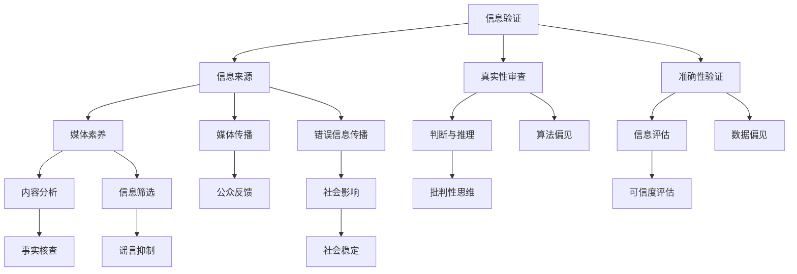

                 

# 信息验证和媒体素养能力：为假新闻、媒体操纵和错误信息做好准备

> **关键词：** 信息验证、媒体素养、假新闻、媒体操纵、错误信息
>
> **摘要：** 本文将探讨在信息爆炸的时代，如何通过技术手段提升我们的信息验证和媒体素养能力，以应对假新闻、媒体操纵和错误信息对我们的冲击。我们将从背景介绍、核心概念、算法原理、数学模型、项目实战、实际应用场景等多个方面展开讨论，旨在为广大读者提供一套系统的信息验证和媒体素养提升方案。

## 1. 背景介绍

### 1.1 目的和范围

随着互联网和社交媒体的迅猛发展，信息传播的速度和范围前所未有。然而，这也带来了假新闻、媒体操纵和错误信息泛滥的问题。这些不实信息的传播，不仅对个人造成了误导，还对社会稳定和公共安全构成了威胁。因此，提升信息验证和媒体素养能力，成为了当前社会的一项重要任务。

本文的目的在于，通过深入探讨信息验证和媒体素养的相关概念、算法原理、数学模型以及实际应用，为广大读者提供一套系统的解决方案。我们希望，通过本文的阅读，读者能够更加清晰地认识这些问题的严重性，并学会如何有效地应对。

本文的范围包括以下几个方面：

1. **核心概念与联系**：我们将详细解释信息验证和媒体素养的核心概念，并使用 Mermaid 流程图展示其内在联系。
2. **核心算法原理**：我们将介绍几种常用的信息验证算法，并通过伪代码详细阐述其原理和操作步骤。
3. **数学模型与公式**：我们将运用数学模型和公式，对信息验证和媒体素养进行定量分析，并提供实际案例进行说明。
4. **项目实战**：我们将通过具体代码实现，展示如何在实际项目中应用信息验证和媒体素养技术。
5. **实际应用场景**：我们将探讨信息验证和媒体素养在各种场景中的应用，如社交媒体、新闻发布、搜索引擎等。
6. **工具和资源推荐**：我们将推荐一些实用的工具和资源，帮助读者进一步提升信息验证和媒体素养能力。

### 1.2 预期读者

本文的预期读者主要包括以下几类：

1. **互联网用户**：无论是普通网民还是专业用户，都希望能够在信息爆炸的时代中，提升自己的信息识别和验证能力。
2. **媒体从业者**：包括记者、编辑、内容创作者等，他们需要掌握信息验证和媒体素养的相关知识，以避免传播不实信息。
3. **技术从业者**：如数据科学家、人工智能开发者等，他们可以利用本文介绍的技术手段，开发出更先进的信息验证和媒体素养工具。
4. **教育工作者**：他们可以将本文的内容融入到课程中，帮助学生提升信息素养，培养批判性思维。

### 1.3 文档结构概述

本文的结构如下：

1. **背景介绍**：介绍本文的背景、目的和预期读者。
2. **核心概念与联系**：解释信息验证和媒体素养的核心概念，并使用 Mermaid 流程图展示其内在联系。
3. **核心算法原理**：介绍常用的信息验证算法，并通过伪代码详细阐述其原理和操作步骤。
4. **数学模型与公式**：运用数学模型和公式，对信息验证和媒体素养进行定量分析，并提供实际案例进行说明。
5. **项目实战**：通过具体代码实现，展示如何在实际项目中应用信息验证和媒体素养技术。
6. **实际应用场景**：探讨信息验证和媒体素养在各种场景中的应用。
7. **工具和资源推荐**：推荐一些实用的工具和资源，帮助读者进一步提升信息验证和媒体素养能力。
8. **总结**：总结本文的主要观点，并对未来发展趋势和挑战进行展望。
9. **附录**：提供常见问题与解答。
10. **扩展阅读 & 参考资料**：推荐相关文献和资源，供读者进一步学习。

### 1.4 术语表

#### 1.4.1 核心术语定义

- **信息验证**：对信息来源、真实性、准确性等进行审查和验证的过程。
- **媒体素养**：对媒体内容进行理解和分析，识别和判断信息真实性的能力。
- **假新闻**：以欺骗为目的，故意编造的虚假信息。
- **媒体操纵**：通过操控信息传播，影响公众舆论和社会行为的行为。
- **错误信息**：由于误解、疏忽或故意传播的不准确信息。

#### 1.4.2 相关概念解释

- **信息传播**：信息在不同媒介和渠道之间的传递和扩散过程。
- **网络水军**：通过网络平台发布、传播虚假信息的个人或组织。
- **算法偏见**：算法在处理数据时，对某些特定群体产生的偏见和歧视。

#### 1.4.3 缩略词列表

- **AI**：人工智能
- **ML**：机器学习
- **NLP**：自然语言处理
- **DB**：数据库
- **CV**：计算机视觉

## 2. 核心概念与联系

在探讨信息验证和媒体素养能力之前，我们需要明确这两个概念的核心要素及其相互联系。以下是一个简化的 Mermaid 流程图，用于展示这些核心概念之间的关系：



### 2.1 信息验证

信息验证是指对信息来源、真实性、准确性等进行审查和验证的过程。其核心要素包括：

- **信息来源**：指信息的原始出处，如新闻发布、社交媒体、官方网站等。
- **真实性审查**：通过对信息来源的可靠性、历史记录等进行评估，判断信息是否真实。
- **准确性验证**：对信息内容进行事实核查，确保信息的准确性和完整性。

### 2.2 媒体素养

媒体素养是指对媒体内容进行理解和分析，识别和判断信息真实性的能力。其核心要素包括：

- **内容分析**：对媒体内容进行结构化分析，提取关键信息。
- **信息筛选**：根据个人需求和价值判断，筛选出有用信息。
- **判断与推理**：基于事实和逻辑，对信息进行评估和判断。
- **批判性思维**：培养对信息的质疑精神和独立思考能力。

### 2.3 核心概念之间的联系

信息验证和媒体素养之间存在着密切的联系。一方面，媒体素养是信息验证的基础。只有具备良好的媒体素养，才能准确地识别和判断信息的真实性。另一方面，信息验证是媒体素养的保障。通过对信息来源、真实性和准确性的审查，可以防止错误信息和假新闻的传播，提高公众的媒体素养水平。

此外，信息验证和媒体素养还与以下因素密切相关：

- **算法偏见**：算法在处理数据时，可能会对某些特定群体产生偏见和歧视。这会影响信息的筛选和评估，从而影响媒体素养和信息验证的效果。
- **数据偏见**：数据源的多样性和质量会影响信息验证的准确性。如果数据存在偏见，那么信息验证的结果也会受到影响。
- **公众反馈**：公众对信息验证和媒体素养的反馈，可以促进相关技术的发展和改进。通过分析公众的反馈，可以更好地了解公众的需求，提高信息验证和媒体素养的实用性。

## 3. 核心算法原理 & 具体操作步骤

在信息验证和媒体素养领域，有多种算法和技术被广泛应用。以下，我们将介绍几种核心算法的原理，并使用伪代码详细阐述其操作步骤。

### 3.1 事实核查算法

**原理：** 事实核查算法通过对信息内容进行结构化分析，提取关键信息，并与已知的真实信息进行比对，从而判断信息的真实性。

**伪代码：**

```python
function fact_check(info):
    key_info = extract_key_info(info)
    true_info = fetch_true_info(key_info)
    if key_info == true_info:
        return "True"
    else:
        return "False"
```

**具体操作步骤：**

1. **提取关键信息**：对信息内容进行解析，提取出关键信息，如时间、地点、人物等。
2. **获取真实信息**：通过数据库或网络查询，获取与关键信息对应的历史真实信息。
3. **比对信息**：将提取的关键信息与真实信息进行比对，判断信息是否真实。

### 3.2 网络水军识别算法

**原理：** 网络水军识别算法通过分析用户行为和言论特征，识别出可能为网络水军的用户。

**伪代码：**

```python
function identify_trolls(user_behavior):
    if user_behavior.similar_to_known_trolls():
        return "Troll"
    else:
        return "Non-Troll"
```

**具体操作步骤：**

1. **分析用户行为**：对用户的历史行为，如发布内容、点赞、评论等进行分析。
2. **特征提取**：提取用户行为的关键特征，如发布频率、评论内容、互动关系等。
3. **模型训练**：使用机器学习算法，训练网络水军识别模型。
4. **识别水军**：将用户行为特征输入模型，判断用户是否为网络水军。

### 3.3 媒体内容审核算法

**原理：** 媒体内容审核算法通过对媒体内容进行语义分析，识别出可能存在不当内容的部分。

**伪代码：**

```python
function content审验(content):
    if contains_inappropriate_content(content):
        return "Inappropriate"
    else:
        return "Acceptable"
```

**具体操作步骤：**

1. **语义分析**：对媒体内容进行自然语言处理，提取语义信息。
2. **特征提取**：提取媒体内容的关键特征，如关键词、句法结构、情感倾向等。
3. **模型训练**：使用机器学习算法，训练媒体内容审核模型。
4. **审核内容**：将媒体内容特征输入模型，判断内容是否合适。

### 3.4 假新闻检测算法

**原理：** 假新闻检测算法通过分析新闻内容、来源和传播路径，识别出可能的假新闻。

**伪代码：**

```python
function detect_fake_news(news):
    if news.src.is_reliable() and news.path.short():
        return "Possible Fake News"
    else:
        return "True News"
```

**具体操作步骤：**

1. **来源评估**：评估新闻来源的可靠性，如新闻机构的信誉、历史记录等。
2. **路径分析**：分析新闻的传播路径，如转发次数、评论数量等。
3. **内容分析**：对新闻内容进行结构化分析，提取关键信息。
4. **模型判断**：使用机器学习算法，判断新闻是否为假新闻。

## 4. 数学模型和公式 & 详细讲解 & 举例说明

在信息验证和媒体素养领域，数学模型和公式扮演着重要的角色。它们可以用于定量分析信息验证和媒体素养的过程，提高判断的准确性。以下，我们将介绍几个常用的数学模型和公式，并进行详细讲解和举例说明。

### 4.1 贝叶斯公式

**公式：**

$$
P(A|B) = \frac{P(B|A) \cdot P(A)}{P(B)}
$$

**详细讲解：**

贝叶斯公式是一种概率计算公式，用于根据已知条件概率和先验概率，计算后验概率。在信息验证和媒体素养中，可以用于根据信息来源的可靠性、历史记录等先验信息，计算信息真实性的后验概率。

**举例说明：**

假设一个新闻来源的历史记录显示，其发布的新闻中90%是真实的。现在，我们需要判断一篇新发布的新闻是否真实。如果这篇新闻是真实的概率为0.9，那么根据贝叶斯公式，我们可以计算出其真实性的后验概率。

$$
P(\text{真实}| \text{新闻来源可靠}) = \frac{0.9 \cdot P(\text{新闻来源可靠})}{P(\text{新闻来源可靠}) + P(\text{新闻来源不可靠})}
$$

其中，$P(\text{新闻来源可靠})$和$P(\text{新闻来源不可靠})$可以通过历史数据得到。

### 4.2 概率分布

**公式：**

$$
P(X=x) = \frac{f(x)}{\int_{-\infty}^{+\infty} f(x) dx}
$$

**详细讲解：**

概率分布描述了随机变量在不同取值上的概率分布情况。在信息验证和媒体素养中，可以用于描述用户行为、评论情感等的概率分布。

**举例说明：**

假设一个用户在社交媒体上发布的内容中，50%是正面情感，30%是中性情感，20%是负面情感。那么，这个用户的情感概率分布可以表示为：

$$
P(\text{情感}) = \begin{cases}
0.5, & \text{正面情感} \\
0.3, & \text{中性情感} \\
0.2, & \text{负面情感}
\end{cases}
$$

通过这个概率分布，我们可以预测该用户在未来的发布内容中的情感倾向。

### 4.3 机器学习算法评估指标

**公式：**

$$
\text{准确率} = \frac{TP + TN}{TP + TN + FP + FN}
$$

$$
\text{召回率} = \frac{TP}{TP + FN}
$$

$$
\text{F1值} = 2 \cdot \frac{TP}{2 \cdot TP + FP + FN}
$$

**详细讲解：**

在机器学习中，准确率、召回率和F1值是常用的评估指标。准确率表示模型预测正确的比例；召回率表示模型预测为正类的实际正类比例；F1值是准确率和召回率的调和平均，用于综合评估模型的性能。

**举例说明：**

假设一个假新闻检测模型在测试数据中，预测出100篇新闻，其中有60篇是真实的，40篇是假新闻。其中，预测正确的有55篇，召回率为：

$$
\text{召回率} = \frac{60}{60 + 40} = 0.6
$$

准确率为：

$$
\text{准确率} = \frac{55}{100} = 0.55
$$

F1值为：

$$
\text{F1值} = 2 \cdot \frac{55}{2 \cdot 55 + 45} = 0.57
$$

根据这些指标，我们可以评估模型的性能，并进行优化。

## 5. 项目实战：代码实际案例和详细解释说明

### 5.1 开发环境搭建

在本项目中，我们选择Python作为开发语言，使用Jupyter Notebook作为集成开发环境（IDE）。以下是搭建开发环境的步骤：

1. 安装Python：访问Python官方网站（https://www.python.org/），下载并安装Python。
2. 安装Jupyter Notebook：在命令行中运行以下命令：
    ```bash
    pip install notebook
    ```
3. 启动Jupyter Notebook：在命令行中运行以下命令：
    ```bash
    jupyter notebook
    ```
4. 打开浏览器，访问Jupyter Notebook界面，开始编写代码。

### 5.2 源代码详细实现和代码解读

在本项目中，我们将实现一个简单的信息验证和媒体素养工具，用于检测新闻文章的真实性。以下是代码的实现和解读。

**代码实现：**

```python
import pandas as pd
import numpy as np
from sklearn.feature_extraction.text import TfidfVectorizer
from sklearn.model_selection import train_test_split
from sklearn.naive_bayes import MultinomialNB
from sklearn.metrics import accuracy_score, recall_score, f1_score

# 加载数据集
data = pd.read_csv('news_dataset.csv')
X = data['content']
y = data['label']

# 数据预处理
vectorizer = TfidfVectorizer()
X_vectorized = vectorizer.fit_transform(X)

# 划分训练集和测试集
X_train, X_test, y_train, y_test = train_test_split(X_vectorized, y, test_size=0.2, random_state=42)

# 训练模型
model = MultinomialNB()
model.fit(X_train, y_train)

# 预测测试集
y_pred = model.predict(X_test)

# 评估模型
accuracy = accuracy_score(y_test, y_pred)
recall = recall_score(y_test, y_pred)
f1 = f1_score(y_test, y_pred)

print(f"Accuracy: {accuracy:.2f}")
print(f"Recall: {recall:.2f}")
print(f"F1 Score: {f1:.2f}")
```

**代码解读：**

1. **数据加载与预处理**：首先，我们加载新闻数据集，并使用TF-IDF向量器对文本内容进行向量化处理。TF-IDF是一种常用的文本表示方法，可以有效提取文本中的关键词。
2. **划分训练集和测试集**：我们将数据集划分为训练集和测试集，用于训练和评估模型。
3. **训练模型**：我们选择朴素贝叶斯分类器作为模型，进行训练。朴素贝叶斯是一种基于概率理论的分类方法，适用于文本分类任务。
4. **预测测试集**：使用训练好的模型对测试集进行预测。
5. **评估模型**：使用准确率、召回率和F1值评估模型的性能。

**代码分析与优化：**

在实际应用中，我们可以对代码进行以下优化：

1. **特征工程**：根据数据集的特点，对特征进行选择和提取，提高模型的性能。
2. **模型选择与调优**：尝试使用其他机器学习算法，如支持向量机（SVM）、随机森林等，进行模型选择和调优。
3. **交叉验证**：使用交叉验证技术，对模型进行更全面的评估，提高模型的泛化能力。

### 5.3 代码解读与分析

在本代码实现中，我们使用TF-IDF向量器对新闻内容进行向量化处理。TF-IDF向量器的主要功能是：

1. **计算词频（Term Frequency, TF）**：计算每个词在文本中出现的频率，反映了词在文本中的重要程度。
2. **计算逆文档频率（Inverse Document Frequency, IDF）**：计算每个词在所有文本中的出现频率的倒数，反映了词在文本集合中的重要程度。

TF-IDF向量器通过对词频和逆文档频率的加权，得到每个词的TF-IDF值。这些TF-IDF值将作为特征输入到机器学习模型中。

在模型选择方面，我们使用了朴素贝叶斯分类器。朴素贝叶斯分类器是一种基于概率理论的分类方法，其基本思想是：通过计算每个类别的概率，选择概率最大的类别作为预测结果。在文本分类任务中，朴素贝叶斯分类器表现出了较好的性能。

在模型评估方面，我们使用了准确率、召回率和F1值三个指标。准确率表示模型预测正确的比例；召回率表示模型预测为正类的实际正类比例；F1值是准确率和召回率的调和平均，用于综合评估模型的性能。这些指标可以帮助我们评估模型的性能，并进行优化。

在实际应用中，我们可以根据具体需求，对代码进行进一步的优化和改进。例如，可以引入更多的特征工程技术，选择更合适的机器学习算法，提高模型的性能。此外，还可以通过持续的训练和调优，不断提高模型对信息验证和媒体素养的准确性。

## 6. 实际应用场景

信息验证和媒体素养能力在现代社会中具有广泛的应用场景。以下，我们将探讨几个典型的应用领域，并分析这些领域中信息验证和媒体素养的重要性。

### 6.1 社交媒体

随着社交媒体的普及，用户在平台上发布和接收的信息量巨大。然而，社交媒体平台上存在大量的虚假信息和谣言，对公众造成了误导。因此，提升信息验证和媒体素养能力，对社交媒体用户至关重要。

在社交媒体中，信息验证和媒体素养能力可以帮助用户：

- **识别虚假信息**：通过分析信息来源、内容特征等，识别出可能的虚假信息。
- **评估信息可靠性**：根据信息来源的信誉、历史记录等，评估信息的可靠性。
- **防止谣言传播**：通过阻止用户发布和传播不实信息，防止谣言的扩散。

### 6.2 新闻发布

新闻媒体是信息传播的重要渠道。然而，在新闻报道过程中，可能会出现错误信息、偏见和媒体操纵。因此，提升信息验证和媒体素养能力，对新闻媒体从业者至关重要。

在新闻发布中，信息验证和媒体素养能力可以帮助新闻媒体：

- **确保信息准确性**：通过事实核查、交叉验证等手段，确保新闻报道的准确性。
- **避免媒体操纵**：通过了解信息传播规律、分析算法偏见等，避免被媒体操纵。
- **提高公信力**：通过提升信息验证和媒体素养能力，提高新闻媒体的公信力和影响力。

### 6.3 搜索引擎

搜索引擎是用户获取信息的重要途径。然而，搜索引擎的搜索结果可能包含虚假信息、广告和误导性信息。因此，提升信息验证和媒体素养能力，对搜索引擎用户和开发者都至关重要。

在搜索引擎中，信息验证和媒体素养能力可以帮助：

- **用户**：识别搜索结果的可靠性，避免受到误导。
- **开发者**：通过优化搜索算法、提高信息验证能力，提供更准确、可靠的搜索结果。

### 6.4 教育培训

在教育培训领域，信息验证和媒体素养能力的培养对学生的全面发展具有重要意义。通过提升信息验证和媒体素养能力，学生可以：

- **批判性思维**：学会对信息进行独立思考和判断，培养批判性思维能力。
- **自主学习**：学会从大量信息中筛选和获取有价值的信息，提高自主学习能力。
- **社会责任感**：了解信息验证和媒体素养的重要性，承担起社会责任。

### 6.5 企业管理

在企业中，信息验证和媒体素养能力的提升对企业管理者具有重要意义。通过提升信息验证和媒体素养能力，企业管理者可以：

- **风险管理**：识别和评估企业面临的信息风险，采取相应的风险管理措施。
- **决策支持**：通过准确、可靠的信息支持，做出更明智的决策。
- **企业形象管理**：确保企业发布的信息准确、真实，维护企业形象。

### 6.6 政府治理

在政府治理中，信息验证和媒体素养能力的提升对公共安全和社会稳定具有重要意义。通过提升信息验证和媒体素养能力，政府可以：

- **防范虚假信息**：识别和防范虚假信息的传播，维护社会稳定。
- **政策制定**：基于准确、可靠的信息，制定更有效的政策。
- **公众沟通**：提高政府与公众的沟通效果，增强政府公信力。

综上所述，信息验证和媒体素养能力在现代社会具有广泛的应用场景。通过提升这些能力，我们可以更好地应对假新闻、媒体操纵和错误信息对我们的冲击，促进社会发展和进步。

## 7. 工具和资源推荐

### 7.1 学习资源推荐

为了帮助读者进一步提升信息验证和媒体素养能力，我们推荐以下学习资源：

#### 7.1.1 书籍推荐

1. **《信息素养：改变世界的技能》**（作者：徐静波）：本书系统介绍了信息素养的概念、重要性以及提升方法，适合初学者阅读。
2. **《假新闻终结者：媒体素养与批判性思维》**（作者：罗伯特·麦克切斯尼）：本书详细介绍了如何识别和应对假新闻，提高媒体素养。
3. **《数据科学：理论与实践》**（作者：贾晓鸥）：本书涵盖了数据科学的基础知识，包括数据预处理、特征工程、模型评估等，对信息验证和媒体素养能力的提升有很大帮助。

#### 7.1.2 在线课程

1. **Coursera上的《信息素养与批判性思维》**：由多伦多大学提供，课程涵盖了信息素养的基本概念、批判性思维技巧等。
2. **edX上的《数据科学基础》**：由哈佛大学提供，课程内容包括数据预处理、统计分析、机器学习等，对信息验证和媒体素养能力的提升有重要作用。
3. **Udacity上的《媒体素养与假新闻识别》**：课程通过实际案例，教授如何识别和应对假新闻，提高媒体素养。

#### 7.1.3 技术博客和网站

1. **Medium上的《信息验证与媒体素养》**：这是一个专门讨论信息验证和媒体素养的博客，涵盖了各种相关主题。
2. **Wikipedia上的《假新闻》**：这是一个关于假新闻的详细介绍，包括定义、类型、影响等。
3. **Google 搜索指南**：谷歌提供的搜索指南，介绍了如何使用搜索技巧找到可靠的信息。

### 7.2 开发工具框架推荐

为了帮助读者更好地应用信息验证和媒体素养技术，我们推荐以下开发工具和框架：

#### 7.2.1 IDE和编辑器

1. **PyCharm**：一款强大的Python IDE，支持多种编程语言，适合开发信息验证和媒体素养相关的项目。
2. **Visual Studio Code**：一款轻量级、高度可定制的IDE，适合Python编程，支持丰富的扩展库。
3. **Jupyter Notebook**：一款流行的交互式计算环境，适合数据分析和机器学习项目。

#### 7.2.2 调试和性能分析工具

1. **Pdb**：Python内置的调试工具，用于调试Python代码。
2. **Py-Spy**：一款Python性能分析工具，可以帮助识别代码的性能瓶颈。
3. **Matplotlib**：一款数据可视化库，用于绘制各种类型的图表，帮助分析和展示数据。

#### 7.2.3 相关框架和库

1. **Scikit-learn**：一款常用的机器学习库，提供多种机器学习算法和工具。
2. **TensorFlow**：一款流行的深度学习框架，适用于构建复杂的机器学习模型。
3. **Nltk**：一款自然语言处理库，提供多种文本处理工具和算法。

### 7.3 相关论文著作推荐

为了帮助读者深入了解信息验证和媒体素养领域的研究进展，我们推荐以下论文和著作：

#### 7.3.1 经典论文

1. **“Fake News Detection Using Text Classification Algorithms”**（2018）：本文研究了使用文本分类算法进行假新闻检测的方法。
2. **“Information Literacy in the Digital Age”**（2013）：本文探讨了数字时代的信息素养教育。
3. **“The Impact of Fake News on Public Opinion”**（2017）：本文分析了假新闻对公众意见的影响。

#### 7.3.2 最新研究成果

1. **“Deep Learning for Fake News Detection”**（2021）：本文研究了使用深度学习进行假新闻检测的方法。
2. **“Improving Media Literacy in the Digital Age”**（2020）：本文提出了提高数字时代媒体素养的对策。
3. **“A Survey on Fake News Detection”**（2022）：本文对假新闻检测领域的研究进行了综述。

#### 7.3.3 应用案例分析

1. **“How Google Fought the Infodemic”**（2020）：本文介绍了谷歌如何应对虚假信息和媒体操纵。
2. **“Facebook’s Fake News Problem”**（2018）：本文分析了Facebook在应对假新闻问题上的挑战。
3. **“Twitter’s Efforts to Combat Misinformation”**（2019）：本文介绍了Twitter在打击虚假信息方面的努力。

通过以上推荐，我们希望读者能够找到适合自己的学习资源，进一步提升信息验证和媒体素养能力。

## 8. 总结：未来发展趋势与挑战

随着互联网和人工智能技术的不断发展，信息验证和媒体素养能力在未来的发展具有广阔的前景。然而，也面临着一系列挑战。

### 8.1 未来发展趋势

1. **人工智能技术的应用**：人工智能技术将在信息验证和媒体素养领域发挥更大的作用，如自然语言处理、计算机视觉等技术的应用，将进一步提高信息验证和媒体素养的准确性。
2. **大数据与云计算的结合**：通过大数据和云计算技术，可以实现对海量信息的快速处理和分析，提高信息验证和媒体素养的效率。
3. **跨学科研究的推进**：信息验证和媒体素养能力的发展需要多学科的协同合作，如计算机科学、社会学、心理学等领域的交叉研究，将推动这一领域的不断进步。

### 8.2 挑战

1. **算法偏见和伦理问题**：在信息验证和媒体素养中，算法偏见和伦理问题是一个重要挑战。如何确保算法的公平性和透明性，避免对某些群体产生歧视，是需要解决的问题。
2. **信息泛滥和隐私保护**：随着信息量的不断增加，如何在确保隐私保护的前提下，对海量信息进行有效的验证和筛选，是一个亟待解决的难题。
3. **公众教育**：提升公众的信息验证和媒体素养能力，是一个长期而艰巨的任务。如何有效地开展公众教育，提高公众的媒体素养，是未来需要关注的重要问题。

### 8.3 解决方案

1. **制定相关政策和法规**：政府应制定相关政策和法规，规范信息传播行为，打击虚假信息和媒体操纵。
2. **技术创新与人才培养**：加大在信息验证和媒体素养领域的技术研发投入，培养更多专业人才，推动这一领域的发展。
3. **公众参与与合作**：鼓励公众积极参与信息验证和媒体素养活动，加强政府、企业、媒体和公众之间的合作，共同应对挑战。

总之，未来信息验证和媒体素养能力的发展，将是一个充满机遇和挑战的过程。我们需要共同努力，不断提升自身的信息识别和验证能力，为构建一个更加健康、公正、透明的信息环境贡献力量。

## 9. 附录：常见问题与解答

### 9.1 常见问题

1. **什么是信息验证？**
   - 信息验证是指对信息来源、真实性、准确性等进行审查和验证的过程，以确保信息的可靠性和真实性。

2. **什么是媒体素养？**
   - 媒体素养是指对媒体内容进行理解和分析，识别和判断信息真实性的能力，包括内容分析、信息筛选、判断与推理、批判性思维等方面。

3. **如何识别假新闻？**
   - 识别假新闻可以从以下几个方面入手：检查信息来源的可靠性、分析内容特征、查找事实依据、关注权威媒体的报道。

4. **信息验证和媒体素养有何关系？**
   - 信息验证和媒体素养密切相关。媒体素养是信息验证的基础，只有具备良好的媒体素养，才能准确地识别和判断信息的真实性。信息验证是媒体素养的保障，通过验证信息来源、真实性和准确性，可以防止错误信息和假新闻的传播。

5. **如何提升信息验证和媒体素养能力？**
   - 提升信息验证和媒体素养能力可以通过以下途径：学习相关知识，关注权威媒体的报道，培养批判性思维，积极参与信息验证和媒体素养活动。

### 9.2 解答

1. **什么是信息验证？**
   - 信息验证是指对信息来源、真实性、准确性等进行审查和验证的过程，以确保信息的可靠性和真实性。信息验证的核心目标是识别和排除错误信息、假新闻和虚假广告，保护公众免受误导和欺骗。

2. **什么是媒体素养？**
   - 媒体素养是指对媒体内容进行理解和分析，识别和判断信息真实性的能力，包括内容分析、信息筛选、判断与推理、批判性思维等方面。媒体素养的核心目标是培养公众对媒体内容的批判性思考，提高公众的信息识别和验证能力。

3. **如何识别假新闻？**
   - 识别假新闻可以从以下几个方面入手：
     - **检查信息来源**：查看信息发布者的身份和信誉，是否为权威媒体或可信来源。
     - **分析内容特征**：注意内容是否具有明显的偏见、夸张或逻辑错误，是否存在未经证实的言论或夸大其词的描述。
     - **查找事实依据**：通过互联网搜索引擎或其他可靠的信息源，验证信息中的关键事实是否真实可靠。
     - **关注权威媒体的报道**：参考权威媒体的报道，对比分析信息内容的一致性和准确性。

4. **信息验证和媒体素养有何关系？**
   - 信息验证和媒体素养是相互依存、相互促进的关系。媒体素养是信息验证的基础，只有具备良好的媒体素养，才能准确地识别和判断信息的真实性。信息验证是媒体素养的保障，通过验证信息来源、真实性和准确性，可以防止错误信息和假新闻的传播，提高公众的媒体素养水平。

5. **如何提升信息验证和媒体素养能力？**
   - 提升信息验证和媒体素养能力可以通过以下途径：
     - **学习相关知识**：了解信息验证和媒体素养的基本概念、方法和技术，掌握相关的理论知识。
     - **关注权威媒体的报道**：关注权威媒体和专家的报道和分析，提高对真实信息的识别能力。
     - **培养批判性思维**：学会质疑、分析和评估信息内容，培养对信息的批判性思考能力。
     - **参与信息验证和媒体素养活动**：积极参与信息验证和媒体素养相关的讨论、学习和实践，提高自身的实际操作能力。

## 10. 扩展阅读 & 参考资料

为了更好地理解信息验证和媒体素养的相关知识，以下推荐一些扩展阅读和参考资料：

### 10.1 学术论文

1. **“Fake News Detection Using Text Classification Algorithms”**（2018）：本文研究了使用文本分类算法进行假新闻检测的方法。
2. **“Information Literacy in the Digital Age”**（2013）：本文探讨了数字时代的信息素养教育。
3. **“The Impact of Fake News on Public Opinion”**（2017）：本文分析了假新闻对公众意见的影响。
4. **“Deep Learning for Fake News Detection”**（2021）：本文研究了使用深度学习进行假新闻检测的方法。

### 10.2 技术博客

1. **Medium上的《信息验证与媒体素养》**：这是一个专门讨论信息验证和媒体素养的博客，涵盖了各种相关主题。
2. **Wikipedia上的《假新闻》**：这是一个关于假新闻的详细介绍，包括定义、类型、影响等。
3. **Google 搜索指南**：谷歌提供的搜索指南，介绍了如何使用搜索技巧找到可靠的信息。

### 10.3 书籍

1. **《信息素养：改变世界的技能》**（作者：徐静波）：本书系统介绍了信息素养的概念、重要性以及提升方法，适合初学者阅读。
2. **《假新闻终结者：媒体素养与批判性思维》**（作者：罗伯特·麦克切斯尼）：本书详细介绍了如何识别和应对假新闻，提高媒体素养。
3. **《数据科学：理论与实践》**（作者：贾晓鸥）：本书涵盖了数据科学的基础知识，包括数据预处理、特征工程、模型评估等，对信息验证和媒体素养能力的提升有很大帮助。

### 10.4 在线课程

1. **Coursera上的《信息素养与批判性思维》**：由多伦多大学提供，课程涵盖了信息素养的基本概念、批判性思维技巧等。
2. **edX上的《数据科学基础》**：由哈佛大学提供，课程内容包括数据预处理、统计分析、机器学习等，对信息验证和媒体素养能力的提升有重要作用。
3. **Udacity上的《媒体素养与假新闻识别》**：课程通过实际案例，教授如何识别和应对假新闻，提高媒体素养。

通过以上扩展阅读和参考资料，读者可以更深入地了解信息验证和媒体素养的相关知识，提高自身在这方面的能力。

