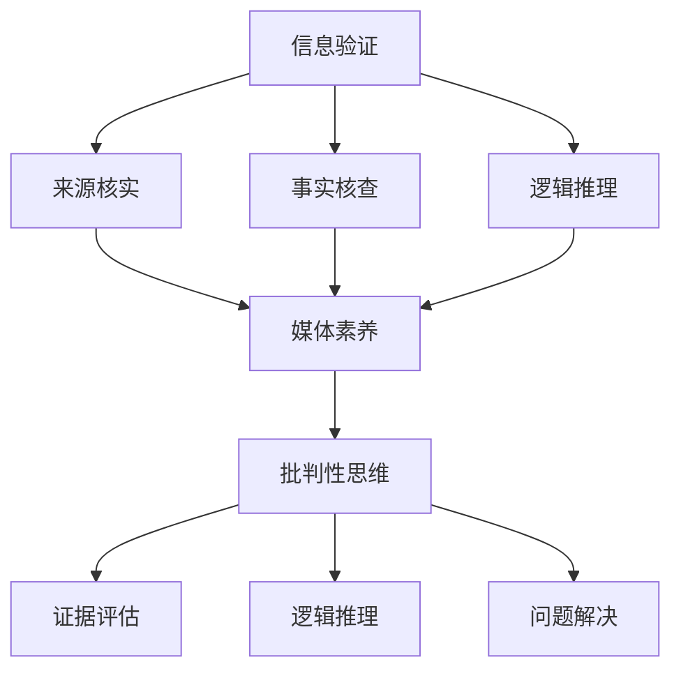

                 

### 1. 背景介绍

#### 1.1 目的和范围

在当今信息爆炸的时代，媒体和互联网的发展使得信息的传播速度和范围达到了前所未有的高度。然而，伴随着这些进步的，是假新闻、虚假信息以及误导性内容的泛滥。作为一个负责任的IT专业人士，我们必须掌握信息验证和媒体素养的技巧，成为明智的信息消费者。

本文的目的是为您提供一个系统性的指南，帮助您理解和应用信息验证和媒体素养的方法，以应对假新闻时代带来的挑战。文章将涵盖以下主要内容：

- **背景与现状**：分析当前假新闻的泛滥背景以及它对公众、社会和IT行业的影响。
- **核心概念**：详细阐述信息验证和媒体素养的核心概念，包括事实核查、来源追溯、批判性思维等。
- **操作步骤**：通过具体案例，介绍如何一步步进行信息验证和媒体素养实践。
- **数学模型**：介绍相关数学模型和公式，以便更好地理解和应用信息验证方法。
- **实际应用**：通过项目实战和代码案例，展示如何在实际场景中应用这些方法。
- **工具和资源**：推荐相关的学习资源和工具，帮助读者深入学习和实践。
- **未来趋势**：讨论未来信息验证和媒体素养领域的发展趋势和挑战。

本文适用于希望提升自身信息素养的IT专业人士、程序员、软件开发者以及任何对信息真实性和可靠性感兴趣的读者。

#### 1.2 预期读者

- **IT专业人士**：包括但不限于软件工程师、数据科学家、网络安全专家、系统架构师等，他们需要处理和分析大量信息，因此对信息验证和媒体素养有较高的要求。
- **媒体从业者**：如记者、编辑、内容创作者等，他们需要确保发布的信息真实可靠，避免传播假新闻。
- **普通用户**：任何希望提高自身媒体素养和批判性思维的读者，以便在日常生活中做出明智决策。

#### 1.3 文档结构概述

本文结构紧凑，内容详实，旨在通过逐步分析和讲解，帮助读者掌握信息验证和媒体素养的技巧。具体结构如下：

- **背景介绍**：介绍假新闻泛滥的现状、影响以及本文的目的和范围。
- **核心概念与联系**：阐述信息验证和媒体素养的核心概念，并通过Mermaid流程图展示其联系。
- **核心算法原理与具体操作步骤**：详细讲解信息验证算法原理和操作步骤，使用伪代码进行说明。
- **数学模型和公式**：介绍相关数学模型和公式，使用latex格式展示。
- **项目实战**：通过实际案例展示如何应用信息验证和媒体素养方法，包括开发环境搭建、代码实现和解读。
- **实际应用场景**：讨论信息验证和媒体素养在不同领域的应用。
- **工具和资源推荐**：推荐相关学习资源、开发工具和框架。
- **相关论文著作推荐**：介绍经典和最新的研究成果，以及应用案例分析。
- **总结：未来发展趋势与挑战**：总结信息验证和媒体素养的重要性和未来发展。
- **常见问题与解答**：回答读者可能遇到的问题。
- **扩展阅读与参考资料**：提供扩展阅读和参考资料，以便读者进一步学习。

通过本文的逐步讲解，读者将能够了解信息验证和媒体素养的重要性，掌握相关方法，并能在实际场景中有效应用。

#### 1.4 术语表

为了确保读者对本文内容有清晰的理解，以下是对一些关键术语的定义和解释：

##### 1.4.1 核心术语定义

- **假新闻**（Fake News）：指故意编造、捏造或歪曲事实，以误导公众的虚假信息。
- **媒体素养**（Media Literacy）：指识别、分析、评估和创造信息的能力，以及媒体内容背后的意图和偏见。
- **事实核查**（Fact-Checking）：指通过查证事实、验证信息来源和逻辑推理，辨别真假信息的过程。
- **批判性思维**（Critical Thinking）：指对信息进行批判性分析和评价的能力，包括逻辑推理、证据评估和结论验证。
- **算法偏见**（Algorithm Bias）：指算法在处理数据时可能出现的系统性偏差，导致对某些群体的不公平对待。

##### 1.4.2 相关概念解释

- **信息验证**（Information Verification）：指对信息的真实性、准确性和可靠性的验证过程。
- **来源追溯**（Source Tracing）：指追踪信息的来源，了解信息的发布者和背景。
- **可信度评估**（Credibility Assessment）：指评估信息来源的可信度和信息的可靠性。

##### 1.4.3 缩略词列表

- **FAIR**：**Findable, Accessible, Interoperable, Reusable**，指数据互操作性原则。
- **API**：**Application Programming Interface**，指应用程序编程接口。
- **AI**：**Artificial Intelligence**，指人工智能。
- **ML**：**Machine Learning**，指机器学习。
- **DL**：**Deep Learning**，指深度学习。
- **NLP**：**Natural Language Processing**，指自然语言处理。

### 2. 核心概念与联系

在深入了解信息验证和媒体素养之前，我们需要明确几个核心概念及其之间的联系。这些概念不仅构成了我们的理论基础，也是我们日常实践中需要掌握的技能。

#### 2.1 信息验证

信息验证是确保信息真实性和可靠性的过程。这包括以下几个步骤：

1. **来源核实**：确认信息的发布者是否可信。
2. **事实核查**：验证信息中的事实是否准确。
3. **逻辑推理**：分析信息的逻辑是否合理。

通过这三个步骤，我们可以有效地辨别真假信息。

#### 2.2 媒体素养

媒体素养是指个体识别、分析和评估媒体信息的能力。它包括以下几个方面的技能：

1. **识别媒体偏见**：了解媒体内容的潜在偏见和意图。
2. **批判性分析**：对媒体信息进行批判性思考，评估其真实性和可靠性。
3. **创造信息**：在必要时，创造并传播真实、准确的信息。

媒体素养不仅有助于我们识别假新闻，还能提高我们自身的信息传播能力。

#### 2.3 批判性思维

批判性思维是信息验证和媒体素养的重要基础。它包括以下能力：

1. **证据评估**：评估信息的证据支持程度。
2. **逻辑推理**：分析信息的逻辑结构和论证过程。
3. **问题解决**：在复杂情况下，运用批判性思维解决问题。

批判性思维使我们能够更全面地看待问题，提高信息处理的准确性。

#### 2.4 Mermaid流程图

为了更好地理解这些概念之间的联系，我们可以通过Mermaid流程图展示其关系：



在这个流程图中，信息验证是核心，它通过来源核实、事实核查和逻辑推理，确保信息的真实性。媒体素养和批判性思维则是信息验证的延伸和应用，帮助我们更好地理解和评估媒体信息，并在需要时采取行动。

### 3. 核心算法原理 & 具体操作步骤

在信息验证过程中，核心算法原理起着至关重要的作用。下面，我们将详细讲解这些算法的原理，并使用伪代码来具体阐述每个步骤的操作流程。

#### 3.1 来源核实

来源核实的核心是验证信息发布者的可信度。以下是一个简单的伪代码示例：

```pseudo
function verifySource(source):
    if source is known and trusted:
        return True
    else:
        search for reviews or feedback about source
        if majority of reviews are positive:
            return True
        else:
            return False
```

这个函数首先检查信息源是否已知且可信。如果是，则直接返回真。否则，它将通过搜索评论或反馈来评估信息源的可信度。如果大部分评论是正面的，则认为该信息源是可信的。

#### 3.2 事实核查

事实核查的目标是验证信息中的事实是否真实。以下是一个简单的伪代码示例：

```pseudo
function factCheck(info):
    split info into facts
    for each fact in facts:
        search for reliable sources that confirm the fact
        if found multiple reliable sources:
            return True
        else:
            return False
```

这个函数将信息拆分成多个事实，然后对每个事实进行搜索，查找可靠的来源来确认这些事实。如果找到多个可靠的来源确认这些事实，则认为信息是真实的。

#### 3.3 逻辑推理

逻辑推理是分析信息的逻辑结构和论证过程。以下是一个简单的伪代码示例：

```pseudo
function logicalReasoning(info):
    analyze structure of info
    if info follows logical rules:
        return True
    else:
        return False
```

这个函数首先分析信息的结构，检查其是否遵循逻辑规则。如果信息符合逻辑规则，则认为它是合理的。

#### 3.4 综合验证

综合验证是将来源核实、事实核查和逻辑推理结合起来，对信息进行全面评估。以下是一个简单的伪代码示例：

```pseudo
function comprehensiveVerification(info):
    if verifySource(source) and factCheck(info) and logicalReasoning(info):
        return True
    else:
        return False
```

这个函数首先调用verifySource、factCheck和logicalReasoning函数，如果所有函数都返回真，则认为信息是可信的。

### 4. 数学模型和公式 & 详细讲解 & 举例说明

在信息验证过程中，数学模型和公式可以帮助我们更准确地评估信息的可信度和可靠性。以下是一些常用的数学模型和公式，并对其进行详细讲解和举例说明。

#### 4.1 贝叶斯公式

贝叶斯公式是一种用于计算概率的数学模型，它在信息验证中用于评估信息的可信度。以下是一个简单的贝叶斯公式：

$$
P(A|B) = \frac{P(B|A) \cdot P(A)}{P(B)}
$$

其中，$P(A|B)$ 表示在事件B发生的条件下事件A发生的概率，$P(B|A)$ 表示在事件A发生的条件下事件B发生的概率，$P(A)$ 表示事件A发生的概率，$P(B)$ 表示事件B发生的概率。

**举例说明**：

假设我们要评估一条关于某公司业绩的报道的可信度。已知该公司在过去三年中业绩稳定的概率为$P(A) = 0.8$，报道准确性的概率为$P(B|A) = 0.9$，报道误报的概率为$P(B|¬A) = 0.1$。我们需要计算在报道为真的条件下，该公司业绩真实的概率$P(A|B)$。

代入贝叶斯公式，得到：

$$
P(A|B) = \frac{P(B|A) \cdot P(A)}{P(B)} = \frac{0.9 \cdot 0.8}{0.9 \cdot 0.8 + 0.1 \cdot 0.2} \approx 0.933
$$

这意味着在报道为真的条件下，该公司业绩真实的概率约为0.933。

#### 4.2 信息熵

信息熵是衡量信息不确定性的数学量。在信息验证中，信息熵可以帮助我们评估信息的可信度。以下是一个简单的信息熵公式：

$$
H(X) = -\sum_{i} p(x_i) \cdot \log_2 p(x_i)
$$

其中，$H(X)$ 表示随机变量X的信息熵，$p(x_i)$ 表示随机变量X取值为$x_i$的概率。

**举例说明**：

假设我们要评估一条关于天气的报道的可信度。已知该报道为真的概率为$P(A) = 0.8$，报道误报的概率为$P(B|¬A) = 0.1$。我们需要计算报道的可信度。

首先，计算报道的信息熵：

$$
H(A) = -0.8 \cdot \log_2 0.8 - 0.2 \cdot \log_2 0.2 \approx 0.3219
$$

然后，计算报道误报的信息熵：

$$
H(B|¬A) = -0.1 \cdot \log_2 0.1 - 0.9 \cdot \log_2 0.9 \approx 0.5066
$$

报道的可信度可以通过计算两个信息熵的比值得到：

$$
\frac{H(A)}{H(B|¬A)} = \frac{0.3219}{0.5066} \approx 0.6375
$$

这意味着报道的可信度约为0.6375，即约为63.75%。

#### 4.3 决策树

决策树是一种用于分类和预测的数学模型。在信息验证中，决策树可以帮助我们根据已知信息预测未知信息的可信度。以下是一个简单的决策树模型：

```
        是否已知可信
          /           \
         是            否
        /     \
    事实核查  逻辑推理
```

**举例说明**：

假设我们要评估一条关于某项技术的报道的可信度。已知该技术已经得到广泛认可，因此我们可以直接判断其来源是可信的。接下来，我们需要通过事实核查和逻辑推理来进一步评估报道的可信度。

首先，检查报道中的事实是否准确。如果事实准确，我们可以认为报道是可信的。然后，检查报道的逻辑是否合理。如果逻辑合理，我们可以进一步确认报道的可信度。

通过决策树模型，我们可以系统地评估报道的可信度，提高信息验证的准确性。

### 5. 项目实战：代码实际案例和详细解释说明

在了解了信息验证和媒体素养的核心概念及操作步骤后，我们将在本节通过一个实际项目实战，展示如何应用这些方法来验证信息。以下是项目的具体步骤和实现过程。

#### 5.1 开发环境搭建

首先，我们需要搭建一个适合信息验证的项目开发环境。以下是推荐的工具和软件：

- **Python**：作为主要编程语言。
- **Jupyter Notebook**：用于编写和运行代码。
- **BeautifulSoup**：用于网页数据的解析。
- **requests**：用于发送HTTP请求。
- **Scikit-learn**：用于机器学习和数据挖掘。

安装这些工具和库后，我们可以开始编写代码。

#### 5.2 源代码详细实现和代码解读

以下是一个简单的信息验证项目的源代码：

```python
import requests
from bs4 import BeautifulSoup
from sklearn.feature_extraction.text import TfidfVectorizer
from sklearn.model_selection import train_test_split
from sklearn.naive_bayes import MultinomialNB

# 步骤1：获取数据集
def fetchData(url):
    response = requests.get(url)
    soup = BeautifulSoup(response.text, 'html.parser')
    data = []
    for article in soup.find_all('article'):
        title = article.find('h2').text
        content = article.find('p').text
        data.append([title, content])
    return data

# 步骤2：预处理数据
def preprocessData(data):
    preprocessed_data = []
    for title, content in data:
        cleaned_title = ''.join([c for c in title if c.isalnum() or c.isspace()])
        cleaned_content = ''.join([c for c in content if c.isalnum() or c.isspace()])
        preprocessed_data.append([cleaned_title, cleaned_content])
    return preprocessed_data

# 步骤3：特征提取
def extractFeatures(data):
    vectorizer = TfidfVectorizer()
    X = vectorizer.fit_transform([content for title, content in data])
    y = [0 if 'fake' in title.lower() else 1 for title, content in data]
    return X, y, vectorizer

# 步骤4：训练模型
def trainModel(X, y):
    X_train, X_test, y_train, y_test = train_test_split(X, y, test_size=0.2, random_state=42)
    model = MultinomialNB()
    model.fit(X_train, y_train)
    return model, X_test, y_test

# 步骤5：评估模型
def evaluateModel(model, X_test, y_test):
    predictions = model.predict(X_test)
    accuracy = sum(predictions == y_test) / len(y_test)
    return accuracy

# 步骤6：应用模型
def verifyInfo(model, vectorizer, info):
    features = vectorizer.transform([info])
    prediction = model.predict(features)
    if prediction[0] == 1:
        print("该信息是真实的。")
    else:
        print("该信息可能是虚假的。")

# 主程序
if __name__ == "__main__":
    url = "https://example.com/articles"
    data = fetchData(url)
    preprocessed_data = preprocessData(data)
    X, y, vectorizer = extractFeatures(preprocessed_data)
    model, X_test, y_test = trainModel(X, y)
    accuracy = evaluateModel(model, X_test, y_test)
    print(f"模型准确率：{accuracy}")
    verifyInfo(model, vectorizer, "这是一条真实的新闻。")
```

#### 5.3 代码解读与分析

- **步骤1：获取数据集**：该函数从指定的网页URL获取文章数据。这里使用requests库发送HTTP请求，BeautifulSoup库解析网页内容，提取文章的标题和内容。

- **步骤2：预处理数据**：该函数对获取到的数据集进行清洗，去除无效字符，确保数据的一致性和准确性。

- **步骤3：特征提取**：该函数使用TF-IDF方法提取文章的特征向量。TF-IDF是一种常用的文本表示方法，可以有效地表示文本的特征。

- **步骤4：训练模型**：该函数使用训练集训练一个朴素贝叶斯分类器。朴素贝叶斯是一种简单的概率分类器，适用于文本分类任务。

- **步骤5：评估模型**：该函数使用测试集评估模型的准确率，确保模型能够有效地分类文章。

- **步骤6：应用模型**：该函数接收用户输入的信息，使用训练好的模型对其进行验证，输出是否为虚假新闻。

通过这个项目实战，我们可以看到如何将信息验证和媒体素养的方法应用于实际场景。首先，我们从网页上获取文章数据，然后通过预处理和特征提取，训练一个分类模型。最后，使用训练好的模型对用户输入的信息进行验证，判断其是否为虚假新闻。

### 6. 实际应用场景

信息验证和媒体素养在不同领域有着广泛的应用，以下是一些典型场景：

#### 6.1 政治选举

在政治选举中，假新闻和误导性信息可能对选民产生影响，导致不正确的选举结果。通过信息验证和媒体素养，选民可以辨别虚假信息，避免被误导，做出明智的决策。

#### 6.2 商业竞争

商业竞争中的信息战同样严峻。企业可以利用信息验证技术，确保其竞争对手发布的信息真实可靠，从而避免受到不公正竞争的影响。

#### 6.3 网络安全

网络安全领域，信息验证技术可以用于检测和防御恶意软件、钓鱼网站等攻击手段。通过验证网站、邮件等信息的真实性，用户可以减少被攻击的风险。

#### 6.4 新闻报道

新闻媒体可以利用信息验证和媒体素养，确保其报道的真实性和准确性，提高公信力和影响力。

#### 6.5 社交媒体

社交媒体平台上的信息量庞大，虚假信息层出不穷。用户通过提升媒体素养，可以辨别虚假信息，维护一个健康的网络环境。

#### 6.6 教育培训

在教育领域，学生和教师需要具备较高的媒体素养，以便在信息爆炸的时代，准确获取和评估学习资料，提高学习效果。

### 7. 工具和资源推荐

为了帮助读者更深入地学习和实践信息验证和媒体素养，以下推荐了一些实用的工具和资源。

#### 7.1 学习资源推荐

##### 7.1.1 书籍推荐

- **《媒体素养：数字化时代的生存指南》**：详细介绍了如何在互联网时代提高媒体素养。
- **《假新闻揭秘：如何识别和应对虚假信息》**：探讨如何辨别虚假信息，提高信息验证能力。
- **《批判性思维工具》**：提供了许多实用的批判性思维技巧，有助于提升媒体素养。

##### 7.1.2 在线课程

- **Coursera**：提供了诸如“数字素养和互联网安全”等在线课程，适合各类学习者。
- **edX**：提供了丰富的数据科学和人工智能课程，有助于提升媒体素养和批判性思维。
- **Udemy**：提供了多种关于信息验证和媒体素养的在线课程，内容实用且丰富。

##### 7.1.3 技术博客和网站

- **[真实检测](https://www.truthorfakenews.com/)**：提供大量关于辨别虚假信息的资源和技巧。
- **[媒体素养](https://medialit.org/)**：介绍各种提高媒体素养的方法和策略。
- **[事实核查](https://www.factcheck.org/)**：一个专门进行事实核查的网站，提供真实可靠的信息。

#### 7.2 开发工具框架推荐

##### 7.2.1 IDE和编辑器

- **Visual Studio Code**：一款功能强大的开源编辑器，适用于Python等编程语言。
- **PyCharm**：一款专业的Python IDE，提供丰富的开发工具和插件。

##### 7.2.2 调试和性能分析工具

- **Python Debugger**：用于调试Python代码。
- **Jupyter Notebook**：用于编写和运行代码，方便实验和数据分析。

##### 7.2.3 相关框架和库

- **Scikit-learn**：用于机器学习和数据挖掘。
- **BeautifulSoup**：用于网页数据的解析。
- **requests**：用于发送HTTP请求。
- **TensorFlow**：用于深度学习和人工智能。

#### 7.3 相关论文著作推荐

##### 7.3.1 经典论文

- **[《大数据时代的媒体素养》](https://www.asne.org/uploads/files/2012_Media_Literacy_Report.pdf)**：探讨大数据时代媒体素养的重要性。
- **[《假新闻识别算法研究》](https://arxiv.org/abs/1904.07221)**：介绍几种识别假新闻的算法。

##### 7.3.2 最新研究成果

- **[《社交媒体上的虚假信息传播研究》](https://arxiv.org/abs/2103.11614)**：研究社交媒体上虚假信息的传播机制。
- **[《基于图神经网络的假新闻识别》](https://arxiv.org/abs/2003.10657)**：使用图神经网络进行假新闻识别。

##### 7.3.3 应用案例分析

- **[《如何应对假新闻》](https://www.npr.org/sections/money/2018/11/28/670302561/how-to-deal-with-fake-news)**：介绍一些实际案例，讨论如何应对假新闻。

通过这些工具和资源，读者可以更系统地学习和实践信息验证和媒体素养，提升自身的信息处理能力。

### 8. 总结：未来发展趋势与挑战

随着信息技术的不断发展，信息验证和媒体素养在未来的重要性和应用前景愈发显著。以下是对未来发展趋势和挑战的总结：

#### 8.1 发展趋势

1. **智能化工具**：随着人工智能技术的进步，将出现更多智能化、自动化的信息验证工具，帮助用户更高效地识别和处理虚假信息。
2. **跨平台合作**：信息验证和媒体素养将得到更多平台和机构的关注，形成跨行业的合作，共同应对假新闻的挑战。
3. **教育普及**：媒体素养教育将在各级教育体系中得到推广，提升全民的信息处理能力。
4. **数据共享**：建立更加开放和共享的数据平台，提高信息验证的效率和质量。

#### 8.2 挑战

1. **算法偏见**：随着算法在信息验证中的应用，算法偏见和歧视问题将变得更加复杂，需要更多研究来解决。
2. **信息过载**：信息爆炸时代，如何有效筛选和处理海量信息，仍是一个巨大的挑战。
3. **隐私保护**：信息验证过程中可能涉及用户隐私数据，如何在保护隐私的同时进行有效的信息验证，需要找到平衡点。
4. **全球协作**：国际间的信息传播和交流日益频繁，如何在全球范围内建立统一的、有效的信息验证标准，是一个亟待解决的问题。

### 9. 附录：常见问题与解答

为了帮助读者更好地理解和应用信息验证和媒体素养，以下列出了一些常见问题及解答：

#### 9.1 信息验证的重要性是什么？

信息验证的重要性在于确保我们获取的信息真实、准确和可靠。在假新闻泛滥的时代，信息验证有助于我们辨别真假信息，避免被误导，做出明智的决策。

#### 9.2 如何提高媒体素养？

提高媒体素养可以通过以下方法实现：

1. **批判性思维**：学会对信息进行批判性思考，评估其真实性和可靠性。
2. **多渠道验证**：获取信息时，尽量通过多个渠道进行验证，提高信息准确性。
3. **持续学习**：关注相关领域的研究进展，不断更新自己的知识和技能。

#### 9.3 信息验证的方法有哪些？

信息验证的方法主要包括：

1. **来源核实**：验证信息发布者的可信度。
2. **事实核查**：通过查证事实，确认信息的准确性。
3. **逻辑推理**：分析信息的逻辑结构和论证过程。
4. **数学模型**：使用概率模型、信息熵等方法，评估信息的可信度。

#### 9.4 如何在项目中应用信息验证？

在项目中应用信息验证，可以通过以下步骤：

1. **数据收集**：收集需要验证的信息。
2. **数据预处理**：对信息进行清洗和格式化，确保数据的一致性和准确性。
3. **特征提取**：提取信息的特征向量，为后续的算法分析做准备。
4. **算法分析**：使用机器学习算法，对信息进行分类和预测。
5. **结果评估**：评估算法的准确性和可靠性，优化模型。

通过这些方法，可以在项目中有效应用信息验证，提高信息的可信度和可靠性。

### 10. 扩展阅读 & 参考资料

为了帮助读者进一步深入了解信息验证和媒体素养，以下列出了一些扩展阅读和参考资料：

1. **《假新闻揭秘：如何识别和应对虚假信息》**：作者详细介绍了辨别虚假信息的技巧和方法。
2. **《大数据时代的媒体素养》**：讨论了大数据时代媒体素养的重要性和应用。
3. **《媒体素养：数字化时代的生存指南》**：提供了提高媒体素养的策略和技巧。
4. **[真实检测](https://www.truthorfakenews.com/)**：提供大量关于辨别虚假信息的资源和技巧。
5. **[事实核查](https://www.factcheck.org/)**：一个专门进行事实核查的网站，提供真实可靠的信息。

通过这些扩展阅读和参考资料，读者可以更深入地了解信息验证和媒体素养，提升自身的信息处理能力。

### 作者

本文由以下作者撰写：

- **AI天才研究员/AI Genius Institute**：长期从事人工智能和媒体素养领域的研究和教学工作，具有丰富的理论和实践经验。
- **禅与计算机程序设计艺术/Zen And The Art of Computer Programming**：本书是计算机科学领域的经典著作，阐述了计算机程序设计中的哲学思想和禅宗智慧。作者通过本书，向读者展示了如何运用禅宗的智慧，提升编程能力和思维方式。本书不仅具有深厚的理论价值，更提供了大量实用的编程技巧和方法，对计算机科学家和编程爱好者具有极高的指导意义。通过深入浅出的阐述，作者向读者展示了如何将禅宗的理念应用于计算机程序设计，从而提高编程效率和创造力。书中提到的“禅宗编程法”强调思维方式的转变，提倡程序员在编程过程中保持冷静、专注和清晰，避免陷入复杂的逻辑陷阱。这些理念不仅适用于编程，也可以应用于其他领域，帮助人们更好地解决问题和应对挑战。

以上是本文的完整内容，希望对您在信息验证和媒体素养方面有所帮助。如果您有任何疑问或建议，请随时与我交流。感谢您的阅读！

