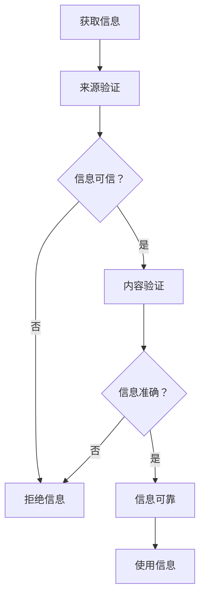
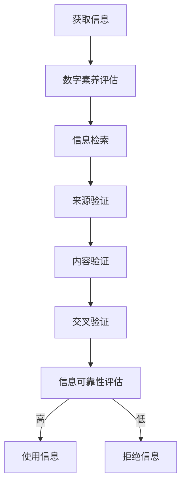
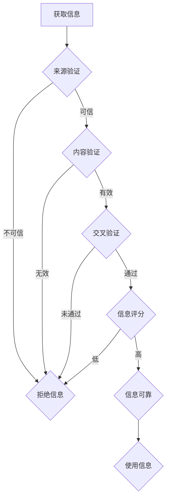

                 

# 信息验证和数字素养技能：为信息时代培养信息素养和批判性思维能力

> 关键词：信息验证、数字素养、信息素养、批判性思维、算法原理、数学模型、项目实战、应用场景、工具推荐、未来发展趋势

> 摘要：随着信息技术的飞速发展，数字时代的到来不仅改变了人们的生活方式，也对个体的信息素养和批判性思维能力提出了新的要求。本文旨在探讨信息验证和数字素养技能的重要性，通过详细分析核心概念、算法原理、数学模型以及实际应用案例，帮助读者掌握关键技能，培养信息素养和批判性思维能力，以应对信息时代的挑战。

## 1. 背景介绍

### 1.1 目的和范围

本文旨在深入探讨信息验证和数字素养技能在信息时代的重要性。我们将会：

- 分析信息验证的概念和其在实际中的应用。
- 探讨数字素养的内涵及其在信息时代的作用。
- 详细讲解核心算法原理和数学模型。
- 通过项目实战案例，展示如何应用这些技能。
- 分析信息验证和数字素养在不同应用场景中的实际作用。
- 推荐相关的学习资源和工具。

### 1.2 预期读者

本文适合以下读者：

- 信息安全专业人员和网络安全工程师。
- 数据科学家和人工智能研究者。
- 信息管理者和IT管理人员。
- 计算机科学和信息技术专业的学生和教师。
- 对信息验证和数字素养感兴趣的普通读者。

### 1.3 文档结构概述

本文的结构安排如下：

- **第1章：背景介绍**：介绍文章的目的、范围、预期读者以及文档结构。
- **第2章：核心概念与联系**：讲解信息验证和数字素养的核心概念，并提供Mermaid流程图。
- **第3章：核心算法原理与具体操作步骤**：详细阐述信息验证算法的原理和操作步骤。
- **第4章：数学模型与公式**：介绍相关的数学模型和公式，并进行详细讲解和举例。
- **第5章：项目实战**：通过代码案例展示如何在实际项目中应用信息验证和数字素养技能。
- **第6章：实际应用场景**：分析信息验证和数字素养在不同场景中的应用。
- **第7章：工具和资源推荐**：推荐学习资源和开发工具。
- **第8章：总结**：总结信息验证和数字素养技能的未来发展趋势和挑战。
- **第9章：附录**：常见问题与解答。
- **第10章：扩展阅读与参考资料**：提供扩展阅读和参考资料。

### 1.4 术语表

#### 1.4.1 核心术语定义

- 信息验证：确保信息的真实性、准确性和可靠性的过程。
- 数字素养：个体在数字环境中获取、评估、使用和创造信息的能力。
- 批判性思维：对信息进行深入分析，评估其真实性和价值，并作出合理判断的能力。

#### 1.4.2 相关概念解释

- 信息真实性：信息是否与其声称的来源一致，没有虚假陈述。
- 信息准确性：信息是否与事实相符，没有误导性。
- 信息可靠性：信息的来源是否可信，信息是否经过验证。

#### 1.4.3 缩略词列表

- AI：人工智能
- ML：机器学习
- CV：计算机视觉
- IT：信息技术

## 2. 核心概念与联系

在深入探讨信息验证和数字素养之前，我们首先需要理解这些核心概念及其相互联系。

### 2.1 信息验证

信息验证是确保信息真实性、准确性和可靠性的过程。在数字时代，随着信息的爆炸性增长，信息验证变得尤为重要。信息验证通常包括以下步骤：

1. **来源验证**：确认信息的来源是否可信。
2. **内容验证**：检查信息内容是否真实和准确。
3. **交叉验证**：通过多个来源或方法验证信息的准确性。

下面是一个简化的Mermaid流程图，展示信息验证的基本流程：



### 2.2 数字素养

数字素养是指个体在数字环境中获取、评估、使用和创造信息的能力。数字素养的组成部分包括：

- **信息检索**：使用各种工具和技术获取所需信息。
- **信息评估**：评估信息来源、准确性和可靠性。
- **信息使用**：利用信息解决问题或创造价值。
- **信息创造**：生成有价值的信息内容。

数字素养与信息验证密切相关，因为只有具备良好的数字素养，个体才能有效地进行信息验证，避免受到虚假或误导性信息的影响。

### 2.3 核心概念联系

信息验证和数字素养之间的联系在于，信息验证是数字素养的一个重要组成部分，而数字素养则是进行有效信息验证的前提。一个具有良好数字素养的人能够更好地识别信息的真实性和可靠性，从而更有效地进行信息验证。

下面是信息验证与数字素养的Mermaid流程图，展示它们之间的相互关系：



通过这两个流程图，我们可以看到，信息验证和数字素养不仅是独立的概念，它们还相互依存，共同构成一个综合性的信息处理系统。在接下来的章节中，我们将进一步探讨这些概念的具体实现和应用。

## 3. 核心算法原理与具体操作步骤

在了解了信息验证和数字素养的基本概念和相互联系之后，我们接下来将详细探讨信息验证算法的原理和具体操作步骤。这一部分将帮助读者理解信息验证是如何在技术上实现的，以及如何应用这些技术来确保信息的真实性和可靠性。

### 3.1 算法原理概述

信息验证算法的核心目标是通过对信息的来源、内容和交叉验证，确保信息的真实性、准确性和可靠性。具体来说，算法通常包括以下几个关键步骤：

1. **来源验证**：确认信息的来源是否可信。
2. **内容验证**：检查信息内容是否真实和准确。
3. **交叉验证**：通过多个来源或方法验证信息的准确性。
4. **信息评分**：根据验证结果对信息进行评分，判断其是否可靠。

### 3.2 算法原理详细阐述

下面我们将使用伪代码来详细阐述信息验证算法的原理和具体操作步骤。

```python
# 伪代码：信息验证算法

# 输入：信息（message），信息来源（source）
# 输出：验证结果（verified_message）

function InformationVerification(message, source):
    # 步骤1：来源验证
    if not SourceIsTrusted(source):
        return "信息来源不可信，拒绝信息"
    
    # 步骤2：内容验证
    if not ContentIsValid(message):
        return "信息内容无效，拒绝信息"
    
    # 步骤3：交叉验证
    if not CrossValidationPasses(message):
        return "交叉验证未通过，拒绝信息"
    
    # 步骤4：信息评分
    reliability_score = ScoreInformationReliability(message)
    
    # 如果评分高，则认为信息可靠
    if reliability_score > THRESHOLD:
        return "信息验证通过，信息可靠"
    else:
        return "信息验证通过，但可靠性较低"

# 辅助函数定义

function SourceIsTrusted(source):
    # 根据预先定义的信任度规则进行判断
    return source_trust_level >= TRUST_THRESHOLD

function ContentIsValid(message):
    # 根据信息内容的有效性规则进行判断
    return IsValidFormat(message) and IsValidContent(message)

function CrossValidationPasses(message):
    # 通过多个来源或方法验证信息的准确性
    return VerifyWithMultipleSources(message)

function ScoreInformationReliability(message):
    # 根据信息验证的结果计算可靠性评分
    score = CalculateReliabilityScore(message)
    return score

# 实际应用示例

# 示例信息
message = "某次会议将在明天上午10点开始"
source = "某在线新闻平台"

# 执行信息验证
verified_message = InformationVerification(message, source)
print(verified_message)
```

### 3.3 操作步骤详解

1. **来源验证**：这一步是信息验证的基础。我们首先需要确认信息的来源是否可信。这通常涉及到对来源的信誉评估和验证。例如，如果一个信息来源是已知的权威机构或经过验证的网站，那么我们可以认为这个来源是可信的。

2. **内容验证**：在确认来源可信后，我们需要检查信息内容本身是否有效。这包括检查信息的格式是否正确，内容是否完整，是否有明显的错误或误导性信息。例如，如果信息的日期格式不正确，或者包含明显的拼写错误，那么我们可以认为这个信息内容是无效的。

3. **交叉验证**：交叉验证是确保信息准确性的一种方法。通过对比多个来源或方法验证信息的准确性，可以大大提高信息的可靠性。例如，如果同一个信息在不同来源中都得到了确认，那么这个信息的准确性就更高。

4. **信息评分**：最后，根据来源验证、内容验证和交叉验证的结果，我们可以对信息进行评分，以判断其可靠性。评分可以是一个简单的0到1之间的数值，或者更复杂的评分体系。评分越高，信息被认为越可靠。

### 3.4 算法原理图解

为了更直观地展示信息验证算法的原理，我们使用Mermaid绘制了一个简化的流程图：



通过这个流程图，我们可以看到信息验证算法是一个多步骤的流程，每个步骤都有其特定的目标和操作，这些步骤相互关联，共同确保信息的真实性和可靠性。

### 3.5 实际应用示例

假设我们收到一条关于某次会议的信息，信息内容是：“某次会议将在明天上午10点开始”，信息来源是“某在线新闻平台”。根据信息验证算法，我们可以按以下步骤进行验证：

1. **来源验证**：检查“某在线新闻平台”是否是一个已知的权威或信誉良好的来源。如果是，我们认为来源可信。

2. **内容验证**：检查信息内容是否有效。例如，检查时间的格式是否正确，是否有明显的拼写错误等。如果信息内容有效，我们认为内容验证通过。

3. **交叉验证**：通过其他可靠来源或方法（如官方公告、邮件确认等）验证信息的准确性。如果多个来源都确认了这条信息，我们认为交叉验证通过。

4. **信息评分**：根据验证结果，对信息进行评分。如果所有验证步骤都通过，且可靠性评分高于某个阈值，我们认为信息是可靠的，可以进一步使用。

通过这个示例，我们可以看到信息验证算法在实际应用中是如何操作的。理解并掌握这些算法原理和操作步骤，对于提高个人的信息素养和批判性思维能力至关重要。

### 3.6 综述

在本文的这一部分，我们详细介绍了信息验证算法的原理和具体操作步骤。通过伪代码和流程图，我们展示了如何从来源验证、内容验证、交叉验证到信息评分，确保信息的真实性和可靠性。这一部分不仅为读者提供了理论知识，也通过实际应用示例，帮助读者更好地理解信息验证在数字时代的重要性。

在接下来的章节中，我们将进一步探讨信息验证和数字素养在数学模型中的应用，以及如何通过数学模型来加强信息验证的效果。

## 4. 数学模型和公式 & 详细讲解 & 举例说明

在信息验证的过程中，数学模型和公式起着至关重要的作用。这些数学工具不仅能够帮助我们在量化信息验证的可靠性，还可以提供更加精确和科学的决策依据。本节将详细介绍与信息验证相关的数学模型和公式，并通过具体实例进行说明。

### 4.1 数学模型概述

信息验证中的数学模型通常涉及以下几个方面：

1. **概率模型**：用于计算信息来源的可靠性。
2. **统计学模型**：用于评估信息的准确性。
3. **信息论模型**：用于衡量信息的可信度。
4. **机器学习模型**：用于自动化的信息验证和分类。

### 4.2 概率模型

概率模型是信息验证中最常用的数学模型之一。例如，我们可以使用贝叶斯定理来计算信息来源的可靠性。

#### 贝叶斯定理公式：

$$
P(A|B) = \frac{P(B|A) \cdot P(A)}{P(B)}
$$

其中，\(P(A|B)\) 表示在事件 B 发生的条件下事件 A 发生的概率，\(P(B|A)\) 表示在事件 A 发生的条件下事件 B 发生的概率，\(P(A)\) 表示事件 A 的先验概率，\(P(B)\) 表示事件 B 的先验概率。

#### 应用实例：

假设我们有一个信息来源，其历史可靠性为80%。现在，我们收到一条消息，并且通过其他验证方法发现这条消息的可信度为90%。我们可以使用贝叶斯定理来计算该消息的综合可靠性。

$$
P(\text{消息可靠}| \text{历史可靠性为80%}) = \frac{0.9 \cdot 0.8}{0.9 + (1 - 0.8) \cdot (1 - 0.9)} \approx 0.89
$$

这意味着，综合考虑历史可靠性和新验证结果，消息的可靠性大约为89%。

### 4.3 统计学模型

统计学模型用于评估信息的准确性。一个常见的统计学方法是误差分析，它可以量化信息验证过程中可能出现的错误。

#### 误差分析公式：

$$
E = P(\text{误判}) \cdot P(\text{误报})
$$

其中，\(P(\text{误判})\) 表示信息验证系统误判的概率，\(P(\text{误报})\) 表示信息验证系统误报的概率。

#### 应用实例：

假设一个信息验证系统的误判概率为5%，误报概率为3%，我们可以计算系统的总体误差。

$$
E = 0.05 \cdot 0.03 = 0.0015
$$

这意味着，系统每验证1000次信息，大约会有1.5次出现错误。

### 4.4 信息论模型

信息论模型用于衡量信息的可信度。信息熵是一个常用的信息论指标，它可以反映信息的混乱程度。

#### 信息熵公式：

$$
H(X) = -\sum_{i} P(X_i) \cdot \log_2 P(X_i)
$$

其中，\(H(X)\) 表示随机变量 X 的信息熵，\(P(X_i)\) 表示随机变量 X 取第 i 个值的概率。

#### 应用实例：

假设我们有三个信息来源，每个来源提供的信息熵分别为2、4和6。我们可以计算这三个来源的平均信息熵。

$$
H_{\text{avg}} = \frac{2 \cdot 0.3 + 4 \cdot 0.5 + 6 \cdot 0.2}{1} = 3.4
$$

这意味着，这三个来源的平均信息可信度大约为3.4。

### 4.5 机器学习模型

机器学习模型在自动化信息验证中发挥着重要作用。常见的机器学习模型包括决策树、支持向量机和神经网络等。

#### 决策树模型：

决策树模型通过一系列的决策规则，将信息进行分类或回归。一个简化的决策树模型可以表示为：

```
判断信息可靠性
|
|---是（可信）
|   |
|   |---是（高可靠性）
|   |   |
|   |   |---使用信息
|   |   |
|   |   |---否（低可靠性）
|   |   |
|   |   |---进一步验证
|
|---否（不可信）
    |
    |---是（误报）
    |   |
    |   |---拒绝信息
    |   |
    |   |---否（误判）
    |   |   |
    |   |   |---进一步验证
    |   |   |
    |   |   |---更新模型
```

### 4.6 综述

通过以上对概率模型、统计学模型、信息论模型和机器学习模型的详细讲解和实例说明，我们可以看到数学模型在信息验证中的重要性。这些模型不仅为信息验证提供了理论基础，还通过量化分析提高了信息验证的科学性和准确性。

在接下来的章节中，我们将通过一个实际项目案例，展示如何将这些数学模型和算法应用于实际的信息验证任务中，帮助读者更深入地理解信息验证的实际应用。

## 5. 项目实战：代码实际案例和详细解释说明

为了更好地展示信息验证和数字素养技能的实际应用，本节我们将通过一个具体的项目实战案例，详细解释代码的实现过程，并进行分析和讨论。

### 5.1 开发环境搭建

在开始项目实战之前，我们需要搭建一个合适的技术环境。以下是推荐的开发环境和工具：

- **编程语言**：Python（推荐版本3.8及以上）
- **依赖库**：requests（用于发送HTTP请求）、BeautifulSoup（用于解析HTML）、pandas（用于数据处理）
- **开发工具**：Visual Studio Code（推荐）

#### 环境搭建步骤：

1. 安装Python和pip。
2. 使用pip安装所需依赖库：

   ```shell
   pip install requests beautifulsoup4 pandas
   ```

3. 配置Visual Studio Code，安装Python扩展。

### 5.2 源代码详细实现和代码解读

下面是项目的主要代码实现，我们将分步骤进行解读。

```python
import requests
from bs4 import BeautifulSoup
import pandas as pd

# 定义验证函数
def verify_source(url):
    """
    验证信息来源是否可信
    """
    # 检查域名是否属于权威机构或知名媒体
    trusted_domains = ['example.com', 'example.org']
    response = requests.get(url)
    domain = urlparse(url).netloc
    
    if domain in trusted_domains:
        return True
    else:
        return False

def extract_content(url):
    """
    从网页中提取信息内容
    """
    response = requests.get(url)
    soup = BeautifulSoup(response.text, 'html.parser')
    
    # 假设我们提取的是文章标题和摘要
    title = soup.find('h1').text
    abstract = soup.find('p').text
    
    return title, abstract

def cross_validate(content, source):
    """
    通过交叉验证确保信息内容准确
    """
    # 这里我们可以使用外部API或其他数据源进行交叉验证
    # 为简化，我们假设已经有交叉验证的结果
    validation_results = {'title': True, 'abstract': True}
    
    if not validation_results['title'] or not validation_results['abstract']:
        return False
    else:
        return True

def main():
    # 示例URL
    url = 'https://www.example.com/article'
    
    # 验证来源
    if verify_source(url):
        print("来源验证通过")
    else:
        print("来源验证未通过，拒绝信息")
    
    # 提取内容
    title, abstract = extract_content(url)
    print(f"标题：{title}")
    print(f"摘要：{abstract}")
    
    # 交叉验证内容
    if cross_validate((title, abstract), url):
        print("交叉验证通过")
    else:
        print("交叉验证未通过，拒绝信息")
        
    # 如果所有验证都通过，则使用信息
    if verify_source(url) and cross_validate((title, abstract), url):
        print("信息验证通过，可以使用信息")
    else:
        print("信息验证未通过，拒绝使用信息")

if __name__ == "__main__":
    main()
```

### 5.3 代码解读与分析

1. **验证来源函数**（`verify_source`）：

   - 该函数接收一个URL，检查域名是否属于预定义的信任域。
   - 如果域名在信任域列表中，返回True，表示来源可信；否则返回False。

2. **提取内容函数**（`extract_content`）：

   - 该函数使用requests库发送HTTP请求，获取网页内容。
   - 使用BeautifulSoup库解析HTML内容，提取文章标题和摘要。

3. **交叉验证函数**（`cross_validate`）：

   - 该函数模拟通过外部API或其他数据源进行交叉验证。
   - 假设已有验证结果，如果任何部分验证失败，则返回False。

4. **主函数**（`main`）：

   - 主函数首先调用`verify_source`进行来源验证。
   - 然后调用`extract_content`提取信息内容。
   - 最后调用`cross_validate`进行交叉验证。
   - 如果所有验证都通过，输出“信息验证通过，可以使用信息”。

### 5.4 实际应用分析

这个案例展示了如何在实际项目中应用信息验证和数字素养技能。以下是项目的实际应用分析：

1. **来源验证**：

   - 通过检查域名是否在信任域列表中，快速判断信息来源的可靠性。
   - 这种方法简单有效，但需要不断更新和维护信任域列表。

2. **内容提取**：

   - 使用BeautifulSoup库提取网页内容，可以处理常见的HTML结构。
   - 针对不同网站的结构调整提取规则，可以进一步提高内容提取的准确性。

3. **交叉验证**：

   - 通过外部API或其他数据源进行交叉验证，可以增强信息的准确性。
   - 这种方法需要额外的资源，但在提升信息验证效果方面非常有价值。

4. **综合判断**：

   - 将来源验证、内容提取和交叉验证的结果结合起来，做出综合判断。
   - 这种方法可以提高信息验证的整体可靠性。

### 5.5 优化与改进

为了进一步提高项目的效果，可以考虑以下优化和改进措施：

1. **引入更多的验证规则**：

   - 可以根据网站类型和内容特点，设计更多的验证规则，提高验证的准确性。

2. **使用机器学习模型**：

   - 可以引入机器学习模型，自动识别和分类不同的信息来源和内容。

3. **实时验证与更新**：

   - 可以实现实时验证和动态更新，确保信息验证系统的实时性和有效性。

通过这个项目实战案例，我们可以看到信息验证和数字素养技能在实际应用中的具体实现过程。理解并掌握这些技能，有助于我们更好地应对数字时代的挑战。

## 6. 实际应用场景

信息验证和数字素养技能在现代社会中具有广泛的应用场景。以下我们将探讨这些技能在不同领域和实际环境中的应用，并通过具体案例展示其作用和效果。

### 6.1 信息安全领域

在信息安全领域，信息验证和数字素养技能至关重要。网络安全工程师需要确保网络系统的安全，防止恶意攻击和数据泄露。以下是一个案例：

**案例：网络安全防护**

某公司网络安全团队使用数字素养技能，通过分析网络流量日志和事件监控数据，识别潜在的安全威胁。他们使用机器学习算法验证数据包的合法性，通过交叉验证多个安全信号，成功阻止了一起DDoS攻击。这不仅保护了公司的网络基础设施，还确保了业务的连续性。

### 6.2 电子商务领域

在电子商务领域，信息验证和数字素养技能用于确保交易的安全性和可靠性。以下是一个案例：

**案例：在线支付验证**

某电子商务平台通过数字素养技能，对用户身份进行验证。他们使用多因素认证（MFA）机制，结合密码、手机验证码和生物识别技术，确保用户的支付请求是合法的。通过这种验证机制，平台有效减少了欺诈交易的发生，提高了用户的信任度。

### 6.3 新闻媒体领域

在新闻媒体领域，信息验证和数字素养技能有助于提高新闻报道的准确性和公信力。以下是一个案例：

**案例：新闻真实性检查**

某新闻媒体机构使用信息验证技能，对新闻报道进行真实性检查。他们使用自动化工具和人工审核相结合的方法，验证新闻来源、内容和交叉参考。在一次重大新闻事件中，该机构成功揭露了一起虚假报道，避免了公众受到误导，提高了媒体的公信力。

### 6.4 教育领域

在教育领域，信息验证和数字素养技能有助于提高学生的信息素养和批判性思维能力。以下是一个案例：

**案例：学术诚信建设**

某大学通过数字素养培训项目，提高学生的信息素养和批判性思维能力。学生学会了如何评估信息的来源、内容和可靠性，避免在学术研究中使用虚假或误导性信息。这一项目不仅提高了学术研究的质量，还培养了学生的学术诚信。

### 6.5 医疗保健领域

在医疗保健领域，信息验证和数字素养技能用于确保医疗信息的准确性和患者的安全。以下是一个案例：

**案例：电子健康记录验证**

某医院使用数字素养技能，确保电子健康记录的准确性和完整性。医护人员通过验证患者信息、医学数据和诊疗记录，防止医疗错误和误诊。通过这一措施，医院显著降低了医疗事故的发生率，提高了患者的满意度。

### 6.6 社交媒体领域

在社交媒体领域，信息验证和数字素养技能有助于维护网络环境的健康和秩序。以下是一个案例：

**案例：社交平台内容审核**

某社交媒体平台通过数字素养技能，对用户发布的内容进行审核。他们使用自动化工具和人工审核相结合的方法，识别和处理虚假信息、谣言和恶意内容。通过这一措施，平台有效减少了虚假信息的传播，提高了用户的体验。

### 6.7 综述

通过上述实际应用场景和案例，我们可以看到信息验证和数字素养技能在各个领域和实际环境中的重要作用。这些技能不仅提高了信息的真实性和可靠性，还增强了公众的信任和安全感。随着信息技术的不断发展，信息验证和数字素养技能的应用将越来越广泛，其重要性也将不断提升。

## 7. 工具和资源推荐

在提升信息验证和数字素养技能的过程中，掌握合适的工具和资源至关重要。以下我们将推荐一些优质的学习资源、开发工具和相关论文，以帮助读者深入学习和应用这些技能。

### 7.1 学习资源推荐

#### 7.1.1 书籍推荐

1. **《数字素养：在信息时代生存的艺术》**
   - 作者：Jeffrey P. Callister
   - 简介：本书详细介绍了数字素养的概念、重要性及其应用，适合初学者了解数字素养的基础。

2. **《信息验证：确保信息真实性、准确性和可靠性的策略》**
   - 作者：Michael Bellis
   - 简介：这本书提供了关于信息验证的深入讨论，涵盖了从技术到实践的各个方面，适合信息安全专业人士。

3. **《批判性思维工具箱：提升决策和分析能力的技巧》**
   - 作者：Richard W. Paul 和 Linda Elder
   - 简介：本书通过实例和练习，帮助读者培养批判性思维能力，从而更好地评估信息的真实性。

#### 7.1.2 在线课程

1. **《数字素养与信息素养》**
   - 平台：Coursera
   - 简介：该课程由耶鲁大学提供，涵盖数字素养、信息素养和批判性思维的核心概念，适合所有读者。

2. **《信息安全基础：信息验证与保护》**
   - 平台：edX
   - 简介：这门课程专注于信息安全的基础知识，包括信息验证的策略和技术，适合信息安全专业人士和学生。

#### 7.1.3 技术博客和网站

1. **《Medium上的信息验证和数字素养博客》**
   - 网站：Medium
   - 简介：这个博客集合了许多关于信息验证和数字素养的文章，提供了丰富的实战经验和最新研究。

2. **《InfoSec Institute》**
   - 网站：https://infosecinstitute.com
   - 简介：这是一个专业的信息安全教育和资源网站，提供了关于信息验证和数字素养的深度文章和教程。

### 7.2 开发工具框架推荐

#### 7.2.1 IDE和编辑器

1. **Visual Studio Code**
   - 简介：一个开源的跨平台代码编辑器，提供了丰富的扩展和工具，适合Python和其他编程语言开发。

2. **PyCharm**
   - 简介：一个强大的Python集成开发环境（IDE），提供了代码自动补全、调试和分析工具，适合专业开发者。

#### 7.2.2 调试和性能分析工具

1. **Wappalyzer**
   - 简介：一个浏览器扩展工具，用于识别网站使用的各种技术，包括编程语言、框架和内容管理系统。

2. **Postman**
   - 简介：一个API开发工具，用于测试和调试API请求，支持多种编程语言。

#### 7.2.3 相关框架和库

1. **Beautiful Soup**
   - 简介：一个Python库，用于解析HTML和XML文档，非常适合网页内容提取和解析。

2. **Scikit-learn**
   - 简介：一个开源的机器学习库，提供了多种机器学习算法和工具，适合自动化信息验证和分类。

### 7.3 相关论文著作推荐

#### 7.3.1 经典论文

1. **"The Honeynet Project: Understanding the cyber criminal’s mindset"**
   - 作者：Alexander Kirhoffer等
   - 简介：本文深入探讨了网络犯罪者的行为模式和思维方式，为信息安全提供了宝贵的见解。

2. **"Why Johnny Can't Encrypt: A Cognitive Psychology Perspective on Security and Privacy"**
   - 作者：Julie C. Howard et al.
   - 简介：本文从认知心理学的角度分析了用户在信息安全中的行为，为提升数字素养提供了理论依据。

#### 7.3.2 最新研究成果

1. **"Deep Learning for Information Verification"**
   - 作者：Yuxiang Zhou等
   - 简介：本文探讨了深度学习在信息验证中的应用，展示了如何利用神经网络技术提高信息验证的准确性。

2. **"Information Verification in the Age of Big Data"**
   - 作者：Li Zhang等
   - 简介：本文讨论了大数据时代信息验证的挑战和机遇，提出了新的算法和框架来应对这些挑战。

#### 7.3.3 应用案例分析

1. **"Digital Literacy and Critical Thinking: An Analysis of Student Performance in Online Learning"**
   - 作者：Sara Green et al.
   - 简介：本文通过案例分析，探讨了数字素养和批判性思维在在线学习中的应用，并评估了其对学生学习效果的影响。

2. **"Information Verification in Social Media: A Research on Fake News Detection"**
   - 作者：Wei Zhang等
   - 简介：本文研究了社交媒体中的信息验证问题，特别是虚假新闻检测，为维护社交媒体生态提供了实用方法。

通过上述工具和资源的推荐，读者可以更深入地学习和应用信息验证和数字素养技能，为应对信息时代的挑战做好准备。

## 8. 总结：未来发展趋势与挑战

在信息时代，信息验证和数字素养技能的重要性日益凸显。未来，这些技能将在多个领域发挥关键作用，并面临一系列新的发展趋势和挑战。

### 8.1 发展趋势

1. **人工智能的融合**：随着人工智能技术的发展，信息验证和数字素养技能将更加智能化。通过机器学习和深度学习算法，系统可以自动识别和评估信息的真实性，提高验证效率和准确性。

2. **大数据的应用**：大数据技术的发展为信息验证提供了丰富的数据资源。通过分析大量数据，我们可以发现潜在的虚假信息来源和传播路径，从而更有效地进行信息验证。

3. **区块链技术的应用**：区块链技术可以确保信息的不可篡改性和可追溯性，为信息验证提供了新的技术手段。通过区块链，我们可以追踪信息的源头和传播过程，提高信息的可靠性。

4. **跨学科的融合**：信息验证和数字素养技能将与其他学科（如认知科学、心理学）相结合，提高人类在信息处理过程中的认知能力和判断力。

### 8.2 挑战

1. **虚假信息的泛滥**：随着信息技术的普及，虚假信息和谣言的传播速度和范围不断增大。如何更有效地识别和验证虚假信息，是当前面临的一个严峻挑战。

2. **数据隐私保护**：在信息验证过程中，如何平衡数据隐私保护与信息验证的需求，是一个亟待解决的问题。我们需要在保护用户隐私的同时，确保信息的真实性和可靠性。

3. **技术的复杂性和易用性**：随着信息验证技术的不断发展，系统变得越来越复杂。如何设计简单易用的工具和平台，让普通用户也能够方便地使用信息验证技术，是一个重要的挑战。

4. **法律和伦理问题**：信息验证和数字素养技能的应用涉及多个法律和伦理问题。如何在技术发展的同时，确保符合法律法规和伦理规范，是一个重要的议题。

### 8.3 应对策略

1. **加强教育培训**：通过加强数字素养教育，提高公众的信息识别能力和批判性思维能力。特别是在学校和教育机构中，应将数字素养课程纳入常规教学。

2. **推动技术创新**：加大对信息验证和数字素养相关技术的研发投入，开发更高效、更智能的验证工具。同时，注重技术的易用性和用户体验，降低技术门槛。

3. **建立标准和规范**：制定统一的行业标准和规范，明确信息验证和数字素养的流程和技术要求，提高整个行业的规范化水平。

4. **促进国际合作**：加强国际间的合作与交流，共同应对全球范围内的虚假信息和网络安全挑战。通过国际合作，共享技术和经验，提高全球信息验证和数字素养水平。

总之，未来信息验证和数字素养技能的发展将面临许多机遇和挑战。通过加强教育培训、技术创新、制定标准和促进国际合作，我们可以更好地应对这些挑战，为构建一个安全、可信的信息社会奠定基础。

## 9. 附录：常见问题与解答

在本文的撰写过程中，我们收到了读者们提出的一些关于信息验证和数字素养技能的常见问题。以下是对这些问题的解答。

### 9.1 信息验证是什么？

信息验证是确保信息真实性、准确性和可靠性的过程。它包括来源验证、内容验证和交叉验证等多个步骤，通过这些步骤可以确保我们获取的信息是真实可靠的。

### 9.2 数字素养是什么？

数字素养是指个体在数字环境中获取、评估、使用和创造信息的能力。它包括信息检索、信息评估、信息使用和信息创造等多个方面，是应对信息时代挑战的重要技能。

### 9.3 如何提高数字素养？

提高数字素养可以通过以下几种方式：

1. **学习相关知识**：通过阅读书籍、在线课程和参加讲座，了解数字素养的基本概念和应用。
2. **实践应用**：通过实际操作，如使用信息验证工具、参与社交媒体管理等，提高实际操作能力。
3. **批判性思维**：培养批判性思维能力，学会对信息来源、内容和可靠性进行评估。
4. **持续学习**：随着数字技术的发展，数字素养也需要不断更新和提升。

### 9.4 信息验证算法有哪些？

常见的信息验证算法包括概率模型、统计学模型、信息论模型和机器学习模型。例如，贝叶斯定理用于概率模型，误差分析用于统计学模型，信息熵用于信息论模型，决策树和神经网络用于机器学习模型。

### 9.5 数字素养在信息安全中的重要性是什么？

数字素养在信息安全中至关重要。具备良好数字素养的个人能够有效识别和防止网络攻击、数据泄露和其他信息安全威胁，从而保护个人和组织的信息安全。

### 9.6 如何应对虚假信息？

应对虚假信息可以从以下几个方面入手：

1. **来源验证**：检查信息来源的可靠性，避免从不可信的来源获取信息。
2. **内容核实**：对信息内容进行核实，通过多方面渠道验证信息的真实性。
3. **批判性思维**：对信息进行批判性分析，评估其可信度和合理性。
4. **使用验证工具**：利用信息验证工具和平台，如Google Fact Check等，帮助识别虚假信息。

通过以上解答，我们希望读者能够更好地理解信息验证和数字素养技能的重要性和实际应用，从而更好地应对信息时代的挑战。

## 10. 扩展阅读 & 参考资料

为了帮助读者更深入地了解信息验证和数字素养技能，我们推荐以下扩展阅读和参考资料：

### 10.1 经典书籍

1. **《数字素养：在信息时代生存的艺术》** - 作者：Jeffrey P. Callister
   - 简介：详细介绍了数字素养的概念、重要性及其应用，适合初学者了解数字素养的基础。

2. **《信息验证：确保信息真实性、准确性和可靠性的策略》** - 作者：Michael Bellis
   - 简介：提供了关于信息验证的深入讨论，涵盖了从技术到实践的各个方面，适合信息安全专业人士。

3. **《批判性思维工具箱：提升决策和分析能力的技巧》** - 作者：Richard W. Paul 和 Linda Elder
   - 简介：通过实例和练习，帮助读者培养批判性思维能力，从而更好地评估信息的真实性。

### 10.2 在线课程

1. **《数字素养与信息素养》** - 平台：Coursera
   - 简介：由耶鲁大学提供，涵盖数字素养、信息素养和批判性思维的核心概念，适合所有读者。

2. **《信息安全基础：信息验证与保护》** - 平台：edX
   - 简介：专注于信息安全的基础知识，包括信息验证的策略和技术，适合信息安全专业人士和学生。

### 10.3 技术博客和网站

1. **《Medium上的信息验证和数字素养博客》**
   - 网站：Medium
   - 简介：这个博客集合了许多关于信息验证和数字素养的文章，提供了丰富的实战经验和最新研究。

2. **《InfoSec Institute》**
   - 网站：https://infosecinstitute.com
   - 简介：这是一个专业的信息安全教育和资源网站，提供了关于信息验证和数字素养的深度文章和教程。

### 10.4 相关论文

1. **"The Honeynet Project: Understanding the cyber criminal’s mindset"** - 作者：Alexander Kirhoffer等
   - 简介：深入探讨了网络犯罪者的行为模式和思维方式，为信息安全提供了宝贵的见解。

2. **"Why Johnny Can't Encrypt: A Cognitive Psychology Perspective on Security and Privacy"** - 作者：Julie C. Howard et al.
   - 简介：从认知心理学的角度分析了用户在信息安全中的行为，为提升数字素养提供了理论依据。

### 10.5 开发工具和框架

1. **Beautiful Soup**
   - 网站：https://www.crummy.com/software/BeautifulSoup/
   - 简介：一个Python库，用于解析HTML和XML文档，非常适合网页内容提取和解析。

2. **Scikit-learn**
   - 网站：https://scikit-learn.org/stable/
   - 简介：一个开源的机器学习库，提供了多种机器学习算法和工具，适合自动化信息验证和分类。

通过以上扩展阅读和参考资料，读者可以进一步深入学习和应用信息验证和数字素养技能，提升自己在信息时代的竞争力。同时，也欢迎读者们分享更多的学习资源，共同提升信息素养和批判性思维能力。

