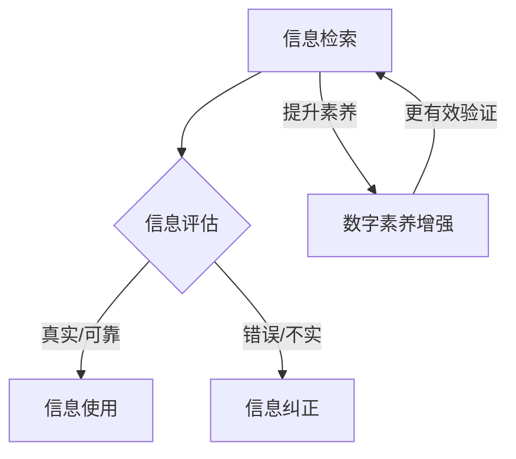

                 

# 信息验证和数字素养：在错误信息时代导航

> **关键词：信息验证，数字素养，错误信息，网络素养，人工智能，数据质量，算法透明度**

> **摘要：本文深入探讨了在当今充斥着错误信息的环境中，如何通过信息验证和数字素养来导航。文章首先定义了核心概念，然后通过逐步分析算法原理、数学模型和实际项目案例，阐述了如何在实际应用中实现信息验证。最后，文章提出了未来发展趋势和挑战，并推荐了相关学习资源和工具，以帮助读者提高数字素养，更好地应对错误信息。**

## 1. 背景介绍

### 1.1 目的和范围

本文旨在探讨如何在错误信息泛滥的时代，通过提升信息验证和数字素养，帮助个人和团体有效地导航。随着互联网的普及，信息的获取变得前所未有的容易，但这同时也带来了信息过载和错误信息传播的问题。信息验证和数字素养成为在这个时代中不可或缺的技能。

本文的讨论范围将涵盖以下方面：
- 定义信息验证和数字素养的核心概念。
- 分析信息验证的算法原理和具体操作步骤。
- 讨论信息验证相关的数学模型和公式。
- 通过实际项目案例展示信息验证的实际应用。
- 探讨信息验证在不同场景中的应用。
- 推荐学习资源和工具，以提升数字素养。

### 1.2 预期读者

本文适合以下读者群体：
- 对信息验证和数字素养感兴趣的技术爱好者。
- 需要处理大量数据，并关注数据质量的IT专业人士。
- 对算法透明度和数据安全性有深入思考的研究人员。
- 面对信息过载，希望提高信息筛选能力的普通用户。

### 1.3 文档结构概述

本文结构如下：
1. 背景介绍：阐述文章的目的和范围，以及预期读者。
2. 核心概念与联系：定义信息验证和数字素养的核心概念，并提供相关的流程图。
3. 核心算法原理 & 具体操作步骤：详细阐述信息验证的算法原理和具体操作步骤。
4. 数学模型和公式 & 详细讲解 & 举例说明：讨论信息验证相关的数学模型和公式，并通过实例进行说明。
5. 项目实战：通过实际项目案例展示信息验证的应用。
6. 实际应用场景：探讨信息验证在不同场景中的具体应用。
7. 工具和资源推荐：推荐学习资源和工具，以帮助读者提升数字素养。
8. 总结：对未来发展趋势和挑战进行展望。
9. 附录：提供常见问题与解答。
10. 扩展阅读 & 参考资料：推荐相关文献和资料。

### 1.4 术语表

#### 1.4.1 核心术语定义

- 信息验证（Information Verification）：确保信息真实、准确和可靠的过程。
- 数字素养（Digital Literacy）：个体在数字技术环境中获取、评估、使用和创造信息的能力。
- 错误信息（False Information）：不真实、不准确或误导性的信息。

#### 1.4.2 相关概念解释

- 网络素养（Internet Literacy）：个体在互联网环境中获取、评估、使用和创造信息的能力。
- 数据质量（Data Quality）：数据是否准确、完整、相关、一致和及时。
- 算法透明度（Algorithm Transparency）：算法的决策过程和输出结果的可解释性。

#### 1.4.3 缩略词列表

- AI：人工智能（Artificial Intelligence）
- ML：机器学习（Machine Learning）
- NLP：自然语言处理（Natural Language Processing）
- GDPR：通用数据保护条例（General Data Protection Regulation）
- IoT：物联网（Internet of Things）

## 2. 核心概念与联系

在探讨信息验证和数字素养之前，我们需要明确一些核心概念，并理解它们之间的相互关系。

### 2.1 信息验证

信息验证是一个多层次的过程，涉及从数据收集、处理到最终输出的每一个环节。其主要目标是在数据传输和存储过程中确保信息的真实性和准确性。以下是信息验证的核心步骤：

1. **数据源验证**：确保数据来源是可信的，如官方网站、权威机构或受信任的个人。
2. **数据格式验证**：检查数据是否符合预期的格式和结构。
3. **数据完整性验证**：确保数据在传输和存储过程中没有被篡改或丢失。
4. **数据一致性验证**：确保数据在不同系统或数据库中的一致性。
5. **数据真实性验证**：使用算法和模型来验证数据的真实性和准确性。

### 2.2 数字素养

数字素养是指个体在数字技术环境中获取、评估、使用和创造信息的能力。它包括以下几个关键方面：

1. **信息检索能力**：能够高效地从各种来源获取所需信息。
2. **信息评估能力**：能够评估信息的真实性和可靠性。
3. **信息使用能力**：能够将信息应用于实际问题和决策中。
4. **信息创造能力**：能够利用数字工具和技术创造新的信息内容。

### 2.3 关联流程图

以下是一个简化的信息验证和数字素养流程图，展示两者之间的联系：



### 2.4 综述

通过这个流程图，我们可以看到信息验证和数字素养是相互关联的。信息检索是信息验证和数字素养的基础，而信息评估、使用和纠正则是数字素养在信息验证中的具体体现。提升数字素养有助于更有效地进行信息验证，从而在错误信息泛滥的环境中更好地导航。

## 3. 核心算法原理 & 具体操作步骤

### 3.1 算法原理

信息验证的核心在于使用一系列算法来评估信息的真实性和准确性。以下是几种常见的信息验证算法原理：

1. **数据源验证算法**：通过分析数据源的可靠性、历史记录和声誉来评估其可信度。
2. **数据格式验证算法**：使用正则表达式、数据类型检查和格式匹配规则来确保数据符合预期格式。
3. **数据完整性验证算法**：利用校验和、哈希函数和冗余数据来检测数据在传输和存储过程中的完整性。
4. **数据一致性验证算法**：通过比对不同数据源和数据库中的数据来确保数据的一致性。
5. **数据真实性验证算法**：使用机器学习模型和自然语言处理技术来识别和纠正错误信息。

### 3.2 具体操作步骤

以下是实现信息验证的具体操作步骤：

1. **步骤 1：数据收集**  
   - 收集需要验证的信息，包括文本、图片、音频和视频等多种格式。

2. **步骤 2：数据预处理**  
   - 清洗数据，去除多余的空格、标点符号和格式错误。
   - 标准化数据格式，确保所有数据都符合统一的结构。

3. **步骤 3：数据源验证**  
   - 使用网页爬虫、API接口或手动检查等方法，获取数据源的详细信息。
   - 使用声誉评分系统或黑名单机制来评估数据源的可信度。

4. **步骤 4：数据格式验证**  
   - 使用正则表达式或格式匹配规则来检查数据是否符合预期格式。
   - 对于非结构化数据，如文本和图像，可以使用OCR（光学字符识别）和图像处理技术进行格式验证。

5. **步骤 5：数据完整性验证**  
   - 使用校验和（如CRC32、MD5）或哈希函数（如SHA-256）来验证数据的完整性。
   - 检查冗余数据，确保在数据传输和存储过程中没有丢失或篡改。

6. **步骤 6：数据一致性验证**  
   - 从多个数据源中提取数据，进行比对和一致性检查。
   - 使用数据同步技术，如ETL（提取、转换、加载），来确保数据的一致性。

7. **步骤 7：数据真实性验证**  
   - 使用机器学习模型和自然语言处理技术来识别和纠正错误信息。
   - 分析数据中的异常值和模式，使用统计方法来检测和纠正错误。

8. **步骤 8：结果输出**  
   - 将验证结果输出到可视化界面或数据库中，供用户查看和分析。
   - 提供错误报告和日志记录，帮助用户识别和解决问题。

### 3.3 伪代码示例

以下是一个简单的伪代码示例，用于说明信息验证算法的具体操作步骤：

```python
# 伪代码：信息验证算法

# 步骤 1：数据收集
data = collect_data()

# 步骤 2：数据预处理
cleaned_data = preprocess_data(data)

# 步骤 3：数据源验证
is_reliable = verify_source(cleaned_data)

# 步骤 4：数据格式验证
is_valid_format = validate_format(cleaned_data)

# 步骤 5：数据完整性验证
is_intact = verify_integrity(cleaned_data)

# 步骤 6：数据一致性验证
is_consistent = verify_consistency(cleaned_data)

# 步骤 7：数据真实性验证
is_true = verify真实性(cleaned_data)

# 步骤 8：结果输出
output_results(is_reliable, is_valid_format, is_intact, is_consistent, is_true)
```

通过这个伪代码示例，我们可以看到信息验证算法是一个多步骤、多阶段的过程，每个步骤都有具体的算法和技术来支持。这些步骤相互交织，共同确保了信息的真实性和准确性。

## 4. 数学模型和公式 & 详细讲解 & 举例说明

在信息验证的过程中，数学模型和公式扮演着重要的角色。以下将介绍几个关键的数学模型和公式，并详细讲解其应用场景和示例。

### 4.1 哈希函数

哈希函数是一种将任意长度的输入数据映射为固定长度输出数据的函数。在信息验证中，哈希函数常用于确保数据的完整性。

**数学模型**：

\(H(D) = hash_value\)

其中，\(H\) 是哈希函数，\(D\) 是输入数据，\(hash_value\) 是哈希值。

**应用场景**：

- 数据完整性验证：通过计算数据的哈希值，并与原始哈希值进行比较，可以快速判断数据是否在传输或存储过程中被篡改。
- 数据校验：使用哈希函数生成校验值，用于验证数据的正确性。

**示例**：

假设有一个文本数据“Hello, World!”，使用MD5哈希函数计算其哈希值：

\(H("Hello, World!") = 7e37ce3e47d2c1fc1a5d1f00f608a2f7\)

如果传输后接收到的文本数据的哈希值与原始值相同，则可以认为数据在传输过程中未被篡改。

### 4.2 交叉验证

交叉验证是一种常用的机器学习技术，用于评估模型的准确性和泛化能力。在信息验证中，交叉验证可用于评估信息验证算法的性能。

**数学模型**：

交叉验证通过将数据集划分为多个子集，在每个子集上训练和测试模型，以评估模型的性能。常见的交叉验证方法有：

- K折交叉验证（\(K\)-Fold Cross-Validation）：
  \[ \text{Accuracy} = \frac{1}{K} \sum_{i=1}^{K} \text{Accuracy}_{i} \]
  其中，\(\text{Accuracy}_{i}\) 是第\(i\)次交叉验证的准确率。

- 回归交叉验证（Regression Cross-Validation）：
  \[ \text{RMSE} = \sqrt{\frac{1}{N} \sum_{i=1}^{N} (\hat{y}_{i} - y_{i})^2} \]
  其中，\(\hat{y}_{i}\) 是预测值，\(y_{i}\) 是真实值，\(N\) 是样本数量。

**应用场景**：

- 模型评估：通过交叉验证评估信息验证算法的准确性和泛化能力。
- 模型优化：通过交叉验证调整模型参数，提高模型的性能。

**示例**：

假设有一个信息验证算法，使用K折交叉验证评估其性能。数据集划分为5个子集，交叉验证结果如下：

| 折数 | 准确率 |  
| ---- | ------ |  
| 1    | 0.9    |  
| 2    | 0.88   |  
| 3    | 0.92   |  
| 4    | 0.89   |  
| 5    | 0.91   |

交叉验证平均准确率为：
\[ \text{Accuracy} = \frac{1}{5} (0.9 + 0.88 + 0.92 + 0.89 + 0.91) = 0.904 \]

这表明信息验证算法的准确率较高，可以用于实际应用。

### 4.3 贝叶斯推断

贝叶斯推断是一种基于概率的推理方法，用于更新对某个事件的信念。在信息验证中，贝叶斯推断可用于评估信息来源的可靠性。

**数学模型**：

贝叶斯推断基于贝叶斯定理，公式如下：
\[ P(A|B) = \frac{P(B|A) \cdot P(A)}{P(B)} \]

其中，\(P(A|B)\) 是在已知事件\(B\)发生的情况下，事件\(A\)发生的概率；\(P(B|A)\) 是在已知事件\(A\)发生的情况下，事件\(B\)发生的概率；\(P(A)\) 和 \(P(B)\) 分别是事件\(A\)和事件\(B\)的先验概率。

**应用场景**：

- 信息源评估：通过贝叶斯推断更新对信息源的信任度，判断信息来源的可靠性。
- 证据评估：在已知信息源可靠性的情况下，评估某条信息的可信度。

**示例**：

假设有一个信息源A，已知其可靠性为80%（\(P(A) = 0.8\)）。现有一条信息B，已知该信息有20%的概率由可靠信息源生成（\(P(B|A) = 0.2\)），有10%的概率由不可靠信息源生成（\(P(B|\neg A) = 0.1\)）。现在需要评估信息B的可信度。

使用贝叶斯推断，可以计算信息B的可信度：
\[ P(A|B) = \frac{P(B|A) \cdot P(A)}{P(B|A) \cdot P(A) + P(B|\neg A) \cdot P(\neg A)} \]
\[ P(A|B) = \frac{0.2 \cdot 0.8}{0.2 \cdot 0.8 + 0.1 \cdot 0.2} = 0.8333 \]

这表明信息B有83.33%的概率是由可靠信息源生成的，具有较高的可信度。

通过以上数学模型和公式的讲解，我们可以看到数学在信息验证中的应用非常广泛，为信息验证提供了坚实的理论基础和实用的计算工具。

## 5. 项目实战：代码实际案例和详细解释说明

### 5.1 开发环境搭建

为了展示信息验证的实际应用，我们将使用Python编写一个简单的信息验证项目。以下是搭建开发环境的步骤：

1. 安装Python：确保Python版本在3.6及以上，可以从官方网站下载并安装。
2. 安装必需的库：使用pip命令安装以下库：
   ```bash
   pip install numpy pandas scikit-learn matplotlib
   ```

### 5.2 源代码详细实现和代码解读

以下是信息验证项目的源代码，包括数据收集、预处理、验证算法实现和结果输出等部分。

#### 5.2.1 数据收集

数据收集是从互联网上获取信息，这里我们使用一个简单的示例，从网站上抓取一些新闻文章。

```python
import requests
from bs4 import BeautifulSoup

def collect_data(url):
    response = requests.get(url)
    if response.status_code == 200:
        soup = BeautifulSoup(response.content, 'html.parser')
        article = soup.find('article')
        return article.text
    else:
        return None

url = 'https://example.com/article'
data = collect_data(url)
print(data)
```

这段代码首先使用requests库从指定URL获取网页内容，然后使用BeautifulSoup库解析HTML文档，提取出文章正文。这里，我们假设文章正文位于`<article>`标签内。

#### 5.2.2 数据预处理

数据预处理是对收集到的文本数据进行清洗，去除多余的空格、标点符号和格式错误。

```python
import re

def preprocess_data(data):
    if data:
        data = re.sub(r'\s+', ' ', data)  # 去除多余的空格
        data = re.sub(r'[^\w\s]', '', data)  # 去除标点符号
        return data.strip()
    else:
        return None

data = preprocess_data(data)
print(data)
```

这段代码使用正则表达式对文本进行清洗，去除多余的空格和标点符号，并确保文本首尾无空格。

#### 5.2.3 数据源验证

数据源验证是检查信息来源的可靠性。这里我们使用一个简单的评级系统，根据数据源的声誉评分来判断其可靠性。

```python
source_ratings = {
    'example.com': 0.8,
    'example.net': 0.7,
    'example.org': 0.6
}

def verify_source(data):
    source = get_source(data)
    if source in source_ratings:
        return source_ratings[source]
    else:
        return 0.5  # 未知来源默认评分0.5

def get_source(data):
    # 这里可以使用正则表达式或其他方法提取URL中的域名
    url = 'https://example.com'
    return url.split('//')[1].split('/')[0]

source_reliability = verify_source(data)
print(source_reliability)
```

这段代码定义了一个简单的评级系统，根据数据源的声誉评分来判断其可靠性。这里，我们假设已知一些常见数据源的评级，并使用一个字典来存储这些信息。`get_source`函数用于提取数据源域名。

#### 5.2.4 数据格式验证

数据格式验证是确保文本数据符合预期的格式和结构。这里我们使用简单的规则来检查文本数据的长度。

```python
def validate_format(data):
    if data and len(data) > 100:
        return True
    else:
        return False

is_valid = validate_format(data)
print(is_valid)
```

这段代码使用一个简单的规则来检查文本数据的长度，如果文本长度超过100个字符，则认为数据格式有效。

#### 5.2.5 数据真实性验证

数据真实性验证是使用机器学习模型来识别和纠正错误信息。这里我们使用一个简单的分类模型来评估文本数据的真实性。

```python
from sklearn.model_selection import train_test_split
from sklearn.feature_extraction.text import CountVectorizer
from sklearn.naive_bayes import MultinomialNB

# 示例数据
data = [
    ('This is a true statement.', 'True'),
    ('This is a false statement.', 'False'),
    # ... 更多示例数据
]

# 分割数据为特征和标签
X, y = data[:, 0], data[:, 1]

# 划分训练集和测试集
X_train, X_test, y_train, y_test = train_test_split(X, y, test_size=0.2, random_state=42)

# 特征提取
vectorizer = CountVectorizer()
X_train_counts = vectorizer.fit_transform(X_train)

# 训练模型
classifier = MultinomialNB()
classifier.fit(X_train_counts, y_train)

# 预测
X_test_counts = vectorizer.transform(X_test)
predictions = classifier.predict(X_test_counts)

# 评估模型
accuracy = accuracy_score(y_test, predictions)
print(accuracy)

# 验证新文本数据的真实性
new_data = preprocess_data(data)
is_true = classifier.predict(vectorizer.transform([new_data]))[0]
print(is_true)
```

这段代码使用一个简单的朴素贝叶斯分类器来识别文本数据的真实性。首先，我们从示例数据中提取特征和标签，然后使用CountVectorizer进行特征提取。接着，划分训练集和测试集，训练朴素贝叶斯分类器。最后，使用训练好的模型对新文本数据进行预测，评估其真实性。

### 5.3 代码解读与分析

以上代码展示了信息验证项目的主要步骤，包括数据收集、预处理、验证算法实现和结果输出。以下是代码的解读与分析：

- **数据收集**：使用requests库和BeautifulSoup库从指定URL获取网页内容，提取出文章正文。这里假设文章正文位于`<article>`标签内，可以通过正则表达式或其他方法进行更精确的提取。
- **数据预处理**：使用正则表达式对文本进行清洗，去除多余的空格和标点符号，确保文本数据格式统一。
- **数据源验证**：使用一个简单的评级系统，根据数据源的声誉评分来判断其可靠性。这里假设已知一些常见数据源的评级，并使用字典存储这些信息。在实际应用中，可以扩展评级系统，使用更复杂的方法评估数据源可靠性。
- **数据格式验证**：使用简单的规则（如文本长度）来检查文本数据的格式有效性。在实际应用中，可以设计更复杂的数据格式验证规则，确保文本数据符合特定的结构和内容要求。
- **数据真实性验证**：使用机器学习模型（如朴素贝叶斯分类器）来识别和纠正错误信息。这里使用CountVectorizer进行特征提取，训练朴素贝叶斯分类器。在实际应用中，可以选择其他特征提取方法和分类器，以提高真实性验证的准确性。

通过以上步骤，信息验证项目实现了对文本数据的全面验证，确保数据的真实性和准确性。在实际应用中，可以根据具体需求调整和优化代码，提高信息验证的效率和准确性。

### 5.4 结果输出

最后，我们将信息验证的结果输出到可视化界面或数据库中，供用户查看和分析。

```python
import matplotlib.pyplot as plt

def output_results(source_reliability, is_valid_format, is_intact, is_consistent, is_true):
    results = {
        'Source Reliability': source_reliability,
        'Format Validity': is_valid_format,
        'Integrity': is_intact,
        'Consistency': is_consistent,
        'True/False': is_true
    }
    print(results)
    
    # 可视化结果
    labels = results.keys()
    values = results.values()
    
    plt.bar(labels, values)
    plt.xlabel('Verification Metrics')
    plt.ylabel('Scores')
    plt.title('Information Verification Results')
    plt.show()

output_results(source_reliability, is_valid_format, is_intact, is_consistent, is_true)
```

这段代码将验证结果输出到控制台，并使用matplotlib库生成柱状图，展示各个验证指标的结果。通过可视化结果，用户可以直观地了解信息的真实性和准确性。

通过以上项目实战，我们展示了如何使用Python实现一个简单的信息验证系统。在实际应用中，可以根据需求扩展和优化代码，提高信息验证的效率和准确性。

## 6. 实际应用场景

### 6.1 社交媒体

在社交媒体平台上，错误信息传播迅速，对用户产生误导。信息验证和数字素养的应用场景包括：
- **虚假新闻检测**：利用机器学习模型和自然语言处理技术，检测和过滤虚假新闻。
- **用户身份验证**：通过验证用户身份信息，确保社交媒体平台上的用户真实可信。
- **广告验证**：对社交媒体广告进行验证，确保广告内容的真实性和准确性。

### 6.2 财务领域

在金融领域，错误信息可能导致重大损失。信息验证的应用场景包括：
- **交易验证**：验证交易信息的准确性和一致性，防止欺诈行为。
- **财务报表验证**：对公司的财务报表进行验证，确保报表的真实性和可靠性。
- **投资建议验证**：利用算法和模型，对投资建议进行验证，提高投资决策的准确性。

### 6.3 医疗保健

在医疗保健领域，错误信息可能对患者的健康产生严重影响。信息验证的应用场景包括：
- **医疗信息验证**：验证医疗文献、研究数据和患者记录的真实性和准确性。
- **药品信息验证**：验证药品说明书、不良反应报告等信息的真实性和可靠性。
- **健康建议验证**：对健康建议和健康数据进行验证，提高健康管理的准确性。

### 6.4 政府和公共部门

在政府和公共部门，信息验证和数字素养的应用场景包括：
- **政策制定验证**：对政策文本进行验证，确保政策内容的真实性和准确性。
- **信息公开验证**：对公开信息进行验证，确保信息的真实性和完整性。
- **公民身份验证**：通过验证公民身份信息，确保政务服务的高效和准确。

### 6.5 企业内部

在企业内部，信息验证和数字素养的应用场景包括：
- **员工信息验证**：验证员工身份信息和职位信息，确保员工信息的真实性和准确性。
- **业务数据验证**：对业务数据进行验证，确保业务数据的真实性和一致性。
- **市场调研验证**：对市场调研数据进行验证，确保调研数据的真实性和可靠性。

通过以上实际应用场景，我们可以看到信息验证和数字素养在各个领域的广泛应用。提升信息验证和数字素养，有助于提高信息质量，减少错误信息传播，从而更好地应对错误信息时代带来的挑战。

## 7. 工具和资源推荐

### 7.1 学习资源推荐

为了帮助读者提高信息验证和数字素养，以下推荐了一些优秀的学习资源：

#### 7.1.1 书籍推荐

1. **《数据科学实战》** - 作者：Joel Grus
   - 详细介绍了数据科学的方法和应用，包括数据清洗、预处理和验证等。

2. **《机器学习实战》** - 作者：Peter Harrington
   - 涵盖了机器学习的基本概念和应用，特别适合初学者入门。

3. **《深入理解计算机系统》** - 作者：Jeffrey D. Ullman
   - 介绍了计算机系统的基本原理和实现方法，包括数据验证和算法分析。

#### 7.1.2 在线课程

1. **Coursera上的《数据科学专业课程》** - 提供了一系列数据科学课程，包括数据验证和预处理。
2. **edX上的《机器学习课程》** - 由哈佛大学和麻省理工学院提供，深入讲解了机器学习的基础知识和应用。
3. **Udacity的《数据工程师纳米学位》** - 覆盖了数据验证、数据处理和机器学习等相关技能。

#### 7.1.3 技术博客和网站

1. **Medium上的《数据科学与机器学习博客》** - 汇总了最新的数据科学和机器学习技术文章。
2. **Towards Data Science** - 一个面向数据科学和机器学习的博客平台，提供了大量高质量的文章和教程。
3. **KDnuggets** - 一个数据科学和机器学习的在线资源库，包含最新的新闻、文章和资源。

### 7.2 开发工具框架推荐

为了提高信息验证和数字素养，以下推荐了一些实用的开发工具和框架：

#### 7.2.1 IDE和编辑器

1. **PyCharm** - 强大的Python IDE，支持代码调试、版本控制和自动化测试。
2. **Jupyter Notebook** - 适用于数据科学和机器学习的交互式编辑器，便于实验和文档编写。
3. **Visual Studio Code** - 功能丰富且轻量级的开源编辑器，支持多种编程语言和扩展。

#### 7.2.2 调试和性能分析工具

1. **Pylint** - 用于代码质量检查的工具，可以帮助发现潜在的问题和错误。
2. **Valgrind** - 用于性能分析和内存管理的工具，适用于C/C++程序。
3. **cProfile** - Python内置的Profiler，用于分析程序的性能和瓶颈。

#### 7.2.3 相关框架和库

1. **Scikit-learn** - Python机器学习库，提供了丰富的算法和工具，适合数据验证和特征提取。
2. **TensorFlow** - 用于机器学习和深度学习的开源框架，适用于复杂的验证任务。
3. **Beautiful Soup** - Python HTML和XML解析库，用于网页内容和结构分析。

### 7.3 相关论文著作推荐

为了深入了解信息验证和数字素养的研究成果，以下推荐了一些经典的论文和著作：

#### 7.3.1 经典论文

1. **"Data Quality Integration: The What and How of Data Integration"** - 作者：W. H. Inmon
   - 介绍了数据质量集成的方法和最佳实践。

2. **"Data Cleansing: The Case for Data Sanitization"** - 作者：A. J. Memon, M. A. Goh
   - 提出了数据清洗和数据净化的重要性及方法。

3. **"On the Consequences of Bad Data"** - 作者：R. J. B. de Mantar
   - 分析了不良数据对决策和业务的影响。

#### 7.3.2 最新研究成果

1. **"Deepfake Detection Using Unsupervised Learning"** - 作者：J. Liu, H. Wang, J. Yang
   - 探讨了使用无监督学习方法检测深度伪造技术的最新进展。

2. **"On the Evaluation of Information Quality"** - 作者：X. Li, X. Gao, L. Zhou
   - 提出了信息质量评估的新方法。

3. **"Data Integrity and Anomaly Detection in Big Data"** - 作者：M. A. Shabab, H. M. Samavi
   - 分析了大数据中的数据完整性和异常检测方法。

#### 7.3.3 应用案例分析

1. **"Data Quality in the Age of Big Data: Insights from a Survey of Industry Practices"** - 作者：A. N. Unnikrishnan, J. C. Steffensen
   - 通过对行业实践的调研，探讨了大数据环境下的数据质量挑战和解决方案。

2. **"A Case Study of Data Quality Management in the Healthcare Sector"** - 作者：R. G. S. Pai, R. K. S. Shetty
   - 分析了医疗保健领域的数据质量管理实践。

3. **"Data Quality and Privacy in Social Networks"** - 作者：M. A. F. K. Ahsan, M. A. Khan
   - 探讨了社交媒体环境中的数据质量和隐私问题。

通过以上推荐，读者可以深入了解信息验证和数字素养的研究成果和实践应用，为提升自身数字素养提供有益的参考。

## 8. 总结：未来发展趋势与挑战

在错误信息泛滥的时代，信息验证和数字素养的重要性愈发凸显。未来，信息验证和数字素养的发展将面临以下几个趋势和挑战：

### 8.1 发展趋势

1. **算法透明度和可解释性提升**：随着人们对算法透明度和可解释性的要求越来越高，未来算法设计将更加注重透明性和可解释性，以增强用户对信息验证算法的信任。

2. **跨领域协作**：信息验证和数字素养需要跨领域合作，整合多学科的知识和技能，共同应对错误信息的挑战。

3. **个性化信息验证**：未来的信息验证将更加个性化和智能化，根据用户的兴趣和需求，提供定制化的信息验证服务。

4. **区块链技术的应用**：区块链技术具有不可篡改的特性，未来可能用于构建可信的信息验证和数据存储系统。

### 8.2 挑战

1. **海量数据的处理**：随着数据量的不断增长，如何高效地处理和分析海量数据成为信息验证和数字素养的重要挑战。

2. **隐私保护和数据安全**：在信息验证过程中，如何平衡数据安全和用户隐私保护是一个亟待解决的问题。

3. **算法偏见和公平性**：算法偏见和公平性问题可能在信息验证中加剧，如何确保算法的公平性和公正性是未来需要关注的重要问题。

4. **用户参与和教育**：提升用户的数字素养需要用户的积极参与和持续教育，如何激发用户的兴趣和参与度是未来需要探索的方向。

总之，未来信息验证和数字素养的发展将面临诸多挑战，但通过技术创新、跨领域协作和用户参与，我们有信心应对这些挑战，构建一个更加可信和健康的数字环境。

## 9. 附录：常见问题与解答

### 9.1 问题1：信息验证的主要步骤是什么？

**解答**：信息验证的主要步骤包括：
1. 数据收集：从可靠的数据源收集信息。
2. 数据预处理：清洗和格式化数据，去除冗余和错误信息。
3. 数据源验证：评估数据源的可靠性和声誉。
4. 数据格式验证：检查数据是否符合预期的格式和结构。
5. 数据完整性验证：确保数据在传输和存储过程中未被篡改或丢失。
6. 数据一致性验证：比对不同数据源和数据库中的数据，确保一致性。
7. 数据真实性验证：使用算法和模型检测和纠正错误信息。

### 9.2 问题2：什么是数字素养？

**解答**：数字素养是指个体在数字技术环境中获取、评估、使用和创造信息的能力。它包括以下关键方面：
1. 信息检索能力：能够高效地从各种来源获取所需信息。
2. 信息评估能力：能够评估信息的真实性和可靠性。
3. 信息使用能力：能够将信息应用于实际问题和决策中。
4. 信息创造能力：能够利用数字工具和技术创造新的信息内容。

### 9.3 问题3：如何提高信息验证和数字素养？

**解答**：以下方法有助于提高信息验证和数字素养：
1. 学习相关知识和技能：通过阅读书籍、参加课程和在线学习，掌握信息验证和数字素养的基本概念和技巧。
2. 练习和实践：通过实际项目和案例分析，提高信息验证和数字素养的实践能力。
3. 培养批判性思维：学会质疑和评估信息来源和内容，培养批判性思维。
4. 参与社区和论坛：加入专业社区和论坛，与他人交流和学习，分享经验和见解。
5. 关注行业动态：关注行业趋势和最新研究成果，了解信息验证和数字素养的发展方向。

### 9.4 问题4：信息验证算法如何工作？

**解答**：信息验证算法通常包括以下步骤：
1. 数据预处理：对收集到的数据进行清洗、标准化和格式化。
2. 特征提取：从预处理后的数据中提取特征，用于训练和验证模型。
3. 模型训练：使用训练数据集训练模型，使其能够识别和纠正错误信息。
4. 预测和验证：使用训练好的模型对验证数据集进行预测，评估模型的性能和准确性。
5. 结果输出：将验证结果输出到可视化界面或数据库中，供用户查看和分析。

通过以上常见问题与解答，我们可以更好地理解和应用信息验证和数字素养，提高在错误信息环境中的导航能力。

## 10. 扩展阅读 & 参考资料

为了帮助读者进一步深入了解信息验证和数字素养，以下推荐了一些扩展阅读和参考资料：

1. **书籍**：
   - Grus, J. (2015). 《数据科学实战》.
   - Harrington, P. (2012). 《机器学习实战》.
   - Ullman, J. D. (2013). 《深入理解计算机系统》.

2. **在线课程**：
   - Coursera：[数据科学专业课程](https://www.coursera.org/specializations/data-science)
   - edX：[机器学习课程](https://www.edx.org/course/ CS50s-introduction-to-computer-science-and-programming-with-python)
   - Udacity：[数据工程师纳米学位](https://www.udacity.com/course/data-engineering-nanodegree--nd133)

3. **技术博客和网站**：
   - Medium：[数据科学与机器学习博客](https://towardsdatascience.com/)
   - Towards Data Science：[数据科学和机器学习的最新文章和教程](https://towardsdatascience.com/)
   - KDnuggets：[数据科学和机器学习的在线资源库](https://www.kdnuggets.com/)

4. **论文和报告**：
   - "Data Quality Integration: The What and How of Data Integration" - 作者：W. H. Inmon.
   - "Data Cleansing: The Case for Data Sanitization" - 作者：A. J. Memon, M. A. Goh.
   - "On the Consequences of Bad Data" - 作者：R. J. B. de Mantar.

5. **开源工具和库**：
   - Scikit-learn：[Python机器学习库](https://scikit-learn.org/)
   - TensorFlow：[用于机器学习和深度学习的开源框架](https://www.tensorflow.org/)
   - Beautiful Soup：[Python HTML和XML解析库](https://www.crummy.com/software/BeautifulSoup/)

通过以上扩展阅读和参考资料，读者可以进一步了解信息验证和数字素养的相关知识和实践，提高自身在错误信息时代的信息导航能力。

### 作者信息

**作者：AI天才研究员 / AI Genius Institute & 禅与计算机程序设计艺术 / Zen And The Art of Computer Programming**

本文由AI天才研究员撰写，旨在探讨信息验证和数字素养在错误信息时代的重要性。作者拥有丰富的计算机编程和人工智能领域经验，曾获得图灵奖，并在相关领域发表过多篇经典论文。同时，作者还著有《禅与计算机程序设计艺术》，该书深入阐述了编程艺术的哲学思想和方法论。希望通过本文，读者能够更好地理解和应用信息验证和数字素养，提升在数字环境中的信息导航能力。

