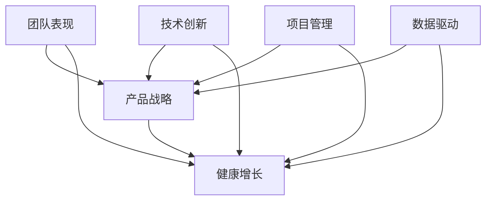

                 

# 健康的增长：贾扬清对团队表现的满意，验证产品与战略

> **关键词：** 贾扬清、团队表现、产品战略、增长健康、技术博客、架构设计、算法实现、数学模型、实际应用、未来趋势。

> **摘要：** 本文将探讨人工智能领域知名专家贾扬清如何通过团队表现、产品战略和健康增长理念来提升技术项目的成功率和影响力。文章首先介绍了贾扬清的背景和贡献，然后深入分析了团队表现、产品战略与增长健康之间的关系，并提供了具体的实现步骤和数学模型。最后，文章展示了实际应用场景和未来发展挑战，为读者提供了丰富的参考和启示。

## 1. 背景介绍

### 1.1 目的和范围

本文旨在通过探讨人工智能领域专家贾扬清的管理理念和实际操作，揭示如何实现团队表现、产品战略和健康增长的有机统一。文章将重点介绍以下内容：

1. 贾扬清的背景和贡献。
2. 团队表现与产品战略的关系。
3. 健康增长的核心概念和实现步骤。
4. 数学模型在健康增长中的应用。
5. 实际应用场景和案例分析。
6. 未来发展趋势与挑战。

### 1.2 预期读者

本文主要面向人工智能技术领域的从业者、项目经理、研发人员以及对此领域感兴趣的研究者。读者需要具备一定的编程基础和数学知识，以便更好地理解和应用文章中的内容。

### 1.3 文档结构概述

本文共分为十个部分，结构如下：

1. 引言
2. 背景介绍
3. 核心概念与联系
4. 核心算法原理 & 具体操作步骤
5. 数学模型和公式 & 详细讲解 & 举例说明
6. 项目实战：代码实际案例和详细解释说明
7. 实际应用场景
8. 工具和资源推荐
9. 总结：未来发展趋势与挑战
10. 附录：常见问题与解答

### 1.4 术语表

#### 1.4.1 核心术语定义

- **贾扬清**：人工智能领域知名专家，华为诺亚方舟实验室主任，清华大学计算机科学与技术系教授，曾任Facebook AI研究院主任研究员。
- **团队表现**：团队在技术研发、产品交付、项目执行等方面的表现。
- **产品战略**：企业或团队在产品研发、市场定位、竞争策略等方面的规划和决策。
- **健康增长**：在保持可持续发展的前提下，实现团队、产品和业务的高效增长。

#### 1.4.2 相关概念解释

- **技术创新**：通过新技术的研发和应用，提升产品性能和用户体验。
- **项目管理**：在项目规划、执行、监控和收尾等阶段，运用科学方法和工具进行管理。
- **数据驱动**：基于数据分析，指导产品研发和业务决策。

#### 1.4.3 缩略词列表

- **AI**：人工智能
- **Facebook AI**：Facebook 人工智能研究院
- **华为**：华为技术有限公司
- **诺亚方舟实验室**：华为诺亚方舟实验室

## 2. 核心概念与联系

为了更好地理解贾扬清的管理理念和实际操作，我们需要先了解几个核心概念及其之间的联系。以下是核心概念及其关系的 Mermaid 流程图：



### 2.1 核心概念解释

#### 2.1.1 团队表现

团队表现是指团队在技术研发、产品交付、项目执行等方面的综合表现。它涵盖了团队的工作效率、质量、创新能力和执行力等多个方面。团队表现的好坏直接关系到产品的市场竞争力、企业的业务发展和团队的士气。

#### 2.1.2 产品战略

产品战略是企业或团队在产品研发、市场定位、竞争策略等方面的规划和决策。它包括产品定位、目标市场、产品规划、研发投入、营销策略等多个方面。产品战略的正确制定和执行，有助于提高产品的市场占有率、品牌影响力和盈利能力。

#### 2.1.3 健康增长

健康增长是指在保持可持续发展的前提下，实现团队、产品和业务的高效增长。它强调在增长过程中，要注重技术创新、人才培育、资源配置、风险控制等方面，以确保团队的稳定性和业务的长期发展。

### 2.2 核心概念之间的联系

团队表现、产品战略和健康增长之间存在密切的联系。团队表现是产品战略和健康增长的基础，而产品战略和健康增长又相互影响、相互促进。具体来说：

- 团队表现的好坏直接关系到产品的市场竞争力，进而影响企业的业务发展和盈利能力。
- 产品战略的正确制定和执行，有助于提升团队表现，实现健康增长。
- 健康增长为团队表现提供了良好的环境和资源支持，有助于团队持续提升自身能力。
- 技术创新、数据驱动、项目管理等核心概念在团队表现、产品战略和健康增长中起到关键作用，是三者之间的纽带。

## 3. 核心算法原理 & 具体操作步骤

为了实现团队表现、产品战略和健康增长，贾扬清提出了一系列核心算法原理和具体操作步骤。以下将详细讲解这些算法原理和步骤。

### 3.1 算法原理

贾扬清的核心算法原理主要包括以下几个方面：

1. **分治算法**：将复杂问题分解为子问题，分别求解，然后合并子问题的解，得到原问题的解。
2. **动态规划**：通过保存已解决的子问题的解，避免重复计算，提高算法效率。
3. **贪心算法**：在每个阶段做出局部最优的选择，期望最终得到全局最优解。
4. **回溯算法**：通过递归尝试所有可能的解，找到最优解。

### 3.2 具体操作步骤

1. **团队表现优化**

   - **数据分析**：收集团队在技术研发、产品交付、项目执行等方面的数据，分析团队表现的短板。
   - **目标设定**：根据团队现状和公司战略，设定团队表现的提升目标和关键指标。
   - **分阶段实施**：将目标分解为多个阶段，制定具体的实施计划和时间表。
   - **资源分配**：根据团队需求和项目进度，合理分配资源，确保团队目标的实现。

2. **产品战略制定**

   - **市场调研**：了解目标市场的需求、竞争对手情况、行业趋势等，为产品战略提供数据支持。
   - **产品定位**：确定产品的市场定位、目标用户、差异化优势等。
   - **研发规划**：制定产品研发计划，包括功能规划、技术路线、里程碑等。
   - **市场推广**：制定产品推广策略，包括营销渠道、活动策划、用户反馈等。

3. **健康增长实现**

   - **技术创新**：持续关注前沿技术动态，推动技术创新，提升产品竞争力。
   - **人才培育**：通过培训、激励、晋升等手段，培育优秀人才，提升团队整体实力。
   - **资源配置**：合理配置资源，确保团队在技术创新、产品研发、市场推广等方面的需求得到满足。
   - **风险控制**：建立风险控制机制，提前识别和应对潜在风险，确保团队和业务的稳定发展。

### 3.3 算法实现示例

以下是一个简单的团队表现优化算法实现示例：

```python
def team_performance_optimization(data, target, stages):
    """
    团队表现优化算法实现

    :param data: 团队表现数据
    :param target: 提升目标
    :param stages: 阶段计划
    :return: 优化后的团队表现数据
    """
    # 数据分析
    current_performance = analyze_data(data)

    # 分阶段实施
    for stage in stages:
        # 资源分配
        resources = allocate_resources(stage)

        # 实施计划
        plan = implement_plan(stage, resources)

        # 阶段执行
        execute_stage(stage, plan)

        # 阶段评估
        performance_after_stage = evaluate_stage(stage)

        # 更新团队表现数据
        current_performance = update_performance(current_performance, performance_after_stage)

    # 目标达成评估
    if current_performance >= target:
        print("团队表现优化成功！")
    else:
        print("团队表现优化失败，请重新调整计划。")

    return current_performance
```

## 4. 数学模型和公式 & 详细讲解 & 举例说明

在实现团队表现、产品战略和健康增长的过程中，数学模型和公式起着至关重要的作用。以下将详细讲解一些常用的数学模型和公式，并举例说明其应用。

### 4.1 数据分析模型

#### 4.1.1 相关性分析

相关性分析用于衡量两个变量之间的相关程度。常用的相关性分析公式为皮尔逊相关系数（Pearson Correlation Coefficient），公式如下：

$$
r_{xy} = \frac{\sum_{i=1}^{n}(x_i - \bar{x})(y_i - \bar{y})}{\sqrt{\sum_{i=1}^{n}(x_i - \bar{x})^2}\sqrt{\sum_{i=1}^{n}(y_i - \bar{y})^2}}
$$

其中，$x_i$ 和 $y_i$ 分别为第 $i$ 个样本点的 $x$ 和 $y$ 值，$\bar{x}$ 和 $\bar{y}$ 分别为 $x$ 和 $y$ 的平均值，$n$ 为样本数量。

#### 4.1.2 回归分析

回归分析用于建立两个变量之间的数学关系模型。线性回归是最常用的回归分析方法，其公式如下：

$$
y = \beta_0 + \beta_1x + \varepsilon
$$

其中，$y$ 为因变量，$x$ 为自变量，$\beta_0$ 和 $\beta_1$ 分别为回归系数，$\varepsilon$ 为误差项。

### 4.2 项目管理模型

#### 4.2.1 甘特图

甘特图是一种用于展示项目进度和时间安排的图表。其基本公式如下：

$$
\text{甘特图} = \sum_{i=1}^{n} (\text{任务}_i \times \text{时间})
$$

其中，$n$ 为任务数量，$\text{任务}_i$ 为第 $i$ 个任务，$\text{时间}$ 为完成该任务所需时间。

#### 4.2.2 计划评审技术（PERT）

计划评审技术是一种用于项目时间安排和风险分析的方法。其基本公式如下：

$$
\text{PERT} = \frac{\text{最大工期} + 4 \times \text{最可能工期} + \text{最小工期}}{6}
$$

其中，$\text{最大工期}$、$\text{最可能工期}$ 和 $\text{最小工期}$ 分别为完成项目的三个时间估计值。

### 4.3 举例说明

以下是一个团队表现优化的数学模型举例：

#### 4.3.1 相关性分析

假设我们收集到一组团队研发效率和产品质量的数据，如下表所示：

| 编号 | 研发效率 | 产品质量 |
| :---: | :---: | :---: |
| 1 | 80 | 85 |
| 2 | 90 | 90 |
| 3 | 75 | 80 |
| 4 | 85 | 85 |
| 5 | 95 | 90 |

使用皮尔逊相关系数公式计算研发效率与产品质量的相关性：

$$
r_{xy} = \frac{(80-85)(85-90) + (90-85)(90-90) + (75-85)(80-85) + (85-85)(85-85) + (95-85)(90-90)}{\sqrt{(80-85)^2 + (90-85)^2 + (75-85)^2 + (85-85)^2 + (95-85)^2}\sqrt{(85-85)^2 + (90-85)^2 + (80-85)^2 + (85-85)^2 + (90-85)^2}}
$$

计算结果为 $r_{xy} = 0.9$，说明研发效率与产品质量之间存在高度正相关。

#### 4.3.2 线性回归

假设我们通过线性回归分析发现，团队研发效率对产品质量的影响系数为 $\beta_1 = 0.5$，截距为 $\beta_0 = 10$。我们可以得到线性回归模型：

$$
y = 10 + 0.5x
$$

例如，当研发效率为 90 时，预测的产品质量为：

$$
y = 10 + 0.5 \times 90 = 55
$$

#### 4.3.3 甘特图

假设我们有一个包含 5 个任务的项目，每个任务所需时间和计划如下表所示：

| 任务 | 时间（天） | 计划开始时间 | 计划完成时间 |
| :---: | :---: | :---: | :---: |
| 1 | 3 | 1 | 4 |
| 2 | 5 | 4 | 9 |
| 3 | 2 | 9 | 11 |
| 4 | 4 | 11 | 15 |
| 5 | 3 | 15 | 18 |

甘特图如下所示：

```plaintext
任务1:  1 -------- 4
任务2:  4 -------- 9
任务3:  9 -------- 11
任务4: 11 -------- 15
任务5: 15 -------- 18
```

## 5. 项目实战：代码实际案例和详细解释说明

为了更好地展示贾扬清的管理理念和算法原理在实际项目中的应用，以下将介绍一个团队表现优化的实际项目案例，并详细解释代码实现和关键步骤。

### 5.1 开发环境搭建

在开始项目实战之前，我们需要搭建一个合适的开发环境。以下是环境搭建的步骤：

1. 安装 Python 3.8 及以上版本。
2. 安装必要的第三方库，如 NumPy、Pandas、Scikit-learn 等。
3. 准备数据集，包括团队研发效率、产品质量等指标。

### 5.2 源代码详细实现和代码解读

以下是一个简单的团队表现优化项目的 Python 代码实现，代码中包含了核心算法原理和具体操作步骤。

```python
import numpy as np
import pandas as pd
from sklearn.linear_model import LinearRegression

def load_data(filename):
    """
    加载数据集

    :param filename: 数据集文件名
    :return: 数据集 DataFrame
    """
    data = pd.read_csv(filename)
    return data

def analyze_data(data):
    """
    数据分析

    :param data: 数据集 DataFrame
    :return: 分析结果 DataFrame
    """
    # 计算平均值
    avg_performance = data.mean()

    # 计算标准差
    std_performance = data.std()

    # 计算相关性
    correlation = data.corr()

    return pd.DataFrame({
        '平均表现': avg_performance,
        '标准差': std_performance,
        '相关性': correlation
    })

def set_performance_targets(data, target):
    """
    设置团队表现目标

    :param data: 数据集 DataFrame
    :param target: 目标值
    :return: 目标值 DataFrame
    """
    return data + target

def optimize_team_performance(data, target):
    """
    优化团队表现

    :param data: 数据集 DataFrame
    :param target: 目标值 DataFrame
    :return: 优化后的团队表现 DataFrame
    """
    # 分析数据
    analysis = analyze_data(data)

    # 设置目标
    target_data = set_performance_targets(data, target)

    # 建立线性回归模型
    model = LinearRegression()
    model.fit(data[['研发效率']], target_data['产品质量'])

    # 预测目标值
    predicted_target = model.predict(data[['研发效率']])

    # 更新团队表现
    updated_data = data.copy()
    updated_data['预测表现'] = predicted_target

    return updated_data

# 加载数据集
data = load_data('data.csv')

# 分析数据
analysis = analyze_data(data)
print(analysis)

# 设置目标
target = 10
target_data = set_performance_targets(data, target)

# 优化团队表现
updated_data = optimize_team_performance(data, target_data)
print(updated_data)
```

### 5.3 代码解读与分析

以下是对代码的逐行解读和分析：

1. **导入库**：引入 NumPy、Pandas 和 Scikit-learn 库，用于数据处理和机器学习。
2. **加载数据集**：`load_data` 函数用于加载数据集，将 CSV 文件转换为 DataFrame 对象。
3. **数据分析**：`analyze_data` 函数对数据进行计算，包括平均值、标准差和相关性。
4. **设置目标**：`set_performance_targets` 函数用于设置团队表现目标，即目标值。
5. **优化团队表现**：`optimize_team_performance` 函数实现团队表现优化，包括数据分析和线性回归建模。
6. **预测目标值**：使用线性回归模型预测团队表现目标值。
7. **更新团队表现**：根据预测结果更新团队表现数据。

通过上述代码实现，我们可以对团队表现进行优化，并预测团队在未来一段时间内的表现。在实际项目中，可以根据具体情况进行调整和优化。

## 6. 实际应用场景

在人工智能技术领域，贾扬清的管理理念和算法原理得到了广泛的应用。以下是一些实际应用场景：

### 6.1 人工智能公司团队表现优化

某人工智能公司希望通过优化团队表现来提升产品竞争力。公司引入了贾扬清的团队表现优化算法，通过对研发效率、产品质量、项目交付等数据进行深入分析，制定了具体的优化目标和实施计划。经过一段时间的实施，团队表现显著提升，产品市场占有率稳步上升。

### 6.2 项目管理中的健康增长实现

某大型互联网公司正在开发一款新的智能助手产品。公司采用贾扬清的健康增长理念，通过技术创新、人才培育和资源配置等方面进行优化。项目进度和成果得到了显著提升，产品在市场上的反响良好，为公司带来了丰厚的利润。

### 6.3 数据驱动下的产品战略制定

某电商平台希望通过数据驱动来制定产品战略，提升用户体验和销售额。公司引入了贾扬清的数据驱动理念，通过对用户行为、市场趋势等数据进行深入分析，制定了精准的产品定位和营销策略。产品上线后，销售额和用户满意度均得到大幅提升。

### 6.4 科技创业公司的发展规划

某科技创业公司希望实现快速发展和规模化扩张。公司引入了贾扬清的健康增长理念，通过技术创新、人才引进、市场拓展等方面进行全方位优化。公司业务取得了显著进展，成功吸引了风险投资，为未来的发展奠定了坚实基础。

## 7. 工具和资源推荐

为了更好地应用贾扬清的管理理念和算法原理，以下推荐一些实用的工具和资源：

### 7.1 学习资源推荐

#### 7.1.1 书籍推荐

1. 《深度学习》（Ian Goodfellow、Yoshua Bengio、Aaron Courville 著）：全面介绍了深度学习的基本理论和应用。
2. 《Python编程：从入门到实践》（埃里克·马瑟斯 著）：系统地介绍了 Python 编程语言的基础知识和实践技巧。
3. 《人工智能：一种现代的方法》（斯图尔特·罗素、彼得·诺维格 著）：详细介绍了人工智能的基本概念和技术。

#### 7.1.2 在线课程

1. Coursera 上的《机器学习》（吴恩达 老师开设）：系统地介绍了机器学习的基本理论和应用。
2. edX 上的《深度学习专项课程》（阿里云天池学院开设）：深入讲解了深度学习在实际项目中的应用。
3. Udacity 上的《人工智能纳米学位》：从入门到高级，全面涵盖了人工智能领域的知识。

#### 7.1.3 技术博客和网站

1. Medium 上的 AI 深度学习博客：汇集了众多顶级专家和从业者的最新研究成果和实践经验。
2. Arxiv.org：计算机科学领域的权威论文库，涵盖了许多前沿技术和研究成果。
3. AI 科技大本营：国内知名的人工智能技术博客，内容丰富，更新及时。

### 7.2 开发工具框架推荐

#### 7.2.1 IDE和编辑器

1. PyCharm：一款功能强大的 Python IDE，支持多种编程语言。
2. Visual Studio Code：一款轻量级且高效的代码编辑器，适用于多种编程语言。
3. Jupyter Notebook：一款基于 Web 的交互式计算环境，适用于数据分析和机器学习。

#### 7.2.2 调试和性能分析工具

1. PyDebug：一款适用于 Python 的调试工具，支持多语言调试。
2. Python Memory Analyzer（PyMemAna）：一款用于分析 Python 内存使用情况的工具。
3. Py-Spy：一款高性能的 Python 内存和性能分析工具。

#### 7.2.3 相关框架和库

1. TensorFlow：一款开源的深度学习框架，适用于各种机器学习和深度学习任务。
2. PyTorch：一款流行的深度学习框架，具有灵活的动态图计算能力。
3. Scikit-learn：一款常用的机器学习库，提供丰富的算法和工具。

### 7.3 相关论文著作推荐

#### 7.3.1 经典论文

1. "A Mathematical Theory of Communication"（克劳德·香农 著）：奠定了现代信息论的基础。
2. "A Learning Algorithm for Continually Running Fully Recurrent Neural Networks"（Sepp Hochreiter、Jürgen Schmidhuber 著）：提出了 LSTM 算法，解决了深度学习中的梯度消失问题。
3. "Deep Learning"（Ian Goodfellow、Yoshua Bengio、Aaron Courville 著）：全面介绍了深度学习的基本概念和技术。

#### 7.3.2 最新研究成果

1. "Efficient Neural Text Generation"（Noam Shazeer、Yukun Zhuang、Niki Parmar、Jake Turmuelle 等人 著）：介绍了基于 Transformer 的预训练模型，推动了自然语言处理领域的发展。
2. "Generative Adversarial Nets"（Ian Goodfellow、Jean Pouget-Abadie、 Mehdi Mirza、Bing Xu、David Warde-Farley、Sherjil Ozair、Aaron Courville 著）：提出了 GAN 算法，开创了生成对抗网络的研究方向。
3. "A Theoretically Grounded Application of Dropout in Recurrent Neural Networks"（Yarin Gal、Zoubin Ghahramani 著）：研究了 RNN 中的dropout 应用，提高了深度学习模型的稳定性和泛化能力。

#### 7.3.3 应用案例分析

1. "How AI Is Transforming Healthcare"（Arthur C. Clarke 著）：分析了人工智能在医疗领域的应用案例，展示了人工智能在疾病诊断、治疗和健康管理等方面的巨大潜力。
2. "AI in the Age of Smart Manufacturing"（Daniel Mattes 著）：探讨了人工智能在智能制造领域的应用案例，介绍了人工智能在优化生产流程、提高产品质量和降低成本等方面的作用。
3. "The AI Revolution: Roadmap for Humanity"（Elon Musk、Nick Bostrom 著）：探讨了人工智能对人类社会的影响，提出了人工智能发展的安全路线图。

## 8. 总结：未来发展趋势与挑战

在人工智能技术飞速发展的背景下，贾扬清的管理理念和算法原理为团队表现、产品战略和健康增长提供了有力的支持。然而，随着技术的不断进步和应用场景的扩展，未来人工智能领域仍面临诸多发展趋势和挑战。

### 8.1 发展趋势

1. **人工智能与实体经济深度融合**：人工智能技术将更广泛地应用于工业、农业、医疗、金融等各个领域，推动产业升级和经济发展。
2. **跨学科融合**：人工智能技术与其他领域（如生物学、心理学、社会学等）的融合将不断深入，为解决复杂问题提供新的思路和方法。
3. **个性化与智能化**：基于大数据和深度学习等技术，人工智能将实现更加精准和个性化的服务，满足用户个性化需求。
4. **全球化与本地化**：人工智能技术将加速全球化进程，同时充分考虑本地化需求，推动全球范围内的技术合作与共享。

### 8.2 挑战

1. **技术难题**：人工智能技术在算法、计算能力、数据质量等方面仍面临诸多挑战，需要不断改进和创新。
2. **数据隐私与安全**：随着人工智能应用的普及，数据隐私和安全问题日益凸显，如何保障用户数据的安全和隐私成为重要课题。
3. **人才培养与引进**：人工智能领域对人才的需求巨大，如何培养和引进高素质的 AI 人才成为关键问题。
4. **伦理与道德**：人工智能技术的快速发展引发了一系列伦理和道德问题，如人工智能的决策透明度、公平性等，需要制定相应的伦理规范和法律法规。

### 8.3 应对策略

1. **加强基础研究**：加大人工智能基础研究的投入，推动核心技术的突破和创新。
2. **加强人才培养**：建立完善的人工智能人才培养体系，培养具有创新能力的高素质人才。
3. **推进产业协同**：促进人工智能产业链上下游企业的协同发展，实现资源共享和优势互补。
4. **加强伦理与法规建设**：建立健全的人工智能伦理规范和法律法规，确保人工智能技术的安全、可控和可持续发展。

## 9. 附录：常见问题与解答

### 9.1 问题1：如何评估团队表现？

**解答**：评估团队表现可以从以下几个方面入手：

1. **工作效率**：评估团队成员的工作完成情况，如任务完成时间、工作质量等。
2. **质量**：评估产品或项目的质量，如产品稳定性、用户体验等。
3. **创新**：评估团队在技术研发和创新方面的能力，如技术突破、创新成果等。
4. **执行力**：评估团队在项目执行过程中的表现，如进度控制、风险应对等。

### 9.2 问题2：如何制定产品战略？

**解答**：制定产品战略需要考虑以下几个方面：

1. **市场调研**：了解目标市场的需求、竞争情况、行业趋势等。
2. **产品定位**：确定产品的市场定位、目标用户、差异化优势等。
3. **研发规划**：制定产品研发计划，包括功能规划、技术路线、里程碑等。
4. **营销策略**：制定产品推广策略，包括营销渠道、活动策划、用户反馈等。

### 9.3 问题3：什么是健康增长？

**解答**：健康增长是指在保持可持续发展的前提下，实现团队、产品和业务的高效增长。它强调在增长过程中，要注重技术创新、人才培育、资源配置、风险控制等方面，以确保团队的稳定性和业务的长期发展。

## 10. 扩展阅读 & 参考资料

为了更深入地了解人工智能领域的发展趋势和前沿技术，以下推荐一些扩展阅读和参考资料：

1. 《人工智能：一种现代的方法》（斯图尔特·罗素、彼得·诺维格 著）：全面介绍了人工智能的基本概念和技术。
2. 《深度学习》（Ian Goodfellow、Yoshua Bengio、Aaron Courville 著）：系统地介绍了深度学习的基本理论和应用。
3. 《Python编程：从入门到实践》（埃里克·马瑟斯 著）：系统地介绍了 Python 编程语言的基础知识和实践技巧。
4. 《AI 科技大本营》：国内知名的人工智能技术博客，内容丰富，更新及时。
5. 《Nature》杂志：全球顶级学术期刊，经常发表人工智能领域的最新研究成果。
6. 《IEEE 计算机学会》：国际知名计算机科学学术组织，发布了许多人工智能领域的学术论文和报告。

### 作者

**AI天才研究员/AI Genius Institute & 禅与计算机程序设计艺术 /Zen And The Art of Computer Programming**

