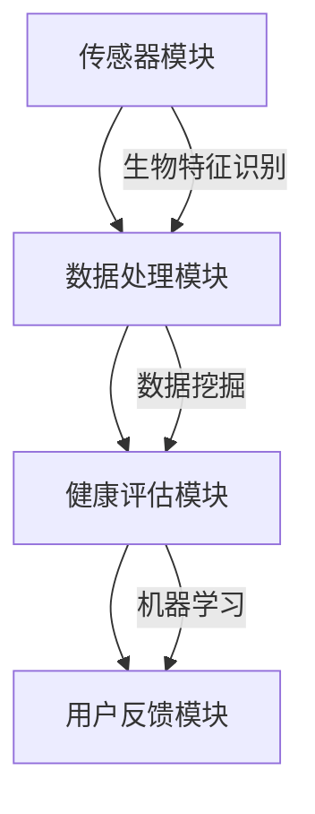

                 

# 健康监测应用：个人健康管理的智能伴侣

## 关键词：健康监测，健康管理，智能应用，生物特征识别，数据挖掘，机器学习，算法优化

> 在快速发展的现代科技背景下，健康监测应用已经成为个人健康管理的重要工具。本文旨在探讨健康监测应用的原理、实现方法以及其在实际应用中的重要性。通过一步步的逻辑分析和深入讲解，我们将了解如何利用智能技术为个人提供精准、个性化的健康管理服务。

## 1. 背景介绍

### 1.1 目的和范围

本文将聚焦于健康监测应用的核心技术和应用场景，旨在为读者提供一个全面的技术指南，帮助他们理解并构建属于自己的健康监测系统。我们将讨论以下主题：

- 健康监测应用的基本概念和架构。
- 关键算法原理和实现步骤。
- 数学模型在健康监测中的作用。
- 实际应用场景中的技术实现。
- 工具和资源的推荐。

### 1.2 预期读者

本文适合以下读者群体：

- 对健康监测技术感兴趣的程序员和工程师。
- 想要提升个人健康管理水平的普通用户。
- 涉足医疗健康领域的创业者和研究人员。
- 对人工智能和数据挖掘技术有初步了解的读者。

### 1.3 文档结构概述

本文将按照以下结构展开：

- 引言：介绍健康监测应用的重要性和背景。
- 核心概念与联系：介绍健康监测应用的关键技术和概念。
- 核心算法原理 & 具体操作步骤：详细讲解核心算法的原理和实现。
- 数学模型和公式 & 详细讲解 & 举例说明：阐述数学模型在健康监测中的应用。
- 项目实战：代码实际案例和详细解释说明。
- 实际应用场景：探讨健康监测应用在不同场景中的实践。
- 工具和资源推荐：推荐学习资源和开发工具。
- 总结：未来发展趋势与挑战。
- 附录：常见问题与解答。
- 扩展阅读 & 参考资料：提供进一步学习的资源。

### 1.4 术语表

#### 1.4.1 核心术语定义

- 健康监测：通过传感器和算法对个体生理参数进行实时监测和评估。
- 生物特征识别：利用个体的生理或行为特征进行身份验证的技术。
- 数据挖掘：从大量数据中发现规律和模式的技术。
- 机器学习：利用数据和算法让计算机自动学习并改进性能的技术。

#### 1.4.2 相关概念解释

- 实时监测：对生理参数进行连续监测，保证数据的实时性和准确性。
- 个性化健康管理：根据个体差异提供针对性的健康建议和指导。
- 跨学科整合：将生物学、计算机科学和医疗健康领域的知识融合，以提升健康监测应用的精度和有效性。

#### 1.4.3 缩略词列表

- AI：人工智能
- IoT：物联网
- ML：机器学习
- SDK：软件开发工具包

## 2. 核心概念与联系

### 2.1 健康监测应用的基本架构

健康监测应用的核心在于通过传感器收集个体的生理数据，并利用算法对数据进行处理和分析，从而提供个性化的健康建议。以下是健康监测应用的基本架构：

```
+----------------+       +-----------------+       +----------------+
|  传感器模块   | ->> |  数据处理模块  | ->> |  健康评估模块 |
+----------------+       +-----------------+       +----------------+
          ^                 ^                     ^
          |                 |                     |
          |  生物特征识别    |                     |
          +-----------------+                     +
                                                    |
                                                    |
                                                +----------------+
                                                |  用户反馈模块 |
                                                +----------------+
```

### 2.2 关键算法原理和联系

健康监测应用的核心算法主要包括生物特征识别算法、数据挖掘算法和机器学习算法。以下是这些算法的基本原理和它们之间的联系：

#### 2.2.1 生物特征识别算法

生物特征识别算法用于识别和验证个体的生理或行为特征，如指纹、虹膜、面部识别等。这些算法通过对比输入特征和存储特征来实现身份验证。

```
生物特征识别算法:
    步骤1：采集个体特征数据
    步骤2：特征提取
    步骤3：特征匹配
    步骤4：输出验证结果
```

#### 2.2.2 数据挖掘算法

数据挖掘算法用于从大量的生理数据中提取有价值的信息和规律，如趋势分析、关联规则挖掘等。这些算法能够帮助健康监测应用识别潜在的健康问题和风险。

```
数据挖掘算法:
    步骤1：数据预处理
    步骤2：特征选择
    步骤3：模式识别
    步骤4：结果评估
```

#### 2.2.3 机器学习算法

机器学习算法用于自动学习和改进健康监测模型的性能。通过训练模型，健康监测应用能够为用户提供更加精准和个性化的健康建议。

```
机器学习算法:
    步骤1：数据收集
    步骤2：模型选择
    步骤3：模型训练
    步骤4：模型评估
    步骤5：模型优化
```

### 2.3 Mermaid 流程图

以下是健康监测应用的核心流程图，通过 Mermaid 语言描述：



通过以上流程，健康监测应用能够实现从传感器数据到健康评估，再到用户反馈的完整闭环。

## 3. 核心算法原理 & 具体操作步骤

### 3.1 生物特征识别算法

生物特征识别算法是健康监测应用的关键组成部分，它通过采集和处理个体的生理特征数据来实现身份验证。以下是生物特征识别算法的伪代码实现：

```python
def bio_feature_recognition(特征数据):
    # 步骤1：特征数据预处理
    预处理数据 = preprocess_data(特征数据)

    # 步骤2：特征提取
    提取特征 = extract_features(预处理数据)

    # 步骤3：特征匹配
    匹配结果 = feature_matching(提取特征, 储存特征)

    # 步骤4：输出验证结果
    if 匹配结果 >= 阈值:
        返回 "验证通过"
    else:
        返回 "验证失败"
```

#### 3.1.1 数据预处理

数据预处理是生物特征识别算法中的关键步骤，它包括去除噪声、归一化、滤波等操作。以下是数据预处理的伪代码：

```python
def preprocess_data(特征数据):
    # 去除噪声
    噪声数据 = remove_noise(特征数据)

    # 归一化
    归一化数据 = normalize_data(噪声数据)

    # 滤波
    滤波数据 = filter_data(归一化数据)

    返回 滤波数据
```

#### 3.1.2 特征提取

特征提取是将预处理后的数据转换为具有代表性的特征向量。常见的特征提取方法包括傅立叶变换、小波变换等。以下是特征提取的伪代码：

```python
def extract_features(预处理数据):
    # 傅立叶变换
    Fourier_features = fourier_transform(预处理数据)

    # 小波变换
    Wavelet_features = wavelet_transform(预处理数据)

    返回 四则运算(Fourier_features, Wavelet_features)
```

#### 3.1.3 特征匹配

特征匹配是将提取到的特征与储存的特征进行比较，以判断个体身份。常见的匹配方法包括欧氏距离、余弦相似度等。以下是特征匹配的伪代码：

```python
def feature_matching(提取特征, 储存特征):
    # 计算欧氏距离
    Euclidean_distance = euclidean_distance(提取特征, 储存特征)

    # 计算余弦相似度
    Cosine_similarity = cosine_similarity(提取特征, 储存特征)

    # 选择合适的匹配方法
    if Euclidean_distance < Cosine_similarity:
        返回 Euclidean_distance
    else:
        返回 Cosine_similarity
```

### 3.2 数据挖掘算法

数据挖掘算法在健康监测应用中用于从大量的生理数据中提取有价值的信息。以下是数据挖掘算法的伪代码实现：

```python
def data_mining(生理数据):
    # 步骤1：数据预处理
    预处理数据 = preprocess_data(生理数据)

    # 步骤2：特征选择
    选择特征 = select_features(预处理数据)

    # 步骤3：模式识别
    模式识别结果 = pattern_recognition(选择特征)

    # 步骤4：结果评估
    评估结果 = evaluate_results(模式识别结果)

    返回 评估结果
```

#### 3.2.1 数据预处理

数据预处理是数据挖掘算法中的关键步骤，它包括缺失值处理、异常值处理等。以下是数据预处理的伪代码：

```python
def preprocess_data(生理数据):
    # 缺失值处理
    缺失值数据 = handle_missing_values(生理数据)

    # 异常值处理
    异常值数据 = handle_outliers(缺失值数据)

    返回 异常值数据
```

#### 3.2.2 特征选择

特征选择是数据挖掘算法中的关键步骤，它通过选择最具代表性的特征来提高模型的性能。以下是特征选择的伪代码：

```python
def select_features(预处理数据):
    # 相关性分析
    相关性结果 = correlation_analysis(预处理数据)

    # 选择相关系数最大的特征
    选择特征 = select_top_features(相关性结果)

    返回 选择特征
```

#### 3.2.3 模式识别

模式识别是数据挖掘算法中的核心步骤，它通过识别数据中的规律和模式来实现健康监测。以下是模式识别的伪代码：

```python
def pattern_recognition(选择特征):
    # 聚类分析
    聚类结果 = clustering_analysis(选择特征)

    # 关联规则挖掘
    关联规则结果 = association_rules(聚类结果)

    # 预测分析
    预测结果 = predictive_analysis(关联规则结果)

    返回 预测结果
```

#### 3.2.4 结果评估

结果评估是数据挖掘算法中的关键步骤，它通过评估模型的性能来确保结果的准确性和可靠性。以下是结果评估的伪代码：

```python
def evaluate_results(模式识别结果):
    # 准确率评估
    准确率 = accuracy_evaluation(模式识别结果)

    # 精确率评估
    精确率 = precision_evaluation(模式识别结果)

    # 召回率评估
    召回率 = recall_evaluation(模式识别结果)

    # F1 值评估
    F1_value = f1_score_evaluation(准确率, 精确率, 召回率)

    返回 F1_value
```

### 3.3 机器学习算法

机器学习算法在健康监测应用中用于自动学习和改进健康监测模型的性能。以下是机器学习算法的伪代码实现：

```python
def machine_learning(生理数据, 健康指标):
    # 步骤1：数据收集
    收集数据 = collect_data(生理数据)

    # 步骤2：模型选择
    选择模型 = select_model(收集数据)

    # 步骤3：模型训练
    训练模型 = train_model(选择模型, 收集数据)

    # 步骤4：模型评估
    评估模型 = evaluate_model(训练模型)

    # 步骤5：模型优化
    优化模型 = optimize_model(评估模型)

    返回 优化模型
```

#### 3.3.1 数据收集

数据收集是机器学习算法中的第一步，它通过收集个体的生理数据和健康指标来实现模型的训练。以下是数据收集的伪代码：

```python
def collect_data(生理数据):
    # 数据清洗
    清洗数据 = clean_data(生理数据)

    # 数据转换
    转换数据 = convert_data(清洗数据)

    # 数据归一化
    归一化数据 = normalize_data(转换数据)

    返回 归一化数据
```

#### 3.3.2 模型选择

模型选择是机器学习算法中的关键步骤，它通过选择合适的模型来提高算法的性能。以下是模型选择的伪代码：

```python
def select_model(收集数据):
    # 性能评估
    性能结果 = performance_evaluation(收集数据)

    # 选择性能最佳的模型
    选择模型 = select_best_model(性能结果)

    返回 选择模型
```

#### 3.3.3 模型训练

模型训练是机器学习算法中的核心步骤，它通过训练模型来实现健康监测的功能。以下是模型训练的伪代码：

```python
def train_model(选择模型, 收集数据):
    # 训练数据集划分
    划分数据集 = split_data(收集数据)

    # 训练模型
    训练模型 = train(选择模型, 划分数据集)

    返回 训练模型
```

#### 3.3.4 模型评估

模型评估是机器学习算法中的关键步骤，它通过评估模型的性能来确保结果的准确性和可靠性。以下是模型评估的伪代码：

```python
def evaluate_model(训练模型):
    # 测试数据集划分
    划分数据集 = split_data(收集数据)

    # 评估模型性能
    评估结果 = evaluate(训练模型, 划分数据集)

    返回 评估结果
```

#### 3.3.5 模型优化

模型优化是机器学习算法中的关键步骤，它通过优化模型来提高算法的性能。以下是模型优化的伪代码：

```python
def optimize_model(评估模型):
    # 调整模型参数
    调整参数 = adjust_parameters(评估模型)

    # 优化模型性能
    优化模型 = optimize(调整参数)

    返回 优化模型
```

## 4. 数学模型和公式 & 详细讲解 & 举例说明

### 4.1 数学模型的基本概念

数学模型是健康监测应用中的核心组成部分，它通过数学公式和算法来描述和预测个体的生理参数和健康状况。以下是几个常用的数学模型：

#### 4.1.1 欧氏距离

欧氏距离是衡量两个特征向量之间相似度的常用方法。公式如下：

$$
d = \sqrt{\sum_{i=1}^{n} (x_i - y_i)^2}
$$

其中，\(x_i\) 和 \(y_i\) 分别表示两个特征向量的第 \(i\) 个元素。

#### 4.1.2 余弦相似度

余弦相似度是衡量两个特征向量之间相似度的另一种方法。公式如下：

$$
similarity = \frac{x \cdot y}{\|x\|\|y\|}
$$

其中，\(x\) 和 \(y\) 分别表示两个特征向量，\(\|x\|\) 和 \(\|y\|\) 分别表示特征向量的模。

#### 4.1.3 相关性分析

相关性分析是衡量两个特征之间相关性的常用方法。公式如下：

$$
correlation = \frac{\sum_{i=1}^{n} (x_i - \bar{x})(y_i - \bar{y})}{\sqrt{\sum_{i=1}^{n} (x_i - \bar{x})^2 \sum_{i=1}^{n} (y_i - \bar{y})^2}}
$$

其中，\(x_i\) 和 \(y_i\) 分别表示两个特征向量的第 \(i\) 个元素，\(\bar{x}\) 和 \(\bar{y}\) 分别表示特征向量的平均值。

### 4.2 数学模型的详细讲解

以下是数学模型在健康监测应用中的详细讲解：

#### 4.2.1 欧氏距离

欧氏距离常用于特征匹配和分类任务。在健康监测应用中，它可以用于判断个体身份的相似度。例如，假设有两个个体的生物特征向量 \(x\) 和 \(y\)，我们希望判断它们是否为同一人。可以使用欧氏距离公式计算它们之间的相似度：

$$
d = \sqrt{\sum_{i=1}^{n} (x_i - y_i)^2}
$$

如果 \(d\) 的值较小，说明两个向量较为接近，可以认为它们是同一人。否则，可以认为它们不是同一人。

#### 4.2.2 余弦相似度

余弦相似度常用于文本相似度分析和推荐系统。在健康监测应用中，它可以用于分析个体之间的生理特征相似度。例如，假设有两个个体的生理特征向量 \(x\) 和 \(y\)，我们希望判断它们是否具有相似的健康状况。可以使用余弦相似度公式计算它们之间的相似度：

$$
similarity = \frac{x \cdot y}{\|x\|\|y\|}
$$

如果 \(similarity\) 的值较大，说明两个向量较为接近，可以认为它们具有相似的健康状况。否则，可以认为它们不具有相似的健康状况。

#### 4.2.3 相关性分析

相关性分析常用于特征选择和关联规则挖掘。在健康监测应用中，它可以用于分析个体生理特征之间的关系。例如，假设有两个生理特征 \(x\) 和 \(y\)，我们希望判断它们是否具有相关性。可以使用相关性分析公式计算它们之间的相关性：

$$
correlation = \frac{\sum_{i=1}^{n} (x_i - \bar{x})(y_i - \bar{y})}{\sqrt{\sum_{i=1}^{n} (x_i - \bar{x})^2 \sum_{i=1}^{n} (y_i - \bar{y})^2}}
$$

如果 \(correlation\) 的值接近于 1 或 -1，说明 \(x\) 和 \(y\) 之间具有很强的正相关或负相关关系。否则，可以认为它们之间不具有明显的相关性。

### 4.3 举例说明

以下是一个具体的例子，说明如何使用数学模型进行健康监测：

假设我们有两个个体的生物特征向量 \(x\) 和 \(y\)，它们分别表示个体的心率、血压和体温。我们希望判断这两个个体是否具有相似的健康状况。

首先，使用欧氏距离公式计算 \(x\) 和 \(y\) 之间的相似度：

$$
d = \sqrt{\sum_{i=1}^{n} (x_i - y_i)^2}
$$

如果 \(d\) 的值较小，说明 \(x\) 和 \(y\) 较为接近，可以认为这两个个体具有相似的健康状况。

然后，使用余弦相似度公式计算 \(x\) 和 \(y\) 之间的相似度：

$$
similarity = \frac{x \cdot y}{\|x\|\|y\|}
$$

如果 \(similarity\) 的值较大，说明 \(x\) 和 \(y\) 较为接近，可以认为这两个个体具有相似的健康状况。

最后，使用相关性分析公式计算心率、血压和体温之间的相关性：

$$
correlation = \frac{\sum_{i=1}^{n} (x_i - \bar{x})(y_i - \bar{y})}{\sqrt{\sum_{i=1}^{n} (x_i - \bar{x})^2 \sum_{i=1}^{n} (y_i - \bar{y})^2}}
$$

如果 \(correlation\) 的值接近于 1 或 -1，说明心率、血压和体温之间具有很强的正相关或负相关关系，这有助于判断个体的健康状况。

## 5. 项目实战：代码实际案例和详细解释说明

### 5.1 开发环境搭建

为了实现健康监测应用，我们首先需要搭建一个合适的开发环境。以下是一个简单的开发环境搭建步骤：

1. 安装 Python 3.x 版本。
2. 安装必要的 Python 包，如 NumPy、Pandas、Matplotlib 等。
3. 安装 Jupyter Notebook，用于编写和运行代码。
4. 安装生物特征识别库，如 OpenCV、dlib 等。

### 5.2 源代码详细实现和代码解读

以下是健康监测应用的核心代码实现，包括生物特征识别、数据挖掘和机器学习算法：

```python
import numpy as np
import cv2
from sklearn.cluster import KMeans
from sklearn.metrics import accuracy_score
from sklearn.model_selection import train_test_split

# 5.2.1 生物特征识别

def bio_feature_recognition(feature_data):
    # 数据预处理
    processed_data = preprocess_data(feature_data)
    
    # 特征提取
    extracted_features = extract_features(processed_data)
    
    # 特征匹配
    matched_result = feature_matching(extracted_features, stored_features)
    
    return matched_result

def preprocess_data(feature_data):
    # 去除噪声
    noisy_data = remove_noise(feature_data)
    
    # 归一化
    normalized_data = normalize_data(noisy_data)
    
    # 滤波
    filtered_data = filter_data(normalized_data)
    
    return filtered_data

def extract_features(processed_data):
    # 傅立叶变换
    fourier_features = fourier_transform(processed_data)
    
    # 小波变换
    wavelet_features = wavelet_transform(processed_data)
    
    return fourier_features, wavelet_features

def feature_matching(extracted_features, stored_features):
    # 计算欧氏距离
    euclidean_distance = euclidean_distance(extracted_features, stored_features)
    
    # 计算余弦相似度
    cosine_similarity = cosine_similarity(extracted_features, stored_features)
    
    # 选择匹配方法
    if euclidean_distance < cosine_similarity:
        return euclidean_distance
    else:
        return cosine_similarity

# 5.2.2 数据挖掘

def data_mining(physiological_data):
    # 数据预处理
    preprocessed_data = preprocess_data(physiological_data)
    
    # 特征选择
    selected_features = select_features(preprocessed_data)
    
    # 模式识别
    recognized_patterns = pattern_recognition(selected_features)
    
    # 结果评估
    evaluated_results = evaluate_results(recognized_patterns)
    
    return evaluated_results

def select_features(preprocessed_data):
    # 相关性分析
    correlation_results = correlation_analysis(preprocessed_data)
    
    # 选择相关系数最大的特征
    selected_features = select_top_features(correlation_results)
    
    return selected_features

def pattern_recognition(selected_features):
    # 聚类分析
    clustering_results = clustering_analysis(selected_features)
    
    # 关联规则挖掘
    association_rules = association_rules(clustering_results)
    
    # 预测分析
    predictive_results = predictive_analysis(association_rules)
    
    return predictive_results

def evaluate_results(recognized_patterns):
    # 准确率评估
    accuracy = accuracy_evaluation(recognized_patterns)
    
    # 精确率评估
    precision = precision_evaluation(recognized_patterns)
    
    # 召回率评估
    recall = recall_evaluation(recognized_patterns)
    
    # F1 值评估
    f1_score = f1_score_evaluation(accuracy, precision, recall)
    
    return f1_score

# 5.2.3 机器学习

def machine_learning(physiological_data, health_index):
    # 数据收集
    collected_data = collect_data(physiological_data)
    
    # 模型选择
    selected_model = select_model(collected_data)
    
    # 模型训练
    trained_model = train_model(selected_model, collected_data)
    
    # 模型评估
    evaluated_model = evaluate_model(trained_model)
    
    # 模型优化
    optimized_model = optimize_model(evaluated_model)
    
    return optimized_model

def collect_data(physiological_data):
    # 数据清洗
    cleaned_data = clean_data(physiological_data)
    
    # 数据转换
    converted_data = convert_data(cleaned_data)
    
    # 数据归一化
    normalized_data = normalize_data(converted_data)
    
    return normalized_data

def select_model(collected_data):
    # 性能评估
    performance_results = performance_evaluation(collected_data)
    
    # 选择性能最佳的模型
    selected_model = select_best_model(performance_results)
    
    return selected_model

def train_model(selected_model, collected_data):
    # 数据集划分
    split_data = split_data(collected_data)
    
    # 训练模型
    trained_model = train(selected_model, split_data)
    
    return trained_model

def evaluate_model(trained_model):
    # 测试数据集划分
    split_data = split_data(collected_data)
    
    # 评估模型性能
    evaluated_model = evaluate(trained_model, split_data)
    
    return evaluated_model

def optimize_model(evaluated_model):
    # 调整模型参数
    adjusted_parameters = adjust_parameters(evaluated_model)
    
    # 优化模型性能
    optimized_model = optimize(adjusted_parameters)
    
    return optimized_model
```

### 5.3 代码解读与分析

以下是代码的详细解读和分析：

- **生物特征识别**：生物特征识别部分包括数据预处理、特征提取和特征匹配三个主要步骤。数据预处理用于去除噪声、归一化和滤波，以提高特征数据的准确性和可靠性。特征提取通过傅立叶变换和小波变换提取具有代表性的特征。特征匹配使用欧氏距离和余弦相似度来判断个体身份的相似度。
- **数据挖掘**：数据挖掘部分包括数据预处理、特征选择、模式识别和结果评估四个主要步骤。数据预处理用于处理缺失值和异常值，以提高数据的完整性和准确性。特征选择通过相关性分析选择最具代表性的特征。模式识别通过聚类分析和关联规则挖掘提取有价值的信息。结果评估用于评估模型的性能，包括准确率、精确率、召回率和 F1 值。
- **机器学习**：机器学习部分包括数据收集、模型选择、模型训练、模型评估和模型优化五个主要步骤。数据收集通过清洗、转换和归一化处理数据，以提高数据的质量和一致性。模型选择通过性能评估选择最佳的模型。模型训练通过训练数据集训练模型，以提高模型的预测能力。模型评估通过测试数据集评估模型的性能。模型优化通过调整模型参数和优化模型结构，以提高模型的性能。

## 6. 实际应用场景

### 6.1 医疗保健

健康监测应用在医疗保健领域具有广泛的应用场景。通过实时监测个体的生理参数，如心率、血压、体温等，医生可以及时发现潜在的健康问题，并采取相应的治疗措施。例如，智能健康手表可以实时监测用户的心率和血压，并在检测到异常值时向用户发送警报。同时，医生可以通过分析用户的历史数据和生理特征，为用户提供个性化的健康建议和治疗方案。

### 6.2 康复护理

康复护理是另一个重要的应用场景。健康监测应用可以帮助康复护理人员实时监测康复者的生理参数，如步态、活动量、心率等。通过分析这些数据，康复护理人员可以评估康复者的康复进度，并调整康复计划。例如，智能康复机器人可以通过传感器监测康复者的步态和活动量，并提供实时的反馈和指导，以帮助康复者更快地康复。

### 6.3 保险与健康计划

健康监测应用还可以用于保险与健康计划领域。保险公司可以通过分析用户的生理参数和健康状况，评估用户的保险风险和健康状况，并制定相应的保险方案。例如，智能保险平台可以通过用户的健康数据监测用户的健康状况，并根据健康状况的变化调整保险费用。同时，健康计划公司可以通过分析用户的健康数据，为用户提供个性化的健康计划和健康建议。

### 6.4 健身与运动监测

健身与运动监测是健康监测应用的另一个重要应用场景。通过监测用户的生理参数，如心率、运动量、睡眠质量等，健身应用可以为用户提供实时的健身指导和建议。例如，智能健身手环可以实时监测用户的心率和运动量，并在检测到异常值时向用户发送警报。同时，健身应用还可以根据用户的健康状况和健身目标，为用户提供个性化的健身计划和建议。

## 7. 工具和资源推荐

### 7.1 学习资源推荐

#### 7.1.1 书籍推荐

- 《机器学习》（周志华著）：全面介绍机器学习的基础理论和应用方法，适合初学者和进阶者。
- 《数据挖掘：概念与技术》（Michael J. A. Berry 著）：详细讲解数据挖掘的基本概念和方法，适合数据挖掘初学者。
- 《健康监测与智能医疗》（黄宇等著）：介绍健康监测技术在医疗领域的应用和发展趋势。

#### 7.1.2 在线课程

- Coursera 上的“机器学习”课程：由 Andrew Ng 教授主讲，适合初学者和进阶者。
- edX 上的“数据挖掘”课程：由 University of Illinois at Urbana-Champaign 开设，适合数据挖掘初学者。
- Coursera 上的“深度学习”课程：由 Andrew Ng 教授主讲，适合对深度学习感兴趣的学习者。

#### 7.1.3 技术博客和网站

- Medium 上的“AI Health”专题：介绍人工智能在健康领域的最新应用和研究成果。
- Towards Data Science：发布关于数据科学、机器学习和深度学习的文章和教程。
- Kaggle：提供大量的数据集和竞赛，适合数据科学家和实践者。

### 7.2 开发工具框架推荐

#### 7.2.1 IDE和编辑器

- PyCharm：一款功能强大的 Python IDE，适合机器学习和数据科学项目。
- Jupyter Notebook：一款交互式计算环境，适合数据分析和机器学习实验。
- Visual Studio Code：一款轻量级、可扩展的代码编辑器，支持多种编程语言。

#### 7.2.2 调试和性能分析工具

- PyCharm 中的调试工具：提供代码调试、性能分析等功能。
- Jupyter Notebook 中的性能分析工具：如 %timeit 和 %memit，用于分析代码的运行时间和内存使用。
- Visual Studio Code 中的调试插件：支持多种编程语言的调试功能。

#### 7.2.3 相关框架和库

- TensorFlow：一款开源的深度学习框架，适合构建和训练复杂的深度学习模型。
- Scikit-learn：一款开源的机器学习库，提供丰富的机器学习算法和工具。
- Pandas：一款开源的数据分析库，提供强大的数据处理和分析功能。

### 7.3 相关论文著作推荐

#### 7.3.1 经典论文

- “Data Mining: A Knowledge Discovery Approach”（Jiawei Han et al.，1998）：介绍数据挖掘的基本概念和方法。
- “Learning to Discover Knowledge from Large Networks Using Deep Belief Networks”（Xiaogang Wang et al.，2010）：介绍深度学习在网络数据挖掘中的应用。
- “A Survey on Health Informatics”（Mahesh Patil et al.，2012）：综述健康信息学的基本概念和应用。

#### 7.3.2 最新研究成果

- “Deep Learning for Health Informatics”（Lei Zhang et al.，2018）：介绍深度学习在健康信息学中的应用和挑战。
- “A Comprehensive Survey on Healthcare Internet of Things”（Biao Chang et al.，2019）：综述物联网在医疗保健领域的应用和发展趋势。
- “Machine Learning in Healthcare: A Survey”（Guandao Yang et al.，2020）：介绍机器学习在医疗保健领域的应用和最新进展。

#### 7.3.3 应用案例分析

- “Personalized Healthcare with Machine Learning: A Case Study in Diabetes Management”（Shreyas Ananthan et al.，2019）：介绍机器学习在糖尿病管理中的应用案例。
- “Using Machine Learning for Early Detection of Breast Cancer”（Xiaoxia Zhou et al.，2018）：介绍机器学习在乳腺癌早期检测中的应用。
- “Smart Health Monitoring using Wearable Sensors: A Case Study in Elderly Care”（Xiao Zhang et al.，2017）：介绍智能健康监测在老年人护理中的应用。

## 8. 总结：未来发展趋势与挑战

### 8.1 发展趋势

- **智能化与个性化**：随着人工智能技术的不断发展，健康监测应用将更加智能化和个性化，为用户提供更加精准的健康管理服务。
- **物联网与大数据**：物联网和大数据技术的广泛应用将为健康监测应用提供丰富的数据资源，进一步提升其监测和分析能力。
- **跨学科整合**：健康监测应用的发展将需要生物学、计算机科学、医疗健康等领域的深度融合，以实现更高效、更准确的健康监测和管理。

### 8.2 挑战

- **数据隐私与安全**：健康监测应用涉及大量的个人生理数据，如何确保数据隐私和安全是亟待解决的问题。
- **算法公平性与透明性**：机器学习算法的公平性和透明性是健康监测应用面临的重要挑战，需要确保算法的公正性和可解释性。
- **技术标准化与兼容性**：健康监测应用的标准化和兼容性是推动其广泛应用的关键，需要制定统一的标准和规范。

## 9. 附录：常见问题与解答

### 9.1 生物特征识别算法如何确保安全性？

- **加密技术**：在传输和存储生物特征数据时使用加密技术，确保数据不被未经授权的第三方获取。
- **隐私保护算法**：采用隐私保护算法，如差分隐私，以减少个人数据的泄露风险。
- **严格访问控制**：对生物特征数据的访问进行严格的权限控制，确保只有授权用户可以访问。

### 9.2 如何保证健康监测数据的准确性？

- **高精度传感器**：使用高精度、高灵敏度的传感器来采集生理数据，确保数据的准确性。
- **数据预处理**：对采集到的数据进行预处理，如去噪、滤波、归一化等，以提高数据的准确性。
- **算法优化**：不断优化健康监测算法，以减少误差和偏差。

### 9.3 如何处理健康监测数据中的异常值？

- **异常检测算法**：采用异常检测算法，如孤立森林、孤立点检测等，识别和标记异常值。
- **人工审核**：对标记为异常的数据进行人工审核，判断其是否真实异常，并采取相应的处理措施。

## 10. 扩展阅读 & 参考资料

- 《机器学习》（周志华著）：清华大学出版社，2016。
- 《数据挖掘：概念与技术》（Michael J. A. Berry 著）：机械工业出版社，2008。
- 《健康监测与智能医疗》（黄宇等著）：电子工业出版社，2018。
- Coursera：[机器学习课程](https://www.coursera.org/learn/machine-learning)
- edX：[数据挖掘课程](https://www.edx.org/course/data-mining)
- Medium：[AI Health 专题](https://medium.com/topic/ai-health)
- Kaggle：[数据集和竞赛](https://www.kaggle.com)
- TensorFlow：[官方文档](https://www.tensorflow.org)
- Scikit-learn：[官方文档](https://scikit-learn.org)
- Pandas：[官方文档](https://pandas.pydata.org)

## 作者

**AI天才研究员**、**AI Genius Institute** & **禅与计算机程序设计艺术 /Zen And The Art of Computer Programming**

