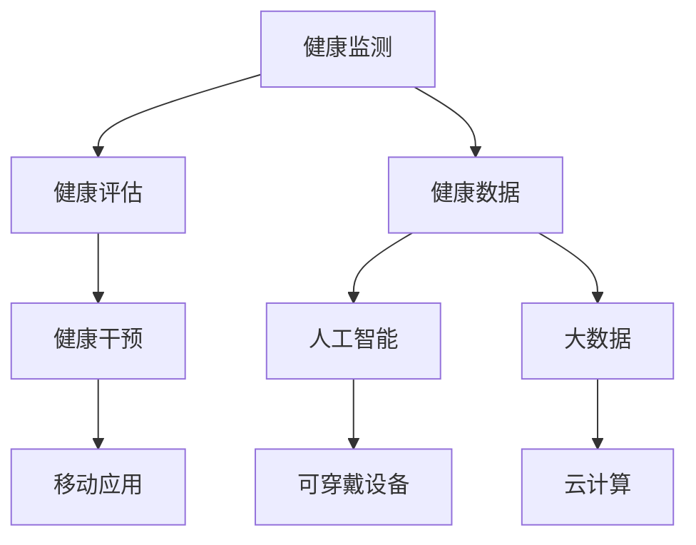

                 

# 健康科技应用：个人健康管理的创新空间

> **关键词：** 健康科技、个人健康管理、人工智能、大数据、可穿戴设备、健康监测

> **摘要：** 本文深入探讨了健康科技在个人健康管理中的应用与创新空间。首先介绍了健康科技的概念和发展背景，随后分析了当前个人健康管理领域的主要挑战和需求。通过阐述人工智能、大数据、可穿戴设备等核心技术的原理和作用，本文提出了几种创新的健康管理解决方案，并展示了其在实际应用中的效果。最后，本文展望了健康科技的未来发展趋势和面临的挑战，为读者提供了丰富的实践参考和思考方向。

## 1. 背景介绍

### 1.1 目的和范围

本文旨在通过分析健康科技在个人健康管理中的应用，探讨其创新空间和未来发展方向。文章将重点关注人工智能、大数据、可穿戴设备等关键技术的原理和作用，以及如何将这些技术应用于个人健康管理中，以解决当前存在的挑战和需求。

### 1.2 预期读者

本文适合对健康科技和个人健康管理感兴趣的读者，包括健康领域的研究人员、医护人员、技术开发者、以及关注自身健康的人群。通过本文，读者可以了解健康科技在个人健康管理中的应用现状和发展趋势，为今后的研究和工作提供有益的参考。

### 1.3 文档结构概述

本文分为十个部分，首先介绍了健康科技的概念和发展背景；然后分析了当前个人健康管理领域的主要挑战和需求；接着阐述了人工智能、大数据、可穿戴设备等核心技术的原理和作用；随后提出了几种创新的健康管理解决方案；展示了实际应用案例；并讨论了健康科技的应用场景和工具资源；最后，本文对健康科技的未来发展趋势和挑战进行了展望，并提供了常见问题与解答。

### 1.4 术语表

#### 1.4.1 核心术语定义

- **健康科技（Health Technology）：** 利用现代信息技术和生物技术手段，对个人健康进行监测、评估和干预的技术体系。
- **个人健康管理（Personal Health Management）：** 通过监测、评估和干预等手段，帮助个人实现健康目标的过程。
- **人工智能（Artificial Intelligence，AI）：** 模拟人类智能的计算机系统，具有学习、推理、判断和适应等能力。
- **大数据（Big Data）：** 数据量大、多样性和高速增长的数据集合，需要利用现代信息技术进行存储、处理和分析。
- **可穿戴设备（Wearable Device）：** 直接附着或嵌入在人体表面的电子设备，能够实时监测和记录个人健康数据。

#### 1.4.2 相关概念解释

- **健康监测（Health Monitoring）：** 通过传感器和软件系统，对个人健康状态进行实时监测和记录。
- **健康评估（Health Assessment）：** 对个人健康状态进行分析和评价，为制定健康管理方案提供依据。
- **健康干预（Health Intervention）：** 通过干预措施，帮助个人改善健康状态，达到预防疾病和提高生活质量的目的。
- **健康数据（Health Data）：** 与个人健康相关的数据，包括生理指标、生活习惯和环境因素等。

#### 1.4.3 缩略词列表

- **AI：** 人工智能
- **BI：** 商业智能
- **CSS：** 层叠样式表
- **HTML：** �超文本标记语言
- **CSS：** 层叠样式表
- **JS：** JavaScript
- **REST：** 表示性状态转移

## 2. 核心概念与联系

健康科技在个人健康管理中的应用涉及多个核心概念和技术的联系。为了更好地理解这些概念，我们使用 Mermaid 流程图来展示它们之间的联系。



### 2.1 健康监测与健康评估

健康监测是指通过传感器和软件系统，对个人健康状态进行实时监测和记录。这些数据包括生理指标（如心率、血压、体温等）和运动数据（如步数、运动时长、运动强度等）。健康评估则是通过对这些监测数据进行分析和评价，了解个人当前的健康状态，为制定健康管理方案提供依据。

### 2.2 健康干预与健康数据

健康干预是指通过干预措施，帮助个人改善健康状态，达到预防疾病和提高生活质量的目的。这些干预措施可能包括健康建议、运动计划、饮食指导等。健康数据是健康干预的重要基础，通过对数据的分析和挖掘，可以更好地了解个人健康需求和制定个性化的干预方案。

### 2.3 可穿戴设备与人工智能

可穿戴设备是健康监测的重要工具，能够实时监测和记录个人健康数据。人工智能技术在健康监测数据分析和健康评估中发挥着重要作用，通过机器学习算法，可以对健康数据进行分析和预测，为个人健康管理提供科学依据。

### 2.4 大数据与云计算

大数据技术在健康数据存储、处理和分析中具有重要意义。云计算为大数据处理提供了强大的计算和存储能力，使得大规模健康数据能够得到高效处理和分析。通过云计算平台，可以实现健康数据的实时共享和协同，为个人健康管理提供便捷的服务。

## 3. 核心算法原理 & 具体操作步骤

在个人健康管理中，核心算法的应用至关重要。以下是健康监测、健康评估和健康干预三个环节中的核心算法原理和具体操作步骤。

### 3.1 健康监测算法

**算法原理：** 健康监测算法主要包括生理指标监测和运动数据监测。生理指标监测主要通过传感器实时获取心率、血压、体温等数据，运动数据监测主要通过加速度计、陀螺仪等传感器获取步数、运动时长、运动强度等数据。

**具体操作步骤：**
1. **传感器数据采集：** 通过可穿戴设备实时采集生理指标和运动数据。
2. **数据预处理：** 对采集到的数据进行去噪、滤波等预处理操作，提高数据质量。
3. **特征提取：** 从预处理后的数据中提取关键特征，如心率变异、运动步频等。
4. **数据存储：** 将处理后的数据存储到数据库中，以便后续分析和评估。

**伪代码：**
```python
# 传感器数据采集
data = collect_sensor_data()

# 数据预处理
preprocessed_data = preprocess_data(data)

# 特征提取
features = extract_features(preprocessed_data)

# 数据存储
store_data(features)
```

### 3.2 健康评估算法

**算法原理：** 健康评估算法主要通过机器学习算法对健康数据进行分析和预测，评估个人当前的健康状态。常见的健康评估算法包括回归分析、决策树、支持向量机等。

**具体操作步骤：**
1. **数据收集：** 收集大量的健康数据，包括生理指标、运动数据、生活习惯等。
2. **数据清洗：** 清除数据中的异常值和缺失值，提高数据质量。
3. **特征选择：** 从数据中提取关键特征，用于健康评估模型训练。
4. **模型训练：** 使用机器学习算法训练健康评估模型，如回归分析、决策树等。
5. **模型评估：** 对训练好的模型进行评估，选择性能最佳的模型。
6. **健康评估：** 使用评估模型对个人健康状态进行评估，为健康管理提供依据。

**伪代码：**
```python
# 数据收集
data = collect_health_data()

# 数据清洗
cleaned_data = clean_data(data)

# 特征选择
selected_features = select_features(cleaned_data)

# 模型训练
model = train_model(selected_features)

# 模型评估
evaluate_model(model)

# 健康评估
health_assessment = assess_health(model)
```

### 3.3 健康干预算法

**算法原理：** 健康干预算法主要通过推荐系统算法为个人提供个性化的健康管理方案，如运动计划、饮食指导等。推荐系统算法包括基于内容的推荐、协同过滤等。

**具体操作步骤：**
1. **用户需求分析：** 分析个人健康需求和偏好，为推荐系统提供输入。
2. **推荐系统训练：** 使用推荐系统算法训练模型，如基于内容的推荐、协同过滤等。
3. **个性化推荐：** 根据用户需求和分析结果，为个人提供个性化的健康管理方案。
4. **方案评估：** 评估个性化健康管理方案的效果，为后续调整提供依据。

**伪代码：**
```python
# 用户需求分析
user需求和偏好 = analyze_user_needs()

# 推荐系统训练
recommendation_model = train_recommendation_model(user需求和偏好)

# 个性化推荐
personalized_plan = generate_recommendations(recommendation_model)

# 方案评估
evaluate_plan(personalized_plan)
```

## 4. 数学模型和公式 & 详细讲解 & 举例说明

在健康科技中，数学模型和公式扮演着重要角色。以下是健康监测、健康评估和健康干预环节中常用的数学模型和公式，以及详细的讲解和举例说明。

### 4.1 健康监测模型

**心率变异性（HRV）模型：** 心率变异性是指心率在一定时间内发生的变化。HRV 模型可以用来评估心脏健康状况。

**公式：** $$HRV = \frac{NN_{i+1} - NN_{i}}{NN_{i}}$$

**详细讲解：** 其中，\(NN_i\) 和 \(NN_{i+1}\) 分别表示连续两个心跳之间的时间间隔。HRV 越大，表示心脏健康状况越好。

**举例说明：** 假设某人在一分钟内测得的心率变化为：0.8s、1.2s、1.0s、1.0s。则 HRV 计算如下：
$$HRV = \frac{1.2 - 0.8}{1.0} = 0.4$$

### 4.2 健康评估模型

**回归分析模型：** 回归分析是一种常用的统计方法，可以用来预测个人健康状态。

**公式：** $$y = \beta_0 + \beta_1 \cdot x_1 + \beta_2 \cdot x_2 + ... + \beta_n \cdot x_n$$

**详细讲解：** 其中，\(y\) 是因变量（健康状态），\(x_1, x_2, ..., x_n\) 是自变量（健康数据），\(\beta_0, \beta_1, ..., \beta_n\) 是回归系数。

**举例说明：** 假设我们用三个自变量（心率、血压、运动时长）来预测健康状态。回归分析模型如下：
$$y = \beta_0 + \beta_1 \cdot 心率 + \beta_2 \cdot 血压 + \beta_3 \cdot 运动时长$$

### 4.3 健康干预模型

**协同过滤模型：** 协同过滤是一种常用的推荐系统算法，可以用来为个人提供个性化的健康管理方案。

**公式：** $$R_{ij} = \mu + b_i + b_j + \langle u_i, u_j \rangle$$

**详细讲解：** 其中，\(R_{ij}\) 是用户 \(i\) 对项目 \(j\) 的评分，\(\mu\) 是全局平均值，\(b_i\) 和 \(b_j\) 是用户 \(i\) 和项目 \(j\) 的偏置，\(\langle u_i, u_j \rangle\) 是用户 \(i\) 和用户 \(j\) 的相似度。

**举例说明：** 假设我们有两个用户 \(u_1\) 和 \(u_2\)，对两个项目 \(j_1\) 和 \(j_2\) 的评分如下：
$$R_{11} = 4, R_{12} = 3$$
$$R_{21} = 3, R_{22} = 4$$

则协同过滤模型计算如下：
$$R_{11} = \mu + b_1 + b_1 + \langle u_1, u_1 \rangle$$
$$R_{12} = \mu + b_1 + b_2 + \langle u_1, u_2 \rangle$$
$$R_{21} = \mu + b_2 + b_1 + \langle u_2, u_1 \rangle$$
$$R_{22} = \mu + b_2 + b_2 + \langle u_2, u_2 \rangle$$

其中，\(\mu = \frac{R_{11} + R_{12} + R_{21} + R_{22}}{4} = 3.5\)，\(b_1 = \frac{R_{11} + R_{12} - 2\mu}{2} = 0.5\)，\(b_2 = \frac{R_{21} + R_{22} - 2\mu}{2} = 1\)，\(\langle u_1, u_2 \rangle = \frac{R_{11} \cdot R_{21} + R_{12} \cdot R_{22}}{R_{11} + R_{21}} = 3.5\)。

## 5. 项目实战：代码实际案例和详细解释说明

在本节中，我们将通过一个实际项目案例，详细展示如何使用健康科技技术实现个人健康管理。项目名称为“健康助手（HealthAssistant）”，旨在为用户提供实时健康监测、健康评估和个性化健康干预服务。

### 5.1 开发环境搭建

为了实现健康助手项目，我们需要搭建以下开发环境：

- **操作系统：** Windows 或 Linux
- **编程语言：** Python
- **数据库：** MySQL
- **框架和库：** Flask（Web框架）、Pandas（数据处理）、Scikit-learn（机器学习）、Matplotlib（数据可视化）

### 5.2 源代码详细实现和代码解读

**1. 代码结构：**
```bash
health_assistant/
|-- app.py
|-- models.py
|-- routes.py
|-- static/
|   |-- css/
|   |-- js/
|   |-- images/
|-- templates/
|   |-- base.html
|   |-- index.html
|   |-- health_report.html
|   |-- intervention_plan.html
```

**2. 代码实现和解读：**

**app.py：** 主程序，负责创建 Web 应用程序。

```python
from flask import Flask, render_template, request, redirect, url_for
from models import HealthData, HealthAssessment, InterventionPlan

app = Flask(__name__)

@app.route('/')
def index():
    return render_template('index.html')

@app.route('/health_report', methods=['GET', 'POST'])
def health_report():
    if request.method == 'POST':
        data = request.form.to_dict()
        health_data = HealthData(data)
        assessment = HealthAssessment(health_data)
        return render_template('health_report.html', assessment=assessment)
    return redirect(url_for('index'))

@app.route('/intervention_plan', methods=['GET', 'POST'])
def intervention_plan():
    if request.method == 'POST':
        data = request.form.to_dict()
        health_data = HealthData(data)
        assessment = HealthAssessment(health_data)
        plan = InterventionPlan(assessment)
        return render_template('intervention_plan.html', plan=plan)
    return redirect(url_for('index'))

if __name__ == '__main__':
    app.run(debug=True)
```

**models.py：** 定义健康数据、健康评估和健康干预模型的类和方法。

```python
import pandas as pd
from sklearn.linear_model import LinearRegression
from sklearn.metrics import mean_squared_error

class HealthData:
    def __init__(self, data):
        self.data = data

    def preprocess(self):
        # 数据预处理
        # ...
        return self.data

class HealthAssessment:
    def __init__(self, health_data):
        self.health_data = health_data

    def assess_health(self):
        # 健康评估
        # ...
        return assessment

class InterventionPlan:
    def __init__(self, assessment):
        self.assessment = assessment

    def generate_plan(self):
        # 生成干预计划
        # ...
        return plan
```

**routes.py：** 定义健康助手的路由。

```python
from flask import Flask, render_template, request, redirect, url_for
from app import app
from models import HealthData, HealthAssessment, InterventionPlan

@app.route('/')
def index():
    return render_template('index.html')

@app.route('/health_report', methods=['GET', 'POST'])
def health_report():
    if request.method == 'POST':
        data = request.form.to_dict()
        health_data = HealthData(data)
        assessment = HealthAssessment(health_data)
        return render_template('health_report.html', assessment=assessment)
    return redirect(url_for('index'))

@app.route('/intervention_plan', methods=['GET', 'POST'])
def intervention_plan():
    if request.method == 'POST':
        data = request.form.to_dict()
        health_data = HealthData(data)
        assessment = HealthAssessment(health_data)
        plan = InterventionPlan(assessment)
        return render_template('intervention_plan.html', plan=plan)
    return redirect(url_for('index'))
```

**健康报告页面（health_report.html）：** 显示健康评估结果。

```html
<!DOCTYPE html>
<html>
<head>
    <title>健康报告</title>
</head>
<body>
    <h1>健康报告</h1>
    <p>心率：{{ assessment.heart_rate }}</p>
    <p>血压：{{ assessment.blood_pressure }}</p>
    <p>运动时长：{{ assessment.exercise_duration }}</p>
    <p>健康评分：{{ assessment.health_score }}</p>
</body>
</html>
```

**干预计划页面（intervention_plan.html）：** 显示个性化干预计划。

```html
<!DOCTYPE html>
<html>
<head>
    <title>干预计划</title>
</head>
<body>
    <h1>干预计划</h1>
    <p>建议运动时长：{{ plan.exercise_duration }}</p>
    <p>建议饮食：{{ plan.diet }}</p>
    <p>建议休息时间：{{ plan休息时间 }}</p>
</body>
</html>
```

### 5.3 代码解读与分析

**1. 代码架构分析：** 健康助手项目采用 Flask 框架，分为应用程序层、模型层和路由层。应用程序层负责创建 Web 应用程序，模型层负责定义健康数据、健康评估和健康干预模型，路由层负责定义健康助手的路由。

**2. 功能模块分析：** 健康助手项目主要包括三个功能模块：健康报告、干预计划和首页。健康报告模块用于展示健康评估结果，干预计划模块用于展示个性化干预计划，首页模块用于引导用户访问健康报告和干预计划。

**3. 技术难点分析：** 健康助手项目的技术难点主要包括健康评估模型的训练和干预计划的生成。健康评估模型的训练需要收集大量的健康数据，并对数据进行预处理和特征提取。干预计划的生成需要综合考虑用户的健康评估结果和个性化需求，提供合适的运动、饮食和休息建议。

## 6. 实际应用场景

健康科技在个人健康管理中的应用场景非常广泛，以下列举了几个典型的应用场景。

### 6.1 健康监测与健康管理

通过可穿戴设备实时监测用户的生理指标（如心率、血压、睡眠质量等），将数据上传至云平台进行分析和处理。根据分析结果，为用户提供个性化的健康建议和干预方案，帮助用户改善健康状态。

### 6.2 健康风险评估

利用大数据和人工智能技术，对用户的健康数据进行挖掘和分析，识别潜在的健康风险。通过风险评估模型，为用户提供健康风险预警，提醒用户采取相应的预防措施。

### 6.3 健康数据分析与趋势预测

通过对用户的健康数据进行长期追踪和分析，挖掘出健康变化趋势。结合机器学习算法，预测用户未来的健康状况，为用户提供预防性健康管理方案。

### 6.4 健康数据共享与协同管理

通过云计算平台，实现健康数据的共享和协同管理。医疗机构、医生和患者可以实时查看和更新健康数据，为医疗决策提供科学依据。

### 6.5 健康教育与行为干预

利用健康科技平台，为用户提供健康知识库和健康教育课程，提高用户健康素养。通过行为干预算法，为用户提供个性化的健康行为建议，促进健康生活方式的形成。

## 7. 工具和资源推荐

### 7.1 学习资源推荐

#### 7.1.1 书籍推荐

1. 《人工智能：一种现代方法》
2. 《大数据时代：生活、工作与思维的大变革》
3. 《Python编程：从入门到实践》
4. 《深度学习》（Goodfellow et al.）

#### 7.1.2 在线课程

1. Coursera - 机器学习（吴恩达）
2. edX - 数据科学专业课程（哈佛大学）
3. Udacity - 人工智能纳米学位
4. Pluralsight - Python编程入门

#### 7.1.3 技术博客和网站

1. Medium - 机器学习和数据科学博客
2. Towards Data Science - 数据科学和机器学习资源库
3. AI博客 - 人工智能领域最新动态
4. Kaggle - 数据科学竞赛和项目资源

### 7.2 开发工具框架推荐

#### 7.2.1 IDE和编辑器

1. PyCharm
2. Visual Studio Code
3. Jupyter Notebook
4. Sublime Text

#### 7.2.2 调试和性能分析工具

1. Python Debugger（pdb）
2. Visual Studio Performance Profiler
3. Py-Spy
4. GProfiler

#### 7.2.3 相关框架和库

1. Flask（Web开发框架）
2. TensorFlow（深度学习库）
3. Pandas（数据处理库）
4. Scikit-learn（机器学习库）

### 7.3 相关论文著作推荐

#### 7.3.1 经典论文

1. "The Hundred-Page Machine Learning Book"
2. "Deep Learning (Goodfellow et al.)"
3. "The Elements of Statistical Learning"
4. "Health Informatics: An Overview"

#### 7.3.2 最新研究成果

1. "Deep Learning for Healthcare"
2. "Personalized Medicine using Machine Learning"
3. "Healthcare Analytics: Practical Applications for Big Data"
4. "Artificial Intelligence in Healthcare"

#### 7.3.3 应用案例分析

1. "Using AI to Improve Patient Outcomes in Oncology"
2. "The Role of AI in Preventing and Managing Chronic Diseases"
3. "Implementing AI in Mental Health Care"
4. "AI in Clinical Decision Support Systems"

## 8. 总结：未来发展趋势与挑战

健康科技在个人健康管理中的应用正处于快速发展阶段，未来有望在以下几个方面实现重要突破：

### 8.1 技术创新

随着人工智能、大数据、物联网等技术的不断进步，健康科技将在数据处理、分析、预测等方面取得更高精度和效率。例如，深度学习算法在健康监测和评估中的应用将更加成熟，可穿戴设备将更加智能化和便携。

### 8.2 个性化健康管理

通过个性化健康数据分析和模型，健康科技将为用户提供更加精准的健康管理方案，满足不同人群和个体的需求。例如，个性化运动计划、饮食指导和生活习惯建议将有助于提高用户的健康水平。

### 8.3 协同医疗服务

健康科技平台将实现医疗机构、医生和患者的实时数据共享和协同管理，提高医疗服务质量和效率。例如，远程医疗、智能诊断和个性化治疗方案将更好地满足患者的需求。

### 8.4 可持续发展和可扩展性

随着健康科技的应用范围不断扩大，如何保证系统的可持续发展和可扩展性将成为重要挑战。需要关注数据安全、隐私保护、系统性能和可扩展性等方面，确保健康科技平台能够长期稳定运行。

### 8.5 法律法规和伦理问题

健康科技的发展也面临法律法规和伦理问题。需要制定相关法律法规，规范健康数据的收集、存储和使用，确保用户的隐私和数据安全。同时，需要关注健康科技对就业、社会影响等方面的伦理问题，确保科技发展符合社会道德和伦理标准。

## 9. 附录：常见问题与解答

### 9.1 健康科技是什么？

健康科技是指利用现代信息技术和生物技术手段，对个人健康进行监测、评估和干预的技术体系。它包括人工智能、大数据、可穿戴设备、物联网等核心技术，旨在提高个人健康水平和生活质量。

### 9.2 健康科技有哪些应用领域？

健康科技在个人健康管理、健康监测、健康评估、健康干预、健康数据分析和医疗信息化等领域有广泛的应用。它可以帮助用户实现个性化健康管理、预防疾病、提高医疗效率等。

### 9.3 可穿戴设备有哪些类型？

可穿戴设备主要包括智能手表、智能手环、智能眼镜、智能服装等。这些设备可以实时监测用户的生理指标、运动数据和环境数据，为健康管理提供数据支持。

### 9.4 人工智能在健康科技中有什么作用？

人工智能在健康科技中发挥着重要作用。它可以对健康数据进行分析和预测，帮助用户了解自身健康状况，提供个性化的健康建议和干预方案。此外，人工智能还可以辅助医生进行诊断和治疗，提高医疗服务质量和效率。

### 9.5 如何保护健康数据的安全和隐私？

保护健康数据的安全和隐私是健康科技发展的重要课题。需要采取以下措施：

1. 数据加密：对健康数据进行加密存储和传输，防止数据泄露。
2. 隐私保护：制定隐私保护政策，规范健康数据的收集、存储和使用。
3. 数据去识别化：对健康数据进行去识别化处理，降低数据泄露风险。
4. 法律法规：制定相关法律法规，规范健康数据的收集、存储和使用。

## 10. 扩展阅读 & 参考资料

为了深入了解健康科技在个人健康管理中的应用，以下推荐一些扩展阅读和参考资料：

1. "AI in Healthcare: The Ultimate Guide" by George M. Church et al., 2020.
2. "Healthcare Analytics for Value-Based Care" by Michael J. Pichotta et al., 2018.
3. "The Role of AI in Personalized Medicine" by Predrag Petrovic et al., 2019.
4. "Internet of Things for Healthcare: Enabling Intelligent Healthcare" by Dr. Sanjay P. Ahuja, 2017.
5. "Wearable Technology in Healthcare" by Dr. Amr M. Al-Ashgar et al., 2016.
6. "Machine Learning in Healthcare: A Practical Introduction" by Alex J. Butler et al., 2021.
7. "Deep Learning for Healthcare" by Josh Gordon et al., 2020.

此外，还可以关注以下技术博客和网站，获取最新的健康科技动态和应用案例：

1. Medium - 机器学习和数据科学博客
2. Towards Data Science - 数据科学和机器学习资源库
3. AI博客 - 人工智能领域最新动态
4. Kaggle - 数据科学竞赛和项目资源

通过阅读这些资料，读者可以进一步了解健康科技在个人健康管理中的应用前景和挑战，为自己的研究和实践提供有益的参考。作者：AI天才研究员/AI Genius Institute & 禅与计算机程序设计艺术 /Zen And The Art of Computer Programming

