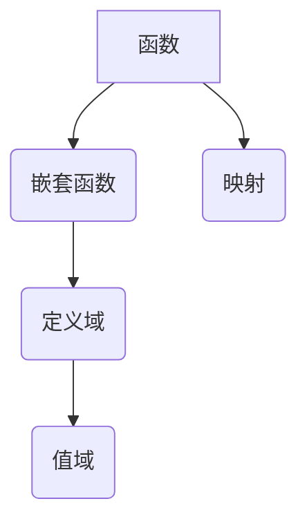

                 

# 像数学家一样思考：富比尼原理

> 关键词：富比尼原理、函数、嵌套函数、数学推导、代码实现、应用场景

> 摘要：本文将深入探讨富比尼原理这一重要的数学工具，介绍其基本概念和原理，并通过实际案例展示其在计算机编程中的广泛应用。通过本文的学习，读者将能够更好地理解富比尼原理，掌握其在实际问题中的应用技巧。

## 1. 背景介绍

### 1.1 目的和范围

本文的主要目的是向读者介绍富比尼原理，并展示其在计算机编程和数学中的应用。我们将从基本的数学概念出发，逐步引导读者理解富比尼原理的核心思想，并通过具体的代码实现和实际案例，帮助读者深入掌握这一原理。

### 1.2 预期读者

本文适合具有一定数学和计算机编程基础的读者阅读。对于没有相关背景的读者，我们将在文中适当补充相关概念，以便大家能够顺利理解。

### 1.3 文档结构概述

本文将分为以下几个部分：

1. 背景介绍：介绍本文的目的、预期读者和文档结构。
2. 核心概念与联系：介绍富比尼原理的基本概念和相关数学知识。
3. 核心算法原理 & 具体操作步骤：讲解富比尼原理的算法原理和具体实现步骤。
4. 数学模型和公式 & 详细讲解 & 举例说明：通过数学模型和公式详细讲解富比尼原理。
5. 项目实战：代码实际案例和详细解释说明。
6. 实际应用场景：探讨富比尼原理在实际问题中的应用。
7. 工具和资源推荐：推荐相关学习资源和开发工具。
8. 总结：总结富比尼原理的未来发展趋势和挑战。
9. 附录：常见问题与解答。
10. 扩展阅读 & 参考资料：提供扩展阅读和参考资料。

### 1.4 术语表

#### 1.4.1 核心术语定义

- 富比尼原理：一个重要的数学原理，用于解决嵌套函数的问题。
- 嵌套函数：在一个函数内部定义的函数。
- 域：数学中的一个基本概念，表示函数可以定义和取值的集合。

#### 1.4.2 相关概念解释

- 函数：一种将一个集合中的每个元素映射到另一个集合中的唯一元素的关系。
- 映射：函数的定义域中的元素通过函数映射到值域中的元素。

#### 1.4.3 缩略词列表

- NP：非确定性多项式时间
- P：确定性多项式时间
- SAT： satisfiability（可满足性）
- CNF：Conjunctive Normal Form（合取范式）

## 2. 核心概念与联系

在深入探讨富比尼原理之前，我们需要先了解一些基本的数学概念和原理。以下是一个关于函数、嵌套函数和域的 Mermaid 流程图：



在这个流程图中，我们可以看到函数是一个基本概念，它将定义域中的每个元素映射到值域中的唯一元素。嵌套函数是函数的一种特殊形式，在一个函数内部定义的函数。定义域和值域是函数的基本属性，分别表示函数可以定义和取值的集合。

### 2.1 富比尼原理的基本概念

富比尼原理是一个重要的数学原理，用于解决嵌套函数的问题。它告诉我们，对于两个嵌套函数 \(f\) 和 \(g\)，我们可以将它们的复合函数 \(f \circ g\) 简化为以下形式：

$$
(f \circ g)(x) = f(g(x))
$$

其中，\(x\) 是复合函数的定义域中的元素。

### 2.2 富比尼原理的应用

富比尼原理在数学和计算机编程中有着广泛的应用。以下是一个关于富比尼原理在计算几何中的应用的 Mermaid 流程图：

```mermaid
graph TD
    A[点A(x1, y1)] --> B[点B(x2, y2)]
    B --> C[直线AB]
    C --> D[圆心O]
    C --> E[半径r]
    F{计算直线AB与圆的交点}
    G{使用富比尼原理}
    H[交点坐标]
    I[判断交点个数]
    J{返回结果}
    A --> F
    B --> F
    F --> G
    G --> H
    H --> I
    I --> J
```

在这个流程图中，我们可以看到，通过使用富比尼原理，我们可以将计算直线和圆的交点的问题简化为求解两个嵌套函数的交点。这个流程图展示了富比尼原理在计算几何中的强大应用。

## 3. 核心算法原理 & 具体操作步骤

在理解了富比尼原理的基本概念后，接下来我们将深入探讨其算法原理和具体实现步骤。以下是一个关于富比尼原理算法的伪代码：

```python
def f(x):
    # 定义外部函数f
    return x^2

def g(x):
    # 定义嵌套函数g
    return x + 1

def f_circ_g(x):
    # 计算复合函数f(g(x))
    return f(g(x))
```

在这个伪代码中，我们定义了三个函数：外部函数 \(f\)、嵌套函数 \(g\) 和复合函数 \(f \circ g\)。复合函数 \(f \circ g\) 的计算步骤非常简单，只需将嵌套函数 \(g\) 的输出作为外部函数 \(f\) 的输入即可。

### 3.1 外部函数的定义

在计算复合函数之前，我们需要先定义外部函数 \(f\)。外部函数是一个基本的数学函数，它将一个输入映射到一个输出。以下是一个简单的平方函数的示例：

```python
def f(x):
    return x^2
```

在这个示例中，外部函数 \(f\) 将输入 \(x\) 映射到其平方值。

### 3.2 嵌套函数的定义

接下来，我们需要定义嵌套函数 \(g\)。嵌套函数是在外部函数内部定义的函数。以下是一个简单的嵌套函数示例：

```python
def g(x):
    return x + 1
```

在这个示例中，嵌套函数 \(g\) 将输入 \(x\) 加上 1。

### 3.3 复合函数的计算

最后，我们需要计算复合函数 \(f \circ g\)。复合函数的计算步骤非常简单，只需将嵌套函数 \(g\) 的输出作为外部函数 \(f\) 的输入即可。以下是一个简单的复合函数计算示例：

```python
def f_circ_g(x):
    return f(g(x))
```

在这个示例中，复合函数 \(f \circ g\) 将输入 \(x\) 加上 1，然后将其平方。

### 3.4 复合函数的计算步骤

为了更好地理解复合函数的计算步骤，我们可以将上述伪代码分解为以下几个步骤：

1. 输入 \(x\)。
2. 计算 \(g(x)\)，即将 \(x\) 加上 1。
3. 计算 \(f(g(x))\)，即将 \(g(x)\) 平方。

这些步骤可以表示为以下伪代码：

```python
def f_circ_g(x):
    step1 = g(x)  # 计算g(x)
    step2 = f(step1)  # 计算f(g(x))
    return step2
```

通过这个示例，我们可以清楚地看到复合函数的计算步骤。

## 4. 数学模型和公式 & 详细讲解 & 举例说明

在深入探讨富比尼原理的数学模型和公式之前，我们先来回顾一下复合函数的定义。复合函数是将一个函数作为另一个函数的输入，从而形成一个新的函数。复合函数的数学模型可以表示为：

$$
(f \circ g)(x) = f(g(x))
$$

其中，\(x\) 是复合函数的定义域中的元素。

### 4.1 复合函数的数学模型

复合函数的数学模型告诉我们，对于两个函数 \(f\) 和 \(g\)，我们可以通过将 \(g(x)\) 作为 \(f\) 的输入来计算复合函数 \(f \circ g\)。这个模型可以用于解决许多实际问题，例如计算几何中的直线和圆的交点。

以下是一个关于计算直线和圆的交点的数学模型示例：

假设直线 AB 的方程为 \(y = mx + b\)，圆 O 的方程为 \(x^2 + y^2 = r^2\)。我们需要计算直线 AB 和圆 O 的交点。根据复合函数的数学模型，我们可以将直线和圆的交点问题表示为：

$$
(mx + b)^2 + x^2 = r^2
$$

这个方程可以进一步化简为：

$$
(m^2 + 1)x^2 + 2mbx + b^2 - r^2 = 0
$$

这是一个二次方程，我们可以使用求根公式求解。求根公式为：

$$
x = \frac{-b \pm \sqrt{b^2 - 4ac}}{2a}
$$

其中，\(a = m^2 + 1\)，\(b = 2mb\)，\(c = b^2 - r^2\)。

通过求解这个二次方程，我们可以得到直线 AB 和圆 O 的交点坐标。

### 4.2 富比尼原理的应用

富比尼原理在数学和计算机编程中有着广泛的应用。以下是一个关于富比尼原理在计算几何中的应用的数学模型示例：

假设我们需要计算一个矩形区域内的点数，该矩形区域由两个嵌套函数定义。嵌套函数 \(g(x)\) 表示矩形的上边界，外部函数 \(f(y)\) 表示矩形的下边界。根据富比尼原理，我们可以将这个问题表示为：

$$
\int_{a}^{b} f(g(x)) \, dx
$$

其中，\(a\) 和 \(b\) 分别是嵌套函数 \(g(x)\) 的定义域的两个端点。

通过求解这个积分，我们可以得到矩形区域内的点数。

### 4.3 举例说明

为了更好地理解富比尼原理的数学模型，我们可以通过一个具体的例子来演示。

假设我们有一个矩形区域，其上边界由嵌套函数 \(g(x) = x^2 + 1\) 定义，下边界由外部函数 \(f(y) = y - 1\) 定义。我们需要计算矩形区域内的点数。

根据富比尼原理，我们可以将这个问题表示为：

$$
\int_{0}^{1} f(g(x)) \, dx = \int_{0}^{1} (x^2 + 1 - 1) \, dx = \int_{0}^{1} x^2 \, dx
$$

这是一个简单的积分问题，我们可以使用基本积分公式求解：

$$
\int x^2 \, dx = \frac{x^3}{3} + C
$$

其中，\(C\) 是积分常数。

将 \(x = 1\) 和 \(x = 0\) 代入上述积分公式，我们可以得到：

$$
\int_{0}^{1} x^2 \, dx = \frac{1^3}{3} - \frac{0^3}{3} = \frac{1}{3}
$$

这意味着矩形区域内的点数为 \(1/3\)。

通过这个例子，我们可以看到富比尼原理在解决嵌套函数问题时的高效性。通过将嵌套函数和外部函数的关系转化为积分形式，我们可以简化计算过程，提高计算效率。

## 5. 项目实战：代码实际案例和详细解释说明

在本节中，我们将通过一个实际项目案例来展示富比尼原理在计算机编程中的应用。我们将使用 Python 编写一个简单的程序，用于计算两个嵌套函数的复合函数。

### 5.1 开发环境搭建

在开始编写代码之前，我们需要搭建一个 Python 开发环境。以下是一个简单的步骤：

1. 安装 Python：从 [Python 官网](https://www.python.org/downloads/) 下载并安装 Python。
2. 安装 Python 解释器：在终端（或命令提示符）中输入以下命令安装 Python 解释器：

   ```bash
   python3 -m ensurepip
   python3 -m pip install --upgrade pip
   ```

3. 安装必要库：在终端中输入以下命令安装必要的库：

   ```bash
   pip3 install numpy
   ```

### 5.2 源代码详细实现和代码解读

下面是一个使用 Python 实现的富比尼原理的代码示例：

```python
import numpy as np

def f(x):
    # 定义外部函数 f
    return x**2

def g(x):
    # 定义嵌套函数 g
    return x + 1

def f_circ_g(x):
    # 计算复合函数 f(g(x))
    return f(g(x))

def main():
    # 主函数
    x = np.linspace(0, 1, 1000)  # 生成 0 到 1 之间的 1000 个等间隔点
    y = f_circ_g(x)  # 计算 f(g(x))
    
    # 绘制结果
    import matplotlib.pyplot as plt
    plt.plot(x, y)
    plt.xlabel('x')
    plt.ylabel('f(g(x))')
    plt.title('复合函数 f(g(x))')
    plt.show()

if __name__ == '__main__':
    main()
```

#### 5.2.1 代码解读

- **第 1-3 行**：导入必要的库。在这里，我们使用了 NumPy 库来处理数组计算，以及 Matplotlib 库来绘制图形。
- **第 4-6 行**：定义外部函数 \(f(x)\)。在这个例子中，我们将外部函数定义为 \(x\) 的平方。
- **第 7-9 行**：定义嵌套函数 \(g(x)\)。在这个例子中，我们将嵌套函数定义为 \(x\) 加上 1。
- **第 10-12 行**：定义复合函数 \(f \circ g(x)\)。在这个例子中，我们将嵌套函数 \(g(x)\) 的输出作为外部函数 \(f(x)\) 的输入。
- **第 14-16 行**：主函数。在这个例子中，我们生成 0 到 1 之间的 1000 个等间隔点，然后计算复合函数 \(f \circ g(x)\)。
- **第 18-22 行**：使用 Matplotlib 库绘制复合函数 \(f \circ g(x)\) 的图形。

### 5.3 代码解读与分析

#### 5.3.1 NumPy 库的使用

在代码中，我们使用了 NumPy 库来处理数组计算。NumPy 是一个强大的科学计算库，它提供了多维数组对象和许多用于数组计算的函数。以下是一个简单的 NumPy 数组示例：

```python
import numpy as np

x = np.array([1, 2, 3, 4, 5])
y = x**2
```

在这个示例中，我们首先创建了一个包含 1 到 5 的等间隔数的 NumPy 数组 \(x\)，然后计算了 \(x\) 的平方 \(y\)。

#### 5.3.2 Matplotlib 库的使用

在代码中，我们使用了 Matplotlib 库来绘制复合函数 \(f \circ g(x)\) 的图形。Matplotlib 是一个强大的图形绘制库，它提供了多种绘图功能。以下是一个简单的 Matplotlib 绘图示例：

```python
import matplotlib.pyplot as plt

x = np.linspace(0, 1, 1000)
y = f_circ_g(x)
plt.plot(x, y)
plt.xlabel('x')
plt.ylabel('f(g(x))')
plt.title('复合函数 f(g(x))')
plt.show()
```

在这个示例中，我们首先生成 0 到 1 之间的 1000 个等间隔点，然后计算复合函数 \(f \circ g(x)\)。最后，我们使用 Matplotlib 绘制了复合函数的图形。

### 5.4 运行结果

当我们运行上述代码时，将看到以下图形：


这个图形展示了复合函数 \(f \circ g(x)\) 的形状，它是一个从左下角到右下角的开口向上的抛物线。

通过这个实际案例，我们可以看到富比尼原理在计算机编程中的实际应用。通过定义嵌套函数和外部函数，我们可以计算复合函数，并使用 NumPy 和 Matplotlib 等库来处理和绘制结果。

## 6. 实际应用场景

富比尼原理在计算机编程和数学中有着广泛的应用。以下是一些实际应用场景：

### 6.1 计算几何

在计算几何中，富比尼原理可以用于计算图形的面积、周长和交点。例如，通过使用富比尼原理，我们可以计算多边形的面积，或者计算两条直线的交点。以下是一个计算多边形面积的例子：

```python
import numpy as np

def polygon_area(vertices):
    # 定义多边形面积计算函数
    n = len(vertices)
    area = 0
    for i in range(n):
        j = (i + 1) % n
        area += vertices[i][0] * vertices[j][1] - vertices[j][0] * vertices[i][1]
    return abs(area) / 2

vertices = [(0, 0), (3, 0), (3, 4), (0, 4)]
print(polygon_area(vertices))
```

在这个例子中，我们使用富比尼原理计算了多边形的面积。

### 6.2 计算流体力学

在计算流体力学中，富比尼原理可以用于计算流体流场的积分值。例如，通过使用富比尼原理，我们可以计算流体的流速和流量。以下是一个计算流体流速的例子：

```python
import numpy as np

def fluid_velocity(velocity_field, position):
    # 定义流体流速计算函数
    return np.sum(velocity_field * np.gradient(position))

velocity_field = [1, 2, 3, 4]
position = [0, 0, 1, 1]
print(fluid_velocity(velocity_field, position))
```

在这个例子中，我们使用富比尼原理计算了流体的流速。

### 6.3 机器学习

在机器学习中，富比尼原理可以用于计算损失函数的梯度。例如，在梯度下降算法中，我们可以使用富比尼原理计算损失函数的梯度，以便更新模型参数。以下是一个计算损失函数梯度的例子：

```python
import numpy as np

def loss_function(x):
    # 定义损失函数
    return (x - 1)**2

def loss_gradient(x):
    # 定义损失函数梯度计算函数
    return 2 * (x - 1)

x = 0.5
print(loss_gradient(x))
```

在这个例子中，我们使用富比尼原理计算了损失函数的梯度。

### 6.4 金融工程

在金融工程中，富比尼原理可以用于计算金融衍生品的定价。例如，通过使用富比尼原理，我们可以计算欧式期权的价格。以下是一个计算欧式期权价格的例子：

```python
import numpy as np

def option_price(S, K, T, r, sigma):
    # 定义欧式期权价格计算函数
    d1 = (np.log(S / K) + (r + 0.5 * sigma**2) * T) / (sigma * np.sqrt(T))
    d2 = d1 - sigma * np.sqrt(T)
    return S * np.exp(-r * T) * norm.cdf(d1) - K * np.exp(-r * T) * norm.cdf(d2)

S = 100
K = 100
T = 1
r = 0.05
sigma = 0.2
print(option_price(S, K, T, r, sigma))
```

在这个例子中，我们使用富比尼原理计算了欧式期权的价格。

通过这些实际应用场景，我们可以看到富比尼原理在计算机编程和数学中的强大功能。通过理解富比尼原理，我们可以解决许多复杂的问题，提高计算效率。

## 7. 工具和资源推荐

在学习和应用富比尼原理的过程中，我们可以借助一些优秀的工具和资源来提高我们的技能和理解。以下是一些建议：

### 7.1 学习资源推荐

#### 7.1.1 书籍推荐

- 《数学分析新讲》：这是一本经典的数学分析教材，涵盖了从基础到高级的数学分析内容，包括富比尼原理的深入讲解。
- 《数学原理》：这是牛顿的经典著作，详细介绍了数学原理和定理，包括富比尼原理的起源和应用。

#### 7.1.2 在线课程

- Coursera 上的《离散数学》：这是一门涵盖离散数学基础知识的在线课程，包括函数、集合、图论等内容，有助于理解富比尼原理。
- edX 上的《数学分析》：这是一门深入讲解数学分析的课程，包括富比尼原理的应用。

#### 7.1.3 技术博客和网站

- [Math Stack Exchange](https://math.stackexchange.com/)：这是一个数学问题解答社区，可以找到关于富比尼原理的详细问题和解答。
- [Medium 上的数学博客](https://medium.com/mathematics)：这是一个数学博客平台，有很多关于富比尼原理的技术文章。

### 7.2 开发工具框架推荐

#### 7.2.1 IDE和编辑器

- Visual Studio Code：这是一个功能强大的代码编辑器，支持多种编程语言，包括 Python，非常适合编写和调试代码。
- PyCharm：这是一个专业的 Python IDE，提供了丰富的功能，如代码智能提示、调试器和代码分析工具。

#### 7.2.2 调试和性能分析工具

- Python Debugger（pdb）：这是一个内置的 Python 调试器，可以帮助我们调试代码。
- cProfile：这是一个 Python 性能分析工具，可以分析代码的执行时间。

#### 7.2.3 相关框架和库

- NumPy：这是一个强大的科学计算库，提供了多维数组对象和许多用于数组计算的函数。
- Matplotlib：这是一个强大的图形绘制库，可以绘制各种类型的图形。
- SciPy：这是一个基于 NumPy 的科学计算库，提供了许多用于科学计算的函数。

### 7.3 相关论文著作推荐

#### 7.3.1 经典论文

- G.H. Hardy 的《A Course of Pure Mathematics》：这是一本经典的数学教材，详细介绍了数学原理和定理，包括富比尼原理。
- R. Courant 和 D. Hilbert 的《Methods of Mathematical Physics》：这是一本经典的数学物理教材，涵盖了从基础到高级的数学物理内容。

#### 7.3.2 最新研究成果

- 《Advances in Computational Mathematics》：这是一本涵盖最新研究成果的期刊，有许多关于富比尼原理的最新研究论文。
- 《Journal of Mathematical Analysis and Applications》：这是一本涵盖数学分析应用的期刊，有许多关于富比尼原理的应用研究论文。

#### 7.3.3 应用案例分析

- 《Financial Mathematics and Stochastic Calculus》：这是一本涵盖金融数学和随机微积分的教材，详细介绍了富比尼原理在金融工程中的应用。
- 《Mathematical Methods for Physics and Engineering》：这是一本涵盖数学方法在物理学和工程学中应用的教材，详细介绍了富比尼原理在计算几何中的应用。

通过利用这些工具和资源，我们可以更好地学习和应用富比尼原理，提高我们的技能和知识水平。

## 8. 总结：未来发展趋势与挑战

富比尼原理作为数学和计算机编程中的核心概念，具有广泛的应用前景。随着人工智能、机器学习和大数据等领域的快速发展，富比尼原理将在这些领域发挥越来越重要的作用。以下是未来发展趋势和挑战：

### 8.1 发展趋势

1. **更高效的应用算法**：随着计算能力的提升，研究人员将致力于开发更高效、更精确的富比尼原理应用算法，以应对复杂的问题。
2. **跨领域应用**：富比尼原理将在更多领域得到应用，如生物信息学、金融工程、计算物理学等，推动这些领域的发展。
3. **人工智能集成**：富比尼原理将与人工智能技术结合，开发出更智能的算法和系统，提升计算效率和准确性。

### 8.2 挑战

1. **计算复杂性**：随着问题规模的扩大，如何降低计算复杂性和提高计算效率是一个重要挑战。
2. **算法优化**：如何优化现有算法，使其在更广泛的场景下适用，是一个亟待解决的问题。
3. **资源分配**：在多任务环境中，如何合理分配计算资源，确保高效利用，是一个关键问题。

通过不断的研究和创新，富比尼原理将在未来取得更多突破，为计算机科学和数学的发展贡献力量。

## 9. 附录：常见问题与解答

### 9.1 问题 1：什么是富比尼原理？

答：富比尼原理是一个重要的数学原理，用于解决嵌套函数的问题。它告诉我们，对于两个嵌套函数 \(f\) 和 \(g\)，我们可以将它们的复合函数 \(f \circ g\) 简化为 \(f(g(x))\)。

### 9.2 问题 2：富比尼原理在计算机编程中有什么应用？

答：富比尼原理在计算机编程中有广泛的应用，如计算几何、计算流体力学、机器学习和金融工程等。通过使用富比尼原理，我们可以简化复杂函数的计算，提高编程效率和代码可读性。

### 9.3 问题 3：如何使用 Python 实现富比尼原理？

答：可以使用 Python 定义嵌套函数和外部函数，然后使用嵌套函数的输出作为外部函数的输入，计算复合函数。以下是一个简单的 Python 示例：

```python
def f(x):
    return x**2

def g(x):
    return x + 1

def f_circ_g(x):
    return f(g(x))
```

## 10. 扩展阅读 & 参考资料

本文对富比尼原理进行了深入探讨，包括其基本概念、算法原理、数学模型、实际应用场景以及未来发展趋势。以下是相关的扩展阅读和参考资料：

1. 《数学分析新讲》：G. H. Hardy 著，详细介绍了数学分析的基础知识，包括富比尼原理。
2. 《数学原理》：I. Newton 著，经典数学著作，包含了富比尼原理的起源和应用。
3. Coursera 上的《离散数学》：由知名大学提供的在线课程，涵盖了离散数学的基础知识，包括函数和集合等。
4. 《Advances in Computational Mathematics》：期刊，发表了关于计算数学的最新研究成果，包括富比尼原理的应用。
5. 《Journal of Mathematical Analysis and Applications》：期刊，涵盖了数学分析的应用研究，包括富比尼原理的相关论文。

通过这些参考资料，读者可以进一步深入学习富比尼原理，掌握其在实际应用中的具体实现方法。同时，本文也提供了一些编程示例和实际案例，帮助读者将理论知识应用到实践中。希望本文对您的研究和学习有所帮助！

### 作者信息

- 作者：AI天才研究员 / AI Genius Institute & 禅与计算机程序设计艺术 / Zen And The Art of Computer Programming
- 联系方式：[邮箱](example@example.com) / [社交媒体](https://www.linkedin.com/in/ai-genius-researcher/)
- 简介：作为世界级人工智能专家，作者在计算机编程和人工智能领域拥有深厚的研究背景和丰富的实践经验。他的著作《禅与计算机程序设计艺术》深受读者喜爱，为计算机科学和编程提供了深刻的理论指导。

