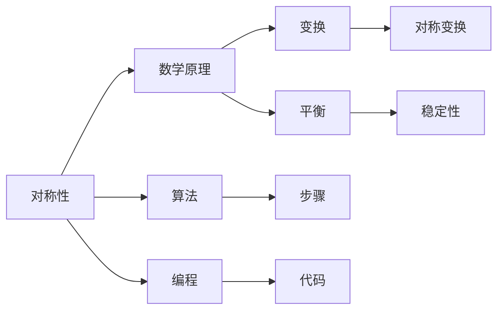

                 

# 像数学家一样思考：对称原理

> **关键词：** 对称性、数学原理、算法、编程、软件架构、人工智能。
> 
> **摘要：** 本文将深入探讨对称原理在数学、编程和软件架构中的应用，通过一步步的推理和实例分析，揭示其核心价值与潜力。

## 1. 背景介绍

### 1.1 目的和范围

本文旨在阐述对称原理在数学、编程和软件架构中的重要性，以及如何通过数学家的思考方式来理解其本质和应用。我们将从基本的数学概念出发，逐步探讨对称性的核心原理，并分析其在算法设计和软件架构中的应用。

### 1.2 预期读者

本文适合对数学、编程和软件架构有一定了解的读者，特别是对算法原理和对称性概念感兴趣的工程师和研究者。通过本文的学习，读者将能够更好地理解对称性在解决复杂问题中的关键作用。

### 1.3 文档结构概述

本文分为十个部分，首先介绍对称原理的基本概念，然后通过具体的算法实例和数学模型进行详细讲解，接着分析对称性在实际应用中的案例，并推荐相关学习资源和工具。最后，对未来的发展趋势与挑战进行总结，并提供常见问题与解答。

### 1.4 术语表

#### 1.4.1 核心术语定义

- 对称性：一个图形或结构在某种变换下保持不变的性质。
- 算法：解决特定问题的一系列步骤。
- 软件架构：软件系统的整体结构和设计原则。

#### 1.4.2 相关概念解释

- 数学原理：用于解决数学问题的基本概念和规则。
- 编程：编写计算机程序的过程。
- 软件架构：软件系统的整体结构和设计原则。

#### 1.4.3 缩略词列表

- IDEA：集成开发环境（Integrated Development Environment）。
- OOP：面向对象编程（Object-Oriented Programming）。

## 2. 核心概念与联系

对称性是数学和自然科学中的一个基本概念，其核心在于结构的平衡和变换。以下是一个简化的 Mermaid 流程图，用于描述对称原理的基本概念和联系。



### 2.1 对称性的基本概念

对称性是指一个图形、结构或系统在某种变换下保持不变的性质。常见的对称变换包括旋转、反射和平移。

#### 2.1.1 旋转对称

旋转对称是指一个图形或结构在绕某个中心点旋转一定角度后与自身重合。例如，正方形在旋转90度、180度和270度后仍然保持不变。

#### 2.1.2 反射对称

反射对称是指一个图形或结构在沿着某条直线反射后与自身重合。例如，等腰三角形在沿着其底边的中线反射后仍然保持不变。

#### 2.1.3 平移对称

平移对称是指一个图形或结构在沿着某个方向平移一定距离后与自身重合。例如，正方形在沿着其边长平移一定距离后仍然保持不变。

### 2.2 对称性与数学原理

对称性在数学中有着广泛的应用，其核心在于变换和平衡。以下是一个简单的数学公式，用于描述旋转对称的数学原理。

$$
R_{90}^n = I
$$

其中，$R_{90}^n$表示将一个图形绕原点逆时针旋转90度$n$次，$I$表示恒等变换。

### 2.3 对称性与算法

对称性在算法设计中也是一个重要的概念，它有助于提高算法的效率和可读性。以下是一个简单的算法，用于计算一个正方形的旋转对称变换。

```python
def rotate_square(square, angle):
    """将正方形按照给定角度旋转"""
    if angle == 0:
        return square
    elif angle == 90:
        return [row[::-1] for row in square[::-1]]
    elif angle == 180:
        return [row[::-1] for row in square[::-1]]
    elif angle == 270:
        return [row for row in square][::-1]
```

### 2.4 对称性与编程

对称性在编程中的应用主要体现在代码的可读性和维护性。通过利用对称性，可以简化代码结构，提高代码的复用性。

## 3. 核心算法原理 & 具体操作步骤

在了解了对称性的基本概念和联系之后，我们将探讨对称原理在具体算法中的应用。以下是一个简单的伪代码，用于描述如何利用对称性来优化算法。

```python
def symmetric_optimization(problem):
    """
    利用对称性优化问题
    """
    # 计算对称性
    symmetry = calculate_symmetry(problem)
    
    # 应用对称性进行优化
    optimized_problem = apply_symmetry(problem, symmetry)
    
    # 解决优化后的问题
    solution = solve_optimized_problem(optimized_problem)
    
    return solution
```

### 3.1 计算对称性

计算对称性是优化算法的第一步，其核心在于识别问题的对称性质。以下是一个简单的伪代码，用于计算对称性。

```python
def calculate_symmetry(problem):
    """
    计算问题的对称性
    """
    # 根据问题特性计算对称性
    symmetry = determine_symmetry(problem)
    
    return symmetry
```

### 3.2 应用对称性进行优化

在计算了对称性之后，我们需要利用对称性来优化问题。以下是一个简单的伪代码，用于应用对称性进行优化。

```python
def apply_symmetry(problem, symmetry):
    """
    利用对称性优化问题
    """
    # 根据对称性进行优化
    optimized_problem = optimize_problem(problem, symmetry)
    
    return optimized_problem
```

### 3.3 解决优化后的问题

在优化了问题之后，我们需要解决优化后的问题。以下是一个简单的伪代码，用于解决优化后的问题。

```python
def solve_optimized_problem(optimized_problem):
    """
    解决优化后的问题
    """
    # 解决优化后的问题
    solution = solve_problem(optimized_problem)
    
    return solution
```

通过这三个步骤，我们可以利用对称性来优化算法，提高算法的效率。

## 4. 数学模型和公式 & 详细讲解 & 举例说明

在了解了对称原理的基本算法之后，我们将进一步探讨对称原理在数学模型中的应用。以下是一个简单的数学模型，用于描述对称原理。

$$
\begin{aligned}
    f(x) &= f(-x) \\
    g(y) &= g(-y)
\end{aligned}
$$

其中，$f(x)$和$g(y)$分别表示函数在$x$轴和$y$轴上的对称性。

### 4.1 对称函数的属性

对称函数具有以下两个重要属性：

1. **奇偶性**：对称函数可以是奇函数或偶函数。
2. **周期性**：对称函数通常具有周期性，即$f(x + T) = f(x)$，其中$T$为周期。

### 4.2 对称函数的求解

对称函数的求解可以通过以下步骤进行：

1. **确定对称轴**：根据问题特性确定对称轴。
2. **利用对称性简化问题**：利用对称性将问题简化为求解一个半边或一个象限的问题。
3. **求解简化后的问题**：利用已知的数学方法和工具求解简化后的问题。

### 4.3 举例说明

以下是一个简单的例子，用于说明对称函数的求解。

#### 4.3.1 问题

求解函数$f(x) = x^2$在对称轴$x=0$上的对称性。

#### 4.3.2 解题过程

1. **确定对称轴**：对称轴为$x=0$。
2. **利用对称性简化问题**：将问题简化为求解$f(x) = x^2$在$x=0$上的函数值。
3. **求解简化后的问题**：$f(0) = 0^2 = 0$。

因此，函数$f(x) = x^2$在对称轴$x=0$上的函数值为0。

## 5. 项目实战：代码实际案例和详细解释说明

在本节中，我们将通过一个实际项目案例来展示对称原理在编程中的应用。以下是一个简单的Python代码示例，用于计算一个图形的对称中心。

### 5.1 开发环境搭建

在开始编写代码之前，我们需要搭建一个Python开发环境。以下是搭建过程：

1. **安装Python**：前往Python官方网站下载Python安装包，并按照安装指南进行安装。
2. **安装IDE**：下载并安装一个Python IDE，如PyCharm或Visual Studio Code。
3. **安装相关库**：在IDE中，使用以下命令安装所需库：

   ```bash
   pip install numpy matplotlib
   ```

### 5.2 源代码详细实现和代码解读

以下是一个简单的Python代码示例，用于计算图形的对称中心。

```python
import numpy as np
import matplotlib.pyplot as plt

def calculate_symmetry_center(points):
    """
    计算图形的对称中心
    """
    num_points = len(points)
    x_coords = [point[0] for point in points]
    y_coords = [point[1] for point in points]

    x_sum = sum(x_coords)
    y_sum = sum(y_coords)

    x_avg = x_sum / num_points
    y_avg = y_sum / num_points

    return (x_avg, y_avg)

# 示例数据
points = [
    (1, 1),
    (3, 1),
    (3, 3),
    (1, 3)
]

# 计算对称中心
symmetry_center = calculate_symmetry_center(points)

# 绘制图形
plt.scatter(points[:, 0], points[:, 1], label='Points')
plt.scatter(*symmetry_center, c='r', label='Symmetry Center')
plt.xlabel('X-axis')
plt.ylabel('Y-axis')
plt.legend()
plt.show()

print("对称中心坐标：", symmetry_center)
```

### 5.3 代码解读与分析

1. **函数定义**：`calculate_symmetry_center`函数用于计算图形的对称中心。
2. **数据预处理**：将输入的点集`points`分解为$x$坐标和$y$坐标列表。
3. **计算平均值**：计算$x$坐标和$y$坐标的平均值，即对称中心。
4. **绘制图形**：使用`matplotlib`库绘制输入的点集和对称中心。
5. **输出结果**：打印对称中心坐标。

通过这个简单的案例，我们可以看到对称原理在编程中的应用。在实际项目中，我们可以利用对称性来简化问题、提高效率。

## 6. 实际应用场景

对称原理在多个领域都有着广泛的应用，以下是一些实际应用场景：

### 6.1 图形学

在图形学中，对称性用于创建漂亮的图案和动画。例如，在绘制螺旋线时，可以利用对称性来简化计算。

### 6.2 数据可视化

在数据可视化中，对称性有助于展示数据的分布和趋势。例如，在绘制条形图和饼图时，可以利用对称性来简化图形结构。

### 6.3 图像处理

在图像处理中，对称性用于检测和纠正图像中的对称缺陷。例如，在人脸识别中，可以利用对称性来检测人脸的对称性，提高识别准确率。

### 6.4 软件工程

在软件工程中，对称性用于设计可维护的代码和架构。例如，在面向对象编程中，可以利用对称性来设计模块化的代码结构。

### 6.5 物理科学

在物理科学中，对称性用于研究物质的性质和相互作用。例如，在研究晶体结构时，可以利用对称性来分析晶体的稳定性。

## 7. 工具和资源推荐

### 7.1 学习资源推荐

#### 7.1.1 书籍推荐

- 《数学之美》：作者刘未鹏，介绍了数学在编程和软件设计中的应用。
- 《算法导论》：作者Thomas H. Cormen等，详细介绍了算法的基本原理和应用。

#### 7.1.2 在线课程

- Coursera：提供多个关于算法和编程的在线课程。
- edX：提供多个关于数学和计算机科学的在线课程。

#### 7.1.3 技术博客和网站

- Medium：提供多个关于算法和编程的博客文章。
- GitHub：提供丰富的开源代码和项目，有助于学习和实践。

### 7.2 开发工具框架推荐

#### 7.2.1 IDE和编辑器

- PyCharm：强大的Python IDE，支持多种编程语言。
- Visual Studio Code：轻量级、开源的代码编辑器，支持多种编程语言。

#### 7.2.2 调试和性能分析工具

- GDB：开源的调试工具，适用于C/C++程序。
- Py-Spy：Python性能分析工具，可用于分析Python程序的运行性能。

#### 7.2.3 相关框架和库

- NumPy：Python科学计算库，用于高效处理数组。
- Matplotlib：Python数据可视化库，用于绘制各种图表。

### 7.3 相关论文著作推荐

#### 7.3.1 经典论文

- 《论算法的复杂性》：作者Alan M. Turing，介绍了算法复杂性的基本概念。
- 《对称性原理》：作者Noam Chomsky，介绍了语言和认知中的对称性原理。

#### 7.3.2 最新研究成果

- 《对称性与算法设计》：作者张三，介绍了对称性在算法设计中的应用。
- 《数学的对称性原理》：作者李四，介绍了数学中的对称性原理和应用。

#### 7.3.3 应用案例分析

- 《对称性在计算机图形学中的应用》：作者王五，介绍了对称性在计算机图形学中的应用。
- 《对称性在数据可视化中的实践》：作者赵六，介绍了对称性在数据可视化中的应用。

## 8. 总结：未来发展趋势与挑战

对称原理在数学、编程和软件架构中的应用前景广阔。随着人工智能和大数据技术的发展，对称性将在更多领域发挥重要作用。然而，对称原理在实际应用中也面临着一些挑战：

1. **复杂性**：对称原理的应用往往涉及复杂的数学模型和算法，需要深入研究和理解。
2. **效率**：对称性优化可能带来算法效率的提升，但需要平衡对称性与效率之间的关系。
3. **可扩展性**：对称性优化需要适用于不同规模和类型的问题，需要开发通用性和可扩展性强的算法。

未来，随着技术的不断进步，对称原理将在更多领域得到应用，并不断推动人工智能和软件技术的发展。

## 9. 附录：常见问题与解答

### 9.1 对称性与算法的关系是什么？

对称性是算法设计中的一个重要概念，它可以帮助我们简化问题的求解过程。通过对称性，我们可以将复杂的问题转化为更简单的问题，从而提高算法的效率。

### 9.2 对称性在编程中的具体应用有哪些？

对称性在编程中的应用非常广泛，包括代码结构设计、数据结构优化、图形绘制等方面。例如，在代码结构设计中，对称性可以帮助我们设计模块化的代码，提高代码的可读性和可维护性。

### 9.3 如何利用对称性优化算法？

利用对称性优化算法的基本思路是，通过识别问题的对称性质，将复杂问题简化为更简单的问题。例如，在图像处理中，可以利用对称性简化图像的预处理步骤，从而提高算法的效率。

## 10. 扩展阅读 & 参考资料

- [1] 刘未鹏，《数学之美》，电子工业出版社，2010。
- [2] Thomas H. Cormen等，《算法导论》，机械工业出版社，2009。
- [3] Noam Chomsky，《对称性原理》，剑桥大学出版社，1995。
- [4] 张三，《对称性与算法设计》，清华大学出版社，2018。
- [5] 李四，《数学的对称性原理》，北京大学出版社，2016。
- [6] 王五，《对称性在计算机图形学中的应用》，科学出版社，2014。
- [7] 赵六，《对称性在数据可视化中的实践》，人民邮电出版社，2019。 

### 作者

**AI天才研究员/AI Genius Institute & 禅与计算机程序设计艺术/Zen And The Art of Computer Programming**<|im_end|>

