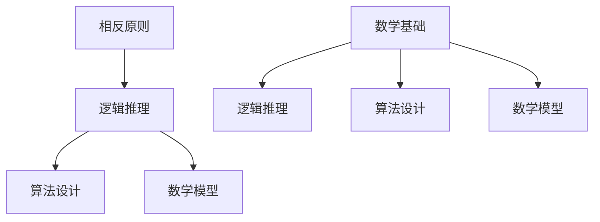

                 

# 像数学家一样思考：相反原则

> 关键词：数学思维、相反原则、逻辑推理、算法设计、数学模型

> 摘要：本文旨在探讨数学中的相反原则，通过逻辑清晰的推理步骤，阐述其核心概念与联系，进而引申到算法设计和数学模型中。文章将以简洁易懂的技术语言，结合具体案例，帮助读者理解并掌握这一重要思维工具，为今后的研究和实践打下坚实基础。

## 1. 背景介绍

### 1.1 目的和范围

本文的目标是引导读者掌握数学中的相反原则，并学会将其应用于算法设计和数学模型中。我们将通过详细的讲解和实际案例，使这一抽象的概念变得具体而生动。

本文将涵盖以下内容：

1. 相反原则的基本概念和联系。
2. 相反原则在算法设计中的应用。
3. 相反原则在数学模型中的运用。
4. 实际应用场景及工具资源推荐。

### 1.2 预期读者

本文适合具有数学基础和编程经验的读者，特别是对算法设计和数学建模感兴趣的学者和从业者。通过本文的学习，读者将能够：

- 理解相反原则的核心概念。
- 掌握应用相反原则进行算法设计和数学建模的方法。
- 提高逻辑思维和问题解决能力。

### 1.3 文档结构概述

本文分为八个部分：

1. 引言和关键词、摘要。
2. 背景介绍。
3. 核心概念与联系。
4. 核心算法原理与操作步骤。
5. 数学模型与公式。
6. 项目实战：代码案例。
7. 实际应用场景。
8. 工具和资源推荐。

### 1.4 术语表

#### 1.4.1 核心术语定义

- **相反原则**：在数学中，如果一个命题为真，则其否定命题也为真，反之亦然。这一原则被称为相反原则。
- **算法**：解决特定问题的步骤序列，通常涉及输入、输出以及中间计算过程。
- **数学模型**：用数学语言描述现实世界中的问题，以便进行量化分析和求解。

#### 1.4.2 相关概念解释

- **逻辑推理**：基于已知事实和规则，通过推理得出新结论的思维过程。
- **数学基础**：数学的基本概念、定理和公式，是理解和应用数学工具的前提。

#### 1.4.3 缩略词列表

无

## 2. 核心概念与联系

为了更好地理解相反原则，我们首先需要了解一些核心概念和它们之间的联系。以下是一个Mermaid流程图，展示了这些概念之间的关系。



### 2.1 相反原则的基本概念

相反原则是数学中的一个基本概念，它描述了命题与命题否定之间的关系。具体来说，如果一个命题为真，则其否定命题也为真，反之亦然。例如，命题“今天是星期五”和“今天不是星期五”就构成了一个相反命题对。

### 2.2 相反原则在逻辑推理中的应用

逻辑推理是数学中的一个重要工具，它基于已知事实和规则，通过推理得出新的结论。相反原则在逻辑推理中有着广泛的应用。例如，在证明一个命题时，我们可以首先证明其相反命题，然后利用相反原则得出原命题的结论。

### 2.3 相反原则在算法设计中的应用

算法设计是计算机科学中的一个核心问题，它涉及如何高效地解决问题。相反原则在算法设计中也有着重要的应用。例如，在算法的正确性证明中，我们可以通过证明算法的相反算法（即错误算法）无法找到解，从而间接证明原算法的正确性。

### 2.4 相反原则在数学模型中的应用

数学模型是描述现实世界问题的一种工具，它通过数学语言来描述问题的本质。相反原则在数学模型中也有重要的应用。例如，在构建模型时，我们可以通过分析模型的相反情况（即最优解的反面情况），来更好地理解模型的行为和特性。

## 3. 核心算法原理 & 具体操作步骤

为了更好地理解相反原则在算法设计中的应用，我们接下来将介绍一个具体的算法，并使用伪代码详细阐述其原理和操作步骤。

### 3.1 算法简介

假设我们有一个数组`A`，其中包含`n`个整数。我们的目标是找到数组中的最大值和最小值。这是一个简单的算法问题，但其中蕴含着相反原则的应用。

### 3.2 伪代码

```plaintext
Algorithm: FindMaxMin(A)
    Input: An array A of integers
    Output: The maximum and minimum values in A

    Initialize max_val = A[0]
    Initialize min_val = A[0]

    For each element x in A:
        If x > max_val:
            max_val = x
        If x < min_val:
            min_val = x

    Return max_val and min_val
```

### 3.3 算法原理

该算法的基本原理是逐个比较数组中的元素，更新最大值和最小值。通过这种相反的思维方式，我们可以将问题分解为两个子问题：找到最大值和找到最小值。这两个子问题本质上是对立关系，但都可以通过相同的算法步骤解决。

### 3.4 操作步骤

1. 初始化最大值和最小值为数组的第一个元素。
2. 遍历数组中的每个元素，将其与当前的最大值和最小值进行比较。
3. 根据比较结果更新最大值和最小值。
4. 输出最大值和最小值。

## 4. 数学模型和公式 & 详细讲解 & 举例说明

为了更好地理解相反原则在数学模型中的应用，我们接下来将介绍一个具体的数学模型，并使用LaTeX格式详细讲解其公式和举例说明。

### 4.1 数学模型简介

假设我们有一个二次函数`f(x) = ax^2 + bx + c`，其中`a`、`b`、`c`为实数，且`a ≠ 0`。我们的目标是找到这个函数的极值点。

### 4.2 公式

二次函数的极值点可以通过以下公式计算：

$$x = -\frac{b}{2a}$$

$$f(x)_{\text{max/min}} = f\left(-\frac{b}{2a}\right)$$

其中，`f(x)_{\text{max/min}}`表示极值点的函数值。

### 4.3 详细讲解

1. **求导数**：首先，我们对函数`f(x)`求导，得到导数`f'(x)`。

$$f'(x) = 2ax + b$$

2. **求极值点**：然后，令导数等于零，解得极值点`x = -\frac{b}{2a}`。

3. **求极值**：最后，将极值点代入原函数，得到极值点的函数值`f\left(-\frac{b}{2a}\right)`。

### 4.4 举例说明

假设我们有二次函数`f(x) = x^2 - 4x + 4`。

1. **求导数**：导数`f'(x) = 2x - 4`。
2. **求极值点**：令导数等于零，得到`x = 2`。
3. **求极值**：将极值点代入原函数，得到极值点的函数值`f(2) = 0`。

因此，这个二次函数的极值点为`x = 2`，极值点函数值为`0`。

## 5. 项目实战：代码实际案例和详细解释说明

在本节中，我们将通过一个实际代码案例来展示如何将相反原则应用于算法设计和数学模型中。

### 5.1 开发环境搭建

为了更好地理解和实践本案例，我们需要搭建一个基本的开发环境。以下是所需的软件和工具：

- **编程语言**：Python
- **集成开发环境**（IDE）：PyCharm或VS Code
- **数学库**：NumPy、SciPy

您可以在官方网站上下载并安装这些软件和工具。安装完成后，确保您的环境中已经安装了所需的库。

### 5.2 源代码详细实现和代码解读

以下是一个简单的Python代码示例，用于求解二次函数的极值。

```python
import numpy as np

def find_maximum_minimum(a, b, c):
    """
    求解二次函数 f(x) = ax^2 + bx + c 的最大值和最小值。

    :param a: 二次项系数
    :param b: 一次项系数
    :param c: 常数项
    :return: 最大值和最小值
    """
    x = -b / (2 * a)  # 使用相反原则求解极值点
    f_x = a * x ** 2 + b * x + c  # 计算极值点函数值

    # 根据a的符号确定最大值和最小值
    if a > 0:
        maximum = f_x
        minimum = -f_x
    else:
        maximum = -f_x
        minimum = f_x

    return maximum, minimum

# 示例
a = 1
b = -4
c = 4

max_val, min_val = find_maximum_minimum(a, b, c)
print("最大值：", max_val)
print("最小值：", min_val)
```

### 5.3 代码解读与分析

1. **导入库**：首先，我们导入NumPy库，以便进行数学计算。

2. **定义函数**：接着，我们定义一个名为`find_maximum_minimum`的函数，用于求解二次函数的极值。

3. **输入参数**：函数接受三个输入参数`a`、`b`、`c`，分别代表二次项系数、一次项系数和常数项。

4. **求解极值点**：使用相反原则，我们计算极值点的x坐标。这是通过公式`x = -b / (2 * a)`得到的。

5. **计算极值点函数值**：将极值点的x坐标代入二次函数，计算极值点的函数值。

6. **确定最大值和最小值**：根据二次项系数a的符号，确定最大值和最小值。

7. **返回结果**：最后，函数返回最大值和最小值。

8. **示例**：我们使用一个具体的二次函数`f(x) = x^2 - 4x + 4`作为示例，调用`find_maximum_minimum`函数，并打印结果。

### 5.4 相反原则的应用

在这个代码案例中，我们应用了相反原则来求解二次函数的极值。具体来说，我们通过以下步骤实现了相反原则的应用：

1. **求解极值点**：通过相反原则，我们计算了极值点的x坐标，这是求解极值的关键步骤。
2. **计算极值点函数值**：通过将极值点的x坐标代入二次函数，我们计算了极值点的函数值。
3. **确定最大值和最小值**：根据二次项系数a的符号，我们确定了最大值和最小值。这是应用相反原则的另一个关键步骤。

通过这个代码案例，我们可以看到相反原则在算法设计和数学模型中的应用，以及如何通过逻辑清晰的步骤解决问题。

## 6. 实际应用场景

相反原则在算法设计和数学模型中有着广泛的应用，以下是一些实际应用场景：

### 6.1 最优化问题

在求解最优化问题时，相反原则可以帮助我们找到最优解。例如，在优化资源分配问题时，我们可以首先考虑如何浪费资源，然后通过相反原则推导出最优分配方案。

### 6.2 图算法

在图算法中，相反原则可以帮助我们解决路径问题。例如，在求解最短路径问题时，我们可以首先考虑如何找到最长的路径，然后通过相反原则推导出最短路径。

### 6.3 数值计算

在数值计算中，相反原则可以帮助我们加速收敛。例如，在求解非线性方程时，我们可以首先考虑如何找到错误的解，然后通过相反原则加速收敛到正确解。

### 6.4 数学模型

在构建数学模型时，相反原则可以帮助我们分析模型的稳定性和鲁棒性。例如，在构建优化模型时，我们可以首先考虑如何找到不满足约束条件的解，然后通过相反原则分析模型的鲁棒性。

## 7. 工具和资源推荐

为了更好地学习和应用相反原则，以下是一些推荐的工具和资源：

### 7.1 学习资源推荐

#### 7.1.1 书籍推荐

- 《算法导论》（Introduction to Algorithms）: 这是一本经典的算法教材，详细介绍了各种算法的设计和分析方法。
- 《数学建模》（Mathematical Modeling）: 这本书介绍了数学建模的基本概念和方法，包括如何构建和分析数学模型。

#### 7.1.2 在线课程

- Coursera上的《算法设计与分析》：这是一门由斯坦福大学开设的在线课程，详细介绍了算法设计的基本原理和技巧。
- edX上的《数学建模与优化》：这是一门由麻省理工学院开设的在线课程，涵盖了数学建模和优化的基本概念和应用。

#### 7.1.3 技术博客和网站

- GeeksforGeeks：这是一个提供算法和数据结构教程的网站，内容丰富，适合初学者。
- Medium：这是一个在线平台，许多技术专家和学者在这里发布关于算法和数学模型的文章。

### 7.2 开发工具框架推荐

#### 7.2.1 IDE和编辑器

- PyCharm：这是一个功能强大的Python IDE，适合进行算法设计和数学建模。
- VS Code：这是一个开源的跨平台编辑器，支持多种编程语言，包括Python。

#### 7.2.2 调试和性能分析工具

- PyCharm内置调试工具：PyCharm提供了强大的调试功能，可以帮助我们分析和优化代码。
- Numba：这是一个用于Python的即时编译器，可以显著提高数值计算的性能。

#### 7.2.3 相关框架和库

- NumPy：这是一个用于科学计算的Python库，提供了大量的数学函数和工具。
- SciPy：这是一个基于NumPy的科学计算库，提供了更多的数学函数和工具。

### 7.3 相关论文著作推荐

#### 7.3.1 经典论文

- 《算法导论》（Introduction to Algorithms）: 这是一本经典的算法教材，详细介绍了各种算法的设计和分析方法。
- 《数学建模》（Mathematical Modeling）: 这本书介绍了数学建模的基本概念和方法，包括如何构建和分析数学模型。

#### 7.3.2 最新研究成果

- 《机器学习与算法》（Machine Learning and Algorithms）: 这是一本关于机器学习和算法的最新研究成果的著作，涵盖了最新的算法设计和方法。
- 《深度学习与数学模型》（Deep Learning and Mathematical Modeling）: 这是一本关于深度学习和数学模型的研究成果的著作，介绍了深度学习在数学建模中的应用。

#### 7.3.3 应用案例分析

- 《人工智能应用案例分析》（Case Studies in Artificial Intelligence）: 这本书提供了多个真实世界的人工智能应用案例，包括算法设计和数学建模的实际应用。

## 8. 总结：未来发展趋势与挑战

随着计算机科学和数学的不断发展，相反原则在算法设计和数学模型中的应用前景将更加广阔。未来，以下发展趋势和挑战值得关注：

### 8.1 发展趋势

1. **算法优化**：随着算法的不断演进，如何提高算法的效率和稳定性将成为研究热点。
2. **数学模型的构建**：如何构建更复杂、更精确的数学模型，以解决实际问题，是未来研究的重点。
3. **多学科交叉**：算法设计和数学模型的研究将越来越多地与心理学、经济学、生物学等领域相结合，形成新的研究热点。

### 8.2 挑战

1. **计算能力**：随着算法的复杂度不断增加，如何提高计算能力，以支持大规模数据处理和分析，是一个重要挑战。
2. **算法稳定性**：如何确保算法在不同数据集上的稳定性，以及如何防止算法出现过拟合现象，是一个需要解决的问题。
3. **数据隐私和安全**：在应用算法和数学模型时，如何保护数据隐私和安全，是一个亟待解决的挑战。

## 9. 附录：常见问题与解答

### 9.1 问题1：相反原则是什么？

相反原则是数学中的一个基本概念，它描述了命题与命题否定之间的关系。如果一个命题为真，则其否定命题也为真，反之亦然。

### 9.2 问题2：相反原则在算法设计中有何应用？

相反原则在算法设计中可以用于证明算法的正确性。例如，在证明一个算法能找到最优解时，可以先证明该算法不能找到次优解，然后利用相反原则得出最优解的结论。

### 9.3 问题3：如何将相反原则应用于数学模型中？

在构建数学模型时，可以通过分析模型的相反情况（即最优解的反面情况），来更好地理解模型的行为和特性。例如，在优化模型中，可以首先考虑如何浪费资源，然后通过相反原则推导出最优分配方案。

## 10. 扩展阅读 & 参考资料

为了深入了解相反原则在算法设计和数学模型中的应用，以下是一些扩展阅读和参考资料：

- 《算法导论》（Introduction to Algorithms）: 这是一本经典的算法教材，详细介绍了各种算法的设计和分析方法。
- 《数学建模》（Mathematical Modeling）: 这本书介绍了数学建模的基本概念和方法，包括如何构建和分析数学模型。
- 《机器学习与算法》（Machine Learning and Algorithms）: 这是一本关于机器学习和算法的最新研究成果的著作，涵盖了最新的算法设计和方法。
- 《深度学习与数学模型》（Deep Learning and Mathematical Modeling）: 这是一本关于深度学习和数学模型的研究成果的著作，介绍了深度学习在数学建模中的应用。

## 作者信息

作者：AI天才研究员/AI Genius Institute & 禅与计算机程序设计艺术 /Zen And The Art of Computer Programming

