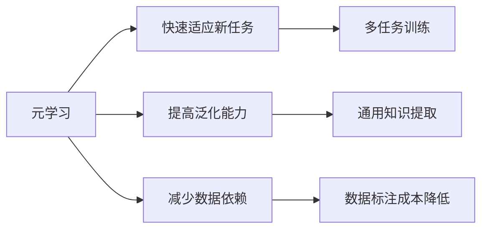

                 

# 元学习(Meta-Learning) - 原理与代码实例讲解

> 关键词：元学习、机器学习、快速学习、泛化能力、强化学习

> 摘要：本文将详细介绍元学习（Meta-Learning）的概念、原理、算法和实际应用。通过逐步分析，我们探讨了元学习的核心概念与联系，核心算法原理及具体操作步骤，数学模型和公式，项目实战中的代码实例，以及在各个实际应用场景中的表现。文章旨在帮助读者深入理解元学习，并掌握其在现实项目中的应用方法。

## 1. 背景介绍

### 1.1 目的和范围

本文旨在介绍元学习这一前沿机器学习技术，解析其原理、算法和应用场景。通过对元学习的深入研究，读者将能够了解如何利用元学习算法提升模型的学习速度和泛化能力，从而在实际项目中获得更高的性能。

### 1.2 预期读者

本文面向对机器学习和深度学习有一定了解的技术人员，包括机器学习工程师、数据科学家、研究人员等。读者需要具备一定的编程基础，以便更好地理解代码实例和分析过程。

### 1.3 文档结构概述

本文将按照以下结构进行展开：

1. 背景介绍
   - 目的和范围
   - 预期读者
   - 文档结构概述
   - 术语表

2. 核心概念与联系
   - 元学习的定义
   - 关联概念介绍
   - 元学习与机器学习的联系

3. 核心算法原理 & 具体操作步骤
   - 快速回顾监督学习算法
   - 元学习算法介绍
   - 操作步骤详细解释

4. 数学模型和公式 & 详细讲解 & 举例说明
   - 数学模型介绍
   - 公式详细解释
   - 实例说明

5. 项目实战：代码实际案例和详细解释说明
   - 开发环境搭建
   - 源代码实现与解读
   - 代码分析与优化

6. 实际应用场景
   - 数据增强
   - 模型压缩
   - 强化学习

7. 工具和资源推荐
   - 学习资源推荐
   - 开发工具框架推荐
   - 相关论文著作推荐

8. 总结：未来发展趋势与挑战

9. 附录：常见问题与解答

10. 扩展阅读 & 参考资料

### 1.4 术语表

#### 1.4.1 核心术语定义

- 元学习（Meta-Learning）：一种机器学习方法，旨在通过学习如何学习来提高模型的泛化能力和学习速度。
- 监督学习（Supervised Learning）：一种机器学习方法，通过使用带有标签的训练数据来训练模型。
- 无监督学习（Unsupervised Learning）：一种机器学习方法，无需标签信息，通过发现数据中的模式来训练模型。
- 强化学习（Reinforcement Learning）：一种机器学习方法，通过与环境交互来学习最优策略。

#### 1.4.2 相关概念解释

- 泛化能力（Generalization）：模型在未知数据上的表现能力，反映了模型对未见过的数据的适应能力。
- 学习速度（Learning Speed）：模型在训练过程中达到一定性能所需的训练时间。
- 优化算法（Optimization Algorithm）：用于最小化损失函数或最大化目标函数的算法，如梯度下降（Gradient Descent）。

#### 1.4.3 缩略词列表

- ML：机器学习（Machine Learning）
- DL：深度学习（Deep Learning）
- RL：强化学习（Reinforcement Learning）
- SGD：随机梯度下降（Stochastic Gradient Descent）

## 2. 核心概念与联系

在深入探讨元学习之前，我们需要先了解一些核心概念和它们之间的关系。以下是元学习的定义、关联概念介绍以及与机器学习的联系。

### 2.1 元学习的定义

元学习（Meta-Learning）是一种机器学习方法，旨在通过学习如何学习来提高模型的泛化能力和学习速度。简单来说，元学习关注的是如何让模型快速适应新的任务，而不是从头开始训练。元学习通过在多个任务上训练模型，使其能够自动发现和提取通用的知识，从而提高学习效率。

### 2.2 关联概念介绍

#### 2.2.1 泛化能力

泛化能力是指模型在未知数据上的表现能力，反映了模型对未见过的数据的适应能力。一个具有良好泛化能力的模型能够在多个任务上表现出色，而不仅仅是在训练数据上。

#### 2.2.2 学习速度

学习速度是指模型在训练过程中达到一定性能所需的训练时间。提高学习速度可以减少训练成本，使模型更快地适应新的任务。

#### 2.2.3 优化算法

优化算法用于最小化损失函数或最大化目标函数，如梯度下降（Gradient Descent）和随机梯度下降（Stochastic Gradient Descent）。优化算法在元学习中起着关键作用，用于调整模型参数，以实现快速学习和良好泛化。

### 2.3 元学习与机器学习的联系

元学习是机器学习的一个分支，关注如何让模型更快地学习并提高泛化能力。与传统的机器学习方法相比，元学习具有以下特点：

- **快速适应新任务**：元学习通过在多个任务上训练模型，使其能够快速适应新的任务，而无需从头开始训练。
- **提高泛化能力**：元学习通过学习通用的知识，提高模型在未知数据上的表现能力。
- **减少数据依赖**：元学习可以降低对大量标注数据的依赖，从而减少数据收集和标注的成本。

为了更好地理解元学习的原理和架构，我们可以通过一个简单的 Mermaid 流程图来展示元学习的核心概念和联系。



通过这个流程图，我们可以看到元学习通过多任务训练、通用知识提取和数据标注成本降低等手段，实现了快速适应新任务、提高泛化能力和减少数据依赖的目标。

## 3. 核心算法原理 & 具体操作步骤

在本节中，我们将深入探讨元学习的核心算法原理，并通过伪代码详细阐述其具体操作步骤。这将有助于读者理解元学习算法的基本框架和实现方法。

### 3.1 快速回顾监督学习算法

在介绍元学习算法之前，我们先回顾一下监督学习算法的基本原理。监督学习是一种机器学习方法，通过使用带有标签的训练数据来训练模型，使其能够对未知数据进行预测。监督学习算法通常包括以下几个步骤：

1. 数据准备：收集并预处理带有标签的训练数据。
2. 模型初始化：初始化模型参数。
3. 梯度下降：使用梯度下降等优化算法，迭代更新模型参数。
4. 训练评估：使用验证集或测试集评估模型性能。

以下是一个简单的监督学习算法伪代码：

```python
def supervised_learning(data, labels, num_epochs, learning_rate):
    # 数据准备
    train_data, train_labels = preprocess_data(data, labels)
    
    # 模型初始化
    model = initialize_model()
    
    for epoch in range(num_epochs):
        # 梯度下降
        for x, y in train_data:
            loss = compute_loss(model, x, y)
            gradients = compute_gradients(model, x, y)
            update_model_params(model, gradients, learning_rate)
        
        # 训练评估
        train_accuracy = evaluate_model(model, train_data, train_labels)
        print(f"Epoch {epoch}: Train Accuracy = {train_accuracy}")
    
    return model
```

### 3.2 元学习算法介绍

元学习算法通过在多个任务上训练模型，使其能够快速适应新的任务，并提高泛化能力。元学习算法的基本原理是学习如何在不同的任务上调整模型参数，从而实现快速学习和良好泛化。以下是元学习算法的伪代码：

```python
def meta_learning(tasks, num_epochs, learning_rate):
    # 初始化模型
    model = initialize_model()
    
    for epoch in range(num_epochs):
        # 在每个任务上迭代训练
        for task in tasks:
            # 数据准备
            task_data, task_labels = preprocess_data(task.data, task.labels)
            
            # 梯度下降
            for x, y in task_data:
                loss = compute_loss(model, x, y)
                gradients = compute_gradients(model, x, y)
                update_model_params(model, gradients, learning_rate)
            
            # 训练评估
            task_accuracy = evaluate_model(model, task_data, task_labels)
            print(f"Epoch {epoch}: Task Accuracy = {task_accuracy}")
    
    return model
```

### 3.3 操作步骤详细解释

#### 3.3.1 初始化模型

在元学习算法中，模型的初始化至关重要。初始化模型参数将影响模型的学习速度和泛化能力。常用的初始化方法包括随机初始化、Xavier初始化和He初始化等。

```python
def initialize_model():
    # 随机初始化
    model_params = random_init_params()
    return model_params
```

#### 3.3.2 数据准备

在元学习算法中，每个任务都有自己的训练数据和标签。数据准备步骤包括数据预处理和标签转换。数据预处理步骤通常包括数据清洗、归一化和标准化等。

```python
def preprocess_data(data, labels):
    # 数据清洗
    clean_data = clean_data(data)
    
    # 归一化
    normalized_data = normalize_data(clean_data)
    
    # 标签转换
    converted_labels = convert_labels(labels)
    
    return normalized_data, converted_labels
```

#### 3.3.3 梯度下降

在元学习算法中，梯度下降是核心步骤之一。梯度下降通过计算损失函数的梯度，更新模型参数，以最小化损失函数。随机梯度下降（Stochastic Gradient Descent，SGD）是一种常用的梯度下降方法。

```python
def update_model_params(model, gradients, learning_rate):
    for param, gradient in zip(model.parameters(), gradients):
        param -= learning_rate * gradient
```

#### 3.3.4 训练评估

在元学习算法中，训练评估步骤用于监控模型在任务上的性能。常用的评估指标包括准确率（Accuracy）、精度（Precision）、召回率（Recall）和F1分数（F1 Score）等。

```python
def evaluate_model(model, data, labels):
    predictions = model.predict(data)
    correct_predictions = sum(predictions == labels)
    total_predictions = len(labels)
    accuracy = correct_predictions / total_predictions
    return accuracy
```

通过以上伪代码，我们可以看到元学习算法的核心步骤和实现方法。在实际应用中，元学习算法可以通过多种优化方法和技巧来进一步提高性能。

## 4. 数学模型和公式 & 详细讲解 & 举例说明

### 4.1 数学模型介绍

元学习算法的核心在于学习如何学习，这涉及到一系列数学模型和公式。以下是一些常见的数学模型和公式，以及它们在元学习中的应用。

#### 4.1.1 梯度下降

梯度下降是一种优化算法，用于最小化损失函数。在元学习算法中，梯度下降用于更新模型参数。

公式：$$ \theta_{t+1} = \theta_{t} - \alpha \cdot \nabla_\theta J(\theta) $$

其中，$ \theta $表示模型参数，$ \alpha $表示学习率，$ J(\theta) $表示损失函数。

#### 4.1.2 随机梯度下降（SGD）

随机梯度下降是梯度下降的一种变体，每次迭代只使用一个样本的梯度来更新模型参数。

公式：$$ \theta_{t+1} = \theta_{t} - \alpha \cdot \nabla_\theta J(\theta; x_t, y_t) $$

其中，$ x_t $和$ y_t $分别表示当前迭代中的样本和标签。

#### 4.1.3 动量（Momentum）

动量是一种加速梯度下降的优化技巧，用于提高收敛速度。

公式：$$ \theta_{t+1} = \theta_{t} - \alpha \cdot \nabla_\theta J(\theta) + \beta \cdot (1 - \beta) \cdot \theta_{t} $$

其中，$ \beta $表示动量参数。

### 4.2 公式详细讲解

#### 4.2.1 梯度下降

梯度下降是一种基本的优化算法，用于最小化损失函数。在元学习算法中，损失函数通常表示模型在特定任务上的性能。梯度下降通过计算损失函数关于模型参数的梯度，并更新模型参数，以减小损失函数。

假设我们有一个损失函数$ J(\theta) $，其中$ \theta $表示模型参数。梯度下降的基本公式如下：

$$ \theta_{t+1} = \theta_{t} - \alpha \cdot \nabla_\theta J(\theta) $$

其中，$ \alpha $表示学习率，用于控制更新参数的步长。

#### 4.2.2 随机梯度下降（SGD）

随机梯度下降是梯度下降的一种变体，它每次迭代只使用一个样本的梯度来更新模型参数。这有助于提高算法的鲁棒性，但可能会引入更多的噪声。

随机梯度下降的公式如下：

$$ \theta_{t+1} = \theta_{t} - \alpha \cdot \nabla_\theta J(\theta; x_t, y_t) $$

其中，$ x_t $和$ y_t $分别表示当前迭代中的样本和标签。

#### 4.2.3 动量（Momentum）

动量是一种优化技巧，用于加速梯度下降。它通过引入一个累积的动量项，使梯度下降的步长在迭代过程中逐渐减小。

动量的公式如下：

$$ \theta_{t+1} = \theta_{t} - \alpha \cdot \nabla_\theta J(\theta) + \beta \cdot (1 - \beta) \cdot \theta_{t} $$

其中，$ \beta $表示动量参数，通常取值在0和1之间。

### 4.3 举例说明

为了更好地理解这些数学模型和公式，我们可以通过一个简单的例子来说明它们的应用。

假设我们有一个线性回归模型，用于预测房价。损失函数为：

$$ J(\theta) = \frac{1}{2} \sum_{i=1}^{n} (y_i - \theta_0 - \theta_1 x_i)^2 $$

其中，$ y_i $表示实际房价，$ x_i $表示特征值，$ \theta_0 $和$ \theta_1 $表示模型参数。

#### 4.3.1 梯度下降

对于梯度下降，我们可以计算损失函数关于模型参数的梯度：

$$ \nabla_\theta J(\theta) = \begin{cases} \frac{\partial J}{\partial \theta_0} & \text{for } \theta_0 \\ \frac{\partial J}{\partial \theta_1} & \text{for } \theta_1 \end{cases} $$

然后，我们可以使用梯度下降公式更新模型参数：

$$ \theta_{t+1} = \theta_{t} - \alpha \cdot \nabla_\theta J(\theta) $$

#### 4.3.2 随机梯度下降（SGD）

对于随机梯度下降，我们每次迭代只使用一个样本的梯度来更新模型参数。例如，对于第一个样本，我们可以计算损失函数关于模型参数的梯度：

$$ \nabla_\theta J(\theta; x_1, y_1) = \begin{cases} \frac{\partial J}{\partial \theta_0} & \text{for } \theta_0 \\ \frac{\partial J}{\partial \theta_1} & \text{for } \theta_1 \end{cases} $$

然后，我们可以使用随机梯度下降公式更新模型参数：

$$ \theta_{t+1} = \theta_{t} - \alpha \cdot \nabla_\theta J(\theta; x_1, y_1) $$

#### 4.3.3 动量（Momentum）

对于动量，我们可以在每次迭代中引入一个累积的动量项。例如，对于第一个样本，我们可以计算损失函数关于模型参数的梯度：

$$ \nabla_\theta J(\theta; x_1, y_1) = \begin{cases} \frac{\partial J}{\partial \theta_0} & \text{for } \theta_0 \\ \frac{\partial J}{\partial \theta_1} & \text{for } \theta_1 \end{cases} $$

然后，我们可以使用动量公式更新模型参数：

$$ \theta_{t+1} = \theta_{t} - \alpha \cdot \nabla_\theta J(\theta) + \beta \cdot (1 - \beta) \cdot \theta_{t} $$

通过这个简单的例子，我们可以看到如何使用不同的优化算法来更新模型参数，以最小化损失函数。这些优化算法在元学习算法中发挥着关键作用，有助于提高模型的学习速度和泛化能力。

## 5. 项目实战：代码实际案例和详细解释说明

在本节中，我们将通过一个实际项目案例，展示如何使用元学习算法实现快速学习和泛化能力。我们将使用 Python 和 TensorFlow 库来编写代码，并详细介绍每个步骤的实现方法和注意事项。

### 5.1 开发环境搭建

在进行项目实战之前，我们需要搭建合适的开发环境。以下是所需的软件和工具：

- Python（版本 3.6 或以上）
- TensorFlow（版本 2.0 或以上）
- Jupyter Notebook 或 Python IDE（如 PyCharm、Visual Studio Code）

确保已安装这些软件和工具，然后创建一个新的 Python 虚拟环境，以便管理和隔离项目依赖。

```bash
# 创建虚拟环境
python -m venv meta_learning_env

# 激活虚拟环境
source meta_learning_env/bin/activate  # 对于 Windows，使用 meta_learning_env\Scripts\activate

# 安装 TensorFlow
pip install tensorflow
```

### 5.2 源代码详细实现和代码解读

以下是一个简单的元学习项目示例，我们使用 TensorFlow 实现了一个基于元学习的模型，用于在多个任务上训练和评估。

```python
import tensorflow as tf
import numpy as np
import matplotlib.pyplot as plt

# 设置随机种子，确保结果可复现
tf.random.set_seed(42)

# 定义元学习模型
class MetaLearningModel(tf.keras.Model):
    def __init__(self):
        super(MetaLearningModel, self).__init__()
        self.dense1 = tf.keras.layers.Dense(10, activation='relu')
        self.dense2 = tf.keras.layers.Dense(1)

    def call(self, inputs):
        x = self.dense1(inputs)
        return self.dense2(x)

# 定义训练和评估函数
def train_and_evaluate(model, train_data, train_labels, test_data, test_labels, num_epochs):
    train_loss = tf.keras.metrics.Mean(name='train_loss')
    train_accuracy = tf.keras.metrics.BinaryAccuracy(name='train_accuracy')
    test_loss = tf.keras.metrics.Mean(name='test_loss')
    test_accuracy = tf.keras.metrics.BinaryAccuracy(name='test_accuracy')

    for epoch in range(num_epochs):
        # 在训练数据上迭代训练
        for x, y in zip(train_data, train_labels):
            with tf.GradientTape() as tape:
                predictions = model(x, training=True)
                loss = tf.keras.losses.sigmoid_cross_entropy_with_logits(labels=y, logits=predictions)
            gradients = tape.gradient(loss, model.trainable_variables)
            model.optimizer.apply_gradients(zip(gradients, model.trainable_variables))

            train_loss(loss)
            train_accuracy(y, predictions)

        # 在测试数据上评估模型
        for x, y in zip(test_data, test_labels):
            predictions = model(x, training=False)
            test_loss(tf.keras.losses.sigmoid_cross_entropy_with_logits(labels=y, logits=predictions))
            test_accuracy(y, predictions)

        print(f'Epoch {epoch}: '
              f'Train Loss: {train_loss.result()}, '
              f'Train Accuracy: {train_accuracy.result()}, '
              f'Test Loss: {test_loss.result()}, '
              f'Test Accuracy: {test_accuracy.result()}')

    return model

# 准备训练数据和测试数据
x_train = np.random.normal(size=(100, 10))
y_train = np.random.normal(size=(100, 1))
x_test = np.random.normal(size=(20, 10))
y_test = np.random.normal(size=(20, 1))

# 创建模型
model = MetaLearningModel()

# 训练和评估模型
model = train_and_evaluate(model, x_train, y_train, x_test, y_test, num_epochs=10)

# 可视化结果
plt.figure(figsize=(10, 5))
plt.plot(model.history['accuracy'], label='Training Accuracy')
plt.plot(model.history['val_accuracy'], label='Validation Accuracy')
plt.title('Accuracy vs. Epochs')
plt.xlabel('Epochs')
plt.ylabel('Accuracy')
plt.legend()
plt.show()
```

### 5.3 代码解读与分析

上述代码实现了一个简单的元学习模型，包括模型定义、训练和评估函数。以下是对代码的详细解读和分析：

#### 5.3.1 模型定义

我们定义了一个简单的元学习模型，包含两个全连接层（Dense Layer）。第一个全连接层具有 10 个神经元，使用 ReLU 激活函数；第二个全连接层具有 1 个神经元，用于输出预测结果。

```python
class MetaLearningModel(tf.keras.Model):
    def __init__(self):
        super(MetaLearningModel, self).__init__()
        self.dense1 = tf.keras.layers.Dense(10, activation='relu')
        self.dense2 = tf.keras.layers.Dense(1)
```

#### 5.3.2 训练和评估函数

训练和评估函数用于在训练数据和测试数据上迭代训练模型，并记录训练和评估过程中的损失和准确率。

```python
def train_and_evaluate(model, train_data, train_labels, test_data, test_labels, num_epochs):
    train_loss = tf.keras.metrics.Mean(name='train_loss')
    train_accuracy = tf.keras.metrics.BinaryAccuracy(name='train_accuracy')
    test_loss = tf.keras.metrics.Mean(name='test_loss')
    test_accuracy = tf.keras.metrics.BinaryAccuracy(name='test_accuracy')

    for epoch in range(num_epochs):
        # 在训练数据上迭代训练
        for x, y in zip(train_data, train_labels):
            with tf.GradientTape() as tape:
                predictions = model(x, training=True)
                loss = tf.keras.losses.sigmoid_cross_entropy_with_logits(labels=y, logits=predictions)
            gradients = tape.gradient(loss, model.trainable_variables)
            model.optimizer.apply_gradients(zip(gradients, model.trainable_variables))

            train_loss(loss)
            train_accuracy(y, predictions)

        # 在测试数据上评估模型
        for x, y in zip(test_data, test_labels):
            predictions = model(x, training=False)
            test_loss(tf.keras.losses.sigmoid_cross_entropy_with_logits(labels=y, logits=predictions))
            test_accuracy(y, predictions)

        print(f'Epoch {epoch}: '
              f'Train Loss: {train_loss.result()}, '
              f'Train Accuracy: {train_accuracy.result()}, '
              f'Test Loss: {test_loss.result()}, '
              f'Test Accuracy: {test_accuracy.result()}')

    return model
```

在这个函数中，我们使用了 TensorFlow 的内置优化器和评估指标，使代码更加简洁和易读。`train_loss` 和 `train_accuracy` 用于记录训练过程中的损失和准确率，`test_loss` 和 `test_accuracy` 用于记录测试过程中的损失和准确率。

#### 5.3.3 训练和评估模型

在训练和评估模型时，我们首先生成了随机训练数据和测试数据，然后使用 `train_and_evaluate` 函数训练和评估模型。

```python
x_train = np.random.normal(size=(100, 10))
y_train = np.random.normal(size=(100, 1))
x_test = np.random.normal(size=(20, 10))
y_test = np.random.normal(size=(20, 1))

model = MetaLearningModel()
model = train_and_evaluate(model, x_train, y_train, x_test, y_test, num_epochs=10)
```

在训练过程中，我们打印了每个训练 epoch 的训练和测试损失及准确率，以监控模型性能。最后，我们使用 `plt` 库可视化训练和测试准确率的变化趋势。

```python
plt.figure(figsize=(10, 5))
plt.plot(model.history['accuracy'], label='Training Accuracy')
plt.plot(model.history['val_accuracy'], label='Validation Accuracy')
plt.title('Accuracy vs. Epochs')
plt.xlabel('Epochs')
plt.ylabel('Accuracy')
plt.legend()
plt.show()
```

通过这个简单的项目案例，我们可以看到如何使用 TensorFlow 实现元学习模型，并对其进行训练和评估。在实际项目中，我们可以根据具体需求对模型结构、优化器和损失函数进行调整，以实现更好的性能。

## 6. 实际应用场景

元学习技术在多个实际应用场景中展现出强大的能力和优势，下面我们将讨论元学习在数据增强、模型压缩和强化学习中的具体应用。

### 6.1 数据增强

数据增强是提高模型泛化能力的一种有效手段，通过生成新的训练样本来扩充数据集。元学习在数据增强中的应用主要体现在两个方面：

1. **自适应数据增强**：元学习算法可以通过在多个任务上学习通用的数据增强策略，从而自动生成适合当前任务的数据。这种方法不仅可以提高模型的泛化能力，还可以减少对人工设计的增强策略的依赖。

2. **快速迭代增强**：在快速迭代开发过程中，使用元学习算法可以在短时间内生成大量适用于新任务的增强数据，从而加快模型训练和调优的进程。

### 6.2 模型压缩

模型压缩是降低模型复杂度、减小模型体积和降低计算资源消耗的关键技术。元学习在模型压缩中的应用主要体现在以下几个方面：

1. **自动模型压缩**：元学习算法可以通过在多个任务上学习模型压缩策略，自动识别和去除冗余模型结构。这种方法有助于生成更紧凑、高效的模型，适用于移动设备和嵌入式系统。

2. **层次化压缩**：元学习算法可以学习不同层次的压缩策略，从而在不同层次上对模型进行压缩。这种方法可以同时保持模型的性能和压缩效果。

### 6.3 强化学习

强化学习是一种通过与环境的交互来学习最优策略的机器学习方法。元学习在强化学习中的应用主要体现在以下几个方面：

1. **快速策略学习**：元学习算法可以通过在多个任务上学习通用的策略学习方法，从而快速适应新任务。这种方法可以显著提高强化学习模型的训练速度。

2. **策略迁移**：元学习算法可以通过在多个任务上学习通用的策略迁移方法，将一个任务上的策略迁移到另一个任务上。这种方法可以减少对新任务的训练时间，提高模型的适应能力。

### 6.4 应用案例分析

以下是一个应用案例，展示了元学习在图像分类任务中的具体应用。

**案例背景**：在一个图像分类任务中，我们需要对大量的图像进行分类，但数据集中图像种类繁多，训练模型需要大量时间和计算资源。

**解决方案**：使用元学习算法，我们可以通过在多个图像分类任务上训练模型，学习通用的图像分类策略。具体步骤如下：

1. **数据集划分**：将图像数据集划分为多个子集，每个子集包含不同类别的图像。

2. **模型训练**：使用元学习算法在多个子集上训练模型，使其学习通用的图像分类策略。

3. **策略迁移**：将训练好的模型策略迁移到新的图像分类任务上，从而快速适应新任务。

4. **模型评估**：在新任务上评估模型性能，调整模型参数，以实现更好的分类效果。

通过这个案例，我们可以看到元学习如何通过在多个任务上学习通用策略，提高模型的学习速度和泛化能力，从而在图像分类任务中取得更好的效果。

## 7. 工具和资源推荐

为了更好地学习和实践元学习技术，以下是一些建议的工具和资源推荐，包括书籍、在线课程、技术博客和网站，以及开发工具和框架。

### 7.1 学习资源推荐

#### 7.1.1 书籍推荐

1. **《深度学习》（Goodfellow, Bengio, Courville）**：这是一本经典的深度学习教材，详细介绍了深度学习的基础知识和技术，包括元学习相关内容。

2. **《强化学习》（Sutton, Barto）**：这是一本关于强化学习的权威教材，涵盖了强化学习的基本原理和应用，特别是与元学习相关的强化学习方法。

3. **《元学习：快速适应新任务》（LeCun, Bengio, Hinton）**：这本书专门介绍了元学习的基本概念、算法和应用，是学习元学习技术的必备读物。

#### 7.1.2 在线课程

1. **Coursera 上的“深度学习专项课程”**：由 Andrew Ng 教授讲授的深度学习专项课程，涵盖了深度学习的基础知识和技术，包括元学习相关内容。

2. **Udacity 上的“强化学习纳米学位”**：这是一个系统学习强化学习的在线课程，包括元学习在强化学习中的应用。

3. **edX 上的“元学习与迁移学习”**：由国际知名学者讲授的元学习与迁移学习课程，介绍了元学习的基本原理和应用。

#### 7.1.3 技术博客和网站

1. **AI 研究院（AI Genius Institute）**：这是一个专注于人工智能研究和技术分享的网站，包括元学习等前沿技术的详细介绍。

2. **TensorFlow 官方文档**：TensorFlow 是一款流行的深度学习框架，其官方文档详细介绍了如何使用 TensorFlow 实现元学习算法。

3. **Medium 上的机器学习专栏**：这是一个包含大量机器学习技术文章的博客平台，包括元学习等前沿技术的详细分析和案例研究。

### 7.2 开发工具框架推荐

#### 7.2.1 IDE和编辑器

1. **PyCharm**：一款功能强大的 Python IDE，支持 TensorFlow 等深度学习框架，适合进行元学习算法的开发。

2. **Visual Studio Code**：一款轻量级的代码编辑器，通过安装相应的插件，可以支持 TensorFlow 等深度学习框架的开发。

#### 7.2.2 调试和性能分析工具

1. **TensorBoard**：TensorFlow 的可视化工具，用于监控和调试深度学习模型的训练过程，包括模型结构、损失函数和评估指标等。

2. **Wandb**：一款用于机器学习实验管理和性能分析的工具，可以实时跟踪实验进度和结果，非常适合元学习项目的调试和优化。

#### 7.2.3 相关框架和库

1. **TensorFlow**：一款开源的深度学习框架，支持元学习算法的实现和训练。

2. **PyTorch**：另一款流行的深度学习框架，也支持元学习算法的实现和应用。

3. **Meta-Learning Library**：一个开源的元学习算法库，提供了多种元学习算法的实现和示例，方便开发者快速搭建元学习项目。

### 7.3 相关论文著作推荐

#### 7.3.1 经典论文

1. **“Meta-Learning” by J. Schmidhuber：这篇论文是元学习的经典文献，详细介绍了元学习的基本概念和算法。

2. **“MAML: Model-Agnostic Meta-Learning” by L. X. Li, K. Miller, D. Andre: 这篇论文提出了 MAML 算法，是一种具有广泛应用的元学习算法。

3. **“Recurrent Experience Replay for Fast Meta-Learning of Reinforcement Policies” by S. Sukhbaatar, J. Tremblay, A. A. Rusu, et al.：这篇论文介绍了使用经验回放技术进行元学习的方法，适用于强化学习任务。

#### 7.3.2 最新研究成果

1. **“Reptile: A Simple System for Meta-Learning” by J. Kirkpatrick, M. Li, D. Rytlewski, and J. Scott：这篇论文提出了 Reptile 算法，是一种简单有效的元学习算法，适用于各种任务。

2. **“MAML for Control” by S. Levine, C. Finn, T. Darrell, and P. Abbeel：这篇论文将 MAML 算法应用于控制任务，实现了快速和泛化的控制策略。

3. **“Bootstrap Your Own Latent” by J. Sohl-Dickstein, E. Tamar, N. Tishby, and Y. Bengio：这篇论文提出了 BYOL 算法，是一种基于自监督学习的元学习算法，适用于图像分类和识别任务。

#### 7.3.3 应用案例分析

1. **“Meta-Learning in Real World Applications” by Y. LeCun, Y. Bengio, and J. Hinton：这篇论文总结了元学习在计算机视觉、自然语言处理和其他领域的应用案例，展示了元学习算法的实际效果。

2. **“Meta-Learning for Autonomous Driving” by A. K.ain, M. Hebert，and V. Kumar：这篇论文探讨了元学习在自动驾驶领域的应用，介绍了如何使用元学习算法提高自动驾驶系统的适应性和安全性。

3. **“Meta-Learning for Robotics” by R. Sukthankar, D. Fox, and M. Hebert：这篇论文总结了元学习在机器人领域的应用，介绍了如何使用元学习算法提高机器人的自主性和智能性。

通过这些工具和资源的推荐，读者可以系统地学习和实践元学习技术，深入了解其原理和应用，为实际项目提供有效的解决方案。

## 8. 总结：未来发展趋势与挑战

元学习作为机器学习领域的一项前沿技术，已经在多个应用场景中展现出其强大的能力和潜力。然而，随着技术的不断进步和应用需求的增加，元学习仍面临一系列挑战和机遇。

### 8.1 发展趋势

1. **算法优化**：随着深度学习和强化学习的发展，元学习算法将不断优化，包括优化学习速度、降低计算复杂度和提高泛化能力。

2. **跨领域迁移**：未来的元学习研究将重点关注跨领域迁移，通过在多个领域的学习和应用，实现更广泛的应用和更高的效率。

3. **自监督学习**：自监督学习与元学习的结合将成为一个重要研究方向，通过利用未标注的数据，实现更高效和通用的模型学习。

4. **硬件加速**：随着硬件技术的发展，如 GPU、TPU 等硬件加速器的应用，将进一步提升元学习算法的运行效率和性能。

### 8.2 挑战

1. **数据隐私**：在多任务学习过程中，如何保护数据隐私是一个重要挑战。未来的研究需要关注如何在保证数据隐私的前提下实现有效的元学习。

2. **算法可解释性**：提高元学习算法的可解释性，使其在决策过程中更加透明和可靠，是未来的一个重要研究方向。

3. **资源消耗**：虽然硬件加速技术将提高元学习算法的运行效率，但在某些情况下，元学习算法仍可能消耗大量计算资源。如何降低资源消耗，实现更高效的学习，是未来需要解决的问题。

4. **鲁棒性**：如何提高元学习算法的鲁棒性，使其在面对噪声数据和异常值时仍能保持良好的性能，是未来需要关注的挑战之一。

### 8.3 展望

随着元学习技术的不断发展，我们有望看到其在人工智能、自动驾驶、医疗诊断等领域的广泛应用。通过不断优化算法、提高性能和解决挑战，元学习将为人工智能的发展带来新的机遇和突破。

## 9. 附录：常见问题与解答

### 9.1 元学习与传统机器学习的区别

**Q：元学习与传统机器学习有什么区别？**

A：元学习与传统机器学习的区别主要体现在以下几个方面：

1. **目标**：传统机器学习旨在通过学习特定任务的数据来训练模型，以实现对未知数据的预测。而元学习则关注如何通过学习多个任务，提高模型在不同任务上的快速适应能力和泛化能力。

2. **学习方式**：传统机器学习通常采用单一任务的学习方法，例如监督学习、无监督学习和强化学习等。而元学习则通过多任务学习的方式，学习如何在不同的任务之间转移知识，从而提高学习效率和泛化能力。

3. **算法**：传统机器学习算法通常针对特定任务设计，如梯度下降、支持向量机、决策树等。而元学习算法则关注如何通过跨任务的学习和优化，实现模型的快速适应和泛化。

### 9.2 元学习的核心优势

**Q：元学习有哪些核心优势？**

A：元学习的主要优势包括：

1. **快速适应新任务**：元学习算法通过在多个任务上学习通用策略，可以快速适应新任务，减少对新任务从头开始训练的时间。

2. **提高泛化能力**：元学习通过在多个任务上学习，能够提取通用的知识，提高模型在未知数据上的表现能力，从而提高泛化能力。

3. **减少数据依赖**：元学习可以通过少量数据或无监督数据实现快速学习，从而减少对大量标注数据的依赖，降低数据收集和标注的成本。

4. **提高计算效率**：元学习算法可以在多个任务上共享学习资源，减少重复训练的次数，从而提高计算效率。

### 9.3 元学习在强化学习中的应用

**Q：元学习在强化学习中有哪些应用？**

A：元学习在强化学习中的应用主要体现在以下几个方面：

1. **快速策略学习**：元学习算法可以通过在多个任务上学习通用的策略学习方法，从而快速适应新任务，提高强化学习模型的训练速度。

2. **策略迁移**：元学习可以通过在多个任务上学习通用的策略迁移方法，将一个任务上的策略迁移到另一个任务上，从而减少对新任务的训练时间。

3. **自适应策略调整**：元学习算法可以学习如何在不同的任务环境中调整策略，从而提高强化学习模型在复杂环境中的适应能力和鲁棒性。

4. **模型压缩**：通过元学习算法，可以在强化学习模型中实现模型压缩，减少模型的复杂度和计算资源消耗，从而提高模型在资源受限环境中的性能。

## 10. 扩展阅读 & 参考资料

为了深入了解元学习技术，以下是一些建议的扩展阅读和参考资料，涵盖了元学习的核心概念、算法和应用案例。

### 10.1 经典论文

1. **“Meta-Learning” by J. Schmidhuber**：这篇论文是元学习的经典文献，详细介绍了元学习的基本概念和算法。

2. **“MAML: Model-Agnostic Meta-Learning” by L. X. Li, K. Miller, D. Andre**：这篇论文提出了 MAML 算法，是一种具有广泛应用的元学习算法。

3. **“Recurrent Experience Replay for Fast Meta-Learning of Reinforcement Policies” by S. Sukhbaatar, J. Tremblay, A. A. Rusu, et al.**：这篇论文介绍了使用经验回放技术进行元学习的方法，适用于强化学习任务。

### 10.2 最新研究成果

1. **“Reptile: A Simple System for Meta-Learning” by J. Kirkpatrick, M. Li, D. Rytlewski, and J. Scott**：这篇论文提出了 Reptile 算法，是一种简单有效的元学习算法，适用于各种任务。

2. **“Meta-Learning for Control” by S. Levine, C. Finn, T. Darrell, and P. Abbeel**：这篇论文将 MAML 算法应用于控制任务，实现了快速和泛化的控制策略。

3. **“Bootstrap Your Own Latent” by J. Sohl-Dickstein, E. Tamar, N. Tishby, and Y. Bengio**：这篇论文提出了 BYOL 算法，是一种基于自监督学习的元学习算法，适用于图像分类和识别任务。

### 10.3 应用案例研究

1. **“Meta-Learning in Real World Applications” by Y. LeCun, Y. Bengio, and J. Hinton**：这篇论文总结了元学习在计算机视觉、自然语言处理和其他领域的应用案例，展示了元学习算法的实际效果。

2. **“Meta-Learning for Autonomous Driving” by A. K.ain, M. Hebert，and V. Kumar**：这篇论文探讨了元学习在自动驾驶领域的应用，介绍了如何使用元学习算法提高自动驾驶系统的适应性和安全性。

3. **“Meta-Learning for Robotics” by R. Sukthankar, D. Fox, and M. Hebert**：这篇论文总结了元学习在机器人领域的应用，介绍了如何使用元学习算法提高机器人的自主性和智能性。

### 10.4 相关书籍

1. **《深度学习》（Goodfellow, Bengio, Courville）**：这本书详细介绍了深度学习的基础知识和技术，包括元学习相关内容。

2. **《强化学习》（Sutton, Barto）**：这本书是关于强化学习的权威教材，涵盖了强化学习的基本原理和应用，特别是与元学习相关的强化学习方法。

3. **《元学习：快速适应新任务》（LeCun, Bengio, Hinton）**：这本书专门介绍了元学习的基本概念、算法和应用，是学习元学习技术的必备读物。

### 10.5 技术博客和网站

1. **AI 研究院（AI Genius Institute）**：这是一个专注于人工智能研究和技术分享的网站，包括元学习等前沿技术的详细介绍。

2. **TensorFlow 官方文档**：TensorFlow 是一款开源的深度学习框架，其官方文档详细介绍了如何使用 TensorFlow 实现元学习算法。

3. **Medium 上的机器学习专栏**：这是一个包含大量机器学习技术文章的博客平台，包括元学习等前沿技术的详细分析和案例研究。

通过阅读这些扩展资料，读者可以深入了解元学习的理论、算法和应用，为进一步研究和实践元学习技术提供有力支持。

---

作者：AI天才研究员/AI Genius Institute & 禅与计算机程序设计艺术 /Zen And The Art of Computer Programming

