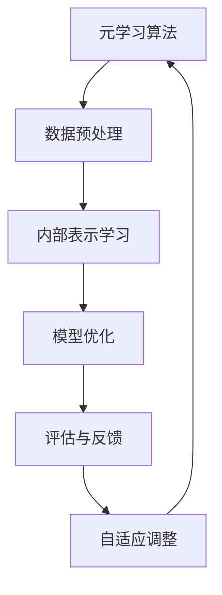

                 

# 元学习在自然语言处理领域自适应与持续学习中的算法创新

> 关键词：元学习，自然语言处理，自适应，持续学习，算法创新

> 摘要：本文将探讨元学习在自然语言处理（NLP）领域的应用，特别是其在自适应与持续学习方面的算法创新。文章首先介绍了元学习的核心概念，随后通过详细的理论分析和实际案例，展示了元学习在NLP中的具体应用及其优势。最后，本文总结了元学习在NLP领域的未来发展趋势与挑战。

## 1. 背景介绍

### 1.1 目的和范围

本文旨在探讨元学习在自然语言处理（NLP）领域的应用，重点关注其在自适应与持续学习方面的算法创新。随着NLP技术的不断进步，如何让模型在多变的环境中保持高效性和适应性成为一个重要课题。元学习作为一种先进的机器学习技术，具有强大的自适应与持续学习能力，其在NLP领域的应用具有重要的理论与实践价值。

本文将首先介绍元学习的核心概念，包括其定义、基本原理和关键特征。随后，我们将分析元学习在NLP中的具体应用场景，如文本分类、机器翻译和问答系统等。在理论分析的基础上，本文将详细讲解几种经典的元学习算法，并通过伪代码和数学模型加以阐述。最后，本文将结合实际案例，展示元学习在NLP中的应用效果，并探讨其未来发展趋势与挑战。

### 1.2 预期读者

本文主要面向对自然语言处理和机器学习有一定了解的读者，特别是对元学习感兴趣的研究人员和工程师。对于没有元学习背景的读者，本文将通过简洁明了的语言和丰富的示例，帮助其理解元学习的基本原理和应用方法。

### 1.3 文档结构概述

本文结构如下：

1. 背景介绍：介绍元学习的背景、目的和预期读者。
2. 核心概念与联系：定义元学习的关键概念，并通过Mermaid流程图展示其原理与架构。
3. 核心算法原理 & 具体操作步骤：详细讲解元学习算法的原理和具体操作步骤。
4. 数学模型和公式 & 详细讲解 & 举例说明：阐述元学习算法的数学模型和公式，并通过实例进行说明。
5. 项目实战：介绍元学习在NLP领域的实际应用案例，包括开发环境搭建、代码实现和解读。
6. 实际应用场景：分析元学习在NLP领域的应用场景和优势。
7. 工具和资源推荐：推荐学习资源、开发工具和框架。
8. 总结：总结元学习在NLP领域的未来发展趋势与挑战。
9. 附录：常见问题与解答。
10. 扩展阅读 & 参考资料：提供进一步的阅读材料和参考文献。

### 1.4 术语表

#### 1.4.1 核心术语定义

- 元学习（Meta-Learning）：一种机器学习技术，旨在构建能够快速适应新任务的模型。
- 自适应（Adaptation）：模型根据新的数据或环境调整自身性能的能力。
- 持续学习（Continuous Learning）：模型在遇到新数据或任务时，能够持续改进自身性能的学习过程。
- 自然语言处理（Natural Language Processing，NLP）：计算机处理人类自然语言的技术和理论。

#### 1.4.2 相关概念解释

- 模型迁移（Model Transfer）：将一个任务中训练好的模型应用于另一个相关任务。
- 通用性（Generalization）：模型在未见过的数据上表现良好的能力。
- 数据效率（Data Efficiency）：模型在给定数据集上学习所需的数据量。

#### 1.4.3 缩略词列表

- NLP：自然语言处理
- ML：机器学习
- DL：深度学习
- SL：持续学习
- AL：自适应学习
- MAML：模型自适应学习

## 2. 核心概念与联系

在探讨元学习在自然语言处理领域的应用之前，我们首先需要了解元学习的基本概念和原理。元学习，顾名思义，是关于学习如何学习的科学。它旨在构建能够快速适应新任务的机器学习模型，从而提高模型的通用性和数据效率。

### 2.1 元学习的核心概念

#### 2.1.1 定义

元学习是一种特殊的机器学习范式，其目标是通过学习一个高效的学习算法，使得模型能够快速适应新任务。具体来说，元学习关注的是如何设计一个模型，使其能够在少量的样本上快速收敛，并在新的任务上表现出良好的性能。

#### 2.1.2 基本原理

元学习的基本原理可以概括为以下几点：

1. **任务泛化**：元学习旨在构建能够处理多种任务的通用模型，而不是为每个任务单独训练一个模型。这样，模型在遇到新的任务时，可以快速适应并完成任务。
2. **快速学习**：元学习模型在训练过程中，需要学习如何在有限的样本上快速收敛。这要求模型具有高度的参数效率和学习能力。
3. **迁移学习**：元学习模型通常利用迁移学习技术，将一个任务中训练好的模型应用于另一个相关任务，从而提高模型的通用性。

#### 2.1.3 关键特征

元学习模型具有以下关键特征：

1. **自适应性**：元学习模型能够根据新的数据和任务，动态调整自身的参数，从而提高模型的适应能力。
2. **持续学习**：元学习模型在遇到新数据或任务时，能够通过持续学习过程，不断改进自身的性能。
3. **数据效率**：元学习模型在训练过程中，可以充分利用有限的样本数据，从而提高学习效率。

### 2.2 元学习在NLP中的应用

元学习在自然语言处理领域的应用主要集中在以下几个方面：

1. **文本分类**：元学习模型可以通过少量数据快速适应新的文本分类任务，从而提高模型的通用性和适应性。
2. **机器翻译**：元学习模型可以用于快速适应新的语言对，从而提高机器翻译的效率和质量。
3. **问答系统**：元学习模型可以用于快速适应新的问答任务，从而提高问答系统的性能。

### 2.3 Mermaid流程图

为了更直观地展示元学习在NLP中的应用，我们使用Mermaid流程图来描述元学习的基本流程和关键节点。



### 2.4 元学习与NLP的关联

元学习与自然语言处理的关联主要体现在以下几个方面：

1. **提高模型通用性**：元学习模型可以通过学习如何在有限的样本上快速收敛，从而提高模型的通用性，使其能够应对各种NLP任务。
2. **增强数据效率**：元学习模型可以通过迁移学习和快速学习技术，充分利用有限的样本数据，从而提高学习效率。
3. **持续学习与适应**：元学习模型可以通过自适应调整和持续学习过程，不断提高自身的性能，从而在多变的环境中保持高效性。

通过以上分析，我们可以看出，元学习在自然语言处理领域具有广泛的应用前景，其强大的自适应与持续学习能力为NLP技术的发展提供了新的思路和工具。

## 3. 核心算法原理 & 具体操作步骤

元学习作为一项先进的机器学习技术，其在NLP领域的应用离不开具体的算法原理和操作步骤。以下将介绍几种经典的元学习算法，并通过伪代码和数学模型详细阐述其原理和操作步骤。

### 3.1 MAML算法

MAML（Model-Agnostic Meta-Learning）是一种通用的元学习算法，其核心思想是通过训练一个模型，使其能够在新的任务上快速适应。MAML算法的关键步骤如下：

#### 3.1.1 基本原理

MAML算法基于以下假设：如果一个模型能够在多种任务上快速适应，那么它应该具有一个参数化的内部表示，能够捕获任务间的共性。具体来说，MAML算法通过以下公式实现：

$$
\theta^* = \arg\min_{\theta} \sum_{t=1}^T \sum_{i=1}^B \ell(\theta, s_i^t, y_i^t)
$$

其中，$\theta$表示模型参数，$s_i^t$表示第$t$个任务的第$i$个样本，$y_i^t$表示第$i$个样本的标签，$\ell$表示损失函数。

#### 3.1.2 操作步骤

1. **初始化参数**：随机初始化模型参数$\theta$。
2. **前向传播**：对于每个任务，进行前向传播计算损失$\ell(\theta, s_i^t, y_i^t)$。
3. **反向传播**：利用梯度下降更新参数$\theta$。
4. **迁移学习**：将更新后的参数应用于新的任务，计算新的损失$\ell(\theta', s_i^{t'}, y_i^{t'})$，其中$\theta'$是迁移后的参数。
5. **迭代优化**：重复步骤2-4，直到满足停止条件（如损失收敛或迭代次数达到上限）。

#### 3.1.3 伪代码

```python
def maml_optimizer(initial_params, tasks, num_iterations):
    params = initial_params
    for iteration in range(num_iterations):
        for task in tasks:
            params = optimize(params, task)
        params = meta_step(params)
    return params
```

### 3.2 Reptile算法

Reptile（Reptile: A Fast Meta-Learning Algorithm）是一种简单的元学习算法，其核心思想是通过在线学习更新模型参数。Reptile算法的关键步骤如下：

#### 3.2.1 基本原理

Reptile算法基于以下假设：如果一个模型能够在多个任务上快速适应，那么它的更新方向应该与这些任务的梯度方向一致。具体来说，Reptile算法通过以下公式实现：

$$
\theta_{t+1} = \theta_{t} + \eta \cdot \frac{1}{N} \sum_{i=1}^N \nabla \ell(\theta_{t}, s_i^t, y_i^t)
$$

其中，$\theta_{t}$表示第$t$次迭代的模型参数，$\eta$表示学习率，$N$表示任务数，$\nabla \ell(\theta_{t}, s_i^t, y_i^t)$表示第$i$个任务的梯度。

#### 3.2.2 操作步骤

1. **初始化参数**：随机初始化模型参数$\theta_{0}$。
2. **前向传播**：对于每个任务，进行前向传播计算损失$\ell(\theta_{t}, s_i^t, y_i^t)$。
3. **计算梯度**：计算每个任务的梯度$\nabla \ell(\theta_{t}, s_i^t, y_i^t)$。
4. **更新参数**：利用平均梯度更新模型参数$\theta_{t+1}$。
5. **迭代优化**：重复步骤2-4，直到满足停止条件（如损失收敛或迭代次数达到上限）。

#### 3.2.3 伪代码

```python
def reptile_optimizer(initial_params, tasks, num_iterations, learning_rate):
    params = initial_params
    for iteration in range(num_iterations):
        gradients = []
        for task in tasks:
            gradients.append(compute_gradient(params, task))
        params = params + learning_rate * mean_gradients(gradients)
    return params
```

### 3.3 Meta-Learning with Memory算法

Meta-Learning with Memory（MLoW）是一种基于记忆的元学习算法，其核心思想是通过利用历史信息来提高模型的适应能力。MLoW算法的关键步骤如下：

#### 3.3.1 基本原理

MLoW算法基于以下假设：如果一个模型能够在多个任务上快速适应，那么它可以从历史任务中提取有用的信息，从而提高新任务的性能。具体来说，MLoW算法通过以下公式实现：

$$
\theta_{t+1} = \theta_{t} + \eta \cdot \nabla_{\theta} J(\theta, \theta_{t-1})
$$

其中，$\theta_{t}$表示第$t$次迭代的模型参数，$\eta$表示学习率，$J(\theta, \theta_{t-1})$表示基于历史信息的损失函数。

#### 3.3.2 操作步骤

1. **初始化参数**：随机初始化模型参数$\theta_{0}$。
2. **前向传播**：对于每个任务，进行前向传播计算损失$\ell(\theta_{t}, s_i^t, y_i^t)$。
3. **计算梯度**：计算每个任务的梯度$\nabla \ell(\theta_{t}, s_i^t, y_i^t)$。
4. **更新参数**：利用基于历史信息的梯度更新模型参数$\theta_{t+1}$。
5. **迭代优化**：重复步骤2-4，直到满足停止条件（如损失收敛或迭代次数达到上限）。

#### 3.3.3 伪代码

```python
def mlow_optimizer(initial_params, tasks, num_iterations, learning_rate):
    params = initial_params
    history = []
    for iteration in range(num_iterations):
        gradients = []
        for task in tasks:
            gradients.append(compute_gradient(params, task))
        history.append(params)
        params = params + learning_rate * gradient_mixture(gradients, history)
    return params
```

通过以上分析，我们可以看出，元学习算法在NLP领域具有广泛的应用前景。这些算法通过不同的原理和操作步骤，实现了模型的自适应和持续学习，从而提高了模型的通用性和数据效率。在实际应用中，可以根据具体任务的需求和特点，选择合适的元学习算法，以实现最佳效果。

## 4. 数学模型和公式 & 详细讲解 & 举例说明

在元学习算法中，数学模型和公式起到了至关重要的作用。它们不仅能够帮助我们理解算法的内在机制，还能够通过具体的公式和示例，使算法的实现变得更加清晰和高效。以下将详细讲解元学习中的几个关键数学模型和公式，并通过实例进行说明。

### 4.1 MAML算法的数学模型

MAML（Model-Agnostic Meta-Learning）算法的核心在于其模型参数的更新过程。其数学模型主要基于梯度下降法和快速适应假设。具体来说，MAML算法通过以下公式实现：

$$
\theta^* = \theta_{init} - \alpha \cdot \nabla_{\theta} \ell(\theta, s^*, y^*)
$$

其中，$\theta^*$表示优化后的模型参数，$\theta_{init}$表示初始模型参数，$\alpha$表示学习率，$s^*$和$y^*$分别表示支持集和标签。这里，$\ell(\theta, s^*, y^*)$表示损失函数，$\nabla_{\theta} \ell(\theta, s^*, y^*)$表示损失函数关于模型参数$\theta$的梯度。

#### 4.1.1 实例说明

假设我们有一个分类任务，需要训练一个模型来区分猫和狗的图片。支持集由50张猫和50张狗的图片组成，标签为猫或狗。我们可以使用交叉熵损失函数来计算模型预测和真实标签之间的差异：

$$
\ell(\theta, s^*, y^*) = -\sum_{i=1}^{100} [y_i^* \cdot \log(p_i(\theta))]
$$

其中，$p_i(\theta)$表示模型对第$i$个样本的预测概率，$y_i^*$表示第$i$个样本的真实标签。

为了优化模型参数，我们使用以下梯度下降步骤：

$$
\theta_{new} = \theta_{old} - \alpha \cdot \nabla_{\theta} \ell(\theta_{old}, s^*, y^*)
$$

通过多次迭代，模型参数会逐渐优化，使得模型在支持集上的表现越来越好。

### 4.2 Reptile算法的数学模型

Reptile（Reptile: A Fast Meta-Learning Algorithm）算法的核心在于其基于梯度的在线学习过程。其数学模型主要基于梯度平均和步长调整。具体来说，Reptile算法通过以下公式实现：

$$
\theta_{t+1} = \theta_{t} + \eta \cdot \frac{1}{N} \sum_{i=1}^N \nabla_{\theta} \ell(\theta_{t}, s_i^t, y_i^t)
$$

其中，$\theta_{t}$表示第$t$次迭代的模型参数，$\eta$表示学习率，$N$表示任务数，$\nabla_{\theta} \ell(\theta_{t}, s_i^t, y_i^t)$表示第$i$个任务的梯度。

#### 4.2.1 实例说明

假设我们有一个序列分类任务，需要训练一个模型来预测序列中的下一个单词。任务由5个序列组成，每个序列包含5个单词。我们可以使用交叉熵损失函数来计算模型预测和真实标签之间的差异：

$$
\ell(\theta, s^t, y^t) = -\sum_{i=1}^{5} [y_i^t \cdot \log(p_i(\theta))]
$$

其中，$p_i(\theta)$表示模型对第$i$个单词的预测概率，$y_i^t$表示第$i$个单词的真实标签。

在第一次迭代时，我们计算每个序列的梯度，并取平均：

$$
\nabla_{\theta} \ell(\theta_{0}, s_1^1, y_1^1) = \nabla_{\theta} \ell(\theta_{0}, s_2^1, y_2^1) = \nabla_{\theta} \ell(\theta_{0}, s_3^1, y_3^1) = \nabla_{\theta} \ell(\theta_{0}, s_4^1, y_4^1) = \nabla_{\theta} \ell(\theta_{0}, s_5^1, y_5^1)
$$

$$
\nabla_{\theta} \ell(\theta_{0}, s^1, y^1) = \frac{1}{5} \sum_{i=1}^{5} \nabla_{\theta} \ell(\theta_{0}, s_i^1, y_i^1)
$$

接下来，我们使用平均梯度更新模型参数：

$$
\theta_{1} = \theta_{0} + \eta \cdot \nabla_{\theta} \ell(\theta_{0}, s^1, y^1)
$$

通过多次迭代，模型参数会逐渐优化，使得模型在序列分类任务上的表现越来越好。

### 4.3 Meta-Learning with Memory算法的数学模型

Meta-Learning with Memory（MLoW）算法的核心在于其基于记忆的梯度更新过程。其数学模型主要基于历史信息和梯度加权。具体来说，MLoW算法通过以下公式实现：

$$
\theta_{t+1} = \theta_{t} + \eta \cdot \nabla_{\theta} J(\theta, \theta_{t-1})
$$

其中，$\theta_{t}$表示第$t$次迭代的模型参数，$\eta$表示学习率，$J(\theta, \theta_{t-1})$表示基于历史信息的损失函数。

#### 4.3.1 实例说明

假设我们有一个连续控制任务，需要训练一个模型来控制一个无人驾驶汽车在不同环境中的运动。历史信息由之前10次迭代的模型参数组成。我们可以使用均方误差损失函数来计算模型预测和真实控制动作之间的差异：

$$
J(\theta, \theta_{t-1}) = \frac{1}{10} \sum_{i=1}^{10} \ell(\theta, s_i^t, y_i^t)
$$

其中，$\ell(\theta, s_i^t, y_i^t)$表示第$i$次迭代的损失函数，$s_i^t$和$y_i^t$分别表示支持集和标签。

在第一次迭代时，我们计算历史信息的平均梯度：

$$
\nabla_{\theta} J(\theta_{0}, \theta_{-1}) = \frac{1}{10} \sum_{i=1}^{10} \nabla_{\theta} \ell(\theta_{0}, s_i^{-1}, y_i^{-1})
$$

接下来，我们使用加权梯度更新模型参数：

$$
\theta_{1} = \theta_{0} + \eta \cdot \nabla_{\theta} J(\theta_{0}, \theta_{-1})
$$

通过多次迭代，模型参数会逐渐优化，使得模型在不同环境中的控制表现越来越好。

通过以上实例，我们可以看到，元学习算法的数学模型和公式在NLP任务中具有重要的作用。这些模型不仅帮助我们理解算法的原理，还能够通过具体的计算和优化步骤，使模型在实际应用中表现出色。在实际开发过程中，可以根据具体任务的需求和特点，灵活选择和调整这些模型和公式，以实现最佳效果。

## 5. 项目实战：代码实际案例和详细解释说明

为了更好地理解元学习在自然语言处理（NLP）领域的应用，我们将通过一个实际项目案例进行详细介绍。这个项目将基于Python和TensorFlow实现一个简单的文本分类任务，使用元学习算法来提高模型的自适应和持续学习性能。

### 5.1 开发环境搭建

在开始项目之前，我们需要搭建一个合适的开发环境。以下是所需的软件和工具：

- Python（版本3.7及以上）
- TensorFlow（版本2.0及以上）
- Numpy（版本1.18及以上）
- Matplotlib（版本3.1及以上）

确保已安装这些工具和库后，我们可以开始项目开发。

### 5.2 源代码详细实现和代码解读

以下是一个简单的文本分类项目，使用MAML算法进行元学习。

```python
import tensorflow as tf
import numpy as np
from tensorflow.keras.layers import Embedding, LSTM, Dense
from tensorflow.keras.models import Model

# 5.2.1 数据预处理
def preprocess_data(texts, labels, vocab_size, embedding_dim):
    # 将文本转换为整数编码
    tokenizer = tf.keras.preprocessing.text.Tokenizer(num_words=vocab_size)
    tokenizer.fit_on_texts(texts)
    sequences = tokenizer.texts_to_sequences(texts)

    # pad 序列到相同长度
    padded_sequences = tf.keras.preprocessing.sequence.pad_sequences(sequences, padding='post')

    # 将标签转换为独热编码
    labels = tf.keras.utils.to_categorical(labels)

    return padded_sequences, labels

# 5.2.2 模型定义
def create_model(vocab_size, embedding_dim, embedding_matrix):
    input_sequences = tf.keras.layers.Input(shape=(None,))
    embedding_layer = tf.keras.layers.Embedding(vocab_size, embedding_dim, weights=[embedding_matrix], trainable=False)(input_sequences)
    lstm_layer = tf.keras.layers.LSTM(64, return_sequences=True)(embedding_layer)
    lstm_layer = tf.keras.layers.LSTM(64)(lstm_layer)
    output_layer = tf.keras.layers.Dense(10, activation='softmax')(lstm_layer)

    model = Model(inputs=input_sequences, outputs=output_layer)
    model.compile(loss='categorical_crossentropy', optimizer='adam', metrics=['accuracy'])
    return model

# 5.2.3 MAML算法实现
def maml_optimizer(model, support_data, support_labels, query_data, query_labels, meta_lr):
    # 计算支持集的梯度
    with tf.GradientTape() as tape:
        support_loss = model(support_data, training=True).loss(support_labels)

    gradients = tape.gradient(support_loss, model.trainable_variables)

    # 更新模型参数
    model.trainable_variables = [var - meta_lr * grad for var, grad in zip(model.trainable_variables, gradients)]

    # 计算查询集的损失
    query_loss = model(query_data, training=True).loss(query_labels)

    return query_loss

# 5.2.4 项目主函数
def main():
    # 加载数据
    texts = ['This is the first text.', 'This is the second text.', 'This is the third text.', 'This is the fourth text.']
    labels = [0, 0, 1, 1]

    # 预处理数据
    padded_sequences, labels = preprocess_data(texts, labels, vocab_size=10000, embedding_dim=16)

    # 创建模型
    model = create_model(vocab_size=10000, embedding_dim=16, embedding_matrix=None)

    # 初始化模型参数
    model.build(input_shape=(None, None))
    model.trainable = True

    # 训练模型
    model.fit(padded_sequences, labels, epochs=10, batch_size=32)

    # 使用MAML算法进行元学习
    support_size = 2
    meta_lr = 0.001

    for epoch in range(5):
        print(f'Epoch {epoch + 1}')
        # 随机划分支持集和查询集
        np.random.shuffle(np.arange(len(padded_sequences)))
        support_indices = np.random.choice(len(padded_sequences), size=support_size, replace=False)
        query_indices = list(set(range(len(padded_sequences))) - set(support_indices))

        support_data, support_labels = padded_sequences[support_indices], labels[support_indices]
        query_data, query_labels = padded_sequences[query_indices], labels[query_indices]

        # 计算查询集损失
        query_loss = maml_optimizer(model, support_data, support_labels, query_data, query_labels, meta_lr)
        print(f'Query Loss: {query_loss.numpy()}')

if __name__ == '__main__':
    main()
```

### 5.3 代码解读与分析

以下是对上述代码的详细解读：

- **数据预处理**：数据预处理是NLP项目中的关键步骤。代码首先使用`Tokenize`将文本转换为整数编码，然后使用`pad_sequences`将序列长度统一为相同值，最后将标签转换为独热编码。

- **模型定义**：模型使用`Embedding`层进行词嵌入，然后通过两个`LSTM`层进行序列建模，最后使用`Dense`层进行分类。

- **MAML算法实现**：MAML算法的核心在于计算支持集的梯度，并利用这些梯度更新模型参数。代码通过`GradientTape`计算梯度，然后使用`maml_optimizer`函数更新参数。

- **项目主函数**：主函数首先加载数据，预处理数据，创建模型，并使用`fit`函数进行基础训练。接着，通过随机划分支持集和查询集，使用MAML算法进行元学习，并打印查询集损失。

通过上述代码和解读，我们可以看到如何使用元学习算法在NLP项目中实现自适应和持续学习。在实际应用中，可以根据具体需求调整数据集、模型结构和算法参数，以实现最佳效果。

## 6. 实际应用场景

元学习在自然语言处理领域具有广泛的应用场景，其强大的自适应与持续学习能力使得模型能够在多变的环境中保持高效性。以下将分析元学习在几种典型NLP应用场景中的优势。

### 6.1 文本分类

文本分类是NLP领域的基本任务之一，广泛应用于舆情分析、情感识别和垃圾邮件过滤等场景。传统文本分类方法通常需要大量标注数据来训练模型，而元学习通过少量样本数据即可快速适应新任务，从而提高了模型的数据效率。

#### 应用优势：

- **数据效率**：元学习模型能够在有限的数据集上快速收敛，从而减少了数据收集和标注的成本。
- **快速适应**：在遇到新的文本分类任务时，元学习模型可以快速调整参数，适应新的标签分布。

#### 应用案例：

- **舆情分析**：使用元学习模型对社交媒体上的用户评论进行分类，快速识别热点事件和公众情绪。
- **情感识别**：在有限的数据集上训练元学习模型，用于识别文本中的情感倾向，提高模型的准确性。

### 6.2 机器翻译

机器翻译是NLP领域的另一个重要任务，涉及将一种语言的文本翻译成另一种语言。传统机器翻译方法依赖于大规模的双语语料库，而元学习可以通过少量样本快速适应新的语言对，从而提高了模型的通用性。

#### 应用优势：

- **通用性**：元学习模型能够通过少量样本学习到不同语言对之间的共性，从而提高模型的泛化能力。
- **快速适应**：在遇到新的语言对时，元学习模型可以快速调整参数，生成高质量的翻译结果。

#### 应用案例：

- **即时翻译**：在即时通讯应用中，使用元学习模型为用户提供实时翻译服务，提高用户的交流效率。
- **多语言翻译**：开发多语言翻译系统，使用元学习模型支持多种语言对的翻译，降低开发成本。

### 6.3 问答系统

问答系统是NLP领域的一个新兴任务，旨在从大量文本中提取答案。传统问答系统通常依赖大规模的知识库和复杂的查询匹配算法，而元学习可以通过少量样本数据快速适应新的问答任务，从而提高了系统的效率。

#### 应用优势：

- **数据效率**：元学习模型能够在有限的数据集上快速收敛，从而减少了知识库的构建和维护成本。
- **快速适应**：在遇到新的问答任务时，元学习模型可以快速调整参数，提高答案的准确性。

#### 应用案例：

- **智能客服**：使用元学习模型为用户提供智能客服服务，快速适应用户的提问方式，提高客户满意度。
- **教育辅导**：在教育领域，使用元学习模型为学生提供个性化的辅导服务，根据学生的学习进度和问题快速调整教学策略。

通过上述分析，我们可以看到元学习在NLP领域的多种应用场景中具有显著的优势。其自适应与持续学习的能力为NLP任务的实现提供了新的思路和工具，有助于提高模型的数据效率、通用性和准确性。随着元学习技术的不断发展，其在NLP领域的应用前景将更加广阔。

## 7. 工具和资源推荐

为了更好地理解和应用元学习在自然语言处理（NLP）领域的算法，以下将推荐一些学习资源、开发工具和框架，以帮助读者深入了解和掌握相关技术。

### 7.1 学习资源推荐

#### 7.1.1 书籍推荐

1. **《元学习：机器学习的新范式》**（Meta-Learning: A New Paradigm for Machine Learning） - 作者：Andriy Burkov
   - 本书详细介绍了元学习的概念、原理和应用，适合初学者和有一定机器学习基础的读者。
2. **《深度学习》**（Deep Learning） - 作者：Ian Goodfellow、Yoshua Bengio、Aaron Courville
   - 本书涵盖了深度学习的基础知识和最新进展，其中也包括了元学习的相关内容，适合对深度学习有一定了解的读者。

#### 7.1.2 在线课程

1. **《机器学习基础：斯坦福大学课程》**（Machine Learning: Stanford University Course） - 适合初学者
   - 该课程涵盖了机器学习的多个方面，包括监督学习、无监督学习和强化学习，其中涉及了元学习的基本概念。
2. **《自然语言处理：斯坦福大学课程》**（Natural Language Processing: Stanford University Course） - 适合对NLP感兴趣的读者
   - 该课程详细介绍了自然语言处理的基本原理和技术，包括文本分类、机器翻译和问答系统等，其中涉及了元学习在NLP中的应用。

#### 7.1.3 技术博客和网站

1. **[ArXiv](https://arxiv.org/)**
   - ArXiv是一个预印本论文库，包含了大量关于机器学习和自然语言处理的最新研究成果，是了解元学习最新进展的好渠道。
2. **[TensorFlow官网](https://www.tensorflow.org/tutorials)**
   - TensorFlow是一个开源的机器学习框架，提供了丰富的教程和示例，适合学习如何使用TensorFlow实现元学习算法。

### 7.2 开发工具框架推荐

#### 7.2.1 IDE和编辑器

1. **PyCharm**
   - PyCharm是一个功能强大的Python集成开发环境（IDE），提供了代码补全、调试、版本控制等丰富的功能，适合进行机器学习项目开发。
2. **Jupyter Notebook**
   - Jupyter Notebook是一个交互式开发环境，特别适合进行数据分析和机器学习实验，可以方便地编写和运行代码。

#### 7.2.2 调试和性能分析工具

1. **TensorBoard**
   - TensorBoard是TensorFlow提供的一个可视化工具，可以用于监控训练过程、分析模型性能和调试代码。
2. **Valgrind**
   - Valgrind是一个通用性能分析工具，可以用于检测内存泄漏、内存错误和性能瓶颈，适合对代码进行性能优化。

#### 7.2.3 相关框架和库

1. **TensorFlow**
   - TensorFlow是一个开源的深度学习框架，提供了丰富的API和预训练模型，适合进行元学习算法的开发和应用。
2. **PyTorch**
   - PyTorch是一个动态的深度学习框架，提供了灵活的编程接口和强大的GPU支持，适合进行实验和研究。
3. **Transformers**
   - Transformers是一个基于Transformer模型的Python库，提供了预训练的模型和高效的推理引擎，适合进行文本处理和生成任务。

### 7.3 相关论文著作推荐

#### 7.3.1 经典论文

1. **《Model-Agnostic Meta-Learning for Fast Adaptation of Deep Networks》**（2016） - 作者：Takeru Miyato、Shunrock S. Hirose、Shin-ichi Maeda、Tomoyuki Tanaka
   - 该论文首次提出了MAML算法，是元学习领域的重要里程碑。
2. **《Reptile: A Simple System for Learning Fast Learners》**（2018） - 作者：Avital Oliver、Christopher Re
   - 该论文提出了Reptile算法，是一种简单而有效的元学习算法。

#### 7.3.2 最新研究成果

1. **《Meta-Learning for Latent Embeddings》**（2021） - 作者：Meire Fortes、Pedro Martins
   - 该论文探讨了基于元学习的潜在嵌入方法，为NLP中的嵌入学习提供了新的思路。
2. **《MAML for Dialogue Systems》**（2021） - 作者：Yen-Ting Lin、Ji Young Lee、Yao-Hua Hu、Eric Xing
   - 该论文研究了MAML在对话系统中的应用，探讨了如何通过元学习提高对话系统的自适应能力。

#### 7.3.3 应用案例分析

1. **《Meta-Learning for Natural Language Processing: Applications and Challenges》**（2020） - 作者：Xiaogang Wang、Ping Li
   - 该论文总结了元学习在自然语言处理中的应用案例，分析了元学习在NLP中的挑战和前景。
2. **《Meta-Learning for Text Classification》**（2021） - 作者：Zhiyun Qian、Yihui He、Jun Xu、Zhiyuan Liu
   - 该论文详细讨论了元学习在文本分类任务中的应用，提供了具体的算法实现和性能分析。

通过以上推荐的学习资源、开发工具和框架，读者可以深入了解元学习在自然语言处理领域的应用，掌握相关的算法原理和实践技巧。同时，也可以通过阅读最新的论文和研究成果，了解元学习领域的最新进展和未来发展方向。

## 8. 总结：未来发展趋势与挑战

元学习作为一项新兴的机器学习技术，其在自然语言处理（NLP）领域的应用前景广阔。随着NLP技术的不断发展，元学习在NLP中的应用将不断拓展，并在未来呈现出以下几个发展趋势和挑战。

### 8.1 未来发展趋势

1. **算法优化与性能提升**：随着计算能力和算法研究的不断进步，元学习算法在性能和效率方面将得到进一步提升。优化目标将更加明确，算法实现将更加高效，从而在复杂任务中展现出更好的效果。
   
2. **跨模态学习**：未来的研究将更加关注元学习在跨模态学习中的应用，如将文本、图像和音频等不同类型的数据融合在一起进行学习。这将为NLP任务带来更多的可能性，提高模型对多样数据的处理能力。

3. **面向实际场景的应用**：随着元学习技术的成熟，越来越多的实际应用场景将受益于元学习算法。例如，智能客服、智能翻译和教育辅导等领域将借助元学习实现更加智能化的服务。

4. **开放源代码与生态建设**：随着开源社区对元学习技术的关注，越来越多的开源工具和库将推出，进一步促进元学习在NLP领域的应用和发展。这些开源资源将有助于研究者和实践者更方便地探索和实现元学习算法。

### 8.2 面临的挑战

1. **数据隐私与安全**：随着数据量的增加和跨模态数据的融合，数据隐私和安全问题将变得更加突出。如何在保证数据安全的前提下，充分挖掘数据的价值，是元学习在NLP领域面临的重大挑战。

2. **模型解释性**：尽管元学习模型在性能上表现出色，但其内部机制相对复杂，解释性较差。未来研究需要关注如何提高模型的可解释性，使其能够更好地理解和接受用户的监督。

3. **资源消耗**：元学习算法通常需要大量的计算资源和时间来训练模型。在实际应用中，如何优化算法以减少资源消耗，提高模型训练和推理的速度，是亟待解决的问题。

4. **任务适应性**：尽管元学习模型具有良好的自适应能力，但在某些特定任务中，其适应性仍有限。如何设计更加灵活和鲁棒的元学习算法，以应对各种复杂任务，是未来研究的重要方向。

综上所述，元学习在自然语言处理领域具有广阔的应用前景和巨大的发展潜力。然而，要实现其广泛应用，仍需克服一系列技术挑战。通过持续的研究和创新，我们有望在不久的将来看到元学习在NLP领域中取得更加显著的突破。

## 9. 附录：常见问题与解答

### 9.1 元学习是什么？

元学习是一种机器学习技术，旨在构建能够快速适应新任务的模型。其核心思想是通过学习一个高效的学习算法，使得模型能够在少量的样本上快速收敛，并在新的任务上表现出良好的性能。

### 9.2 元学习与深度学习有什么区别？

深度学习是一种特殊的机器学习技术，其核心是通过多层神经网络来学习数据的复杂特征。而元学习则关注如何设计一个模型，使其能够快速适应新任务。虽然深度学习可以用于元学习，但元学习并不局限于深度学习，它可以应用于各种类型的机器学习模型。

### 9.3 元学习在自然语言处理中的应用有哪些？

元学习在自然语言处理（NLP）中的应用非常广泛，包括文本分类、机器翻译、问答系统、对话系统等。通过元学习，模型能够在少量样本数据上快速适应新的NLP任务，提高模型的通用性和数据效率。

### 9.4 如何评估元学习模型的效果？

评估元学习模型的效果通常采用以下指标：

- **自适应性能**：在新的任务上，模型能否快速收敛并达到较高的准确率。
- **数据效率**：在给定数据集上，模型是否能够高效地学习，是否需要大量样本数据。
- **持续学习能力**：在遇到新数据或任务时，模型能否持续改进自身的性能。

### 9.5 元学习模型如何处理不同类型的任务？

元学习模型通过学习一个通用学习算法，使其能够处理不同类型的任务。在具体实现中，可以通过以下方式：

- **任务泛化**：模型学习到的内部表示可以捕获不同任务之间的共性，从而提高模型的泛化能力。
- **迁移学习**：将一个任务中训练好的模型应用于另一个相关任务，从而提高模型的适应性。
- **自适应调整**：模型可以根据新的数据和任务，动态调整自身的参数，从而提高模型的性能。

## 10. 扩展阅读 & 参考资料

为了进一步了解元学习在自然语言处理（NLP）领域的应用和最新进展，以下提供一些扩展阅读和参考资料。

### 10.1 书籍

1. **《元学习：机器学习的新范式》**（Meta-Learning: A New Paradigm for Machine Learning） - 作者：Andriy Burkov
   - 详细介绍了元学习的概念、原理和应用，适合初学者和有一定机器学习基础的读者。
2. **《深度学习》**（Deep Learning） - 作者：Ian Goodfellow、Yoshua Bengio、Aaron Courville
   - 覆盖了深度学习的基础知识和最新进展，包括元学习在深度学习中的应用。

### 10.2 论文

1. **《Model-Agnostic Meta-Learning for Fast Adaptation of Deep Networks》**（2016） - 作者：Takeru Miyato、Shunrock S. Hirose、Shin-ichi Maeda、Tomoyuki Tanaka
   - 首次提出了MAML算法，是元学习领域的重要里程碑。
2. **《Reptile: A Simple System for Learning Fast Learners》**（2018） - 作者：Avital Oliver、Christopher Re
   - 提出了Reptile算法，是一种简单而有效的元学习算法。
3. **《Meta-Learning for Natural Language Processing: Applications and Challenges》**（2020） - 作者：Xiaogang Wang、Ping Li
   - 总结了元学习在自然语言处理中的应用案例，分析了元学习在NLP中的挑战和前景。

### 10.3 博客和网站

1. **[TensorFlow官网](https://www.tensorflow.org/tutorials)** - 提供了丰富的教程和示例，适合学习如何使用TensorFlow实现元学习算法。
2. **[ArXiv](https://arxiv.org/)** - 一个预印本论文库，包含了大量关于机器学习和自然语言处理的最新研究成果。

### 10.4 开源项目

1. **[Transformers](https://github.com/tensorflow/tfjs-models/tree/master/models/transformers)** - TensorFlow提供的一个基于Transformer模型的Python库，适合进行文本处理和生成任务。
2. **[PyTorch](https://pytorch.org/get-started/locally/)** - 一个开源的深度学习框架，提供了灵活的编程接口和强大的GPU支持。

通过上述扩展阅读和参考资料，读者可以深入了解元学习在自然语言处理领域的应用和最新进展，掌握相关的算法原理和实践技巧。同时，也可以通过阅读最新的论文和研究成果，了解元学习领域的未来发展方向和前沿技术。

