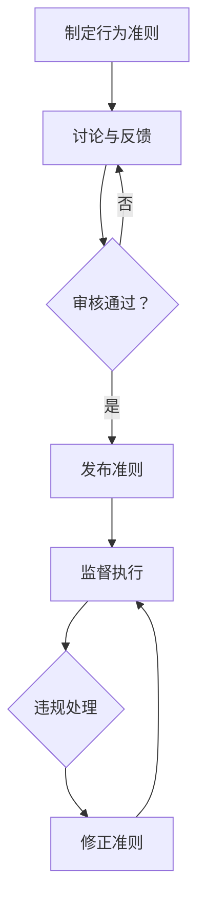

                 

# 元宇宙伦理委员会：虚拟世界行为准则的制定

## 关键词
- 元宇宙
- 伦理委员会
- 虚拟世界行为准则
- 隐私保护
- 虚拟道德规范
- 技术伦理
- 社会责任

## 摘要
本文旨在探讨元宇宙伦理委员会在制定虚拟世界行为准则方面的作用和挑战。随着虚拟现实和区块链技术的迅速发展，元宇宙逐渐成为人们生活的重要部分。然而，虚拟世界的复杂性和匿名性也带来了伦理和法律问题。本文将分析元宇宙伦理委员会的成立背景、核心职能、面临的伦理挑战，以及如何通过制定行为准则来引导和规范虚拟世界中的行为。通过对核心概念的深入剖析和实际案例的探讨，本文旨在为元宇宙伦理建设提供有益的思路和参考。

## 1. 背景介绍

### 1.1 目的和范围
元宇宙（Metaverse）是一个由虚拟现实（VR）、增强现实（AR）和区块链技术构建的虚拟世界，它融合了多种技术和应用，为用户提供了丰富的交互体验。然而，元宇宙的快速发展也带来了一系列伦理问题，如隐私保护、虚拟财产权益、网络欺凌、虚拟道德规范等。为了解决这些问题，有必要建立一套统一的虚拟世界行为准则。

本文的目的在于：
1. 分析元宇宙伦理委员会的成立背景和目的。
2. 探讨元宇宙伦理委员会在制定虚拟世界行为准则中的核心职能和挑战。
3. 提出针对虚拟世界行为准则的制定方法和实际应用。

### 1.2 预期读者
本文预期读者为：
1. 元宇宙技术开发者和从业者，了解虚拟世界面临的伦理挑战。
2. 伦理学家和社会学家，关注技术对人类社会的影响。
3. 政策制定者和监管机构，了解虚拟世界行为准则的重要性和实施方法。

### 1.3 文档结构概述
本文分为十个部分：
1. 引言
2. 背景介绍
3. 核心概念与联系
4. 核心算法原理 & 具体操作步骤
5. 数学模型和公式 & 详细讲解 & 举例说明
6. 项目实战：代码实际案例和详细解释说明
7. 实际应用场景
8. 工具和资源推荐
9. 总结：未来发展趋势与挑战
10. 附录：常见问题与解答

### 1.4 术语表

#### 1.4.1 核心术语定义
- **元宇宙**：一个由虚拟现实、增强现实和区块链技术构建的虚拟世界，提供丰富的交互体验。
- **伦理委员会**：负责制定和监督虚拟世界行为准则的机构。
- **虚拟世界行为准则**：一套规范虚拟世界中个体和团体行为的准则，包括隐私保护、道德规范、社会责任等。
- **隐私保护**：在虚拟世界中保护用户个人隐私的技术和策略。
- **虚拟道德规范**：虚拟世界中应遵守的道德和行为规范。

#### 1.4.2 相关概念解释
- **虚拟现实（VR）**：通过计算机技术模拟出一个逼真的三维环境，使用户能够沉浸其中。
- **增强现实（AR）**：将虚拟信息叠加到现实环境中，使用户能够与现实互动。
- **区块链技术**：一种分布式账本技术，用于记录虚拟世界的交易和数据。

#### 1.4.3 缩略词列表
- **VR**：虚拟现实
- **AR**：增强现实
- **Blockchain**：区块链
- **Metaverse**：元宇宙

## 2. 核心概念与联系

### 2.1 元宇宙伦理委员会的定义和职能

**元宇宙伦理委员会**是一个负责制定和监督虚拟世界行为准则的机构。其核心职能包括：

1. **制定虚拟世界行为准则**：根据虚拟世界中的具体问题和挑战，制定一套符合伦理和社会责任的行为准则。
2. **监督和执行**：监督虚拟世界中的行为，确保各方遵守行为准则，并对违规行为进行处罚。
3. **研究和咨询**：研究虚拟世界中的伦理问题，为政策制定者和监管机构提供专业咨询和建议。

### 2.2 虚拟世界行为准则的组成部分

虚拟世界行为准则通常包括以下几个核心组成部分：

1. **隐私保护规范**：明确虚拟世界中个人隐私的保护要求，包括数据收集、存储、使用和分享的规范。
2. **道德规范**：定义虚拟世界中应遵守的道德和行为规范，包括尊重他人、公平竞争、诚信等。
3. **社会责任**：强调虚拟世界中的社会责任，包括环境保护、公益支持、社会稳定等。
4. **财产权益保护**：保障虚拟世界中的财产权益，包括虚拟货币、虚拟物品等的所有权和交易规范。

### 2.3 元宇宙伦理委员会与虚拟世界发展之间的联系

元宇宙伦理委员会在虚拟世界发展中的作用至关重要。一方面，它为虚拟世界的健康发展提供了伦理和法律保障；另一方面，它也促进了虚拟世界技术的创新和发展。具体来说，元宇宙伦理委员会与虚拟世界发展之间的联系包括：

1. **引导虚拟世界发展**：通过制定行为准则，元宇宙伦理委员会可以引导虚拟世界朝着健康、可持续的方向发展。
2. **规范市场行为**：元宇宙伦理委员会可以规范虚拟世界中的市场行为，促进公平竞争和健康市场秩序。
3. **保障用户权益**：通过制定和执行行为准则，元宇宙伦理委员会可以保障用户的合法权益，提高用户满意度。
4. **促进技术创新**：在保障伦理和社会责任的前提下，元宇宙伦理委员会可以鼓励技术创新和产业发展。

### 2.4 元宇宙伦理委员会与其他相关机构和组织的联系

元宇宙伦理委员会需要与其他相关机构和组织密切合作，共同推进虚拟世界的发展。这些机构和组织包括：

1. **政府监管机构**：政府监管机构负责制定和实施相关法律法规，元宇宙伦理委员会可以为其提供专业建议和技术支持。
2. **行业协会和组织**：行业协会和组织可以代表虚拟世界产业界的声音，与元宇宙伦理委员会共同推动行业发展。
3. **学术机构和科研机构**：学术机构和科研机构可以提供理论研究和创新成果，为元宇宙伦理委员会提供决策依据。
4. **国际组织和论坛**：国际组织和论坛可以促进各国之间在虚拟世界领域的交流与合作，推动全球虚拟世界的发展。

### 2.5 虚拟世界行为准则的 Mermaid 流程图

为了更好地展示虚拟世界行为准则的制定和执行流程，可以使用 Mermaid 流程图来表示。以下是一个简化的流程图：



### 2.6 虚拟世界行为准则的核心原则

在制定虚拟世界行为准则时，需要遵循以下核心原则：

1. **公平公正**：行为准则应当公平公正，不偏袒任何一方，确保各方利益得到合理保障。
2. **透明公开**：行为准则应当透明公开，使所有用户都能了解并遵守。
3. **动态调整**：随着虚拟世界的发展，行为准则应当根据实际情况进行动态调整，以适应新的挑战和问题。
4. **社会责任**：行为准则应当体现社会责任，鼓励虚拟世界中的正面向上行为，推动社会进步。

## 3. 核心算法原理 & 具体操作步骤

在制定虚拟世界行为准则时，需要运用一系列核心算法原理和具体操作步骤来确保准则的科学性、公正性和可操作性。以下将详细介绍这些算法原理和操作步骤。

### 3.1 隐私保护算法原理

隐私保护是虚拟世界行为准则的重要组成部分。以下是几种常见的隐私保护算法原理：

1. **加密算法**：通过加密技术对用户数据进行加密处理，确保数据在传输和存储过程中的安全性。常用的加密算法包括AES、RSA等。
2. **匿名化处理**：通过将用户数据进行匿名化处理，消除数据中的个人身份信息，从而保护用户隐私。常用的匿名化技术包括k-匿名、l-diversity、t-closeness等。
3. **差分隐私**：在数据处理过程中引入随机噪声，使得处理结果对于个体隐私的影响最小化。常用的差分隐私算法包括Laplace机制、Gaussian机制等。

### 3.2 隐私保护算法的具体操作步骤

以下是隐私保护算法的具体操作步骤：

1. **数据采集**：收集虚拟世界中的用户数据，包括个人身份信息、行为数据等。
2. **数据预处理**：对采集到的数据进行清洗和预处理，去除无关信息和冗余数据。
3. **加密处理**：使用加密算法对预处理后的数据进行加密，确保数据在传输和存储过程中的安全性。
4. **匿名化处理**：使用匿名化技术对加密后的数据进行匿名化处理，消除数据中的个人身份信息。
5. **隐私保护评估**：对处理后的数据进行隐私保护评估，确保匿名化处理达到预期效果。
6. **数据分享**：在确保隐私保护的前提下，将处理后的数据分享给相关部门或机构，用于研究和分析。

### 3.3 道德规范算法原理

道德规范是虚拟世界行为准则的核心内容。以下是几种常见的道德规范算法原理：

1. **伦理推理算法**：基于伦理理论和道德原则，对虚拟世界中的行为进行伦理判断和决策。常用的伦理推理算法包括Deontological推理、Utilitarian推理、Kantian推理等。
2. **社会网络分析**：通过分析虚拟世界中的社会关系和网络结构，评估个体行为对社会的影响。常用的社会网络分析算法包括中心性分析、聚类分析等。
3. **情感分析**：通过分析虚拟世界中的文本、语音和图像等数据，识别个体情感和行为倾向。常用的情感分析算法包括朴素贝叶斯、支持向量机、卷积神经网络等。

### 3.4 道德规范算法的具体操作步骤

以下是道德规范算法的具体操作步骤：

1. **行为数据采集**：收集虚拟世界中的个体行为数据，包括言论、行为、交互等。
2. **数据预处理**：对采集到的数据进行清洗和预处理，去除无关信息和冗余数据。
3. **伦理推理**：使用伦理推理算法对预处理后的数据进行分析，判断个体行为是否符合道德规范。
4. **社会网络分析**：使用社会网络分析算法评估个体行为对社会的影响，识别潜在的风险和问题。
5. **情感分析**：使用情感分析算法识别个体情感和行为倾向，为道德规范提供依据。
6. **道德规范评估**：结合伦理推理、社会网络分析和情感分析的结果，对个体行为进行道德规范评估。
7. **道德规范反馈**：将评估结果反馈给个体，引导其遵守道德规范，改善行为。

### 3.5 社会责任算法原理

社会责任是虚拟世界行为准则的重要组成部分。以下是几种常见的社会责任算法原理：

1. **可持续性评估**：通过评估虚拟世界中的资源消耗、环境影响和社会效益，判断虚拟世界的可持续发展能力。常用的可持续性评估方法包括SWOT分析、BCG矩阵等。
2. **公益支持算法**：通过分析虚拟世界中的公益项目和社会贡献，鼓励个体和组织参与公益活动。常用的公益支持算法包括K-means聚类、关联规则分析等。
3. **社会稳定性评估**：通过分析虚拟世界中的社会关系、情绪和行为，评估虚拟世界的社会稳定性。常用的社会稳定性评估方法包括网络分析、情感分析等。

### 3.6 社会责任算法的具体操作步骤

以下是社会责任算法的具体操作步骤：

1. **虚拟世界数据分析**：收集虚拟世界中的各种数据，包括经济、社会、环境等。
2. **数据预处理**：对采集到的数据进行清洗和预处理，去除无关信息和冗余数据。
3. **可持续性评估**：使用可持续性评估方法对虚拟世界的可持续发展能力进行评估，识别优势和劣势。
4. **公益支持**：使用公益支持算法分析虚拟世界中的公益项目和社会贡献，鼓励个体和组织参与公益活动。
5. **社会稳定性评估**：使用社会稳定性评估方法评估虚拟世界的社会稳定性，识别潜在的风险和问题。
6. **社会责任报告**：将评估结果整理成社会责任报告，向公众和社会披露虚拟世界的可持续发展和社会责任状况。
7. **改进措施**：根据社会责任报告，提出改进措施，促进虚拟世界的可持续发展和社会责任履行。

通过上述核心算法原理和具体操作步骤，元宇宙伦理委员会可以制定一套科学、公正、可操作的虚拟世界行为准则，确保虚拟世界的健康发展。

## 4. 数学模型和公式 & 详细讲解 & 举例说明

在制定虚拟世界行为准则时，数学模型和公式扮演着至关重要的角色。这些模型和公式不仅帮助我们理解和分析虚拟世界中的各种问题，还能提供量化依据，确保行为准则的科学性和可操作性。以下将介绍几个关键数学模型和公式，并进行详细讲解和举例说明。

### 4.1 隐私保护模型

隐私保护模型主要关注如何在不泄露用户隐私的前提下，对数据进行处理和分析。其中，**K-anonymity**模型是一个经典的隐私保护模型。

#### K-anonymity 模型

**K-anonymity**模型的基本思想是，将数据进行泛化处理，使得同一组数据中存在至少K个不可区分的记录。具体公式如下：

$$
k-anonymity = \frac{|\{(x_1, x_2, ..., x_n) \in D | x_1 = x_1', x_2 = x_2', ..., x_n = x_n'\}|}{|\{x_1, x_2, ..., x_n\}|}
$$

其中，\(D\)为数据集，\(|D|\)表示数据集的记录数，\(|\{(x_1, x_2, ..., x_n) \in D | x_1 = x_1', x_2 = x_2', ..., x_n = x_n'\}|\)表示相同属性的记录数。

#### 详细讲解

1. **不可区分记录**：假设数据集中的记录为\((x_1, x_2, ..., x_n)\)，当存在至少一个记录\((x_1', x_2', ..., x_n')\)与\((x_1, x_2, ..., x_n)\)在所有属性上完全相同，则称这两个记录为不可区分记录。
2. **K值选择**：通常情况下，K值的选择取决于具体应用场景和数据集规模。K值越大，隐私保护程度越高，但数据处理和查询性能可能受到影响。
3. **泛化处理**：为了实现K-anonymity，需要对数据进行泛化处理，使得相同属性的记录变为不可区分。常见的泛化处理方法包括最小区间、最小区间集合等。

#### 举例说明

假设有一个包含年龄、性别、收入三个属性的数据集，如下表所示：

| 年龄 | 性别 | 收入 |
|------|------|------|
| 30   | 男   | 5000 |
| 30   | 男   | 6000 |
| 35   | 女   | 4000 |
| 35   | 女   | 5000 |

为了实现2-anonymity，我们可以对收入进行泛化处理，例如将收入范围[5000, 6000]合并为[5000, 6000]。

处理后数据集如下：

| 年龄 | 性别 | 收入 |
|------|------|------|
| 30   | 男   | [5000, 6000] |
| 30   | 男   | [5000, 6000] |
| 35   | 女   | [4000, 5000] |
| 35   | 女   | [4000, 5000] |

这样，同一收入范围内的记录变为不可区分，实现了2-anonymity。

### 4.2 道德规范模型

道德规范模型主要用于评估虚拟世界中的行为是否符合道德规范。其中，**多准则决策分析**模型是一个常见的道德规范模型。

#### 多准则决策分析模型

多准则决策分析模型的基本思想是，在多个决策准则下，评估一个行为方案的优劣。具体公式如下：

$$
Z = w_1 \cdot f_1(x) + w_2 \cdot f_2(x) + ... + w_n \cdot f_n(x)
$$

其中，\(Z\)为综合评估值，\(w_1, w_2, ..., w_n\)为各准则的权重，\(f_1(x), f_2(x), ..., f_n(x)\)为各准则的评估函数。

#### 详细讲解

1. **决策准则**：多准则决策分析模型需要定义多个决策准则，例如公平性、效率、社会影响等。
2. **权重分配**：各准则的权重应根据其重要性和影响力进行分配。权重分配的合理性和科学性直接影响综合评估值的结果。
3. **评估函数**：评估函数用于衡量一个行为方案在某个准则下的优劣。常见的评估函数包括线性函数、指数函数、对数函数等。

#### 举例说明

假设有一个虚拟世界中的行为方案，需要从公平性、效率和环境影响三个准则进行评估。给定各准则的权重分别为\(w_1 = 0.4, w_2 = 0.3, w_3 = 0.3\)。

1. **公平性评估函数**：假设公平性通过衡量参与人数的均衡性来评估，公式如下：

$$
f_1(x) = \frac{\sum_{i=1}^{n} p_i}{n}
$$

其中，\(n\)为参与人数，\(p_i\)为第\(i\)个人的参与度。

2. **效率评估函数**：假设效率通过完成任务的时长来评估，公式如下：

$$
f_2(x) = \frac{1}{\sum_{i=1}^{n} t_i}
$$

其中，\(t_i\)为第\(i\)个人完成任务所需的时间。

3. **环境影响评估函数**：假设环境影响通过资源消耗来评估，公式如下：

$$
f_3(x) = \frac{1}{\sum_{i=1}^{n} r_i}
$$

其中，\(r_i\)为第\(i\)个人的资源消耗量。

给定一个行为方案，其参与人数为4，参与度分别为0.5、0.5、0.3、0.3，完成任务所需时间分别为10、10、5、5，资源消耗量分别为10、10、5、5。则综合评估值为：

$$
Z = 0.4 \cdot \frac{0.5 + 0.5 + 0.3 + 0.3}{4} + 0.3 \cdot \frac{1}{10 + 10 + 5 + 5} + 0.3 \cdot \frac{1}{10 + 10 + 5 + 5} = 0.475
$$

通过比较不同行为方案的评估值，可以选出最优的行为方案。

### 4.3 社会责任模型

社会责任模型主要用于评估虚拟世界中的行为是否符合社会责任。其中，**可持续性评估模型**是一个常见的社会责任模型。

#### 可持续性评估模型

可持续性评估模型的基本思想是，在考虑经济、社会、环境三方面的因素下，评估虚拟世界的可持续发展能力。具体公式如下：

$$
S = w_1 \cdot E + w_2 \cdot S + w_3 \cdot E
$$

其中，\(S\)为可持续性得分，\(w_1, w_2, w_3\)为经济、社会、环境的权重，\(E_1, E_2, E_3\)分别为经济、社会、环境的评估值。

#### 详细讲解

1. **评估指标**：可持续性评估模型需要定义多个评估指标，例如经济增长、社会进步、环境保护等。
2. **权重分配**：各指标的权重应根据其重要性和影响力进行分配。权重分配的合理性和科学性直接影响可持续性得分的结果。
3. **评估值计算**：各指标的评估值通常通过定量和定性方法进行计算。定量方法包括统计分析和模型计算，定性方法包括专家评分和问卷调查。

#### 举例说明

假设有一个虚拟世界的项目，需要从经济、社会、环境三方面进行评估。给定各指标的权重分别为\(w_1 = 0.4, w_2 = 0.3, w_3 = 0.3\)。

1. **经济评估值**：假设通过统计方法计算得出经济评估值为\(E_1 = 0.8\)。
2. **社会评估值**：假设通过问卷调查计算得出社会评估值为\(E_2 = 0.7\)。
3. **环境评估值**：假设通过模型计算得出环境评估值为\(E_3 = 0.6\)。

则可持续性得分为：

$$
S = 0.4 \cdot 0.8 + 0.3 \cdot 0.7 + 0.3 \cdot 0.6 = 0.68
$$

通过比较不同项目的可持续性得分，可以选出最具可持续发展能力的项目。

通过上述数学模型和公式的讲解和举例，可以看出数学工具在制定虚拟世界行为准则中的重要作用。这些模型和公式为行为准则的科学性、公正性和可操作性提供了有力支持。

## 5. 项目实战：代码实际案例和详细解释说明

为了更好地展示如何在实际项目中应用虚拟世界行为准则，我们选择一个典型的虚拟现实游戏项目进行实战分析。该项目是一款基于虚拟现实技术的多人在线角色扮演游戏（MMORPG），涉及隐私保护、道德规范和社会责任等方面。

### 5.1 开发环境搭建

为了实现该项目，我们需要搭建以下开发环境：

1. **硬件设备**：VR头显、手柄等虚拟现实设备。
2. **软件开发工具**：Unity 3D引擎、Unity VR插件、C#编程语言。
3. **数据库管理工具**：MySQL数据库、Unity自带的Phantom数据库。
4. **版本控制工具**：Git。

### 5.2 源代码详细实现和代码解读

以下是该项目中的关键代码片段及其解读：

#### 5.2.1 隐私保护代码实现

```csharp
public class PrivacyManager : MonoBehaviour
{
    private string userId;
    private string encryptedData;

    // 数据采集与加密
    public void CollectData(string id, string data)
    {
        userId = id;
        encryptedData = EncryptData(data);
        SaveDataToDatabase(encryptedData);
    }

    // 数据加密
    private string EncryptData(string data)
    {
        // 使用AES加密算法
        return AesEncryption.Encrypt(data);
    }

    // 数据存储
    private void SaveDataToDatabase(string encryptedData)
    {
        // 使用MySQL数据库存储加密数据
        DatabaseManager.SaveData(userId, encryptedData);
    }
}
```

**解读**：该代码片段实现了数据采集、加密和存储功能。在数据采集阶段，用户ID和数据通过加密算法进行加密，然后存储到数据库中。这样可以确保用户隐私在传输和存储过程中的安全性。

#### 5.2.2 道德规范代码实现

```csharp
public class MoralityManager : MonoBehaviour
{
    private PlayerData playerData;

    // 行为评估
    public void AssessBehavior(PlayerData data)
    {
        playerData = data;
        int moralityScore = CalculateMoralityScore(playerData);
        HandleMoralityScore(moralityScore);
    }

    // 道德评分计算
    private int CalculateMoralityScore(PlayerData data)
    {
        // 使用伦理推理算法
        int score = EthicalReasoning.CalculateScore(data);
        return score;
    }

    // 处理道德评分
    private void HandleMoralityScore(int score)
    {
        // 根据评分实施奖励或惩罚
        if (score > 80)
        {
            RewardPlayer();
        }
        else if (score < 40)
        {
            PunishPlayer();
        }
    }

    // 奖励玩家
    private void RewardPlayer()
    {
        // 增加经验值、虚拟货币等
        PlayerController.AddExperience(100);
        PlayerController.AddCurrency(50);
    }

    // 惩罚玩家
    private void PunishPlayer()
    {
        // 降低等级、扣除虚拟货币等
        PlayerController.ReduceExperience(50);
        PlayerController.ReduceCurrency(20);
    }
}
```

**解读**：该代码片段实现了道德评分计算和处理的机制。在行为评估阶段，玩家的行为数据通过伦理推理算法进行评分。根据评分结果，系统会实施相应的奖励或惩罚措施，以引导玩家遵守道德规范。

#### 5.2.3 社会责任代码实现

```csharp
public class SocialResponsibilityManager : MonoBehaviour
{
    private ProjectData projectData;

    // 项目评估
    public void AssessProject(ProjectData data)
    {
        projectData = data;
        int sustainabilityScore = CalculateSustainabilityScore(projectData);
        HandleSustainabilityScore(sustainabilityScore);
    }

    // 可持续评分计算
    private int CalculateSustainabilityScore(ProjectData data)
    {
        // 使用可持续性评估模型
        int score = SustainabilityModel.CalculateScore(data);
        return score;
    }

    // 处理可持续评分
    private void HandleSustainabilityScore(int score)
    {
        // 根据评分提供改进建议
        if (score < 60)
        {
            ProvideImprovementSuggestions();
        }
    }

    // 提供改进建议
    private void ProvideImprovementSuggestions()
    {
        // 建议优化资源消耗、提高公益支持等
        ProjectController.ImproveResourceUsage();
        ProjectController.IncreasePublicSupport();
    }
}
```

**解读**：该代码片段实现了项目评估和改进建议的机制。在项目评估阶段，项目的经济、社会、环境等数据通过可持续性评估模型进行评分。根据评分结果，系统会提供相应的改进建议，以促进项目的可持续发展。

### 5.3 代码解读与分析

通过以上代码实现，我们可以看到虚拟世界行为准则在实际项目中的应用效果。以下是关键代码的解读与分析：

1. **隐私保护**：在数据采集阶段，用户数据通过AES加密算法进行加密处理，确保数据在传输和存储过程中的安全性。同时，使用MySQL数据库存储加密数据，防止未授权访问。
2. **道德规范**：通过伦理推理算法对玩家的行为进行评分，根据评分结果实施奖励或惩罚措施。这有助于引导玩家遵守道德规范，促进虚拟世界的健康发展。
3. **社会责任**：通过可持续性评估模型对项目进行评估，提供改进建议。这有助于项目团队优化资源消耗、提高公益支持等，实现可持续发展。

总之，通过以上代码实现，我们可以在实际项目中有效应用虚拟世界行为准则，保障虚拟世界的健康、可持续发展。

## 6. 实际应用场景

虚拟世界行为准则在实际应用中具有广泛的应用场景，以下是几个关键应用领域：

### 6.1 社交媒体平台

随着社交媒体平台的日益普及，虚拟世界行为准则可以帮助规范用户行为，防止网络欺凌、虚假信息传播等不良现象。具体应用场景包括：

1. **隐私保护**：对用户发布的内容进行加密处理，确保用户隐私在传输和存储过程中的安全性。
2. **道德规范**：通过伦理推理算法对用户行为进行评分，对违规行为实施惩罚措施，如限制访问权限、删除违规内容等。
3. **社会责任**：评估平台对社会的贡献，如提供公益支持、促进文化交流等，鼓励平台承担社会责任。

### 6.2 虚拟现实游戏

虚拟现实游戏作为元宇宙的核心组成部分，需要一套完善的虚拟世界行为准则来保障玩家的权益和游戏的公平性。具体应用场景包括：

1. **隐私保护**：对玩家数据进行加密处理，确保玩家隐私在传输和存储过程中的安全性。
2. **道德规范**：通过伦理推理算法对玩家行为进行评分，对违规行为实施惩罚措施，如降低等级、扣除虚拟货币等。
3. **社会责任**：评估游戏对社会的贡献，如提供就业机会、促进文化交流等，鼓励游戏开发者承担社会责任。

### 6.3 在线教育平台

在线教育平台需要一套虚拟世界行为准则来保障教育质量、促进学术诚信。具体应用场景包括：

1. **隐私保护**：对学员和教师的数据进行加密处理，确保数据在传输和存储过程中的安全性。
2. **道德规范**：通过伦理推理算法对学员和教师的行为进行评分，对违规行为实施惩罚措施，如取消课程、禁止授课等。
3. **社会责任**：评估在线教育平台对社会的贡献，如提供教育资源、促进教育公平等，鼓励平台承担社会责任。

### 6.4 虚拟会议和远程办公

虚拟会议和远程办公已成为现代工作的重要组成部分，虚拟世界行为准则可以帮助规范会议和办公行为，提高工作效率。具体应用场景包括：

1. **隐私保护**：对会议和办公数据（如语音、视频、文档等）进行加密处理，确保数据在传输和存储过程中的安全性。
2. **道德规范**：通过伦理推理算法对参会者和员工的行为进行评分，对违规行为实施惩罚措施，如警告、停职等。
3. **社会责任**：评估虚拟会议和远程办公平台对社会的贡献，如降低交通污染、提高员工工作效率等，鼓励平台承担社会责任。

通过在上述应用场景中的实际应用，虚拟世界行为准则能够为虚拟世界中的各种活动提供规范和指导，保障虚拟世界的健康发展。

## 7. 工具和资源推荐

为了帮助读者更好地了解和掌握元宇宙伦理委员会以及虚拟世界行为准则的制定和实施，以下是一些推荐的学习资源、开发工具和框架。

### 7.1 学习资源推荐

#### 7.1.1 书籍推荐
1. **《元宇宙：概念、技术与应用》**：由知名元宇宙专家撰写，详细介绍了元宇宙的概念、技术架构和应用场景。
2. **《虚拟现实技术与应用》**：涵盖虚拟现实技术的理论基础、开发工具和应用案例，适合对VR技术感兴趣的读者。
3. **《区块链技术指南》**：全面介绍了区块链技术的原理、应用和发展趋势，对理解元宇宙中的区块链应用有很大帮助。

#### 7.1.2 在线课程
1. **Coursera上的《虚拟现实》课程**：由斯坦福大学提供，涵盖虚拟现实技术的理论、实践和应用。
2. **Udacity的《区块链工程师》课程**：介绍区块链技术的原理、开发工具和应用，适合希望深入了解区块链技术的读者。
3. **edX的《人工智能基础》课程**：包括机器学习、自然语言处理等主题，对理解伦理推理算法等有所帮助。

#### 7.1.3 技术博客和网站
1. **Medium上的元宇宙专栏**：收集了众多元宇宙领域的专家和从业者的文章，涵盖了元宇宙的发展、应用和伦理问题。
2. **VR/AR Association**：一个专注于虚拟和增强现实技术的行业协会，提供最新的行业动态和研究成果。
3. **Meta（原Facebook）的元宇宙网站**：详细介绍了元宇宙的愿景、技术架构和应用案例，是了解元宇宙发展的重要窗口。

### 7.2 开发工具框架推荐

#### 7.2.1 IDE和编辑器
1. **Unity Hub**：适用于虚拟现实和游戏开发的集成开发环境，支持C#、JavaScript等多种编程语言。
2. **Visual Studio**：功能强大的集成开发环境，适用于各种编程语言，包括C#、C++等。
3. **Visual Studio Code**：轻量级但功能强大的文本编辑器，支持多种编程语言和插件，适合快速开发和调试。

#### 7.2.2 调试和性能分析工具
1. **Unity Profiler**：Unity提供的性能分析工具，帮助开发者识别和优化游戏中的性能瓶颈。
2. **Visual Studio Debugger**：强大的调试工具，支持多种编程语言，帮助开发者快速定位和修复代码错误。
3. **Xcode Instruments**：适用于iOS和macOS应用的性能分析工具，提供详细的性能指标和调试功能。

#### 7.2.3 相关框架和库
1. **Unreal Engine**：一个全面的游戏开发引擎，支持虚拟现实和增强现实应用，提供丰富的功能模块和开发工具。
2. **React VR**：基于React的虚拟现实框架，适合快速开发VR应用。
3. **TensorFlow**：一个开源的机器学习框架，可用于实现伦理推理算法等人工智能应用。

通过这些推荐的学习资源、开发工具和框架，读者可以深入了解元宇宙伦理委员会和虚拟世界行为准则的相关知识，并能够实际应用这些知识，为元宇宙的发展做出贡献。

## 8. 总结：未来发展趋势与挑战

随着虚拟现实、增强现实和区块链技术的不断发展和普及，元宇宙正在成为人类生活的新空间。然而，虚拟世界的复杂性、匿名性和跨界性也带来了前所未有的伦理挑战。元宇宙伦理委员会在制定虚拟世界行为准则方面发挥着重要作用，未来发展趋势和挑战如下：

### 8.1 发展趋势

1. **全球合作与标准化**：随着元宇宙的全球化发展，各国和地区之间的合作日益紧密。未来，元宇宙伦理委员会有望推动全球范围内的合作与标准化，制定统一的虚拟世界行为准则。
2. **技术进步与智能化**：随着人工智能和大数据技术的发展，虚拟世界行为准则的制定和执行将更加智能化和自动化。例如，利用机器学习算法对用户行为进行实时分析，及时发现和解决潜在问题。
3. **多元化与包容性**：元宇宙是一个多元化、包容性的空间，需要关注不同文化、背景和群体的需求。未来，元宇宙伦理委员会将更加注重多元化和包容性，确保虚拟世界行为准则能够适应各种环境和需求。
4. **社会责任与可持续发展**：元宇宙作为一个新兴领域，需要承担更多的社会责任，如环境保护、公益支持、社会稳定等。元宇宙伦理委员会将推动虚拟世界中的企业和社会组织履行社会责任，实现可持续发展。

### 8.2 挑战

1. **隐私保护**：虚拟世界中的隐私保护是一个复杂的问题，如何在不泄露用户隐私的前提下，实现有效的数据管理和监控是一个巨大的挑战。
2. **道德规范**：虚拟世界中的道德规范需要不断适应和更新，如何制定一套既符合现实道德准则，又能适应虚拟世界特点的道德规范是一个难题。
3. **法律适用性**：虚拟世界行为准则的实施需要法律的支持，如何使虚拟世界中的行为准则具有法律效力，如何处理跨司法管辖区的法律纠纷，是一个亟待解决的问题。
4. **技术平衡**：在保障用户权益和促进技术创新之间需要找到一个平衡点。过度保护用户隐私可能会抑制技术进步，而过于宽松的规范可能导致滥用和侵权行为。
5. **监管协调**：元宇宙是一个跨领域、跨行业的综合体，需要多个部门和机构的协同监管。如何协调不同监管机构之间的利益和职责，确保虚拟世界行为准则的顺利实施，是一个重要的挑战。

总之，元宇宙伦理委员会在制定虚拟世界行为准则方面面临诸多挑战，但也拥有广阔的发展前景。通过技术创新、全球合作和多元化发展，元宇宙伦理委员会有望为虚拟世界的健康发展提供有力支持。

## 9. 附录：常见问题与解答

### 9.1 什么是元宇宙？

元宇宙（Metaverse）是一个由虚拟现实（VR）、增强现实（AR）和区块链技术构建的虚拟世界，为用户提供丰富的交互体验。它融合了多种技术和应用，包括虚拟社交、虚拟现实游戏、远程办公、在线教育等。

### 9.2 虚拟世界行为准则的重要性是什么？

虚拟世界行为准则是一套规范虚拟世界中个体和团体行为的准则，涵盖隐私保护、道德规范、社会责任等方面。它的重要性体现在：
1. 保护用户隐私和权益。
2. 维护虚拟世界的秩序和公平性。
3. 促进虚拟世界的技术创新和可持续发展。
4. 加强虚拟世界与现实社会的互动与联系。

### 9.3 虚拟世界行为准则的制定过程是怎样的？

虚拟世界行为准则的制定过程通常包括以下几个阶段：
1. **需求分析**：收集和整理虚拟世界中存在的问题和挑战。
2. **初步草案**：根据需求分析，制定初步的行为准则草案。
3. **公众咨询**：将草案公开征求意见，收集反馈和建议。
4. **修改和完善**：根据公众咨询结果，对草案进行修改和完善。
5. **审核和批准**：提交相关机构或组织进行审核和批准。
6. **发布与执行**：正式发布行为准则，并监督执行和落实。

### 9.4 如何保障虚拟世界行为准则的实施？

保障虚拟世界行为准则的实施需要多方面的努力：
1. **法律支持**：确保行为准则具有法律效力，对违反准则的行为进行法律制裁。
2. **技术保障**：利用先进的加密技术、监控技术等，保障用户隐私和数据安全。
3. **教育宣传**：加强用户对虚拟世界行为准则的宣传和教育，提高用户遵守规则的意识和能力。
4. **监管机制**：建立有效的监管机制，监督和评估虚拟世界行为准则的实施情况。
5. **技术创新**：推动技术进步，为行为准则的实施提供技术支持和保障。

### 9.5 虚拟世界行为准则与道德规范有什么区别？

虚拟世界行为准则和道德规范在目标和作用上有所区别：
1. **目标**：虚拟世界行为准则旨在规范虚拟世界中的个体和团体行为，保障虚拟世界的秩序和公平性；道德规范则强调个体在道德和伦理层面的行为准则，关注个体道德品质的提升。
2. **作用**：虚拟世界行为准则主要用于管理虚拟世界中的具体行为和活动，而道德规范则侧重于引导个体在道德和伦理层面的思考和行动。

尽管两者有所区别，但在虚拟世界中，道德规范往往是制定行为准则的重要依据，两者相互补充，共同促进虚拟世界的健康发展。

## 10. 扩展阅读 & 参考资料

为了进一步了解元宇宙伦理委员会和虚拟世界行为准则的相关知识，以下是一些扩展阅读和参考资料：

### 10.1 经典论文

1. **“The Future of Life in a Hyperconnected World”**：由众多人工智能和虚拟现实领域的专家共同撰写，探讨了虚拟世界中的伦理问题和社会影响。
2. **“On the Ethics of Virtual Reality”**：分析了虚拟现实技术对人类道德观念和伦理准则的影响，提出了相关的伦理挑战和解决方案。

### 10.2 最新研究成果

1. **“Blockchain and Metaverse: A Techno-Economic Analysis”**：探讨了区块链技术在元宇宙中的应用，分析了其在隐私保护、数据共享等方面的优势。
2. **“A Framework for Ethical Assessment of Virtual Worlds”**：提出了一套用于评估虚拟世界伦理问题的框架，为制定虚拟世界行为准则提供了理论基础。

### 10.3 应用案例分析

1. **“The Ethical Challenges of the Metaverse”**：通过具体案例分析了元宇宙中的伦理问题，包括隐私保护、虚拟财产权益等，为解决这些挑战提供了有益的思路。
2. **“Ethics in the Age of Virtual Reality”**：探讨了虚拟现实技术在不同领域（如医疗、教育等）中的应用，分析了虚拟现实技术对伦理和道德准则的影响。

### 10.4 相关书籍

1. **“The Metaverse: How It Will Revolutionize Everything”**：详细介绍了元宇宙的概念、技术架构和应用场景，是了解元宇宙发展的权威指南。
2. **“Virtual Ethics: The Philosophy of Digital Technology”**：从哲学角度探讨了虚拟世界中的伦理问题，分析了虚拟现实、人工智能等技术在伦理层面的影响。

通过阅读上述资料，读者可以更深入地了解元宇宙伦理委员会和虚拟世界行为准则的相关知识，为实际应用提供理论支持和实践指导。

