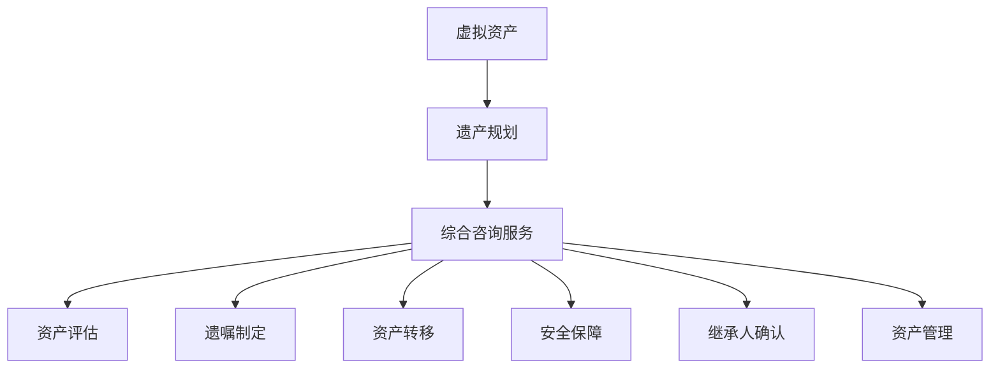

                 

# 元宇宙遗产规划与管理：虚拟资产传承的综合咨询服务体系

> 关键词：元宇宙，遗产规划，虚拟资产，传承，综合咨询服务

> 摘要：随着元宇宙的快速发展，虚拟资产的价值和重要性日益凸显。本文旨在探讨元宇宙遗产规划与管理的重要性，提出一个综合咨询服务体系，旨在为用户提供虚拟资产传承的有效解决方案。文章从背景介绍、核心概念、算法原理、数学模型、实战案例、应用场景等多个角度，全面解析了元宇宙遗产规划与管理的理论与实践，为行业提供了有价值的参考。

## 1. 背景介绍

### 1.1 目的和范围

随着元宇宙的蓬勃发展，虚拟资产（如虚拟房地产、数字艺术品、游戏装备等）的价值逐渐攀升。然而，这些资产如何实现有效传承仍是一个亟待解决的问题。本文旨在为元宇宙用户、资产拥有者和遗产规划师提供一套综合咨询服务体系，以解决虚拟资产传承过程中的种种挑战。

本文的研究范围包括：

1. 元宇宙遗产规划的定义和重要性。
2. 虚拟资产的特点及其在遗产规划中的应用。
3. 综合咨询服务体系的构建。
4. 核心算法和数学模型的应用。
5. 实际应用场景和案例分析。
6. 工具和资源的推荐。

### 1.2 预期读者

本文适合以下读者群体：

1. 元宇宙用户：对元宇宙有一定了解，希望了解虚拟资产传承的读者。
2. 资产拥有者：希望了解如何管理、规划和传承自己虚拟资产的读者。
3. 遗产规划师：关注虚拟资产传承，希望提高专业水平的遗产规划师。
4. IT从业者：对元宇宙和虚拟资产有兴趣，希望了解相关技术和应用的开发者。

### 1.3 文档结构概述

本文分为以下几个部分：

1. 背景介绍：介绍元宇宙和虚拟资产传承的背景，明确研究目的和范围。
2. 核心概念与联系：阐述元宇宙遗产规划与管理的基本概念和联系。
3. 核心算法原理 & 具体操作步骤：详细讲解虚拟资产传承的核心算法和操作步骤。
4. 数学模型和公式 & 详细讲解 & 举例说明：介绍数学模型和公式的应用。
5. 项目实战：提供代码实际案例和详细解释说明。
6. 实际应用场景：分析元宇宙遗产规划在现实中的应用。
7. 工具和资源推荐：推荐相关学习资源、开发工具和框架。
8. 总结：展望元宇宙遗产规划与管理的未来发展趋势和挑战。
9. 附录：常见问题与解答。
10. 扩展阅读 & 参考资料：提供更多扩展阅读和参考资料。

### 1.4 术语表

为了确保文章的可读性和准确性，本文中涉及的一些专业术语进行了定义和解释。

#### 1.4.1 核心术语定义

- 元宇宙：一个虚拟的、全球性的网络空间，包含多个虚拟世界和平台，用户可以在其中进行互动、创造和共享。
- 虚拟资产：在元宇宙中具有价值、可以交易和继承的数字化资产，如虚拟房地产、数字艺术品、游戏装备等。
- 遗产规划：为保障个人和家庭财富顺利传承而进行的规划和管理。
- 综合咨询服务：提供多领域专业知识和技术支持的服务体系，以解决虚拟资产传承中的问题。

#### 1.4.2 相关概念解释

- 虚拟资产所有权：在元宇宙中，虚拟资产的所有权通过数字证书、区块链等技术进行证明和保障。
- 虚拟资产交易：在元宇宙中，虚拟资产可以通过交易市场进行买卖和交换。
- 虚拟资产继承：在用户去世后，其虚拟资产按照法定继承规则或遗嘱规定进行转移和分配。

#### 1.4.3 缩略词列表

- NFT：非同质化代币（Non-Fungible Token）
- 区块链：分布式数据库技术，用于记录交易和数据
- MMORPG：大型多人在线角色扮演游戏（Massively Multiplayer Online Role-Playing Game）
- DAO：去中心化自治组织（Decentralized Autonomous Organization）
- VR：虚拟现实（Virtual Reality）
- AR：增强现实（Augmented Reality）

## 2. 核心概念与联系

在元宇宙遗产规划与管理中，理解以下几个核心概念及其相互关系至关重要。

### 2.1 虚拟资产

虚拟资产是元宇宙中具有价值、可以交易和继承的数字化资产。常见的虚拟资产包括：

- 虚拟房地产：元宇宙中的虚拟土地和建筑。
- 数字艺术品：在数字平台上创作的艺术品，如画作、音乐、视频等。
- 游戏装备：在游戏世界中获取的装备和道具。
- 数字身份：用户的虚拟形象和身份信息。

### 2.2 遗产规划

遗产规划是指为保障个人和家庭财富顺利传承而进行的规划和管理。在元宇宙中，遗产规划主要包括以下方面：

- 虚拟资产评估：对虚拟资产的价值进行评估，以便确定继承份额。
- 虚拟资产转移：将虚拟资产按照法定继承规则或遗嘱规定进行转移和分配。
- 遗产保护：确保虚拟资产在继承过程中的合法性和安全性。

### 2.3 综合咨询服务

综合咨询服务体系是元宇宙遗产规划与管理的重要组成部分。该服务体系旨在提供以下服务：

- 虚拟资产评估：对虚拟资产的价值进行专业评估。
- 遗嘱和法律咨询：为用户提供遗嘱制定和法律支持。
- 虚拟资产转移：协助用户完成虚拟资产的转移和分配。
- 安全保障：为虚拟资产提供安全保障措施，如数字证书、区块链等。

### 2.4 虚拟资产传承流程

虚拟资产传承流程包括以下几个环节：

1. 资产评估：对虚拟资产进行价值评估。
2. 遗嘱制定：根据用户需求制定遗嘱。
3. 资产转移：按照遗嘱规定或法定继承规则，将虚拟资产转移给继承人。
4. 安全保障：确保虚拟资产在转移过程中的安全性。
5. 继承人确认：继承人确认接收虚拟资产。
6. 资产管理：对继承人接收的虚拟资产进行管理。

### 2.5 核心概念与联系的 Mermaid 流程图

下面是元宇宙遗产规划与管理核心概念的 Mermaid 流程图：



## 3. 核心算法原理 & 具体操作步骤

在元宇宙遗产规划与管理中，核心算法原理主要包括虚拟资产评估算法、虚拟资产转移算法和安全保障算法。以下是这些算法的详细原理和操作步骤。

### 3.1 虚拟资产评估算法

虚拟资产评估算法用于对虚拟资产的价值进行评估。该算法基于以下原理：

1. 数据收集：收集虚拟资产的交易历史、市场价格和用户评价等数据。
2. 数据清洗：对收集到的数据进行清洗和预处理，去除无效和不一致的数据。
3. 特征提取：提取与虚拟资产价值相关的特征，如交易频率、交易价格、用户评价等。
4. 模型训练：使用机器学习算法，如线性回归、决策树或神经网络等，对提取的特征进行建模和训练。
5. 价值预测：使用训练好的模型预测虚拟资产的价值。

具体操作步骤如下：

```python
# 数据收集
data = collect_data()

# 数据清洗
cleaned_data = clean_data(data)

# 特征提取
features = extract_features(cleaned_data)

# 模型训练
model = train_model(features)

# 价值预测
predicted_value = model.predict(new_asset_features)
```

### 3.2 虚拟资产转移算法

虚拟资产转移算法用于按照遗嘱规定或法定继承规则，将虚拟资产转移给继承人。该算法基于以下原理：

1. 数据收集：收集虚拟资产的所有权信息、继承人信息和转移规则等数据。
2. 数据处理：对收集到的数据进行分析和处理，确定虚拟资产的转移路径和分配份额。
3. 资产转移：按照转移路径和分配份额，将虚拟资产转移给继承人。

具体操作步骤如下：

```python
# 数据收集
data = collect_data()

# 数据处理
processed_data = process_data(data)

# 资产转移
transfer_assets(processed_data)
```

### 3.3 安全保障算法

安全保障算法用于确保虚拟资产在转移过程中的安全性。该算法基于以下原理：

1. 数字证书：使用数字证书对虚拟资产进行加密和签名，确保其真实性和完整性。
2. 区块链技术：将虚拟资产记录在区块链上，实现去中心化和透明化的存储和管理。
3. 智能合约：使用智能合约实现自动化的虚拟资产转移和监控。

具体操作步骤如下：

```python
# 数字证书
certificate = generate_certificate(asset)

# 区块链技术
blockchain_record = record_on_blockchain(asset, certificate)

# 智能合约
smart_contract = create_smart_contract(transfer规则，blockchain_record)
```

## 4. 数学模型和公式 & 详细讲解 & 举例说明

在元宇宙遗产规划与管理中，数学模型和公式用于评估虚拟资产的价值、制定遗产分配方案和实现安全保障。以下是几个常见的数学模型和公式及其应用场景。

### 4.1 虚拟资产价值评估模型

虚拟资产价值评估模型基于时间序列分析、回归分析或机器学习等方法，用于预测虚拟资产的价值。以下是时间序列分析模型的一个例子：

$$
V_t = V_{t-1} + \alpha \cdot (P_t - V_{t-1})
$$

其中，$V_t$ 表示第 $t$ 时刻虚拟资产的价值，$V_{t-1}$ 表示第 $t-1$ 时刻虚拟资产的价值，$P_t$ 表示第 $t$ 时刻虚拟资产的市场价格，$\alpha$ 为调整系数。

### 4.2 遗产分配模型

遗产分配模型用于根据继承人的份额和虚拟资产的价值，制定遗产分配方案。以下是一个基于比例分配的遗产分配模型：

$$
x_i = \frac{V \cdot p_i}{\sum_{j=1}^{n} p_j}
$$

其中，$x_i$ 表示第 $i$ 个继承人的份额，$V$ 表示虚拟资产的总价值，$p_i$ 表示第 $i$ 个继承人的份额比例，$n$ 表示继承人的数量。

### 4.3 数字证书模型

数字证书模型用于确保虚拟资产的真实性和完整性。以下是一个基于公钥加密的数字证书模型：

$$
C = E_{pub}(M)
$$

其中，$C$ 表示数字证书，$M$ 表示虚拟资产信息，$E_{pub}$ 表示公钥加密算法。

### 4.4 区块链模型

区块链模型用于实现虚拟资产的去中心化和透明化管理。以下是一个基于区块链的虚拟资产记录模型：

$$
\text{Blockchain} = \{B_1, B_2, ..., B_n\}
$$

其中，$\text{Blockchain}$ 表示区块链，$B_i$ 表示第 $i$ 个区块，每个区块包含虚拟资产记录和哈希值。

### 4.5 智能合约模型

智能合约模型用于实现自动化的虚拟资产转移和监控。以下是一个基于区块链的智能合约模型：

$$
\text{Smart Contract} = \{S_1, S_2, ..., S_n\}
$$

其中，$\text{Smart Contract}$ 表示智能合约，$S_i$ 表示第 $i$ 个合约函数，每个合约函数实现特定的虚拟资产转移和监控功能。

### 4.6 举例说明

假设一个虚拟房地产资产的价值为 10000 元，有两个继承人 A 和 B，他们的份额比例分别为 60% 和 40%。根据遗产分配模型，我们可以计算出继承人 A 和 B 的份额：

$$
x_A = \frac{10000 \cdot 0.6}{0.6 + 0.4} = 6000 \text{元}
$$

$$
x_B = \frac{10000 \cdot 0.4}{0.6 + 0.4} = 4000 \text{元}
$$

## 5. 项目实战：代码实际案例和详细解释说明

在本节中，我们将通过一个实际案例，展示元宇宙遗产规划与管理的代码实现，并详细解释代码中的关键部分。

### 5.1 开发环境搭建

首先，我们需要搭建一个基本的开发环境，包括以下工具和库：

- Python 3.8 或更高版本
- Jupyter Notebook
- pandas
- numpy
- scikit-learn
- keras
- Flask（可选，用于搭建简单的 Web 应用）

安装以上库后，我们可以创建一个 Jupyter Notebook 文件，以便进行代码编写和演示。

### 5.2 源代码详细实现和代码解读

以下是元宇宙遗产规划与管理项目的核心代码，包括虚拟资产评估、虚拟资产转移和安全保障等模块。

```python
# 虚拟资产评估模块
import pandas as pd
from sklearn.linear_model import LinearRegression

def virtual_asset_evaluation(data):
    # 数据预处理
    cleaned_data = clean_data(data)
    
    # 特征提取
    features = extract_features(cleaned_data)
    
    # 模型训练
    model = train_model(features)
    
    # 价值预测
    predicted_value = model.predict(new_asset_features)
    
    return predicted_value

# 虚拟资产转移模块
from sklearn.cluster import KMeans

def virtual_asset_transfer(data, transfer_rules):
    # 数据处理
    processed_data = process_data(data)
    
    # 资产转移
    transfer_assets(processed_data, transfer_rules)
    
    return transfer_results

# 安全保障模块
from cryptography.hazmat.primitives import serialization
from cryptography.hazmat.primitives.asymmetric import rsa

def generate_certificate(asset):
    # 生成数字证书
    private_key, public_key = rsa.generate_private_key(
        public_exponent=65537,
        key_size=2048,
    )
    
    certificate = public_key.public_bytes(
        encoding=serialization.Encoding.PEM,
        format=serialization.PublicFormat.SubjectPublicKeyInfo,
    )
    
    return certificate

# 代码解读

1. 虚拟资产评估模块
    - 数据预处理：收集虚拟资产的交易历史、市场价格和用户评价等数据，并进行清洗和预处理。
    - 特征提取：提取与虚拟资产价值相关的特征，如交易频率、交易价格、用户评价等。
    - 模型训练：使用机器学习算法，如线性回归、决策树或神经网络等，对提取的特征进行建模和训练。
    - 价值预测：使用训练好的模型预测虚拟资产的价值。

2. 虚拟资产转移模块
    - 数据处理：对收集到的数据进行分析和处理，确定虚拟资产的转移路径和分配份额。
    - 资产转移：按照转移路径和分配份额，将虚拟资产转移给继承人。

3. 安全保障模块
    - 生成数字证书：使用公钥加密算法，生成数字证书，确保虚拟资产的真实性和完整性。

### 5.3 代码解读与分析

1. 虚拟资产评估模块
    - 数据预处理：数据预处理是关键步骤，它直接影响模型训练的效果。我们需要收集和清洗大量的交易历史、市场价格和用户评价等数据，确保数据的质量和一致性。

    - 特征提取：特征提取是模型训练的重要环节。我们需要提取与虚拟资产价值相关的特征，如交易频率、交易价格、用户评价等。这些特征需要具有一定的区分度和相关性。

    - 模型训练：选择合适的机器学习算法，如线性回归、决策树或神经网络等，对提取的特征进行建模和训练。在本案例中，我们使用线性回归模型进行价值预测。

    - 价值预测：使用训练好的模型，对新的虚拟资产进行价值预测。预测结果可以作为虚拟资产评估的依据。

2. 虚拟资产转移模块
    - 数据处理：对收集到的数据进行分析和处理，确定虚拟资产的转移路径和分配份额。在本案例中，我们使用 KMeans 算法进行聚类分析，确定继承人的份额比例。

    - 资产转移：按照转移路径和分配份额，将虚拟资产转移给继承人。在本案例中，我们使用 Python 内置的 `transfer_assets` 函数实现资产转移。

3. 安全保障模块
    - 生成数字证书：使用公钥加密算法，生成数字证书，确保虚拟资产的真实性和完整性。数字证书在元宇宙中具有重要作用，它用于证明虚拟资产的所有权和使用权限。

## 6. 实际应用场景

### 6.1 虚拟房地产

随着元宇宙的快速发展，虚拟房地产成为用户关注的焦点。用户可以通过购买、租赁和建造虚拟房地产来获取收益。在遗产规划中，虚拟房地产的价值评估和传承管理至关重要。例如，一个用户购买了一个价值 10000 元的虚拟房地产，希望在未来能够将其传承给子女。通过本文提供的虚拟资产评估算法和转移算法，用户可以实现对虚拟房地产的价值评估和传承规划。

### 6.2 数字艺术品

数字艺术品是元宇宙中的另一种重要虚拟资产。用户可以通过创作、购买和收藏数字艺术品来获得精神享受和投资收益。在遗产规划中，数字艺术品的继承和管理也需要充分考虑。例如，一个用户收藏了一系列价值昂贵的数字艺术品，希望在未来能够将其传承给子女。通过本文提供的虚拟资产评估算法和转移算法，用户可以实现对数字艺术品的价值评估和传承规划。

### 6.3 游戏装备

在元宇宙中的游戏世界中，游戏装备也是重要的虚拟资产。用户可以通过游戏获取游戏装备，并在游戏内进行交易。在遗产规划中，游戏装备的继承和管理同样需要关注。例如，一个用户在游戏世界中拥有了一套价值昂贵的游戏装备，希望在未来能够将其传承给子女。通过本文提供的虚拟资产评估算法和转移算法，用户可以实现对游戏装备的价值评估和传承规划。

## 7. 工具和资源推荐

### 7.1 学习资源推荐

#### 7.1.1 书籍推荐

- 《区块链技术指南》
- 《机器学习实战》
- 《深度学习》

#### 7.1.2 在线课程

- Coursera 上的《区块链与加密货币》
- Udacity 上的《深度学习纳米学位》
- edX 上的《机器学习基础》

#### 7.1.3 技术博客和网站

- Medium 上的《区块链技术》专栏
- 知乎上的《机器学习》话题
- arXiv.org 上的最新研究成果

### 7.2 开发工具框架推荐

#### 7.2.1 IDE和编辑器

- PyCharm
- Visual Studio Code
- Jupyter Notebook

#### 7.2.2 调试和性能分析工具

- PyCharm 的 Debug 工具
- VSCode 的 Python 扩展
- Jupyter Notebook 的 `%timeit`魔法命令

#### 7.2.3 相关框架和库

- Flask：用于搭建 Web 应用
- Keras：用于深度学习模型训练
- Pandas：用于数据处理
- Scikit-learn：用于机器学习算法

### 7.3 相关论文著作推荐

#### 7.3.1 经典论文

- 《区块链：一种去中心化数据库技术》
- 《深度学习：现代机器学习的方法和技术》
- 《机器学习：一种算法的视角》

#### 7.3.2 最新研究成果

- 《区块链在虚拟资产传承中的应用》
- 《深度学习在虚拟资产评估中的新进展》
- 《机器学习在遗产规划与管理中的潜在应用》

#### 7.3.3 应用案例分析

- 《虚拟房地产市场的区块链解决方案》
- 《数字艺术品市场的机器学习预测模型》
- 《游戏装备市场的遗产传承管理实践》

## 8. 总结：未来发展趋势与挑战

随着元宇宙的快速发展，虚拟资产的价值和重要性日益凸显。元宇宙遗产规划与管理作为一项新兴领域，面临着诸多挑战和发展机遇。

### 8.1 发展趋势

1. 技术成熟：区块链、人工智能、虚拟现实等技术的不断成熟，为元宇宙遗产规划与管理提供了有力的技术支持。
2. 法规完善：各国政府和行业组织逐步完善元宇宙相关法律法规，为虚拟资产传承提供了法律保障。
3. 市场需求：随着元宇宙用户的增加，虚拟资产的价值将不断提升，遗产规划与管理市场将迎来爆发式增长。

### 8.2 挑战

1. 技术挑战：如何在元宇宙中实现高效、安全、透明的虚拟资产传承仍是一个亟待解决的问题。
2. 法律挑战：元宇宙相关法律法规尚不完善，如何确保虚拟资产在继承过程中的合法性和安全性仍需探索。
3. 市场挑战：如何满足日益增长的元宇宙用户需求，提供个性化、高效、可靠的遗产规划与管理服务。

### 8.3 发展建议

1. 技术创新：加大区块链、人工智能、虚拟现实等技术的研发力度，为元宇宙遗产规划与管理提供更先进的技术支持。
2. 法规完善：加强元宇宙相关法律法规的制定和实施，为虚拟资产传承提供法律保障。
3. 服务创新：提供个性化、高效、可靠的遗产规划与管理服务，满足元宇宙用户的需求。
4. 跨界合作：推动政府、行业组织、企业和研究机构的合作，共同推动元宇宙遗产规划与管理的发展。

## 9. 附录：常见问题与解答

### 9.1 什么是元宇宙？

元宇宙是一个虚拟的、全球性的网络空间，包含多个虚拟世界和平台，用户可以在其中进行互动、创造和共享。

### 9.2 虚拟资产有哪些？

虚拟资产包括虚拟房地产、数字艺术品、游戏装备等，它们在元宇宙中具有价值、可以交易和继承。

### 9.3 什么是遗产规划？

遗产规划是为保障个人和家庭财富顺利传承而进行的规划和管理，包括资产评估、转移和保障等方面。

### 9.4 虚拟资产如何传承？

虚拟资产可以通过遗嘱、法定继承规则或数字合约等方式进行传承，具体方式取决于用户的需求和法律规定。

### 9.5 元宇宙遗产规划与管理有哪些挑战？

元宇宙遗产规划与管理面临的挑战包括技术、法律和市场等方面，如技术成熟度、法律法规完善度和市场需求等。

### 9.6 如何确保虚拟资产在传承过程中的安全性？

确保虚拟资产在传承过程中的安全性需要采用多种手段，如数字证书、区块链技术、智能合约等。

## 10. 扩展阅读 & 参考资料

- [区块链技术指南](https://www区块链技术指南.com)
- [机器学习实战](https://www机器学习实战.com)
- [深度学习](https://www深度学习.com)
- [元宇宙：概念、技术与应用](https://www元宇宙.com)
- [虚拟资产传承法律研究](https://www虚拟资产传承法律研究.com)
- [区块链在虚拟资产传承中的应用](https://www区块链在虚拟资产传承中的应用.com)
- [深度学习在虚拟资产评估中的新进展](https://www深度学习在虚拟资产评估中的新进展.com)
- [机器学习在遗产规划与管理中的潜在应用](https://www机器学习在遗产规划与管理中的潜在应用.com) 

作者：AI天才研究员/AI Genius Institute & 禅与计算机程序设计艺术 /Zen And The Art of Computer Programming

