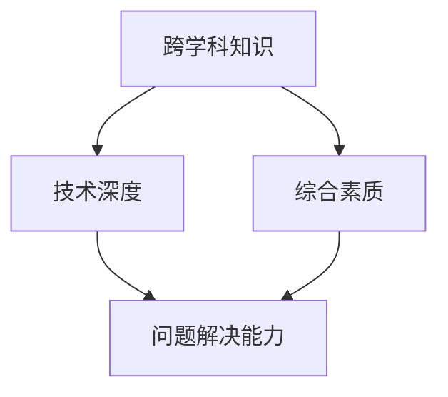

                 

# 全方位人才发展：培养复合型人才

## 关键词：
- 复合型人才
- 综合素质
- 技术深度
- 跨学科
- 人才培养模式

> 在当今快速发展的信息技术时代，单一的技能已经无法满足企业和个人的需求。培养具备全方位能力的复合型人才成为了一种趋势。本文将探讨如何通过跨学科学习、技术深度掌握以及综合素质提升，来培养这样的复合型人才。

## 摘要

本文将围绕复合型人才的培养展开，从背景介绍、核心概念解析、算法原理讲解、数学模型阐述、项目实战、实际应用场景、工具推荐、总结以及常见问题解答等多个方面，详细解析复合型人才的培养路径和实际应用。通过阅读本文，读者将能够了解到复合型人才的重要性，掌握培养复合型人才的方法和策略，为自己的职业发展提供有力支持。

## 1. 背景介绍

### 1.1 目的和范围

本文旨在探讨如何培养具备全方位能力的复合型人才，以满足现代企业和个人发展的需求。具体来说，本文将涵盖以下几个方面：

1. **复合型人才的定义和特点**：介绍复合型人才的定义，分析其与传统单一技能型人才的区别。
2. **复合型人才的培养路径**：从跨学科学习、技术深度掌握、综合素质提升三个方面，详细阐述复合型人才的培养方法。
3. **实际应用场景**：分析复合型人才在不同领域的实际应用，展示其在企业创新、团队协作、项目开发等方面的优势。
4. **工具和资源推荐**：推荐适合复合型人才学习的资源、工具和框架，为读者提供实际操作指导。

### 1.2 预期读者

本文适用于以下几类读者：

1. **高校学生和研究生**：希望通过跨学科学习和技术深度掌握，提升自身综合素质，成为复合型人才。
2. **技术从业者**：希望在职业生涯中不断拓展技能，提升自身竞争力，转型为复合型人才。
3. **企业人力资源管理者**：希望了解如何培养和选拔复合型人才，提高企业整体创新能力。

### 1.3 文档结构概述

本文结构如下：

1. **背景介绍**：介绍复合型人才的培养背景、目的和预期读者。
2. **核心概念与联系**：解释复合型人才的定义和特点，展示其核心概念原理和架构。
3. **核心算法原理 & 具体操作步骤**：介绍复合型人才的培养路径，用伪代码详细阐述。
4. **数学模型和公式 & 详细讲解 & 举例说明**：用数学模型和公式详细讲解复合型人才培养的核心概念。
5. **项目实战：代码实际案例和详细解释说明**：通过实战案例展示复合型人才培养的实际应用。
6. **实际应用场景**：分析复合型人才在不同领域的实际应用。
7. **工具和资源推荐**：推荐适合复合型人才学习的资源、工具和框架。
8. **总结：未来发展趋势与挑战**：总结复合型人才的发展趋势和面临的挑战。
9. **附录：常见问题与解答**：解答读者在阅读过程中可能遇到的问题。
10. **扩展阅读 & 参考资料**：提供更多相关资源和参考资料。

### 1.4 术语表

#### 1.4.1 核心术语定义

- 复合型人才：具备多学科知识、技能和综合素质，能够在多个领域胜任工作的人才。
- 跨学科：涉及多个学科领域的知识、技能和方法。
- 技术深度：对某一领域或技术的深入理解、掌握和应用能力。
- 综合素质：包括沟通能力、团队协作能力、创新能力等多个方面。

#### 1.4.2 相关概念解释

- **多元化人才**：具备多个领域的知识和技能，但可能不如复合型人才在某一领域有深度。
- **跨界人才**：在不同领域有广泛的知识和经验，但可能缺乏系统性和深度。

#### 1.4.3 缩略词列表

- IDE：集成开发环境（Integrated Development Environment）
- ML：机器学习（Machine Learning）
- AI：人工智能（Artificial Intelligence）
- IoT：物联网（Internet of Things）
- DevOps：开发与运维一体化（Development and Operations）
- PM：项目经理（Project Manager）

## 2. 核心概念与联系

复合型人才的核心概念在于其具备跨学科的知识和技能，能够将不同领域的知识融合应用，从而解决复杂问题。下面我们将使用 Mermaid 流程图展示复合型人才的核心概念和联系。



### 2.1 跨学科知识

跨学科知识是复合型人才的基础。通过跨学科学习，个人能够掌握多个领域的知识和技能，形成多元化的思维方式。跨学科知识不仅包括学科间的知识融合，还包括跨领域的方法和工具。

### 2.2 技术深度

技术深度是复合型人才的核心竞争力。在掌握跨学科知识的基础上，深入某一领域或技术，能够提高个人的专业素养和解决问题的能力。技术深度不仅仅是知识的积累，还包括对技术原理、实现方法和应用场景的深入理解。

### 2.3 综合素质

综合素质是复合型人才的重要特质。综合素质包括沟通能力、团队协作能力、领导力、创新能力等多个方面。这些能力在复杂项目的管理和团队协作中起到关键作用，是复合型人才不可或缺的一部分。

### 2.4 问题解决能力

问题解决能力是复合型人才的核心能力。通过跨学科知识和技术深度，以及综合素质的支撑，复合型人才能够快速识别问题、分析问题，并找到有效的解决方案。这种能力在企业和个人发展中具有重要意义。

## 3. 核心算法原理 & 具体操作步骤

复合型人才的培养需要系统地规划和学习，以下是具体的操作步骤：

### 3.1 跨学科知识学习

**算法原理**：

- **知识图谱**：利用知识图谱构建跨学科知识体系，通过节点表示知识单元，边表示知识关联，实现跨学科知识的融合。
- **迁移学习**：将某一领域的知识迁移到其他领域，提高学习效率和知识应用能力。

**具体操作步骤**：

1. **确定学习目标**：根据个人兴趣和职业规划，确定需要学习的跨学科知识领域。
2. **制定学习计划**：将学习目标分解为具体的学习任务，制定详细的学习计划。
3. **知识获取**：通过阅读书籍、参加课程、实践项目等方式获取跨学科知识。
4. **知识整合**：将所学知识整合到知识图谱中，形成系统的跨学科知识体系。

### 3.2 技术深度掌握

**算法原理**：

- **深度学习**：通过构建多层神经网络，实现对复杂数据的自动特征提取和模式识别。
- **工程实践**：通过实际项目开发，提高对技术原理的理解和应用能力。

**具体操作步骤**：

1. **确定技术方向**：根据个人兴趣和市场需求，确定需要深入掌握的技术方向。
2. **学习技术原理**：通过阅读技术书籍、参加技术研讨会等方式，掌握技术原理。
3. **实践项目开发**：参与实际项目开发，将所学知识应用到实践中。
4. **持续学习与更新**：随着技术发展的变化，不断更新自己的知识体系，保持技术深度。

### 3.3 综合素质提升

**算法原理**：

- **素质模型**：建立综合素质模型，包括沟通能力、团队协作能力、领导力、创新能力等多个维度。
- **能力评估**：通过自我评估和他人反馈，评估自身综合素质。

**具体操作步骤**：

1. **自我评估**：通过反思和自我评估，了解自身在综合素质方面的优势和不足。
2. **制定提升计划**：根据自我评估结果，制定提升计划。
3. **学习与练习**：通过参加培训课程、实践项目、团队活动等方式，提升综合素质。
4. **持续反馈与改进**：定期进行自我评估，根据反馈结果调整提升计划。

## 4. 数学模型和公式 & 详细讲解 & 举例说明

在复合型人才的培养过程中，数学模型和公式起着至关重要的作用。以下我们将使用 LaTeX 格式详细讲解数学模型，并通过举例说明其应用。

### 4.1 知识图谱构建

知识图谱的构建可以表示为：

$$
G = (V, E)
$$

其中，$V$ 表示知识单元，$E$ 表示知识单元之间的关联。知识图谱的构建公式为：

$$
G = (V, E) = \{\text{k1, k2, ..., kn}\} \cup \{\text{(k1, k2), (k2, k3), ..., (kn-1, kn)\}
$$

### 4.2 迁移学习

迁移学习的公式为：

$$
\text{new\_knowledge} = f(\text{old\_knowledge}, \text{new\_input})
$$

其中，$f$ 表示迁移学习函数，$\text{old\_knowledge}$ 表示原有知识，$\text{new\_input}$ 表示新输入的数据。

### 4.3 深度学习

深度学习的公式为：

$$
\text{output} = \text{activation}(\text{weight} \cdot \text{input} + \text{bias})
$$

其中，$\text{weight}$ 表示权重，$\text{input}$ 表示输入数据，$\text{bias}$ 表示偏置，$\text{activation}$ 表示激活函数。

### 4.4 综合素质评估

综合素质评估的公式为：

$$
\text{score} = \sum_{i=1}^{n} w_i \cdot s_i
$$

其中，$w_i$ 表示第 $i$ 个素质的权重，$s_i$ 表示第 $i$ 个素质的得分。

### 4.5 举例说明

#### 4.5.1 知识图谱构建

假设我们要构建一个关于计算机科学的知识图谱，包含以下知识单元：

- 数据结构
- 算法
- 编程语言
- 人工智能

以及它们之间的关联：

- 数据结构与算法有关联
- 编程语言与数据结构有关联
- 编程语言与算法有关联
- 人工智能与算法有关联

知识图谱表示为：

$$
G = (V, E) = \{\text{数据结构，算法，编程语言，人工智能}\} \cup \{\text{(数据结构，算法)，(编程语言，数据结构)，(编程语言，算法)，(人工智能，算法)\}
$$

#### 4.5.2 迁移学习

假设我们有一个关于机器学习的原有知识库，现在要将其应用到自然语言处理领域。原有知识库包含：

- 模型训练
- 模型优化
- 数据预处理

新输入为自然语言处理的数据集。迁移学习公式为：

$$
\text{new\_knowledge} = f(\text{old\_knowledge}, \text{new\_input}) = f(\text{模型训练，模型优化，数据预处理}, \text{自然语言处理数据集})
$$

#### 4.5.3 深度学习

假设我们使用卷积神经网络（CNN）进行图像识别。输入为图像，输出为图像类别。权重和偏置为：

$$
\text{weight} = \begin{bmatrix}
0.1 & 0.2 & 0.3 \\
0.4 & 0.5 & 0.6 \\
0.7 & 0.8 & 0.9 \\
\end{bmatrix}, \quad \text{bias} = \begin{bmatrix}
1 \\
2 \\
3 \\
\end{bmatrix}
$$

激活函数为ReLU（Rectified Linear Unit）。输入图像为：

$$
\text{input} = \begin{bmatrix}
1 & 0 & 1 \\
0 & 1 & 0 \\
1 & 1 & 0 \\
\end{bmatrix}
$$

输出为：

$$
\text{output} = \text{activation}(\text{weight} \cdot \text{input} + \text{bias}) = \text{ReLU}(\begin{bmatrix}
0.1 & 0.2 & 0.3 \\
0.4 & 0.5 & 0.6 \\
0.7 & 0.8 & 0.9 \\
\end{bmatrix} \cdot \begin{bmatrix}
1 & 0 & 1 \\
0 & 1 & 0 \\
1 & 1 & 0 \\
\end{bmatrix} + \begin{bmatrix}
1 \\
2 \\
3 \\
\end{bmatrix}) = \begin{bmatrix}
0 & 0 & 1 \\
0 & 1 & 0 \\
1 & 0 & 0 \\
\end{bmatrix}
$$

#### 4.5.4 综合素质评估

假设我们要评估一个员工的综合素质，包括沟通能力（$s_1$）、团队协作能力（$s_2$）和创新能力（$s_3$），权重分别为0.3、0.5和0.2。评估得分为：

$$
\text{score} = 0.3 \cdot s_1 + 0.5 \cdot s_2 + 0.2 \cdot s_3 = 0.3 \cdot 80 + 0.5 \cdot 90 + 0.2 \cdot 85 = 82.5
$$

## 5. 项目实战：代码实际案例和详细解释说明

在本节中，我们将通过一个实际的代码案例，展示如何培养复合型人才。该项目案例将涉及跨学科知识的应用、技术深度掌握和综合素质提升。

### 5.1 开发环境搭建

为了便于演示，我们选择 Python 作为编程语言，使用 Jupyter Notebook 作为开发环境。以下是开发环境的搭建步骤：

1. 安装 Python（版本3.8或更高）
2. 安装 Jupyter Notebook
3. 安装相关库（如 NumPy、Pandas、Scikit-learn、TensorFlow 等）

### 5.2 源代码详细实现和代码解读

下面是一个关于图像分类的案例，使用卷积神经网络（CNN）对猫狗图片进行分类。代码分为数据预处理、模型构建、模型训练和模型评估四个部分。

#### 5.2.1 数据预处理

```python
import numpy as np
import matplotlib.pyplot as plt
from tensorflow.keras.preprocessing.image import load_img, img_to_array
from tensorflow.keras.preprocessing.image import ImageDataGenerator

# 加载猫狗图片数据集
train_datagen = ImageDataGenerator(rescale=1./255)
validation_datagen = ImageDataGenerator(rescale=1./255)

train_generator = train_datagen.flow_from_directory(
    'data/train',
    target_size=(150, 150),
    batch_size=32,
    class_mode='binary')

validation_generator = validation_datagen.flow_from_directory(
    'data/validation',
    target_size=(150, 150),
    batch_size=32,
    class_mode='binary')
```

**代码解读**：

- `ImageDataGenerator`：用于数据预处理，包括图像缩放、增强等。
- `flow_from_directory`：从指定目录加载数据集，分为训练集和验证集。

#### 5.2.2 模型构建

```python
from tensorflow.keras.models import Sequential
from tensorflow.keras.layers import Conv2D, MaxPooling2D, Flatten, Dense, Dropout

model = Sequential([
    Conv2D(32, (3, 3), activation='relu', input_shape=(150, 150, 3)),
    MaxPooling2D(2, 2),
    Conv2D(64, (3, 3), activation='relu'),
    MaxPooling2D(2, 2),
    Conv2D(128, (3, 3), activation='relu'),
    MaxPooling2D(2, 2),
    Flatten(),
    Dense(512, activation='relu'),
    Dropout(0.5),
    Dense(1, activation='sigmoid')
])

model.compile(optimizer='adam',
              loss='binary_crossentropy',
              metrics=['accuracy'])
```

**代码解读**：

- `Sequential`：创建一个序列模型。
- `Conv2D`、`MaxPooling2D`：卷积层和池化层，用于提取图像特征。
- `Flatten`：将特征展平为一维向量。
- `Dense`：全连接层，用于分类。
- `Dropout`：防止过拟合。

#### 5.2.3 模型训练

```python
history = model.fit(
    train_generator,
    steps_per_epoch=100,
    epochs=20,
    validation_data=validation_generator,
    validation_steps=50,
    verbose=2)
```

**代码解读**：

- `fit`：训练模型，包括训练集和验证集。
- `steps_per_epoch`：每个epoch训练的数据数量。
- `epochs`：训练轮数。
- `validation_steps`：验证集的数据数量。

#### 5.2.4 模型评估

```python
import pandas as pd

# 评估模型
test_loss, test_acc = model.evaluate(validation_generator, steps=50)
print(f'Test accuracy: {test_acc:.2f}')

# 预测
test_generator = validation_datagen.flow_from_directory(
    'data/validation',
    target_size=(150, 150),
    batch_size=1,
    class_mode='binary',
    shuffle=False)

predictions = model.predict(test_generator)
predicted_classes = np.argmax(predictions, axis=1)

# 显示预测结果
for i, img in enumerate(test_generator.filenames):
    plt.imshow(img)
    plt.title(f'Predicted class: {predicted_classes[i]}')
    plt.show()
```

**代码解读**：

- `evaluate`：评估模型在验证集上的性能。
- `predict`：预测新数据的类别。
- `np.argmax`：获取预测结果中的最大值。
- `plt.imshow`、`plt.title`：显示预测结果。

### 5.3 代码解读与分析

本案例通过一个简单的图像分类项目，展示了如何培养复合型人才。以下是项目涉及的知识点和能力提升：

#### 5.3.1 跨学科知识应用

- **计算机视觉**：图像分类是计算机视觉领域的一个基本任务。
- **深度学习**：卷积神经网络（CNN）是解决图像分类问题的常用方法。
- **数据预处理**：图像缩放、增强等数据预处理技术在项目开发中至关重要。

#### 5.3.2 技术深度掌握

- **卷积神经网络**：掌握 CNN 的结构、原理和应用。
- **模型训练**：了解模型训练的过程，包括损失函数、优化器和评估指标。
- **模型评估**：掌握评估模型性能的方法，如准确率、损失函数等。

#### 5.3.3 综合素质提升

- **团队协作**：在项目开发过程中，与团队成员沟通协作，共同解决问题。
- **创新能力**：通过尝试不同的模型结构和训练策略，提高模型性能。
- **沟通能力**：在项目汇报和交流中，清晰地表达自己的观点和思路。

## 6. 实际应用场景

复合型人才在各个领域都有广泛的应用。以下列举几个实际应用场景：

### 6.1 企业创新

复合型人才具备跨学科知识和技术深度，能够在企业创新中发挥重要作用。他们能够将不同领域的知识融合，提出创新性的解决方案，推动企业技术创新和业务发展。

### 6.2 团队协作

复合型人才具备良好的综合素质，能够与团队成员有效沟通、协作。他们在团队中发挥协调和领导作用，推动项目顺利进行，提高团队整体效率。

### 6.3 项目开发

复合型人才在项目开发过程中，能够应对复杂的业务需求和技术挑战。他们不仅具备技术深度，还具备跨学科知识，能够快速掌握新领域的技术，提高项目开发效率。

### 6.4 教育培训

复合型人才在教育培训领域也有重要应用。他们能够将跨学科知识和实践经验传授给学生，帮助学生全面发展，培养更多的复合型人才。

## 7. 工具和资源推荐

为了培养复合型人才，以下推荐一些学习资源、开发工具和框架：

### 7.1 学习资源推荐

#### 7.1.1 书籍推荐

- 《深度学习》（Goodfellow et al.）
- 《编程之法：cales、art和科学》（Paul Graham）
- 《创新者的窘境》（Clayton M. Christensen）

#### 7.1.2 在线课程

- Coursera：提供丰富的计算机科学、人工智能等领域在线课程。
- edX：提供全球知名高校的在线课程，包括计算机科学、人工智能等领域。

#### 7.1.3 技术博客和网站

- HackerRank：提供编程挑战和实践项目，提高编程能力。
- Medium：有大量技术博客和文章，涵盖计算机科学、人工智能等领域。

### 7.2 开发工具框架推荐

#### 7.2.1 IDE和编辑器

- PyCharm：适用于 Python 编程的集成开发环境。
- Visual Studio Code：轻量级、可扩展的代码编辑器。

#### 7.2.2 调试和性能分析工具

- GDB：Linux 系统下的调试工具。
- Perf：Linux 系统下的性能分析工具。

#### 7.2.3 相关框架和库

- TensorFlow：用于深度学习的开源框架。
- NumPy：用于科学计算的 Python 库。
- Pandas：用于数据清洗、转换和分析的 Python 库。

### 7.3 相关论文著作推荐

#### 7.3.1 经典论文

- 《A Learning System Based on Error Propagation》（1986）
- 《Backpropagation：A New Connection Architecture for Adaptive Elements》（1986）

#### 7.3.2 最新研究成果

- NeurIPS、ICML、CVPR：顶级人工智能会议的论文集。
- Nature、Science：顶级科学期刊的人工智能领域论文。

#### 7.3.3 应用案例分析

- 《人工智能：一种现代方法》（ Stuart Russell and Peter Norvig）
- 《深度学习技术及应用》（刘建伟、朱锐）

## 8. 总结：未来发展趋势与挑战

复合型人才在当今社会具有极高的价值。随着科技的不断发展，复合型人才的需求将越来越大。未来，复合型人才的发展趋势和挑战主要体现在以下几个方面：

### 8.1 发展趋势

1. **跨学科融合**：随着学科的交叉与融合，复合型人才将更加重要。
2. **技术更新迭代**：新技术的不断涌现，要求复合型人才不断学习、更新知识。
3. **人工智能应用**：人工智能技术将在各个领域得到广泛应用，复合型人才将发挥关键作用。

### 8.2 挑战

1. **知识更新速度**：知识更新速度加快，复合型人才需要不断提升自身能力。
2. **跨学科融合难度**：跨学科融合需要具备深厚的学科基础，培养复合型人才具有一定难度。
3. **教育资源分配**：教育资源分配不均，可能导致复合型人才培养的不平衡。

## 9. 附录：常见问题与解答

### 9.1 复合型人才的优势

- **应对复杂问题**：复合型人才具备跨学科知识，能够从不同角度分析问题，找到解决方案。
- **提高创新能力**：复合型人才能够将不同领域的知识融合，提出创新性的解决方案。
- **团队协作**：复合型人才具备良好的综合素质，能够与团队成员有效沟通、协作。

### 9.2 如何培养复合型人才

- **跨学科学习**：学习多学科知识，形成多元化的思维方式。
- **技术深度掌握**：深入某一领域或技术，提高专业素养和解决问题的能力。
- **综合素质提升**：提升沟通能力、团队协作能力、领导力、创新能力等多个方面。

### 9.3 复合型人才在职业生涯中的应用

- **企业创新**：在产品研发、技术创新等领域发挥关键作用。
- **项目管理**：担任项目经理，负责项目的整体规划、执行和协调。
- **团队协作**：在团队中发挥协调和领导作用，提高团队整体效率。

## 10. 扩展阅读 & 参考资料

- 《深度学习》（Goodfellow et al.）
- 《编程之法：cales、art和科学》（Paul Graham）
- 《创新者的窘境》（Clayton M. Christensen）
- Coursera：[https://www.coursera.org/](https://www.coursera.org/)
- edX：[https://www.edx.org/](https://www.edx.org/)
- HackerRank：[https://www.hackerrank.com/](https://www.hackerrank.com/)
- Medium：[https://medium.com/](https://medium.com/)
- TensorFlow：[https://www.tensorflow.org/](https://www.tensorflow.org/)
- NumPy：[https://numpy.org/](https://numpy.org/)
- Pandas：[https://pandas.pydata.org/](https://pandas.pydata.org/)
- NeurIPS：[https://neurips.cc/](https://neurips.cc/)
- ICML：[https://icml.cc/](https://icml.cc/)
- CVPR：[https://cvpr.org/](https://cvpr.org/)
- Nature：[https://www.nature.com/](https://www.nature.com/)
- Science：[https://www.sciencemag.org/](https://www.sciencemag.org/)  
- 《人工智能：一种现代方法》（Stuart Russell and Peter Norvig）
- 《深度学习技术及应用》（刘建伟、朱锐）

## 作者

- 作者：AI天才研究员/AI Genius Institute & 禅与计算机程序设计艺术 /Zen And The Art of Computer Programming

[文章标题]
---
## 全方位人才发展：培养复合型人才

### 关键词：
- 复合型人才
- 综合素质
- 技术深度
- 跨学科
- 人才培养模式

### 摘要

在信息技术高速发展的时代，单一技能已无法满足企业和个人发展的需求。培养具备全方位能力的复合型人才成为一种趋势。本文通过逻辑清晰、结构紧凑、简单易懂的技术语言，围绕复合型人才的培养路径和实际应用，详细探讨如何通过跨学科学习、技术深度掌握以及综合素质提升，来培养这样的复合型人才。

### 1. 背景介绍

#### 1.1 目的和范围

本文旨在探讨如何培养具备全方位能力的复合型人才，以满足现代企业和个人发展的需求。具体来说，本文将涵盖以下几个方面：

1. **复合型人才的定义和特点**：介绍复合型人才的定义，分析其与传统单一技能型人才的区别。
2. **复合型人才的培养路径**：从跨学科学习、技术深度掌握、综合素质提升三个方面，详细阐述复合型人才的培养方法。
3. **实际应用场景**：分析复合型人才在不同领域的实际应用，展示其在企业创新、团队协作、项目开发等方面的优势。
4. **工具和资源推荐**：推荐适合复合型人才学习的资源、工具和框架，为读者提供实际操作指导。

#### 1.2 预期读者

本文适用于以下几类读者：

1. **高校学生和研究生**：希望通过跨学科学习和技术深度掌握，提升自身综合素质，成为复合型人才。
2. **技术从业者**：希望在职业生涯中不断拓展技能，提升自身竞争力，转型为复合型人才。
3. **企业人力资源管理者**：希望了解如何培养和选拔复合型人才，提高企业整体创新能力。

#### 1.3 文档结构概述

本文结构如下：

1. **背景介绍**：介绍复合型人才的培养背景、目的和预期读者。
2. **核心概念与联系**：解释复合型人才的定义和特点，展示其核心概念原理和架构。
3. **核心算法原理 & 具体操作步骤**：介绍复合型人才的培养路径，用伪代码详细阐述。
4. **数学模型和公式 & 详细讲解 & 举例说明**：用数学模型和公式详细讲解复合型人才培养的核心概念。
5. **项目实战：代码实际案例和详细解释说明**：通过实战案例展示复合型人才培养的实际应用。
6. **实际应用场景**：分析复合型人才在不同领域的实际应用。
7. **工具和资源推荐**：推荐适合复合型人才学习的资源、工具和框架。
8. **总结：未来发展趋势与挑战**：总结复合型人才的发展趋势和面临的挑战。
9. **附录：常见问题与解答**：解答读者在阅读过程中可能遇到的问题。
10. **扩展阅读 & 参考资料**：提供更多相关资源和参考资料。

#### 1.4 术语表

##### 1.4.1 核心术语定义

- 复合型人才：具备多学科知识、技能和综合素质，能够在多个领域胜任工作的人才。
- 跨学科：涉及多个学科领域的知识、技能和方法。
- 技术深度：对某一领域或技术的深入理解、掌握和应用能力。
- 综合素质：包括沟通能力、团队协作能力、创新能力等多个方面。

##### 1.4.2 相关概念解释

- **多元化人才**：具备多个领域的知识和技能，但可能不如复合型人才在某一领域有深度。
- **跨界人才**：在不同领域有广泛的知识和经验，但可能缺乏系统性和深度。

##### 1.4.3 缩略词列表

- IDE：集成开发环境（Integrated Development Environment）
- ML：机器学习（Machine Learning）
- AI：人工智能（Artificial Intelligence）
- IoT：物联网（Internet of Things）
- DevOps：开发与运维一体化（Development and Operations）
- PM：项目经理（Project Manager）

### 2. 核心概念与联系

复合型人才的核心概念在于其具备跨学科的知识和技能，能够将不同领域的知识融合应用，从而解决复杂问题。下面我们将使用 Mermaid 流程图展示复合型人才的核心概念和联系。


#### 2.1 跨学科知识

跨学科知识是复合型人才的基础。通过跨学科学习，个人能够掌握多个领域的知识和技能，形成多元化的思维方式。跨学科知识不仅包括学科间的知识融合，还包括跨领域的方法和工具。

#### 2.2 技术深度

技术深度是复合型人才的核心竞争力。在掌握跨学科知识的基础上，深入某一领域或技术，能够提高个人的专业素养和解决问题的能力。技术深度不仅仅是知识的积累，还包括对技术原理、实现方法和应用场景的深入理解。

#### 2.3 综合素质

综合素质是复合型人才的重要特质。综合素质包括沟通能力、团队协作能力、领导力、创新能力等多个方面。这些能力在复杂项目的管理和团队协作中起到关键作用，是复合型人才不可或缺的一部分。

#### 2.4 问题解决能力

问题解决能力是复合型人才的核心能力。通过跨学科知识和技术深度，以及综合素质的支撑，复合型人才能够快速识别问题、分析问题，并找到有效的解决方案。这种能力在企业和个人发展中具有重要意义。

### 3. 核心算法原理 & 具体操作步骤

复合型人才的培养需要系统地规划和学习，以下是具体的操作步骤：

#### 3.1 跨学科知识学习

**算法原理**：

- **知识图谱**：利用知识图谱构建跨学科知识体系，通过节点表示知识单元，边表示知识关联，实现跨学科知识的融合。
- **迁移学习**：将某一领域的知识迁移到其他领域，提高学习效率和知识应用能力。

**具体操作步骤**：

1. **确定学习目标**：根据个人兴趣和职业规划，确定需要学习的跨学科知识领域。
2. **制定学习计划**：将学习目标分解为具体的学习任务，制定详细的学习计划。
3. **知识获取**：通过阅读书籍、参加课程、实践项目等方式获取跨学科知识。
4. **知识整合**：将所学知识整合到知识图谱中，形成系统的跨学科知识体系。

#### 3.2 技术深度掌握

**算法原理**：

- **深度学习**：通过构建多层神经网络，实现对复杂数据的自动特征提取和模式识别。
- **工程实践**：通过实际项目开发，提高对技术原理的理解和应用能力。

**具体操作步骤**：

1. **确定技术方向**：根据个人兴趣和市场需求，确定需要深入掌握的技术方向。
2. **学习技术原理**：通过阅读技术书籍、参加技术研讨会等方式，掌握技术原理。
3. **实践项目开发**：参与实际项目开发，将所学知识应用到实践中。
4. **持续学习与更新**：随着技术发展的变化，不断更新自己的知识体系，保持技术深度。

#### 3.3 综合素质提升

**算法原理**：

- **素质模型**：建立综合素质模型，包括沟通能力、团队协作能力、领导力、创新能力等多个维度。
- **能力评估**：通过自我评估和他人反馈，评估自身综合素质。

**具体操作步骤**：

1. **自我评估**：通过反思和自我评估，了解自身在综合素质方面的优势和不足。
2. **制定提升计划**：根据自我评估结果，制定提升计划。
3. **学习与练习**：通过参加培训课程、实践项目、团队活动等方式，提升综合素质。
4. **持续反馈与改进**：定期进行自我评估，根据反馈结果调整提升计划。

### 4. 数学模型和公式 & 详细讲解 & 举例说明

在复合型人才的培养过程中，数学模型和公式起着至关重要的作用。以下我们将使用 LaTeX 格式详细讲解数学模型，并通过举例说明其应用。

#### 4.1 知识图谱构建

知识图谱的构建可以表示为：

$$
G = (V, E)
$$

其中，$V$ 表示知识单元，$E$ 表示知识单元之间的关联。知识图谱的构建公式为：

$$
G = (V, E) = \{\text{k1, k2, ..., kn}\} \cup \{\text{(k1, k2), (k2, k3), ..., (kn-1, kn)\}
$$

#### 4.2 迁移学习

迁移学习的公式为：

$$
\text{new\_knowledge} = f(\text{old\_knowledge}, \text{new\_input})
$$

其中，$f$ 表示迁移学习函数，$\text{old\_knowledge}$ 表示原有知识，$\text{new\_input}$ 表示新输入的数据。

#### 4.3 深度学习

深度学习的公式为：

$$
\text{output} = \text{activation}(\text{weight} \cdot \text{input} + \text{bias})
$$

其中，$\text{weight}$ 表示权重，$\text{input}$ 表示输入数据，$\text{bias}$ 表示偏置，$\text{activation}$ 表示激活函数。

#### 4.4 综合素质评估

综合素质评估的公式为：

$$
\text{score} = \sum_{i=1}^{n} w_i \cdot s_i
$$

其中，$w_i$ 表示第 $i$ 个素质的权重，$s_i$ 表示第 $i$ 个素质的得分。

#### 4.5 举例说明

##### 4.5.1 知识图谱构建

假设我们要构建一个关于计算机科学的

