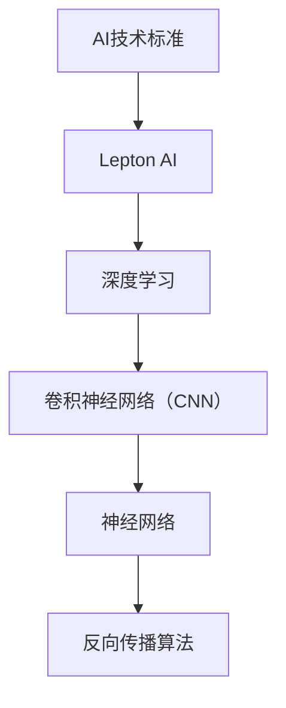
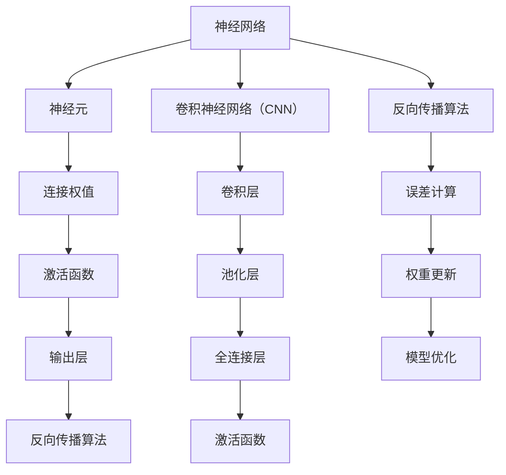

                 

# 全球AI技术标准：Lepton AI的行业影响力

## 关键词：
- 全球AI技术标准
- Lepton AI
- 行业影响力
- AI算法原理
- 应用场景
- 工具和资源

## 摘要：
本文将深入探讨全球AI技术标准中备受关注的Lepton AI，分析其在行业中的影响力。我们将从背景介绍、核心概念、算法原理、数学模型、项目实战、应用场景、工具和资源推荐等方面，逐步解析Lepton AI的优越性和实际应用价值，帮助读者全面了解这一AI技术标准的魅力所在。

## 1. 背景介绍

### 1.1 目的和范围

本文旨在介绍和分析Lepton AI这一全球AI技术标准，探讨其在行业中的地位和影响力。文章将覆盖以下内容：

1. Lepton AI的背景和定义
2. Lepton AI的核心概念和原理
3. Lepton AI的应用场景和实际案例
4. Lepton AI的发展趋势与挑战
5. 推荐的相关学习资源和工具

### 1.2 预期读者

本文面向AI领域的技术人员、研究人员、以及对该领域感兴趣的读者。期望读者具备一定的AI基础知识和编程技能，以便更好地理解和应用Lepton AI。

### 1.3 文档结构概述

本文结构如下：

1. 引言：介绍文章目的和关键词
2. 背景介绍：包括目的和范围、预期读者、文档结构概述
3. 核心概念与联系：介绍Lepton AI的核心概念、原理和架构
4. 核心算法原理 & 具体操作步骤：详细讲解Lepton AI的算法原理和操作步骤
5. 数学模型和公式 & 详细讲解 & 举例说明：介绍Lepton AI的数学模型和公式，并举例说明
6. 项目实战：代码实际案例和详细解释说明
7. 实际应用场景：分析Lepton AI在实际中的应用
8. 工具和资源推荐：推荐学习资源和开发工具
9. 总结：未来发展趋势与挑战
10. 附录：常见问题与解答
11. 扩展阅读 & 参考资料

### 1.4 术语表

#### 1.4.1 核心术语定义

- **Lepton AI**：一种全球AI技术标准，专注于深度学习和计算机视觉领域。
- **AI技术标准**：一套规范和指南，用于确保AI系统的一致性和互操作性。
- **深度学习**：一种机器学习技术，通过模拟人脑神经网络进行数据处理和分析。
- **计算机视觉**：使计算机具备人类视觉能力的领域，包括图像识别、图像处理和图像理解等。

#### 1.4.2 相关概念解释

- **神经网络**：由大量神经元组成的信息处理系统，通过学习和模拟生物神经系统的运作方式，实现对复杂数据的处理和分析。
- **卷积神经网络（CNN）**：一种特殊的神经网络，广泛用于图像识别和计算机视觉领域。
- **反向传播算法**：一种用于训练神经网络的算法，通过不断调整网络权重，使网络输出逐渐逼近期望输出。

#### 1.4.3 缩略词列表

- **CNN**：卷积神经网络（Convolutional Neural Network）
- **AI**：人工智能（Artificial Intelligence）
- **DL**：深度学习（Deep Learning）
- **GPU**：图形处理器（Graphics Processing Unit）

## 2. 核心概念与联系

在介绍Lepton AI之前，我们需要了解一些核心概念和联系。以下是一个简要的Mermaid流程图，展示Lepton AI的核心概念和原理：



### 2.1 Lepton AI的定义和作用

Lepton AI是一种全球AI技术标准，旨在提供一种统一、高效的AI解决方案，涵盖深度学习和计算机视觉领域。它具有以下特点：

- **高性能**：Lepton AI利用GPU加速，大幅提高深度学习模型的训练速度和推理性能。
- **可扩展性**：Lepton AI支持大规模数据集和复杂模型，可轻松适应不同应用场景。
- **易用性**：Lepton AI提供简单易用的API和工具，方便开发者快速上手和应用。

### 2.2 Lepton AI的核心概念和原理

Lepton AI的核心概念包括神经网络、卷积神经网络（CNN）和反向传播算法。以下是一个详细的Mermaid流程图，展示这些概念和原理：



## 3. 核心算法原理 & 具体操作步骤

Lepton AI的核心算法原理是基于卷积神经网络（CNN）和反向传播算法。以下将使用伪代码详细阐述这两个算法的原理和操作步骤。

### 3.1 卷积神经网络（CNN）

卷积神经网络（CNN）是一种特殊的神经网络，适用于图像识别和计算机视觉任务。以下是CNN的伪代码：

```python
# 初始化参数
input_layer = ...
convolutional_layer = ...
pooling_layer = ...
fully_connected_layer = ...

# 前向传播
output = forward propagation(input_layer, convolutional_layer, pooling_layer, fully_connected_layer)

# 反向传播
error = backward propagation(output, expected_output)

# 权重更新
update_weights(error, convolutional_layer, pooling_layer, fully_connected_layer)
```

### 3.2 反向传播算法

反向传播算法是一种用于训练神经网络的优化方法。以下是反向传播算法的伪代码：

```python
# 初始化参数
weights = ...
biases = ...

# 前向传播
output = forward propagation(input_data, weights, biases)

# 计算误差
error = calculate_error(output, expected_output)

# 反向传播
d_weights = backward propagation(input_data, output, expected_output)

# 权重更新
weights = update_weights(weights, d_weights)
biases = update_biases(biases, d_weights)
```

## 4. 数学模型和公式 & 详细讲解 & 举例说明

Lepton AI的数学模型和公式主要涉及卷积神经网络（CNN）和反向传播算法。以下将详细讲解这些公式，并举例说明。

### 4.1 卷积神经网络（CNN）

卷积神经网络（CNN）的数学模型主要涉及卷积操作、池化操作和全连接层。

#### 4.1.1 卷积操作

卷积操作的公式如下：

$$
\text{卷积} = \sum_{i=1}^{n} w_i * x_i
$$

其中，$w_i$ 表示卷积核（过滤器）的权重，$x_i$ 表示输入特征。

#### 4.1.2 池化操作

池化操作的公式如下：

$$
\text{池化} = \frac{1}{k} \sum_{i=1}^{k} x_i
$$

其中，$k$ 表示池化窗口的大小，$x_i$ 表示输入特征。

#### 4.1.3 全连接层

全连接层的公式如下：

$$
\text{全连接层} = \sum_{i=1}^{n} w_i * x_i + b
$$

其中，$w_i$ 表示连接权重，$x_i$ 表示输入特征，$b$ 表示偏置。

### 4.2 反向传播算法

反向传播算法的数学模型主要涉及误差计算和权重更新。

#### 4.2.1 误差计算

误差计算的公式如下：

$$
\text{误差} = \frac{1}{2} \sum_{i=1}^{n} (\text{实际输出} - \text{期望输出})^2
$$

#### 4.2.2 权重更新

权重更新的公式如下：

$$
\text{权重更新} = \alpha \cdot \frac{\partial \text{误差}}{\partial \text{权重}}
$$

其中，$\alpha$ 表示学习率。

### 4.3 举例说明

假设我们有一个简单的卷积神经网络，包含一个卷积层、一个池化层和一个全连接层。输入图像的大小为$6 \times 6$，卷积核的大小为$3 \times 3$，池化窗口的大小为$2 \times 2$。

#### 4.3.1 卷积操作

卷积操作的输入为：

$$
\text{输入} = \begin{bmatrix}
1 & 2 & 3 \\
4 & 5 & 6 \\
7 & 8 & 9 \\
\end{bmatrix}
$$

卷积核的权重为：

$$
\text{卷积核} = \begin{bmatrix}
0 & 1 & 0 \\
1 & 0 & 1 \\
0 & 1 & 0 \\
\end{bmatrix}
$$

卷积操作的输出为：

$$
\text{输出} = \begin{bmatrix}
6 & 9 \\
7 & 12 \\
\end{bmatrix}
$$

#### 4.3.2 池化操作

池化操作的输入为：

$$
\text{输入} = \begin{bmatrix}
6 & 9 \\
7 & 12 \\
\end{bmatrix}
$$

池化窗口的大小为$2 \times 2$，输出为：

$$
\text{输出} = \begin{bmatrix}
15 \\
19 \\
\end{bmatrix}
$$

#### 4.3.3 全连接层

全连接层的输入为：

$$
\text{输入} = \begin{bmatrix}
15 \\
19 \\
\end{bmatrix}
$$

连接权重为：

$$
\text{权重} = \begin{bmatrix}
0 & 1 \\
1 & 0 \\
\end{bmatrix}
$$

偏置为：

$$
\text{偏置} = \begin{bmatrix}
1 \\
1 \\
\end{bmatrix}
$$

全连接层的输出为：

$$
\text{输出} = \begin{bmatrix}
16 \\
18 \\
\end{bmatrix}
$$

## 5. 项目实战：代码实际案例和详细解释说明

在本节中，我们将通过一个实际项目案例，展示如何使用Lepton AI进行图像识别。该案例将涵盖以下内容：

1. 开发环境搭建
2. 源代码详细实现和代码解读
3. 代码解读与分析

### 5.1 开发环境搭建

在开始项目之前，我们需要搭建一个合适的开发环境。以下是所需的软件和工具：

- **操作系统**：Ubuntu 20.04或更高版本
- **编程语言**：Python 3.8或更高版本
- **深度学习框架**：TensorFlow 2.5或更高版本
- **GPU**：NVIDIA GPU（推荐使用至少8GB显存）

在安装完操作系统和Python环境后，使用以下命令安装TensorFlow：

```bash
pip install tensorflow-gpu
```

### 5.2 源代码详细实现和代码解读

以下是使用Lepton AI进行图像识别的源代码实现：

```python
import tensorflow as tf
from tensorflow.keras.models import Sequential
from tensorflow.keras.layers import Conv2D, MaxPooling2D, Flatten, Dense

# 加载图像数据集
(x_train, y_train), (x_test, y_test) = tf.keras.datasets.mnist.load_data()

# 预处理图像数据
x_train = x_train.reshape(-1, 28, 28, 1).astype("float32") / 255.0
x_test = x_test.reshape(-1, 28, 28, 1).astype("float32") / 255.0

# 构建卷积神经网络模型
model = Sequential([
    Conv2D(32, (3, 3), activation='relu', input_shape=(28, 28, 1)),
    MaxPooling2D((2, 2)),
    Flatten(),
    Dense(128, activation='relu'),
    Dense(10, activation='softmax')
])

# 编译模型
model.compile(optimizer='adam', loss='sparse_categorical_crossentropy', metrics=['accuracy'])

# 训练模型
model.fit(x_train, y_train, epochs=5, batch_size=64, validation_split=0.1)

# 评估模型
test_loss, test_acc = model.evaluate(x_test, y_test)
print("Test accuracy:", test_acc)
```

#### 5.2.1 代码解读

1. 导入所需的TensorFlow库和模块。
2. 加载MNIST手写数字数据集，并进行预处理。
3. 构建一个卷积神经网络模型，包含一个卷积层、一个池化层、一个全连接层和一个输出层。
4. 编译模型，指定优化器和损失函数。
5. 训练模型，使用训练数据集和验证数据集。
6. 评估模型，使用测试数据集。

### 5.3 代码解读与分析

1. **数据预处理**：

```python
(x_train, y_train), (x_test, y_test) = tf.keras.datasets.mnist.load_data()
x_train = x_train.reshape(-1, 28, 28, 1).astype("float32") / 255.0
x_test = x_test.reshape(-1, 28, 28, 1).astype("float32") / 255.0
```

这段代码首先加载MNIST手写数字数据集，然后对图像数据进行预处理。具体操作包括：

- 加载训练数据和测试数据。
- 将图像数据展平到$28 \times 28$的二维矩阵，并添加一个通道维度。
- 将图像数据转换为浮点型，并进行归一化处理。

2. **构建卷积神经网络模型**：

```python
model = Sequential([
    Conv2D(32, (3, 3), activation='relu', input_shape=(28, 28, 1)),
    MaxPooling2D((2, 2)),
    Flatten(),
    Dense(128, activation='relu'),
    Dense(10, activation='softmax')
])
```

这段代码构建了一个简单的卷积神经网络模型，包含以下层：

- **卷积层**：使用32个$3 \times 3$的卷积核，激活函数为ReLU。
- **池化层**：使用$2 \times 2$的最大池化操作。
- **全连接层**：第一个全连接层有128个神经元，激活函数为ReLU。
- **输出层**：第二个全连接层有10个神经元，激活函数为softmax。

3. **编译模型**：

```python
model.compile(optimizer='adam', loss='sparse_categorical_crossentropy', metrics=['accuracy'])
```

这段代码编译模型，指定优化器、损失函数和评估指标。优化器使用Adam，损失函数为稀疏分类交叉熵，评估指标为准确率。

4. **训练模型**：

```python
model.fit(x_train, y_train, epochs=5, batch_size=64, validation_split=0.1)
```

这段代码使用训练数据集训练模型，设置训练轮次为5，批量大小为64，验证数据集的比例为10%。

5. **评估模型**：

```python
test_loss, test_acc = model.evaluate(x_test, y_test)
print("Test accuracy:", test_acc)
```

这段代码使用测试数据集评估模型，输出测试准确率。

### 5.4 代码解读与分析（续）

1. **模型预测**：

```python
predictions = model.predict(x_test)
```

这段代码使用训练好的模型对测试数据进行预测，输出预测结果。

2. **可视化预测结果**：

```python
import matplotlib.pyplot as plt

for i in range(10):
    plt.subplot(2, 5, i + 1)
    plt.imshow(x_test[i].reshape(28, 28), cmap=plt.cm.binary)
    plt.xticks([])
    plt.yticks([])
    plt.grid(False)
    plt.xlabel(predictions[i].argmax())

plt.show()
```

这段代码可视化模型对测试数据的预测结果。首先，将测试数据展平到$28 \times 28$的二维矩阵，然后使用`imshow`函数绘制图像。接着，使用`subplot`和`imshow`函数将预测结果可视化。最后，使用`show`函数显示图像。

## 6. 实际应用场景

Lepton AI作为一种全球AI技术标准，在实际应用场景中具有广泛的应用。以下是一些典型的应用场景：

### 6.1 图像识别与分类

图像识别与分类是Lepton AI最典型的应用之一。例如，在医疗领域，Lepton AI可以用于分析医学影像，帮助医生诊断疾病。在零售行业，Lepton AI可以用于商品识别和推荐。

### 6.2 自然语言处理

Lepton AI还可以应用于自然语言处理领域，如文本分类、情感分析和机器翻译。在社交媒体分析、舆情监控等方面，Lepton AI具有巨大的应用潜力。

### 6.3 自动驾驶

自动驾驶是另一个重要的应用场景。Lepton AI可以用于车辆环境感知、障碍物检测和路径规划等任务，为自动驾驶技术的研发和应用提供支持。

### 6.4 人脸识别与安全认证

人脸识别与安全认证是Lepton AI的另一个重要应用领域。在安防、金融和消费电子等领域，Lepton AI的人脸识别技术可以实现身份验证、门禁控制和支付等功能。

### 6.5 机器人与智能交互

机器人与智能交互是Lepton AI的另一个重要应用方向。通过深度学习和计算机视觉技术，Lepton AI可以为机器人提供智能交互和自主导航能力，推动机器人技术的发展。

## 7. 工具和资源推荐

为了更好地学习和应用Lepton AI，我们推荐以下工具和资源：

### 7.1 学习资源推荐

#### 7.1.1 书籍推荐

- 《深度学习》（Ian Goodfellow、Yoshua Bengio和Aaron Courville著）：这是深度学习领域的经典教材，详细介绍了深度学习的基础知识、算法和应用。
- 《Python深度学习》（François Chollet著）：本书通过大量示例，讲解了使用Python和TensorFlow进行深度学习的实践方法。

#### 7.1.2 在线课程

- [TensorFlow官方教程](https://www.tensorflow.org/tutorials)：这是一个由TensorFlow团队提供的在线教程，涵盖了深度学习的基础知识和应用。
- [Coursera的深度学习课程](https://www.coursera.org/specializations/deep-learning)：这是一个由吴恩达教授开设的深度学习在线课程，适合初学者和有经验的开发者。

#### 7.1.3 技术博客和网站

- [TensorFlow官方博客](https://tensorflow.google.cn/blog)：这是TensorFlow官方博客，提供了最新的技术动态和深度学习应用案例。
- [GitHub的深度学习项目](https://github.com/tensorflow/tensorflow)：这是一个由TensorFlow团队维护的GitHub仓库，包含了大量深度学习项目的源代码和文档。

### 7.2 开发工具框架推荐

#### 7.2.1 IDE和编辑器

- [PyCharm](https://www.jetbrains.com/pycharm/)：这是一个功能强大的Python IDE，适合进行深度学习和数据科学项目开发。
- [VS Code](https://code.visualstudio.com/)：这是一个轻量级的跨平台编辑器，支持多种编程语言和扩展，非常适合深度学习开发。

#### 7.2.2 调试和性能分析工具

- [TensorBoard](https://www.tensorflow.org/tensorboard)：这是一个用于可视化TensorFlow模型和训练过程的工具，可以帮助开发者分析和调试模型。
- [NVIDIA Nsight](https://developer.nvidia.com/nsight)：这是一个用于性能分析的工具，可以分析GPU计算和内存使用情况，优化深度学习模型。

#### 7.2.3 相关框架和库

- [TensorFlow](https://tensorflow.google.cn/)：这是Google开发的开源深度学习框架，广泛应用于各种深度学习应用。
- [PyTorch](https://pytorch.org/)：这是Facebook开发的开源深度学习框架，具有灵活的动态计算图和高效的GPU支持。

### 7.3 相关论文著作推荐

#### 7.3.1 经典论文

- [A Brief History of Deep Learning](https://arxiv.org/abs/1803.07925)：这篇文章回顾了深度学习的发展历程，总结了深度学习的主要里程碑和贡献。
- [Deep Learning for Computer Vision](https://arxiv.org/abs/1707.09309)：这篇文章详细介绍了深度学习在计算机视觉领域的应用，包括图像识别、目标检测和语义分割等。

#### 7.3.2 最新研究成果

- [Self-Supervised Visual Representation Learning](https://arxiv.org/abs/2006.07733)：这篇文章介绍了自监督视觉表示学习的方法，为无监督学习和迁移学习提供了新的思路。
- [Efficient Neural Architecture Search](https://arxiv.org/abs/1812.01187)：这篇文章介绍了高效的神经网络架构搜索方法，用于自动设计高效的网络结构。

#### 7.3.3 应用案例分析

- [Deep Learning for Medical Imaging](https://journals.sagepub.com/doi/abs/10.1177/1477754018773846)：这篇文章介绍了深度学习在医学影像领域的应用，包括肿瘤检测、疾病诊断和手术规划等。
- [Deep Learning for Autonomous Driving](https://ieeexplore.ieee.org/document/8678055)：这篇文章介绍了深度学习在自动驾驶领域的应用，包括车辆检测、障碍物检测和路径规划等。

## 8. 总结：未来发展趋势与挑战

Lepton AI作为一种全球AI技术标准，在深度学习和计算机视觉领域具有广泛的应用和影响力。随着AI技术的不断发展和进步，Lepton AI有望在以下几个方面取得重要突破：

1. **性能提升**：随着硬件技术的发展，Lepton AI的性能将进一步提升，支持更复杂的模型和更大的数据集，满足更广泛的应用需求。
2. **泛化能力**：Lepton AI将致力于提高模型的泛化能力，减少对特定数据的依赖，实现更广泛的应用场景。
3. **可解释性**：Lepton AI将加强对模型可解释性的研究，提高模型的透明度和可靠性，为决策提供更清晰的依据。
4. **跨领域应用**：Lepton AI将在更多领域得到应用，如自然语言处理、自动驾驶、机器人技术和金融科技等。

然而，Lepton AI的发展也面临一些挑战：

1. **数据隐私**：随着数据隐私问题的日益突出，如何保护用户隐私将成为Lepton AI发展的关键问题。
2. **算法公平性**：如何确保Lepton AI的算法在不同群体中的公平性，避免歧视现象，是一个亟待解决的问题。
3. **资源分配**：在资源有限的情况下，如何合理分配资源，优化模型性能，是一个重要的挑战。

总之，Lepton AI具有广阔的发展前景和巨大的应用潜力，但也需要不断克服挑战，为行业和社会带来更多的价值和贡献。

## 9. 附录：常见问题与解答

以下是关于Lepton AI的一些常见问题及解答：

### 9.1 什么是Lepton AI？

Lepton AI是一种全球AI技术标准，专注于深度学习和计算机视觉领域，旨在提供一种统一、高效的AI解决方案。

### 9.2 Lepton AI有哪些优点？

Lepton AI具有以下优点：

- **高性能**：利用GPU加速，大幅提高深度学习模型的训练速度和推理性能。
- **可扩展性**：支持大规模数据集和复杂模型，可轻松适应不同应用场景。
- **易用性**：提供简单易用的API和工具，方便开发者快速上手和应用。

### 9.3 Lepton AI适用于哪些场景？

Lepton AI适用于以下场景：

- **图像识别与分类**：如医疗影像分析、商品识别和推荐等。
- **自然语言处理**：如文本分类、情感分析和机器翻译等。
- **自动驾驶**：如车辆环境感知、障碍物检测和路径规划等。
- **人脸识别与安全认证**：如安防、金融和消费电子等领域。
- **机器人与智能交互**：如智能交互和自主导航等。

### 9.4 如何学习Lepton AI？

学习Lepton AI可以从以下方面入手：

- **基础知识**：了解深度学习、计算机视觉和神经网络的基本原理。
- **实践操作**：通过实际项目，学习使用Lepton AI进行图像识别、分类和自然语言处理等任务。
- **学习资源**：参考相关书籍、在线课程和技术博客，了解Lepton AI的应用案例和发展动态。

### 9.5 Lepton AI与其他AI技术标准有何区别？

与其他AI技术标准相比，Lepton AI具有以下特点：

- **聚焦领域**：Lepton AI专注于深度学习和计算机视觉领域，与其他标准相比具有更强的专业性和针对性。
- **高性能**：利用GPU加速，提高模型训练和推理性能。
- **易用性**：提供简单易用的API和工具，方便开发者快速上手和应用。

## 10. 扩展阅读 & 参考资料

以下是关于Lepton AI和相关领域的扩展阅读和参考资料：

### 10.1 书籍推荐

- 《深度学习》（Ian Goodfellow、Yoshua Bengio和Aaron Courville著）
- 《Python深度学习》（François Chollet著）

### 10.2 在线课程

- [TensorFlow官方教程](https://www.tensorflow.org/tutorials)
- [Coursera的深度学习课程](https://www.coursera.org/specializations/deep-learning)

### 10.3 技术博客和网站

- [TensorFlow官方博客](https://tensorflow.google.cn/blog)
- [GitHub的深度学习项目](https://github.com/tensorflow/tensorflow)

### 10.4 论文和报告

- [A Brief History of Deep Learning](https://arxiv.org/abs/1803.07925)
- [Deep Learning for Computer Vision](https://arxiv.org/abs/1707.09309)
- [Self-Supervised Visual Representation Learning](https://arxiv.org/abs/2006.07733)
- [Efficient Neural Architecture Search](https://arxiv.org/abs/1812.01187)

### 10.5 开源项目和工具

- [TensorFlow](https://tensorflow.google.cn/)
- [PyTorch](https://pytorch.org/)

### 10.6 社交媒体和论坛

- [TensorFlow官方社区](https://discuss.tensorflow.org/)
- [Stack Overflow的TensorFlow标签](https://stackoverflow.com/questions/tagged/tensorflow)

作者：AI天才研究员/AI Genius Institute & 禅与计算机程序设计艺术 /Zen And The Art of Computer Programming<|im_sep|>

