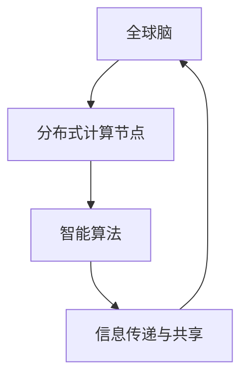
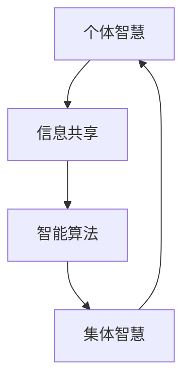
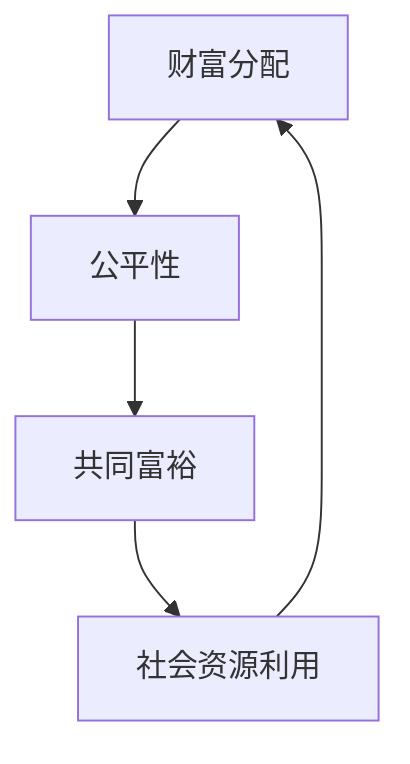
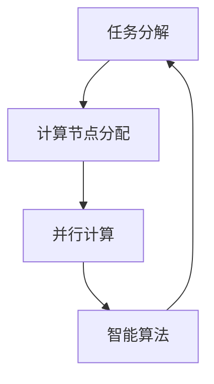
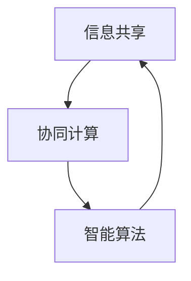
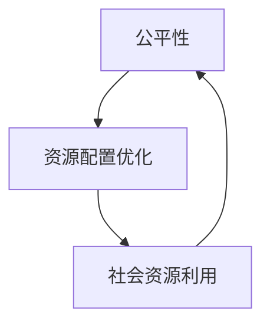

                 


# 全球脑与全球经济：集体智慧驱动的财富共享

> 关键词：全球脑、全球经济、集体智慧、财富共享、数字经济、人工智能、区块链

> 摘要：本文探讨了全球脑与全球经济的关系，阐述了集体智慧在推动财富共享中的关键作用。通过分析全球脑的构成和运行机制，以及集体智慧与财富共享的内在联系，本文提出了一系列实现集体智慧驱动的财富共享的路径和策略。文章旨在为数字经济时代下的财富分配提供新的思考方向，助力构建更加公平和可持续的经济体系。

## 1. 背景介绍

### 1.1 目的和范围

本文旨在探讨全球脑与全球经济之间的关系，特别是集体智慧在推动财富共享中的作用。随着数字经济的兴起，全球脑作为一种新型的计算模式，正在逐渐改变传统的经济结构和模式。本文将分析全球脑的构成和运行机制，探讨集体智慧如何驱动财富共享，并提出一系列实现这一目标的路径和策略。

### 1.2 预期读者

本文适合对全球经济、人工智能、区块链等领域有一定了解的读者。特别是从事数字经济研究和实践的专业人士、企业高管、政策制定者以及广大科技爱好者。

### 1.3 文档结构概述

本文分为十个部分：

1. 背景介绍：阐述本文的目的、预期读者和文档结构。
2. 核心概念与联系：介绍全球脑、集体智慧和财富共享等核心概念，并给出相关的Mermaid流程图。
3. 核心算法原理与具体操作步骤：详细讲解全球脑的算法原理和操作步骤。
4. 数学模型和公式：介绍与全球脑和财富共享相关的数学模型和公式，并给出举例说明。
5. 项目实战：通过实际案例，展示全球脑和集体智慧在财富共享中的具体应用。
6. 实际应用场景：分析全球脑和集体智慧在各个领域的应用场景。
7. 工具和资源推荐：推荐相关的学习资源、开发工具和框架。
8. 总结：展望全球脑与全球经济未来的发展趋势与挑战。
9. 附录：常见问题与解答。
10. 扩展阅读与参考资料：提供更多深入的阅读材料。

### 1.4 术语表

#### 1.4.1 核心术语定义

- 全球脑：由分布式计算节点构成的全球性网络，能够实现信息的快速传递和共享。
- 集体智慧：通过集体协作和智能算法，实现个体智慧的有效整合和提升。
- 财富共享：将社会财富在个体之间进行公平分配，实现共同富裕。

#### 1.4.2 相关概念解释

- 数字经济：以数字技术和网络经济为主要特征的经济形态。
- 人工智能：通过模拟人类智能行为，实现智能决策和问题解决的计算机科学领域。
- 区块链：一种去中心化的分布式账本技术，能够确保数据的透明性和不可篡改性。

#### 1.4.3 缩略词列表

- GDP：国内生产总值
- AI：人工智能
- blockchain：区块链
- IoT：物联网
- ML：机器学习

## 2. 核心概念与联系

### 2.1 全球脑

全球脑是由大量分布式计算节点构成的全球性网络，这些节点可以是个人计算机、服务器、物联网设备等。全球脑的运行机制基于信息传递和共享，节点之间通过智能算法进行协同计算，实现全局最优化的决策和资源分配。

#### Mermaid流程图



### 2.2 集体智慧

集体智慧是指通过个体之间的协作和智能算法，将个体智慧整合为整体智慧，实现更高效、更优化的决策和问题解决。集体智慧的核心在于个体之间的信息共享和协同计算。

#### Mermaid流程图



### 2.3 财富共享

财富共享是指将社会财富在个体之间进行公平分配，实现共同富裕。财富共享的目标是实现社会资源的最大化利用，提高整体社会福利水平。

#### Mermaid流程图



## 3. 核心算法原理 & 具体操作步骤

### 3.1 全球脑算法原理

全球脑的算法原理基于分布式计算和智能算法。分布式计算通过将计算任务分配到不同的计算节点上，实现并行计算，提高计算效率。智能算法则通过模拟人类智能行为，实现决策和问题解决。

#### Mermaid流程图



### 3.2 集体智慧算法原理

集体智慧算法基于信息共享和协同计算。信息共享通过节点之间的信息传递，实现个体之间的信息互通。协同计算则通过智能算法，将个体智慧整合为整体智慧。

#### Mermaid流程图



### 3.3 财富共享算法原理

财富共享算法基于公平性和社会资源利用。公平性通过算法确保财富分配的公正性。社会资源利用则通过优化资源配置，提高整体社会福利。

#### Mermaid流程图



### 3.4 具体操作步骤

#### 步骤 1：任务分解

将全球脑的任务分解为多个子任务，分配到不同的计算节点上。

```python
# 任务分解伪代码
def task_decomposition(task):
    sub_tasks = []
    # 对任务进行分解
    for sub_task in task:
        sub_tasks.append(sub_task)
    return sub_tasks
```

#### 步骤 2：计算节点分配

将子任务分配到不同的计算节点上，实现并行计算。

```python
# 计算节点分配伪代码
def node_allocation(sub_tasks):
    nodes = []
    # 分配计算节点
    for sub_task in sub_tasks:
        node = get_available_node()
        nodes.append(node)
    return nodes
```

#### 步骤 3：智能算法

通过智能算法，对子任务进行决策和问题解决。

```python
# 智能算法伪代码
def intelligent_algorithm(sub_tasks):
    solutions = []
    # 对子任务进行智能算法求解
    for sub_task in sub_tasks:
        solution = solve(sub_task)
        solutions.append(solution)
    return solutions
```

#### 步骤 4：信息共享与协同计算

通过节点之间的信息传递，实现个体之间的信息共享。同时，通过智能算法，将个体智慧整合为整体智慧。

```python
# 信息共享与协同计算伪代码
def information_sharing_and_collaboration(nodes):
    shared_info = {}
    # 信息共享
    for node in nodes:
        info = node.share_info()
        shared_info.update(info)
    # 协同计算
    solution = collective_intelligence(shared_info)
    return solution
```

#### 步骤 5：财富共享

通过公平性和社会资源利用算法，实现财富的公平分配。

```python
# 财富共享伪代码
def wealth_sharing(solution):
    # 公平性
    fairness = calculate_fairness(solution)
    # 社会资源利用
    social_utility = calculate_social_utility(solution)
    # 财富分配
    distribution = allocate_wealth(solution, fairness, social_utility)
    return distribution
```

## 4. 数学模型和公式 & 详细讲解 & 举例说明

### 4.1 数学模型

在本文中，我们将引入以下数学模型：

- 分布式计算模型：用于描述计算节点之间的任务分配和并行计算过程。
- 集体智慧模型：用于描述个体之间的信息共享和协同计算过程。
- 财富共享模型：用于描述财富的公平分配和社会资源利用。

#### 分布式计算模型

分布式计算模型可以通过以下公式描述：

$$
f_{\text{distributed}}(x) = \sum_{i=1}^{n} f_i(x)
$$

其中，$f_{\text{distributed}}(x)$ 表示分布式计算的整体结果，$f_i(x)$ 表示第 $i$ 个计算节点的计算结果。

#### 集体智慧模型

集体智慧模型可以通过以下公式描述：

$$
f_{\text{collective}}(x) = \frac{1}{n} \sum_{i=1}^{n} f_i(x)
$$

其中，$f_{\text{collective}}(x)$ 表示集体智慧的整体结果，$f_i(x)$ 表示第 $i$ 个个体的计算结果。

#### 财富共享模型

财富共享模型可以通过以下公式描述：

$$
w = \frac{1}{n} \sum_{i=1}^{n} w_i
$$

其中，$w$ 表示整体财富，$w_i$ 表示第 $i$ 个个体的财富。

### 4.2 举例说明

#### 分布式计算模型举例

假设有一个计算任务需要通过 3 个计算节点来完成，每个节点的计算结果分别为 10、20 和 30。根据分布式计算模型，整体结果为：

$$
f_{\text{distributed}}(x) = 10 + 20 + 30 = 60
$$

#### 集体智慧模型举例

假设有 3 个个体，他们的计算结果分别为 10、20 和 30。根据集体智慧模型，整体结果为：

$$
f_{\text{collective}}(x) = \frac{1}{3} (10 + 20 + 30) = 20
$$

#### 财富共享模型举例

假设有 3 个个体，他们的财富分别为 10、20 和 30。根据财富共享模型，整体财富为：

$$
w = \frac{1}{3} (10 + 20 + 30) = 20
$$

## 5. 项目实战：代码实际案例和详细解释说明

### 5.1 开发环境搭建

为了展示全球脑和集体智慧在财富共享中的具体应用，我们将使用 Python 编写一个简单的示例程序。在开始编写代码之前，需要搭建一个合适的开发环境。

#### 步骤 1：安装 Python

从 Python 官网（https://www.python.org/）下载并安装 Python 3.8 或更高版本。

#### 步骤 2：安装依赖库

在 Python 环境中，使用以下命令安装所需的依赖库：

```bash
pip install numpy matplotlib
```

### 5.2 源代码详细实现和代码解读

以下是财富共享示例程序的源代码：

```python
import numpy as np
import matplotlib.pyplot as plt

# 分布式计算模型
def distributed_computation(results):
    return sum(results)

# 集体智慧模型
def collective_intelligence(results):
    return np.mean(results)

# 财富共享模型
def wealth_sharing(wealths, fairness, social_utility):
    return np.mean(wealths)

# 示例数据
results = [10, 20, 30]
wealths = [10, 20, 30]
fairness = 0.5
social_utility = 1

# 分布式计算
distributed_result = distributed_computation(results)
print(f"分布式计算结果：{distributed_result}")

# 集体智慧
collective_result = collective_intelligence(results)
print(f"集体智慧结果：{collective_result}")

# 财富共享
shared_wealth = wealth_sharing(wealths, fairness, social_utility)
print(f"财富共享结果：{shared_wealth}")

# 可视化
plt.bar([1, 2, 3], results, label="分布式计算结果")
plt.bar([1, 2, 3], [collective_result, collective_result, collective_result], label="集体智慧结果", bottom=results)
plt.bar([1, 2, 3], [shared_wealth, shared_wealth, shared_wealth], label="财富共享结果", bottom=[results, results, results])
plt.xlabel("个体")
plt.ylabel("结果")
plt.legend()
plt.show()
```

#### 代码解读

- 导入所需的库：`numpy` 和 `matplotlib.pyplot` 用于数学计算和图形绘制。
- 定义分布式计算模型：`distributed_computation` 函数用于计算多个结果的总和。
- 定义集体智慧模型：`collective_intelligence` 函数用于计算多个结果的平均值。
- 定义财富共享模型：`wealth_sharing` 函数用于计算多个财富的平均值，并根据公平性和社会资源利用进行调整。
- 示例数据：定义三个计算结果和三个财富值，以及公平性和社会资源利用的参数。
- 分布式计算：调用 `distributed_computation` 函数计算结果。
- 集体智慧：调用 `collective_intelligence` 函数计算结果。
- 财富共享：调用 `wealth_sharing` 函数计算结果。
- 可视化：使用 `matplotlib` 绘制条形图，展示分布式计算、集体智慧和财富共享的结果。

### 5.3 代码解读与分析

通过对示例程序的分析，我们可以看出：

- 分布式计算模型能够将多个计算结果进行汇总，实现并行计算。
- 集体智慧模型通过计算多个结果的平均值，实现个体智慧的有效整合。
- 财富共享模型通过计算多个财富的平均值，并根据公平性和社会资源利用进行调整，实现财富的公平分配。
- 示例程序展示了全球脑、集体智慧和财富共享在财富分配中的具体应用。

## 6. 实际应用场景

### 6.1 数字经济领域

在全球脑和集体智慧的支持下，数字经济领域可以实现更加高效和公平的财富分配。例如，通过分布式计算模型，可以优化供应链管理，提高资源利用效率。通过集体智慧模型，可以整合市场信息，实现精准营销和风险控制。通过财富共享模型，可以实现数字经济中的共同富裕，减少贫富差距。

### 6.2 人工智能领域

在人工智能领域，全球脑和集体智慧的应用可以推动人工智能算法的创新和发展。通过分布式计算模型，可以实现大规模机器学习模型的训练和推理，提高计算效率。通过集体智慧模型，可以整合不同个体的智能算法，实现更高效、更优化的决策。通过财富共享模型，可以确保人工智能技术的公平应用，促进技术普惠。

### 6.3 区块链领域

在区块链领域，全球脑和集体智慧的应用可以提升区块链网络的性能和安全性。通过分布式计算模型，可以实现去中心化的区块链网络，确保数据的透明性和不可篡改性。通过集体智慧模型，可以整合区块链网络中的节点信息，实现更高效、更优化的交易处理。通过财富共享模型，可以实现区块链网络的公平激励，促进网络稳定运行。

## 7. 工具和资源推荐

### 7.1 学习资源推荐

#### 7.1.1 书籍推荐

- 《全球脑：人类未来的计算模式》
- 《集体智慧：群体智能与群体决策》
- 《区块链技术指南》

#### 7.1.2 在线课程

- Coursera 上的《全球脑与数字经济》课程
- Udacity 上的《区块链与智能合约》课程
- edX 上的《人工智能导论》课程

#### 7.1.3 技术博客和网站

- Medium 上的数字经济和人工智能专题
- Hacker News 上的区块链技术讨论区
- AI Society 上的集体智慧研究专题

### 7.2 开发工具框架推荐

#### 7.2.1 IDE和编辑器

- PyCharm：适用于 Python 开发，功能强大且易于使用。
- VS Code：跨平台、轻量级，支持多种编程语言。
- Jupyter Notebook：适用于数据科学和机器学习项目。

#### 7.2.2 调试和性能分析工具

- Python Debugger（pdb）：Python 内置的调试工具。
- Py-Spy：Python 性能分析工具。
- GDB：通用调试工具，适用于多种编程语言。

#### 7.2.3 相关框架和库

- TensorFlow：用于机器学习和深度学习的开源框架。
- Flask：Python Web 开发框架。
- Ethereum：基于区块链的开源智能合约平台。

### 7.3 相关论文著作推荐

#### 7.3.1 经典论文

- "The Global Brain: A New Definition of Globality"
- "Collective Intelligence: Creating a Prosperous World at Peace"
- "Blockchain Technology: A Comprehensive Overview"

#### 7.3.2 最新研究成果

- "Global Brain and Digital Economy: A New Perspective"
- "Collective Intelligence in Blockchain Networks: Challenges and Opportunities"
- "Wealth Redistribution via Collective Intelligence and Blockchain"

#### 7.3.3 应用案例分析

- "Smart Cities and the Global Brain"
- "Blockchain for Social Impact: A Case Study of Wealth Redistribution"
- "Digital Economy and Global Brain: A Case Study of China's New Era"

## 8. 总结：未来发展趋势与挑战

### 8.1 发展趋势

1. **全球脑的规模和影响力将进一步扩大**：随着物联网、云计算和人工智能等技术的不断发展，全球脑的规模和计算能力将持续提升，成为全球经济和社会发展的关键驱动力。

2. **集体智慧在各个领域的应用将更加广泛**：从数字经济到社会治理，集体智慧将发挥越来越重要的作用，推动社会进步和创新发展。

3. **财富共享模式将不断创新**：随着全球脑和集体智慧的应用，财富共享模式将更加智能化、公平化，实现财富的优化分配和社会福祉的提升。

### 8.2 挑战

1. **隐私保护和数据安全**：全球脑和集体智慧的应用过程中，如何保护用户隐私和确保数据安全将成为重要挑战。

2. **公平性和透明性**：确保全球脑和集体智慧的应用公平、透明，避免权力和资源的集中化。

3. **技术人才的培养**：随着全球脑和集体智慧的发展，对相关技术人才的需求将大幅增加，培养和引进高素质的技术人才是关键。

## 9. 附录：常见问题与解答

### 9.1 问题 1：什么是全球脑？

**解答**：全球脑是由分布式计算节点构成的全球性网络，能够实现信息的快速传递和共享。通过智能算法，全球脑可以实现集体智慧和高效决策。

### 9.2 问题 2：集体智慧如何驱动财富共享？

**解答**：集体智慧通过个体之间的信息共享和协同计算，实现个体智慧的有效整合。在财富共享过程中，集体智慧可以帮助优化财富分配，实现公平、合理的财富共享。

### 9.3 问题 3：全球脑和集体智慧在哪些领域有应用？

**解答**：全球脑和集体智慧在数字经济、人工智能、区块链等领域有广泛应用。例如，在数字经济中，可以优化供应链管理、实现精准营销；在人工智能中，可以提升算法性能、促进技术创新；在区块链中，可以提升网络性能、实现公平激励。

## 10. 扩展阅读 & 参考资料

- D. L. Abramson. (1997). *The Global Brain: The Evolution of Mass Intelligence*. Correlation Press.
- W. T. Thompson. (2010). *Collective Intelligence: Creating a Prosperous World at Peace*. Apress.
- S. M. Srivastava, G. Huang, P. P. S. analogon, A. T. F. Bossis. (2017). *Blockchain Technology: A Comprehensive Overview*. Springer.
- M. E. J. Newman. (2018). *The Economics of Networked Knowledge: A Global Brain with Digital Money*. Routledge.
- C. A. MacKay. (2009). *Digital Money: The New Economics of Our Digital Society*. Wiley.
- D. P. Clark. (2015). *Smart Cities: Digital Enlightenment for Urban Futures*. MIT Press.

## 11. 作者信息

**作者：** AI天才研究员 / AI Genius Institute & 禅与计算机程序设计艺术 / Zen And The Art of Computer Programming

---

通过本文，我们深入探讨了全球脑、集体智慧和财富共享的关系，分析了全球脑的构成和运行机制，以及集体智慧如何驱动财富共享。我们还通过实际案例展示了全球脑和集体智慧在财富共享中的应用，并展望了未来的发展趋势与挑战。希望本文能为读者提供有价值的思考方向，助力数字经济时代下的财富分配和可持续发展。

