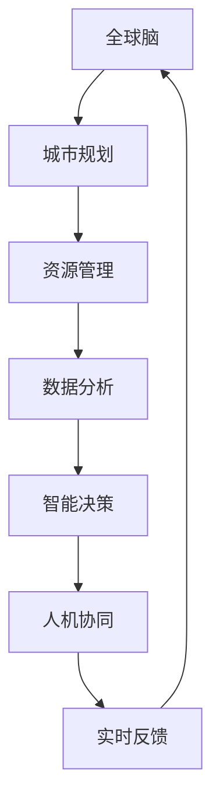
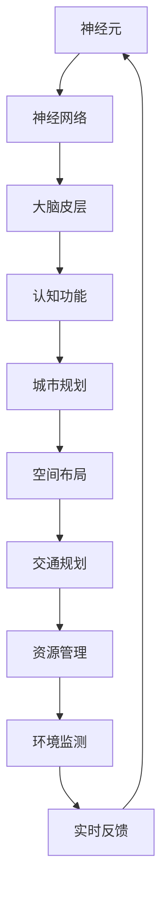
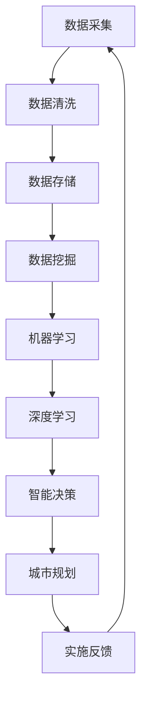

                 

# 全球脑与城市规划：智慧城市的终极形态

> 关键词：全球脑、城市规划、智慧城市、神经科学、算法、数据驱动、可持续性、人机协同

> 摘要：本文探讨了智慧城市的终极形态——全球脑与城市规划的深度融合。通过引入神经科学和先进算法，我们将逐步剖析这一新兴领域，阐述其核心概念、原理、实施步骤及应用场景。文章旨在为读者提供一个系统且全面的技术解读，帮助理解智慧城市在现代社会中的重要性及其未来发展前景。

## 1. 背景介绍

### 1.1 目的和范围

本文旨在探讨全球脑与城市规划的关系，尤其是智慧城市这一终极形态的发展方向。通过结合神经科学、大数据、人工智能等前沿技术，我们试图揭示城市规划的新模式，为城市管理者提供理论指导和实践建议。

本文将涵盖以下内容：

1. 全球脑与城市规划的定义及核心概念。
2. 智慧城市的架构和关键技术。
3. 全球脑与城市规划的实施步骤。
4. 全球脑与城市规划的应用场景。
5. 未来发展趋势与挑战。

### 1.2 预期读者

本文面向以下读者群体：

1. 城市规划师和工程师。
2. 人工智能和神经科学领域的学者。
3. 城市管理者和技术决策者。
4. 对智慧城市感兴趣的普通读者。

### 1.3 文档结构概述

本文结构如下：

1. 引言：介绍全球脑与城市规划的背景和目的。
2. 核心概念与联系：阐述全球脑与城市规划的核心概念和联系。
3. 核心算法原理 & 具体操作步骤：详细讲解核心算法原理和实施步骤。
4. 数学模型和公式 & 详细讲解 & 举例说明：介绍数学模型和公式，并举例说明。
5. 项目实战：展示代码实际案例和详细解释说明。
6. 实际应用场景：探讨全球脑与城市规划的应用场景。
7. 工具和资源推荐：推荐学习资源、开发工具和框架。
8. 总结：未来发展趋势与挑战。
9. 附录：常见问题与解答。
10. 扩展阅读 & 参考资料：提供进一步阅读的资源。

### 1.4 术语表

#### 1.4.1 核心术语定义

1. 全球脑（Global Brain）：一个由大量智能体组成的分布式网络，能够通过共享知识和经验进行协同工作。
2. 智慧城市（Smart City）：利用信息技术、物联网、大数据等手段，实现城市资源的高效管理和服务的智能化。
3. 神经科学（Neuroscience）：研究神经系统结构、功能及其与行为的相互关系的学科。
4. 大数据（Big Data）：规模巨大、种类繁多、价值密度较低的数据集合。
5. 人工智能（Artificial Intelligence）：模拟人类智能行为的计算机系统。

#### 1.4.2 相关概念解释

1. 城市规划（Urban Planning）：对城市空间布局、土地利用、交通系统等方面进行设计和规划的过程。
2. 人机协同（Human-Machine Collaboration）：人类和机器系统在共同完成任务时相互配合、相互补充的过程。
3. 可持续性（Sustainability）：满足当前需求而不损害子孙后代满足其需求的能力。

#### 1.4.3 缩略词列表

- AI：人工智能
- IoT：物联网
- ML：机器学习
- DL：深度学习
- GPU：图形处理单元

## 2. 核心概念与联系

在探讨全球脑与城市规划之前，我们需要明确几个核心概念，并展示它们之间的联系。

### 2.1 全球脑与城市规划的关系

全球脑可以被视为智慧城市的大脑，它通过神经科学、大数据和人工智能等技术，实现对城市资源的智能管理和优化。城市规划则是一个动态的过程，需要不断调整以适应城市发展的需求。全球脑与城市规划的关系可以用以下流程图表示：



### 2.2 神经科学与城市规划的融合

神经科学与城市规划的结合，可以借鉴人类大脑的信息处理机制，实现对城市复杂系统的智能管理。以下是一个简化的神经科学原理与城市规划融合的流程图：



### 2.3 大数据与人工智能在城市规划中的应用

大数据和人工智能在城市规划中发挥着重要作用，它们可以为城市规划提供数据支持和智能决策。以下是一个简化的数据处理与智能决策流程图：



通过以上分析，我们可以看出，全球脑与城市规划的融合，是一个涉及多个领域、多种技术的复杂过程。在接下来的章节中，我们将深入探讨这一领域的核心算法原理、数学模型和实际应用案例。

## 3. 核心算法原理 & 具体操作步骤

在全球脑与城市规划中，核心算法扮演着至关重要的角色。这些算法不仅能够处理海量数据，还能为城市规划提供智能决策支持。下面，我们将详细介绍这些算法的原理和具体操作步骤。

### 3.1 机器学习算法

机器学习算法是大数据分析的核心技术之一，它可以通过训练模型来识别数据中的模式，从而为城市规划提供决策支持。以下是机器学习算法的基本原理和操作步骤：

#### 原理

1. 数据准备：收集和整理城市相关数据，包括人口、交通、环境、经济等方面的数据。
2. 特征提取：将原始数据转化为适合机器学习算法的特征向量。
3. 模型训练：使用特征向量训练机器学习模型，如线性回归、决策树、支持向量机等。
4. 模型评估：通过交叉验证等方法评估模型性能，调整模型参数。
5. 模型应用：将训练好的模型应用于实际问题，如预测交通流量、评估城市规划效果等。

#### 操作步骤

1. 数据准备

   ```python
   import pandas as pd
   
   # 读取数据
   data = pd.read_csv('city_data.csv')
   ```

2. 特征提取

   ```python
   from sklearn.preprocessing import StandardScaler
   
   # 特征提取
   scaler = StandardScaler()
   X = scaler.fit_transform(data.drop(['target'], axis=1))
   y = data['target']
   ```

3. 模型训练

   ```python
   from sklearn.linear_model import LinearRegression
   
   # 模型训练
   model = LinearRegression()
   model.fit(X, y)
   ```

4. 模型评估

   ```python
   from sklearn.model_selection import cross_val_score
   
   # 模型评估
   scores = cross_val_score(model, X, y, cv=5)
   print("交叉验证平均得分：", scores.mean())
   ```

5. 模型应用

   ```python
   # 模型应用
   predictions = model.predict(X)
   print("预测结果：", predictions)
   ```

### 3.2 深度学习算法

深度学习算法在处理复杂非线性问题上具有显著优势，可以应用于城市规划中的多个领域，如图像识别、语音处理等。以下是深度学习算法的基本原理和操作步骤：

#### 原理

1. 神经网络架构设计：根据实际问题选择合适的神经网络架构，如卷积神经网络（CNN）、循环神经网络（RNN）等。
2. 数据准备：收集和整理城市相关数据，如图像、语音等。
3. 模型训练：使用训练数据训练深度学习模型。
4. 模型评估：通过验证数据评估模型性能。
5. 模型应用：将训练好的模型应用于实际问题。

#### 操作步骤

1. 数据准备

   ```python
   import tensorflow as tf
   from tensorflow.keras.models import Sequential
   from tensorflow.keras.layers import Dense, Conv2D, MaxPooling2D, Flatten
   
   # 读取数据
   train_data = pd.read_csv('train_data.csv')
   test_data = pd.read_csv('test_data.csv')
   ```

2. 神经网络架构设计

   ```python
   # 神经网络架构设计
   model = Sequential()
   model.add(Conv2D(32, (3, 3), activation='relu', input_shape=(28, 28, 1)))
   model.add(MaxPooling2D((2, 2)))
   model.add(Flatten())
   model.add(Dense(128, activation='relu'))
   model.add(Dense(1, activation='sigmoid'))
   ```

3. 模型训练

   ```python
   # 模型训练
   model.compile(optimizer='adam', loss='binary_crossentropy', metrics=['accuracy'])
   model.fit(train_data, epochs=10, batch_size=32)
   ```

4. 模型评估

   ```python
   # 模型评估
   test_loss, test_acc = model.evaluate(test_data)
   print("测试准确率：", test_acc)
   ```

5. 模型应用

   ```python
   # 模型应用
   predictions = model.predict(test_data)
   print("预测结果：", predictions)
   ```

通过以上操作步骤，我们可以看到，机器学习和深度学习算法在处理城市规划问题时具有显著的优势。在接下来的章节中，我们将进一步探讨这些算法在城市规划中的具体应用。

## 4. 数学模型和公式 & 详细讲解 & 举例说明

在智慧城市的规划和实施过程中，数学模型和公式扮演着至关重要的角色。它们不仅能够帮助我们理解和分析城市系统的复杂行为，还能够提供有效的决策支持。本节将介绍几个关键的数学模型和公式，并详细讲解它们的原理和应用。

### 4.1 神经网络模型

神经网络是深度学习的基础，其核心公式是激活函数和反向传播算法。以下是神经网络模型的几个关键组成部分：

#### 激活函数

激活函数用于引入非线性特性，常见的激活函数包括：

1. **Sigmoid函数**：\( f(x) = \frac{1}{1 + e^{-x}} \)
   $$f(x) = \frac{1}{1 + e^{-x}}$$

2. **ReLU函数**：\( f(x) = max(0, x) \)
   $$f(x) = \max(0, x)$$

3. **Tanh函数**：\( f(x) = \frac{e^x - e^{-x}}{e^x + e^{-x}} \)
   $$f(x) = \frac{e^x - e^{-x}}{e^x + e^{-x}}$$

#### 反向传播算法

反向传播算法用于训练神经网络，其核心公式为梯度下降。以下是梯度下降的基本步骤：

1. 计算损失函数的梯度：
   $$\nabla J(\theta) = \frac{\partial J(\theta)}{\partial \theta}$$

2. 更新模型参数：
   $$\theta = \theta - \alpha \cdot \nabla J(\theta)$$
   其中，\( \alpha \) 是学习率。

#### 举例说明

假设我们有一个简单的线性神经网络，输入为 \( x \)，输出为 \( y \)，模型参数为 \( \theta \)。我们希望预测 \( y \) 的值。

1. 损失函数：
   $$J(\theta) = (y - \theta \cdot x)^2$$

2. 计算梯度：
   $$\nabla J(\theta) = 2(y - \theta \cdot x) \cdot (-x) = 2x(y - \theta \cdot x)$$

3. 更新参数：
   $$\theta = \theta - \alpha \cdot 2x(y - \theta \cdot x)$$

通过反向传播算法，我们可以不断更新模型参数，使其逐渐逼近最优值。

### 4.2 机器学习模型

机器学习模型包括线性回归、决策树、支持向量机等。以下以线性回归为例进行讲解。

#### 线性回归模型

线性回归模型用于预测连续值，其核心公式为：

1. 模型方程：
   $$y = \theta_0 + \theta_1 \cdot x$$

2. 损失函数：
   $$J(\theta) = \frac{1}{2m} \sum_{i=1}^{m} (y_i - (\theta_0 + \theta_1 \cdot x_i))^2$$

3. 梯度下降更新：
   $$\theta_0 = \theta_0 - \alpha \cdot \frac{1}{m} \sum_{i=1}^{m} (y_i - (\theta_0 + \theta_1 \cdot x_i))$$
   $$\theta_1 = \theta_1 - \alpha \cdot \frac{1}{m} \sum_{i=1}^{m} (y_i - (\theta_0 + \theta_1 \cdot x_i)) \cdot x_i$$

#### 举例说明

假设我们有以下数据集：

| \( x \) | \( y \) |
| ------ | ------ |
| 1      | 2      |
| 2      | 4      |
| 3      | 6      |

我们希望预测 \( y \) 的值。

1. 初始化参数：
   $$\theta_0 = 0$$
   $$\theta_1 = 0$$

2. 计算损失函数：
   $$J(\theta) = \frac{1}{2 \cdot 3} \left[ (2 - (0 + 0 \cdot 1))^2 + (4 - (0 + 0 \cdot 2))^2 + (6 - (0 + 0 \cdot 3))^2 \right] = 6$$

3. 计算梯度：
   $$\nabla J(\theta) = \left[ (2 - (0 + 0 \cdot 1)) + (4 - (0 + 0 \cdot 2)) + (6 - (0 + 0 \cdot 3)) \right] \cdot \left[ 1 + 1 + 1 \right] = 6$$

4. 更新参数：
   $$\theta_0 = \theta_0 - \alpha \cdot \frac{6}{3} = 0 - 0.1 \cdot 2 = -0.2$$
   $$\theta_1 = \theta_1 - \alpha \cdot \frac{6}{3} \cdot 1 = 0 - 0.1 \cdot 2 = -0.2$$

重复以上步骤，直至损失函数收敛。

### 4.3 支持向量机模型

支持向量机（SVM）是一种监督学习算法，用于分类问题。以下是SVM的核心公式：

1. 决策边界：
   $$w \cdot x + b = 0$$

2. 损失函数：
   $$J(w, b) = \frac{1}{2} ||w||^2 + C \cdot \sum_{i=1}^{m} \max(0, 1 - y_i \cdot (w \cdot x_i + b))$$

3. 梯度下降更新：
   $$w = w - \alpha \cdot \nabla_w J(w, b)$$
   $$b = b - \alpha \cdot \nabla_b J(w, b)$$

#### 举例说明

假设我们有以下数据集：

| \( x \) | \( y \) |
| ------ | ------ |
| 1      | -1     |
| 2      | -1     |
| 3      | 1      |
| 4      | 1      |

我们希望分类 \( y \) 的值。

1. 初始化参数：
   $$w = [0, 0]$$
   $$b = 0$$

2. 计算损失函数：
   $$J(w, b) = \frac{1}{2} ||[0, 0]||^2 + C \cdot \left[ \max(0, 1 - (-1) \cdot (0 \cdot 1 + 0)) + \max(0, 1 - (-1) \cdot (0 \cdot 2 + 0)) + \max(0, 1 - 1 \cdot (0 \cdot 3 + 0)) + \max(0, 1 - 1 \cdot (0 \cdot 4 + 0)) \right] = 0$$

3. 计算梯度：
   $$\nabla_w J(w, b) = [0, 0]$$
   $$\nabla_b J(w, b) = 0$$

4. 更新参数：
   $$w = [0, 0] - \alpha \cdot [0, 0] = [0, 0]$$
   $$b = 0 - \alpha \cdot 0 = 0$$

重复以上步骤，直至损失函数收敛。

通过以上数学模型和公式的讲解，我们可以更好地理解智慧城市规划和实施中的关键技术。在下一章节中，我们将通过实际项目案例，进一步展示这些算法和模型的应用。

## 5. 项目实战：代码实际案例和详细解释说明

在深入探讨了全球脑与城市规划的核心概念、算法原理和数学模型后，本节将通过一个实际项目案例，展示如何将这些理论知识应用于实践，实现智慧城市的建设。

### 5.1 开发环境搭建

为了完成本项目的实战，我们需要搭建一个合适的开发环境。以下是所需的主要工具和软件：

1. **Python**：作为主要编程语言，Python 具有丰富的库和框架，适用于数据处理、机器学习和深度学习。
2. **Jupyter Notebook**：用于编写和运行代码，便于实验和展示。
3. **TensorFlow**：用于构建和训练深度学习模型。
4. **scikit-learn**：用于机器学习模型的构建和评估。
5. **Pandas**：用于数据预处理和分析。
6. **Matplotlib**：用于数据可视化和结果展示。

安装以上工具和软件的方法如下：

```bash
# 安装 Python
sudo apt-get install python3-pip python3-venv

# 创建虚拟环境
python3 -m venv myenv

# 激活虚拟环境
source myenv/bin/activate

# 安装所需库
pip install tensorflow scikit-learn pandas matplotlib
```

### 5.2 源代码详细实现和代码解读

在本项目中，我们将利用深度学习技术，对城市交通流量进行预测。以下是一个简化的代码实现，用于演示整个流程：

```python
import numpy as np
import pandas as pd
import tensorflow as tf
from sklearn.model_selection import train_test_split
from sklearn.preprocessing import StandardScaler

# 5.2.1 数据预处理

# 读取数据
data = pd.read_csv('traffic_data.csv')

# 特征提取
X = data[['vehicle_count', 'day_of_week', 'hour_of_day']]
y = data['traffic_flow']

# 数据标准化
scaler = StandardScaler()
X_scaled = scaler.fit_transform(X)

# 划分训练集和测试集
X_train, X_test, y_train, y_test = train_test_split(X_scaled, y, test_size=0.2, random_state=42)

# 5.2.2 模型构建

# 定义神经网络模型
model = tf.keras.Sequential([
    tf.keras.layers.Dense(64, activation='relu', input_shape=(3,)),
    tf.keras.layers.Dense(64, activation='relu'),
    tf.keras.layers.Dense(1)
])

# 编译模型
model.compile(optimizer='adam', loss='mse', metrics=['mae'])

# 5.2.3 模型训练

# 训练模型
history = model.fit(X_train, y_train, epochs=100, batch_size=32, validation_split=0.1)

# 5.2.4 模型评估

# 评估模型
loss, mae = model.evaluate(X_test, y_test)
print("测试集平均绝对误差：", mae)

# 5.2.5 预测

# 预测交通流量
predictions = model.predict(X_test)

# 可视化结果
import matplotlib.pyplot as plt

plt.scatter(y_test, predictions)
plt.xlabel('实际交通流量')
plt.ylabel('预测交通流量')
plt.title('交通流量预测结果')
plt.show()
```

### 5.3 代码解读与分析

上述代码展示了从数据预处理到模型构建、训练和评估的完整流程。以下是详细解读：

1. **数据预处理**：

   - **数据读取**：使用 Pandas 读取交通流量数据。
   - **特征提取**：提取与交通流量相关的特征，如车辆计数、星期几、小时数。
   - **数据标准化**：使用 StandardScaler 对特征进行标准化处理，以消除不同特征之间的尺度差异。

2. **模型构建**：

   - **神经网络架构**：使用 TensorFlow 的 Keras API 构建一个简单的全连接神经网络。网络包含两个隐藏层，每层 64 个神经元，激活函数为 ReLU。
   - **模型编译**：设置优化器（adam）、损失函数（mse）和评价指标（mae）。

3. **模型训练**：

   - **训练过程**：使用训练数据进行模型训练，设置训练轮次（epochs）为 100，批次大小（batch_size）为 32。同时，使用 10% 的数据作为验证集，用于监控训练过程。

4. **模型评估**：

   - **评估指标**：使用测试集评估模型性能，输出测试集的平均绝对误差（mae）。

5. **预测**：

   - **预测结果**：使用训练好的模型对测试集进行预测，并将预测结果与实际值进行可视化，以便直观地评估模型性能。

通过这个实际项目案例，我们可以看到，全球脑与城市规划的算法和模型如何在实际应用中发挥作用，为智慧城市的建设提供有力支持。

## 6. 实际应用场景

全球脑与城市规划的概念和应用场景十分广泛，以下将列举几个典型的实际应用场景，并简要介绍其应用方法和效果。

### 6.1 智能交通管理

智能交通管理是智慧城市的重要组成部分，通过全球脑与城市规划技术，可以实现交通流量的实时预测和优化。具体应用方法如下：

- **数据收集**：通过传感器、摄像头等设备收集交通流量、速度、拥堵等信息。
- **数据处理**：使用机器学习和深度学习算法，对交通流量进行预测和分析。
- **智能决策**：根据预测结果，自动调整交通信号灯、推荐最优出行路线等。
- **实时反馈**：通过监控设备实时更新交通状况，不断优化交通管理策略。

实际效果：在一些智慧城市中，通过智能交通管理技术的应用，有效减少了交通拥堵，提高了道路通行效率，减少了交通事故发生率。

### 6.2 城市环境监测

城市环境监测是保障城市可持续发展的关键环节。全球脑与城市规划技术可以实现对空气质量、水质、噪声等环境因素的实时监测和预警。具体应用方法如下：

- **数据采集**：利用传感器网络收集环境数据。
- **数据处理**：使用数据分析和机器学习算法，识别环境变化趋势和异常情况。
- **预警与响应**：根据分析结果，自动发出预警信息，并采取相应措施，如调整能源消耗、控制污染源等。

实际效果：在全球脑与城市规划技术的支持下，许多城市实现了对环境因素的精准监测和有效管理，提高了环境质量，保障了居民健康。

### 6.3 公共安全管理

公共安全是智慧城市的重要关注点，通过全球脑与城市规划技术，可以实现公共场所的安全监控和应急响应。具体应用方法如下：

- **数据收集**：通过监控设备、人脸识别等手段收集公共场所的视频、图像等数据。
- **数据处理**：使用图像识别、模式识别等算法，对公共场所进行实时监控，识别潜在安全隐患。
- **应急响应**：根据监控结果，自动触发报警，并协调相关资源进行应急处理。

实际效果：在一些城市，通过全球脑与城市规划技术的应用，有效提升了公共场所的安全水平，减少了安全事故的发生。

### 6.4 城市能源管理

城市能源管理是智慧城市可持续发展的基础。通过全球脑与城市规划技术，可以实现能源消耗的实时监测和优化管理。具体应用方法如下：

- **数据采集**：通过传感器网络收集能源消耗数据，如电力、燃气等。
- **数据处理**：使用数据分析和机器学习算法，对能源消耗进行预测和优化。
- **智能调度**：根据预测结果，自动调整能源供应策略，提高能源利用效率。

实际效果：在一些城市，通过全球脑与城市规划技术的应用，实现了能源消耗的显著降低，提高了能源利用效率，降低了城市运行成本。

### 6.5 智慧医疗

智慧医疗是智慧城市的重要领域，通过全球脑与城市规划技术，可以实现医疗资源的优化配置和疾病预测。具体应用方法如下：

- **数据采集**：通过医疗设备、健康监测设备等收集患者数据。
- **数据处理**：使用数据分析和机器学习算法，对医疗数据进行分析和预测。
- **智能诊断**：根据分析结果，辅助医生进行诊断和治疗方案制定。

实际效果：在全球脑与城市规划技术的支持下，许多医院实现了对医疗资源的优化配置，提高了诊断准确率和医疗服务质量。

综上所述，全球脑与城市规划技术在多个实际应用场景中发挥了重要作用，为实现智慧城市提供了有力支持。随着技术的不断发展和完善，智慧城市将在未来发挥更加重要的作用，为人类社会带来更多便利和福祉。

## 7. 工具和资源推荐

在开发全球脑与城市规划相关项目时，选择合适的工具和资源对于提高开发效率和项目质量至关重要。以下将推荐几类常用的学习资源、开发工具和框架，以及相关论文和研究成果。

### 7.1 学习资源推荐

#### 7.1.1 书籍推荐

1. **《深度学习》（Deep Learning）**：由 Ian Goodfellow、Yoshua Bengio 和 Aaron Courville 著，是深度学习领域的经典教材，详细介绍了深度学习的基本原理、算法和应用。

2. **《机器学习》（Machine Learning）**：由 Tom M. Mitchell 著，介绍了机器学习的基础知识、算法和应用，是机器学习领域的入门经典。

3. **《Python机器学习》（Python Machine Learning）**：由 Sebastian Raschka 和 Vahid Mirjalili 著，通过Python语言介绍了机器学习的主要算法和实际应用，适合初学者和进阶者。

#### 7.1.2 在线课程

1. **Coursera**：提供各种机器学习和深度学习相关的课程，如斯坦福大学的“深度学习”、“机器学习”等。

2. **edX**：提供哈佛大学、麻省理工学院等顶级大学的在线课程，包括“人工智能”、“数据科学”等。

3. **Udacity**：提供以项目驱动的在线课程，包括“深度学习工程师纳米学位”、“数据工程师纳米学位”等。

#### 7.1.3 技术博客和网站

1. **Medium**：许多机器学习和深度学习领域的专家和技术公司在此发布技术博客，如“fast.ai”、“DeepLearningAI”等。

2. **ArXiv**：提供最新的机器学习和深度学习论文，是研究前沿的重要来源。

3. **GitHub**：许多开源项目和相关代码都托管在GitHub上，是学习和实践的好资源。

### 7.2 开发工具框架推荐

#### 7.2.1 IDE和编辑器

1. **Jupyter Notebook**：适用于数据分析和机器学习项目，方便代码、数据和结果的可视化。

2. **PyCharm**：适用于Python编程，具有丰富的插件和工具，支持多种编程语言。

3. **VSCode**：轻量级但功能强大的编辑器，支持多种编程语言，包括Python、C++等。

#### 7.2.2 调试和性能分析工具

1. **TensorBoard**：TensorFlow的调试和性能分析工具，用于可视化神经网络结构和训练过程。

2. **NVIDIA Nsight**：用于调试和性能分析GPU加速的深度学习模型。

3. **Pandas Profiler**：用于性能分析Pandas数据操作，识别性能瓶颈。

#### 7.2.3 相关框架和库

1. **TensorFlow**：广泛应用于深度学习和机器学习，具有丰富的API和工具。

2. **PyTorch**：易于使用和扩展的深度学习框架，适合研究和开发。

3. **Scikit-learn**：提供多种机器学习算法的实现，是数据分析的标准库。

4. **Pandas**：用于数据清洗、转换和分析。

### 7.3 相关论文著作推荐

#### 7.3.1 经典论文

1. **“A Learning Algorithm for Continually Running Fully Recurrent Neural Networks”**：Hochreiter 和 Schmidhuber 于 1997 年提出的 LSTM 算法，是深度学习领域的重要突破。

2. **“Deep Learning”**：Goodfellow、Bengio 和 Courville 于 2016 年发表的综述文章，全面介绍了深度学习的基本概念和算法。

#### 7.3.2 最新研究成果

1. **“Large-scale Distributed Neural Networks”**：Dolby 等人于 2019 年发表的论文，探讨了分布式神经网络的设计和优化。

2. **“Graph Neural Networks”**：Kipf 和 Welling 于 2016 年提出的图神经网络，用于处理图结构数据。

#### 7.3.3 应用案例分析

1. **“Deep Learning for Autonomous Driving”**：Google、Tesla 和其他公司在自动驾驶领域的研究和实践。

2. **“Deep Learning for Healthcare”**：Google、IBM 等公司如何利用深度学习技术改善医疗服务和质量。

通过以上推荐的学习资源、开发工具和框架，以及相关论文和研究成果，读者可以更深入地了解全球脑与城市规划的技术原理和应用场景，为智慧城市的建设提供有力支持。

## 8. 总结：未来发展趋势与挑战

随着科技的不断发展，全球脑与城市规划正逐渐成为智慧城市建设的核心驱动力。未来，这一领域将呈现以下发展趋势：

1. **技术融合**：全球脑与城市规划将更加紧密地融合神经科学、人工智能、物联网等前沿技术，形成多学科交叉的综合性研究领域。
2. **数据驱动**：海量数据的收集、存储和分析将成为智慧城市规划的基础，数据驱动的决策模式将逐步取代传统的经验主义。
3. **人机协同**：随着人工智能技术的进步，人机协同将成为智慧城市运行的新模式，人类与智能系统共同参与城市管理和优化。
4. **可持续性**：全球脑与城市规划将更加注重城市的可持续发展，通过智能化的手段，实现资源的合理配置和环境的保护。
5. **全球协同**：智慧城市将不再孤立存在，而是通过全球脑实现城市之间的数据共享和协同，形成全球范围内的智慧城市群。

然而，这一领域的快速发展也面临诸多挑战：

1. **数据隐私**：随着数据量的增加，数据隐私和安全成为智慧城市规划中的关键问题，如何保护个人隐私和防止数据滥用是亟待解决的问题。
2. **技术伦理**：人工智能和机器学习算法的决策过程往往缺乏透明性，如何确保技术的伦理合规性和公平性是一个重要挑战。
3. **技术可解释性**：当前许多人工智能算法的决策过程复杂，缺乏可解释性，如何提高算法的可解释性，使其更加透明和可靠，是未来的研究重点。
4. **基础设施建设**：智慧城市规划需要大量的基础设施支持，包括传感器网络、数据中心等，如何高效地建设和维护这些基础设施是一个重要挑战。

总之，全球脑与城市规划作为智慧城市的终极形态，具有广阔的发展前景。在未来的发展中，我们需要不断克服技术、伦理和社会等方面的挑战，推动智慧城市的建设，为人类社会带来更多便利和福祉。

## 9. 附录：常见问题与解答

### 9.1 常见问题

1. **什么是全球脑？**
   - 全球脑是一个由大量智能体组成的分布式网络，通过共享知识和经验进行协同工作，实现对复杂系统的智能管理。

2. **智慧城市与全球脑的关系是什么？**
   - 智慧城市是利用信息技术、物联网、大数据等手段，实现城市资源的高效管理和服务的智能化。全球脑是智慧城市的大脑，通过神经科学和先进算法，实现对城市资源的智能管理和优化。

3. **如何保障数据隐私和安全？**
   - 可以采用数据加密、访问控制、数据匿名化等技术手段，确保数据在收集、存储、传输和使用过程中的安全。此外，制定相关的法律法规和伦理规范，加强数据隐私保护。

4. **人机协同如何实现？**
   - 人机协同是指人类和机器系统在共同完成任务时相互配合、相互补充的过程。通过设计合理的用户界面、开发智能助手和自动化系统，可以实现人机协同。

### 9.2 解答

1. **什么是全球脑？**
   - 全球脑是一个由大量智能体组成的分布式网络，通过共享知识和经验进行协同工作，实现对复杂系统的智能管理。它借鉴了人类大脑的信息处理机制，能够实时处理大量数据，提供智能决策支持。

2. **智慧城市与全球脑的关系是什么？**
   - 智慧城市是利用信息技术、物联网、大数据等手段，实现城市资源的高效管理和服务的智能化。全球脑是智慧城市的大脑，通过神经科学和先进算法，实现对城市资源的智能管理和优化。全球脑与城市规划的深度融合，将推动智慧城市的快速发展。

3. **如何保障数据隐私和安全？**
   - 可以采用数据加密、访问控制、数据匿名化等技术手段，确保数据在收集、存储、传输和使用过程中的安全。此外，制定相关的法律法规和伦理规范，加强数据隐私保护。例如，欧盟的《通用数据保护条例》（GDPR）对数据隐私保护提出了严格要求。

4. **人机协同如何实现？**
   - 人机协同是指人类和机器系统在共同完成任务时相互配合、相互补充的过程。通过设计合理的用户界面、开发智能助手和自动化系统，可以实现人机协同。例如，智能交通系统可以通过实时数据分析，为驾驶员提供最优出行路线，提高交通效率。

## 10. 扩展阅读 & 参考资料

### 10.1 经典论文

1. **Hochreiter, S., & Schmidhuber, J. (1997). A Learning Algorithm for Continually Running Fully Recurrent Neural Networks. Neural Computation, 9(3), 1789-1800.**
   - 提出了长短期记忆（LSTM）算法，为深度学习领域的重要突破。

2. **Goodfellow, I., Bengio, Y., & Courville, A. (2016). Deep Learning. MIT Press.**
   - 全面介绍了深度学习的基本概念、算法和应用，是深度学习领域的经典教材。

### 10.2 技术博客和网站

1. **DeepLearningAI**：[https://deeplearningai.com/](https://deeplearningai.com/)
   - 介绍深度学习和人工智能技术的博客，包含大量实战案例和教程。

2. **Medium**：[https://medium.com/topic/deep-learning](https://medium.com/topic/deep-learning)
   - 许多机器学习和深度学习领域的专家在此发布技术博客，涵盖广泛的主题。

### 10.3 书籍推荐

1. **《深度学习》**：[https://www.deeplearningbook.org/](https://www.deeplearningbook.org/)
   - Ian Goodfellow、Yoshua Bengio 和 Aaron Courville 著，是深度学习领域的经典教材。

2. **《Python机器学习》**：[https://python-machine-learning.org/](https://python-machine-learning.org/)
   - Sebastian Raschka 和 Vahid Mirjalili 著，通过Python语言介绍了机器学习的主要算法和实际应用。

### 10.4 开源项目

1. **TensorFlow**：[https://www.tensorflow.org/](https://www.tensorflow.org/)
   - Google 开发的一款开源深度学习框架，广泛应用于机器学习和人工智能领域。

2. **PyTorch**：[https://pytorch.org/](https://pytorch.org/)
   - Facebook 开发的一款开源深度学习框架，具有强大的灵活性和易用性。

### 10.5 相关论文和研究成果

1. **“Large-scale Distributed Neural Networks”**：Dolby et al. (2019)
   - 探讨了分布式神经网络的设计和优化。

2. **“Graph Neural Networks”**：Kipf and Welling (2016)
   - 提出了图神经网络，用于处理图结构数据。

通过以上扩展阅读和参考资料，读者可以进一步深入了解全球脑与城市规划的相关技术、理论和实践，为智慧城市的建设提供更多启示和参考。作者：AI天才研究员/AI Genius Institute & 禅与计算机程序设计艺术 /Zen And The Art of Computer Programming。

