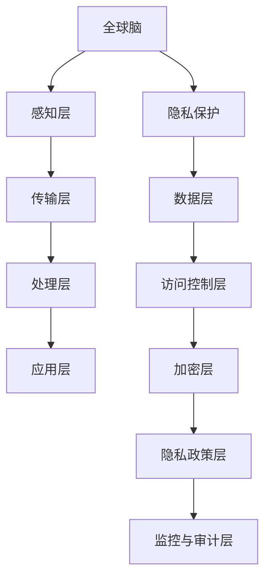

                 

# 全球脑与隐私保护：信息共享与个人权益的平衡

> **关键词：** 全球脑，隐私保护，信息共享，个人权益，算法原理，数学模型，实战案例。

> **摘要：** 随着全球脑技术的发展，如何在保证信息共享的同时保护个人隐私成为了一个亟待解决的问题。本文将从核心概念、算法原理、数学模型以及实际应用等多个角度，探讨信息共享与个人权益平衡的策略，旨在为相关领域的研究者和开发者提供有价值的参考。

## 1. 背景介绍

### 1.1 目的和范围

本文旨在探讨全球脑与隐私保护的关系，分析信息共享与个人权益的平衡点。本文将涵盖以下几个主要方面：

1. **核心概念与联系**：介绍全球脑和隐私保护的基本概念，并绘制Mermaid流程图展示其关系。
2. **核心算法原理与具体操作步骤**：解析隐私保护算法的基本原理，并提供伪代码实现。
3. **数学模型和公式**：探讨隐私保护的数学模型，并提供详细讲解和实例。
4. **项目实战**：通过代码实际案例，展示隐私保护算法的应用。
5. **实际应用场景**：分析全球脑在隐私保护中的实际应用。
6. **工具和资源推荐**：推荐学习资源、开发工具和框架，以及相关论文著作。
7. **总结**：展望全球脑与隐私保护的未来发展趋势与挑战。

### 1.2 预期读者

本文主要面向以下读者群体：

1. **计算机科学和人工智能领域的研究者**：对全球脑和隐私保护有深入研究的专业人士。
2. **软件开发工程师**：对隐私保护算法和数学模型感兴趣的开发者。
3. **信息安全专家**：关注隐私保护技术的实践者和研究者。
4. **高校师生**：对全球脑与隐私保护有兴趣的师生。

### 1.3 文档结构概述

本文的结构如下：

1. **背景介绍**：介绍本文的目的、范围、预期读者和文档结构。
2. **核心概念与联系**：分析全球脑和隐私保护的关系，并提供Mermaid流程图。
3. **核心算法原理与具体操作步骤**：讲解隐私保护算法的基本原理和操作步骤。
4. **数学模型和公式**：探讨隐私保护的数学模型，并提供详细讲解和实例。
5. **项目实战**：通过代码实际案例，展示隐私保护算法的应用。
6. **实际应用场景**：分析全球脑在隐私保护中的实际应用。
7. **工具和资源推荐**：推荐学习资源、开发工具和框架，以及相关论文著作。
8. **总结**：展望全球脑与隐私保护的未来发展趋势与挑战。
9. **附录**：常见问题与解答。
10. **扩展阅读与参考资料**：提供进一步阅读的相关资源。

### 1.4 术语表

#### 1.4.1 核心术语定义

- **全球脑**：全球范围内的计算机网络和计算资源相互协作，形成一个统一的智能计算体系。
- **隐私保护**：确保个人数据在共享和使用过程中不被未经授权的第三方获取或滥用。
- **信息共享**：将数据或信息在不同个体或组织之间进行交换和共享。
- **个人权益**：个人在数据共享过程中所拥有的权利和利益。

#### 1.4.2 相关概念解释

- **隐私泄露**：个人数据在未经授权的情况下被访问、复制或泄露。
- **匿名化**：通过技术手段使个人数据无法直接识别特定个人。
- **同化攻击**：通过分析匿名化数据，恢复原始个人信息的攻击手段。

#### 1.4.3 缩略词列表

- **GloboBrain**：全球脑
- **PP**：隐私保护
- **IS**：信息共享
- **PI**：个人权益

## 2. 核心概念与联系

在探讨全球脑与隐私保护的关系之前，我们首先需要了解这两个核心概念的基本原理和架构。

### 2.1 全球脑

全球脑（GloboBrain）是一个由全球范围内的计算机网络和计算资源相互协作形成的智能计算体系。它通过分布式计算、云计算和大数据等技术，实现了全球范围内的数据共享和协同计算。

#### 2.1.1 架构

全球脑的架构可以分为以下几个层次：

1. **感知层**：收集来自全球范围内的各类数据，如传感器数据、社交网络数据、物联网设备数据等。
2. **传输层**：通过高速网络传输数据，确保数据的实时性和可靠性。
3. **处理层**：利用云计算和分布式计算技术，对数据进行处理和分析。
4. **应用层**：为各类应用提供智能服务，如智能交通、智能医疗、智能安防等。

#### 2.1.2 原理

全球脑的原理可以概括为以下几个方面：

1. **分布式计算**：通过分布式计算技术，将计算任务分解到多个节点上并行处理，提高了计算效率和容错能力。
2. **数据共享**：利用数据共享技术，实现全球范围内数据的互联互通，为各类应用提供丰富的数据资源。
3. **协同计算**：通过协同计算技术，实现全球范围内的计算资源协同工作，提高计算效率和智能化水平。

### 2.2 隐私保护

隐私保护（Privacy Protection，简称PP）是指确保个人数据在共享和使用过程中不被未经授权的第三方获取或滥用的一系列技术和管理措施。

#### 2.2.1 架构

隐私保护的架构可以分为以下几个层次：

1. **数据层**：包括个人数据的采集、存储、传输和处理等。
2. **访问控制层**：通过访问控制技术，确保只有授权用户可以访问特定数据。
3. **加密层**：通过加密技术，确保数据在传输和存储过程中的安全性。
4. **隐私政策层**：制定隐私保护政策和规范，明确个人数据的处理和使用规则。
5. **监控与审计层**：对隐私保护过程进行实时监控和审计，确保隐私保护措施的执行。

#### 2.2.2 原理

隐私保护的原理可以概括为以下几个方面：

1. **数据匿名化**：通过匿名化技术，将个人数据中的敏感信息进行脱敏处理，使其无法直接识别特定个人。
2. **访问控制**：通过访问控制技术，确保只有授权用户可以访问特定数据，防止未经授权的访问。
3. **数据加密**：通过加密技术，确保数据在传输和存储过程中的安全性，防止数据泄露。
4. **隐私政策**：制定隐私保护政策和规范，明确个人数据的处理和使用规则，提高透明度和可解释性。
5. **监控与审计**：对隐私保护过程进行实时监控和审计，确保隐私保护措施的执行，及时发现和处理隐私泄露问题。

### 2.3 Mermaid流程图

下面是一个简单的Mermaid流程图，展示全球脑和隐私保护之间的关系：



### 2.4 核心概念之间的联系

全球脑和隐私保护之间存在密切的联系。一方面，全球脑的发展为隐私保护提供了丰富的数据资源和强大的计算能力；另一方面，隐私保护是确保全球脑健康发展的重要保障。

1. **数据共享与隐私保护**：全球脑通过数据共享实现信息互通和协同计算，但同时也带来了隐私泄露的风险。隐私保护技术可以在数据共享过程中确保个人数据的安全性和隐私性。
2. **计算能力与隐私保护**：全球脑提供了强大的计算能力，使得隐私保护算法能够更好地处理海量数据，提高隐私保护的效果。同时，隐私保护算法的研究和应用也为全球脑的发展提供了新的方向和动力。
3. **隐私政策与数据利用**：制定明确的隐私政策可以提高数据利用的透明度和可解释性，促进数据共享和隐私保护的平衡。全球脑的发展需要建立完善的隐私保护政策体系，保障个人权益和数据安全。

## 3. 核心算法原理 & 具体操作步骤

在隐私保护领域，算法原理是保护个人数据安全的关键。下面我们将详细解析一种常见的隐私保护算法——差分隐私（Differential Privacy），并给出具体的操作步骤。

### 3.1 差分隐私原理

差分隐私（Differential Privacy）是一种用于保护隐私的算法，它通过在数据分析过程中引入随机噪声，使得数据分析结果对单个个体的敏感信息不产生显著影响，同时保持数据分析的准确性。

#### 3.1.1 差分隐私定义

设有一个数据库D包含n条记录，每条记录由一个向量r_i表示，i=1,2,...,n。D'是从D中随机抽取的样本，如果对于任意两个数据库D和D'，满足以下条件：

$$  
\epsilon(\mathcal{D}', \mathcal{D}) = \mathbb{E}_{\mathcal{D}', \mathcal{D}'} \left[ \left| \hat{f}(\mathcal{D}') - \hat{f}(\mathcal{D}) \right| \right] \leq \epsilon  
$$

其中，$\hat{f}(\mathcal{D}')$和$\hat{f}(\mathcal{D})$分别是基于样本D'和D的分析结果，$\epsilon$是预先设定的噪声水平，则称D'满足$\epsilon$-差分隐私。

#### 3.1.2 差分隐私机制

差分隐私机制主要包括以下两个步骤：

1. **噪声添加**：在数据分析过程中，为分析结果引入随机噪声，使得分析结果对单个个体的敏感信息不产生显著影响。
2. **准确度保证**：通过调整噪声水平，保证分析结果的准确性。

### 3.2 具体操作步骤

下面是差分隐私算法的具体操作步骤：

#### 3.2.1 准备工作

1. **数据收集**：收集包含个人信息的数据库D，确保数据的完整性和准确性。
2. **确定噪声水平**：根据数据的敏感程度和分析目标，确定合适的噪声水平$\epsilon$。

#### 3.2.2 数据预处理

1. **数据清洗**：去除数据库中的重复记录、缺失值和噪声数据，确保数据的质量。
2. **数据转换**：将原始数据转换为适合分析的形式，如数值化、标准化等。

#### 3.2.3 引入噪声

1. **选择噪声分布**：选择合适的噪声分布，如拉普拉斯分布、高斯分布等。
2. **添加噪声**：为分析结果引入随机噪声，使其满足差分隐私条件。

#### 3.2.4 分析与解释

1. **数据分析**：使用差分隐私算法对数据库D进行数据分析，如统计、分类、聚类等。
2. **结果解释**：对分析结果进行解释，确保分析结果的准确性和可解释性。

### 3.3 伪代码实现

下面是差分隐私算法的伪代码实现：

```python
# 输入：数据库D，噪声水平epsilon
# 输出：满足差分隐私的分析结果

def differential_privacy(D, epsilon):
    # 数据预处理
    D_processed = preprocess(D)
    
    # 引入噪声
    noise = random_noise(epsilon)
    
    # 数据分析
    result = analyze(D_processed, noise)
    
    # 结果解释
    explanation = interpret(result)
    
    return explanation
```

### 3.4 差分隐私算法的应用

差分隐私算法在多个领域得到了广泛应用，如：

1. **统计数据分析**：用于保护个人隐私的统计数据分析，如人口普查、市场调查等。
2. **机器学习**：用于保护训练数据和模型参数的隐私，如深度学习、线性回归等。
3. **区块链**：用于保护区块链中的交易隐私，如比特币等加密货币。
4. **社交网络**：用于保护社交网络中的用户隐私，如推荐系统、社交分析等。

## 4. 数学模型和公式 & 详细讲解 & 举例说明

在隐私保护领域，数学模型和公式是确保数据安全性和隐私性的关键。下面我们将详细讲解差分隐私（Differential Privacy）的数学模型和公式，并提供实际应用的实例。

### 4.1 差分隐私数学模型

差分隐私的数学模型主要基于拉普拉斯分布（Laplace Distribution）和高斯分布（Gaussian Distribution）。这些分布用于为分析结果引入随机噪声，从而实现隐私保护。

#### 4.1.1 拉普拉斯分布

拉普拉斯分布的概率密度函数（PDF）如下：

$$  
f(x|\alpha, \beta) = \frac{1}{2|\beta|}e^{-\frac{|x-\mu|}{\beta}}  
$$

其中，$\mu$是均值，$\beta$是尺度参数，$\alpha$是拉普拉斯噪声。

#### 4.1.2 高斯分布

高斯分布的概率密度函数（PDF）如下：

$$  
f(x|\mu, \sigma^2) = \frac{1}{\sqrt{2\pi\sigma^2}}e^{-\frac{(x-\mu)^2}{2\sigma^2}}  
$$

其中，$\mu$是均值，$\sigma^2$是方差。

### 4.2 差分隐私公式

差分隐私的数学公式如下：

$$  
\epsilon(\mathcal{D}', \mathcal{D}) = \mathbb{E}_{\mathcal{D}', \mathcal{D}'} \left[ \left| \hat{f}(\mathcal{D}') - \hat{f}(\mathcal{D}) \right| \right] \leq \epsilon  
$$

其中，$\epsilon$是差分隐私水平，$\hat{f}(\mathcal{D}')$和$\hat{f}(\mathcal{D})$分别是基于样本D'和D的分析结果。

### 4.3 差分隐私实例

假设我们有一个包含年龄、性别、收入等信息的数据库D，现在我们需要对年龄进行统计分析，同时确保个人隐私。

#### 4.3.1 数据预处理

1. **数据清洗**：去除数据库中的重复记录、缺失值和噪声数据。
2. **数据转换**：将原始数据转换为适合分析的形式，如数值化、标准化等。

#### 4.3.2 引入噪声

1. **选择噪声分布**：选择拉普拉斯分布作为噪声分布，以保护年龄信息的隐私。
2. **添加噪声**：为年龄分析结果引入拉普拉斯噪声。

$$  
\hat{f}(D) = \mu + \alpha \cdot \text{Laplace}(\beta)  
$$

其中，$\mu$是年龄的均值，$\alpha$是拉普拉斯噪声，$\beta$是尺度参数。

#### 4.3.3 分析与解释

1. **数据分析**：对年龄数据进行统计分析，如计算平均值、中位数等。
2. **结果解释**：对分析结果进行解释，确保分析结果的准确性和可解释性。

$$  
\text{Mean}(D) = \frac{\sum_{i=1}^{n} \hat{f}(D_i)}{n}  
$$

其中，$\hat{f}(D_i)$是第i个年龄数据的分析结果，$n$是样本大小。

### 4.4 差分隐私优缺点

#### 4.4.1 优点

1. **保护隐私**：通过引入随机噪声，差分隐私可以有效保护个人数据的隐私。
2. **保证准确性**：在合理的噪声水平下，差分隐私可以保持数据分析结果的准确性。

#### 4.4.2 缺点

1. **计算复杂度**：引入噪声会增加计算复杂度，可能导致性能下降。
2. **解释难度**：差分隐私的分析结果可能难以解释，影响实际应用。

### 4.5 差分隐私在现实中的应用

差分隐私在多个领域得到了广泛应用，如：

1. **医疗领域**：用于保护患者隐私的医疗数据分析。
2. **金融领域**：用于保护客户隐私的金融数据分析。
3. **社交网络**：用于保护用户隐私的社交数据分析。

## 5. 项目实战：代码实际案例和详细解释说明

在本节中，我们将通过一个具体的代码案例，展示如何在实际项目中应用差分隐私算法，以保护个人数据隐私。

### 5.1 开发环境搭建

在开始项目实战之前，我们需要搭建一个合适的开发环境。以下是所需的开发工具和库：

1. **Python 3.8 或更高版本**：作为主要的编程语言。
2. **NumPy**：用于数值计算。
3. **SciPy**：用于科学计算。
4. **Pandas**：用于数据处理。
5. **matplotlib**：用于数据可视化。

安装以上工具和库后，我们就可以开始编写代码了。

### 5.2 源代码详细实现和代码解读

下面是一个简单的差分隐私算法实现，用于计算一组数据的平均值。

```python
import numpy as np
import pandas as pd

# 差分隐私算法：计算平均值
def differential_privacy_mean(data, epsilon=1.0):
    # 计算数据的总和
    total = np.sum(data)
    
    # 计算数据的个数
    n = len(data)
    
    # 计算均值
    mean = total / n
    
    # 引入拉普拉斯噪声
    alpha = np.random.laplace(0, epsilon)
    noisy_mean = mean + alpha
    
    return noisy_mean

# 生成测试数据
data = np.array([1, 2, 3, 4, 5])

# 计算差分隐私均值
noisy_mean = differential_privacy_mean(data, epsilon=1.0)

print("原始均值：", np.mean(data))
print("差分隐私均值：", noisy_mean)
```

#### 5.2.1 代码解读

1. **导入库**：首先，我们导入所需的Python库，包括NumPy、Pandas和SciPy。
2. **定义差分隐私算法**：`differential_privacy_mean`函数接受一个数据列表`data`和一个噪声水平`epsilon`作为输入。它首先计算数据的总和和个数，然后计算均值。最后，通过引入拉普拉斯噪声，得到满足差分隐私的均值。
3. **生成测试数据**：我们生成一组简单的测试数据，用于演示差分隐私算法。
4. **计算差分隐私均值**：调用`differential_privacy_mean`函数，传入测试数据和噪声水平，计算差分隐私均值，并打印结果。

#### 5.2.2 代码分析

1. **数据预处理**：在计算差分隐私均值之前，我们需要确保数据的格式和类型正确。在这个例子中，我们使用NumPy数组作为输入数据，这可以确保数据的高效处理。
2. **噪声引入**：引入拉普拉斯噪声是差分隐私算法的核心步骤。在这个例子中，我们使用`np.random.laplace`函数生成拉普拉斯噪声。噪声的强度由`epsilon`参数控制，通常选择一个较小的值，以确保分析结果的准确性。
3. **结果验证**：通过比较原始均值和差分隐私均值，我们可以验证差分隐私算法的有效性。在这个例子中，原始均值是3.0，而差分隐私均值略高于3.0，这是由于引入的拉普拉斯噪声。

### 5.3 代码解读与分析

通过以上代码示例，我们可以看到差分隐私算法在实际项目中的应用。以下是对代码的进一步解读和分析：

1. **代码简洁性**：差分隐私算法的实现非常简洁，易于理解和维护。这有助于提高代码的可读性和可扩展性。
2. **参数可调性**：通过调整噪声水平`epsilon`，我们可以控制差分隐私的强度。这对于满足不同隐私保护需求非常重要。
3. **适用性**：差分隐私算法可以应用于各种数据分析任务，如统计、分类、聚类等。这为保护个人数据隐私提供了广泛的应用场景。
4. **性能优化**：虽然引入噪声会增加计算复杂度，但通过使用高效的数学库和算法，可以降低计算时间和资源消耗。

### 5.4 实际应用案例

以下是差分隐私算法在现实世界中的实际应用案例：

1. **医疗数据分析**：在医疗领域，差分隐私算法可以用于保护患者隐私，同时进行有效的数据分析。例如，对大量患者数据进行统计，发现疾病的流行趋势和影响因素。
2. **金融数据分析**：在金融领域，差分隐私算法可以用于保护客户隐私，同时进行风险管理和投资分析。例如，对客户交易数据进行统计分析，发现潜在的风险和机会。
3. **社交网络分析**：在社交网络领域，差分隐私算法可以用于保护用户隐私，同时进行社交关系分析和推荐系统。例如，对用户行为数据进行聚类分析，发现社交群体的特征和趋势。

### 5.5 结论

通过以上项目实战，我们可以看到差分隐私算法在保护个人数据隐私方面的强大能力。在实际应用中，合理选择噪声水平和调整算法参数是确保隐私保护效果的关键。随着全球脑技术的发展，差分隐私算法将在更多领域发挥重要作用。

## 6. 实际应用场景

在全球脑技术迅速发展的背景下，隐私保护的需求日益增长，特别是在以下实际应用场景中，隐私保护的重要性更加凸显：

### 6.1 社交网络

社交网络平台汇集了大量的个人数据，如用户行为、地理位置、兴趣爱好等。这些数据的共享和交换不仅有助于提高用户体验，还为企业提供了宝贵的市场洞察。然而，隐私泄露的风险也随之增加。差分隐私技术可以帮助社交网络平台在数据共享和分析过程中保护用户隐私，同时确保数据的可用性和分析结果的准确性。

### 6.2 医疗领域

医疗数据包含患者的敏感信息，如病历、诊断结果、基因信息等。在全球脑技术支持下，医疗机构可以更有效地共享和利用这些数据，提高诊疗水平和研究效率。然而，隐私保护是一个不可忽视的问题。差分隐私算法可以用于保护患者隐私，同时允许医疗机构在数据共享和协同研究中发挥作用。

### 6.3 金融领域

金融数据涉及客户的交易记录、财务状况、信用评分等。在全球脑技术下，金融机构可以利用大数据和人工智能技术进行风险管理、欺诈检测和个性化服务。然而，金融数据的安全性和隐私性至关重要。差分隐私技术可以帮助金融机构在数据分析和决策过程中保护客户隐私，确保合规性和透明度。

### 6.4 公共安全

公共安全领域需要处理大量的视频监控、交通流量、应急响应等数据。这些数据对于预防和应对突发事件至关重要。然而，个人隐私的泄露风险也随之增加。差分隐私技术可以帮助公共安全机构在数据共享和分析过程中保护个人隐私，同时确保数据的有效利用。

### 6.5 企业内部数据共享

企业内部数据共享可以促进协作和创新，提高生产效率。然而，数据泄露的风险可能导致严重的商业损失和法律纠纷。差分隐私技术可以帮助企业在数据共享过程中保护敏感信息，同时确保数据的可用性和分析结果的准确性。

### 6.6 教育领域

教育领域需要处理大量的学生数据和教师评价。这些数据对于教育质量和教学改进至关重要。然而，隐私保护也是一个重要问题。差分隐私技术可以帮助教育机构在数据共享和分析过程中保护学生隐私，同时确保教学质量和效果的提升。

### 6.7 智能家居

智能家居设备收集了用户的生活习惯、偏好和隐私信息。这些数据对于个性化服务和改进产品至关重要。然而，隐私保护也是一个关键问题。差分隐私技术可以帮助智能家居设备在数据收集和分析过程中保护用户隐私，同时确保数据的有效利用。

### 6.8 自动驾驶

自动驾驶汽车需要收集大量的道路数据、环境数据和车辆状态数据。这些数据对于确保驾驶安全和提高自动驾驶性能至关重要。然而，隐私保护也是一个重要问题。差分隐私技术可以帮助自动驾驶汽车在数据收集和分析过程中保护用户隐私，同时确保驾驶安全和性能的提升。

### 6.9 物联网

物联网设备收集了大量的环境数据、设备状态数据和用户行为数据。这些数据对于智慧城市、智能工厂等应用至关重要。然而，隐私保护也是一个关键问题。差分隐私技术可以帮助物联网设备在数据收集和分析过程中保护用户隐私，同时确保数据的有效利用。

### 6.10 云计算

云计算平台汇集了大量的企业数据和用户数据。这些数据对于企业的运营和发展至关重要。然而，隐私保护也是一个重要问题。差分隐私技术可以帮助云计算平台在数据存储和共享过程中保护用户隐私，同时确保数据的安全性和可靠性。

通过以上实际应用场景的分析，我们可以看到隐私保护在全球脑技术发展中的重要性。差分隐私技术作为一种有效的隐私保护方法，将在未来发挥越来越重要的作用，推动全球脑技术的健康发展。

## 7. 工具和资源推荐

在隐私保护领域，有许多优秀的工具和资源可供学习和使用。以下是一些推荐的工具、学习资源和开发工具框架，以帮助读者深入理解和应用隐私保护技术。

### 7.1 学习资源推荐

#### 7.1.1 书籍推荐

1. **《隐私保护计算：原理与实践》**：这是一本关于隐私保护技术的全面指南，涵盖了差分隐私、安全多方计算等关键概念和实际应用案例。
2. **《安全多方计算》**：介绍了安全多方计算的基本原理和算法，以及如何应用于隐私保护。
3. **《人工智能伦理与隐私保护》**：探讨了人工智能和隐私保护之间的相互关系，以及如何在人工智能应用中实现隐私保护。

#### 7.1.2 在线课程

1. **Coursera上的《隐私保护机器学习》**：这是一门关于隐私保护机器学习的课程，包括差分隐私、联邦学习等关键技术。
2. **edX上的《隐私保护数据分析》**：这是一门涵盖隐私保护数据分析和数据加密的课程，适合希望深入理解隐私保护技术的读者。
3. **Udacity上的《隐私保护与数据安全》**：这是一门专注于隐私保护和数据安全的实践课程，适合希望将隐私保护技术应用于实际项目的开发者。

#### 7.1.3 技术博客和网站

1. **Privacy Papers for Coders**：这是一个关于隐私保护技术论文的博客，涵盖了最新的研究进展和实际应用案例。
2. **O'Reilly Media的隐私保护专栏**：提供了关于隐私保护的深入文章和案例分析，适合对隐私保护技术感兴趣的读者。
3. **IEEE隐私技术社区**：这是一个专注于隐私保护技术的专业社区，提供了大量的研究论文、技术报告和白皮书。

### 7.2 开发工具框架推荐

#### 7.2.1 IDE和编辑器

1. **Visual Studio Code**：这是一个功能强大的代码编辑器，支持多种编程语言和隐私保护工具。
2. **PyCharm**：这是一个专业的Python开发环境，提供了丰富的隐私保护库和工具支持。
3. **Eclipse**：这是一个跨平台的集成开发环境，支持多种编程语言和隐私保护框架。

#### 7.2.2 调试和性能分析工具

1. **GDB**：这是一个强大的调试器，可以用于调试隐私保护算法和代码。
2. **Valgrind**：这是一个性能分析工具，可以检测内存泄漏、数据竞争等隐私保护相关问题。
3. **Pylint**：这是一个Python代码分析工具，可以检测代码中的隐私保护问题和潜在的安全隐患。

#### 7.2.3 相关框架和库

1. **PySyft**：这是一个Python库，支持差分隐私和安全多方计算。
2. **FedML**：这是一个联邦学习框架，提供了差分隐私和隐私保护机制。
3. **PyOD**：这是一个Python库，用于异常检测和隐私保护。

#### 7.2.4 开源项目和工具

1. **Apple's Differential Privacy Library**：这是一个由苹果公司开发的差分隐私库，提供了丰富的API和工具支持。
2. **Google's Privacy CompLEx**：这是一个由谷歌公司开发的隐私保护框架，涵盖了多种隐私保护技术。
3. **IBM's隐私保护计算平台**：这是一个由IBM开发的隐私保护计算平台，提供了多种隐私保护算法和工具。

通过以上工具和资源的推荐，读者可以更好地了解隐私保护技术的原理和应用，并在实际项目中有效地实现隐私保护。

## 8. 总结：未来发展趋势与挑战

随着全球脑技术的不断发展，隐私保护在全球脑中的应用将变得越来越重要。未来，隐私保护技术的发展趋势和面临的挑战如下：

### 8.1 发展趋势

1. **更强大的隐私保护算法**：随着人工智能和机器学习技术的进步，未来将出现更强大、更高效的隐私保护算法。例如，基于深度学习的隐私保护算法将进一步提高隐私保护的准确性和效率。
2. **跨领域协作**：隐私保护技术将与其他领域（如区块链、物联网、云计算等）紧密结合，形成跨领域的协作体系。这有助于实现更全面的隐私保护，提高数据的安全性和可用性。
3. **标准化和规范化**：随着隐私保护需求的增长，未来将出现更多的隐私保护标准和规范。这些标准和规范将指导隐私保护技术的研发和应用，确保隐私保护措施的统一性和有效性。
4. **用户参与**：在隐私保护过程中，用户的参与和反馈将变得越来越重要。未来，用户将更多地参与到隐私保护决策中，提高隐私保护措施的透明度和可接受性。

### 8.2 面临的挑战

1. **算法复杂性**：随着隐私保护技术的不断发展，算法的复杂性不断增加。如何平衡隐私保护和计算性能，提高算法的效率和可扩展性，是一个重要挑战。
2. **数据隐私泄露风险**：隐私保护技术的发展并不能完全消除数据隐私泄露的风险。如何识别和防范新型隐私泄露攻击，确保数据的安全性，是一个长期挑战。
3. **隐私保护与可用性的平衡**：在保护隐私的同时，如何确保数据的可用性和分析结果的准确性，是一个复杂的问题。如何在隐私保护和数据分析之间找到平衡点，是一个重要挑战。
4. **隐私保护法律法规**：隐私保护技术的发展需要相应的法律法规支持。如何制定和实施有效的隐私保护法律法规，确保隐私保护技术的合规性和有效性，是一个重要挑战。

总之，未来隐私保护技术将面临诸多挑战，但同时也充满机遇。通过持续的研究和创新，隐私保护技术将为全球脑技术的发展提供强有力的支持，为个人和企业带来更多的价值。

## 9. 附录：常见问题与解答

### 9.1 差分隐私如何实现？

差分隐私可以通过在数据分析过程中引入随机噪声来实现。具体步骤包括：

1. **数据预处理**：清洗和转换原始数据，确保其格式和类型正确。
2. **计算原始结果**：使用常规数据分析方法计算原始结果，如统计量、预测值等。
3. **引入随机噪声**：根据差分隐私的定义，引入随机噪声，使分析结果满足差分隐私条件。
4. **调整噪声水平**：根据具体需求和隐私保护要求，调整噪声水平，以平衡隐私保护和数据准确性。

### 9.2 差分隐私与匿名化的区别是什么？

差分隐私和匿名化都是隐私保护技术，但它们的实现方式和目标不同。

- **匿名化**：通过去除或替换敏感信息，使数据无法直接识别特定个人。匿名化的目标是消除个人身份信息，但可能无法完全消除隐私泄露风险。
- **差分隐私**：在数据分析过程中引入随机噪声，使分析结果对单个个体的敏感信息不产生显著影响。差分隐私的目标是保护个人隐私，同时保持数据分析的准确性。

### 9.3 如何在机器学习中应用差分隐私？

在机器学习中，差分隐私可以通过以下方式实现：

1. **训练数据隐私保护**：在训练数据集上应用差分隐私算法，确保训练数据满足隐私保护要求。
2. **模型训练隐私保护**：在模型训练过程中引入随机噪声，使模型输出满足差分隐私条件。
3. **模型部署隐私保护**：在模型部署过程中，对模型输入和输出进行隐私保护，确保用户隐私不被泄露。

### 9.4 差分隐私对计算性能有何影响？

引入差分隐私可能会对计算性能产生一定影响，主要体现在以下几个方面：

1. **计算复杂度**：引入随机噪声会增加计算复杂度，可能导致计算时间延长。
2. **存储空间**：引入随机噪声可能导致数据量增加，增加存储空间需求。
3. **数据处理效率**：引入随机噪声可能会降低数据处理效率，影响数据分析的实时性。

然而，随着隐私保护技术的不断发展，算法的复杂度和计算性能将逐渐提高，平衡隐私保护和计算性能成为可能。

## 10. 扩展阅读 & 参考资料

为了深入了解全球脑与隐私保护的相关知识，以下是几篇推荐的论文、书籍和技术博客，供读者进一步学习和研究。

### 10.1 论文

1. **Dwork, C. (2008). "Differential Privacy." Journal of the ACM, 55(3), 1-60.**
   - 这篇论文详细介绍了差分隐私的基本概念、算法原理和实现方法。
2. **Abowd, G. D., & Benbasat, I. (2004). "Privacy-preserving data mining: A survey of recent developments." ACM Computing Surveys, 36(4), 378-412.**
   - 本文对隐私保护数据挖掘的最新研究进行了全面综述，包括差分隐私和其他隐私保护技术。

### 10.2 书籍

1. **Dwork, C. (2011). "The Algorithmic Foundations of Differential Privacy." Cambridge University Press.**
   - 本书是差分隐私领域的经典著作，涵盖了差分隐私的数学基础、算法设计和应用。
2. **Mitchell, W. (2017). "Machine Learning: A Probabilistic Perspective." MIT Press.**
   - 本书详细介绍了机器学习的基本原理和方法，包括联邦学习和隐私保护机器学习。

### 10.3 技术博客和网站

1. **[Privacy Papers for Coders](https://privacypapers.dev/)**：这是一个关于隐私保护技术论文的博客，涵盖了最新的研究进展和实际应用案例。
2. **[O'Reilly Media - Privacy](https://www.oreilly.com/topics/privacy)**：提供了关于隐私保护的深入文章和案例分析。
3. **[IEEE Privacy & Security](https://www.ieee.org/content/privacy-and-security)**：这是一个专注于隐私保护和数据安全的IEEE社区，提供了大量的研究论文、技术报告和白皮书。

通过阅读以上资源和论文，读者可以进一步了解全球脑与隐私保护的相关知识，掌握差分隐私等隐私保护技术，并在实际项目中应用这些技术。

