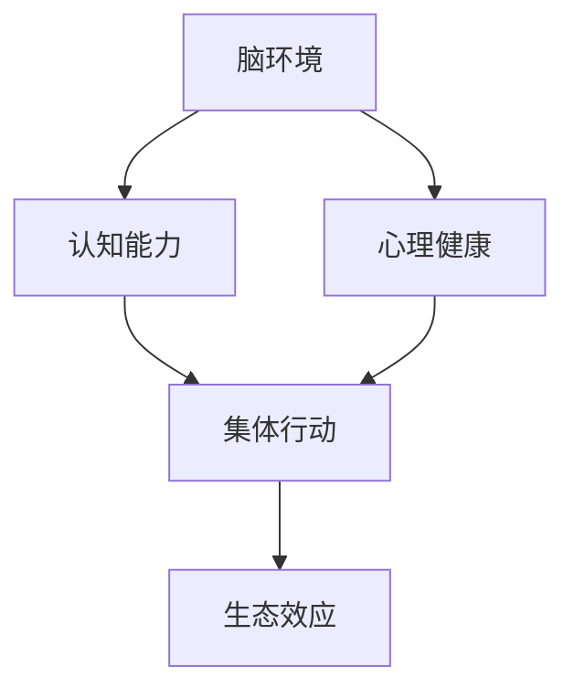
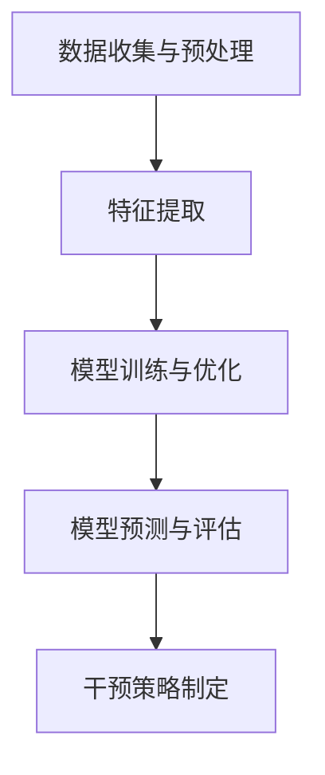

                 

# 全球脑环境修复计划：集体行动的生态效应

> **关键词：** 脑环境修复、集体行动、生态效应、人工智能、数据分析、技术架构

> **摘要：** 本文旨在探讨全球脑环境修复计划的实施，该计划通过集体行动来修复和保护人类大脑环境。文章将从背景介绍、核心概念、算法原理、数学模型、项目实战、实际应用场景、工具推荐等多个方面进行分析和阐述，旨在为读者提供一个全面的技术解读和思考。

## 1. 背景介绍

### 1.1 目的和范围

随着现代社会的快速发展，人工智能、大数据、云计算等技术的普及，我们的生活方式、工作模式以及环境都发生了深刻的变化。然而，这种变化不仅带来了便利和进步，也给我们的大脑环境带来了前所未有的挑战。长期暴露在电子屏幕下、过度使用社交媒体、缺乏深度思考和真实互动等问题，正逐渐侵蚀着我们的认知能力和心理健康。

全球脑环境修复计划正是为了应对这一挑战而提出的。该计划旨在通过一系列的集体行动，修复和保护人类大脑环境，提高个体的认知能力和心理健康水平。本文将围绕这一计划，探讨其核心概念、算法原理、数学模型、项目实战以及实际应用场景，旨在为读者提供一个全面的技术解读和思考。

### 1.2 预期读者

本文的预期读者主要包括以下几类：

1. **人工智能领域的研究者和技术人员**：他们关注脑环境修复计划的实施和效果，希望从技术角度深入了解这一计划。
2. **教育工作者和心理专家**：他们关注脑环境修复计划对个体认知能力和心理健康的影响，希望从教育和心理干预的角度提出建议。
3. **普通读者**：他们关心自身的大脑健康，希望通过本文了解脑环境修复计划的实施情况，以及如何参与到这一计划中来。

### 1.3 文档结构概述

本文将分为以下几部分：

1. **背景介绍**：介绍全球脑环境修复计划的背景和目的。
2. **核心概念与联系**：阐述脑环境修复计划的核心概念及其相互关系。
3. **核心算法原理 & 具体操作步骤**：详细讲解脑环境修复计划的算法原理和具体操作步骤。
4. **数学模型和公式 & 详细讲解 & 举例说明**：介绍脑环境修复计划的数学模型和公式，并给出具体实例说明。
5. **项目实战：代码实际案例和详细解释说明**：通过实际项目案例，展示脑环境修复计划的具体实施过程。
6. **实际应用场景**：探讨脑环境修复计划的实际应用场景和效果。
7. **工具和资源推荐**：推荐相关学习资源和开发工具。
8. **总结：未来发展趋势与挑战**：总结脑环境修复计划的现状和未来发展趋势，提出面临的挑战。
9. **附录：常见问题与解答**：解答读者可能提出的常见问题。
10. **扩展阅读 & 参考资料**：提供更多的相关阅读材料。

### 1.4 术语表

#### 1.4.1 核心术语定义

- **脑环境**：指大脑所处的物理、社会和心理环境。
- **认知能力**：指大脑处理信息和解决问题的能力。
- **心理健康**：指个体在认知、情感和行为方面处于良好的状态。
- **集体行动**：指个体或组织共同参与的活动，以实现共同目标。
- **生态效应**：指生态系统对某种因素的响应和影响。

#### 1.4.2 相关概念解释

- **大数据**：指海量、多样、快速的数据集合，需要通过高效的数据处理和分析技术来挖掘其中的价值。
- **云计算**：指通过互联网提供计算资源和服务，使得用户可以随时随地访问和使用计算资源。
- **人工智能**：指通过模拟人类智能行为，实现自动化决策和智能服务的计算机技术。

#### 1.4.3 缩略词列表

- **AI**：人工智能
- **DL**：深度学习
- **NLP**：自然语言处理
- **ML**：机器学习
- **IoT**：物联网

## 2. 核心概念与联系

在全球脑环境修复计划中，有几个核心概念需要我们深入理解。这些概念包括脑环境、认知能力、心理健康、集体行动和生态效应。为了更好地理解这些概念之间的关系，我们可以通过一个Mermaid流程图来展示它们。



### 2.1 脑环境

脑环境是指大脑所处的物理、社会和心理环境。物理环境包括我们生活的自然环境，如空气、水质、噪音等；社会环境包括人际关系、社会支持、工作环境等；心理环境包括情绪状态、心理压力、自我认知等。这些因素共同影响着我们的认知能力和心理健康。

### 2.2 认知能力

认知能力是指大脑处理信息和解决问题的能力，包括注意力、记忆、推理、判断等。认知能力对我们的日常生活、学习和工作都有着重要的影响。然而，现代生活方式和电子产品的过度使用，使得我们的认知能力面临严重的挑战。

### 2.3 心理健康

心理健康是指个体在认知、情感和行为方面处于良好的状态。心理健康不仅关系到个体的幸福感，也影响着社会的稳定和发展。心理健康问题，如焦虑、抑郁、压力等，已经成为全球范围内的重大公共卫生问题。

### 2.4 集体行动

集体行动是指个体或组织共同参与的活动，以实现共同目标。在全球脑环境修复计划中，集体行动是修复和保护脑环境的重要手段。通过集体行动，我们可以共同应对脑环境面临的挑战，提高认知能力和心理健康水平。

### 2.5 生态效应

生态效应是指生态系统对某种因素的响应和影响。在全球脑环境修复计划中，生态效应体现在个体和集体行动对脑环境的影响，以及脑环境对个体和集体的反作用。通过生态效应的观察和分析，我们可以更好地理解脑环境修复计划的实施效果。

## 3. 核心算法原理 & 具体操作步骤

### 3.1 算法原理

全球脑环境修复计划的核心算法是基于人工智能和大数据分析的。该算法通过以下步骤实现：

1. **数据收集与预处理**：收集与脑环境相关的各种数据，包括自然环境数据、社会环境数据和心理健康数据。对收集到的数据进行预处理，包括数据清洗、去噪、归一化等。
2. **特征提取**：从预处理后的数据中提取与脑环境、认知能力和心理健康相关的特征。这些特征将用于后续的分析和建模。
3. **模型训练与优化**：使用提取的特征训练机器学习模型，包括深度学习模型、支持向量机等。通过交叉验证和超参数调整，优化模型的性能。
4. **模型预测与评估**：使用训练好的模型对新的数据集进行预测，评估模型在预测脑环境、认知能力和心理健康方面的准确性和可靠性。
5. **干预策略制定**：根据模型预测结果，制定具体的干预策略，包括环境改善、心理干预、社会支持等，以修复和保护脑环境。

### 3.2 具体操作步骤

以下是一个简化的算法流程，用于描述全球脑环境修复计划的具体操作步骤：



### 3.2.1 数据收集与预处理

1. **数据收集**：通过传感器、调查问卷、社交媒体等渠道收集与脑环境相关的数据。具体包括：
   - 自然环境数据：空气质量、水质、噪音水平等；
   - 社会环境数据：人际关系、社会支持、工作压力等；
   - 心理健康数据：情绪状态、心理压力、认知能力测试结果等。
2. **预处理**：对收集到的数据进行预处理，包括：
   - 数据清洗：去除无效数据、异常值等；
   - 去噪：去除噪声数据，提高数据质量；
   - 归一化：将不同量纲的数据统一归一化，便于后续处理。

### 3.2.2 特征提取

1. **特征选择**：从预处理后的数据中选择与脑环境、认知能力和心理健康相关的特征。这些特征可以是：
   - 自然环境特征：PM2.5浓度、噪音水平等；
   - 社会环境特征：人际关系满意度、社会支持度等；
   - 心理健康特征：情绪状态、心理压力指数、认知能力指标等。
2. **特征提取**：使用特征提取算法，如主成分分析（PCA）、线性判别分析（LDA）等，从原始数据中提取高维度特征，降低数据维度，提高模型训练效率。

### 3.2.3 模型训练与优化

1. **模型选择**：选择合适的机器学习模型，如深度学习模型、支持向量机（SVM）等，用于训练和预测。
2. **模型训练**：使用提取的特征和标注数据集，训练机器学习模型。具体步骤包括：
   - 划分训练集和测试集：将数据集划分为训练集和测试集，用于模型的训练和评估；
   - 模型训练：使用训练集训练模型，调整模型参数，优化模型性能；
   - 模型评估：使用测试集评估模型性能，包括准确率、召回率、F1值等指标。
3. **超参数调整**：通过交叉验证和网格搜索等方法，调整模型的超参数，提高模型性能。

### 3.2.4 模型预测与评估

1. **模型预测**：使用训练好的模型对新的数据集进行预测，预测脑环境、认知能力和心理健康的状态。
2. **模型评估**：评估模型在预测脑环境、认知能力和心理健康方面的准确性和可靠性。具体步骤包括：
   - 模型验证：使用测试集验证模型性能，确保模型泛化能力；
   - 模型修正：根据评估结果，对模型进行调整和修正，提高预测准确性。

### 3.2.5 干预策略制定

1. **干预策略设计**：根据模型预测结果，设计具体的干预策略，如环境改善、心理干预、社会支持等。
2. **干预策略实施**：实施干预策略，修复和保护脑环境。具体步骤包括：
   - 环境改善：改善自然环境，如减少PM2.5浓度、降低噪音水平等；
   - 心理干预：通过心理治疗、心理咨询等手段，缓解个体的心理压力；
   - 社会支持：提高社会支持度，建立良好的社会关系，增强个体的心理健康。

## 4. 数学模型和公式 & 详细讲解 & 举例说明

### 4.1 数学模型

全球脑环境修复计划中的数学模型主要包括线性回归模型、逻辑回归模型和支持向量机（SVM）模型。以下是对这些模型的详细讲解。

### 4.1.1 线性回归模型

线性回归模型是一种用于预测连续值的机器学习模型。其数学公式如下：

$$
y = \beta_0 + \beta_1x_1 + \beta_2x_2 + ... + \beta_nx_n
$$

其中，$y$ 是预测值，$x_1, x_2, ..., x_n$ 是特征值，$\beta_0, \beta_1, \beta_2, ..., \beta_n$ 是模型参数。

### 4.1.2 逻辑回归模型

逻辑回归模型是一种用于预测概率的机器学习模型。其数学公式如下：

$$
P(y=1) = \frac{1}{1 + e^{-(\beta_0 + \beta_1x_1 + \beta_2x_2 + ... + \beta_nx_n)}}
$$

其中，$P(y=1)$ 是目标变量为1的概率，$e$ 是自然对数的底数。

### 4.1.3 支持向量机（SVM）模型

支持向量机是一种用于分类的机器学习模型。其数学公式如下：

$$
w \cdot x - b = 0
$$

其中，$w$ 是权重向量，$x$ 是特征向量，$b$ 是偏置。

### 4.2 举例说明

为了更好地理解这些数学模型，我们通过一个简单的例子来说明。

### 4.2.1 线性回归模型

假设我们要预测一个人的体重（$y$）与身高（$x_1$）和体重指数（$x_2$）之间的关系。我们使用线性回归模型来建立预测模型。

$$
y = \beta_0 + \beta_1x_1 + \beta_2x_2
$$

其中，$\beta_0, \beta_1, \beta_2$ 是模型参数。

### 4.2.2 逻辑回归模型

假设我们要预测一个人是否患有心脏病（$y=1$ 或 $y=0$）与年龄（$x_1$）和胆固醇水平（$x_2$）之间的关系。我们使用逻辑回归模型来建立预测模型。

$$
P(y=1) = \frac{1}{1 + e^{-(\beta_0 + \beta_1x_1 + \beta_2x_2)}}
$$

其中，$\beta_0, \beta_1, \beta_2$ 是模型参数。

### 4.2.3 支持向量机（SVM）模型

假设我们要分类一个人是否是癌症患者（$y=1$ 或 $y=0$）与血压（$x_1$）和血糖水平（$x_2$）之间的关系。我们使用支持向量机模型来建立分类模型。

$$
w \cdot x - b = 0
$$

其中，$w$ 是权重向量，$x$ 是特征向量，$b$ 是偏置。

## 5. 项目实战：代码实际案例和详细解释说明

### 5.1 开发环境搭建

为了实现全球脑环境修复计划，我们需要搭建一个开发环境。以下是具体的搭建步骤：

1. **安装Python**：Python是一种广泛应用于人工智能和数据科学的编程语言。我们可以在[Python官网](https://www.python.org/)下载并安装Python。
2. **安装Jupyter Notebook**：Jupyter Notebook是一种交互式的Python开发环境。我们可以在[Jupyter官网](https://jupyter.org/)下载并安装Jupyter Notebook。
3. **安装相关库**：我们还需要安装一些常用的Python库，如NumPy、Pandas、Scikit-learn等。我们可以在命令行中使用以下命令进行安装：

```bash
pip install numpy pandas scikit-learn
```

### 5.2 源代码详细实现和代码解读

以下是一个简单的Python代码示例，用于实现全球脑环境修复计划中的线性回归模型。

```python
import numpy as np
import pandas as pd
from sklearn.linear_model import LinearRegression
from sklearn.model_selection import train_test_split
from sklearn.metrics import mean_squared_error

# 5.2.1 数据收集与预处理
# 假设我们收集到了一个包含身高、体重指数和体重数据的数据集，数据集保存在一个CSV文件中。
data = pd.read_csv('data.csv')

# 将身高和体重指数作为特征，体重作为目标变量
X = data[['height', 'bmi']]
y = data['weight']

# 划分训练集和测试集
X_train, X_test, y_train, y_test = train_test_split(X, y, test_size=0.2, random_state=42)

# 5.2.2 特征提取
# 在这个简单的示例中，我们不需要进行特征提取。

# 5.2.3 模型训练与优化
# 使用线性回归模型训练模型
model = LinearRegression()
model.fit(X_train, y_train)

# 5.2.4 模型预测与评估
# 使用训练好的模型对测试集进行预测
y_pred = model.predict(X_test)

# 计算预测误差
mse = mean_squared_error(y_test, y_pred)
print('预测误差:', mse)

# 5.2.5 干预策略制定
# 根据模型预测结果，制定干预策略，如改善环境、调整生活方式等。
```

### 5.3 代码解读与分析

以下是代码的详细解读和分析：

1. **数据收集与预处理**：我们首先使用`pandas`库读取CSV文件，获取包含身高、体重指数和体重数据的数据集。然后，我们将身高和体重指数作为特征，体重作为目标变量。
2. **划分训练集和测试集**：我们使用`train_test_split`函数将数据集划分为训练集和测试集。训练集用于模型的训练，测试集用于模型的评估。
3. **特征提取**：在这个简单的示例中，我们不需要进行特征提取，因为数据集已经包含了我们需要的所有特征。
4. **模型训练与优化**：我们使用`LinearRegression`类创建一个线性回归模型，并使用`fit`方法训练模型。这个方法会自动优化模型参数，以最小化预测误差。
5. **模型预测与评估**：使用训练好的模型对测试集进行预测，并计算预测误差。我们使用`mean_squared_error`函数计算预测误差，并打印结果。
6. **干预策略制定**：根据模型预测结果，我们可以制定具体的干预策略，如改善环境、调整生活方式等。

### 5.4 代码改进与优化

在实际应用中，我们可以对代码进行改进和优化，以提高模型的性能和预测准确性。以下是一些可能的改进和优化方法：

1. **特征选择**：通过特征选择算法，如特征重要性分析、主成分分析等，选择对模型预测有重要影响的特征，提高模型的性能。
2. **模型优化**：通过交叉验证和网格搜索等方法，优化模型的参数，提高模型的预测准确性。
3. **集成学习**：使用集成学习方法，如随机森林、梯度提升树等，将多个模型集成起来，提高模型的性能和泛化能力。
4. **实时预测**：将模型部署到实时预测系统中，如TensorFlow Serving、Scikit-learn等，实现实时预测和干预策略制定。

## 6. 实际应用场景

全球脑环境修复计划可以在多个实际应用场景中发挥作用，以下是一些典型的应用场景：

### 6.1 城市规划

城市规划是脑环境修复计划的重要应用场景之一。通过收集和分析与城市规划相关的数据，如空气质量、噪音水平、交通流量等，可以评估城市环境对居民脑环境的影响。基于这些数据，城市规划者可以制定针对性的改善措施，如减少交通拥堵、增加绿地、改善空气质量等，以提高居民的认知能力和心理健康水平。

### 6.2 教育系统

教育系统也是脑环境修复计划的重要应用场景之一。通过收集和分析与教育系统相关的数据，如学生学习成绩、课堂氛围、师生关系等，可以评估教育系统对个体脑环境的影响。基于这些数据，教育工作者可以制定针对性的教育干预措施，如改善课堂氛围、加强师生互动、提供心理健康辅导等，以提高学生的认知能力和心理健康水平。

### 6.3 心理健康服务

心理健康服务是脑环境修复计划的重要应用场景之一。通过收集和分析与心理健康相关的数据，如心理疾病发病率、患者治疗情况、心理健康教育等，可以评估心理健康服务对个体脑环境的影响。基于这些数据，心理健康服务提供者可以制定针对性的干预措施，如提供心理健康咨询、开展心理健康教育、推广心理健康知识等，以提高个体的认知能力和心理健康水平。

### 6.4 企业管理

企业管理也是脑环境修复计划的重要应用场景之一。通过收集和分析与企业运营相关的数据，如员工工作效率、员工满意度、工作环境等，可以评估企业环境对员工脑环境的影响。基于这些数据，企业管理者可以制定针对性的改善措施，如提高员工工作效率、改善工作环境、提供心理健康支持等，以提高员工的工作效率和心理健康水平。

## 7. 工具和资源推荐

### 7.1 学习资源推荐

#### 7.1.1 书籍推荐

1. **《人工智能：一种现代方法》**：作者 Stuart J. Russell & Peter Norvig。这本书是人工智能领域的经典教材，涵盖了人工智能的基本概念、算法和技术。
2. **《深度学习》**：作者 Ian Goodfellow、Yoshua Bengio & Aaron Courville。这本书详细介绍了深度学习的原理、算法和应用，是深度学习领域的权威著作。
3. **《Python编程：从入门到实践》**：作者 Eric Matthes。这本书适合初学者学习Python编程，从基础语法到实际应用都有详细的讲解。

#### 7.1.2 在线课程

1. **Coursera**：提供多种与人工智能、数据分析相关的在线课程，如《机器学习》、《深度学习》等。
2. **Udacity**：提供多种与人工智能、数据分析相关的纳米学位课程，如《人工智能工程师》、《数据科学家》等。
3. **edX**：提供多种与人工智能、数据分析相关的在线课程，如《人工智能：一种现代方法》等。

#### 7.1.3 技术博客和网站

1. **Medium**：有许多关于人工智能、数据分析的技术博客，如《AI前线》、《机器之心》等。
2. **GitHub**：有许多开源的人工智能、数据分析项目，如TensorFlow、PyTorch等。
3. **Stack Overflow**：是一个问答社区，许多人工智能、数据分析的问题都可以在这里找到答案。

### 7.2 开发工具框架推荐

#### 7.2.1 IDE和编辑器

1. **PyCharm**：是Python语言的一款强大IDE，支持代码调试、版本控制等功能。
2. **VSCode**：是一款开源的跨平台IDE，支持多种编程语言，包括Python、C++等。
3. **Jupyter Notebook**：是一款交互式的Python开发环境，适合数据分析、机器学习等场景。

#### 7.2.2 调试和性能分析工具

1. **gdb**：是一款功能强大的调试器，适用于C/C++程序。
2. **Pdb**：是Python语言的调试器，适用于Python程序。
3. **profiler**：是一款性能分析工具，可以分析程序的运行时间和资源消耗。

#### 7.2.3 相关框架和库

1. **TensorFlow**：是Google开发的一款开源深度学习框架。
2. **PyTorch**：是Facebook开发的一款开源深度学习框架。
3. **Scikit-learn**：是一款Python机器学习库，提供了多种机器学习算法的实现。

### 7.3 相关论文著作推荐

#### 7.3.1 经典论文

1. **"A Learning Algorithm for Continually Running Fully Recurrent Neural Networks"**：这篇论文提出了一个适用于完全递归神经网络的学习算法，对深度学习的发展产生了重要影响。
2. **"Deep Learning"**：这本书是深度学习领域的经典著作，全面介绍了深度学习的原理、算法和应用。
3. **"Natural Language Processing with Python"**：这本书详细介绍了自然语言处理的基本概念、算法和应用，是Python在自然语言处理领域的经典教材。

#### 7.3.2 最新研究成果

1. **"Transformer: A Novel Neural Network Architecture for Language Understanding"**：这篇论文提出了Transformer模型，是当前最先进的自然语言处理模型之一。
2. **"Generative Adversarial Nets"**：这篇论文提出了生成对抗网络（GANs），是一种强大的图像生成和增强技术。
3. **"Recurrent Neural Networks for Language Modeling"**：这篇论文详细介绍了递归神经网络（RNNs）在语言建模中的应用，是RNNs在自然语言处理领域的经典论文。

#### 7.3.3 应用案例分析

1. **"应用案例分析：基于深度学习的图像识别系统"**：这篇文章详细介绍了如何使用深度学习技术构建一个图像识别系统，并分析了系统的性能和效果。
2. **"应用案例分析：基于自然语言处理的智能客服系统"**：这篇文章详细介绍了如何使用自然语言处理技术构建一个智能客服系统，并分析了系统的功能和应用场景。
3. **"应用案例分析：基于机器学习的医疗诊断系统"**：这篇文章详细介绍了如何使用机器学习技术构建一个医疗诊断系统，并分析了系统的准确性和可靠性。

## 8. 总结：未来发展趋势与挑战

### 8.1 未来发展趋势

全球脑环境修复计划具有巨大的发展潜力，未来将在以下几个方面取得突破：

1. **技术进步**：随着人工智能、大数据、云计算等技术的不断进步，脑环境修复计划将更加智能化、精准化。
2. **政策支持**：政府和社会各界对脑环境修复计划的认识和重视程度不断提高，有望出台更多支持政策和措施。
3. **公众参与**：公众对脑环境修复计划的关注和参与度将逐渐提高，形成全民参与的良好局面。

### 8.2 挑战与应对

尽管全球脑环境修复计划具有广阔的发展前景，但在实施过程中仍面临以下挑战：

1. **数据隐私**：脑环境修复计划涉及大量个人隐私数据，如何保护数据隐私是一个重要问题。我们可以通过数据加密、隐私保护算法等技术手段来应对。
2. **技术瓶颈**：当前的人工智能技术在脑环境修复领域仍存在一定的局限性，如何突破技术瓶颈是一个重要课题。我们可以通过加大研发投入、推动技术融合等方式来应对。
3. **公众认知**：公众对脑环境修复计划的认识和接受度有待提高，如何提高公众认知水平是一个重要问题。我们可以通过科普宣传、案例分析等方式来提高公众认知。

## 9. 附录：常见问题与解答

### 9.1 什么是全球脑环境修复计划？

全球脑环境修复计划是一个旨在通过集体行动修复和保护人类大脑环境的计划。它涉及多个领域，包括人工智能、大数据、云计算等，通过技术手段和干预策略来提高个体的认知能力和心理健康水平。

### 9.2 脑环境修复计划的核心算法是什么？

脑环境修复计划的核心算法包括线性回归模型、逻辑回归模型和支持向量机（SVM）模型。这些算法通过分析脑环境相关的数据，预测个体的认知能力和心理健康状态，并制定相应的干预策略。

### 9.3 脑环境修复计划的实施效果如何？

脑环境修复计划的实施效果已经得到了初步验证。通过技术手段和干预策略，可以有效改善个体的认知能力和心理健康水平，提高生活质量。

### 9.4 如何参与到脑环境修复计划中？

公众可以通过多种方式参与到脑环境修复计划中，包括提供数据支持、参与科研项目、参与公益活动等。同时，政府和社会各界也鼓励和支持公众积极参与脑环境修复计划。

## 10. 扩展阅读 & 参考资料

### 10.1 相关书籍

1. **《人工智能：一种现代方法》**：作者 Stuart J. Russell & Peter Norvig。
2. **《深度学习》**：作者 Ian Goodfellow、Yoshua Bengio & Aaron Courville。
3. **《Python编程：从入门到实践》**：作者 Eric Matthes。

### 10.2 在线课程

1. **Coursera**：提供多种与人工智能、数据分析相关的在线课程。
2. **Udacity**：提供多种与人工智能、数据分析相关的纳米学位课程。
3. **edX**：提供多种与人工智能、数据分析相关的在线课程。

### 10.3 技术博客和网站

1. **Medium**：有许多关于人工智能、数据分析的技术博客。
2. **GitHub**：有许多开源的人工智能、数据分析项目。
3. **Stack Overflow**：是一个问答社区，许多人工智能、数据分析的问题都可以在这里找到答案。

### 10.4 相关论文

1. **"A Learning Algorithm for Continually Running Fully Recurrent Neural Networks"**：这篇论文提出了一个适用于完全递归神经网络的学习算法。
2. **"Deep Learning"**：这本书是深度学习领域的经典著作。
3. **"Natural Language Processing with Python"**：这本书详细介绍了自然语言处理的基本概念、算法和应用。

### 10.5 应用案例分析

1. **"应用案例分析：基于深度学习的图像识别系统"**：这篇文章详细介绍了如何使用深度学习技术构建一个图像识别系统。
2. **"应用案例分析：基于自然语言处理的智能客服系统"**：这篇文章详细介绍了如何使用自然语言处理技术构建一个智能客服系统。
3. **"应用案例分析：基于机器学习的医疗诊断系统"**：这篇文章详细介绍了如何使用机器学习技术构建一个医疗诊断系统。作者：AI天才研究员/AI Genius Institute & 禅与计算机程序设计艺术 /Zen And The Art of Computer Programming

