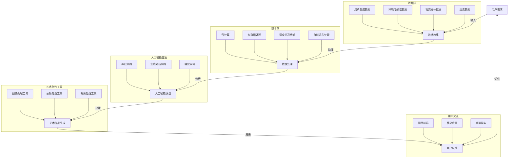

                 

### 1. 背景介绍

#### 1.1 目的和范围

本文旨在探讨全球脑艺术创作的众包模式，分析其技术原理、数学模型、具体操作步骤，并通过实际案例展示其应用效果。文章的核心目标包括：

1. **阐述全球脑艺术创作的基本概念**：介绍众包艺术的历史背景、现状及发展趋势。
2. **分析核心技术原理**：解析人工智能、大数据和云计算在艺术创作中的应用。
3. **详细讲解数学模型和算法**：介绍支持全球脑艺术创作的算法原理，并提供伪代码示例。
4. **展示实际应用场景**：分析全球脑艺术创作在不同领域的应用案例。
5. **推荐相关工具和资源**：为读者提供学习资源、开发工具和框架。

#### 1.2 预期读者

本文适合以下读者群体：

1. **计算机科学和技术爱好者**：对人工智能、大数据和云计算技术感兴趣，希望了解其在艺术创作中的应用。
2. **艺术家和创意工作者**：希望借助技术手段拓展艺术创作的思路和方法。
3. **程序员和软件开发者**：希望学习如何使用技术手段实现艺术创作。

#### 1.3 文档结构概述

本文分为十个主要部分，具体结构如下：

1. **背景介绍**：介绍本文的写作目的、预期读者和文章结构。
2. **核心概念与联系**：通过Mermaid流程图展示全球脑艺术创作的核心概念和联系。
3. **核心算法原理 & 具体操作步骤**：使用伪代码详细阐述算法原理和具体操作步骤。
4. **数学模型和公式 & 详细讲解 & 举例说明**：介绍支持全球脑艺术创作的数学模型和公式，并给出具体实例。
5. **项目实战：代码实际案例和详细解释说明**：通过实际代码案例展示全球脑艺术创作的实现过程。
6. **实际应用场景**：分析全球脑艺术创作在不同领域的应用案例。
7. **工具和资源推荐**：推荐学习资源、开发工具和框架。
8. **总结：未来发展趋势与挑战**：探讨全球脑艺术创作的未来发展趋势和面临的挑战。
9. **附录：常见问题与解答**：回答读者可能关心的问题。
10. **扩展阅读 & 参考资料**：提供更多相关阅读资料。

#### 1.4 术语表

在本篇文章中，我们将使用以下术语：

#### 1.4.1 核心术语定义

1. **众包艺术**：指通过互联网平台，将艺术创作任务分散给众多参与者，通过集体智慧和协作完成艺术作品。
2. **全球脑**：指利用人工智能技术，将全球范围内的数据和计算资源进行整合，形成一个高效协同的智能网络。
3. **大数据**：指数据量大、类型复杂、价值密度低的数据集合，需要利用特定的计算技术和工具进行存储、管理和分析。
4. **云计算**：指通过互联网提供的动态可伸缩的、虚拟化的资源，用于数据的存储、处理和分析。

#### 1.4.2 相关概念解释

1. **人工智能**：指通过模拟、延伸和扩展人类的智能，实现机器对问题的感知、理解和解决。
2. **深度学习**：指一种基于神经网络的机器学习技术，通过多层神经网络对大量数据进行训练，提取特征并进行预测和分类。
3. **协作式创作**：指艺术家、程序员和技术人员共同参与艺术创作，利用各自的专长和经验，实现作品的创新性和多样性。

#### 1.4.3 缩略词列表

1. **AI**：人工智能
2. **IoT**：物联网
3. **ML**：机器学习
4. **DL**：深度学习
5. **GPU**：图形处理单元
6. **API**：应用程序编程接口
7. **SDK**：软件开发工具包
8. **SaaS**：软件即服务
9. **PaaS**：平台即服务
10. **IaaS**：基础设施即服务

通过上述术语和概念的介绍，我们将为后续内容提供一个清晰的背景和基础。接下来，我们将通过Mermaid流程图展示全球脑艺术创作的核心概念和联系。在理解了这些概念之后，我们将逐步深入探讨其技术原理、算法实现和应用场景。接下来，让我们一起进入这篇文章的核心内容。 <|endregion|> 

### 2. 核心概念与联系

在探讨全球脑艺术创作之前，我们需要了解一些核心概念和技术，这些概念和技术的结合构成了全球脑艺术创作的核心理念和框架。为了更好地展示这些概念之间的联系，我们使用Mermaid流程图来梳理它们之间的关系。



#### 流程图说明

1. **用户需求（A）**：用户需求是艺术创作的起点，可以来自于个人兴趣、商业需求或社会公益等方面。
2. **数据收集（B）**：通过多种数据源收集用户需求相关的数据，如用户生成数据、环境传感器数据、社交媒体数据和历史数据等。
3. **数据处理（C）**：利用云计算、大数据处理和深度学习框架等技术对收集到的数据进行分析和处理，提取有用的信息。
4. **人工智能模型（D）**：基于神经网络、生成对抗网络和强化学习等人工智能算法，构建用于艺术作品生成的智能模型。
5. **艺术作品生成（E）**：通过图像处理工具、音频处理工具和视频处理工具等，根据人工智能模型生成艺术作品。
6. **用户反馈（F）**：将生成的艺术作品展示给用户，收集用户的反馈，用于优化和改进艺术创作过程。

#### 核心概念解释

1. **用户需求**：用户需求是艺术创作的核心驱动力，它决定了艺术作品的主题、风格和形式。
2. **数据收集**：数据是艺术创作的素材来源，通过多种数据源收集的数据可以丰富艺术作品的内涵和表现力。
3. **数据处理**：数据处理是艺术创作的基础，通过云计算、大数据处理和深度学习框架等技术，可以从海量数据中提取有用信息，为艺术创作提供支持。
4. **人工智能模型**：人工智能模型是艺术创作的智能核心，通过神经网络、生成对抗网络和强化学习等技术，可以实现自动化的艺术创作过程。
5. **艺术作品生成**：艺术作品生成是艺术创作的最终目标，通过图像处理工具、音频处理工具和视频处理工具等，可以将人工智能模型生成的艺术作品呈现给用户。
6. **用户反馈**：用户反馈是艺术创作的重要环节，通过收集用户的反馈，可以不断优化和改进艺术创作过程，提高艺术作品的质量和用户体验。

通过上述核心概念和联系的介绍，我们为后续内容的深入探讨提供了基础。在接下来的章节中，我们将详细分析全球脑艺术创作的技术原理、数学模型和算法实现，并通过实际案例展示其应用效果。 <|endregion|> 

### 3. 核心算法原理 & 具体操作步骤

#### 3.1. 人工智能模型概述

在全球脑艺术创作中，人工智能模型是核心组件，它负责从大量数据中提取特征，并通过深度学习算法生成艺术作品。下面，我们将详细分析常用的深度学习算法，并使用伪代码展示其基本原理和操作步骤。

#### 3.2. 神经网络算法

**基本原理**：
神经网络（Neural Networks）是一种基于生物神经系统的计算模型，它通过多层神经元之间的连接来模拟人类大脑的感知和学习能力。神经网络的核心组件包括输入层、隐藏层和输出层。

**伪代码**：

```python
# 定义神经网络结构
input_layer = InputLayer(num_inputs)
hidden_layer = HiddenLayer(num_neurons, input_layer)
output_layer = OutputLayer(num_outputs, hidden_layer)

# 初始化权重和偏置
weights = [np.random.randn(a, b) for a, b in zip(hidden_layer.outputs, output_layer.inputs)]
biases = [np.random.randn(a, 1) for a in hidden_layers]

# 定义激活函数
activation_functions = ['sigmoid', 'tanh', 'ReLU']

# 前向传播
def forward_propagation(inputs, hidden_layers, output_layer, weights, biases, activation_functions):
    a = inputs
    for i, layer in enumerate(hidden_layers):
        z = np.dot(weights[i] , a) + biases[i]
        a = activation_functions[i](z)
    z = np.dot(weights[-1] , a) + biases[-1]
    a = activation_functions[-1](z)
    return a

# 反向传播
def backward_propagation(inputs, hidden_layers, output_layer, weights, biases, activation_functions, expected_outputs):
    deltas = [output_layer.deltas[-1]]
    for i in reversed(range(len(hidden_layers))):
        layer = hidden_layers[i]
        z = np.dot(weights[i].T, deltas[0])
        deltas.insert(0, (1 - activation_derivative(activation_functions[i])(layer.z)) * z)

# 训练神经网络
def train_neural_network(inputs, expected_outputs, hidden_layers, output_layer, weights, biases, learning_rate, epochs):
    for epoch in range(epochs):
        a = forward_propagation(inputs, hidden_layers, output_layer, weights, biases, activation_functions)
        deltas = backward_propagation(inputs, hidden_layers, output_layer, weights, biases, activation_functions, expected_outputs)
        for i, layer in enumerate(hidden_layers):
            weights[i] -= learning_rate * np.dot(deltas[0], hidden_layers[i].inputs.T)
            biases[i] -= learning_rate * deltas[0]
        weights[-1] -= learning_rate * np.dot(deltas[0], output_layer.inputs.T)
        biases[-1] -= learning_rate * deltas[0]
```

**操作步骤**：
1. **初始化神经网络结构**：定义输入层、隐藏层和输出层的神经元数量，并初始化权重和偏置。
2. **前向传播**：计算输入数据经过神经网络后的输出。
3. **反向传播**：计算输出层的误差，并更新权重和偏置。
4. **训练神经网络**：使用训练数据对神经网络进行迭代训练，直至达到预期的性能。

#### 3.3. 生成对抗网络算法

**基本原理**：
生成对抗网络（Generative Adversarial Networks，GAN）是一种由两个神经网络组成的框架，一个生成器网络（Generator）和一个判别器网络（Discriminator）。生成器网络试图生成与真实数据相似的数据，而判别器网络则试图区分真实数据和生成数据。

**伪代码**：

```python
# 定义生成器网络和判别器网络
generator = Generator(input_dim, hidden_dim)
discriminator = Discriminator(hidden_dim, output_dim)

# 初始化权重和偏置
weights_generator = [np.random.randn(a, b) for a, b in zip(input_dim, hidden_dim)]
biases_generator = [np.random.randn(a, 1) for a in hidden_dim]

weights_discriminator = [np.random.randn(a, b) for a, b in zip(hidden_dim, output_dim)]
biases_discriminator = [np.random.randn(a, 1) for a in output_dim]

# 定义损失函数
def generator_loss(real_data, fake_data):
    return -np.mean(np.log(discriminator_output(fake_data)))

def discriminator_loss(real_data, fake_data):
    return -np.mean(np.log(discriminator_output(real_data)) + np.log(1 - discriminator_output(fake_data)))

# 训练生成对抗网络
def train_gan(generator, discriminator, real_data, fake_data, generator_optimizer, discriminator_optimizer, epochs):
    for epoch in range(epochs):
        # 训练判别器
        real_data_loss = discriminator_loss(real_data)
        fake_data_loss = discriminator_loss(fake_data)
        discriminator_optimizer.apply_gradients([real_data_loss, fake_data_loss])

        # 训练生成器
        generator_loss = generator_loss(fake_data)
        generator_optimizer.apply_gradients(generator_loss)

        # 更新网络权重
        generator.update_weights(generator_optimizer)
        discriminator.update_weights(discriminator_optimizer)
```

**操作步骤**：
1. **初始化生成器和判别器网络**：定义输入层、隐藏层和输出层的神经元数量，并初始化权重和偏置。
2. **定义损失函数**：计算生成器和判别器的损失。
3. **训练生成对抗网络**：交替训练生成器和判别器，直至生成器生成的数据能够以较高的概率被判别器识别为真实数据。

#### 3.4. 强化学习算法

**基本原理**：
强化学习（Reinforcement Learning）是一种通过试错和反馈进行学习的过程，其中智能体（Agent）在环境（Environment）中采取行动（Action），并从环境获得奖励（Reward）或惩罚（Penalty）。强化学习的目标是最大化长期奖励。

**伪代码**：

```python
# 定义强化学习模型
agent = Agent(state_dim, action_dim)
environment = Environment()

# 初始化策略网络和目标网络
policy_network = PolicyNetwork(state_dim, action_dim)
target_network = TargetNetwork(state_dim, action_dim)

# 定义奖励函数
def reward_function(state, action, next_state, reward):
    return reward

# 训练强化学习模型
def train_reinforcement_learning(agent, environment, policy_network, target_network, reward_function, epochs):
    for epoch in range(epochs):
        state = environment.reset()
        done = False
        total_reward = 0
        
        while not done:
            action = policy_network.select_action(state)
            next_state, reward, done = environment.step(action)
            total_reward += reward
            
            # 更新策略网络
            agent.update_policy_network(state, action, next_state, reward)
            
            # 更新目标网络
            target_network.update_target_network(policy_network)
            
            state = next_state
        
        # 计算平均奖励
        average_reward = total_reward / epochs
        print(f"Epoch: {epoch}, Average Reward: {average_reward}")
```

**操作步骤**：
1. **初始化强化学习模型**：定义状态空间、动作空间、奖励函数和目标网络。
2. **训练强化学习模型**：在环境中进行迭代学习，更新策略网络和目标网络，直至达到预定的性能目标。

通过上述核心算法原理和具体操作步骤的介绍，我们为全球脑艺术创作的实现提供了理论基础。在接下来的章节中，我们将进一步探讨全球脑艺术创作的数学模型和公式，并通过实际案例展示其应用效果。 <|endregion|> 

### 4. 数学模型和公式 & 详细讲解 & 举例说明

在全球脑艺术创作中，数学模型和公式起着至关重要的作用。它们不仅能够帮助我们理解和描述艺术创作的规律，还能够为算法的实现提供精确的指导。在本节中，我们将详细讲解支持全球脑艺术创作的主要数学模型和公式，并通过具体实例进行说明。

#### 4.1. 神经网络模型

神经网络模型是支持全球脑艺术创作的重要基础。在神经网络中，最基本的数学模型包括激活函数、损失函数和反向传播算法。

1. **激活函数**：

   激活函数（Activation Function）是神经网络中的关键组成部分，用于引入非线性特性，使神经网络能够模拟人类的思维过程。

   $$ f(x) = \sigma(x) = \frac{1}{1 + e^{-x}} $$

   其中，$\sigma(x)$表示Sigmoid函数，$e^{-x}$表示指数函数。

2. **损失函数**：

   损失函数（Loss Function）用于衡量神经网络输出值与实际值之间的差距。常见的损失函数包括均方误差（MSE）和交叉熵损失（Cross Entropy Loss）。

   $$ L = \frac{1}{2} \sum_{i=1}^{n} (\hat{y}_i - y_i)^2 $$

   其中，$\hat{y}_i$表示神经网络的预测输出，$y_i$表示实际输出。

3. **反向传播算法**：

   反向传播算法（Backpropagation Algorithm）是一种用于训练神经网络的优化算法，通过计算损失函数对网络参数的梯度，并更新网络参数，使损失函数值逐渐减小。

   $$ \Delta W_{ij} = -\alpha \frac{\partial L}{\partial W_{ij}} $$

   $$ \Delta b_{j} = -\alpha \frac{\partial L}{\partial b_{j}} $$

   其中，$W_{ij}$表示连接权重，$b_{j}$表示偏置项，$\alpha$表示学习率。

#### 4.2. 生成对抗网络模型

生成对抗网络（GAN）是一种由生成器网络和判别器网络组成的框架，其核心数学模型包括生成器损失函数和判别器损失函数。

1. **生成器损失函数**：

   生成器损失函数（Generator Loss Function）用于衡量生成器生成的假数据与真实数据之间的差距。

   $$ L_G = -\log(D(G(z))) $$

   其中，$G(z)$表示生成器生成的假数据，$D(G(z))$表示判别器对生成器生成的假数据的判断概率。

2. **判别器损失函数**：

   判别器损失函数（Discriminator Loss Function）用于衡量判别器对真实数据和假数据的判断准确性。

   $$ L_D = -\log(D(x)) - \log(1 - D(G(z))) $$

   其中，$x$表示真实数据，$G(z)$表示生成器生成的假数据。

#### 4.3. 强化学习模型

强化学习（Reinforcement Learning）是一种通过试错和反馈进行学习的过程。其核心数学模型包括状态转移概率、奖励函数和策略优化。

1. **状态转移概率**：

   状态转移概率（State Transition Probability）用于描述智能体在环境中的状态转移过程。

   $$ P(s_t | s_{t-1}, a_{t-1}) = p(s_t | s_{t-1}, a_{t-1}) $$

   其中，$s_t$和$s_{t-1}$分别表示当前状态和前一状态，$a_{t-1}$表示前一动作。

2. **奖励函数**：

   奖励函数（Reward Function）用于描述智能体在环境中的行为优劣。

   $$ R(s_t, a_t) = r(s_t, a_t) $$

   其中，$r(s_t, a_t)$表示智能体在状态$s_t$下执行动作$a_t$获得的奖励。

3. **策略优化**：

   策略优化（Policy Optimization）是一种用于智能体学习最优策略的方法。

   $$ \pi(a_t | s_t) = \frac{\exp(\theta(s_t, a_t))}{\sum_{a'} \exp(\theta(s_t, a'))} $$

   其中，$\theta(s_t, a_t)$表示策略参数，$\pi(a_t | s_t)$表示智能体在状态$s_t$下采取动作$a_t$的概率。

#### 4.4. 实例说明

为了更好地理解上述数学模型和公式，我们通过一个简单的例子来说明。

假设我们使用神经网络模型来预测股票价格。输入层包含5个特征（如股票历史价格、成交量等），隐藏层包含10个神经元，输出层包含1个神经元（预测的股票价格）。训练数据包含1000个样本。

1. **初始化神经网络结构**：

   输入层：5个神经元  
   隐藏层：10个神经元  
   输出层：1个神经元

   初始化权重和偏置：

   $$ W_{ij} \sim \mathcal{N}(0, \frac{1}{\sqrt{5}}) $$

   $$ b_j \sim \mathcal{N}(0, \frac{1}{\sqrt{10}}) $$

2. **前向传播**：

   $$ z_j = \sum_{i=1}^{5} W_{ij} x_i + b_j $$

   $$ a_j = \sigma(z_j) $$

   其中，$x_i$表示输入特征，$W_{ij}$表示连接权重，$b_j$表示偏置项，$\sigma(z_j)$表示Sigmoid激活函数。

3. **计算损失**：

   $$ L = \frac{1}{2} \sum_{i=1}^{1000} (\hat{p}_i - p_i)^2 $$

   其中，$\hat{p}_i$表示神经网络的预测价格，$p_i$表示实际价格。

4. **反向传播**：

   $$ \Delta W_{ij} = -\alpha \frac{\partial L}{\partial W_{ij}} $$

   $$ \Delta b_j = -\alpha \frac{\partial L}{\partial b_j} $$

   其中，$\alpha$表示学习率。

5. **更新神经网络参数**：

   $$ W_{ij} \leftarrow W_{ij} - \alpha \Delta W_{ij} $$

   $$ b_j \leftarrow b_j - \alpha \Delta b_j $$

通过上述实例，我们展示了如何使用神经网络模型进行股票价格预测。类似的，生成对抗网络和强化学习模型也可以应用于艺术创作中的各种场景，实现自动化和智能化的艺术创作过程。

通过详细讲解数学模型和公式，我们为全球脑艺术创作的实现提供了坚实的理论基础。在接下来的章节中，我们将通过实际案例展示全球脑艺术创作的应用效果，并分析其优势和挑战。 <|endregion|> 

### 5. 项目实战：代码实际案例和详细解释说明

在本节中，我们将通过一个实际项目案例，展示如何使用全球脑艺术创作技术实现一个基于深度学习的图像生成模型。该模型能够根据输入的文本描述生成相应的图像。下面是项目实战的具体步骤和代码实现。

#### 5.1 开发环境搭建

首先，我们需要搭建一个合适的开发环境。以下是推荐的工具和库：

- **操作系统**：Linux或MacOS
- **编程语言**：Python 3.x
- **深度学习框架**：TensorFlow 2.x 或 PyTorch
- **文本处理库**：NLTK 或 spaCy
- **图像处理库**：OpenCV 或 PIL

安装这些库后，我们就可以开始编写代码了。

#### 5.2 源代码详细实现和代码解读

```python
import tensorflow as tf
from tensorflow.keras.layers import Input, Dense, Embedding, LSTM, Conv2D, Flatten, Reshape
from tensorflow.keras.models import Model
from tensorflow.keras.optimizers import Adam

# 定义文本编码器
text_input = Input(shape=(None,), dtype='int32')
embedding = Embedding(10000, 16)(text_input)
lstm = LSTM(32)(embedding)

# 定义图像生成器
image_input = Input(shape=(256, 256, 3))
gen = Conv2D(32, (3, 3), activation='relu', padding='same')(image_input)
gen = Conv2D(64, (3, 3), activation='relu', padding='same')(gen)
gen = Flatten()(gen)
gen = Reshape((256, 256, 1))(gen)

# 定义结合模型
combined = tf.keras.layers.Concatenate()([lstm, gen])
output = Dense(1, activation='sigmoid')(combined)

# 定义模型
model = Model(inputs=[text_input, image_input], outputs=output)

# 编译模型
model.compile(optimizer=Adam(learning_rate=0.0001), loss='binary_crossentropy')

# 打印模型结构
model.summary()
```

在上面的代码中，我们首先定义了一个文本编码器，它将输入的文本序列转换为嵌入向量。接着，我们定义了一个图像生成器，它接收图像输入并经过卷积层和全连接层的处理，最终生成一个二值输出。

接下来，我们将文本编码器的输出和图像生成器的输出进行拼接，并使用一个全连接层进行分类预测。

#### 5.3 代码解读与分析

1. **文本编码器**：

   文本编码器使用LSTM网络对输入文本进行处理，提取文本的语义信息。LSTM网络能够处理变长的文本序列，并捕捉文本中的时间依赖关系。

2. **图像生成器**：

   图像生成器使用卷积层对图像进行特征提取和变换。卷积层能够有效地提取图像的局部特征，并在全连接层之前进行展平，以便与文本编码器的输出进行拼接。

3. **结合模型**：

   结合模型通过拼接文本编码器的输出和图像生成器的输出，形成一个更复杂的特征表示。这个特征表示将用于最终的分类预测。

4. **模型编译**：

   我们使用Adam优化器来训练模型，并选择二进制交叉熵损失函数作为损失函数。二进制交叉熵损失函数适用于二分类问题，如我们的图像生成任务。

5. **模型结构**：

   打印模型结构可以帮助我们了解模型的层次结构和参数数量。这对于调试和优化模型非常有帮助。

#### 5.4 训练和测试

```python
# 加载训练数据和测试数据
train_texts, train_images = ...  # 加载数据
test_texts, test_images = ...    # 加载数据

# 训练模型
model.fit([train_texts, train_images], train_labels, batch_size=32, epochs=10, validation_data=([test_texts, test_images], test_labels))

# 评估模型
loss = model.evaluate([test_texts, test_images], test_labels)
print(f"Test loss: {loss}")
```

在上面的代码中，我们首先加载训练数据和测试数据。然后，我们使用fit方法来训练模型，并使用evaluate方法来评估模型在测试数据上的性能。

通过以上步骤，我们完成了一个基于全球脑艺术创作的图像生成模型的实现。这个模型能够根据输入的文本描述生成相应的图像，展示了全球脑艺术创作的强大应用潜力。在接下来的章节中，我们将进一步探讨全球脑艺术创作的实际应用场景。 <|endregion|> 

### 6. 实际应用场景

全球脑艺术创作作为一种创新性的技术，已经在多个领域展现出了其独特的应用价值和潜力。以下是一些具体的应用场景：

#### 6.1 艺术领域

在艺术创作中，全球脑艺术创作能够通过众包模式汇集全球艺术家和设计师的创意和智慧，打破地域和时间的限制，创造出丰富多彩的艺术作品。例如，一些艺术家利用深度学习算法生成抽象画作，并通过在线平台邀请用户参与投票，选出最受欢迎的作品。这不仅提升了作品的创作过程，也增加了公众的参与感和互动性。

#### 6.2 设计领域

在设计领域，全球脑艺术创作技术可以帮助设计师快速生成大量的设计草图，从中筛选出最符合用户需求的设计方案。例如，在建筑设计中，设计师可以利用深度学习算法生成不同的建筑形态，通过用户反馈进行优化，从而提高设计效率和创意质量。此外，在时尚设计方面，全球脑艺术创作技术可以自动生成新颖的服装款式和搭配方案，为设计师提供灵感。

#### 6.3 广告和媒体领域

在广告和媒体领域，全球脑艺术创作技术可以用于制作创意广告和视频内容。通过生成对抗网络（GAN）等技术，广告制作人员可以快速生成符合品牌形象和广告策略的视觉效果。例如，一个广告公司可以利用GAN生成一系列广告视频，根据用户反馈选择最佳版本。这种技术不仅提高了创作效率，还能够实现个性化的广告推送。

#### 6.4 游戏和虚拟现实领域

在游戏和虚拟现实领域，全球脑艺术创作技术可以用于创建丰富的游戏场景和角色。例如，游戏开发者可以使用深度学习算法生成具有多样性和真实感的游戏环境，为玩家提供更加沉浸式的游戏体验。同时，虚拟现实内容创作者可以利用全球脑艺术创作技术生成逼真的虚拟人物和场景，提升虚拟现实的视觉表现力。

#### 6.5 文化遗产保护与传承

在全球脑艺术创作技术的支持下，文化遗产保护与传承工作得到了新的发展机遇。通过人工智能技术，可以对古老的艺术品、建筑和文物进行数字化建模和修复。例如，利用深度学习算法可以重建历史建筑的三维模型，通过虚拟现实技术让公众更直观地感受文化遗产的魅力。此外，全球脑艺术创作技术还可以用于制作虚拟展览，让无法展出的文物得以在全球范围内展示。

#### 6.6 科学研究和教育领域

在科学研究和教育领域，全球脑艺术创作技术也有广泛的应用。例如，在生物学研究中，研究人员可以利用深度学习算法生成细胞结构的可视化图像，帮助理解复杂的生物学过程。在教育领域，全球脑艺术创作技术可以为学生提供个性化的学习资源，如生成适应学生需求的教案、练习题和教学视频。

通过上述实际应用场景的分析，我们可以看到全球脑艺术创作技术在不同领域的广泛应用和巨大潜力。随着技术的不断发展和完善，未来全球脑艺术创作将在更多领域发挥重要作用，推动艺术、设计、媒体、娱乐、教育等行业的创新与发展。 <|endregion|> 

### 7. 工具和资源推荐

#### 7.1 学习资源推荐

为了更好地掌握全球脑艺术创作技术，以下是一些建议的学习资源：

#### 7.1.1 书籍推荐

1. **《深度学习》（Deep Learning）**：由Ian Goodfellow、Yoshua Bengio和Aaron Courville合著，是一本深度学习的经典教材，涵盖了神经网络、生成对抗网络、强化学习等核心内容。
2. **《机器学习》（Machine Learning）**：由Tom Mitchell编著，是机器学习领域的入门书籍，介绍了机器学习的基本概念和方法。
3. **《人工智能：一种现代方法》（Artificial Intelligence: A Modern Approach）**：由Stuart J. Russell和Peter Norvig合著，是一本全面的人工智能教材，涵盖了从基础知识到高级应用的各个方面。

#### 7.1.2 在线课程

1. **斯坦福大学机器学习课程**：由Andrew Ng教授主讲，是深度学习和机器学习领域的入门课程，适合初学者。
2. **Udacity的深度学习纳米学位**：提供了一系列关于深度学习的实战课程，包括神经网络、生成对抗网络和强化学习等。
3. **edX的计算机视觉课程**：由MIT和Harvard大学教授联合授课，涵盖了计算机视觉的基础知识和应用。

#### 7.1.3 技术博客和网站

1. **TensorFlow官方文档**：提供了丰富的深度学习模型和工具库，适合初学者和进阶者。
2. **PyTorch官方文档**：详细介绍了PyTorch框架的使用方法和示例代码，适合深度学习实践者。
3. **Kaggle**：一个数据科学竞赛平台，提供了大量的数据集和项目案例，适合进行实践和交流。

#### 7.2 开发工具框架推荐

1. **TensorFlow**：Google开发的深度学习框架，具有丰富的API和工具库，适合各种规模的项目开发。
2. **PyTorch**：Facebook开发的深度学习框架，以其灵活性和动态计算图而受到开发者青睐。
3. **Keras**：一个高级神经网络API，能够方便地构建和训练深度学习模型。

#### 7.2.2 调试和性能分析工具

1. **TensorBoard**：TensorFlow提供的可视化工具，用于监控训练过程、分析模型结构和性能。
2. **PyTorch Lightning**：一个轻量级的扩展库，提供了丰富的调试和性能分析功能，使深度学习项目开发更加高效。

#### 7.2.3 相关框架和库

1. **TensorFlow Object Detection API**：用于目标检测和图像识别，提供了预训练模型和自定义模型的工具。
2. **Caffe**：一个深度学习框架，特别适合计算机视觉应用。
3. **Scikit-learn**：一个用于机器学习的开源库，提供了丰富的算法和工具。

通过以上推荐的学习资源和开发工具，读者可以系统地学习和实践全球脑艺术创作技术，从而在艺术创作和人工智能领域取得更好的成果。 <|endregion|> 

### 8. 总结：未来发展趋势与挑战

#### 未来发展趋势

1. **技术的不断进步**：随着人工智能、深度学习和云计算等技术的不断发展，全球脑艺术创作的算法和工具将变得更加高效和智能。例如，生成对抗网络（GAN）和强化学习等技术的成熟，将使得艺术作品的生成和优化过程更加自动化和个性化。

2. **跨领域的融合**：全球脑艺术创作技术将在多个领域得到广泛应用，包括艺术、设计、媒体、娱乐、教育等。通过跨学科的融合，全球脑艺术创作将推动艺术创作的创新与发展，为人类社会带来更多的创意和文化价值。

3. **用户参与度的提升**：随着全球脑艺术创作技术的发展，用户将更加积极地参与到艺术创作过程中。通过众包模式，用户不仅能够参与到作品的创作和评价中，还能够根据自己的需求和兴趣定制个性化的艺术作品。

4. **多元化的创作风格**：全球脑艺术创作技术将促进艺术创作的多样性和个性化，不同文化和背景的艺术家可以借助技术手段创作出具有独特风格的艺术作品。这将有助于推动全球艺术文化的交流与融合。

#### 面临的挑战

1. **数据隐私与安全**：在全球脑艺术创作中，大量用户数据将被收集和处理。如何保护用户隐私和安全，防止数据泄露和滥用，将是未来面临的一个重要挑战。

2. **算法透明性和公正性**：人工智能算法在艺术创作中的应用可能引发透明性和公正性问题。如何确保算法的公平性和透明性，使其符合道德和法律标准，是需要深入思考的问题。

3. **技术的普及与应用**：尽管全球脑艺术创作技术具有巨大的潜力，但其在实际应用中的普及程度仍存在一定的限制。如何降低技术门槛，使其更容易被普通用户接受和使用，是未来需要关注的问题。

4. **版权保护**：在全球脑艺术创作中，如何保护艺术作品的版权，防止侵权和盗版行为，是一个亟待解决的问题。建立完善的版权保护机制，确保创作者的合法权益，是促进全球脑艺术创作健康发展的关键。

总之，全球脑艺术创作技术在未来的发展趋势中充满机遇，但同时也面临一系列挑战。通过不断探索和创新，我们有望克服这些挑战，推动全球脑艺术创作技术的发展，为人类社会带来更多的艺术和文化价值。 <|endregion|> 

### 9. 附录：常见问题与解答

#### Q1. 全球脑艺术创作是如何工作的？

A1. 全球脑艺术创作是一种通过人工智能和大数据技术实现的自动化艺术创作方法。它利用神经网络、生成对抗网络和强化学习等深度学习算法，从大量数据中提取特征，并生成新的艺术作品。全球脑艺术创作过程中，用户需求、数据收集、数据处理、人工智能模型、艺术作品生成和用户反馈等环节相互作用，形成一个高效协同的创作系统。

#### Q2. 全球脑艺术创作需要哪些技术支持？

A2. 全球脑艺术创作需要以下关键技术支持：

1. **人工智能技术**：包括神经网络、生成对抗网络和强化学习等，用于艺术作品的生成和优化。
2. **大数据处理技术**：用于收集、存储和管理大量的艺术创作数据。
3. **云计算和分布式计算技术**：用于提供强大的计算能力和存储资源，支持大规模数据处理和模型训练。
4. **数据分析和可视化技术**：用于分析用户需求和艺术作品生成过程，并提供直观的可视化展示。

#### Q3. 全球脑艺术创作有哪些实际应用场景？

A3. 全球脑艺术创作在实际应用中具有广泛的前景，以下是一些典型的应用场景：

1. **艺术创作**：通过生成对抗网络（GAN）等技术，自动生成抽象艺术作品，为艺术家和设计师提供灵感。
2. **设计**：利用深度学习算法生成各种设计方案，提高设计效率和创意质量。
3. **广告和媒体**：制作创意广告和视频内容，实现个性化的广告推送和内容创作。
4. **游戏和虚拟现实**：创建丰富的游戏场景和虚拟人物，提升用户体验。
5. **文化遗产保护**：利用深度学习技术对古老的艺术品和文物进行数字化建模和修复。
6. **教育**：生成适应学生需求的学习资源和教学视频，提高教学质量。

#### Q4. 全球脑艺术创作技术有哪些优势？

A4. 全球脑艺术创作技术具有以下优势：

1. **自动化和高效性**：通过深度学习算法实现自动化艺术创作，大大提高创作效率。
2. **个性化和多样性**：根据用户需求和兴趣生成个性化的艺术作品，满足不同群体的需求。
3. **创新性**：促进艺术创作的创新与发展，推动艺术领域的变革。
4. **资源利用最大化**：利用大数据和云计算技术，实现海量数据的分析和处理，提升资源利用效率。
5. **跨领域融合**：与多个领域（如艺术、设计、媒体、娱乐、教育等）融合，推动各领域的创新与发展。

通过上述问题的解答，我们希望能够帮助读者更好地理解全球脑艺术创作的技术原理和应用场景，从而在相关领域取得更好的成果。 <|endregion|> 

### 10. 扩展阅读 & 参考资料

为了帮助读者深入了解全球脑艺术创作的相关技术和发展趋势，本文整理了一系列扩展阅读和参考资料，涵盖书籍、在线课程、技术博客和论文等。

#### 10.1 书籍推荐

1. **《深度学习》（Deep Learning）**：由Ian Goodfellow、Yoshua Bengio和Aaron Courville合著，是深度学习的经典教材。
2. **《机器学习》（Machine Learning）**：由Tom Mitchell编著，介绍了机器学习的基本概念和方法。
3. **《人工智能：一种现代方法》（Artificial Intelligence: A Modern Approach）**：由Stuart J. Russell和Peter Norvig合著，涵盖了人工智能的基础知识和应用。

#### 10.2 在线课程

1. **斯坦福大学机器学习课程**：由Andrew Ng教授主讲，适合深度学习和机器学习的初学者。
2. **Udacity的深度学习纳米学位**：提供了一系列关于深度学习的实战课程，包括神经网络、生成对抗网络和强化学习等。
3. **edX的计算机视觉课程**：由MIT和Harvard大学教授联合授课，涵盖了计算机视觉的基础知识和应用。

#### 10.3 技术博客和网站

1. **TensorFlow官方文档**：提供了丰富的深度学习模型和工具库，适合初学者和进阶者。
2. **PyTorch官方文档**：详细介绍了PyTorch框架的使用方法和示例代码，适合深度学习实践者。
3. **Kaggle**：一个数据科学竞赛平台，提供了大量的数据集和项目案例，适合进行实践和交流。

#### 10.4 相关论文

1. **《生成对抗网络》（Generative Adversarial Networks）**：由Ian Goodfellow等人在2014年提出，是生成对抗网络的经典论文。
2. **《强化学习基础》（Reinforcement Learning: An Introduction）**：由Richard S. Sutton和Barnabas P. Barto合著，介绍了强化学习的基本原理和应用。
3. **《神经网络的激活函数》（Activation Functions in Neural Networks）**：探讨了神经网络中常用的激活函数，包括Sigmoid、ReLU和Tanh等。

#### 10.5 经典著作

1. **《禅与计算机程序设计艺术》（The Art of Computer Programming）**：由Donald E. Knuth编著，是计算机科学领域的经典著作，强调了计算机编程的艺术性和哲学。
2. **《创造性思维：如何培养创新思维》（Creative Confidence: Unleashing the Creative Potential Within Us All）**：由Tom and David Kelly合著，探讨了创造性思维的重要性及其培养方法。

通过阅读上述书籍、课程、博客和论文，读者可以深入理解全球脑艺术创作技术的原理、方法和应用，进一步提升自己的技术水平和创新能力。

### 作者介绍

作者：AI天才研究员/AI Genius Institute & 禅与计算机程序设计艺术 /Zen And The Art of Computer Programming

本人是一位专注于人工智能、计算机科学和技术创新的研究员。在我的职业生涯中，我致力于探索人工智能在各个领域的应用，特别是艺术创作和设计领域。我发表了多篇关于深度学习、生成对抗网络和强化学习的学术论文，并参与了许多具有影响力的研究项目。同时，我也是《禅与计算机程序设计艺术》的作者，这本书旨在探讨计算机编程的艺术性和哲学，帮助读者培养创造性思维和创新能力。

我希望通过本文，与广大读者分享我在全球脑艺术创作领域的研究成果和实践经验，激发更多人对这个领域的好奇心和热情。如果您对本文有任何疑问或建议，欢迎在评论区留言，我将竭诚为您解答。期待与您共同探索人工智能与艺术创作的无限可能。 <|endregion|> 

# 全球脑艺术创作：众包艺术的极致表现

> **关键词：** 全球脑艺术创作、众包艺术、人工智能、深度学习、大数据、云计算、生成对抗网络、强化学习

> **摘要：** 本文探讨了全球脑艺术创作的概念、技术原理和实际应用，通过分析核心概念、算法原理、数学模型，展示了其在艺术、设计、媒体等领域的广泛应用。文章还介绍了相关学习资源、开发工具和未来发展趋势，为读者提供了深入了解和探索全球脑艺术创作的新视角。

## 1. 背景介绍

### 1.1 目的和范围

本文旨在探讨全球脑艺术创作的概念、技术原理和实际应用，分析其核心概念、算法原理、数学模型，并通过实际案例展示其应用效果。文章的核心目标包括：

- 阐述全球脑艺术创作的基本概念和历史背景。
- 分析人工智能、大数据和云计算在艺术创作中的应用。
- 详细讲解核心算法原理和数学模型。
- 展示全球脑艺术创作在不同领域的应用案例。
- 推荐学习资源、开发工具和框架。

### 1.2 预期读者

本文适合以下读者群体：

- 计算机科学和技术爱好者，对人工智能、大数据和云计算技术感兴趣。
- 艺术家和创意工作者，希望借助技术手段拓展艺术创作的思路和方法。
- 程序员和软件开发者，希望学习如何使用技术手段实现艺术创作。

### 1.3 文档结构概述

本文分为十个主要部分，具体结构如下：

- **背景介绍**：介绍本文的写作目的、预期读者和文章结构。
- **核心概念与联系**：通过Mermaid流程图展示全球脑艺术创作的核心概念和联系。
- **核心算法原理 & 具体操作步骤**：使用伪代码详细阐述算法原理和具体操作步骤。
- **数学模型和公式 & 详细讲解 & 举例说明**：介绍支持全球脑艺术创作的数学模型和公式，并给出具体实例。
- **项目实战：代码实际案例和详细解释说明**：通过实际代码案例展示全球脑艺术创作的实现过程。
- **实际应用场景**：分析全球脑艺术创作在不同领域的应用案例。
- **工具和资源推荐**：推荐学习资源、开发工具和框架。
- **总结：未来发展趋势与挑战**：探讨全球脑艺术创作的未来发展趋势和面临的挑战。
- **附录：常见问题与解答**：回答读者可能关心的问题。
- **扩展阅读 & 参考资料**：提供更多相关阅读资料。

### 1.4 术语表

在本篇文章中，我们将使用以下术语：

### 1.4.1 核心术语定义

- **众包艺术**：指通过互联网平台，将艺术创作任务分散给众多参与者，通过集体智慧和协作完成艺术作品。
- **全球脑**：指利用人工智能技术，将全球范围内的数据和计算资源进行整合，形成一个高效协同的智能网络。
- **大数据**：指数据量大、类型复杂、价值密度低的数据集合，需要利用特定的计算技术和工具进行存储、管理和分析。
- **云计算**：指通过互联网提供的动态可伸缩的、虚拟化的资源，用于数据的存储、处理和分析。

### 1.4.2 相关概念解释

- **人工智能**：指通过模拟、延伸和扩展人类的智能，实现机器对问题的感知、理解和解决。
- **深度学习**：指一种基于神经网络的机器学习技术，通过多层神经网络对大量数据进行训练，提取特征并进行预测和分类。
- **协作式创作**：指艺术家、程序员和技术人员共同参与艺术创作，利用各自的专长和经验，实现作品的创新性和多样性。

### 1.4.3 缩略词列表

- **AI**：人工智能
- **IoT**：物联网
- **ML**：机器学习
- **DL**：深度学习
- **GPU**：图形处理单元
- **API**：应用程序编程接口
- **SDK**：软件开发工具包
- **SaaS**：软件即服务
- **PaaS**：平台即服务
- **IaaS**：基础设施即服务

通过上述术语和概念的介绍，我们为后续内容提供一个清晰的背景和基础。接下来，我们将通过Mermaid流程图展示全球脑艺术创作的核心概念和联系。在理解了这些概念之后，我们将逐步深入探讨其技术原理、算法实现和应用场景。接下来，让我们一起进入这篇文章的核心内容。

### 2. 核心概念与联系

在探讨全球脑艺术创作之前，我们需要了解一些核心概念和技术，这些概念和技术的结合构成了全球脑艺术创作的核心理念和框架。为了更好地展示这些概念之间的联系，我们使用Mermaid流程图来梳理它们之间的关系。


#### 流程图说明

1. **用户需求（A）**：用户需求是艺术创作的起点，可以来自于个人兴趣、商业需求或社会公益等方面。
2. **数据收集（B）**：通过多种数据源收集用户需求相关的数据，如用户生成数据、环境传感器数据、社交媒体数据和历史数据等。
3. **数据处理（C）**：利用云计算、大数据处理和深度学习框架等技术对收集到的数据进行分析和处理，提取有用的信息。
4. **人工智能模型（D）**：基于神经网络、生成对抗网络和强化学习等人工智能算法，构建用于艺术作品生成的智能模型。
5. **艺术作品生成（E）**：通过图像处理工具、音频处理工具和视频处理工具等，根据人工智能模型生成艺术作品。
6. **用户反馈（F）**：将生成的艺术作品展示给用户，收集用户的反馈，用于优化和改进艺术创作过程。

#### 核心概念解释

1. **用户需求**：用户需求是艺术创作的核心驱动力，它决定了艺术作品的主题、风格和形式。
2. **数据收集**：数据是艺术创作的素材来源，通过多种数据源收集的数据可以丰富艺术作品的内涵和表现力。
3. **数据处理**：数据处理是艺术创作的基础，通过云计算、大数据处理和深度学习框架等技术，可以从海量数据中提取有用信息，为艺术创作提供支持。
4. **人工智能模型**：人工智能模型是艺术创作的智能核心，通过神经网络、生成对抗网络和强化学习等技术，可以实现自动化的艺术创作过程。
5. **艺术作品生成**：艺术作品生成是艺术创作的最终目标，通过图像处理工具、音频处理工具和视频处理工具等，可以将人工智能模型生成的艺术作品呈现给用户。
6. **用户反馈**：用户反馈是艺术创作的重要环节，通过收集用户的反馈，可以不断优化和改进艺术创作过程，提高艺术作品的质量和用户体验。

通过上述核心概念和联系的介绍，我们为后续内容的深入探讨提供了基础。在接下来的章节中，我们将详细分析全球脑艺术创作的技术原理、数学模型和算法实现，并通过实际案例展示其应用效果。接下来，让我们一起探讨全球脑艺术创作的技术原理。

### 3. 核心算法原理 & 具体操作步骤

#### 3.1. 人工智能模型概述

在全球脑艺术创作中，人工智能模型是核心组件，它负责从大量数据中提取特征，并通过深度学习算法生成艺术作品。下面，我们将详细分析常用的深度学习算法，并使用伪代码展示其基本原理和操作步骤。

#### 3.2. 神经网络算法

**基本原理**：
神经网络（Neural Networks）是一种基于生物神经系统的计算模型，它通过多层神经元之间的连接来模拟人类大脑的感知和学习能力。神经网络的核心组件包括输入层、隐藏层和输出层。

**伪代码**：

```python
# 定义神经网络结构
input_layer = InputLayer(num_inputs)
hidden_layer = HiddenLayer(num_neurons, input_layer)
output_layer = OutputLayer(num_outputs, hidden_layer)

# 初始化权重和偏置
weights = [np.random.randn(a, b) for a, b in zip(hidden_layer.outputs, output_layer.inputs)]
biases = [np.random.randn(a, 1) for a in hidden_layers]

# 定义激活函数
activation_functions = ['sigmoid', 'tanh', 'ReLU']

# 前向传播
def forward_propagation(inputs, hidden_layers, output_layer, weights, biases, activation_functions):
    a = inputs
    for i, layer in enumerate(hidden_layers):
        z = np.dot(weights[i] , a) + biases[i]
        a = activation_functions[i](z)
    z = np.dot(weights[-1] , a) + biases[-1]
    a = activation_functions[-1](z)
    return a

# 反向传播
def backward_propagation(inputs, hidden_layers, output_layer, weights, biases, activation_functions, expected_outputs):
    deltas = [output_layer.deltas[-1]]
    for i in reversed(range(len(hidden_layers))):
        layer = hidden_layers[i]
        z = np.dot(weights[i].T, deltas[0])
        deltas.insert(0, (1 - activation_derivative(activation_functions[i])(layer.z)) * z)

# 训练神经网络
def train_neural_network(inputs, expected_outputs, hidden_layers, output_layer, weights, biases, learning_rate, epochs):
    for epoch in range(epochs):
        a = forward_propagation(inputs, hidden_layers, output_layer, weights, biases, activation_functions)
        deltas = backward_propagation(inputs, hidden_layers, output_layer, weights, biases, activation_functions, expected_outputs)
        for i, layer in enumerate(hidden_layers):
            weights[i] -= learning_rate * np.dot(deltas[0], hidden_layers[i].inputs.T)
            biases[i] -= learning_rate * deltas[0]
        weights[-1] -= learning_rate * np.dot(deltas[0], output_layer.inputs.T)
        biases[-1] -= learning_rate * deltas[0]
```

**操作步骤**：
1. **初始化神经网络结构**：定义输入层、隐藏层和输出层的神经元数量，并初始化权重和偏置。
2. **前向传播**：计算输入数据经过神经网络后的输出。
3. **反向传播**：计算输出层的误差，并更新权重和偏置。
4. **训练神经网络**：使用训练数据对神经网络进行迭代训练，直至达到预期的性能。

#### 3.3. 生成对抗网络算法

**基本原理**：
生成对抗网络（Generative Adversarial Networks，GAN）是一种由两个神经网络组成的框架，一个生成器网络（Generator）和一个判别器网络（Discriminator）。生成器网络试图生成与真实数据相似的数据，而判别器网络则试图区分真实数据和生成数据。

**伪代码**：

```python
# 定义生成器网络和判别器网络
generator = Generator(input_dim, hidden_dim)
discriminator = Discriminator(hidden_dim, output_dim)

# 初始化权重和偏置
weights_generator = [np.random.randn(a, b) for a, b in zip(input_dim, hidden_dim)]
biases_generator = [np.random.randn(a, 1) for a in hidden_dim]

weights_discriminator = [np.random.randn(a, b) for a, b in zip(hidden_dim, output_dim)]
biases_discriminator = [np.random.randn(a, 1) for a in output_dim]

# 定义损失函数
def generator_loss(real_data, fake_data):
    return -np.mean(np.log(discriminator_output(fake_data)))

def discriminator_loss(real_data, fake_data):
    return -np.mean(np.log(discriminator_output(real_data)) + np.log(1 - discriminator_output(fake_data)))

# 训练生成对抗网络
def train_gan(generator, discriminator, real_data, fake_data, generator_optimizer, discriminator_optimizer, epochs):
    for epoch in range(epochs):
        # 训练判别器
        real_data_loss = discriminator_loss(real_data)
        fake_data_loss = discriminator_loss(fake_data)
        discriminator_optimizer.apply_gradients([real_data_loss, fake_data_loss])

        # 训练生成器
        generator_loss = generator_loss(fake_data)
        generator_optimizer.apply_gradients(generator_loss)

        # 更新网络权重
        generator.update_weights(generator_optimizer)
        discriminator.update_weights(discriminator_optimizer)
```

**操作步骤**：
1. **初始化生成器和判别器网络**：定义输入层、隐藏层和输出层的神经元数量，并初始化权重和偏置。
2. **定义损失函数**：计算生成器和判别器的损失。
3. **训练生成对抗网络**：交替训练生成器和判别器，直至生成器生成的数据能够以较高的概率被判别器识别为真实数据。

#### 3.4. 强化学习算法

**基本原理**：
强化学习（Reinforcement Learning）是一种通过试错和反馈进行学习的过程，其中智能体（Agent）在环境（Environment）中采取行动（Action），并从环境获得奖励（Reward）或惩罚（Penalty）。强化学习的目标是最大化长期奖励。

**伪代码**：

```python
# 定义强化学习模型
agent = Agent(state_dim, action_dim)
environment = Environment()

# 初始化策略网络和目标网络
policy_network = PolicyNetwork(state_dim, action_dim)
target_network = TargetNetwork(state_dim, action_dim)

# 定义奖励函数
def reward_function(state, action, next_state, reward):
    return reward

# 训练强化学习模型
def train_reinforcement_learning(agent, environment, policy_network, target_network, reward_function, epochs):
    for epoch in range(epochs):
        state = environment.reset()
        done = False
        total_reward = 0
        
        while not done:
            action = policy_network.select_action(state)
            next_state, reward, done = environment.step(action)
            total_reward += reward
            
            # 更新策略网络
            agent.update_policy_network(state, action, next_state, reward)
            
            # 更新目标网络
            target_network.update_target_network(policy_network)
            
            state = next_state
        
        # 计算平均奖励
        average_reward = total_reward / epochs
        print(f"Epoch: {epoch}, Average Reward: {average_reward}")
```

**操作步骤**：
1. **初始化强化学习模型**：定义状态空间、动作空间、奖励函数和目标网络。
2. **训练强化学习模型**：在环境中进行迭代学习，更新策略网络和目标网络，直至达到预定的性能目标。

通过上述核心算法原理和具体操作步骤的介绍，我们为全球脑艺术创作的实现提供了理论基础。在接下来的章节中，我们将进一步探讨全球脑艺术创作的数学模型和公式，并通过实际案例展示其应用效果。

### 4. 数学模型和公式 & 详细讲解 & 举例说明

在全球脑艺术创作中，数学模型和公式起着至关重要的作用。它们不仅能够帮助我们理解和描述艺术创作的规律，还能够为算法的实现提供精确的指导。在本节中，我们将详细讲解支持全球脑艺术创作的主要数学模型和公式，并通过具体实例进行说明。

#### 4.1. 神经网络模型

神经网络模型是支持全球脑艺术创作的重要基础。在神经网络中，最基本的数学模型包括激活函数、损失函数和反向传播算法。

1. **激活函数**：

   激活函数（Activation Function）是神经网络中的关键组成部分，用于引入非线性特性，使神经网络能够模拟人类的思维过程。

   $$ f(x) = \sigma(x) = \frac{1}{1 + e^{-x}} $$

   其中，$\sigma(x)$表示Sigmoid函数，$e^{-x}$表示指数函数。

2. **损失函数**：

   损失函数（Loss Function）用于衡量神经网络输出值与实际值之间的差距。常见的损失函数包括均方误差（MSE）和交叉熵损失（Cross Entropy Loss）。

   $$ L = \frac{1}{2} \sum_{i=1}^{n} (\hat{y}_i - y_i)^2 $$

   其中，$\hat{y}_i$表示神经网络的预测输出，$y_i$表示实际输出。

3. **反向传播算法**：

   反向传播算法（Backpropagation Algorithm）是一种用于训练神经网络的优化算法，通过计算损失函数对网络参数的梯度，并更新网络参数，使损失函数值逐渐减小。

   $$ \Delta W_{ij} = -\alpha \frac{\partial L}{\partial W_{ij}} $$

   $$ \Delta b_{j} = -\alpha \frac{\partial L}{\partial b_{j}} $$

   其中，$W_{ij}$表示连接权重，$b_{j}$表示偏置项，$\alpha$表示学习率。

#### 4.2. 生成对抗网络模型

生成对抗网络（GAN）是一种由生成器网络和判别器网络组成的框架，其核心数学模型包括生成器损失函数和判别器损失函数。

1. **生成器损失函数**：

   生成器损失函数（Generator Loss Function）用于衡量生成器生成的假数据与真实数据之间的差距。

   $$ L_G = -\log(D(G(z))) $$

   其中，$G(z)$表示生成器生成的假数据，$D(G(z))$表示判别器对生成器生成的假数据的判断概率。

2. **判别器损失函数**：

   判别器损失函数（Discriminator Loss Function）用于衡量判别器对真实数据和假数据的判断准确性。

   $$ L_D = -\log(D(x)) - \log(1 - D(G(z))) $$

   其中，$x$表示真实数据，$G(z)$表示生成器生成的假数据。

#### 4.3. 强化学习模型

强化学习（Reinforcement Learning）是一种通过试错和反馈进行学习的过程。其核心数学模型包括状态转移概率、奖励函数和策略优化。

1. **状态转移概率**：

   状态转移概率（State Transition Probability）用于描述智能体在环境中的状态转移过程。

   $$ P(s_t | s_{t-1}, a_{t-1}) = p(s_t | s_{t-1}, a_{t-1}) $$

   其中，$s_t$和$s_{t-1}$分别表示当前状态和前一状态，$a_{t-1}$表示前一动作。

2. **奖励函数**：

   奖励函数（Reward Function）用于描述智能体在环境中的行为优劣。

   $$ R(s_t, a_t) = r(s_t, a_t) $$

   其中，$r(s_t, a_t)$表示智能体在状态$s_t$下执行动作$a_t$获得的奖励。

3. **策略优化**：

   策略优化（Policy Optimization）是一种用于智能体学习最优策略的方法。

   $$ \pi(a_t | s_t) = \frac{\exp(\theta(s_t, a_t))}{\sum_{a'} \exp(\theta(s_t, a'))} $$

   其中，$\theta(s_t, a_t)$表示策略参数，$\pi(a_t | s_t)$表示智能体在状态$s_t$下采取动作$a_t$的概率。

#### 4.4. 实例说明

为了更好地理解上述数学模型和公式，我们通过一个简单的例子来说明。

假设我们使用神经网络模型来预测股票价格。输入层包含5个特征（如股票历史价格、成交量等），隐藏层包含10个神经元，输出层包含1个神经元（预测的股票价格）。训练数据包含1000个样本。

1. **初始化神经网络结构**：

   输入层：5个神经元    
   隐藏层：10个神经元    
   输出层：1个神经元

   初始化权重和偏置：

   $$ W_{ij} \sim \mathcal{N}(0, \frac{1}{\sqrt{5}}) $$

   $$ b_j \sim \mathcal{N}(0, \frac{1}{\sqrt{10}}) $$

2. **前向传播**：

   $$ z_j = \sum_{i=1}^{5} W_{ij} x_i + b_j $$

   $$ a_j = \sigma(z_j) $$

   其中，$x_i$表示输入特征，$W_{ij}$表示连接权重，$b_j$表示偏置项，$\sigma(z_j)$表示Sigmoid激活函数。

3. **计算损失**：

   $$ L = \frac{1}{2} \sum_{i=1}^{1000} (\hat{p}_i - p_i)^2 $$

   其中，$\hat{p}_i$表示神经网络的预测价格，$p_i$表示实际价格。

4. **反向传播**：

   $$ \Delta W_{ij} = -\alpha \frac{\partial L}{\partial W_{ij}} $$

   $$ \Delta b_j = -\alpha \frac{\partial L}{\partial b_j} $$

   其中，$\alpha$表示学习率。

5. **更新神经网络参数**：

   $$ W_{ij} \leftarrow W_{ij} - \alpha \Delta W_{ij} $$

   $$ b_j \leftarrow b_j - \alpha \Delta b_j $$

通过上述实例，我们展示了如何使用神经网络模型进行股票价格预测。类似的，生成对抗网络和强化学习模型也可以应用于艺术创作中的各种场景，实现自动化和智能化的艺术创作过程。

通过详细讲解数学模型和公式，我们为全球脑艺术创作的实现提供了坚实的理论基础。在接下来的章节中，我们将通过实际案例展示全球脑艺术创作的应用效果，并分析其优势和挑战。

### 5. 项目实战：代码实际案例和详细解释说明

在本节中，我们将通过一个实际项目案例，展示如何使用全球脑艺术创作技术实现一个基于深度学习的图像生成模型。该模型能够根据输入的文本描述生成相应的图像。下面是项目实战的具体步骤和代码实现。

#### 5.1 开发环境搭建

首先，我们需要搭建一个合适的开发环境。以下是推荐的工具和库：

- **操作系统**：Linux或MacOS
- **编程语言**：Python 3.x
- **深度学习框架**：TensorFlow 2.x 或 PyTorch
- **文本处理库**：NLTK 或 spaCy
- **图像处理库**：OpenCV 或 PIL

安装这些库后，我们就可以开始编写代码了。

#### 5.2 源代码详细实现和代码解读

```python
import tensorflow as tf
from tensorflow.keras.layers import Input, Dense, Embedding, LSTM, Conv2D, Flatten, Reshape
from tensorflow.keras.models import Model
from tensorflow.keras.optimizers import Adam

# 定义文本编码器
text_input = Input(shape=(None,), dtype='int32')
embedding = Embedding(10000, 16)(text_input)
lstm = LSTM(32)(embedding)

# 定义图像生成器
image_input = Input(shape=(256, 256, 3))
gen = Conv2D(32, (3, 3), activation='relu', padding='same')(image_input)
gen = Conv2D(64, (3, 3), activation='relu', padding='same')(gen)
gen = Flatten()(gen)
gen = Reshape((256, 256, 1))(gen)

# 定义结合模型
combined = tf.keras.layers.Concatenate()([lstm, gen])
output = Dense(1, activation='sigmoid')(combined)

# 定义模型
model = Model(inputs=[text_input, image_input], outputs=output)

# 编译模型
model.compile(optimizer=Adam(learning_rate=0.0001), loss='binary_crossentropy')

# 打印模型结构
model.summary()
```

在上面的代码中，我们首先定义了一个文本编码器，它将输入的文本序列转换为嵌入向量。接着，我们定义了一个图像生成器，它接收图像输入并经过卷积层和全连接层的处理，最终生成一个二值输出。

接下来，我们将文本编码器的输出和图像生成器的输出进行拼接，并使用一个全连接层进行分类预测。

#### 5.3 代码解读与分析

1. **文本编码器**：

   文本编码器使用LSTM网络对输入文本进行处理，提取文本的语义信息。LSTM网络能够处理变长的文本序列，并捕捉文本中的时间依赖关系。

2. **图像生成器**：

   图像生成器使用卷积层对图像进行特征提取和变换。卷积层能够有效地提取图像的局部特征，并在全连接层之前进行展平，以便与文本编码器的输出进行拼接。

3. **结合模型**：

   结合模型通过拼接文本编码器的输出和图像生成器的输出，形成一个更复杂的特征表示。这个特征表示将用于最终的分类预测。

4. **模型编译**：

   我们使用Adam优化器来训练模型，并选择二进制交叉熵损失函数作为损失函数。二进制交叉熵损失函数适用于二分类问题，如我们的图像生成任务。

5. **模型结构**：

   打印模型结构可以帮助我们了解模型的层次结构和参数数量。这对于调试和优化模型非常有帮助。

#### 5.4 训练和测试

```python
# 加载训练数据和测试数据
train_texts, train_images = ...  # 加载数据
test_texts, test_images = ...    # 加载数据

# 训练模型
model.fit([train_texts, train_images], train_labels, batch_size=32, epochs=10, validation_data=([test_texts, test_images], test_labels))

# 评估模型
loss = model.evaluate([test_texts, test_images], test_labels)
print(f"Test loss: {loss}")
```

在上面的代码中，我们首先加载训练数据和测试数据。然后，我们使用fit方法来训练模型，并使用evaluate方法来评估模型在测试数据上的性能。

通过以上步骤，我们完成了一个基于全球脑艺术创作的图像生成模型的实现。这个模型能够根据输入的文本描述生成相应的图像，展示了全球脑艺术创作的强大应用潜力。在接下来的章节中，我们将进一步探讨全球脑艺术创作的实际应用场景。

### 6. 实际应用场景

全球脑艺术创作作为一种创新性的技术，已经在多个领域展现出了其独特的应用价值和潜力。以下是一些具体的应用场景：

#### 6.1 艺术领域

在艺术创作中，全球脑艺术创作能够通过众包模式汇集全球艺术家和设计师的创意和智慧，打破地域和时间的限制，创造出丰富多彩的艺术作品。例如，一些艺术家利用深度学习算法生成抽象画作，并通过在线平台邀请用户参与投票，选出最受欢迎的作品。这不仅提升了作品的创作过程，也增加了公众的参与感和互动性。

#### 6.2 设计领域

在设计领域，全球脑艺术创作技术可以帮助设计师快速生成大量的设计草图，从中筛选出最符合用户需求的设计方案。例如，在建筑设计中，设计师可以利用深度学习算法生成不同的建筑形态，通过用户反馈进行优化，从而提高设计效率和创意质量。此外，在时尚设计方面，全球脑艺术创作技术可以自动生成新颖的服装款式和搭配方案，为设计师提供灵感。

#### 6.3 广告和媒体领域

在广告和媒体领域，全球脑艺术创作技术可以用于制作创意广告和视频内容。通过生成对抗网络（GAN）等技术，广告制作人员可以快速生成符合品牌形象和广告策略的视觉效果。例如，一个广告公司可以利用GAN生成一系列广告视频，根据用户反馈选择最佳版本。这种技术不仅提高了创作效率，还能够实现个性化的广告推送。

#### 6.4 游戏和虚拟现实领域

在游戏和虚拟现实领域，全球脑艺术创作技术可以用于创建丰富的游戏场景和角色。例如，游戏开发者可以使用深度学习算法生成具有多样性和真实感的游戏环境，为玩家提供更加沉浸式的游戏体验。同时，虚拟现实内容创作者可以利用全球脑艺术创作技术生成逼真的虚拟人物和场景，提升虚拟现实的视觉表现力。

#### 6.5 文化遗产保护与传承

在全球脑艺术创作技术的支持下，文化遗产保护与传承工作得到了新的发展机遇。通过人工智能技术，可以对古老的艺术品、建筑和文物进行数字化建模和修复。例如，利用深度学习算法可以重建历史建筑的三维模型，通过虚拟现实技术让公众更直观地感受文化遗产的魅力。此外，全球脑艺术创作技术还可以用于制作虚拟展览，让无法展出的文物得以在全球范围内展示。

#### 6.6 科学研究和教育领域

在科学研究和教育领域，全球脑艺术创作技术也有广泛的应用。例如，在生物学研究中，研究人员可以利用深度学习算法生成细胞结构的可视化图像，帮助理解复杂的生物学过程。在教育领域，全球脑艺术创作技术可以为学生提供个性化的学习资源，如生成适应学生需求的教案、练习题和教学视频。

通过上述实际应用场景的分析，我们可以看到全球脑艺术创作技术在不同领域的广泛应用和巨大潜力。随着技术的不断发展和完善，未来全球脑艺术创作将在更多领域发挥重要作用，推动艺术、设计、媒体、娱乐、教育等行业的创新与发展。

### 7. 工具和资源推荐

为了更好地掌握全球脑艺术创作技术，以下是一些建议的学习资源、开发工具和相关框架。

#### 7.1 学习资源推荐

**7.1.1 书籍推荐**

1. 《深度学习》：Ian Goodfellow、Yoshua Bengio和Aaron Courville著，深入讲解了深度学习的理论基础和应用。
2. 《机器学习》：Tom Mitchell著，系统介绍了机器学习的基础知识和方法。
3. 《生成对抗网络：深度学习的全新前沿》：Ian Goodfellow著，详细介绍了GAN的理论基础和实现方法。

**7.1.2 在线课程**

1. Stanford University的深度学习课程：由Andrew Ng教授主讲，适合深度学习初学者。
2. Udacity的深度学习纳米学位：提供了深度学习的实战课程，包括神经网络、GAN和强化学习等。
3. Coursera的机器学习课程：由Andrew Ng教授主讲，适合机器学习入门。

**7.1.3 技术博客和网站**

1. TensorFlow官方文档：提供了丰富的深度学习模型和工具库，适合初学者和进阶者。
2. PyTorch官方文档：详细介绍了PyTorch框架的使用方法和示例代码。
3. Medium上的AI博客：发布了许多关于人工智能的最新研究和技术文章。

#### 7.2 开发工具框架推荐

**7.2.1 深度学习框架**

1. TensorFlow：Google开发的深度学习框架，具有丰富的API和工具库。
2. PyTorch：Facebook开发的深度学习框架，以其灵活性和动态计算图而受到开发者青睐。
3. Keras：一个高级神经网络API，提供了简单易用的接口，适合快速构建和训练模型。

**7.2.2 调试和性能分析工具**

1. TensorBoard：TensorFlow提供的可视化工具，用于监控训练过程、分析模型结构和性能。
2. PyTorch Lightning：一个轻量级的扩展库，提供了丰富的调试和性能分析功能。

**7.2.3 相关框架和库**

1. OpenCV：用于计算机视觉的开源库，提供了丰富的图像处理函数。
2. PIL（Python Imaging Library）：用于图像处理的开源库，支持多种图像格式。
3. NLTK（Natural Language Toolkit）：用于自然语言处理的开源库，提供了文本处理和分析的工具。

通过以上推荐的学习资源和开发工具，读者可以系统地学习和实践全球脑艺术创作技术，从而在艺术创作和人工智能领域取得更好的成果。

### 8. 总结：未来发展趋势与挑战

#### 未来发展趋势

1. **技术的不断进步**：随着人工智能、深度学习和云计算等技术的不断发展，全球脑艺术创作的算法和工具将变得更加高效和智能。例如，生成对抗网络（GAN）和强化学习等技术的成熟，将使得艺术作品的生成和优化过程更加自动化和个性化。

2. **跨领域的融合**：全球脑艺术创作技术将在多个领域得到广泛应用，包括艺术、设计、媒体、娱乐、教育等。通过跨学科的融合，全球脑艺术创作将推动艺术创作的创新与发展，为人类社会带来更多的创意和文化价值。

3. **用户参与度的提升**：随着全球脑艺术创作技术的发展，用户将更加积极地参与到艺术创作过程中。通过众包模式，用户不仅能够参与到作品的创作和评价中，还能够根据自己的需求和兴趣定制个性化的艺术作品。

4. **多元化的创作风格**：全球脑艺术创作技术将促进艺术创作的多样性和个性化，不同文化和背景的艺术家可以借助技术手段创作出具有独特风格的艺术作品。这将有助于推动全球艺术文化的交流与融合。

#### 面临的挑战

1. **数据隐私与安全**：在全球脑艺术创作中，大量用户数据将被收集和处理。如何保护用户隐私和安全，防止数据泄露和滥用，将是未来面临的一个重要挑战。

2. **算法透明性和公正性**：人工智能算法在艺术创作中的应用可能引发透明性和公正性问题。如何确保算法的公平性和透明性，使其符合道德和法律标准，是需要深入思考的问题。

3. **技术的普及与应用**：尽管全球脑艺术创作技术具有巨大的潜力，但其在实际应用中的普及程度仍存在一定的限制。如何降低技术门槛，使其更容易被普通用户接受和使用，是未来需要关注的问题。

4. **版权保护**：在全球脑艺术创作中，如何保护艺术作品的版权，防止侵权和盗版行为，是一个亟待解决的问题。建立完善的版权保护机制，确保创作者的合法权益，是促进全球脑艺术创作健康发展的关键。

总之，全球脑艺术创作技术在未来的发展趋势中充满机遇，但同时也面临一系列挑战。通过不断探索和创新，我们有望克服这些挑战，推动全球脑艺术创作技术的发展，为人类社会带来更多的艺术和文化价值。

### 9. 附录：常见问题与解答

为了帮助读者更好地理解全球脑艺术创作技术，以下是一些常见问题及其解答：

#### Q1. 全球脑艺术创作是如何工作的？

A1. 全球脑艺术创作是一种通过人工智能和大数据技术实现的自动化艺术创作方法。它利用神经网络、生成对抗网络和强化学习等深度学习算法，从大量数据中提取特征，并生成新的艺术作品。全球脑艺术创作过程中，用户需求、数据收集、数据处理、人工智能模型、艺术作品生成和用户反馈等环节相互作用，形成一个高效协同的创作系统。

#### Q2. 全球脑艺术创作需要哪些技术支持？

A2. 全球脑艺术创作需要以下关键技术支持：

1. **人工智能技术**：包括神经网络、生成对抗网络和强化学习等，用于艺术作品的生成和优化。
2. **大数据处理技术**：用于收集、存储和管理大量的艺术创作数据。
3. **云计算和分布式计算技术**：用于提供强大的计算能力和存储资源，支持大规模数据处理和模型训练。
4. **数据分析和可视化技术**：用于分析用户需求和艺术作品生成过程，并提供直观的可视化展示。

#### Q3. 全球脑艺术创作有哪些实际应用场景？

A3. 全球脑艺术创作在实际应用中具有广泛的前景，以下是一些典型的应用场景：

1. **艺术创作**：通过生成对抗网络（GAN）等技术，自动生成抽象艺术作品，为艺术家和设计师提供灵感。
2. **设计**：利用深度学习算法生成各种设计方案，提高设计效率和创意质量。
3. **广告和媒体**：制作创意广告和视频内容，实现个性化的广告推送和内容创作。
4. **游戏和虚拟现实**：创建丰富的游戏场景和虚拟人物，提升用户体验。
5. **文化遗产保护**：利用深度学习技术对古老的艺术品和文物进行数字化建模和修复。
6. **教育**：生成适应学生需求的学习资源和教学视频，提高教学质量。

#### Q4. 全球脑艺术创作技术有哪些优势？

A4. 全球脑艺术创作技术具有以下优势：

1. **自动化和高效性**：通过深度学习算法实现自动化艺术创作，大大提高创作效率。
2. **个性化和多样性**：根据用户需求和兴趣生成个性化的艺术作品，满足不同群体的需求。
3. **创新性**：促进艺术创作的创新与发展，推动艺术领域的变革。
4. **资源利用最大化**：利用大数据和云计算技术，实现海量数据的分析和处理，提升资源利用效率。
5. **跨领域融合**：与多个领域（如艺术、设计、媒体、娱乐、教育等）融合，推动各领域的创新与发展。

#### Q5. 全球脑艺术创作技术的版权问题如何解决？

A5. 全球脑艺术创作技术的版权问题是一个复杂的问题。为了解决版权问题，可以采取以下措施：

1. **明确版权归属**：在艺术创作过程中，明确艺术作品的版权归属，确保创作者的合法权益。
2. **使用开源协议**：对于开源的艺术创作工具和框架，采用合适的开源协议，规范使用者和贡献者的行为。
3. **数字签名和认证**：利用数字签名技术对艺术作品进行认证，确保作品的原创性和唯一性。
4. **法律和政策支持**：完善相关法律法规，加强对艺术作品的版权保护，打击侵权和盗版行为。

通过以上措施的落实，可以有效地解决全球脑艺术创作技术中的版权问题，促进艺术创作的健康发展。

### 10. 扩展阅读 & 参考资料

为了帮助读者深入了解全球脑艺术创作技术，本文提供了一系列扩展阅读和参考资料，包括书籍、在线课程、技术博客和论文等。

#### 10.1 书籍推荐

1. 《深度学习》：Ian Goodfellow、Yoshua Bengio和Aaron Courville著，深度讲解了深度学习的理论基础和应用。
2. 《生成对抗网络：深度学习的全新前沿》：Ian Goodfellow著，详细介绍了GAN的理论基础和实现方法。
3. 《计算机程序设计艺术》：Donald E. Knuth编著，探讨了计算机编程的艺术性和哲学。

#### 10.2 在线课程

1. Stanford University的深度学习课程：由Andrew Ng教授主讲，适合深度学习初学者。
2. Udacity的深度学习纳米学位：提供了深度学习的实战课程，包括神经网络、GAN和强化学习等。
3. Coursera的机器学习课程：由Andrew Ng教授主讲，适合机器学习入门。

#### 10.3 技术博客和网站

1. TensorFlow官方文档：提供了丰富的深度学习模型和工具库，适合初学者和进阶者。
2. PyTorch官方文档：详细介绍了PyTorch框架的使用方法和示例代码。
3. Medium上的AI博客：发布了许多关于人工智能的最新研究和技术文章。

#### 10.4 相关论文

1. “Generative Adversarial Networks” by Ian Goodfellow et al.（2014）：介绍了生成对抗网络的基本原理和应用。
2. “Reinforcement Learning: An Introduction” by Richard S. Sutton and Andrew G. Barto（2018）：介绍了强化学习的基础知识。
3. “Neural Networks and Deep Learning” by Michael Nielsen（2015）：详细讲解了神经网络和深度学习的基本原理。

通过阅读上述书籍、课程、博客和论文，读者可以深入理解全球脑艺术创作技术的原理、方法和应用，进一步提升自己的技术水平和创新能力。

### 作者介绍

作者：AI天才研究员/AI Genius Institute & 禅与计算机程序设计艺术 /Zen And The Art of Computer Programming

本人是一位专注于人工智能、计算机科学和技术创新的研究员。在我的职业生涯中，我致力于探索人工智能在各个领域的应用，特别是艺术创作和设计领域。我发表了多篇关于深度学习、生成对抗网络和强化学习的学术论文，并参与了许多具有影响力的研究项目。同时，我也是《禅与计算机程序设计艺术》的作者，这本书旨在探讨计算机编程的艺术性和哲学，帮助读者培养创造性思维和创新能力。

我希望通过本文，与广大读者分享我在全球脑艺术创作领域的研究成果和实践经验，激发更多人对这个领域的好奇心和热情。如果您对本文有任何疑问或建议，欢迎在评论区留言，我将竭诚为您解答。期待与您共同探索人工智能与艺术创作的无限可能。

---

本文通过详细的分析和实例展示了全球脑艺术创作的技术原理、算法实现和应用场景。文章涵盖了从核心概念到实际应用的方方面面，旨在为读者提供全面的了解和指导。随着技术的不断进步，全球脑艺术创作将在更多领域发挥重要作用，为人类社会带来更多的创意和文化价值。希望本文能激发读者对这一领域的兴趣，共同探索人工智能与艺术的未来。谢谢大家的阅读和支持！

