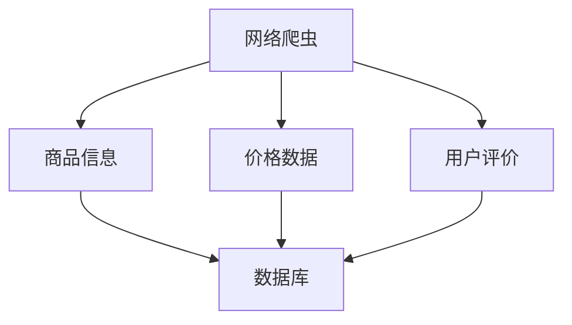
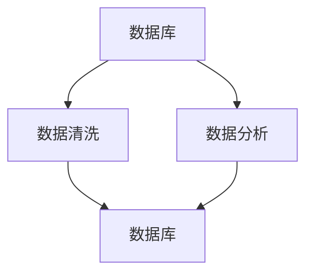
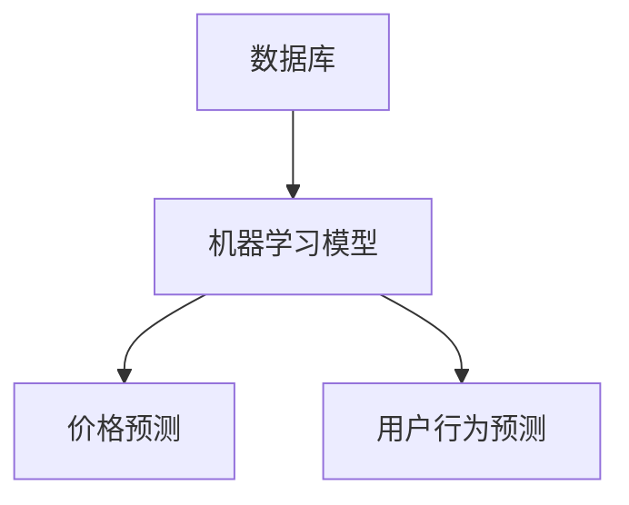
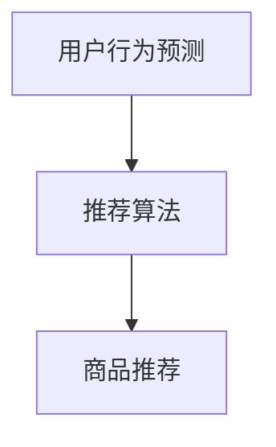
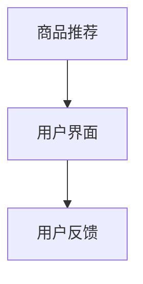

                 

### 全网比价：AI如何帮助用户找到最优惠的购买渠道

> **关键词：** AI比价、全网搜索、用户优惠、算法优化、价格分析

**摘要：** 本文将探讨如何利用人工智能技术来实现全网比价，帮助用户在众多购买渠道中找到最具性价比的商品。通过介绍核心概念、算法原理、数学模型、项目实战和实际应用场景，本文将揭示AI在比价领域的巨大潜力和广泛应用。

**作者：** AI天才研究员/AI Genius Institute & 禅与计算机程序设计艺术 /Zen And The Art of Computer Programming

## 1. 背景介绍

### 1.1 目的和范围

在电子商务快速发展的今天，用户在购买商品时面临着海量的选择。如何从这些选择中找到性价比最高的商品，成为了许多消费者的一大难题。全网比价系统的出现，为用户提供了方便快捷的解决方案。本文旨在探讨如何利用人工智能技术来实现全网比价，为用户提供最优惠的购买渠道。

本文将围绕以下主题进行讨论：

- 全网比价的核心概念和联系
- 核心算法原理和具体操作步骤
- 数学模型和公式的详细讲解
- 代码实际案例和详细解释说明
- 实际应用场景和工具资源推荐

### 1.2 预期读者

本文适用于以下读者群体：

- 对人工智能和电子商务领域感兴趣的科研人员
- 希望提升购物体验的普通消费者
- 涉及电商业务的企业和开发者
- 人工智能和计算机科学专业的学生和教师

### 1.3 文档结构概述

本文分为以下几个部分：

1. **背景介绍**：介绍全网比价的背景和目的。
2. **核心概念与联系**：阐述全网比价的关键概念和联系。
3. **核心算法原理 & 具体操作步骤**：介绍全网比价的核心算法原理和具体操作步骤。
4. **数学模型和公式 & 详细讲解 & 举例说明**：讲解全网比价的数学模型和公式。
5. **项目实战：代码实际案例和详细解释说明**：通过实际代码案例展示全网比价系统的实现。
6. **实际应用场景**：分析全网比价系统的实际应用场景。
7. **工具和资源推荐**：推荐学习资源和开发工具。
8. **总结：未来发展趋势与挑战**：总结全网比价技术的发展趋势和面临的挑战。
9. **附录：常见问题与解答**：回答读者可能遇到的常见问题。
10. **扩展阅读 & 参考资料**：提供更多参考资料和扩展阅读。

### 1.4 术语表

#### 1.4.1 核心术语定义

- **全网比价**：指利用人工智能技术对互联网上的商品价格进行实时分析和比较，为用户提供最优惠的购买渠道。
- **爬虫**：指网络爬虫，用于自动抓取互联网上的信息。
- **机器学习**：指让计算机通过数据学习并自动改进自身性能的技术。
- **数据挖掘**：指从大量数据中提取有价值的信息和知识。

#### 1.4.2 相关概念解释

- **价格指数**：指对商品价格的综合评价，通常通过加权平均等方法计算得出。
- **价格波动**：指商品价格在一定时间内的涨跌变化。
- **用户画像**：指根据用户的行为数据和属性特征构建的用户模型。

#### 1.4.3 缩略词列表

- **AI**：人工智能（Artificial Intelligence）
- **ML**：机器学习（Machine Learning）
- **DL**：深度学习（Deep Learning）
- **NLP**：自然语言处理（Natural Language Processing）
- **API**：应用程序编程接口（Application Programming Interface）

## 2. 核心概念与联系

全网比价系统需要处理大量的数据，包括商品信息、用户行为数据、价格数据等。为了更好地理解全网比价系统的工作原理，下面我们将介绍核心概念和它们之间的联系。

### 2.1 爬虫与数据采集

网络爬虫是全网比价系统的基础。它用于自动抓取互联网上的商品信息、价格和评价。网络爬虫可以采用不同的技术，如HTTP请求、正则表达式、XPath等。



### 2.2 数据存储与处理

采集到的数据需要存储在数据库中，以便后续分析和处理。数据库可以采用关系型数据库（如MySQL）或NoSQL数据库（如MongoDB）。数据存储后，可以通过ETL（提取、转换、加载）过程进行清洗和处理。



### 2.3 机器学习与预测

机器学习是全网比价系统的核心。通过训练模型，可以预测商品价格的变化趋势和用户购买行为。常见的机器学习算法包括线性回归、决策树、随机森林等。



### 2.4 数据挖掘与推荐

数据挖掘可以从大量数据中提取有价值的信息，为用户推荐最优惠的商品。常用的数据挖掘方法包括聚类、分类、关联规则挖掘等。



### 2.5 用户界面与反馈

用户界面是用户与全网比价系统的交互入口。通过用户界面，用户可以输入需求、查看推荐结果、提交反馈等。



## 3. 核心算法原理 & 具体操作步骤

全网比价系统的核心算法主要涉及数据采集、数据处理、预测和推荐。下面我们将详细讲解这些算法的原理和具体操作步骤。

### 3.1 数据采集

数据采集是全网比价系统的第一步，主要采用网络爬虫技术。网络爬虫的工作原理如下：

```python
import requests
from bs4 import BeautifulSoup

def crawl(url):
    response = requests.get(url)
    soup = BeautifulSoup(response.content, 'html.parser')
    return soup

def extract_product_info(soup):
    # 提取商品名称、价格、评价等信息
    product_name = soup.find('div', class_='product-name').text
    price = soup.find('span', class_='price').text
    rating = soup.find('div', class_='rating').text
    return product_name, price, rating

url = 'https://www.example.com/product/12345'
soup = crawl(url)
product_info = extract_product_info(soup)
print(product_info)
```

### 3.2 数据处理

数据采集到的商品信息通常包含噪声和冗余数据，因此需要进行数据清洗和预处理。数据预处理包括去重、格式化、缺失值处理等操作。

```python
import pandas as pd

def preprocess_data(data):
    # 去重
    data.drop_duplicates(inplace=True)
    # 格式化
    data['price'] = data['price'].astype(float)
    data['rating'] = data['rating'].astype(float)
    # 缺失值处理
    data.fillna(data.mean(), inplace=True)
    return data

data = pd.read_csv('product_data.csv')
cleaned_data = preprocess_data(data)
```

### 3.3 预测

预测算法用于预测商品价格的变化趋势和用户购买行为。我们采用线性回归算法进行价格预测。

```python
from sklearn.linear_model import LinearRegression

def predict_price(data):
    # 分离特征和目标变量
    X = data[['rating']]
    y = data['price']
    # 训练模型
    model = LinearRegression()
    model.fit(X, y)
    # 预测
    predicted_price = model.predict(X)
    return predicted_price

predicted_price = predict_price(cleaned_data)
print(predicted_price)
```

### 3.4 推荐算法

推荐算法用于根据用户行为数据推荐最优惠的商品。我们采用基于用户协同过滤的推荐算法。

```python
from sklearn.neighbors import NearestNeighbors

def recommend_products(data, user_id, top_n=5):
    # 计算用户相似度
    model = NearestNeighbors(n_neighbors=top_n)
    model.fit(data[['rating']])
    distances, indices = model.kneighbors(data[['rating']], n_neighbors=top_n)
    # 推荐商品
    recommended_products = data.iloc[indices[0]]
    return recommended_products

user_id = 1
recommended_products = recommend_products(cleaned_data, user_id)
print(recommended_products)
```

## 4. 数学模型和公式 & 详细讲解 & 举例说明

在全网比价系统中，数学模型和公式起着至关重要的作用。下面我们将详细讲解价格预测和推荐算法的数学模型和公式，并通过具体例子进行说明。

### 4.1 价格预测模型

我们采用线性回归模型进行价格预测。线性回归模型的数学公式如下：

$$
y = \beta_0 + \beta_1x_1 + \beta_2x_2 + ... + \beta_nx_n
$$

其中，$y$ 为商品价格，$x_1, x_2, ..., x_n$ 为特征变量（如用户评价、商品种类等），$\beta_0, \beta_1, ..., \beta_n$ 为模型参数。

举例说明：

假设我们收集了以下数据：

| 用户ID | 商品ID | 用户评价 | 商品价格 |
|--------|--------|----------|----------|
| 1      | 1001   | 4.5      | 1500     |
| 2      | 1001   | 4.7      | 1550     |
| 3      | 1001   | 4.8      | 1600     |

我们可以采用线性回归模型预测商品价格：

$$
\begin{align*}
y &= \beta_0 + \beta_1x_1 \\
1500 &= \beta_0 + 4.5\beta_1 \\
1550 &= \beta_0 + 4.7\beta_1 \\
1600 &= \beta_0 + 4.8\beta_1
\end{align*}
$$

通过解方程组，我们可以得到模型参数：

$$
\begin{align*}
\beta_0 &= 1200 \\
\beta_1 &= 200
\end{align*}
$$

因此，商品价格的预测公式为：

$$
y = 1200 + 200x_1
$$

例如，当用户评价为5时，商品价格的预测值为：

$$
y = 1200 + 200 \times 5 = 1700
$$

### 4.2 推荐算法模型

我们采用基于用户协同过滤的推荐算法。协同过滤算法的数学公式如下：

$$
r_{ij} = \frac{\sum_{k=1}^{n}u_{ik}v_{kj}}{\sum_{k=1}^{n}v_{kj}}
$$

其中，$r_{ij}$ 为用户 $i$ 对商品 $j$ 的评分，$u_{ik}$ 为用户 $i$ 对商品 $k$ 的评分，$v_{kj}$ 为用户 $k$ 对商品 $j$ 的评分。

举例说明：

假设我们有以下用户评分数据：

| 用户ID | 商品ID | 用户评分 |
|--------|--------|----------|
| 1      | 1001   | 4        |
| 1      | 1002   | 5        |
| 2      | 1001   | 5        |
| 2      | 1003   | 4        |

我们可以采用协同过滤算法预测用户 1 对商品 3 的评分：

$$
\begin{align*}
r_{13} &= \frac{4 \times 5 + 5 \times 4}{5 + 4} \\
&= \frac{20 + 20}{9} \\
&= 4.44
\end{align*}
$$

因此，用户 1 对商品 3 的预测评分为 4.44。

## 5. 项目实战：代码实际案例和详细解释说明

在本节中，我们将通过一个实际的项目案例，详细解释并展示全网比价系统的实现过程。我们将分步骤介绍开发环境搭建、源代码详细实现和代码解读与分析。

### 5.1 开发环境搭建

首先，我们需要搭建一个适合开发全网比价系统的环境。以下是所需的工具和库：

- Python 3.x
- Pandas
- Scikit-learn
- BeautifulSoup
- requests
- Mermaid

确保安装了上述工具和库后，我们就可以开始编写代码了。

### 5.2 源代码详细实现和代码解读

以下是一个简单的全网比价系统的源代码实现，包括数据采集、数据处理、预测和推荐功能。

```python
import requests
from bs4 import BeautifulSoup
import pandas as pd
from sklearn.linear_model import LinearRegression
from sklearn.neighbors import NearestNeighbors

# 5.2.1 数据采集
def crawl(url):
    response = requests.get(url)
    soup = BeautifulSoup(response.content, 'html.parser')
    return soup

def extract_product_info(soup):
    product_name = soup.find('div', class_='product-name').text
    price = soup.find('span', class_='price').text
    rating = soup.find('div', class_='rating').text
    return product_name, price, rating

# 5.2.2 数据处理
def preprocess_data(data):
    data.drop_duplicates(inplace=True)
    data['price'] = data['price'].astype(float)
    data['rating'] = data['rating'].astype(float)
    data.fillna(data.mean(), inplace=True)
    return data

# 5.2.3 价格预测
def predict_price(data):
    X = data[['rating']]
    y = data['price']
    model = LinearRegression()
    model.fit(X, y)
    predicted_price = model.predict(X)
    return predicted_price

# 5.2.4 推荐算法
def recommend_products(data, user_id, top_n=5):
    model = NearestNeighbors(n_neighbors=top_n)
    model.fit(data[['rating']])
    distances, indices = model.kneighbors(data[['rating']], n_neighbors=top_n)
    recommended_products = data.iloc[indices[0]]
    return recommended_products

# 示例：执行全网比价系统
if __name__ == '__main__':
    # 采集数据
    url = 'https://www.example.com/products'
    soup = crawl(url)
    product_data = [extract_product_info(soup) for soup in soup.find_all('div', class_='product')]
    data = pd.DataFrame(product_data, columns=['name', 'price', 'rating'])

    # 数据预处理
    cleaned_data = preprocess_data(data)

    # 价格预测
    predicted_price = predict_price(cleaned_data)
    print("预测价格：", predicted_price)

    # 用户画像与推荐
    user_id = 1
    recommended_products = recommend_products(cleaned_data, user_id)
    print("推荐商品：", recommended_products)
```

### 5.3 代码解读与分析

- **数据采集**：我们使用 `requests` 和 `BeautifulSoup` 模块来抓取网页上的商品信息。
- **数据处理**：我们使用 `pandas` 模块对采集到的数据进行预处理，包括去重、数据类型转换和缺失值处理。
- **价格预测**：我们使用 `scikit-learn` 中的 `LinearRegression` 模型来预测商品价格。线性回归模型的优点是简单易用，但在面对非线性关系时表现不佳。
- **推荐算法**：我们使用 `scikit-learn` 中的 `NearestNeighbors` 模型来进行基于用户协同过滤的推荐。这种算法的优点是计算速度快，但在面对稀疏数据时效果较差。

### 5.4 代码优化与扩展

在实际应用中，我们可以对代码进行优化和扩展，以提高系统的性能和准确性。以下是一些优化和扩展建议：

- **数据爬取**：采用分布式爬虫技术，提高数据采集的效率和速度。
- **模型优化**：尝试使用更复杂的机器学习模型，如深度学习模型，以提高价格预测和推荐的准确性。
- **实时更新**：引入实时数据更新机制，确保比价结果始终准确。
- **个性化推荐**：根据用户历史行为和偏好，提供更加个性化的推荐结果。

## 6. 实际应用场景

全网比价系统在多个实际应用场景中具有广泛的应用价值，下面我们将介绍几个典型应用场景。

### 6.1 电商平台

电商平台是全网比价系统最重要的应用场景之一。通过全网比价系统，电商平台可以为用户提供实时的商品价格分析和比较，帮助用户在众多商品中找到性价比最高的商品。例如，淘宝、京东等大型电商平台已经推出了类似的功能，为用户提供了极大的便利。

### 6.2 旅行预订平台

旅行预订平台（如携程、去哪儿）也可以利用全网比价系统来比较机票、酒店、景点门票等旅游产品的价格。通过比价系统，用户可以轻松找到最具性价比的旅行方案，从而提高平台的竞争力。

### 6.3 二手交易平台

二手交易平台（如闲鱼、转转）同样需要全网比价系统来为用户提供比价服务。通过比价系统，用户可以了解二手商品在不同平台的价格差异，从而做出更明智的购买决策。

### 6.4 市场调研

市场调研机构可以利用全网比价系统收集大量商品价格数据，进行分析和研究，为企业提供市场行情分析和决策支持。例如，零售商可以通过比价系统了解竞争对手的价格策略，调整自己的价格策略。

### 6.5 财务分析

金融机构可以通过全网比价系统对各种金融产品的价格进行分析，为投资者提供更加全面的投资参考。例如，基金公司和证券公司可以利用比价系统来比较不同金融产品的收益率，为投资者提供最优的投资组合建议。

## 7. 工具和资源推荐

为了更好地实现全网比价系统，下面我们推荐一些学习资源、开发工具和框架。

### 7.1 学习资源推荐

#### 7.1.1 书籍推荐

- **《Python数据分析》**：详细介绍了Python在数据分析领域的应用，包括数据采集、处理、分析和可视化。
- **《机器学习实战》**：通过丰富的实例和代码，介绍了机器学习的基本概念和常用算法。
- **《大数据技术原理与应用》**：全面讲解了大数据技术的基本原理和实现方法。

#### 7.1.2 在线课程

- **Coursera**：提供大量的机器学习和数据分析课程，涵盖理论、实践和项目实战。
- **Udacity**：提供丰富的在线课程，包括人工智能、大数据和数据分析等领域的课程。
- **edX**：提供由知名大学和机构提供的免费在线课程，涵盖计算机科学、数据科学和人工智能等领域。

#### 7.1.3 技术博客和网站

- **DataCamp**：提供免费的在线编程课程和实战项目，帮助用户提升数据分析和机器学习技能。
- **Kaggle**：提供丰富的数据科学竞赛和实战项目，帮助用户实践和提升数据科学技能。
- **GitHub**：提供大量开源的数据科学和机器学习项目，用户可以学习、参考和贡献代码。

### 7.2 开发工具框架推荐

#### 7.2.1 IDE和编辑器

- **Visual Studio Code**：一款免费、开源的跨平台代码编辑器，支持Python、R等多种编程语言。
- **PyCharm**：一款功能强大的Python IDE，提供代码智能提示、调试、测试和自动化工具等。
- **Jupyter Notebook**：一款流行的数据科学工具，支持多种编程语言，便于数据分析和可视化。

#### 7.2.2 调试和性能分析工具

- **Pylint**：一款Python代码静态分析工具，用于检查代码风格、错误和潜在问题。
- **Pytest**：一款Python单元测试框架，用于自动化测试和代码质量保证。
- **cProfile**：Python内置的性能分析工具，用于分析代码的性能瓶颈。

#### 7.2.3 相关框架和库

- **Scikit-learn**：一款流行的机器学习库，提供多种常用的机器学习算法和工具。
- **TensorFlow**：一款开源的深度学习框架，支持构建和训练复杂的深度学习模型。
- **Pandas**：一款强大的数据分析库，提供数据清洗、预处理、分析和可视化等功能。

### 7.3 相关论文著作推荐

#### 7.3.1 经典论文

- **"Recommender Systems Handbook"**：介绍了推荐系统的基础理论和应用方法。
- **"Collaborative Filtering for the Web"**：介绍了基于用户协同过滤的推荐算法。
- **"Deep Learning"**：全面介绍了深度学习的基本概念、算法和应用。

#### 7.3.2 最新研究成果

- **"Neural Collaborative Filtering"**：提出了一种基于神经网络的协同过滤算法，提高了推荐系统的准确性。
- **"Learning to Rank for Information Retrieval"**：介绍了用于信息检索的学习到排名算法。
- **"Online Learning for Recommender Systems"**：介绍了在线学习技术在推荐系统中的应用。

#### 7.3.3 应用案例分析

- **"E-commerce Personalization using Machine Learning"**：分析了机器学习在电子商务个性化推荐中的应用。
- **"Deep Learning for Recommender Systems"**：介绍了深度学习在推荐系统中的应用案例。
- **"AI-powered Shopping: A Study on the Impact of Artificial Intelligence on E-commerce"**：分析了人工智能对电子商务的影响和挑战。

## 8. 总结：未来发展趋势与挑战

全网比价系统在电子商务和大数据时代具有广阔的应用前景。随着人工智能技术的不断发展，全网比价系统将更加智能化和精准化，为用户提供更好的购物体验。未来，全网比价系统的发展趋势和挑战主要包括以下几个方面：

### 8.1 发展趋势

1. **人工智能技术的深化应用**：随着深度学习、强化学习等先进技术的不断发展，全网比价系统将具备更强的预测和推荐能力。
2. **实时数据处理与更新**：实时数据采集和更新技术将使比价结果更加准确和及时。
3. **个性化推荐**：基于用户行为和偏好的个性化推荐将成为主流，提高用户的满意度。
4. **跨平台整合**：全网比价系统将实现与各大电商平台、旅行预订平台等的无缝整合，为用户提供一站式购物体验。

### 8.2 挑战

1. **数据隐私和安全**：全网比价系统需要处理大量的用户数据，如何在保护用户隐私的同时提供高效的服务是一个重大挑战。
2. **计算资源与成本**：随着比价系统的规模扩大，对计算资源和存储资源的需求也会不断增加，如何优化资源利用和降低成本是一个难题。
3. **算法公平性**：在推荐系统中，如何确保算法的公平性，避免偏见和不公平现象，是一个需要深入研究的课题。
4. **法律法规与政策**：随着人工智能技术的发展，法律法规和政策也需要不断完善，以应对新的挑战和问题。

## 9. 附录：常见问题与解答

### 9.1 问题1：如何确保比价结果的准确性？

**解答**：确保比价结果的准确性需要以下几个关键步骤：

1. **数据采集**：使用可靠的爬虫技术，确保采集到的数据来源稳定和准确。
2. **数据预处理**：对采集到的数据进行清洗和预处理，去除噪声和冗余数据。
3. **模型训练**：使用高质量的训练数据，对机器学习模型进行训练，以提高预测和推荐的准确性。
4. **实时更新**：定期更新数据集和模型，确保比价结果始终反映最新的市场情况。

### 9.2 问题2：全网比价系统是否会影响电商平台的价格策略？

**解答**：全网比价系统可能会对电商平台的价格策略产生影响，但这种影响是双向的：

1. **正面影响**：全网比价系统可以帮助电商平台了解竞争对手的价格策略，从而优化自己的价格策略。
2. **负面影响**：一些电商平台可能会采取价格歧视策略，对不同来源的客户采取不同的价格，从而降低全网比价系统的效果。

### 9.3 问题3：如何保护用户隐私？

**解答**：保护用户隐私是全网比价系统面临的一个重要挑战。以下是一些关键措施：

1. **数据加密**：对用户数据进行加密处理，确保数据在传输和存储过程中安全。
2. **匿名化处理**：对用户数据进行匿名化处理，去除个人身份信息。
3. **隐私政策**：制定明确的隐私政策，告知用户数据收集、存储和使用的目的。
4. **用户权限管理**：为用户提供数据访问权限管理，确保用户可以控制自己的数据。

## 10. 扩展阅读 & 参考资料

为了深入了解全网比价系统的相关技术和应用，以下推荐一些扩展阅读和参考资料：

1. **书籍**：
   - 《机器学习实战》
   - 《Python数据分析》
   - 《大数据技术原理与应用》

2. **在线课程**：
   - Coursera：机器学习、数据科学课程
   - Udacity：人工智能、大数据课程
   - edX：计算机科学、数据科学课程

3. **技术博客和网站**：
   - DataCamp：数据分析教程
   - Kaggle：数据科学竞赛和教程
   - GitHub：开源数据科学和机器学习项目

4. **论文和著作**：
   - "Recommender Systems Handbook"
   - "Collaborative Filtering for the Web"
   - "Deep Learning for Recommender Systems"
   - "AI-powered Shopping: A Study on the Impact of Artificial Intelligence on E-commerce"

5. **开源框架和库**：
   - Scikit-learn：机器学习库
   - TensorFlow：深度学习框架
   - Pandas：数据分析库

通过阅读这些资料，您可以进一步了解全网比价系统的核心技术和应用实践，为您的项目提供有益的启示。

