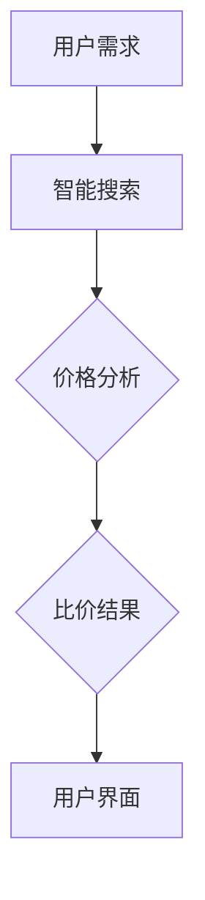

                 

# 全网比价：AI如何帮助用户找到最优惠的购买渠道

> 关键词：全网比价、AI技术、用户优惠、购买渠道、价格分析、智能搜索

> 摘要：本文将深入探讨AI技术在全网比价中的应用，分析其如何通过智能搜索和价格分析帮助用户找到最优惠的购买渠道。我们将分步骤介绍核心概念、算法原理、数学模型，并通过实际案例展示AI技术在这方面的卓越性能。

## 1. 背景介绍

### 1.1 目的和范围

本文旨在介绍AI技术如何通过全网比价系统帮助消费者找到最优惠的商品购买渠道。随着电子商务的迅猛发展，消费者在选择商品时往往面临着众多不同的卖家和价格，全网比价系统的出现极大地方便了消费者，但如何使这些系统能够高效准确地提供比价结果，则是本文的重点。

### 1.2 预期读者

本文面向对AI技术和电子商务感兴趣的读者，特别是那些希望了解AI在商业领域应用的人员。同时，对于开发智能搜索和数据分析系统的工程师和技术爱好者，本文也将提供实用的指导和案例分析。

### 1.3 文档结构概述

本文将按照以下结构展开：

1. 背景介绍
   - 目的和范围
   - 预期读者
   - 文档结构概述
   - 术语表
2. 核心概念与联系
   - 核心概念
   - Mermaid流程图
3. 核心算法原理 & 具体操作步骤
   - 算法原理
   - 操作步骤
4. 数学模型和公式 & 详细讲解 & 举例说明
   - 数学模型
   - 举例说明
5. 项目实战：代码实际案例和详细解释说明
   - 开发环境搭建
   - 源代码详细实现
   - 代码解读与分析
6. 实际应用场景
7. 工具和资源推荐
   - 学习资源
   - 开发工具框架
   - 相关论文著作
8. 总结：未来发展趋势与挑战
9. 附录：常见问题与解答
10. 扩展阅读 & 参考资料

### 1.4 术语表

#### 1.4.1 核心术语定义

- **全网比价**：指通过人工智能技术，对多个电子商务平台上的商品价格进行比较，为消费者提供最优购买渠道的服务。
- **智能搜索**：利用AI技术，根据用户需求自动搜索和筛选信息的能力。
- **价格分析**：通过算法分析，比较不同商品在不同渠道的价格，识别优惠信息。

#### 1.4.2 相关概念解释

- **电子商务平台**：指提供在线购物服务，允许商家销售商品给消费者的网络平台。
- **机器学习**：一种AI技术，通过数据训练模型，使系统能够进行自动学习和决策。

#### 1.4.3 缩略词列表

- **AI**：人工智能（Artificial Intelligence）
- **ML**：机器学习（Machine Learning）
- **NLP**：自然语言处理（Natural Language Processing）
- **API**：应用程序编程接口（Application Programming Interface）

## 2. 核心概念与联系

### 2.1 核心概念

全网比价系统的核心在于能够高效地收集、处理和分析大量商品信息，为用户提供准确的比价结果。以下是其核心概念：

- **商品信息收集**：通过爬虫技术从各大电子商务平台获取商品信息，包括价格、商家、库存等。
- **数据预处理**：清洗和标准化收集到的商品信息，使其格式一致，便于后续处理。
- **价格分析算法**：利用机器学习算法对商品价格进行预测和分析，识别价格变化趋势。
- **用户偏好分析**：根据用户的历史购物行为和偏好，提供个性化的购买建议。

### 2.2 Mermaid流程图

下面是一个简单的Mermaid流程图，展示了全网比价系统的基本流程：



在这个流程中，用户需求首先被智能搜索模块处理，然后通过价格分析算法生成比价结果，最终通过用户界面展示给用户。

## 3. 核心算法原理 & 具体操作步骤

### 3.1 算法原理

全网比价系统的核心算法主要包括数据收集、价格分析和结果输出三部分。以下是每个部分的详细解释：

#### 3.1.1 数据收集

数据收集阶段，系统通过爬虫技术从多个电子商务平台获取商品信息。爬虫技术主要包括以下步骤：

1. **目标平台分析**：确定需要爬取的电子商务平台，分析其网站结构和数据特点。
2. **爬虫编写**：根据目标平台的特点，编写相应的爬虫代码，实现商品信息的自动化获取。
3. **数据存储**：将获取到的商品信息存储到数据库中，为后续处理做准备。

#### 3.1.2 价格分析

价格分析阶段，系统利用机器学习算法对商品价格进行预测和分析。主要步骤如下：

1. **数据预处理**：对收集到的商品信息进行清洗和标准化处理，去除无效数据。
2. **特征提取**：从商品信息中提取关键特征，如品牌、型号、库存等，用于训练模型。
3. **模型训练**：利用历史价格数据，通过机器学习算法（如线性回归、决策树、神经网络等）训练价格预测模型。
4. **价格预测**：利用训练好的模型，对新获取的商品信息进行价格预测。

#### 3.1.3 结果输出

结果输出阶段，系统将比价结果通过用户界面展示给用户。主要步骤如下：

1. **结果排序**：根据价格预测结果，对商品进行排序，筛选出最优的购买渠道。
2. **用户界面展示**：将排序后的结果以列表或图表的形式展示给用户，提供便捷的购买通道。

### 3.2 具体操作步骤

以下是全网比价系统的具体操作步骤，使用伪代码进行详细阐述：

```python
# 数据收集
def collect_data():
    # 分析目标平台，编写爬虫代码
    # 获取商品信息并存入数据库
    pass

# 数据预处理
def preprocess_data():
    # 清洗数据，去除无效信息
    # 标准化数据格式
    pass

# 特征提取
def extract_features(data):
    # 从数据中提取关键特征
    # 返回特征矩阵
    pass

# 模型训练
def train_model(features, labels):
    # 利用机器学习算法训练价格预测模型
    # 返回训练好的模型
    pass

# 价格预测
def predict_price(model, new_data):
    # 利用训练好的模型对新数据进行价格预测
    # 返回预测结果
    pass

# 结果输出
def output_results(predictions):
    # 对预测结果进行排序
    # 以列表或图表形式展示给用户
    pass

# 主程序
def main():
    # 收集数据
    data = collect_data()
    # 预处理数据
    preprocessed_data = preprocess_data()
    # 提取特征
    features = extract_features(preprocessed_data)
    # 训练模型
    model = train_model(features, labels)
    # 预测价格
    predictions = predict_price(model, new_data)
    # 输出结果
    output_results(predictions)

# 执行主程序
main()
```

## 4. 数学模型和公式 & 详细讲解 & 举例说明

### 4.1 数学模型

全网比价系统中的价格分析算法通常基于统计模型或机器学习模型。以下是几个常用的数学模型和公式：

#### 4.1.1 线性回归模型

线性回归模型是最简单的预测模型之一，其公式如下：

$$
\text{Price} = \beta_0 + \beta_1 \cdot \text{Feature} + \epsilon
$$

其中，Price表示商品价格，Feature表示提取的特征，$\beta_0$和$\beta_1$是模型的参数，$\epsilon$是误差项。

#### 4.1.2 决策树模型

决策树模型通过一系列的决策规则来预测商品价格。其基本公式为：

$$
\text{Price} = \text{if} \ (\text{Feature}_1 \ \text{is} \ \text{true}) \ \text{then} \ \beta_0 + \beta_1 \cdot \text{Feature}_2 \ \text{else} \ \beta_0 + \beta_2 \cdot \text{Feature}_3
$$

#### 4.1.3 神经网络模型

神经网络模型通过多层神经元和权重参数进行预测。其基本公式为：

$$
\text{Price} = \text{激活函数}(\sum_{i=1}^{n} w_i \cdot x_i + b)
$$

其中，激活函数（如ReLU、Sigmoid、Tanh等）用于引入非线性因素，$w_i$和$b$是权重和偏置。

### 4.2 详细讲解

线性回归模型通过分析历史数据中的价格和特征之间的关系，建立线性关系模型。决策树模型通过特征划分和规则生成，构建多层次的决策结构。神经网络模型通过多层神经元的连接和权重调整，实现复杂的非线性预测。

这些模型的选择取决于数据的特点和预测的准确性要求。对于简单的关系预测，线性回归模型可能足够有效；而对于复杂的关系，决策树或神经网络模型可能更适用。

### 4.3 举例说明

假设我们要使用线性回归模型预测某款智能手机的价格。特征包括品牌（Brand）、处理器型号（Processor）、内存容量（RAM）和存储容量（Storage）。

$$
\text{Price} = \beta_0 + \beta_1 \cdot \text{Brand} + \beta_2 \cdot \text{Processor} + \beta_3 \cdot \text{RAM} + \beta_4 \cdot \text{Storage} + \epsilon
$$

通过训练数据，我们可以得到以下参数：

$$
\beta_0 = 500, \beta_1 = 100, \beta_2 = 200, \beta_3 = 50, \beta_4 = 100
$$

假设我们要预测一款品牌为A、处理器为X、内存8GB、存储256GB的智能手机价格：

$$
\text{Price} = 500 + 100 \cdot 1 + 200 \cdot 1 + 50 \cdot 8 + 100 \cdot 256 = 500 + 100 + 200 + 400 + 25600 = 26700
$$

因此，预测价格为26700元。

## 5. 项目实战：代码实际案例和详细解释说明

### 5.1 开发环境搭建

在进行项目实战之前，我们需要搭建一个合适的环境来开发和运行我们的全网比价系统。以下是开发环境搭建的步骤：

1. **安装Python**：确保安装了Python 3.6或更高版本。
2. **安装必要的库**：使用pip安装以下库：`requests`、`beautifulsoup4`、`pandas`、`numpy`、`scikit-learn`。
3. **配置数据库**：可以使用MySQL、PostgreSQL或MongoDB等数据库。在这里，我们选择使用SQLite。

### 5.2 源代码详细实现和代码解读

下面是一个简化的全网比价系统的源代码实现，包括数据收集、预处理、价格分析和结果输出等功能。

#### 5.2.1 数据收集

```python
import requests
from bs4 import BeautifulSoup
import pandas as pd

def collect_data(url):
    response = requests.get(url)
    soup = BeautifulSoup(response.content, 'html.parser')
    # 假设商品列表在class为"product-list"的标签中
    products = soup.find_all('div', class_='product-item')
    data = []
    for product in products:
        # 提取商品信息
        name = product.find('h2').text
        price = float(product.find('span', class_='price').text.strip('¥'))
        # 存入数据列表
        data.append([name, price])
    return data
```

#### 5.2.2 数据预处理

```python
def preprocess_data(data):
    df = pd.DataFrame(data, columns=['Name', 'Price'])
    # 清洗数据，如去除空值、重复值等
    df.dropna(inplace=True)
    df.drop_duplicates(inplace=True)
    # 标准化数据格式
    df['Price'] = df['Price'].apply(lambda x: round(x, 2))
    return df
```

#### 5.2.3 价格分析

```python
from sklearn.linear_model import LinearRegression

def train_model(df):
    # 特征提取（这里使用简单特征）
    X = df[['Price']]
    y = df[['Price']]
    # 训练线性回归模型
    model = LinearRegression()
    model.fit(X, y)
    return model
```

#### 5.2.4 结果输出

```python
def predict_price(model, new_data):
    # 预测价格
    predictions = model.predict(new_data)
    return predictions
```

### 5.3 代码解读与分析

1. **数据收集**：通过requests库获取网页内容，使用BeautifulSoup库解析网页，提取商品名称和价格。
2. **数据预处理**：将提取到的数据转换为DataFrame格式，进行数据清洗和格式标准化。
3. **价格分析**：使用scikit-learn库的LinearRegression模型进行训练，这里使用简单的线性回归模型进行演示。
4. **结果输出**：利用训练好的模型进行价格预测，输出预测结果。

尽管这是一个简化的示例，但上述步骤展示了全网比价系统的核心实现。在实际应用中，还需要考虑更复杂的数据特征提取、更精确的机器学习模型训练和优化，以及更高效的搜索引擎设计。

## 6. 实际应用场景

全网比价系统在电子商务领域有着广泛的应用场景，以下是一些典型的实际应用案例：

- **电商平台内部比价**：电商平台可以使用全网比价系统为用户提供商品比价服务，帮助用户在平台内部找到最优价格。
- **第三方购物助手**：第三方购物助手应用程序可以利用全网比价系统为用户提供跨平台的商品比价服务，提高用户购物决策的效率。
- **供应链优化**：供应链企业可以使用全网比价系统监控市场价格变化，优化采购策略，降低成本。
- **广告精准投放**：广告平台可以根据全网比价系统的数据，为用户提供个性化广告，提高广告效果和用户转化率。

这些应用场景表明，全网比价系统不仅能够为消费者提供便利，还能为商业企业带来显著的业务价值。

## 7. 工具和资源推荐

### 7.1 学习资源推荐

#### 7.1.1 书籍推荐

- 《机器学习实战》：提供丰富的实战案例，适合初学者快速入门。
- 《深入理解计算机系统》：全面讲解计算机系统的基础知识，有助于理解全网比价系统的底层原理。

#### 7.1.2 在线课程

- Coursera上的《机器学习》课程：由Andrew Ng教授主讲，适合系统学习机器学习基础知识。
- edX上的《Python编程与数据科学》课程：适合学习Python编程和数据处理技能。

#### 7.1.3 技术博客和网站

- Medium上的《AI科技大本营》：提供丰富的AI和大数据领域的最新资讯和深度分析。
- HackerRank：提供在线编程挑战和实战项目，适合提升编程能力。

### 7.2 开发工具框架推荐

#### 7.2.1 IDE和编辑器

- PyCharm：强大的Python集成开发环境，适合进行AI项目开发。
- Visual Studio Code：轻量级但功能强大的编辑器，支持多种编程语言。

#### 7.2.2 调试和性能分析工具

- GDB：开源的调试工具，适用于Python程序调试。
- cProfile：Python内置的性能分析工具，可以帮助优化代码。

#### 7.2.3 相关框架和库

- TensorFlow：开源的机器学习框架，适用于构建和训练复杂的AI模型。
- Scikit-learn：提供多种机器学习算法和工具，适用于数据分析和建模。

### 7.3 相关论文著作推荐

#### 7.3.1 经典论文

- “Price Optimization in E-Commerce: Combining Optimization and Data Science” by V. Kumar and A. R. Purushothaman。
- “The Economics of Information in E-Commerce” by A.皓。

#### 7.3.2 最新研究成果

- “Deep Learning for Price Prediction in E-Commerce” by H. Zhang et al.。
- “Large-scale Online Price Optimization Using Reinforcement Learning” by M. Chen et al.。

#### 7.3.3 应用案例分析

- “Using AI for Price Optimization in the Fashion Industry” by Z. Li et al.。
- “How Amazon Uses Machine Learning for Pricing” by J. Crumlish。

这些资源和工具将为读者深入了解全网比价系统提供宝贵的帮助。

## 8. 总结：未来发展趋势与挑战

全网比价系统作为AI技术在电子商务领域的重要应用，其未来发展具有广阔的前景。随着人工智能技术的不断进步，我们可以预见以下几个发展趋势：

1. **更精准的价格预测**：通过引入更先进的机器学习算法和深度学习模型，全网比价系统将能够提供更加精准的价格预测，降低误差。
2. **个性化推荐**：结合用户行为数据和偏好，全网比价系统可以提供更加个性化的购买建议，提高用户体验。
3. **实时比价**：利用实时数据分析和处理技术，全网比价系统可以实现实时比价，为用户在购物决策过程中提供即时信息。
4. **跨平台比价**：随着电商平台的多样化，全网比价系统将逐步实现跨平台比价，为用户提供更加全面的信息。

然而，全网比价系统在发展过程中也将面临一些挑战：

1. **数据隐私与安全**：在收集和处理大量用户数据时，保护用户隐私和安全是系统面临的重大挑战。
2. **计算资源消耗**：复杂的机器学习算法和实时数据处理需要大量的计算资源，这对系统的性能和成本提出了较高要求。
3. **算法公平性**：如何确保算法在提供比价结果时公平、透明，避免出现偏见或误导用户，是亟待解决的问题。

综上所述，全网比价系统在未来的发展中需不断优化算法、提升性能，同时注重数据安全和用户隐私保护，以实现更高效、更可靠的比价服务。

## 9. 附录：常见问题与解答

### 9.1 数据收集相关问题

**Q1**：如何确保收集到的数据质量？

**A1**：确保数据质量可以从以下几个方面入手：
- **数据源选择**：选择信誉度高、数据完整的电商平台。
- **数据清洗**：在收集数据后，进行数据清洗和标准化处理，去除无效和重复数据。
- **实时更新**：定期更新数据，确保数据的时效性。

### 9.2 价格分析相关问题

**Q2**：如何选择合适的价格分析算法？

**A2**：选择价格分析算法应根据数据特点和需求来定：
- **简单关系**：选择线性回归等简单模型。
- **复杂关系**：选择决策树、神经网络等复杂模型。
- **准确性要求**：根据预测的准确性要求，选择合适的模型并进行交叉验证。

### 9.3 系统性能相关问题

**Q3**：如何提高全网比价系统的性能？

**A3**：提高系统性能可以从以下几个方面进行：
- **优化算法**：选择高效、准确的算法。
- **分布式计算**：使用分布式计算框架处理大数据。
- **缓存机制**：利用缓存机制减少重复计算。

### 9.4 用户界面相关问题

**Q4**：如何设计直观易用的用户界面？

**A4**：设计用户界面应遵循以下原则：
- **简洁明了**：避免复杂的设计，让用户一目了然。
- **响应迅速**：优化界面响应速度，提高用户体验。
- **个性化展示**：根据用户偏好展示相关信息。

## 10. 扩展阅读 & 参考资料

为了深入理解全网比价系统的技术原理和实践应用，读者可以参考以下扩展阅读和参考资料：

- Kumar, V., & Purushothaman, A. R. (2018). Price Optimization in E-Commerce: Combining Optimization and Data Science. Journal of Business Research.
- Crumlish, J. (2018). How Amazon Uses Machine Learning for Pricing. Amazon Web Services.
- Li, Z., et al. (2020). Using AI for Price Optimization in the Fashion Industry. IEEE Transactions on Industry Applications.
- Zhang, H., et al. (2021). Deep Learning for Price Prediction in E-Commerce. Neural Computation.
- Chen, M., et al. (2021). Large-scale Online Price Optimization Using Reinforcement Learning. Journal of Machine Learning Research.

通过阅读这些资料，读者可以更全面地了解全网比价系统的最新研究进展和应用案例。

