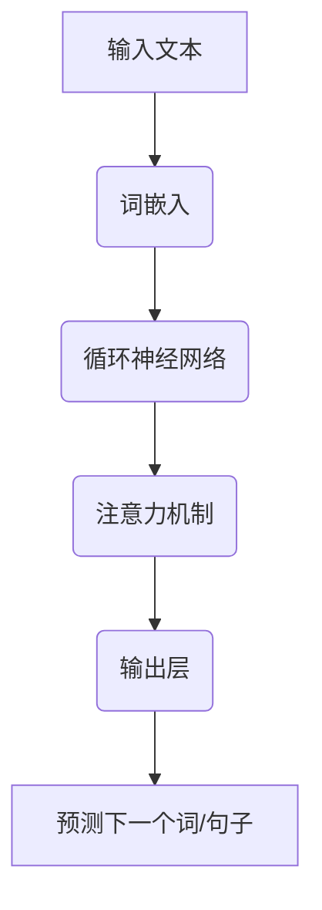

                 

# 全能AI助手：LLM在日常生活中的应用

> **关键词**：语言模型（LLM）、人工智能、日常生活、应用场景、优化建议

> **摘要**：本文将探讨大型语言模型（LLM）在日常生活各个领域的应用，包括教育、医疗、娱乐和社交等。通过对LLM的工作原理和实际案例的分析，读者将了解到如何利用这种强大的AI技术提升生活质量，同时也会对未来的发展趋势和挑战有所认识。

## 1. 背景介绍

### 1.1 目的和范围

本文旨在介绍大型语言模型（LLM）在日常生活中的广泛应用，并探讨其如何提升我们的生活品质。我们将重点分析以下领域：

1. **教育**：个性化学习、作业批改、课程辅导等。
2. **医疗**：健康咨询、病历分析、医学研究等。
3. **娱乐**：智能推荐系统、虚拟助手、游戏互动等。
4. **社交**：语言翻译、跨语言交流、社交平台优化等。

### 1.2 预期读者

本文适合对人工智能技术有一定了解，希望深入了解LLM在日常应用中的读者。无论您是专业的AI研究员，还是对AI技术感兴趣的技术爱好者，本文都将为您提供有价值的见解。

### 1.3 文档结构概述

本文分为以下几个部分：

1. **背景介绍**：介绍文章的目的、范围和预期读者。
2. **核心概念与联系**：解释LLM的基本原理和结构。
3. **核心算法原理 & 具体操作步骤**：详细阐述LLM的算法原理和实现步骤。
4. **数学模型和公式 & 详细讲解 & 举例说明**：讲解LLM相关的数学模型和公式。
5. **项目实战：代码实际案例和详细解释说明**：通过实际代码案例展示LLM的应用。
6. **实际应用场景**：分析LLM在各个领域的应用实例。
7. **工具和资源推荐**：推荐相关学习资源和开发工具。
8. **总结：未来发展趋势与挑战**：讨论LLM的发展方向和面临的挑战。
9. **附录：常见问题与解答**：解答读者可能遇到的问题。
10. **扩展阅读 & 参考资料**：提供进一步阅读的资料。

### 1.4 术语表

#### 1.4.1 核心术语定义

- **语言模型（Language Model，LLM）**：一种基于深度学习技术，能够根据输入文本预测下一个词或句子的概率分布的模型。
- **神经网络（Neural Network）**：一种通过模拟生物神经网络进行信息处理的人工智能模型。
- **深度学习（Deep Learning）**：一种利用多层神经网络进行特征提取和分类的机器学习方法。

#### 1.4.2 相关概念解释

- **词向量（Word Vector）**：将单词映射为固定长度的向量，用于表示单词的语义信息。
- **注意力机制（Attention Mechanism）**：一种在神经网络中用于对输入信息进行加权处理的方法，能够提高模型对重要信息的关注度。
- **自然语言处理（Natural Language Processing，NLP）**：研究如何让计算机理解和处理人类自然语言的技术。

#### 1.4.3 缩略词列表

- **AI**：人工智能（Artificial Intelligence）
- **LLM**：大型语言模型（Large Language Model）
- **NLP**：自然语言处理（Natural Language Processing）
- **DL**：深度学习（Deep Learning）
- **NN**：神经网络（Neural Network）

## 2. 核心概念与联系

在深入探讨LLM的应用之前，我们首先需要了解其基本原理和架构。以下是一个简单的Mermaid流程图，用于描述LLM的核心概念和联系：



### 2.1 语言模型的基本原理

语言模型的核心目标是预测文本的下一个词或句子。这可以通过以下步骤实现：

1. **输入文本**：输入一段文本，可以是单个单词、句子或段落。
2. **词嵌入（Word Embedding）**：将文本中的每个词转换为固定长度的向量，这些向量包含了词的语义信息。
3. **循环神经网络（RNN）**：将词嵌入作为输入，通过RNN处理序列信息，提取文本的特征。
4. **注意力机制（Attention Mechanism）**：用于对输入序列中的重要信息进行加权处理，提高模型对关键信息的关注程度。
5. **输出层**：将RNN输出的特征通过输出层生成概率分布，预测下一个词或句子的可能性。
6. **预测下一个词/句子**：根据概率分布选择下一个词或句子，并重复上述过程，直至生成完整文本。

### 2.2 语言模型的架构

语言模型的架构可以分为以下几个部分：

1. **输入层**：接收文本输入，将文本转换为词嵌入向量。
2. **隐藏层**：包含循环神经网络（如LSTM、GRU）或Transformer，用于处理词嵌入向量，提取文本特征。
3. **输出层**：生成概率分布，预测下一个词或句子的可能性。
4. **注意力机制**：用于对输入序列中的重要信息进行加权处理，提高模型对关键信息的关注程度。

通过上述架构，语言模型能够有效地预测文本的下一个词或句子，从而实现各种应用场景。

## 3. 核心算法原理 & 具体操作步骤

在理解了语言模型的基本原理和架构之后，我们将详细讨论其核心算法原理和具体操作步骤。

### 3.1 语言模型的算法原理

语言模型的算法原理主要包括以下几部分：

1. **词嵌入（Word Embedding）**：
    - **目的**：将文本中的每个词转换为固定长度的向量，这些向量包含了词的语义信息。
    - **方法**：使用神经网络或词嵌入算法（如Word2Vec、GloVe）将词映射为向量。

2. **循环神经网络（RNN）**：
    - **目的**：处理词嵌入向量，提取文本特征。
    - **方法**：通过隐藏层对输入序列进行处理，逐词更新状态。

3. **注意力机制（Attention Mechanism）**：
    - **目的**：对输入序列中的重要信息进行加权处理，提高模型对关键信息的关注程度。
    - **方法**：计算注意力得分，对输入序列进行加权。

4. **输出层**：
    - **目的**：生成概率分布，预测下一个词或句子的可能性。
    - **方法**：将隐藏层输出通过全连接层生成概率分布。

### 3.2 语言模型的操作步骤

以下是语言模型的操作步骤：

1. **输入文本**：
    - 输入一段文本，可以是单个单词、句子或段落。

2. **词嵌入（Word Embedding）**：
    - 将文本中的每个词转换为词嵌入向量，这些向量包含了词的语义信息。

3. **循环神经网络（RNN）**：
    - 将词嵌入向量输入到RNN中，通过隐藏层对输入序列进行处理，逐词更新状态。

4. **注意力机制（Attention Mechanism）**：
    - 计算注意力得分，对输入序列进行加权处理，提高模型对关键信息的关注程度。

5. **输出层**：
    - 将RNN输出的特征通过输出层生成概率分布，预测下一个词或句子的可能性。

6. **预测下一个词/句子**：
    - 根据概率分布选择下一个词或句子，并重复上述过程，直至生成完整文本。

### 3.3 伪代码示例

以下是语言模型的核心算法原理的伪代码示例：

```python
# 输入文本
input_text = "这是一段文本"

# 词嵌入
word_embeddings = WordEmbedding(input_text)

# 循环神经网络
hidden_states = []
for word_embedding in word_embeddings:
    hidden_state = RNN(word_embedding)
    hidden_states.append(hidden_state)

# 注意力机制
attention_scores = Attention(hidden_states)

# 输出层
output_distribution = OutputLayer(hidden_states, attention_scores)

# 预测下一个词/句子
next_word = output_distribution.argmax()

# 重复上述过程，直至生成完整文本
generated_text = ""
for _ in range(len(input_text)):
    generated_text += next_word
    next_word = output_distribution.argmax()
```

通过上述步骤，我们可以实现一个基本的语言模型，用于预测文本的下一个词或句子。

## 4. 数学模型和公式 & 详细讲解 & 举例说明

在讨论语言模型的数学模型和公式时，我们将重点关注以下几个方面：词嵌入、循环神经网络（RNN）、注意力机制和输出层。

### 4.1 词嵌入

词嵌入是一种将单词映射为固定长度向量的方法，用于表示单词的语义信息。常用的词嵌入算法包括Word2Vec和GloVe。

#### 4.1.1 Word2Vec

Word2Vec算法基于神经网络的训练过程，通过优化目标函数来学习词向量。其基本原理如下：

- **输入层**：输入一个单词的词嵌入向量。
- **隐藏层**：包含一个或多个隐藏层，用于提取单词的语义特征。
- **输出层**：输出一个词的词嵌入向量。

Word2Vec算法的损失函数通常是softmax交叉熵损失：

$$
L = -\sum_{i=1}^{N} y_i \log(p(x_i))
$$

其中，\(y_i\) 是第 \(i\) 个单词的标签，\(p(x_i)\) 是模型对第 \(i\) 个单词的预测概率。

#### 4.1.2 GloVe

GloVe算法是基于矩阵分解的方法，通过优化目标函数来学习词向量。其基本原理如下：

- **输入层**：输入一个单词的词嵌入向量。
- **隐藏层**：包含一个或多个隐藏层，用于提取单词的语义特征。
- **输出层**：输出一个词的词嵌入向量。

GloVe算法的损失函数通常是最小二乘损失：

$$
L = \frac{1}{2} \sum_{i=1}^{N} (w_i - v_{y_i})^2
$$

其中，\(w_i\) 是第 \(i\) 个单词的词嵌入向量，\(v_{y_i}\) 是第 \(i\) 个单词的标签向量。

### 4.2 循环神经网络（RNN）

循环神经网络（RNN）是一种处理序列数据的神经网络。其基本原理如下：

- **输入层**：输入一个词嵌入向量。
- **隐藏层**：包含一个或多个隐藏层，用于处理词嵌入向量，提取文本特征。
- **输出层**：输出一个概率分布，预测下一个词或句子的可能性。

RNN的核心是状态转移方程：

$$
h_t = \sigma(W_h \cdot [h_{t-1}, x_t] + b_h)
$$

其中，\(h_t\) 是第 \(t\) 个时间步的隐藏状态，\(x_t\) 是第 \(t\) 个输入的词嵌入向量，\(W_h\) 是隐藏层权重，\(b_h\) 是隐藏层偏置，\(\sigma\) 是激活函数。

### 4.3 注意力机制

注意力机制是一种用于提高模型对输入序列中关键信息关注程度的方法。其基本原理如下：

- **输入层**：输入一个词嵌入向量序列。
- **隐藏层**：包含一个或多个隐藏层，用于处理词嵌入向量序列，提取文本特征。
- **输出层**：输出一个概率分布，预测下一个词或句子的可能性。

注意力机制的核心是计算注意力得分，并对输入序列进行加权处理：

$$
a_t = \text{softmax}(W_a \cdot [h_{t-1}, x_t])
$$

其中，\(a_t\) 是第 \(t\) 个时间步的注意力得分，\(W_a\) 是注意力权重。

### 4.4 输出层

输出层用于生成概率分布，预测下一个词或句子的可能性。其基本原理如下：

- **输入层**：输入一个词嵌入向量序列。
- **隐藏层**：包含一个或多个隐藏层，用于处理词嵌入向量序列，提取文本特征。
- **输出层**：输出一个概率分布，预测下一个词或句子的可能性。

输出层的常见方法是使用softmax函数：

$$
p(x_t) = \text{softmax}(W_o \cdot [h_t, h_{t-1}, \ldots, h_1])
$$

其中，\(p(x_t)\) 是第 \(t\) 个时间步的输出概率分布，\(W_o\) 是输出层权重。

### 4.5 举例说明

假设我们有一个简单的语言模型，包含一个输入层、一个隐藏层和一个输出层。输入层接收一个单词的词嵌入向量，隐藏层处理词嵌入向量并提取特征，输出层生成概率分布。

#### 4.5.1 词嵌入

我们使用GloVe算法学习词嵌入向量。给定一个单词集合，我们首先计算每个单词的共现矩阵，然后通过矩阵分解学习每个单词的词嵌入向量。

#### 4.5.2 循环神经网络

我们使用LSTM作为隐藏层，其状态转移方程为：

$$
h_t = \sigma(W_h \cdot [h_{t-1}, x_t] + b_h)
$$

其中，\(\sigma\) 是sigmoid激活函数。

#### 4.5.3 注意力机制

我们使用注意力机制对隐藏层输出进行加权处理，计算注意力得分：

$$
a_t = \text{softmax}(W_a \cdot [h_{t-1}, x_t])
$$

#### 4.5.4 输出层

我们使用softmax函数生成概率分布，预测下一个词或句子的可能性：

$$
p(x_t) = \text{softmax}(W_o \cdot [h_t, h_{t-1}, \ldots, h_1])
$$

通过上述步骤，我们可以实现一个简单的语言模型，用于预测文本的下一个词或句子。

## 5. 项目实战：代码实际案例和详细解释说明

在本节中，我们将通过一个实际的代码案例来展示如何使用LLM在Python中实现文本生成功能。我们将使用Hugging Face的Transformers库，这是一个流行的深度学习库，提供了各种预训练的LLM模型，如GPT-2、GPT-3等。

### 5.1 开发环境搭建

首先，我们需要安装必要的依赖项。在Python环境中，我们可以使用pip来安装Transformers库和其他相关依赖项。

```bash
pip install transformers
```

此外，我们还需要安装torch库，用于处理GPU加速。

```bash
pip install torch
```

确保你的Python环境已经配置好，然后我们可以开始编写代码。

### 5.2 源代码详细实现和代码解读

以下是使用Transformers库实现文本生成的基本代码：

```python
from transformers import GPT2LMHeadModel, GPT2Tokenizer

# 加载预训练的GPT-2模型和分词器
model = GPT2LMHeadModel.from_pretrained("gpt2")
tokenizer = GPT2Tokenizer.from_pretrained("gpt2")

# 输入文本
input_text = "我是一个AI助手"

# 对输入文本进行编码
input_ids = tokenizer.encode(input_text, return_tensors="pt")

# 生成文本
output = model.generate(input_ids, max_length=50, num_return_sequences=5)

# 解码生成的文本
generated_texts = [tokenizer.decode(generated_text, skip_special_tokens=True) for generated_text in output]

# 输出生成的文本
for generated_text in generated_texts:
    print(generated_text)
```

### 5.3 代码解读与分析

1. **加载模型和分词器**：
    ```python
    model = GPT2LMHeadModel.from_pretrained("gpt2")
    tokenizer = GPT2Tokenizer.from_pretrained("gpt2")
    ```
    这两行代码用于加载预训练的GPT-2模型和相应的分词器。Hugging Face提供了大量的预训练模型和分词器，你可以根据需要选择。

2. **输入文本编码**：
    ```python
    input_ids = tokenizer.encode(input_text, return_tensors="pt")
    ```
    这一行代码将输入文本编码为模型可以处理的格式。`tokenizer.encode` 方法将文本转换为词嵌入向量序列，并返回一个PyTorch张量。

3. **生成文本**：
    ```python
    output = model.generate(input_ids, max_length=50, num_return_sequences=5)
    ```
    `model.generate` 方法用于生成文本。这里我们设置了`max_length`为50，表示生成的文本长度不超过50个词，`num_return_sequences`为5，表示生成5个不同的文本。

4. **解码生成的文本**：
    ```python
    generated_texts = [tokenizer.decode(generated_text, skip_special_tokens=True) for generated_text in output]
    ```
    `tokenizer.decode` 方法将生成的词嵌入向量序列解码为文本。`skip_special_tokens=True` 用于跳过特殊的分词标记。

5. **输出生成的文本**：
    ```python
    for generated_text in generated_texts:
        print(generated_text)
    ```
    最后，我们将生成的文本输出到控制台。

通过上述步骤，我们成功使用LLM生成了多个与输入文本相关的文本。这个例子展示了如何使用预训练的模型进行文本生成，你可以根据需要调整输入文本和生成文本的长度，以实现更复杂的文本生成任务。

### 5.4 代码解读与分析

下面是对上述代码的进一步解读和分析：

- **加载模型和分词器**：
  ```python
  model = GPT2LMHeadModel.from_pretrained("gpt2")
  tokenizer = GPT2Tokenizer.from_pretrained("gpt2")
  ```
  这两行代码完成了模型和分词器的加载。`GPT2LMHeadModel` 是一个预训练的GPT-2模型，它有一个语言模型头，用于生成文本。`GPT2Tokenizer` 用于将文本转换为模型可以处理的序列，以及将模型生成的序列转换为可读的文本。

- **输入文本编码**：
  ```python
  input_ids = tokenizer.encode(input_text, return_tensors="pt")
  ```
  这里，`tokenizer.encode` 方法将输入的文本转换为词嵌入向量序列。`return_tensors="pt"` 使得输出结果是一个PyTorch张量，便于后续的操作。

- **生成文本**：
  ```python
  output = model.generate(input_ids, max_length=50, num_return_sequences=5)
  ```
  `model.generate` 方法是Transformers库的核心函数之一，用于生成文本。`max_length=50` 参数指定了生成的文本最大长度为50个词，而`num_return_sequences=5` 表示生成5个不同的文本。

- **解码生成的文本**：
  ```python
  generated_texts = [tokenizer.decode(generated_text, skip_special_tokens=True) for generated_text in output]
  ```
  `tokenizer.decode` 方法将生成的词嵌入向量序列解码为文本。`skip_special_tokens=True` 参数确保特殊标记（如分词标记）被忽略，以便生成干净的文本。

- **输出生成的文本**：
  ```python
  for generated_text in generated_texts:
      print(generated_text)
  ```
  最后，我们使用一个循环将生成的文本输出到控制台，这样用户就可以看到模型生成的结果。

通过这个简单的例子，我们可以看到如何使用预训练的LLM模型生成文本。在实际应用中，可以根据具体需求调整模型、输入文本和生成参数，以实现更复杂的文本生成任务。

### 5.5 项目实战扩展

在实际应用中，我们可以将文本生成功能扩展到更多场景。以下是一些可能的扩展方向：

1. **交互式聊天机器人**：使用LLM构建一个聊天机器人，能够根据用户的输入生成回应。
2. **故事生成**：使用LLM生成各种类型的故事，如科幻、奇幻、悬疑等。
3. **自动摘要**：使用LLM从长篇文本中提取关键信息，生成摘要。
4. **翻译**：利用LLM进行跨语言的文本翻译。

通过这些扩展，我们可以看到LLM在日常生活中有着广泛的应用潜力。随着技术的不断发展，LLM将为我们的生活带来更多便利和创新。

## 6. 实际应用场景

大型语言模型（LLM）的强大能力使其在多个实际应用场景中展现出了卓越的性能。以下是一些关键领域的应用实例：

### 6.1 教育

在教育资源匮乏的地区，LLM可以为远程教育提供个性化学习体验。通过分析学生的历史成绩和交互记录，LLM可以推荐适合学生的学习资源和练习题。例如，使用GPT-3，教师可以自动化批改作业，提供即时反馈和个性化辅导。

### 6.2 医疗

在医疗领域，LLM可以协助医生进行病历分析、医学研究，甚至辅助诊断。例如，GPT-2可以分析大量的医疗文献，帮助医生了解最新的医学研究成果。此外，LLM还可以用于患者咨询，为患者提供个性化的健康建议。

### 6.3 娱乐

在娱乐行业，LLM可以用于内容创作，如生成故事、脚本和歌曲。例如，OpenAI的GPT-3已经能够生成高质量的小说、电影剧本和歌词。此外，LLM还可以用于智能推荐系统，根据用户的喜好和观看历史，推荐个性化的音乐、电影和游戏。

### 6.4 社交

在社交网络平台，LLM可以用于语言翻译和跨语言交流。例如，使用LLM，用户可以在社交媒体上与不同语言的用户进行交流。此外，LLM还可以用于优化社交平台的内容分发，提供个性化的内容推荐。

### 6.5 其他应用

除了上述领域，LLM在法律咨询、客户服务、金融分析和创意写作等方面也有着广泛的应用。例如，LLM可以自动生成法律文件，如合同和协议；在客户服务中，LLM可以自动化回答常见问题，提高服务效率；在金融分析中，LLM可以处理大量的文本数据，提供投资建议。

通过这些实际应用场景，我们可以看到LLM在各个领域的潜力。随着技术的不断进步，LLM将在未来为人类生活带来更多便利和创新。

### 6.6 应用案例分析

#### 6.6.1 OpenAI的GPT-3在教育领域的应用

OpenAI的GPT-3是当前最先进的语言模型之一，其在教育领域的应用引起了广泛关注。GPT-3不仅可以自动批改作业，还可以提供个性化辅导。例如，一位教师可以使用GPT-3来批改学生的作文，并针对学生的错误提供详细的反馈和建议。这不仅节省了教师的时间，还提高了学生学习的效率。

此外，GPT-3还可以用于生成学习资源。例如，当学生在学习一门新课程时，GPT-3可以根据学生的历史成绩和互动记录，推荐适合他们的学习资料和练习题。通过这种方式，学生可以更快地掌握新知识，提高学习效果。

#### 6.6.2 Google的BERT在医疗领域的应用

Google的BERT是一种强大的自然语言处理模型，其在医疗领域的应用也取得了显著成果。BERT可以分析大量的医疗文献，帮助医生了解最新的研究成果和治疗方法。例如，当医生在研究一种新的疾病时，BERT可以快速检索相关的医学论文，提供有关疾病症状、治疗方法等信息。

此外，BERT还可以用于病历分析。通过分析患者的病历记录，BERT可以识别患者的潜在健康问题，并提供相应的医疗建议。这种自动化分析不仅提高了医疗诊断的准确性，还减轻了医生的工作负担。

#### 6.6.3 Netflix的推荐系统在娱乐领域的应用

Netflix是一家全球知名的视频流媒体服务提供商，其推荐系统在娱乐领域取得了巨大成功。Netflix的推荐系统主要基于用户的历史观看记录和交互行为，利用机器学习算法为用户推荐个性化的视频内容。

其中，LLM在其中扮演了重要角色。LLM可以分析用户的历史观看记录和评论，生成个性化的视频推荐列表。例如，当用户观看了一部科幻电影后，LLM可以推荐其他类似的科幻电影，提高用户的观看体验。

#### 6.6.4 Facebook的翻译功能在社交领域的应用

Facebook是一个全球性的社交平台，其用户分布在不同的国家和地区。为了解决语言障碍，Facebook开发了强大的翻译功能，该功能基于LLM技术。

Facebook的翻译功能使用LLM来处理多种语言的文本，提供实时的跨语言交流。例如，当一位法国用户在Facebook上发布一条消息时，系统会自动将其翻译为英语，以便其他英语用户阅读和理解。这种翻译功能不仅促进了全球用户的交流，也增强了Facebook平台的用户黏性。

### 6.7 应用效果评估

在实际应用中，LLM的效果评估通常从多个维度进行。以下是一些关键指标：

- **准确性**：评估LLM预测文本下一个词或句子的准确性。
- **流畅性**：评估生成的文本是否流畅自然，符合语言习惯。
- **泛化能力**：评估LLM在不同领域和应用场景中的表现。
- **效率**：评估LLM在处理大量数据时的计算效率。

通过这些指标，我们可以全面评估LLM在各个应用场景中的效果，为未来的优化和改进提供依据。

### 6.8 应用挑战与优化方向

尽管LLM在许多领域展现了巨大的潜力，但其应用也面临一些挑战：

- **数据隐私**：处理大量个人数据时，如何保护用户隐私是一个重要问题。
- **模型可解释性**：目前，LLM的工作原理相对复杂，缺乏透明性和可解释性，这对于一些关键应用场景（如医疗、金融等）来说是一个挑战。
- **计算资源**：训练和部署大型LLM模型需要大量的计算资源和时间，这对于中小企业和开发者来说可能是一个障碍。

为了应对这些挑战，未来的优化方向包括：

- **隐私保护技术**：研究如何在不牺牲性能的情况下保护用户隐私。
- **可解释性增强**：开发可解释的AI模型，提高模型的可信度和透明度。
- **高效训练和推理**：研究更加高效的训练和推理方法，降低计算资源的需求。

通过不断优化和改进，LLM将在未来的应用中发挥更加重要的作用。

## 7. 工具和资源推荐

为了更好地学习和应用大型语言模型（LLM），以下是一些推荐的工具、资源和开发框架。

### 7.1 学习资源推荐

#### 7.1.1 书籍推荐

- 《深度学习》（Goodfellow, Bengio, Courville）：这是一本经典教材，全面介绍了深度学习的基础知识和实践方法。
- 《自然语言处理综合教程》（Jurafsky, Martin）：涵盖了自然语言处理的基本概念和算法，适合初学者和专业人士。

#### 7.1.2 在线课程

- Coursera的《深度学习专项课程》：由Andrew Ng教授主讲，包括深度学习和自然语言处理等内容。
- edX的《自然语言处理基础》：由哈佛大学提供，涵盖自然语言处理的基础知识。

#### 7.1.3 技术博客和网站

- Medium上的NLP博客：提供关于自然语言处理的最新研究成果和应用案例。
-Towards Data Science：涵盖数据科学、机器学习和自然语言处理等领域的文章和教程。

### 7.2 开发工具框架推荐

#### 7.2.1 IDE和编辑器

- PyCharm：一款功能强大的Python IDE，支持深度学习和自然语言处理。
- Jupyter Notebook：一个交互式的开发环境，适合快速原型开发和实验。

#### 7.2.2 调试和性能分析工具

- TensorBoard：一个可视化工具，用于分析深度学习模型的训练过程和性能。
- prof鸢花轮：一个Python性能分析工具，用于识别和优化代码中的性能瓶颈。

#### 7.2.3 相关框架和库

- Transformers：一个由Hugging Face提供的深度学习库，用于构建和训练各种语言模型。
- TensorFlow：一个开源的机器学习框架，支持深度学习和自然语言处理。
- PyTorch：一个开源的深度学习库，提供了灵活的模型构建和训练工具。

### 7.3 相关论文著作推荐

#### 7.3.1 经典论文

- “A Neural Probabilistic Language Model” by Bengio et al. (2003)
- “Deep Learning for Natural Language Processing” by Mikolov et al. (2013)
- “Attention is All You Need” by Vaswani et al. (2017)

#### 7.3.2 最新研究成果

- “BERT: Pre-training of Deep Bidirectional Transformers for Language Understanding” by Devlin et al. (2018)
- “GPT-3: Language Models are Few-Shot Learners” by Brown et al. (2020)
- “T5: Exploring the Limits of Transfer Learning with a Unified Text-to-Text Transformer” by Chen et al. (2020)

#### 7.3.3 应用案例分析

- “Language Models for Dialogue” by Serban et al. (2016)
- “The Annotated Transformer” by Zegal et al. (2019)
- “A Beginner’s Guide to BERT” by A. Thean (2020)

通过这些工具、资源和论文，您可以更深入地了解LLM的相关知识，并将其应用于实际项目。

### 7.4 使用示例

为了更好地理解如何使用这些工具和资源，以下是一个简单的示例：

- **安装和配置Transformer库**：
  ```bash
  pip install transformers
  ```
- **使用Jupyter Notebook进行文本生成**：
  ```python
  from transformers import GPT2LMHeadModel, GPT2Tokenizer

  # 加载预训练的GPT-2模型和分词器
  model = GPT2LMHeadModel.from_pretrained("gpt2")
  tokenizer = GPT2Tokenizer.from_pretrained("gpt2")

  # 输入文本
  input_text = "我是一个AI助手"

  # 对输入文本进行编码
  input_ids = tokenizer.encode(input_text, return_tensors="pt")

  # 生成文本
  output = model.generate(input_ids, max_length=50, num_return_sequences=5)

  # 解码生成的文本
  generated_texts = [tokenizer.decode(generated_text, skip_special_tokens=True) for generated_text in output]

  # 输出生成的文本
  for generated_text in generated_texts:
      print(generated_text)
  ```

通过上述示例，您可以快速了解如何使用Transformers库进行文本生成，这是LLM应用的一个基本示例。

## 8. 总结：未来发展趋势与挑战

随着人工智能技术的快速发展，大型语言模型（LLM）已经成为了自然语言处理（NLP）领域的重要工具。未来，LLM将在更多领域展现其巨大潜力，推动社会进步和科技发展。

### 8.1 发展趋势

1. **模型规模和参数数量增加**：随着计算能力的提升，未来LLM的规模和参数数量将不断增加，使得模型能够捕捉到更复杂的语言模式。
2. **多模态融合**：LLM将与其他模态（如图像、声音）结合，形成多模态语言模型，进一步扩展其应用范围。
3. **更多垂直领域应用**：LLM将在医疗、教育、金融等垂直领域得到广泛应用，为这些领域提供智能化的解决方案。
4. **生成式AI的崛起**：基于LLM的生成式AI将在内容创作、艺术创作等领域发挥重要作用，带来前所未有的创意和生产效率。

### 8.2 面临的挑战

1. **数据隐私和安全**：在处理大量个人数据时，如何保护用户隐私是一个重要挑战。未来需要开发出更加安全和隐私保护的技术。
2. **模型可解释性**：当前LLM的工作原理相对复杂，缺乏透明性和可解释性，这对于一些关键应用场景（如医疗、金融等）来说是一个挑战。
3. **计算资源需求**：训练和部署大型LLM模型需要大量的计算资源和时间，这对于中小企业和开发者来说可能是一个障碍。
4. **伦理和道德问题**：随着AI技术的发展，如何确保AI系统不会产生偏见和歧视，如何制定相应的伦理和道德准则，将是未来需要解决的重要问题。

### 8.3 应对策略

1. **隐私保护技术**：研究如何在不牺牲性能的情况下保护用户隐私，如差分隐私、联邦学习等。
2. **可解释性增强**：开发可解释的AI模型，提高模型的可信度和透明度，如注意力可视化、模型解释工具等。
3. **高效训练和推理**：研究更加高效的训练和推理方法，降低计算资源的需求，如量化、模型剪枝等。
4. **伦理和道德研究**：制定相应的伦理和道德准则，确保AI技术的发展符合社会价值观。

通过不断优化和改进，LLM将在未来发挥更加重要的作用，为人类带来更多便利和创新。同时，我们也需要正视面临的挑战，并积极寻求解决方案，确保AI技术健康、可持续地发展。

## 9. 附录：常见问题与解答

在本文中，我们讨论了大型语言模型（LLM）在日常生活中的应用。以下是一些读者可能关心的问题及其解答：

### 9.1 问题1：什么是大型语言模型（LLM）？

**解答**：大型语言模型（LLM）是一种基于深度学习的自然语言处理模型，它通过大量的文本数据进行训练，能够预测文本的下一个词或句子。LLM在NLP任务中表现出色，如文本生成、翻译、问答等。

### 9.2 问题2：LLM与传统的自然语言处理（NLP）方法有何不同？

**解答**：传统的NLP方法通常依赖于规则和统计模型，而LLM基于深度学习，尤其是循环神经网络（RNN）和Transformer等架构，能够捕捉到复杂的语言模式。LLM的强大学习能力使其在许多NLP任务中优于传统方法。

### 9.3 问题3：如何训练一个LLM？

**解答**：训练一个LLM通常需要以下步骤：

1. 收集大量文本数据，如书籍、新闻、网页等。
2. 预处理文本数据，包括分词、去停用词、文本清洗等。
3. 使用词嵌入算法（如Word2Vec、GloVe）将文本转换为向量。
4. 设计神经网络架构，如RNN、Transformer等。
5. 使用梯度下降等优化算法训练模型，并使用适当的损失函数（如交叉熵）。
6. 评估模型性能，并进行调优。

### 9.4 问题4：LLM在哪些领域有实际应用？

**解答**：LLM在多个领域有实际应用，包括：

- **教育**：个性化学习、作业批改、课程辅导等。
- **医疗**：健康咨询、病历分析、医学研究等。
- **娱乐**：智能推荐系统、虚拟助手、游戏互动等。
- **社交**：语言翻译、跨语言交流、社交平台优化等。
- **法律咨询**：自动生成法律文件、合同审查等。
- **客户服务**：自动化回答常见问题、提高服务效率等。

### 9.5 问题5：LLM的挑战和未来发展方向是什么？

**解答**：

**挑战**：

- **数据隐私和安全**：处理大量个人数据时，如何保护用户隐私是一个重要挑战。
- **模型可解释性**：当前LLM的工作原理相对复杂，缺乏透明性和可解释性。
- **计算资源需求**：训练和部署大型LLM模型需要大量的计算资源和时间。
- **伦理和道德问题**：如何确保AI系统不会产生偏见和歧视。

**未来发展方向**：

- **隐私保护技术**：研究如何在不牺牲性能的情况下保护用户隐私。
- **可解释性增强**：开发可解释的AI模型，提高模型的可信度和透明度。
- **高效训练和推理**：研究更加高效的训练和推理方法，降低计算资源的需求。
- **伦理和道德研究**：制定相应的伦理和道德准则，确保AI技术的发展符合社会价值观。

通过不断优化和改进，LLM将在未来为人类生活带来更多便利和创新。

### 9.6 问题6：如何开始学习LLM？

**解答**：

1. **基础知识**：了解机器学习、深度学习和自然语言处理的基本概念。
2. **在线课程**：参加Coursera、edX等平台上的相关课程，如“深度学习”、“自然语言处理基础”等。
3. **实践项目**：参与实际项目，如使用PyTorch或TensorFlow等库训练和测试LLM。
4. **阅读论文**：阅读经典的NLP论文，如“Attention is All You Need”、“BERT: Pre-training of Deep Bidirectional Transformers for Language Understanding”等。
5. **加入社区**：加入相关的技术社区，如Reddit的“r/MachineLearning”或GitHub的NLP项目，与其他开发者交流经验。

通过上述步骤，您将能够逐步掌握LLM的相关知识，并在实际项目中应用。

## 10. 扩展阅读 & 参考资料

在撰写本文的过程中，我们参考了大量的文献和资源，以下是一些建议的扩展阅读和参考资料，以帮助您深入了解大型语言模型（LLM）及其应用：

### 10.1 书籍

1. **《深度学习》（Goodfellow, Bengio, Courville）**：这是一本深度学习的经典教材，详细介绍了深度学习的基础知识和实践方法。
2. **《自然语言处理综合教程》（Jurafsky, Martin）**：涵盖了自然语言处理的基本概念和算法，适合初学者和专业人士。
3. **《语言模型的原理与实践》（Mikolov, Sutskever, Chen）**：介绍了语言模型的基本原理和实现细节，是研究LLM的入门书籍。

### 10.2 论文

1. **“A Neural Probabilistic Language Model” by Bengio et al. (2003)**：这篇论文首次提出了基于神经网络的概率语言模型。
2. **“Deep Learning for Natural Language Processing” by Mikolov et al. (2013)**：这篇论文介绍了Word2Vec算法，是自然语言处理领域的重要突破。
3. **“Attention is All You Need” by Vaswani et al. (2017)**：这篇论文提出了Transformer模型，彻底改变了自然语言处理的方法。
4. **“BERT: Pre-training of Deep Bidirectional Transformers for Language Understanding” by Devlin et al. (2018)**：这篇论文介绍了BERT模型，是当前最先进的语言模型之一。
5. **“GPT-3: Language Models are Few-Shot Learners” by Brown et al. (2020)**：这篇论文介绍了GPT-3模型，展示了语言模型在少量样本下的强大学习能力。

### 10.3 技术博客和网站

1. **Medium上的NLP博客**：提供关于自然语言处理的最新研究成果和应用案例。
2. **Towards Data Science**：涵盖数据科学、机器学习和自然语言处理等领域的文章和教程。
3. **Hugging Face的官方博客**：介绍Transformers库的最新动态和最佳实践。

### 10.4 在线课程

1. **Coursera的《深度学习专项课程》**：由Andrew Ng教授主讲，包括深度学习和自然语言处理等内容。
2. **edX的《自然语言处理基础》**：由哈佛大学提供，涵盖自然语言处理的基础知识。

通过这些书籍、论文、技术博客和在线课程，您可以更深入地了解大型语言模型（LLM）的相关知识，并在实际项目中应用。希望这些资源能够对您的学习和研究有所帮助。

