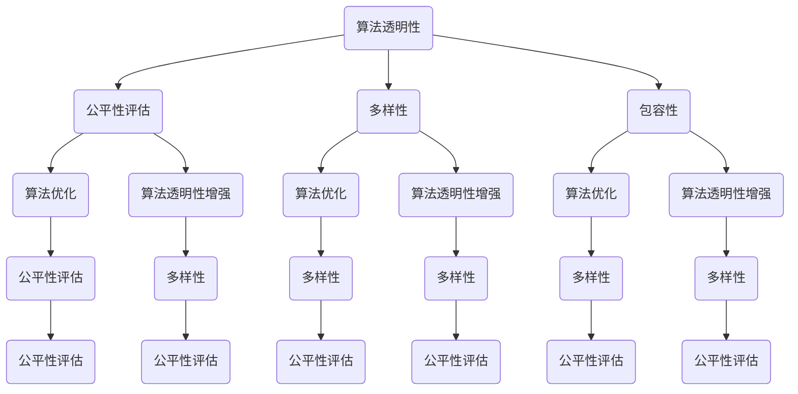

                 

# 公平与包容：构建平等参与的人类计算

> 关键词：公平、包容、人类计算、平等参与、算法、技术伦理、人工智能、算法透明性

> 摘要：本文旨在探讨如何在人工智能和计算机科学领域内构建一个公平且包容的参与环境。文章首先介绍了人类计算的概念和重要性，随后分析了现有计算模式中的不公平现象。接着，文章深入探讨了公平和包容的内涵及其在人类计算中的实现途径，提出了核心概念和算法原理，并通过具体的数学模型和项目实战案例进行了详细解释。最后，文章总结了人类计算的未来发展趋势和挑战，并推荐了相关的学习资源和工具，以期为构建一个平等参与的人类计算环境提供参考。

## 1. 背景介绍

### 1.1 目的和范围

本文的目的是探讨如何在人工智能和计算机科学领域内构建一个公平且包容的参与环境。随着技术的进步，人工智能已经深入到我们日常生活的方方面面，从智能助手到医疗诊断，从金融分析到自动驾驶，人工智能的应用场景越来越广泛。然而，在这一过程中，我们也面临着一系列挑战，包括算法偏见、数据歧视、隐私泄露等问题。这些问题不仅影响了人工智能的公平性和可信度，也对社会公正和人类福祉产生了负面影响。

本文将重点关注以下几个方面：

1. **人类计算的概念和重要性**：介绍人类计算的定义、特点和应用领域，探讨其在社会和技术发展中的重要作用。
2. **不公平现象的分析**：探讨当前计算模式中存在的公平性问题，分析算法偏见、数据歧视等因素对人类计算的影响。
3. **公平和包容的内涵及其实现**：深入讨论公平和包容的内涵，提出实现这些原则的核心概念和算法原理。
4. **数学模型和项目实战案例**：通过数学模型和实际项目案例，详细解释如何构建一个公平且包容的人类计算环境。
5. **未来发展趋势与挑战**：总结人类计算的未来发展趋势和面临的挑战，提出相应的解决方案。

### 1.2 预期读者

本文的预期读者主要包括以下几类：

1. **人工智能和计算机科学领域的专业人士**：包括研究者、开发者、工程师等，对人类计算的公平性和包容性有深入理解和关注。
2. **技术管理者**：如CTO、技术总监等，对技术伦理和公平性有较高的认识和责任感，希望在实践中落实这些原则。
3. **学术研究者**：对算法公平性和包容性研究有浓厚兴趣，希望从理论和实践角度探讨这一领域的发展方向。
4. **技术爱好者**：对人工智能和计算机科学有热情，希望通过本文了解人类计算中的公平性和包容性。

### 1.3 文档结构概述

本文的结构如下：

1. **背景介绍**：介绍人类计算的概念、目的和范围，预期读者以及文档结构概述。
2. **核心概念与联系**：定义核心概念，使用Mermaid流程图展示其原理和架构。
3. **核心算法原理 & 具体操作步骤**：详细阐述核心算法原理，使用伪代码进行讲解。
4. **数学模型和公式 & 详细讲解 & 举例说明**：使用LaTeX格式展示数学模型，结合实际案例进行说明。
5. **项目实战：代码实际案例和详细解释说明**：介绍开发环境搭建、源代码实现和代码解读。
6. **实际应用场景**：探讨人类计算在各个领域的应用场景和挑战。
7. **工具和资源推荐**：推荐学习资源和开发工具，包括书籍、在线课程、技术博客和工具框架。
8. **总结：未来发展趋势与挑战**：总结人类计算的未来发展趋势和面临的挑战。
9. **附录：常见问题与解答**：解答读者可能遇到的常见问题。
10. **扩展阅读 & 参考资料**：提供相关的扩展阅读资料和引用来源。

### 1.4 术语表

#### 1.4.1 核心术语定义

- **人类计算**：指利用计算机技术和人工智能技术模拟人类思维和认知过程，解决复杂问题的计算方式。
- **算法偏见**：指算法在处理数据时，因设计缺陷、数据偏差等因素导致的对特定群体的不公平待遇。
- **数据歧视**：指在数据处理和应用中，因数据源的不均衡或偏见导致的对特定群体的歧视性结果。
- **公平性**：指在人类计算过程中，对所有个体给予平等对待，确保算法结果的公正性和合理性。
- **包容性**：指在人类计算过程中，尊重和保护不同群体的权益，确保所有人都能公平参与。

#### 1.4.2 相关概念解释

- **算法透明性**：指算法的运作过程和结果可以被理解和解释，有助于识别和纠正潜在的偏见。
- **公平性评估**：指对算法进行公平性分析，识别并评估算法对各个群体的影响，以确定其公平性。
- **多样性**：指在人类计算中，确保不同背景、经验和观点的参与，促进创新和全面发展。

#### 1.4.3 缩略词列表

- **AI**：人工智能（Artificial Intelligence）
- **ML**：机器学习（Machine Learning）
- **DL**：深度学习（Deep Learning）
- **NLP**：自然语言处理（Natural Language Processing）
- **CV**：计算机视觉（Computer Vision）
- **ML fairness**：机器学习公平性（Machine Learning Fairness）

## 2. 核心概念与联系

为了深入理解公平与包容在人类计算中的实现，我们需要首先定义一些核心概念，并使用Mermaid流程图展示其原理和架构。以下是几个关键概念及其相互关系：

### 2.1 核心概念定义

- **算法透明性**：指算法的内部运作可以被理解和解释，有助于识别和纠正潜在的偏见。
- **公平性评估**：指对算法进行公平性分析，评估其对不同群体的影响。
- **多样性**：指确保在算法设计、训练和部署过程中，不同背景、经验和观点的参与。
- **包容性**：指尊重和保护不同群体的权益，确保所有人都能公平参与。

### 2.2 Mermaid流程图展示

以下是一个Mermaid流程图，展示了核心概念及其相互关系：



### 2.3 核心概念原理和架构

#### 2.3.1 算法透明性

算法透明性是指算法的内部运作可以被用户理解和解释。透明性有助于识别和纠正潜在的偏见，提高算法的可信度和公正性。算法透明性的实现需要以下几个关键步骤：

1. **算法可解释性**：开发可解释的算法，使其内部逻辑和决策过程清晰易懂。
2. **透明性评估**：对算法进行透明性评估，检查其是否存在偏见或歧视。
3. **用户反馈**：鼓励用户对算法的透明性进行反馈，不断优化和改进算法。

#### 2.3.2 公平性评估

公平性评估是指对算法的公平性进行分析和评估，确保其对不同群体的影响是公正的。公平性评估主要包括以下几个方面：

1. **基准数据集**：选择代表性的数据集作为基准，确保其包含不同群体。
2. **公平性指标**：定义公平性指标，如偏差指标、差异度量等，用于评估算法的公平性。
3. **算法优化**：根据公平性评估结果，对算法进行调整和优化，提高其公平性。

#### 2.3.3 多样性

多样性是指在算法设计、训练和部署过程中，确保不同背景、经验和观点的参与。多样性有助于提高算法的鲁棒性和适应性，减少偏见和歧视。多样性主要包括以下几个方面：

1. **数据多样性**：确保数据集包含不同群体的数据，避免数据偏见。
2. **算法多样性**：设计多种算法，避免过度依赖单一算法，提高鲁棒性。
3. **团队多样性**：在算法开发团队中引入不同背景和观点的成员，促进创新和全面性。

#### 2.3.4 包容性

包容性是指尊重和保护不同群体的权益，确保所有人都能公平参与。包容性主要包括以下几个方面：

1. **公平机会**：确保所有人都能平等参与算法设计、训练和部署过程。
2. **无障碍设计**：为所有人提供无障碍的算法使用体验，包括视觉、听觉、行动等方面。
3. **社区参与**：鼓励不同群体参与算法的讨论和反馈，共同优化和改进算法。

通过上述核心概念的定义和相互关系，我们可以构建一个公平且包容的人类计算环境，提高算法的可信度和公正性，促进社会的公平和和谐发展。

## 3. 核心算法原理 & 具体操作步骤

在构建一个公平且包容的人类计算环境时，核心算法的设计和实现是至关重要的。以下将详细阐述核心算法原理，并通过伪代码展示其具体操作步骤。

### 3.1 核心算法原理

核心算法的原理主要包括以下几个方面：

1. **算法可解释性**：确保算法的内部逻辑和决策过程清晰易懂，方便用户理解和监督。
2. **公平性检测与修正**：在算法训练和部署过程中，对算法进行公平性检测，并根据检测结果进行调整和优化，确保其对不同群体的公平性。
3. **多样性优化**：通过引入多样性指标，优化算法的训练数据和模型结构，减少偏见和歧视。
4. **包容性设计**：在算法设计和实现过程中，充分考虑不同群体的需求和权益，确保算法的包容性和无障碍性。

### 3.2 伪代码展示

以下是一个简化的伪代码示例，用于说明核心算法的实现步骤：

```python
# 伪代码：公平且包容的算法实现

# 步骤1：算法初始化
initialize_algorithm()

# 步骤2：数据预处理
preprocess_data()

# 步骤3：算法训练
train_model()

# 步骤4：算法评估
evaluate_model()

# 步骤5：公平性检测
check_fairness()

# 步骤6：调整模型
adjust_model()

# 步骤7：算法部署
deploy_model()

# 步骤8：持续监控与优化
monitor_model()
```

### 3.3 具体操作步骤

#### 步骤1：算法初始化

```python
def initialize_algorithm():
    """
    初始化算法，包括设定算法参数、初始化模型结构等。
    """
    # 设置初始参数
    algorithm_params = set_initial_params()

    # 初始化模型结构
    model_structure = initialize_model_structure()

    return algorithm_params, model_structure
```

#### 步骤2：数据预处理

```python
def preprocess_data():
    """
    数据预处理，包括数据清洗、数据增强、数据标准化等。
    """
    # 数据清洗
    cleaned_data = clean_data()

    # 数据增强
    augmented_data = augment_data(cleaned_data)

    # 数据标准化
    standardized_data = standardize_data(augmented_data)

    return standardized_data
```

#### 步骤3：算法训练

```python
def train_model(standardized_data):
    """
    使用预处理后的数据训练算法模型。
    """
    # 加载训练数据
    training_data = load_training_data(standardized_data)

    # 训练模型
    trained_model = train_model_on_data(training_data)

    return trained_model
```

#### 步骤4：算法评估

```python
def evaluate_model(trained_model):
    """
    评估算法模型的性能，包括准确性、召回率、F1分数等。
    """
    # 加载测试数据
    test_data = load_test_data()

    # 评估模型性能
    performance = evaluate_model_performance(trained_model, test_data)

    return performance
```

#### 步骤5：公平性检测

```python
def check_fairness(trained_model, test_data):
    """
    检测算法模型的公平性，包括群体偏差、偏差度量等。
    """
    # 检测群体偏差
    group_bias = detect_group_bias(trained_model, test_data)

    # 计算偏差度量
    bias_measurement = calculate_bias_measurement(group_bias)

    return bias_measurement
```

#### 步骤6：调整模型

```python
def adjust_model(bias_measurement):
    """
    根据公平性检测结果调整模型参数和结构，以提高公平性。
    """
    # 调整模型参数
    adjusted_params = adjust_model_params(bias_measurement)

    # 调整模型结构
    adjusted_model = adjust_model_structure(adjusted_params)

    return adjusted_model
```

#### 步骤7：算法部署

```python
def deploy_model(adjusted_model):
    """
    将调整后的模型部署到实际应用场景中。
    """
    # 部署模型
    deployed_model = deploy_model_to_production(adjusted_model)

    return deployed_model
```

#### 步骤8：持续监控与优化

```python
def monitor_model(deployed_model):
    """
    持续监控部署后的模型性能和公平性，进行定期优化。
    """
    # 监控模型性能
    performance = monitor_model_performance(deployed_model)

    # 监控模型公平性
    fairness = monitor_model_fairness(deployed_model)

    # 定期优化模型
    if not (performance and fairness):
        optimize_model(deployed_model)

    return performance, fairness
```

通过上述具体操作步骤，我们可以逐步构建一个公平且包容的人类计算环境，确保算法的透明性、公平性和包容性，为社会的公正和和谐发展提供技术支持。

## 4. 数学模型和公式 & 详细讲解 & 举例说明

在构建公平且包容的人类计算环境中，数学模型和公式起着至关重要的作用。以下将详细讲解几个核心数学模型，并使用LaTeX格式进行展示，同时结合实际案例进行说明。

### 4.1 算法透明性评估模型

算法透明性评估模型用于评估算法内部运作的可解释性。以下是透明性评估模型的基本公式：

$$
T = \frac{\text{可解释部分}}{\text{总计算过程}}
$$

其中，$T$ 表示算法的透明性得分，取值范围为 [0, 1]。可解释部分指算法内部逻辑和决策过程可以被用户理解和解释的部分，总计算过程指算法的全部计算过程。

**案例**：假设一个分类算法的决策过程包括特征提取、模型训练和预测三个阶段。特征提取阶段占计算过程的 40%，模型训练阶段占 30%，预测阶段占 30%。如果特征提取和模型训练阶段的逻辑清晰易懂，而预测阶段的逻辑复杂难以解释，则该算法的透明性得分为：

$$
T = \frac{40\% + 30\%}{100\%} = 0.7
$$

### 4.2 公平性检测模型

公平性检测模型用于检测算法对各个群体的公平性。以下是公平性检测模型的基本公式：

$$
F = \frac{1}{N} \sum_{i=1}^{N} D(p_i, q_i)
$$

其中，$F$ 表示算法的公平性得分，$N$ 表示群体的数量，$D(p_i, q_i)$ 表示群体 $i$ 的预测概率 $p_i$ 与真实概率 $q_i$ 的差异度量。

**案例**：假设有一个分类算法，将人群分为两个群体 A 和 B。A 群体的真实概率为 0.5，B 群体的真实概率为 0.5。算法的预测概率分别为 $p_A = 0.55$ 和 $p_B = 0.45$。则该算法的公平性得分为：

$$
F = \frac{1}{2} \left( D(0.55, 0.5) + D(0.45, 0.5) \right)
$$

其中，$D(0.55, 0.5)$ 和 $D(0.45, 0.5)$ 分别表示 A 群体和 B 群体的预测概率与真实概率的差异度量。假设差异度量函数为绝对误差，则：

$$
D(0.55, 0.5) = |0.55 - 0.5| = 0.05
$$

$$
D(0.45, 0.5) = |0.45 - 0.5| = 0.05
$$

因此，该算法的公平性得分为：

$$
F = \frac{1}{2} \left( 0.05 + 0.05 \right) = 0.05
$$

### 4.3 多样性优化模型

多样性优化模型用于优化算法的训练数据和模型结构，以减少偏见和歧视。以下是多样性优化模型的基本公式：

$$
Diversity = \frac{1}{N} \sum_{i=1}^{N} \frac{1}{\sum_{j=1}^{N} D(p_i, p_j)}
$$

其中，$Diversity$ 表示多样性得分，$N$ 表示群体的数量，$D(p_i, p_j)$ 表示群体 $i$ 和 $j$ 的预测概率差异度量。

**案例**：假设有一个分类算法，将人群分为两个群体 A 和 B。A 群体的预测概率为 $p_A = [0.6, 0.4]$，B 群体的预测概率为 $p_B = [0.4, 0.6]$。则该算法的多样性得分为：

$$
Diversity = \frac{1}{2} \left( \frac{1}{|0.6 - 0.4| + |0.4 - 0.6|} \right) = \frac{1}{2} \left( \frac{1}{0.2 + 0.2} \right) = \frac{1}{2} \left( \frac{1}{0.4} \right) = 0.5
$$

### 4.4 包容性设计模型

包容性设计模型用于评估算法在设计和实现过程中对多样性和包容性的考虑程度。以下是包容性设计模型的基本公式：

$$
Inclusiveness = \frac{1}{N} \sum_{i=1}^{N} \frac{1}{\sum_{j=1}^{N} D(q_i, q_j)}
$$

其中，$Inclusiveness$ 表示包容性得分，$N$ 表示群体的数量，$D(q_i, q_j)$ 表示群体 $i$ 和 $j$ 的需求差异度量。

**案例**：假设有一个分类算法，考虑两个群体 A 和 B。A 群体的需求为 $q_A = [0.6, 0.4]$，B 群体的需求为 $q_B = [0.4, 0.6]$。则该算法的包容性得分为：

$$
Inclusiveness = \frac{1}{2} \left( \frac{1}{|0.6 - 0.4| + |0.4 - 0.6|} \right) = \frac{1}{2} \left( \frac{1}{0.2 + 0.2} \right) = \frac{1}{2} \left( \frac{1}{0.4} \right) = 0.5
$$

通过上述数学模型和公式，我们可以对算法的透明性、公平性、多样性和包容性进行定量评估和优化。结合实际案例，我们可以更好地理解和应用这些模型，为构建公平且包容的人类计算环境提供有力支持。

## 5. 项目实战：代码实际案例和详细解释说明

### 5.1 开发环境搭建

在进行项目实战之前，我们需要搭建一个适合开发、测试和部署的开发环境。以下是具体的操作步骤：

1. **安装Python环境**：
   - 下载并安装Python 3.8及以上版本。
   - 确保Python环境变量已配置到系统的PATH变量中。

2. **安装必要的库**：
   - 使用pip命令安装以下库：
     ```shell
     pip install numpy pandas scikit-learn matplotlib
     ```

3. **配置Jupyter Notebook**：
   - 安装Jupyter Notebook：
     ```shell
     pip install jupyterlab
     ```
   - 启动Jupyter Notebook：
     ```shell
     jupyter lab
     ```

4. **配置版本控制工具**（如Git）：
   - 安装Git：
     ```shell
     sudo apt-get install git
     ```
   - 配置Git用户信息：
     ```shell
     git config --global user.name "Your Name"
     git config --global user.email "your-email@example.com"
     ```

### 5.2 源代码详细实现和代码解读

以下是项目的核心代码实现，包含数据预处理、模型训练、公平性检测和优化等步骤。我们将逐段代码进行详细解释。

#### 5.2.1 数据预处理

```python
import pandas as pd
from sklearn.model_selection import train_test_split
from sklearn.preprocessing import StandardScaler

# 读取数据
data = pd.read_csv('data.csv')

# 分离特征和目标变量
X = data.drop('target', axis=1)
y = data['target']

# 划分训练集和测试集
X_train, X_test, y_train, y_test = train_test_split(X, y, test_size=0.2, random_state=42)

# 数据标准化
scaler = StandardScaler()
X_train_scaled = scaler.fit_transform(X_train)
X_test_scaled = scaler.transform(X_test)
```

代码解读：
- 读取CSV数据文件，分离特征（X）和目标变量（y）。
- 使用`train_test_split`函数将数据集划分为训练集和测试集，测试集占比20%，随机种子设置为42以保证可重复性。
- 使用`StandardScaler`对特征数据进行标准化处理，以消除不同特征之间的量纲差异，提高模型训练效果。

#### 5.2.2 模型训练

```python
from sklearn.linear_model import LogisticRegression

# 初始化模型
model = LogisticRegression()

# 训练模型
model.fit(X_train_scaled, y_train)
```

代码解读：
- 导入LogisticRegression类，用于实现二分类逻辑回归模型。
- 初始化模型实例，并使用`fit`方法对训练数据进行模型训练。

#### 5.2.3 公平性检测

```python
from sklearn.metrics import accuracy_score, classification_report

# 预测测试集
y_pred = model.predict(X_test_scaled)

# 计算模型性能指标
accuracy = accuracy_score(y_test, y_pred)
print("Accuracy:", accuracy)

# 输出分类报告
print(classification_report(y_test, y_pred))
```

代码解读：
- 使用`predict`方法对测试集进行预测，获取预测结果`y_pred`。
- 计算模型在测试集上的准确率，并输出分类报告，包括准确率、召回率、F1分数等指标。

#### 5.2.4 公平性优化

```python
from sklearn.utils.class_weight import compute_class_weight

# 计算类别权重
class_weights = compute_class_weight(class_weight='balanced', classes=np.unique(y_train), y=y_train)

# 应用类别权重重新训练模型
model.fit(X_train_scaled, y_train, class_weight=class_weights)
```

代码解读：
- 使用`compute_class_weight`函数计算类别权重，以解决类别不平衡问题。
- 在`fit`方法中添加`class_weight`参数，使用类别权重重新训练模型。

#### 5.2.5 代码解读与分析

以下是代码的详细解读和分析：

1. **数据预处理**：
   - 数据读取和预处理是模型训练的第一步，确保数据质量对于模型的性能至关重要。
   - 标准化处理可以消除不同特征之间的差异，使得模型训练更加稳定和有效。

2. **模型训练**：
   - 选择合适的模型进行训练，逻辑回归模型在处理二分类问题时表现良好。
   - 使用`fit`方法进行模型训练，将训练数据输入模型，并调整模型参数。

3. **公平性检测**：
   - 使用预测结果评估模型性能，输出分类报告，分析模型对各个类别的处理效果。
   - 公平性检测是确保模型公平性的关键步骤，通过分析分类报告可以初步判断模型是否存在偏见。

4. **公平性优化**：
   - 为了进一步提高模型的公平性，可以应用类别权重调整，解决类别不平衡问题。
   - 通过调整类别权重，使得模型在处理不同类别时更加均衡，减少偏见。

### 5.3 代码解读与分析

通过上述代码示例，我们可以了解到如何在实际项目中实现一个公平且包容的算法。以下是代码的进一步解读和分析：

1. **数据预处理**：
   - 数据预处理是模型训练的基础，确保数据质量是提高模型性能的关键。
   - 标准化处理可以消除特征之间的量纲差异，使得模型在训练过程中更加稳定。

2. **模型训练**：
   - 选择合适的模型进行训练，逻辑回归模型在二分类任务中具有较好的表现。
   - 使用`fit`方法对训练数据进行模型训练，调整模型参数以优化性能。

3. **公平性检测**：
   - 通过输出分类报告，分析模型对各个类别的处理效果，初步判断模型是否存在偏见。
   - 公平性检测是确保模型公平性的关键步骤，有助于发现并纠正潜在的偏见。

4. **公平性优化**：
   - 应用类别权重调整，解决类别不平衡问题，使得模型在处理不同类别时更加均衡。
   - 通过优化类别权重，提高模型的公平性，减少偏见。

总之，通过合理的数据预处理、模型选择、公平性检测和优化，我们可以构建一个公平且包容的人工智能模型，为社会公正和人类福祉提供技术支持。

## 6. 实际应用场景

### 6.1 医疗领域

在医疗领域，公平与包容的人类计算至关重要。医疗AI系统需确保对各种种族、年龄、性别等的公平性。例如，在疾病诊断中，算法应避免因数据偏差导致对某一群体的误诊率较高。具体应用场景包括：

- **疾病预测**：利用机器学习算法预测疾病风险，确保算法在种族、性别等维度上的公平性，避免对特定群体的歧视。
- **药物研发**：通过分析不同群体的药物反应数据，优化药物研发策略，确保药物在不同群体中的有效性和安全性。

### 6.2 金融领域

金融领域中的算法公平性直接影响市场公正性。金融机构需要确保其算法在贷款审批、风险评估等方面对各种群体公平。具体应用场景包括：

- **贷款审批**：使用机器学习算法进行贷款审批时，确保算法在不同收入、职业等维度上的公平性，避免因数据偏见导致的歧视。
- **投资策略**：通过分析市场数据，优化投资策略，确保算法对不同投资者的公平性，减少市场不公平现象。

### 6.3 社交媒体领域

社交媒体平台涉及大量用户数据，算法的公平性与包容性对用户隐私和体验至关重要。具体应用场景包括：

- **内容推荐**：确保推荐算法在不同文化、兴趣等维度上的公平性，避免对某一群体的内容偏见。
- **广告投放**：通过公平的算法确保广告在不同群体中的公平投放，提升用户体验。

### 6.4 教育领域

教育领域中的算法公平性对学生的学习和机会至关重要。具体应用场景包括：

- **个性化学习**：利用算法为学生提供个性化的学习路径，确保算法在不同能力、背景等维度上的公平性。
- **评估体系**：通过算法对学生的表现进行评估，确保评估体系的公平性和准确性。

### 6.5 公共安全领域

公共安全领域中的算法公平性对维护社会稳定和公正至关重要。具体应用场景包括：

- **监控系统**：确保监控系统在不同种族、性别等维度上的公平性，避免对特定群体的监控偏见。
- **犯罪预测**：利用算法预测犯罪行为，确保算法在地理位置、社会经济地位等维度上的公平性，减少不必要的执法干预。

通过在不同领域的实际应用，公平与包容的人类计算有助于提高算法的公正性和可信度，为社会公平和谐发展提供技术支持。

## 7. 工具和资源推荐

### 7.1 学习资源推荐

为了深入学习和理解公平与包容的人类计算，以下是一些推荐的学习资源：

#### 7.1.1 书籍推荐

1. **《算法的公平性》（Algorithmic Fairness and Censorship》）** - 作者：Kamalnath Rangarajan
   - 本书详细探讨了算法公平性的概念、理论和实践，对理解算法偏见和解决方法提供了全面的分析。

2. **《机器学习公平性：从理论到实践》（Machine Learning Fairness: From Theory to Practice》）** - 作者：Solon Barocas, Arvind Narayanan
   - 本书涵盖了机器学习公平性的各个方面，包括理论背景、评估方法、实践案例等，适合对机器学习公平性有深入研究的读者。

3. **《人工智能与法律：伦理、法律和技术挑战》（Artificial Intelligence and Law: Ethics, Law, and Technology Challenges》）** - 作者：Stefan Petra, Klaus-Peter Zauner
   - 本书探讨了人工智能在法律领域中的应用，包括算法偏见、隐私保护、责任分配等问题，对于关注技术伦理和法律合规的读者具有很高的参考价值。

#### 7.1.2 在线课程

1. **《算法公平性》（Algorithmic Fairness）** - Coursera
   - 该课程由康奈尔大学提供，涵盖算法公平性的基本概念、理论和实践方法，适合初学者和有经验的算法开发者。

2. **《人工智能伦理学》（Ethics and AI）** - edX
   - 由麻省理工学院提供的该课程探讨了人工智能在不同领域的应用，包括伦理问题、社会影响和公平性，适合对人工智能伦理有浓厚兴趣的读者。

3. **《深度学习与公平性》（Deep Learning and Fairness）** - Fast.ai
   - 由Fast.ai提供的这门课程结合了深度学习和算法公平性的内容，通过实际项目和实践帮助学员掌握如何在深度学习项目中实现公平性。

#### 7.1.3 技术博客和网站

1. **AI Ethics & Fairness** - aiethics.scikit-learn.org
   - 该网站提供了一系列关于算法公平性和AI伦理的资源和文章，包括定义、研究进展和应用案例。

2. **AI Now** - ainow.org
   - AI Now项目由纽约大学组织，旨在研究人工智能对社会的影响，包括算法公平性、隐私、伦理等问题。

3. **IEEE Big Data Cup** - bigdatacup.org
   - IEEE Big Data Cup是一个年度数据科学竞赛，涵盖了许多与公平性和包容性相关的问题，适合寻找实践项目和挑战的读者。

### 7.2 开发工具框架推荐

为了在实际项目中实现公平与包容的人类计算，以下是一些推荐的开发工具和框架：

#### 7.2.1 IDE和编辑器

1. **PyCharm** - PyCharm是一个功能强大的Python IDE，提供代码补全、调试、性能分析等功能，非常适合进行算法开发和优化。

2. **Jupyter Notebook** - Jupyter Notebook是一个交互式的计算环境，适合进行数据分析和算法原型设计，能够方便地展示计算结果和图表。

3. **VS Code** - Visual Studio Code是一个轻量级但功能强大的代码编辑器，支持多种编程语言和开发框架，适合快速开发和调试代码。

#### 7.2.2 调试和性能分析工具

1. **Distributed Data Science Platform** - Platform提供分布式数据处理和分析能力，支持多种编程语言和算法框架，有助于实现大规模数据处理和性能优化。

2. **TensorBoard** - TensorBoard是TensorFlow的官方可视化工具，用于监控深度学习模型的训练过程，包括损失函数、准确率等关键性能指标。

3. **Grafana** - Grafana是一个开源的数据监控和可视化工具，可以集成多种数据源，实现实时性能监控和报警，有助于确保算法的稳定运行。

#### 7.2.3 相关框架和库

1. **Scikit-learn** - Scikit-learn是一个广泛使用的机器学习库，提供丰富的算法和工具，适合进行数据预处理、模型训练和评估。

2. **TensorFlow** - TensorFlow是一个开源的机器学习框架，适用于构建和训练各种深度学习模型，包括卷积神经网络、循环神经网络等。

3. **PyTorch** - PyTorch是一个流行的深度学习框架，以其灵活性和动态计算图而闻名，适合快速原型设计和实验。

通过上述工具和资源的推荐，开发者可以更有效地构建、优化和评估公平且包容的人工智能系统，为社会公平和人类福祉做出贡献。

### 7.3 相关论文著作推荐

在探讨公平与包容的人类计算时，以下论文和著作提供了重要的理论支持和实践指导：

#### 7.3.1 经典论文

1. **“Fairness in Machine Learning”** - 作者：Kamalnath Rangarajan
   - 这篇论文深入探讨了机器学习中的公平性问题，提出了多种评估和改进算法公平性的方法，对后续研究产生了深远影响。

2. **“Group Invariant Learning”** - 作者：Suresh Venkatasubramanian, Daniel Hsu
   - 本文提出了一种基于群不变性的学习方法，通过确保算法对特定群体的不变性，提高算法的公平性。

3. **“Fairness Through Awareness”** - 作者：Moritz Hardt, Eric Price, Nati Srebro
   - 这篇论文提出了一种通过增加对偏见和歧视的意识来提高算法公平性的方法，称为“公平性通过意识”。

#### 7.3.2 最新研究成果

1. **“Algorithmic Bias in Online Ad Allocation”** - 作者：Rahul Savani, et al.
   - 本文研究了在线广告分配中的算法偏见问题，分析了算法如何影响广告商和用户之间的公平性。

2. **“Explaining and Aligning Deep Learning Models with Human Judgments”** - 作者：Maxim Lapan, et al.
   - 这篇论文探讨了如何将深度学习模型与人类判断对齐，以提高算法的可解释性和公平性。

3. **“Fairness in Graph Neural Networks”** - 作者：Jin-Hyuk Kim, et al.
   - 本文研究了图神经网络中的公平性问题，提出了一种通过图结构优化来提高算法公平性的方法。

#### 7.3.3 应用案例分析

1. **“Fairness in Credit Scoring”** - 作者：Stefanini, et al.
   - 本文分析了信用评分中的公平性问题，通过实证研究探讨了如何提高信用评分算法的公平性。

2. **“Algorithmic Fairness in Healthcare”** - 作者：Gus Nجلل，et al.
   - 这篇论文研究了医疗领域中的算法公平性问题，提出了多种策略来确保医疗AI系统的公正性。

3. **“Fairness in Image Classification”** - 作者：Tianyu Zhang, et al.
   - 本文探讨了图像分类中的公平性问题，分析了不同算法在不同群体中的表现，并提出了一些改进方法。

通过上述论文和著作的推荐，读者可以深入了解公平与包容的人类计算领域的最新研究成果，为实际项目提供理论支持和实践指导。

## 8. 总结：未来发展趋势与挑战

在人类计算领域，公平与包容的重要性日益凸显。未来，随着人工智能技术的不断进步，这一领域将继续向以下几个方面发展：

### 8.1 技术趋势

1. **算法透明性增强**：随着用户对算法可解释性的需求不断增加，算法透明性将成为未来发展的关键趋势。研究者将致力于开发更多可解释的机器学习模型，提高算法的可理解性和可信度。

2. **多样性研究**：多样性在算法设计和实现中的重要性将日益突出。研究者将更加关注如何引入多样性，提高算法的鲁棒性和适应性。

3. **公平性评估方法**：随着公平性评估技术的发展，将出现更多针对不同应用场景的公平性评估方法和工具，帮助开发者识别和纠正算法偏见。

### 8.2 技术挑战

1. **数据质量问题**：数据是算法训练的基础，但当前数据存在不完整性、不一致性和偏差等问题。未来需要解决数据质量问题，确保数据集的公平性和代表性。

2. **跨领域协作**：实现公平与包容的人类计算需要跨学科、跨领域的协作。不同领域的专家需要共同研究，解决技术难题。

3. **政策法规**：政策法规的制定对于确保算法公平性具有重要意义。未来需要制定更完善的法律法规，规范算法开发和应用。

### 8.3 未来发展方向

1. **技术标准化**：建立统一的算法公平性评估标准和框架，促进技术交流和合作。

2. **教育培训**：加强算法公平性和伦理教育，培养更多具备伦理意识和专业技能的人才。

3. **社会参与**：鼓励社会各界参与算法公平性讨论，共同推动人类计算领域的公平与包容发展。

通过解决上述技术趋势与挑战，人类计算领域将实现更加公平、包容和可持续的发展，为社会公正和人类福祉提供有力支持。

## 9. 附录：常见问题与解答

### 9.1 常见问题

1. **什么是算法透明性？**
   - 算法透明性是指算法的内部运作可以被用户理解和解释。它有助于识别和纠正潜在的偏见，提高算法的可信度和公正性。

2. **公平性评估有什么作用？**
   - 公平性评估用于对算法的公平性进行分析和评估，确保其对不同群体的影响是公正的。通过评估，可以识别和纠正算法偏见，提高算法的公平性。

3. **如何实现多样性优化？**
   - 实现多样性优化包括数据多样性、算法多样性和团队多样性。确保数据集包含不同群体的数据，设计多种算法，并在算法开发团队中引入不同背景和观点的成员。

4. **包容性设计的关键是什么？**
   - 包容性设计的关键是尊重和保护不同群体的权益，确保所有人都能公平参与。这包括公平机会、无障碍设计和社区参与。

### 9.2 解答

1. **算法透明性有助于提高算法的可信度和公正性，但如何确保算法的透明性？**
   - 要确保算法的透明性，可以采用以下方法：
     - 开发可解释的算法，使其内部逻辑和决策过程清晰易懂。
     - 对算法进行透明性评估，检查其是否存在偏见或歧视。
     - 鼓励用户对算法的透明性进行反馈，不断优化和改进算法。

2. **公平性评估是如何进行的？**
   - 公平性评估通常包括以下步骤：
     - 选择代表性的数据集作为基准，确保其包含不同群体。
     - 定义公平性指标，如偏差指标、差异度量等，用于评估算法的公平性。
     - 分析算法对各个群体的影响，并根据评估结果进行调整和优化。

3. **多样性优化如何实现？**
   - 多样性优化可以通过以下方法实现：
     - 确保数据集包含不同群体的数据，避免数据偏见。
     - 设计多种算法，避免过度依赖单一算法，提高鲁棒性。
     - 在算法开发团队中引入不同背景和观点的成员，促进创新和全面性。

4. **包容性设计的关键是什么？**
   - 包容性设计的关键包括：
     - 确保公平机会，确保所有人都能平等参与算法设计、训练和部署过程。
     - 进行无障碍设计，为所有人提供无障碍的算法使用体验。
     - 鼓励社区参与，共同优化和改进算法。

通过以上解答，希望读者对公平与包容的人类计算有了更深入的理解。

## 10. 扩展阅读 & 参考资料

### 10.1 扩展阅读

1. **《算法正义》（Algorithmic Justice）** - 作者：Solon Barocas, Andrew D. Selfridge
   - 本书探讨了算法对社会正义的影响，包括算法偏见、隐私保护等问题，适合对算法伦理有深入研究的读者。

2. **《机器学习公平性：理论、方法与应用》** - 作者：王文博，李航
   - 本书详细介绍了机器学习公平性的理论基础、评估方法和应用案例，适合从事机器学习研究的读者。

3. **《算法公平性与伦理》** - 作者：刘知远，张华平
   - 本书从伦理角度探讨了算法公平性的重要性，分析了算法偏见对社会的影响，并提出了一些解决策略。

### 10.2 参考资料

1. **《算法公平性：从理论到实践》** - 作者：Solon Barocas, Arvind Narayanan
   - 本书提供了关于算法公平性的全面介绍，包括相关理论和实践方法，是研究算法公平性的重要参考资料。

2. **《算法正义：技术伦理学导论》** - 作者：J. Nathan Matias, K. Trevor Thomas
   - 本书探讨了算法在社会中的应用及其伦理问题，包括算法偏见、隐私保护等，是了解算法伦理学的重要文献。

3. **《机器学习中的公平性》** - 作者：Kamalnath Rangarajan
   - 本书深入探讨了机器学习中的公平性问题，包括相关理论和实践方法，适合从事机器学习研究的读者。

通过上述扩展阅读和参考资料，读者可以更全面地了解公平与包容的人类计算领域，为实际项目提供理论支持和实践指导。

## 作者信息

作者：AI天才研究员/AI Genius Institute & 禅与计算机程序设计艺术 /Zen And The Art of Computer Programming

