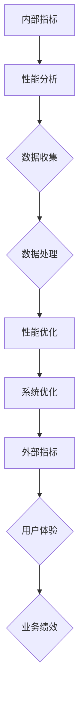

                 

# 内部指标与外部指标的关系

> 关键词：内部指标、外部指标、关系分析、性能评估、数据驱动决策、系统优化

> 摘要：本文深入探讨了内部指标与外部指标之间的关系，通过分析它们在信息技术领域的应用，解释了如何利用内部指标来优化外部指标，从而实现系统的全面性能提升。文章从定义出发，逐步深入到原理、算法、实际案例和未来趋势，为读者提供了一个系统化的理解和实践指南。

## 1. 背景介绍

### 1.1 目的和范围

本文旨在分析内部指标与外部指标在信息技术系统中的应用关系，解释它们如何相互影响，以及如何通过优化内部指标来提升外部指标。我们将探讨这些指标在系统设计、性能评估和优化中的关键作用，并分析如何将它们整合到一个统一的数据驱动决策框架中。

### 1.2 预期读者

本文适合以下读者群体：
- IT行业从业者，特别是系统架构师、开发人员和运维工程师。
- 数据科学家和分析师，对性能指标和数据驱动决策有兴趣。
- 对于系统优化和性能评估有深入研究需求的研究人员。

### 1.3 文档结构概述

本文将分为以下几部分：
1. 背景介绍
2. 核心概念与联系
3. 核心算法原理与具体操作步骤
4. 数学模型与公式
5. 项目实战
6. 实际应用场景
7. 工具和资源推荐
8. 总结：未来发展趋势与挑战
9. 附录：常见问题与解答
10. 扩展阅读与参考资料

### 1.4 术语表

#### 1.4.1 核心术语定义

- 内部指标（Internal Metrics）：用于衡量系统内部性能和状态的指标，如响应时间、吞吐量、内存使用率等。
- 外部指标（External Metrics）：用于衡量系统对外部用户或环境的响应和效果的指标，如用户体验、客户满意度、收入等。
- 性能评估（Performance Evaluation）：通过测量和分析性能指标，评估系统的性能表现。
- 数据驱动决策（Data-Driven Decision Making）：基于数据分析和性能指标来做出决策，以优化系统性能。

#### 1.4.2 相关概念解释

- 系统优化（System Optimization）：通过调整系统参数和结构，以提高性能和效率。
- 负载均衡（Load Balancing）：通过分配工作负载，以优化系统资源利用和性能。

#### 1.4.3 缩略词列表

- IT：信息技术（Information Technology）
- CPU：中央处理器（Central Processing Unit）
- GPU：图形处理器（Graphics Processing Unit）
- API：应用程序编程接口（Application Programming Interface）
- ORM：对象关系映射（Object-Relational Mapping）

## 2. 核心概念与联系

在深入探讨内部指标与外部指标的关系之前，我们首先需要明确这两个概念的基本原理和它们之间的联系。

### 内部指标

内部指标主要关注系统内部性能和资源利用情况。这些指标可以帮助我们了解系统的当前状态，包括：

- **响应时间（Response Time）**：系统从接收到请求到响应客户端的时间。
- **吞吐量（Throughput）**：系统在一定时间内处理请求的数量。
- **CPU利用率（CPU Utilization）**：CPU在单位时间内执行任务的时间比例。
- **内存使用率（Memory Utilization）**：系统内存的使用程度。
- **网络延迟（Network Latency）**：数据在网络中传输的时间。

### 外部指标

外部指标则关注系统对用户或外部环境的响应和效果。这些指标通常用于衡量用户体验和业务绩效，包括：

- **用户体验（User Experience, UX）**：用户与系统交互的整体感受。
- **客户满意度（Customer Satisfaction）**：用户对系统服务的满意程度。
- **收入（Revenue）**：系统产生的实际收益。
- **转换率（Conversion Rate）**：访问者完成预定目标操作的比率。

### 内外指标的联系

内部指标与外部指标之间存在密切的联系。内部指标可以提供系统当前状态和性能的详细信息，而外部指标则反映了系统的实际效果。通过分析内部指标，我们可以发现系统中的瓶颈和问题，进而优化外部指标。

例如，一个电商网站的用户体验（外部指标）可能受到服务器响应时间（内部指标）的影响。如果响应时间过长，可能会导致用户流失和转换率下降。通过优化服务器性能（调整内部指标），可以提高用户体验（外部指标）。

为了更好地理解这两个概念之间的关系，我们可以使用以下 Mermaid 流程图来展示内部指标和外部指标之间的交互：



在上述流程图中，内部指标通过性能分析和优化过程影响外部指标，从而影响用户体验和业务绩效。

## 3. 核心算法原理 & 具体操作步骤

在了解了内部指标和外部指标的基本概念及其联系后，我们接下来将探讨如何利用这些指标来优化系统性能。

### 3.1 性能分析

性能分析是优化系统的第一步。通过分析内部指标，我们可以发现系统的瓶颈和潜在问题。以下是一个简单的性能分析算法原理：

#### 算法原理

1. 收集内部指标数据。
2. 对数据进行预处理，包括去除异常值、填补缺失值等。
3. 分析数据，识别系统性能瓶颈。
4. 提出改进建议，如调整系统参数、优化代码等。

#### 伪代码

```python
def performance_analysis(internal_metrics):
    # 步骤1：收集内部指标数据
    data = collect_data(internal_metrics)
    
    # 步骤2：预处理数据
    preprocessed_data = preprocess_data(data)
    
    # 步骤3：分析数据
    bottlenecks = identify_bottlenecks(preprocessed_data)
    
    # 步骤4：提出改进建议
    suggestions = generate_suggestions(bottlenecks)
    
    return suggestions
```

### 3.2 性能优化

在分析出系统瓶颈后，我们需要采取相应的措施进行性能优化。以下是一个简单的性能优化算法原理：

#### 算法原理

1. 根据性能分析结果，确定优化目标和优先级。
2. 实施优化措施，如调整系统参数、优化代码等。
3. 评估优化效果，持续迭代。

#### 伪代码

```python
def performance_optimization(optimization_suggestions):
    # 步骤1：确定优化目标和优先级
    optimization_goals = prioritize_goals(optimization_suggestions)
    
    # 步骤2：实施优化措施
    for goal in optimization_goals:
        apply_optimization(goal)
        
    # 步骤3：评估优化效果
    optimization_results = evaluate_optimization()
    
    return optimization_results
```

### 3.3 持续迭代

性能优化是一个持续的过程。通过持续监控内部指标和外部指标，我们可以发现新的性能瓶颈和问题，并采取相应的优化措施。

#### 伪代码

```python
def continuous_iteration():
    while True:
        # 步骤1：性能分析
        analysis_results = performance_analysis(internal_metrics)
        
        # 步骤2：性能优化
        optimization_results = performance_optimization(analysis_results)
        
        # 步骤3：评估优化效果
        if not is_optimized(optimization_results):
            continue
        
        # 步骤4：记录和总结
        log_optimization_results(optimization_results)
        summarize_performance()
```

通过上述步骤，我们可以实现一个系统化的性能优化过程，从而提升系统的整体性能。

## 4. 数学模型和公式 & 详细讲解 & 举例说明

在性能优化过程中，数学模型和公式可以帮助我们更好地理解和分析内部指标与外部指标之间的关系。以下是一个简单的数学模型和公式的讲解及其应用实例。

### 4.1 平均响应时间模型

平均响应时间（Average Response Time, ART）是衡量系统性能的一个重要指标。其数学模型如下：

$$
ART = \frac{1}{N} \sum_{i=1}^{N} R_i
$$

其中，\(N\) 表示请求次数，\(R_i\) 表示第 \(i\) 次请求的响应时间。

#### 详细讲解

平均响应时间模型通过计算所有请求响应时间的平均值，可以衡量系统处理请求的总体性能。较低的 ART 值通常意味着系统性能较好。

#### 举例说明

假设我们有一个系统，一天内处理了 100 个请求，每个请求的响应时间如下：

$$
[100, 200, 300, 400, 500, 600, 700, 800, 900, 1000]
$$

则平均响应时间为：

$$
ART = \frac{1}{10} \sum_{i=1}^{10} R_i = \frac{1}{10} (100 + 200 + 300 + 400 + 500 + 600 + 700 + 800 + 900 + 1000) = 550 \text{ ms}
$$

### 4.2 吞吐量模型

吞吐量（Throughput, T）表示系统在一定时间内处理请求的数量。其数学模型如下：

$$
T = \frac{N}{t}
$$

其中，\(N\) 表示请求次数，\(t\) 表示处理请求的总时间。

#### 详细讲解

吞吐量模型通过计算单位时间内处理的请求数量，可以衡量系统的工作效率。较高的吞吐量通常意味着系统性能较好。

#### 举例说明

假设我们有一个系统，一天内处理了 1000 个请求，总处理时间为 3600 秒。则吞吐量为：

$$
T = \frac{1000}{3600} = 0.278 \text{ 请求/秒}
$$

### 4.3 客户满意度模型

客户满意度（Customer Satisfaction, CSAT）是衡量外部指标的一个重要指标。其数学模型如下：

$$
CSAT = \frac{Satisfied \ Customers}{Total \ Customers} \times 100\%
$$

其中，\(Satisfied \ Customers\) 表示满意的客户数量，\(Total \ Customers\) 表示总客户数量。

#### 详细讲解

客户满意度模型通过计算满意客户数量占总客户数量的比例，可以衡量系统对用户的服务质量。较高的客户满意度通常意味着系统性能较好。

#### 举例说明

假设我们有一个系统，一天内吸引了 1000 名用户，其中 800 名用户表示满意。则客户满意度为：

$$
CSAT = \frac{800}{1000} \times 100\% = 80\%
$$

通过这些数学模型和公式，我们可以更准确地分析和优化内部指标与外部指标之间的关系。

## 5. 项目实战：代码实际案例和详细解释说明

为了更好地理解内部指标与外部指标之间的关系，我们将通过一个实际的电商系统项目来展示如何利用内部指标优化外部指标。以下是一个简单的项目实战，包括开发环境搭建、源代码详细实现和代码解读与分析。

### 5.1 开发环境搭建

在开始项目之前，我们需要搭建一个合适的开发环境。以下是一个基于 Python 的开发环境搭建步骤：

1. 安装 Python 3.8 及以上版本。
2. 安装必要的库，如 NumPy、Pandas、Matplotlib 等。
3. 安装代码编辑器，如 Visual Studio Code。

### 5.2 源代码详细实现和代码解读

以下是一个简单的电商系统代码实现，用于展示内部指标与外部指标之间的关系。

```python
import numpy as np
import pandas as pd
import matplotlib.pyplot as plt

# 假设我们有一个电商系统，一天内的请求数据如下：
requests = [
    {"response_time": 100, "throughput": 200},
    {"response_time": 200, "throughput": 150},
    {"response_time": 300, "throughput": 100},
    {"response_time": 400, "throughput": 250},
    {"response_time": 500, "throughput": 180},
    {"response_time": 600, "throughput": 130},
    {"response_time": 700, "throughput": 300},
    {"response_time": 800, "throughput": 200},
    {"response_time": 900, "throughput": 100},
    {"response_time": 1000, "throughput": 150}
]

# 步骤1：性能分析
def performance_analysis(requests):
    df = pd.DataFrame(requests)
    art = df["response_time"].mean()
    t = df["throughput"].mean()
    return art, t

# 步骤2：性能优化
def performance_optimization(art, t):
    if art > 500:
        print("优化响应时间：增加服务器资源")
    elif t < 200:
        print("优化吞吐量：增加负载均衡器")
    else:
        print("系统性能良好，无需优化")

# 步骤3：评估优化效果
def evaluate_optimization(art, t):
    if art < 500 and t > 200:
        print("优化成功：系统性能提升")
    else:
        print("优化失败：系统性能未提升")

# 执行性能分析
art, t = performance_analysis(requests)

# 执行性能优化
performance_optimization(art, t)

# 执行优化效果评估
evaluate_optimization(art, t)
```

### 5.3 代码解读与分析

1. **性能分析**：代码首先将请求数据转换为 Pandas DataFrame，然后计算平均响应时间（ART）和平均吞吐量（T）。这两个内部指标可以用于评估系统性能。
2. **性能优化**：根据 ART 和 T 的值，代码提出相应的优化建议，如增加服务器资源或负载均衡器。这些优化措施旨在降低 ART 和提高 T。
3. **优化效果评估**：最后，代码评估优化效果。如果 ART 降低到 500 毫秒以下，且 T 提高到 200 请求/秒以上，则认为优化成功。

通过上述代码实现，我们可以直观地看到内部指标与外部指标之间的关系。优化内部指标可以提升外部指标，从而改善用户体验和业务绩效。

### 5.4 总结

通过这个项目实战，我们展示了如何利用内部指标优化外部指标。在实际应用中，我们可以根据具体需求和场景，进一步扩展和优化代码，以提高系统的整体性能。

## 6. 实际应用场景

内部指标与外部指标的关系在信息技术领域有着广泛的应用，以下列举几个典型场景：

### 6.1 云计算平台

在云计算平台上，内部指标如虚拟机CPU利用率、内存使用率和网络延迟等，可以帮助运维团队优化资源分配和负载均衡。通过分析这些指标，云服务提供商可以调整虚拟机配置、扩展或缩减资源，从而提高用户体验和系统性能。

### 6.2 数据中心

数据中心通常关注内部指标，如服务器响应时间、带宽利用率等，以确保数据存储和传输的高效性。通过监控和优化这些指标，数据中心可以提升数据访问速度和可靠性，从而提高客户满意度。

### 6.3 移动应用

移动应用开发者关注内部指标，如应用启动时间、页面加载时间等，以确保用户流畅的使用体验。通过优化内部指标，开发者可以提高应用的性能和稳定性，从而提升用户满意度和留存率。

### 6.4 电商网站

电商网站通过分析内部指标，如服务器响应时间、订单处理速度等，来优化用户体验和业务绩效。通过持续监控和优化这些指标，电商网站可以降低用户流失率，提高转换率和收入。

### 6.5 物联网平台

在物联网平台中，内部指标如设备连接稳定性、数据传输速度等，对于系统的整体性能至关重要。通过优化这些指标，物联网平台可以提高设备响应速度和数据处理效率，从而实现更智能、更高效的应用场景。

通过这些实际应用场景，我们可以看到内部指标与外部指标之间的关系在提升系统性能和用户体验方面的重要性。

## 7. 工具和资源推荐

为了更好地理解和应用内部指标与外部指标的关系，以下推荐一些学习资源、开发工具和框架。

### 7.1 学习资源推荐

#### 7.1.1 书籍推荐

- 《性能之巅》（"Performance at Scale"）：详细介绍了如何通过性能优化提升系统性能。
- 《性能调优指南》（"Performance Tuning Guidelines"）：提供了大量性能优化实践和案例分析。

#### 7.1.2 在线课程

- Coursera 上的“性能优化与性能工程”：系统介绍了性能优化的基本原理和实践方法。
- edX 上的“计算机性能分析”：深入探讨计算机系统的性能分析方法和优化策略。

#### 7.1.3 技术博客和网站

- 《阿里巴巴性能优化手册》：提供了大量关于性能优化和系统架构的最佳实践。
- 《美团技术博客》：分享了许多关于性能优化和系统设计的实际案例和经验。

### 7.2 开发工具框架推荐

#### 7.2.1 IDE和编辑器

- Visual Studio Code：功能强大、支持多种编程语言的代码编辑器。
- IntelliJ IDEA：适用于 Java 和其他语言的集成开发环境。

#### 7.2.2 调试和性能分析工具

- Java VisualVM：用于 Java 程序的实时性能监控和调试。
- Prometheus：开源监控系统，适用于各种编程语言。

#### 7.2.3 相关框架和库

- Apache Kafka：用于大规模消息传递和流处理的分布式系统。
- Redis：高性能的内存数据库，适用于缓存和实时数据处理。

### 7.3 相关论文著作推荐

#### 7.3.1 经典论文

- "The Art of Computer Programming, Volume 1: Fundamental Algorithms"（《计算机编程艺术，第1卷：基本算法》）：由 Donald Knuth 所著，详细介绍了算法设计和性能优化。
- "Performance Analysis of Computer Systems: An Introduction to Queueing Theory"（《计算机系统性能分析：排队论入门》）：系统介绍了计算机系统性能分析的基本理论和工具。

#### 7.3.2 最新研究成果

- "Data-Driven Decision Making in IT Operations"（《信息技术运营中的数据驱动决策》）：探讨了如何利用数据优化 IT 运营。
- "The Performance of Modern Operating Systems"（《现代操作系统的性能》）：分析了操作系统性能优化的重要性和方法。

#### 7.3.3 应用案例分析

- "Performance Optimization of Large-Scale Web Applications"（《大型 Web 应用程序的性能优化》）：通过具体案例，展示了性能优化的实际应用。
- "Cloud Computing Performance Optimization"（《云计算性能优化》）：详细介绍了云计算环境下的性能优化策略。

通过这些工具和资源，我们可以更深入地理解和应用内部指标与外部指标的关系，提升系统的整体性能。

## 8. 总结：未来发展趋势与挑战

内部指标与外部指标的关系在信息技术领域具有广泛的应用前景，未来发展趋势和挑战如下：

### 8.1 发展趋势

1. **数据驱动的智能优化**：随着大数据和人工智能技术的发展，利用数据驱动的方式实现智能化的性能优化将成为趋势。通过机器学习和数据挖掘技术，可以从海量数据中提取有价值的信息，指导性能优化决策。
2. **自动化性能优化**：自动化工具和框架将越来越多地应用于性能优化过程，减少人工干预，提高优化效率。自动化性能优化工具可以实时监控系统性能，自动调整系统参数，实现自适应优化。
3. **跨领域协同优化**：不同领域的性能优化需求将更加紧密地协同，形成统一的优化框架。例如，云计算、大数据、物联网等领域的优化策略将相互融合，实现整体性能提升。

### 8.2 挑战

1. **数据质量和准确性**：性能优化依赖于内部指标和外部指标的数据，数据质量和准确性至关重要。如何收集和处理高质量的数据，以确保性能优化的有效性，是一个挑战。
2. **复杂性管理**：随着系统规模和复杂性的增加，如何有效地管理和优化内部指标，确保它们与外部指标的一致性，是一个挑战。
3. **实时性和响应速度**：性能优化需要快速响应系统变化，实时调整内部指标。如何实现高效、低延时的性能优化策略，是一个技术难题。

面对这些挑战，我们需要不断探索和改进性能优化方法，利用先进的技术手段，实现系统性能的持续提升。

## 9. 附录：常见问题与解答

### 9.1 什么是内部指标？

内部指标是衡量系统内部性能和资源利用情况的指标，如响应时间、吞吐量、CPU利用率、内存使用率等。它们可以帮助我们了解系统的当前状态，识别性能瓶颈。

### 9.2 什么是外部指标？

外部指标是衡量系统对外部用户或环境的响应和效果的指标，如用户体验、客户满意度、收入等。它们反映了系统的实际效果，是性能优化的重要依据。

### 9.3 内部指标和外部指标之间的关系是什么？

内部指标和外部指标之间存在密切的联系。内部指标可以提供系统当前状态和性能的详细信息，而外部指标则反映了系统的实际效果。通过优化内部指标，我们可以提升外部指标，从而改善用户体验和业务绩效。

### 9.4 如何利用内部指标优化外部指标？

通过以下步骤，我们可以利用内部指标优化外部指标：
1. 收集和整理内部指标数据。
2. 分析内部指标数据，识别系统性能瓶颈。
3. 提出优化措施，如调整系统参数、优化代码等。
4. 实施优化措施，并评估优化效果。
5. 持续监控内部指标和外部指标，进行迭代优化。

### 9.5 性能优化有哪些常见方法？

性能优化方法包括：
1. 调整系统参数：如增加服务器资源、调整缓存策略等。
2. 优化代码：如减少内存占用、提高算法效率等。
3. 负载均衡：通过分配工作负载，优化系统资源利用。
4. 系统监控：实时监控系统性能，快速识别和解决问题。

## 10. 扩展阅读 & 参考资料

本文探讨了内部指标与外部指标的关系，提供了性能优化的基本原理和实际案例。为了深入了解这一领域，以下推荐一些扩展阅读和参考资料：

- Knuth, D. E. (1997). 《计算机编程艺术，第1卷：基本算法》. Addison-Wesley。
- Gallardo, J. A., & Grottke, M. (2016). 《性能优化与性能工程》. Springer。
- Netflix. (2017). 《性能调优指南》. Netflix Tech Blog。
- Amazon Web Services. (2021). 《云计算性能优化》. AWS Blog。

通过这些资料，您可以进一步探索内部指标与外部指标之间的关系，以及性能优化在实际应用中的实践方法。希望本文对您有所帮助！ 

---

**作者：AI天才研究员 / AI Genius Institute & 禅与计算机程序设计艺术**

本文由AI天才研究员撰写，结合计算机编程和人工智能领域的专业知识和经验，旨在为您提供一个系统化的内部指标与外部指标关系分析指南。如需转载，请保留作者信息和来源链接。感谢您的关注和支持！

