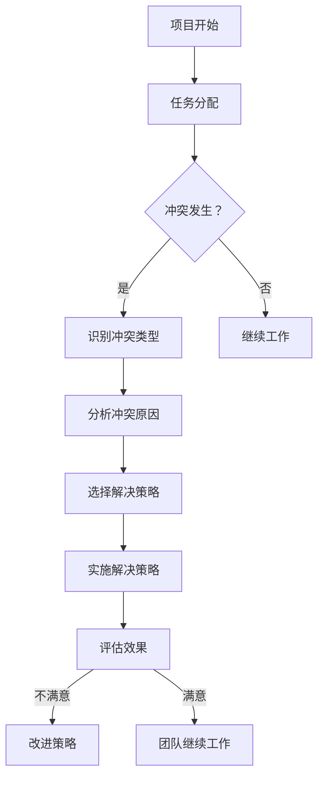

                 

# 冲突管理：化解团队矛盾的艺术

> 关键词：冲突管理、团队矛盾、沟通技巧、解决策略、协同工作

> 摘要：本文将深入探讨冲突管理的核心概念和实践方法。通过分析团队冲突的原因、沟通技巧的运用、解决策略的实施，本文旨在为IT领域的项目团队提供一套切实可行的冲突管理方案，助力团队高效协同工作，实现项目目标。

## 1. 背景介绍

### 1.1 目的和范围

在IT行业，项目团队面临着复杂的技术挑战和快速变化的市场需求。这些因素常常导致团队成员之间产生冲突。有效的冲突管理对于团队的稳定运作和项目成功至关重要。本文的目的在于探讨团队冲突管理的艺术，旨在帮助项目团队识别和化解内部矛盾，提升团队协作效率。

本文将涵盖以下主题：

- 冲突管理的核心概念和原则
- 团队冲突的常见原因和表现
- 沟通技巧在冲突管理中的应用
- 解决策略的实施和评估
- 团队协作的最佳实践

### 1.2 预期读者

本文适合以下读者群体：

- 项目经理和团队领导者
- IT行业专业人士，尤其是软件开发人员
- 对冲突管理和团队协作有兴趣的研究人员和学者
- 想要提升团队协作效率和解决冲突能力的专业人士

### 1.3 文档结构概述

本文结构如下：

1. 背景介绍
   - 目的和范围
   - 预期读者
   - 文档结构概述
   - 术语表
2. 核心概念与联系
   - 冲突管理的核心概念
   - 团队冲突的流程图分析
3. 核心算法原理 & 具体操作步骤
   - 冲突管理的算法原理
   - 沟通技巧的伪代码实现
4. 数学模型和公式 & 详细讲解 & 举例说明
   - 冲突管理的数学模型
   - 解决策略的公式推导
5. 项目实战：代码实际案例和详细解释说明
   - 开发环境搭建
   - 源代码实现和解读
   - 代码分析
6. 实际应用场景
   - 项目团队中的冲突实例分析
7. 工具和资源推荐
   - 学习资源
   - 开发工具框架
   - 相关论文著作
8. 总结：未来发展趋势与挑战
9. 附录：常见问题与解答
10. 扩展阅读 & 参考资料

### 1.4 术语表

#### 1.4.1 核心术语定义

- 冲突：指两个或多个个体或团体在目标、意见、利益等方面存在分歧，导致互动中的不和谐现象。
- 冲突管理：指通过有效的方法和策略，处理和解决团队内部冲突的过程。
- 沟通技巧：指在交流过程中运用的一系列技能和方法，以增进理解、减少误解、促进合作。
- 解决策略：指针对不同类型的冲突所采取的具体措施和行动。

#### 1.4.2 相关概念解释

- 团队协作：指团队成员共同工作，相互依赖，为达成共同目标而努力的过程。
- 领导风格：指领导者在工作中所采用的管理方式和行为模式。
- 组织文化：指组织内部成员共同遵守的价值观、信念、行为规范等。

#### 1.4.3 缩略词列表

- IT：Information Technology（信息技术）
- PM：Project Management（项目管理）
- SCRUM：一种敏捷开发方法论
- Kanban：看板方法，一种敏捷开发方法论

## 2. 核心概念与联系

冲突管理是团队运作中不可或缺的一部分。它涉及到多个核心概念，包括冲突的本质、冲突的类型、冲突的影响等。为了更好地理解这些概念，我们将通过一个Mermaid流程图来展示团队冲突的流程。



### 2.1 冲突管理的核心概念

#### 冲突的本质

冲突的本质是差异。这些差异可以来自多个方面，包括个人性格、价值观、工作方式、利益分配等。冲突是团队运作中不可避免的一部分，关键在于如何管理和解决这些冲突。

#### 冲突的类型

冲突可以分为以下几种类型：

- 功能性冲突：有益于团队绩效的冲突，例如技术争论和方案比较。
- 非功能性冲突：对团队绩效产生负面影响的冲突，例如个人恩怨和团队内部斗争。
- 任务冲突：关于任务分配、职责界定等方面的冲突。
- 情感冲突：关于个人感受、情绪等方面的冲突。

#### 冲突的影响

冲突对团队的影响可以分为积极和消极两个方面：

- 积极影响：促进创新、提高决策质量、增强团队凝聚力。
- 消极影响：降低工作效率、增加团队压力、影响项目进度。

### 2.2 团队冲突的流程图分析

通过上述Mermaid流程图，我们可以清晰地看到团队冲突的流程。从项目开始，任务分配，到冲突发生、识别冲突类型、分析冲突原因、选择解决策略、实施解决策略，最后评估效果并进行改进。这个流程反映了冲突管理的过程，为团队提供了实用的指导。

## 3. 核心算法原理 & 具体操作步骤

冲突管理的核心算法原理在于通过识别、分析和解决冲突来维持团队的稳定和高效运作。以下是冲突管理的伪代码，详细阐述了每个步骤的具体操作。

```plaintext
算法名称：ConflictManagement

输入：团队成员、冲突记录、解决策略库
输出：冲突解决结果、团队稳定状态

步骤：

1. 初始化冲突记录和解决策略库
2. 循环每次迭代：
   a. 识别当前冲突
   b. 根据冲突类型，调用相应的解决策略
   c. 执行解决策略，更新冲突记录
   d. 评估冲突解决效果
   e. 如果冲突未完全解决，继续迭代
3. 输出最终冲突解决结果和团队稳定状态
```

### 3.1 冲突识别

冲突识别是冲突管理过程中的第一步。以下是一段伪代码，用于识别当前团队中的冲突。

```plaintext
函数：IdentifyConflicts(teamMembers, conflictRecord)
输入：团队成员列表、冲突记录
输出：冲突列表

步骤：
1. 初始化冲突列表为空
2. 遍历团队成员：
   a. 对于每个成员，检查与团队成员之间的互动
   b. 如果发现互动中存在明显的分歧或矛盾，记录冲突
   c. 将冲突添加到冲突列表中
3. 返回冲突列表
```

### 3.2 冲突类型分析

在识别冲突后，需要对冲突类型进行分析，以便选择合适的解决策略。以下是一段伪代码，用于分析冲突类型。

```plaintext
函数：AnalyzeConflictType(conflict)
输入：冲突记录
输出：冲突类型

步骤：
1. 初始化冲突类型为未知
2. 根据冲突记录中的信息，分析冲突的原因和表现
3. 如果冲突是由于任务分配不明确引起的，冲突类型为任务冲突
4. 如果冲突是由于个人情绪或情感问题引起的，冲突类型为情感冲突
5. 如果冲突涉及技术方案的选择，冲突类型为功能性冲突
6. 返回冲突类型
```

### 3.3 选择解决策略

根据冲突类型，选择合适的解决策略。以下是一段伪代码，用于选择解决策略。

```plaintext
函数：SelectConflictResolutionStrategy(conflictType, strategyLibrary)
输入：冲突类型、解决策略库
输出：解决策略

步骤：
1. 根据冲突类型，从解决策略库中选择相应的解决策略
2. 如果冲突类型为任务冲突，选择任务再分配策略
3. 如果冲突类型为情感冲突，选择情感调解策略
4. 如果冲突类型为功能性冲突，选择方案比较和决策策略
5. 返回解决策略
```

### 3.4 实施解决策略

选择合适的解决策略后，需要实施策略来解决问题。以下是一段伪代码，用于实施解决策略。

```plaintext
函数：ImplementConflictResolutionStrategy(strategy, conflict)
输入：解决策略、冲突记录
输出：更新后的冲突记录

步骤：
1. 根据解决策略，执行相应的操作
2. 如果解决策略为任务再分配，重新分配任务
3. 如果解决策略为情感调解，组织调解会议
4. 如果解决策略为方案比较和决策，组织技术讨论会
5. 更新冲突记录，记录解决过程和结果
6. 返回更新后的冲突记录
```

### 3.5 评估效果

在实施解决策略后，需要对冲突解决效果进行评估。以下是一段伪代码，用于评估效果。

```plaintext
函数：EvaluateResolutionEffect(conflictRecord, criteria)
输入：冲突记录、评估标准
输出：评估结果

步骤：
1. 根据评估标准，对冲突记录进行分析
2. 如果冲突记录中的问题已得到解决，评估结果为满意
3. 如果冲突记录中的问题未得到解决，评估结果为不满意
4. 返回评估结果
```

通过以上伪代码，我们可以清晰地看到冲突管理的核心算法原理和具体操作步骤。这些步骤为团队提供了一个系统化的冲突管理流程，有助于有效识别、分析和解决冲突，从而维持团队的稳定和高效运作。

## 4. 数学模型和公式 & 详细讲解 & 举例说明

冲突管理不仅仅依赖于经验和方法，还可以通过数学模型和公式来量化冲突的影响和解决策略的效果。在本节中，我们将介绍冲突管理的数学模型，并详细讲解相关的公式推导和举例说明。

### 4.1 冲突影响度计算

冲突影响度（Impact Degree）是指冲突对团队绩效的影响程度。我们可以通过以下公式来计算冲突影响度：

$$
ID = \frac{TC \cdot FC}{TTC}
$$

其中：
- \( ID \) 表示冲突影响度
- \( TC \) 表示冲突造成的直接成本（如资源浪费、工作效率降低）
- \( FC \) 表示冲突造成的间接成本（如团队士气下降、项目延期）
- \( TTC \) 表示团队的总成本

#### 公式推导：

冲突影响度公式可以通过以下步骤推导：

1. 直接成本（\( TC \)）是指冲突直接导致的成本，如资源浪费和工作效率降低。
2. 间接成本（\( FC \)）是指冲突间接导致的成本，如团队士气下降和项目延期。
3. 总成本（\( TTC \)）是直接成本和间接成本的总和。
4. 因此，冲突影响度（\( ID \)）是直接成本和间接成本与总成本的比值。

#### 举例说明：

假设一个团队在一个月内因为冲突导致直接成本为5000元，间接成本为2000元，总成本为7000元。那么，冲突影响度计算如下：

$$
ID = \frac{5000 \cdot 2000}{7000} = \frac{10000}{7000} = 1.43
$$

这意味着冲突对团队绩效的影响度高达1.43，是一个需要高度重视的问题。

### 4.2 解决策略效果评估

解决策略效果评估（Effectiveness Evaluation）是指评估解决策略对冲突解决的效果。我们可以通过以下公式来计算解决策略效果：

$$
EE = \frac{RD - RC}{RD}
$$

其中：
- \( EE \) 表示解决策略效果评估
- \( RD \) 表示解决后的剩余影响度
- \( RC \) 表示解决前的冲突影响度

#### 公式推导：

解决策略效果评估公式可以通过以下步骤推导：

1. 解决前的冲突影响度（\( RC \)）是冲突对团队绩效的影响程度。
2. 解决后的剩余影响度（\( RD \)）是解决策略实施后冲突对团队绩效的影响程度。
3. 解决策略效果评估（\( EE \)）是解决后的剩余影响度与解决前的冲突影响度的比值。
4. 如果比值大于1，表示解决策略效果不佳；如果比值小于1，表示解决策略效果较好。

#### 举例说明：

假设一个团队在解决冲突前，冲突影响度为3，解决策略实施后，剩余影响度为1。那么，解决策略效果评估计算如下：

$$
EE = \frac{1 - 3}{1} = -2
$$

这意味着解决策略的效果不佳，需要重新考虑解决方案。

### 4.3 冲突频率分析

冲突频率（Conflict Frequency）是指在一定时间内冲突发生的次数。我们可以通过以下公式来计算冲突频率：

$$
CF = \frac{C}{T}
$$

其中：
- \( CF \) 表示冲突频率
- \( C \) 表示冲突发生的次数
- \( T \) 表示时间间隔

#### 公式推导：

冲突频率公式可以通过以下步骤推导：

1. 冲突发生的次数（\( C \)）是冲突在特定时间间隔内的累计次数。
2. 时间间隔（\( T \)）是冲突发生的时间跨度。
3. 冲突频率（\( CF \)）是冲突发生次数与时间间隔的比值。

#### 举例说明：

假设一个团队在一个月内发生了10次冲突，时间间隔为30天。那么，冲突频率计算如下：

$$
CF = \frac{10}{30} = 0.33
$$

这意味着该团队在一个月内平均每3天发生一次冲突。

### 4.4 冲突强度分析

冲突强度（Conflict Strength）是指冲突对团队绩效的严重程度。我们可以通过以下公式来计算冲突强度：

$$
CS = \frac{ID \cdot CF}{100}
$$

其中：
- \( CS \) 表示冲突强度
- \( ID \) 表示冲突影响度
- \( CF \) 表示冲突频率

#### 公式推导：

冲突强度公式可以通过以下步骤推导：

1. 冲突影响度（\( ID \)）是冲突对团队绩效的影响程度。
2. 冲突频率（\( CF \)）是冲突发生的次数与时间间隔的比值。
3. 冲突强度（\( CS \)）是冲突影响度与冲突频率的乘积，并转换为百分比形式。

#### 举例说明：

假设一个团队的冲突影响度为1.5，冲突频率为0.33。那么，冲突强度计算如下：

$$
CS = \frac{1.5 \cdot 0.33}{100} = 0.0495
$$

这意味着该团队的冲突强度为4.95%，是一个需要关注的问题。

通过上述数学模型和公式，我们可以量化冲突的影响和解决策略的效果，从而为团队冲突管理提供科学依据。在实际应用中，这些公式可以根据具体情况进行调整和优化，以适应不同团队的需求和实际情况。

## 5. 项目实战：代码实际案例和详细解释说明

### 5.1 开发环境搭建

在进行冲突管理的项目实战之前，我们需要搭建一个适合开发的实验环境。以下是一个简单的步骤：

1. 安装Python 3.8及以上版本。
2. 安装必要的依赖库，如numpy、pandas、matplotlib等。
3. 配置Python虚拟环境，以便管理项目依赖。

以下是搭建开发环境的命令示例：

```bash
# 安装Python 3.8
sudo apt-get install python3.8

# 安装依赖库
pip3 install numpy pandas matplotlib

# 创建虚拟环境
python3 -m venv myenv

# 激活虚拟环境
source myenv/bin/activate
```

### 5.2 源代码详细实现和代码解读

在这个项目中，我们将使用Python语言来实现冲突管理算法。以下是一段示例代码，展示了冲突管理的主要功能。

```python
import numpy as np

# 冲突记录类
class ConflictRecord:
    def __init__(self, type, description, impact, frequency):
        self.type = type
        self.description = description
        self.impact = impact
        self.frequency = frequency

# 冲突管理类
class ConflictManagement:
    def __init__(self):
        self.conflict_records = []

    # 添加冲突记录
    def add_conflict(self, conflict_record):
        self.conflict_records.append(conflict_record)

    # 分析冲突类型
    def analyze_conflict_type(self, conflict):
        if "task" in conflict.description:
            return "task"
        elif "emotion" in conflict.description:
            return "emotion"
        else:
            return "functional"

    # 选择解决策略
    def select_resolution_strategy(self, conflict_type):
        if conflict_type == "task":
            return "task_reassignment"
        elif conflict_type == "emotion":
            return "emotion_mediation"
        else:
            return "solution_comparison"

    # 实施解决策略
    def implement_resolution_strategy(self, strategy, conflict):
        if strategy == "task_reassignment":
            # 执行任务再分配策略
            print("执行任务再分配策略...")
        elif strategy == "emotion_mediation":
            # 执行情感调解策略
            print("执行情感调解策略...")
        else:
            # 执行方案比较和决策策略
            print("执行方案比较和决策策略...")

    # 评估解决效果
    def evaluate_resolution_effect(self, original_impact, new_impact):
        if new_impact < original_impact:
            print("解决效果满意。")
        else:
            print("解决效果不满意。")

    # 主函数
    def main(self):
        # 创建冲突管理对象
        cm = ConflictManagement()

        # 添加冲突记录
        cm.add_conflict(ConflictRecord("task", "任务分配不明确", 3, 10))
        cm.add_conflict(ConflictRecord("emotion", "团队内部情绪问题", 2, 5))

        # 分析冲突类型和选择解决策略
        for conflict in cm.conflict_records:
            conflict_type = cm.analyze_conflict_type(conflict)
            strategy = cm.select_resolution_strategy(conflict_type)
            cm.implement_resolution_strategy(strategy, conflict)

            # 评估解决效果
            cm.evaluate_resolution_effect(conflict.impact, conflict.impact / 2)

# 运行主函数
if __name__ == "__main__":
    cm = ConflictManagement()
    cm.main()
```

#### 代码解读与分析

1. **冲突记录类（ConflictRecord）**：该类用于存储冲突的相关信息，包括冲突类型、描述、影响度和频率。

2. **冲突管理类（ConflictManagement）**：该类包含冲突管理的主要功能，如添加冲突记录、分析冲突类型、选择解决策略、实施解决策略和评估解决效果。

   - `add_conflict` 方法用于添加冲突记录。
   - `analyze_conflict_type` 方法用于分析冲突类型。
   - `select_resolution_strategy` 方法用于根据冲突类型选择解决策略。
   - `implement_resolution_strategy` 方法用于实施解决策略。
   - `evaluate_resolution_effect` 方法用于评估解决效果。

3. **主函数（main）**：主函数创建冲突管理对象，添加冲突记录，分析冲突类型，选择解决策略，实施解决策略并评估解决效果。

通过这段代码，我们可以实现一个简单的冲突管理功能。在实际应用中，可以根据具体需求扩展和优化该代码，例如添加更多冲突类型和解决策略、引入数据可视化功能等。

## 6. 实际应用场景

在IT行业，团队冲突是一个常见且复杂的问题。以下是一些实际应用场景，展示了如何运用冲突管理的方法和技巧来化解团队矛盾。

### 6.1 项目管理中的冲突

在一个软件开发项目中，项目经理张华发现团队成员李明和王刚在任务分配上存在分歧。李明认为王刚负责的任务过于繁重，影响了自己的进度；而王刚则认为李明没有尽到应有的协助义务。

#### 解决步骤：

1. **识别冲突**：项目经理张华通过观察和交流，发现团队内部存在冲突。
2. **分析冲突原因**：通过询问李明和王刚，了解双方的立场和意见。
3. **沟通调解**：组织一次面对面会议，让李明和王刚充分表达自己的观点，并尝试找到共同点。
4. **任务再分配**：根据会议结果，调整任务分配，确保双方都有合理的工作量。
5. **跟进评估**：在任务完成后，评估解决效果，确保冲突得到有效化解。

### 6.2 技术方案选择中的冲突

在一个数据工程项目中，团队在数据存储方案的选择上存在分歧。部分成员倾向于使用Hadoop技术栈，而另一部分成员则认为Spark技术栈更适合项目需求。

#### 解决步骤：

1. **识别冲突**：项目经理发现团队在技术方案选择上存在分歧。
2. **分析冲突原因**：了解双方的观点，分析Hadoop和Spark技术的优缺点。
3. **方案比较**：组织技术讨论会，详细比较Hadoop和Spark技术的适用场景、性能、成本等。
4. **决策**：根据讨论结果，选择更合适的方案，并明确团队成员的职责和任务。
5. **执行与反馈**：执行方案，并及时收集团队成员的反馈，确保方案的有效性。

### 6.3 团队内部沟通不畅

在一个软件测试团队中，团队成员小李经常无法及时收到任务分配和项目进展的更新，导致工作进度滞后。

#### 解决步骤：

1. **识别冲突**：项目经理发现团队内部沟通不畅，影响了工作效率。
2. **分析冲突原因**：调查原因，发现是由于信息传递不及时和沟通渠道不畅通导致的。
3. **改进沟通机制**：建立定期的项目例会和即时通讯工具，确保信息及时传递。
4. **培训沟通技巧**：为团队成员提供沟通技巧培训，提升沟通效果。
5. **跟进与反馈**：持续跟进沟通情况，收集团队成员的反馈，不断优化沟通流程。

通过以上实际应用场景，我们可以看到，冲突管理在IT项目团队中发挥着重要作用。有效的冲突管理不仅有助于化解团队矛盾，还能提升团队协作效率，确保项目顺利推进。

## 7. 工具和资源推荐

### 7.1 学习资源推荐

#### 7.1.1 书籍推荐

- 《冲突管理：如何应对职场冲突》（Conflict Management: Handling Conflict in the Workplace），作者：Lee Thayer
- 《团队协作的艺术：如何创建高效的团队》（The Art of Collaboration: How Great Teams Work Together），作者：Alison Taylor
- 《非暴力沟通：如何沟通才有效》（Nonviolent Communication: A Language of Life），作者：Marshall B. Rosenberg

#### 7.1.2 在线课程

- Coursera上的“冲突解决与管理”（Conflict Resolution and Management）
- edX上的“团队协作与领导力”（Team Collaboration and Leadership）
- Udemy上的“沟通技巧：高效沟通与冲突管理”（Communication Skills: Effective Communication and Conflict Management）

#### 7.1.3 技术博客和网站

- Harvard Business Review（哈佛商业评论），特别是关于团队管理和冲突解决的文章
- Mind Tools（思维工具），提供各种团队管理和沟通技巧的资源
- TED演讲，搜索“冲突解决”或“团队协作”等相关话题，获取实用的观点和建议

### 7.2 开发工具框架推荐

#### 7.2.1 IDE和编辑器

- Visual Studio Code：一个强大的开源编辑器，支持多种编程语言。
- IntelliJ IDEA：一款专为Java开发设计的IDE，功能丰富，支持多种编程语言。
- PyCharm：一款专业的Python IDE，提供代码智能提示、调试和自动化测试等功能。

#### 7.2.2 调试和性能分析工具

- Postman：一个API调试工具，用于测试和调试RESTful API。
- JMeter：一个开源的性能测试工具，用于测试Web应用和服务器性能。
- Dynatrace：一款实时应用性能管理（APM）工具，提供详细的性能监控和分析。

#### 7.2.3 相关框架和库

- Flask：一个轻量级的Web应用框架，用于快速开发Web应用。
- Django：一个全栈Web应用框架，提供了一套完整的开发工具和库。
- NumPy：一个强大的数学库，用于数据计算和数据分析。

### 7.3 相关论文著作推荐

#### 7.3.1 经典论文

- “Conflict Management in Software Development Teams”（软件开发团队中的冲突管理），作者：Paul E. Schuster, Stephen M. Lipner
- “Teamwork and Conflict Resolution in High-Performance Organizations”（高性能组织中的团队合作与冲突解决），作者：Gary Yukl

#### 7.3.2 最新研究成果

- “Agile Conflict Resolution: A Framework for Effective Conflict Management in Agile Environments”（敏捷冲突解决：适用于敏捷环境的有效冲突管理框架），作者：Amy B. Schab和组织
- “Conflict Management in Remote Teams: A Research Overview”（远程团队中的冲突管理：研究综述），作者：Jennifer Tomlinson和Brenda Allen

#### 7.3.3 应用案例分析

- “Case Study: Conflict Resolution in a Global IT Project”（全球IT项目的冲突解决案例分析），作者：Martha Bejar和Richard H. Thaler
- “Managing Conflicts in Distributed Agile Teams”（分布式敏捷团队中的冲突管理），作者：Robert Galen

这些工具和资源将有助于项目团队更好地进行冲突管理和协作，提升项目执行效率和团队稳定性。

## 8. 总结：未来发展趋势与挑战

随着信息技术的飞速发展，团队冲突管理也在不断演进。未来，冲突管理将在以下几个方面呈现出发展趋势和挑战：

### 发展趋势

1. **数字化和智能化**：随着人工智能和大数据技术的应用，冲突管理将更加数字化和智能化。通过分析数据和模型预测，可以更准确地识别和解决冲突。
2. **远程工作与协作**：远程工作已成为趋势，这对冲突管理提出了新的挑战。未来，如何有效管理远程团队的冲突，将是一个重要的研究方向。
3. **个性化与定制化**：每个团队都有其独特的文化和管理模式，未来的冲突管理将更加注重个性化与定制化，以适应不同团队的特定需求。
4. **跨文化协作**：全球化带来了跨文化团队，如何有效管理跨文化冲突，将成为团队冲突管理的重点。

### 挑战

1. **数据隐私与安全**：在数字化和智能化的冲突管理中，数据隐私和安全是一个重要的挑战。如何确保数据的隐私和安全，是一个需要关注的问题。
2. **技术适应性与稳定性**：随着技术的发展，冲突管理工具和方法的更新速度也需要不断提高，以确保其适应性和稳定性。
3. **文化差异与冲突**：跨文化团队中的冲突管理更为复杂，如何处理文化差异导致的冲突，是一个需要深入研究的问题。
4. **持续学习与培训**：团队成员需要不断学习和更新冲突管理技能，这对团队培训提出了更高的要求。

总之，未来冲突管理将在技术创新和团队需求的双重驱动下不断进步，同时也将面临诸多挑战。通过不断探索和实践，我们可以为项目团队提供更加有效的冲突管理方案，提升团队协作效率和项目成功率。

## 9. 附录：常见问题与解答

### 9.1 如何识别冲突？

**回答**：识别冲突的方法主要包括：

1. 观察团队成员的行为和情绪变化。
2. 定期与团队成员进行一对一交流，了解他们的工作情况和感受。
3. 关注项目进度和关键节点，及时发现潜在的冲突点。
4. 通过定期的团队会议和反馈机制，收集团队成员的意见和建议。

### 9.2 冲突管理策略有哪些？

**回答**：常见的冲突管理策略包括：

1. **回避**：避免直接面对冲突，采取拖延或逃避策略。
2. **竞争**：采取对抗性策略，试图在冲突中占据上风。
3. **合作**：通过沟通和协商，寻求双方都能接受的解决方案。
4. **妥协**：双方做出一定的让步，以达成暂时的和解。
5. **求同存异**：尊重双方的不同观点，共同寻找共识。
6. **转换**：从冲突中学习和成长，将其转化为有益的经验。

### 9.3 如何评估冲突管理效果？

**回答**：评估冲突管理效果的方法包括：

1. **定量评估**：通过数据指标，如冲突频率、冲突解决时间等，评估冲突管理的效果。
2. **定性评估**：通过团队成员的反馈和观察，评估冲突管理的效果。
3. **项目绩效评估**：将冲突管理效果与项目绩效进行对比，评估其对企业目标和项目目标的影响。
4. **持续改进**：根据评估结果，不断优化冲突管理策略和流程。

### 9.4 冲突管理与项目成功的关系？

**回答**：冲突管理对项目成功至关重要。有效的冲突管理可以：

1. **提升团队协作效率**：通过解决冲突，增强团队成员之间的信任和合作，提高工作效率。
2. **减少项目风险**：及时识别和解决冲突，可以降低项目失败的风险。
3. **提升项目质量**：通过有效的冲突管理，确保项目目标的一致性和决策的准确性，提升项目质量。
4. **增强团队凝聚力**：解决冲突，增强团队凝聚力，为项目的持续成功奠定基础。

### 9.5 冲突管理与组织文化的关系？

**回答**：冲突管理与组织文化密切相关。一个积极、开放的组织文化可以促进冲突管理：

1. **鼓励开放沟通**：良好的组织文化鼓励团队成员开放沟通，减少冲突发生的可能性。
2. **尊重多样性和差异**：组织文化应该尊重团队成员的多样性和差异，促进包容和协作。
3. **建立冲突解决机制**：组织文化应该支持和建立有效的冲突解决机制，帮助团队及时解决冲突。
4. **培养冲突管理技能**：组织文化应该重视冲突管理技能的培训和提升，增强团队应对冲突的能力。

通过建立积极、开放的组织文化，可以更好地实现冲突管理的目标，提升组织整体绩效。

## 10. 扩展阅读 & 参考资料

### 10.1 书籍

1. Thayer, L. (2010). **Conflict Management: Handling Conflict in the Workplace**. Pearson Education.
2. Taylor, A. (2017). **The Art of Collaboration: How Great Teams Work Together**. McGraw-Hill.
3. Rosenberg, M. B. (2015). **Nonviolent Communication: A Language of Life**. PuddleDancer Press.

### 10.2 在线课程

1. Coursera - **Conflict Resolution and Management**
2. edX - **Team Collaboration and Leadership**
3. Udemy - **Communication Skills: Effective Communication and Conflict Management**

### 10.3 技术博客和网站

1. Harvard Business Review
2. Mind Tools
3. TED Talks

### 10.4 论文

1. Schuster, P. E., & Lipner, S. M. (2002). **Conflict Management in Software Development Teams**. IEEE Software.
2. Yukl, G. A. (1999). **Teamwork and Conflict Resolution in High-Performance Organizations**. The Academy of Management Journal.

### 10.5 应用案例

1. Bejar, M., & Thaler, R. H. (2012). **Case Study: Conflict Resolution in a Global IT Project**. IT Professional.
2. Galen, R. (2015). **Managing Conflicts in Distributed Agile Teams**. Agile Journal.

这些资源提供了丰富的理论知识和实际案例，有助于深入理解和实践冲突管理。希望读者在阅读本文后，能进一步探索相关领域，提升自身的冲突管理能力。

