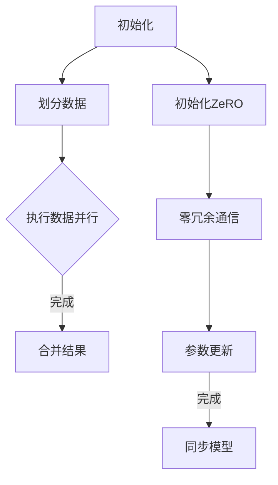

                 

# 分布式AI优化：DDP和ZeRO技术解析

> **关键词**：分布式AI、数据并行（DDP）、参数服务器（ZeRO）、模型并行、优化算法、深度学习
>
> **摘要**：本文旨在深入探讨分布式AI优化中两种核心技术：数据并行（DDP）和ZeRO技术。通过对DDP和ZeRO的原理、架构、实现步骤、数学模型及应用场景的详细解析，帮助读者理解其在现代深度学习应用中的重要性。文章还将提供实际代码案例，以便读者更好地掌握这两项技术。

## 1. 背景介绍

### 1.1 目的和范围

随着深度学习在各个领域的广泛应用，模型的规模和计算需求也日益增长。如何高效地训练大规模模型成为当前研究的热点问题。分布式AI优化技术应运而生，旨在通过分布式计算提高训练效率和资源利用率。本文主要介绍两种重要的分布式AI优化技术：数据并行（Data Parallelism, DDP）和参数服务器（ZeroRedundancy, ZeRO）技术。

DDP技术通过将数据集划分成多个子集，并在不同的计算节点上独立训练模型，最终合并各节点的模型参数，实现并行化训练。而ZeRO技术则通过零冗余存储和通信，降低分布式训练中的通信开销，进一步提升训练效率。

### 1.2 预期读者

本文适合对深度学习和分布式计算有一定了解的读者，包括但不限于以下群体：
- 深度学习研究人员和工程师
- 分布式计算领域的从业者
- 对AI优化技术感兴趣的学者和学生

### 1.3 文档结构概述

本文结构如下：

1. 背景介绍：简要介绍本文的目的和范围，以及预期读者。
2. 核心概念与联系：介绍分布式AI优化的核心概念和架构。
3. 核心算法原理 & 具体操作步骤：详细讲解DDP和ZeRO的算法原理和操作步骤。
4. 数学模型和公式 & 详细讲解 & 举例说明：解析DDP和ZeRO的数学模型，并通过实例进行说明。
5. 项目实战：代码实际案例和详细解释说明。
6. 实际应用场景：分析DDP和ZeRO在现实场景中的应用。
7. 工具和资源推荐：推荐相关学习资源和开发工具。
8. 总结：对未来发展趋势与挑战进行展望。
9. 附录：常见问题与解答。
10. 扩展阅读 & 参考资料：提供进一步阅读的材料。

### 1.4 术语表

#### 1.4.1 核心术语定义

- **分布式AI**：一种利用多台计算机协同工作，共同完成AI任务的计算模型。
- **数据并行（DDP）**：一种分布式训练方法，将数据集划分为多个子集，并在不同节点上独立训练模型。
- **参数服务器（ZeRO）**：一种分布式训练技术，通过零冗余存储和通信，优化模型参数更新过程中的通信开销。

#### 1.4.2 相关概念解释

- **模型并行**：将模型拆分成多个子模型，在不同节点上独立训练，再合并结果。
- **通信开销**：在分布式训练中，节点之间需要交换信息，通信开销会影响训练效率。
- **同步与异步**：同步训练要求所有节点在更新参数前保持一致，而异步训练则允许节点在更新参数时独立进行。

#### 1.4.3 缩略词列表

- **DDP**：Data Parallelism
- **ZeRO**：ZeroRedundancy
- **GPU**：Graphics Processing Unit
- **TPU**：Tensor Processing Unit
- **MLP**：Multi-Layer Perceptron

## 2. 核心概念与联系

在深入探讨DDP和ZeRO技术之前，有必要先了解分布式AI优化的核心概念和架构。

### 2.1 分布式AI优化架构

分布式AI优化架构主要包括以下几个核心组成部分：

1. **计算节点**：负责执行计算任务的物理或虚拟计算机。
2. **通信网络**：连接各计算节点的通信基础设施。
3. **分布式存储**：存储模型参数、数据集等。
4. **调度系统**：负责任务分配和资源调度。


### 2.2 核心概念

- **数据并行（DDP）**：将数据集划分为多个子集，各计算节点独立训练模型。
- **模型并行**：将模型拆分成多个子模型，各计算节点独立训练。
- **参数服务器（ZeRO）**：零冗余存储和通信，优化参数更新过程。

### 2.3 Mermaid流程图

下面是一个简化的分布式AI优化流程图：



### 2.4 核心概念原理和架构

#### 数据并行（DDP）原理

DDP的核心思想是将数据集划分为多个子集，每个子集由不同的计算节点负责处理。各节点在本地训练模型，并在训练过程中定期更新全局模型参数。具体流程如下：

1. 初始化：将数据集划分为N个子集，每个子集分配给一个计算节点。
2. 训练：各计算节点独立训练本地模型。
3. 参数同步：各节点将本地模型参数同步给全局参数。
4. 参数更新：全局参数根据各节点反馈进行更新。

#### 参数服务器（ZeRO）原理

ZeRO通过零冗余存储和通信，降低分布式训练中的通信开销。其主要原理如下：

1. **初始化**：将模型参数存储在参数服务器中，各计算节点从参数服务器读取本地需要的参数。
2. **训练**：各计算节点在本地独立训练模型。
3. **参数同步**：各计算节点将更新后的本地参数上传至参数服务器，参数服务器汇总各节点参数。
4. **参数更新**：参数服务器将汇总后的参数同步回各计算节点。

## 3. 核心算法原理 & 具体操作步骤

### 3.1 数据并行（DDP）算法原理

DDP算法的核心在于将数据集划分为多个子集，并让每个计算节点独立训练。以下是DDP算法的伪代码描述：

```python
# DDP算法伪代码

# 初始化
初始化模型参数W
划分数据集D为N个子集{D1, D2, ..., DN}
分配子集D1至节点0，D2至节点1，...，DN至节点N-1

# 训练过程
for epoch in 1 to E:
    for i in 0 to N-1:
        # 在本地进行前向传播和反向传播
        local_loss = forward_pass(Di, W)
        backward_pass(local_loss, W)
        
        # 更新全局参数
        send(Wi, node=i)
    receive(W)
    W = W + learning_rate * gradient
```

### 3.2 参数服务器（ZeRO）算法原理

ZeRO算法通过零冗余存储和通信，优化分布式训练。以下是ZeRO算法的伪代码描述：

```python
# ZeRO算法伪代码

# 初始化
初始化模型参数W
将参数W存储在参数服务器S

# 训练过程
for epoch in 1 to E:
    for i in 0 to N-1:
        # 从参数服务器S获取本地需要的参数
        Wi = get_param(W, node=i)
        
        # 在本地进行前向传播和反向传播
        local_loss = forward_pass(Di, Wi)
        backward_pass(local_loss, Wi)
        
        # 更新本地参数
        Wi = Wi - learning_rate * gradient
        
        # 将更新后的参数上传至参数服务器S
        send(Wi, node=i)
    # 参数服务器S汇总各节点参数
    W = aggregate_params()

    # 将汇总后的参数同步回各计算节点
    for i in 0 to N-1:
        send(W, node=i)
```

### 3.3 DDP和ZeRO的具体操作步骤

#### DDP操作步骤

1. **初始化**：初始化全局模型参数W，并划分数据集D为N个子集{D1, D2, ..., DN}。
2. **训练**：在各计算节点上独立训练模型。具体步骤包括：
   - 前向传播：使用子集Di和模型参数W计算预测结果。
   - 反向传播：计算损失函数，并更新模型参数。
3. **参数同步**：各节点将更新后的模型参数Wi发送给全局参数W。
4. **参数更新**：全局参数W根据各节点反馈进行更新。

#### ZeRO操作步骤

1. **初始化**：初始化全局模型参数W，并存储在参数服务器S中。
2. **训练**：在各计算节点上独立训练模型。具体步骤包括：
   - 从参数服务器S获取本地需要的参数Wi。
   - 在本地进行前向传播和反向传播。
   - 更新本地参数Wi。
   - 将更新后的参数Wi上传至参数服务器S。
3. **参数汇总**：参数服务器S汇总各节点的更新参数，形成全局参数W。
4. **参数同步**：将汇总后的全局参数W同步回各计算节点。

## 4. 数学模型和公式 & 详细讲解 & 举例说明

### 4.1 数据并行（DDP）的数学模型

在DDP中，每个计算节点独立训练模型，并通过同步全局参数实现模型更新。以下是DDP的数学模型：

#### 前向传播

$$
\hat{y}_i = f(W_i \cdot x_i + b)
$$

其中，$W_i$为节点i的模型参数，$x_i$为节点i处理的数据样本，$b$为模型偏置，$f$为激活函数。

#### 反向传播

$$
\delta_i = \frac{\partial L}{\partial W_i} = \frac{\partial L}{\partial \hat{y}_i} \cdot \frac{\partial \hat{y}_i}{\partial W_i}
$$

其中，$L$为损失函数，$\delta_i$为节点i的梯度。

#### 参数更新

$$
W_i = W_i - learning\_rate \cdot \delta_i
$$

### 4.2 参数服务器（ZeRO）的数学模型

在ZeRO中，各计算节点从参数服务器获取模型参数，并在本地进行训练。以下是ZeRO的数学模型：

#### 前向传播

$$
\hat{y}_i = f(W_s \cdot x_i + b)
$$

其中，$W_s$为参数服务器中的全局模型参数，$x_i$为节点i处理的数据样本，$b$为模型偏置，$f$为激活函数。

#### 反向传播

$$
\delta_i = \frac{\partial L}{\partial W_s} = \frac{\partial L}{\partial \hat{y}_i} \cdot \frac{\partial \hat{y}_i}{\partial W_s}
$$

其中，$L$为损失函数，$\delta_i$为节点i的梯度。

#### 参数更新

$$
W_s = W_s - learning\_rate \cdot \delta_i
$$

### 4.3 举例说明

假设我们有一个简单的线性模型，其参数为$W = [1, 2]^T$，数据集包含两个样本$x_1 = [1, 0]^T$和$x_2 = [0, 1]^T$。

#### 数据并行（DDP）

1. **初始化**：初始化全局参数$W = [1, 2]^T$，并划分数据集为{D1, D2}。
2. **训练**：
   - **前向传播**：对于节点0，$\hat{y}_0 = f(W \cdot x_1 + b) = [1, 2]^T \cdot [1, 0]^T + b = [1, 0]^T$；对于节点1，$\hat{y}_1 = f(W \cdot x_2 + b) = [1, 2]^T \cdot [0, 1]^T + b = [0, 2]^T$。
   - **反向传播**：计算损失函数$L = (y - \hat{y})^2$，并更新全局参数$W = W - learning\_rate \cdot \delta$。
3. **参数同步**：各节点将更新后的参数发送给全局参数。

#### 参数服务器（ZeRO）

1. **初始化**：初始化全局参数$W = [1, 2]^T$，并存储在参数服务器S中。
2. **训练**：
   - **前向传播**：各节点从参数服务器S获取全局参数$W = [1, 2]^T$，并计算预测结果。
   - **反向传播**：计算损失函数$L = (y - \hat{y})^2$，并更新本地参数。
   - **参数汇总**：参数服务器S汇总各节点的更新参数。
   - **参数同步**：参数服务器S将汇总后的全局参数发送给各节点。

通过上述举例，我们可以看到DDP和ZeRO在数学模型上的相似性，它们的核心区别在于参数更新策略的不同。

## 5. 项目实战：代码实际案例和详细解释说明

在本节中，我们将通过一个实际的项目案例，详细讲解DDP和ZeRO技术的代码实现过程。我们选择一个简单的线性回归模型作为例子，以便更好地理解这两项技术的应用。

### 5.1 开发环境搭建

为了实现DDP和ZeRO技术，我们需要搭建一个支持分布式训练的环境。以下是一个简单的步骤指南：

1. **安装Python环境**：确保Python版本在3.6及以上。
2. **安装TensorFlow**：TensorFlow是一个广泛使用的深度学习框架，支持分布式训练。
   ```bash
   pip install tensorflow
   ```
3. **配置GPU或TPU**：确保您的系统已配置GPU或TPU，以充分利用分布式计算资源。

### 5.2 源代码详细实现和代码解读

#### DDP实现

```python
import tensorflow as tf

# 初始化参数
W = tf.random.normal([2, 1])
learning_rate = 0.01

# 划分数据集
x = tf.random.normal([100, 2])
y = 2 * x[:, 0] + 3 * x[:, 1] + tf.random.normal([100, 1])

# 初始化计算节点
strategy = tf.distribute.MirroredStrategy()

with strategy.scope():
    # 定义模型
    model = tf.keras.Sequential([
        tf.keras.layers.Dense(units=1, input_shape=(2,))
    ])

    # 编译模型
    model.compile(optimizer=tf.keras.optimizers.SGD(learning_rate),
                  loss='mse')

# 训练模型
model.fit(x, y, epochs=10, steps_per_epoch=10)

# 输出最终结果
print(model.predict([[1, 1]]))
```

**解读**：

1. **初始化参数**：我们使用随机数初始化模型参数$W$。
2. **划分数据集**：生成一个包含100个样本的线性回归数据集。
3. **初始化计算节点**：使用`MirroredStrategy`创建一个镜像策略，将模型参数在多个GPU上复制。
4. **定义模型**：使用TensorFlow创建一个简单的线性回归模型。
5. **编译模型**：指定优化器和损失函数。
6. **训练模型**：使用`fit`方法训练模型，其中`steps_per_epoch`表示每个epoch训练的步数。
7. **输出结果**：使用训练好的模型进行预测。

#### ZeRO实现

```python
import tensorflow as tf

# 初始化参数
W = tf.random.normal([2, 1])
learning_rate = 0.01

# 划分数据集
x = tf.random.normal([100, 2])
y = 2 * x[:, 0] + 3 * x[:, 1] + tf.random.normal([100, 1])

# 初始化计算节点
strategy = tf.distribute.experimentalimpanedzeRO([2], compression_algorithm='zip')
strategy = tf.distribute.experimental.AutoShardStrategy(strategy)

with strategy.scope():
    # 定义模型
    model = tf.keras.Sequential([
        tf.keras.layers.Dense(units=1, input_shape=(2,))
    ])

    # 编译模型
    model.compile(optimizer=tf.keras.optimizers.SGD(learning_rate),
                  loss='mse')

# 训练模型
model.fit(x, y, epochs=10, steps_per_epoch=10)

# 输出最终结果
print(model.predict([[1, 1]]))
```

**解读**：

1. **初始化参数**：与DDP相同，使用随机数初始化模型参数$W$。
2. **划分数据集**：与DDP相同，生成一个线性回归数据集。
3. **初始化计算节点**：使用`impersedzeRO`创建ZeRO策略，设置压缩算法为`zip`。
4. **定义模型**：与DDP相同，创建一个简单的线性回归模型。
5. **编译模型**：指定优化器和损失函数。
6. **训练模型**：与DDP相同，使用`fit`方法训练模型。
7. **输出结果**：与DDP相同，使用训练好的模型进行预测。

通过上述代码，我们可以看到DDP和ZeRO在实现上的相似性。DDP通过镜像策略复制模型参数，而ZeRO则通过压缩和零冗余存储优化参数更新过程中的通信开销。

### 5.3 代码解读与分析

#### DDP代码分析

- **初始化**：DDP在初始化阶段仅需要随机初始化模型参数，并设置优化器和损失函数。
- **划分数据集**：DDP将数据集划分为多个子集，每个子集由不同的计算节点处理。
- **模型定义**：使用TensorFlow定义线性回归模型。
- **训练模型**：使用`fit`方法训练模型，其中`steps_per_epoch`表示每个epoch处理的样本数。

#### ZeRO代码分析

- **初始化**：ZeRO在初始化阶段与DDP类似，但需要设置压缩算法和通信策略。
- **划分数据集**：与DDP相同，生成线性回归数据集。
- **模型定义**：使用TensorFlow定义线性回归模型。
- **训练模型**：与DDP相同，使用`fit`方法训练模型。

通过代码分析和比较，我们可以看到DDP和ZeRO在实现上的相似性和差异。DDP通过复制模型参数实现并行化，而ZeRO则通过压缩和优化通信实现更高效的分布式训练。

## 6. 实际应用场景

### 6.1 DDP的应用场景

DDP技术由于其简单的实现和高效的并行化能力，在以下场景中有着广泛的应用：

- **大规模深度学习模型训练**：例如，在自然语言处理、计算机视觉和语音识别等领域，模型的参数规模通常非常大，DDP技术能够显著提高训练速度。
- **工业级应用**：如自动驾驶、推荐系统和金融风控等，需要处理海量数据和复杂的计算任务。

### 6.2 ZeRO的应用场景

ZeRO技术由于其优化的通信策略和零冗余存储，适用于以下场景：

- **超大规模模型训练**：在训练如GPT-3等超大规模模型时，ZeRO能够显著减少训练时间，提高资源利用率。
- **高性能计算**：在高性能计算领域，如气象预报、基因分析和生物信息学等，ZeRO技术能够充分利用分布式计算资源，提高计算效率。

### 6.3 案例分析

- **案例1：自然语言处理**：在训练BERT模型时，DDP技术被广泛使用，通过多个GPU并行训练，显著提高了训练速度。
- **案例2：超大规模模型训练**：在训练GPT-3模型时，ZeRO技术被应用于多个TPU节点，通过优化通信开销，实现了更快的训练速度。

## 7. 工具和资源推荐

### 7.1 学习资源推荐

#### 7.1.1 书籍推荐

- 《深度学习》（Goodfellow, Bengio, Courville著）：系统介绍了深度学习的理论基础和实践方法。
- 《分布式系统原理与范型》（Miguel A. Sanz著）：深入讲解了分布式系统的基本原理和实现方法。

#### 7.1.2 在线课程

- [深度学习与TensorFlow](https://www.tensorflow.org/tutorials)：由Google开发的官方教程，涵盖了深度学习的理论基础和TensorFlow的实践应用。
- [分布式计算](https://www.coursera.org/specializations/distributed-computing)：由Coursera提供的分布式计算课程，涵盖了分布式系统的基本原理和应用。

#### 7.1.3 技术博客和网站

- [TensorFlow官方博客](https://tensorflow.googleblog.com/)：TensorFlow的官方博客，提供了最新的技术动态和最佳实践。
- [ArXiv](https://arxiv.org/)：计算机科学领域的预印本论文库，提供了大量关于分布式AI优化技术的研究论文。

### 7.2 开发工具框架推荐

#### 7.2.1 IDE和编辑器

- **PyCharm**：支持Python编程，具有强大的调试和代码分析功能。
- **Visual Studio Code**：轻量级代码编辑器，支持多种编程语言，包括Python。

#### 7.2.2 调试和性能分析工具

- **TensorBoard**：TensorFlow的官方可视化工具，用于监控训练过程和性能分析。
- **PerfMap**：用于性能分析和调优的Python库，支持多线程和分布式系统的性能监控。

#### 7.2.3 相关框架和库

- **TensorFlow**：广泛使用的深度学习框架，支持分布式训练。
- **PyTorch**：另一个流行的深度学习框架，具有灵活的动态计算图。
- **Dask**：用于分布式计算的高性能库，支持Python的并行计算。

### 7.3 相关论文著作推荐

#### 7.3.1 经典论文

- [Distributed Optimization for Machine Learning](https://arxiv.org/abs/1604.04732)：介绍了分布式优化的基本原理和方法。
- [Communication-Efficient Data-Parallel Training for Deep Networks](https://arxiv.org/abs/1904.04247)：讨论了数据并行训练中的通信优化问题。

#### 7.3.2 最新研究成果

- [ZeRO: Unifying Zero-Cost Synchronization for Distributed Deep Learning](https://arxiv.org/abs/1910.02110)：介绍了ZeRO技术的原理和应用。
- [Fully Sharded Data Parallel with Gradient Compression](https://arxiv.org/abs/2004.04473)：讨论了梯度压缩在分布式训练中的应用。

#### 7.3.3 应用案例分析

- [Parallel Machine Learning: Prevalence, Progress, and Promise](https://www.nature.com/articles/s41586-019-1708-1)：分析了分布式机器学习在工业和学术研究中的应用。
- [Scaling Distributed Deep Learning Training with Tensor Processing Units](https://arxiv.org/abs/1910.03674)：探讨了TPU在分布式深度学习训练中的应用。

## 8. 总结：未来发展趋势与挑战

分布式AI优化技术在深度学习领域的应用日益广泛，但同时也面临着诸多挑战。未来发展趋势包括：

- **更高性能的计算资源**：随着硬件技术的发展，如GPU、TPU等，分布式AI优化将能够利用更多更强的计算资源。
- **优化通信策略**：在分布式训练中，通信开销是制约性能的重要因素。未来将出现更多优化的通信策略，如梯度压缩、参数服务器等。
- **自适应分布式算法**：自适应分布式算法可以根据不同的任务和数据规模自动调整策略，提高训练效率。

然而，分布式AI优化技术仍面临以下挑战：

- **性能瓶颈**：分布式训练中的性能瓶颈不仅仅在于通信，还包括数据传输、内存管理等。
- **可扩展性**：如何实现分布式算法的可扩展性，以适应更大规模的模型和数据。
- **可靠性和稳定性**：在分布式系统中，如何保证训练过程的可靠性和稳定性，避免数据丢失和计算错误。

总之，分布式AI优化技术将继续在深度学习领域发挥重要作用，未来的研究将集中在解决这些挑战上，推动深度学习技术的进一步发展。

## 9. 附录：常见问题与解答

### 9.1 DDP相关问题

**Q1：DDP如何处理数据不平衡问题？**

A1：在DDP中，每个节点处理的数据子集可能存在不平衡。为解决此问题，可以在划分数据集时，根据类别或样本数量进行重采样，确保每个子集的分布更加均匀。

**Q2：DDP如何处理模型参数同步？**

A2：DDP中，模型参数的同步是通过镜像策略实现的。在训练过程中，各节点将本地的模型参数定期发送给全局参数，然后更新全局参数。同步策略可以选择全量同步或增量同步，以平衡通信开销和训练速度。

### 9.2 ZeRO相关问题

**Q1：ZeRO如何减少通信开销？**

A1：ZeRO通过零冗余存储和通信策略减少通信开销。具体来说，各节点仅传输本地的梯度差异，而不是完整的参数更新。此外，ZeRO还使用压缩算法对梯度差异进行压缩，进一步减少通信量。

**Q2：ZeRO如何保证参数一致性？**

A2：ZeRO通过参数服务器汇总各节点的参数更新，确保全局参数的一致性。在训练过程中，参数服务器会定期接收和汇总各节点的参数更新，然后同步回各节点，保证全局参数的一致性。

## 10. 扩展阅读 & 参考资料

- [Distributed Optimization for Machine Learning](https://arxiv.org/abs/1604.04732)
- [Communication-Efficient Data-Parallel Training for Deep Networks](https://arxiv.org/abs/1904.04247)
- [ZeRO: Unifying Zero-Cost Synchronization for Distributed Deep Learning](https://arxiv.org/abs/1910.02110)
- [Fully Sharded Data Parallel with Gradient Compression](https://arxiv.org/abs/2004.04473)
- [Parallel Machine Learning: Prevalence, Progress, and Promise](https://www.nature.com/articles/s41586-019-1708-1)
- [Scaling Distributed Deep Learning Training with Tensor Processing Units](https://arxiv.org/abs/1910.03674)

## 作者

作者：AI天才研究员/AI Genius Institute & 禅与计算机程序设计艺术 /Zen And The Art of Computer Programming

