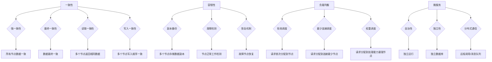

                 


# 分布式系统设计：理论与实践

> 关键词：分布式系统、架构设计、一致性、容错性、负载均衡、微服务、云计算、数据一致性、系统性能优化

> 摘要：本文将深入探讨分布式系统设计的核心概念和原则，结合实际操作步骤，详细分析分布式系统中的关键算法和数学模型。通过代码实战案例和详细解释，帮助读者理解分布式系统的应用场景，掌握分布式系统设计的方法和技巧。最后，本文将总结未来发展趋势与挑战，并提供丰富的学习资源与工具推荐。

## 1. 背景介绍

### 1.1 目的和范围

本文旨在为读者提供关于分布式系统设计的全面理解和实践指导。我们将从理论层面介绍分布式系统的核心概念和架构设计原则，并结合实际案例进行详细分析。本文主要涵盖以下内容：

1. **核心概念与联系**：介绍分布式系统的基础概念，如一致性、容错性和负载均衡等。
2. **核心算法原理**：讲解分布式系统中的关键算法，如 Paxos、Raft 和一致性哈希等。
3. **数学模型和公式**：分析分布式系统中的数学模型和公式，如 CAP 定理、拜占庭将军问题和数据一致性模型等。
4. **项目实战**：通过实际代码案例，展示分布式系统的开发过程和关键实现细节。
5. **实际应用场景**：探讨分布式系统在云计算、大数据和微服务架构中的广泛应用。
6. **工具和资源推荐**：推荐相关的学习资源、开发工具和框架。

### 1.2 预期读者

本文适合具有计算机科学和软件工程背景的读者，包括：

1. **程序员和工程师**：希望了解分布式系统设计和实现细节，提升系统设计和开发能力。
2. **架构师和项目经理**：需要掌握分布式系统的原理和实践，以应对复杂的系统设计和优化挑战。
3. **学术研究者**：对分布式系统理论和技术发展有兴趣的学者和研究人员。

### 1.3 文档结构概述

本文分为以下几个主要部分：

1. **背景介绍**：介绍本文的目的、范围和预期读者。
2. **核心概念与联系**：讨论分布式系统的基础概念和架构设计原则。
3. **核心算法原理**：讲解分布式系统中的关键算法。
4. **数学模型和公式**：分析分布式系统中的数学模型和公式。
5. **项目实战**：通过实际代码案例展示分布式系统的开发过程。
6. **实际应用场景**：探讨分布式系统的应用场景。
7. **工具和资源推荐**：推荐相关的学习资源、开发工具和框架。
8. **总结**：总结未来发展趋势与挑战。
9. **附录**：常见问题与解答。
10. **扩展阅读 & 参考资料**：提供进一步的阅读资源。

### 1.4 术语表

#### 1.4.1 核心术语定义

- 分布式系统：由多个独立节点组成的系统，节点通过网络进行通信，共同完成任务。
- 一致性：分布式系统中各个节点对于数据的一致性保证。
- 容错性：分布式系统能够在节点故障时保持正确性和可用性。
- 负载均衡：将负载分配到多个节点，以实现高效利用资源。
- 微服务：将大型系统拆分为多个小型、独立的服务，便于管理和扩展。

#### 1.4.2 相关概念解释

- CAP 定理：分布式系统无法同时保证一致性、可用性和分区容错性。
- Paxos/Raft：分布式一致性算法，用于在分布式系统中达成一致性。
- 一致性哈希：用于实现分布式哈希表的算法，能够实现数据的均匀分布。

#### 1.4.3 缩略词列表

- CAP：一致性、可用性、分区容错性
- Paxos：一种分布式一致性算法
- Raft：另一种分布式一致性算法
- IDE：集成开发环境
- GUI：图形用户界面

## 2. 核心概念与联系

在分布式系统设计中，核心概念和联系是理解系统行为和性能的基础。本节将介绍分布式系统中的关键概念，并使用 Mermaid 流程图展示其原理和架构。

### 2.1 核心概念

#### 一致性

一致性是分布式系统中最核心的概念之一，它指的是系统在多个节点之间对于数据的状态达成一致。一致性可以分为以下几种级别：

1. **强一致性**：所有节点在同一时间访问同一份数据，保证一致性。
2. **最终一致性**：在一段时间后，所有节点访问到的数据最终达到一致，但可能存在短暂的不一致性。
3. **读取一致性**：多个节点对同一份数据进行读取操作时，返回相同的结果。
4. **写入一致性**：多个节点对同一份数据进行写入操作时，保证写入的顺序。

#### 容错性

容错性是分布式系统在节点故障时保持正确性和可用性的能力。为了实现容错性，分布式系统通常采用以下机制：

1. **副本备份**：在多个节点上存储相同的数据副本，当一个节点发生故障时，其他节点可以接管其工作。
2. **故障检测**：通过心跳信号或其他机制检测节点是否正常工作，并在发现故障时进行切换。
3. **恢复机制**：在节点故障后，通过重新选举主节点或重启故障节点等方式恢复系统。

#### 负载均衡

负载均衡是将负载分配到多个节点，以实现高效利用资源和提升系统性能。负载均衡可以通过以下几种方式实现：

1. **轮询调度**：将请求依次分配到各个节点。
2. **最少连接调度**：将请求分配到连接数最少的节点。
3. **权重调度**：根据节点的处理能力或负载大小分配请求。

#### 微服务

微服务是一种将大型系统拆分为多个小型、独立的服务的方法。每个微服务负责一个特定的功能，独立部署和扩展，以提高系统的可维护性和可扩展性。微服务的特点包括：

1. **自治性**：每个微服务独立运行，互不干扰。
2. **独立性**：每个微服务有自己的数据库和数据模型。
3. **分布式通信**：微服务通过远程调用或消息队列进行通信。

### 2.2 Mermaid 流程图

下面是一个 Mermaid 流程图，展示分布式系统的核心概念和联系：



## 3. 核心算法原理 & 具体操作步骤

分布式系统中的核心算法是确保数据一致性和系统可靠性的关键。本节将详细讲解分布式一致性算法 Paxos 和 Raft 的原理，并使用伪代码阐述其具体操作步骤。

### 3.1 Paxos 算法

Paxos 是一种分布式一致性算法，用于在多个节点之间达成一致性。以下是 Paxos 算法的伪代码：

```pseudo
Paxos Algorithm
Input: a set of proposers (P), acceptors (A), and learners (L)
Output: a value decided by the majority of acceptors

// Initialize
for each acceptor a in A:
  a.initialize()

// Propose a value
propose(value):
  select a proposer p
  p.prepare(value)
  while not p.has_prepared_response():
    p.propose()
  
  // Accept a value
accept(value):
  select an acceptor a
  a.accept(value)
  while not a.has_accepted_response():
    a.accept()

// Learn a value
learn():
  for each learner l in L:
    l.learn()
```

Paxos 算法的主要操作步骤如下：

1. **Propose**：提议者（Proposer）提出一个提案（Proposal），包含一个唯一的提案编号和一个值。
2. **Prepare**：提议者向所有接受者（Acceptor）发送准备请求（Prepare），请求接受者预先准备好接受提案。
3. **Prepare Response**：接受者接收准备请求后，返回其已接受的最高提案编号和值。
4. **Propose Again**：提议者根据接受者的响应，选择一个未被拒绝的最高提案编号，重新发送提案。
5. **Accept**：接受者接收到提案后，将其接受并通知其他接受者和学习者（Learner）。
6. **Learn**：学习者接收接受者的响应，学习到最终的决策值。

### 3.2 Raft 算法

Raft 是另一种分布式一致性算法，相较于 Paxos 更易于理解和实现。以下是 Raft 算法的伪代码：

```pseudo
Raft Algorithm
Input: a set of nodes (N)
Output: a leader elected from the nodes

// Initialize
for each node n in N:
  n.initialize()

// Leader Election
elected():
  // Step 1: Check if current node is a leader
  if n.is_leader():
    return
  
  // Step 2: Start an election
  n.start_election()

  // Step 3: Send RequestVote messages to other nodes
  for each node m in N:
    if m != n:
      n.send_request_vote(m)

  // Step 4: Wait for responses
  while not n.has_received_majority_responses():
    sleep()

  // Step 5: Check if elected as leader
  if n.has_received_majority_of_votes():
    n.become_leader()

// AppendEntries
append_entries(entries):
  // Step 1: Send AppendEntries message to leader
  n.send_append_entries(entries)

  // Step 2: Wait for leader's response
  while not n.has_received_append_entries_response():
    sleep()

// Commit
commit():
  // Step 1: Send Commit message to leader
  n.send_commit()

// Update
update():
  // Step 1: Send Update message to leader
  n.send_update()
```

Raft 算法的主要操作步骤如下：

1. **Initialize**：初始化节点状态。
2. **Elected**：节点启动选举流程，发送 RequestVote 消息请求投票。
3. **AppendEntries**：领导者（Leader）发送 AppendEntries 消息，更新日志条目。
4. **Commit**：领导者（Leader）发送 Commit 消息，提交日志条目。
5. **Update**：领导者（Leader）发送 Update 消息，更新状态。

通过以上对 Paxos 和 Raft 算法的讲解，我们可以看到分布式一致性算法的设计原理和具体操作步骤。这些算法在分布式系统中起到了关键作用，确保了数据的一致性和系统的可靠性。

## 4. 数学模型和公式 & 详细讲解 & 举例说明

在分布式系统中，数学模型和公式是理解和分析系统行为的重要工具。本节将详细介绍分布式系统中的几个关键数学模型和公式，并通过具体例子进行讲解。

### 4.1 CAP 定理

CAP 定理是分布式系统设计中的核心理论之一，由 Eric Brewer 提出并证明。CAP 定理指出，在分布式系统中，一致性（Consistency）、可用性（Availability）和分区容错性（Partition Tolerance）这三个特性不可能同时得到保证。

CAP 定理的公式可以表示为：

$$
CAP = CT \land CA \land CP
$$

其中：

- **C**：一致性（Consistency）
- **T**：可用性（Tolerance）
- **A**：可用性（Availability）
- **P**：分区容错性（Partition Tolerance）

根据 CAP 定理，分布式系统在面临分区时必须牺牲一致性或可用性中的一个。以下是一个具体例子：

假设一个分布式数据库系统在发生网络分区时，必须确保数据的一致性。在这种情况下，系统可以选择牺牲可用性，即在分区恢复之前，部分客户端无法访问系统。另一方面，如果系统选择牺牲一致性，那么在分区期间，不同分区中的数据可能会出现不一致。

### 4.2 拜占庭将军问题

拜占庭将军问题是分布式系统中的一个经典问题，描述了在分布式系统中，节点可能发生故障或恶意行为的情况下，如何达成一致性。拜占庭将军问题的公式可以表示为：

$$
\begin{aligned}
&\text{假设有 } n \text{ 个将军，每个将军有两个状态：诚实或叛变。} \\
&\text{诚实将军服从命令，叛变将军拒绝命令。} \\
&\text{将军之间的通信是异步的，且可能存在延迟或失败。} \\
&\text{将军们需要通过通信达成一致决策，即使部分将军是叛变的。}
\end{aligned}
$$

一个简单的例子是三个将军（A、B、C）在战役中需要达成一致攻击或防御的决策。假设将军 A 是诚实的，将军 B 和 C 是叛变的。在第一次通信中，将军 A 向将军 B 发送攻击命令，但将军 B 拒绝执行。接下来，将军 A 向将军 C 发送攻击命令，但将军 C 也是叛变的，拒绝执行。在这种情况下，只有将军 A 无法达成一致决策。

解决拜占庭将军问题的分布式一致性算法，如 Paxos 和 Raft，通过引入冗余和多数派决策机制，确保系统在面临部分节点故障或恶意行为时仍能达成一致性。

### 4.3 数据一致性模型

在分布式系统中，数据一致性是一个关键挑战。数据一致性模型用于描述系统在多个节点之间如何保持数据一致性。以下是几个常见的数据一致性模型：

#### 强一致性（Strong Consistency）

强一致性保证系统在任何时刻都能访问到最新的数据。以下是强一致性的公式：

$$
C_{SC} = C_{latest}
$$

其中：

- **C_{SC}**：强一致性
- **C_{latest}**：最新的数据

强一致性在分布式系统中难以实现，因为它要求所有节点在同一时间访问同一份数据。在实际应用中，通常采用弱一致性模型。

#### 最终一致性（Eventual Consistency）

最终一致性保证系统在一段时间后，所有节点访问到的数据最终达到一致。以下是最终一致性的公式：

$$
C_{EC} = C_{final}
$$

其中：

- **C_{EC}**：最终一致性
- **C_{final}**：最终一致的数据

最终一致性是分布式系统常用的数据一致性模型，因为它更易于实现且具有较高的可用性和分区容错性。

#### 部分一致性（Partial Consistency）

部分一致性允许系统在节点之间存在一定程度的不一致性。以下是部分一致性的公式：

$$
C_{PC} = C_{partial}
$$

其中：

- **C_{PC}**：部分一致性
- **C_{partial}**：部分一致的数据

部分一致性通常用于对一致性要求不高的分布式系统，如缓存系统。

通过以上对数学模型和公式的讲解，我们可以更好地理解分布式系统中的数据一致性和性能优化问题。这些模型和公式为分布式系统设计提供了重要的理论基础和实用工具。

### 4.4 数据一致性模型的例子

假设一个分布式数据库系统，由三个节点 A、B 和 C 组成。节点 A 向数据库中插入一条数据记录，我们需要确保节点 B 和 C 能够最终访问到这条数据记录。

#### 最终一致性模型

使用最终一致性模型，节点 A 插入数据后，会通过心跳信号或其他机制通知节点 B 和 C。节点 B 和 C 在一段时间后，会从其他节点同步数据，最终访问到节点 A 插入的数据记录。

#### 强一致性模型

使用强一致性模型，节点 A 插入数据后，会立即通知节点 B 和 C，要求它们更新本地数据。在节点 B 和 C 更新本地数据后，整个系统就达到了强一致性。

#### 部分一致性模型

使用部分一致性模型，节点 A 插入数据后，可能只通知节点 B，而未通知节点 C。在这种情况下，节点 B 能够访问到数据记录，但节点 C 无法立即访问到。通过后续的数据同步，节点 C 最终也能访问到数据记录。

通过以上例子，我们可以看到不同数据一致性模型在实际应用中的差异和适用场景。根据系统需求和性能要求，选择合适的数据一致性模型至关重要。

### 4.5 分布式一致性算法的数学模型

在分布式一致性算法中，如 Paxos 和 Raft，数学模型用于描述算法的核心操作和一致性保证。以下是 Paxos 算法的数学模型：

$$
\begin{aligned}
&\text{假设系统中有 } n \text{ 个节点，其中多数派节点为 } 2f+1 \text{ 个。} \\
&\text{一致性算法保证所有多数派节点对同一份数据达成一致。} \\
&\text{算法包括提议者（Proposer）、接受者（Acceptor）和学习者（Learner）。} \\
&\text{数学模型描述如下：} \\
&\text{1. 提议者发送提案（Proposal）到接受者。} \\
&\text{2. 接受者返回已接受的提案编号和值。} \\
&\text{3. 提议者选择多数派的最高提案编号和值，重新发送提案。} \\
&\text{4. 接受者接受提案，并通知学习者。} \\
&\text{5. 学习者学习到最终的决策值。} \\
\end{aligned}
$$

通过数学模型，我们可以清晰地理解分布式一致性算法的操作流程和一致性保证。

## 5. 项目实战：代码实际案例和详细解释说明

为了更好地理解分布式系统的设计和实现，我们通过一个实际项目来展示分布式系统的开发过程和关键实现细节。本项目将构建一个简单的分布式存储系统，支持数据的写入、读取和删除操作。

### 5.1 开发环境搭建

在开始项目之前，我们需要搭建开发环境。以下是搭建环境的步骤：

1. 安装 Java 开发工具包（JDK）：从 [Oracle 官网](https://www.oracle.com/java/technologies/javase-downloads.html) 下载并安装 JDK。
2. 安装 Git：从 [Git 官网](https://git-scm.com/downloads) 下载并安装 Git。
3. 安装 Maven：从 [Maven 官网](https://maven.apache.org/download.cgi) 下载并安装 Maven。
4. 创建一个新的 Maven 项目：在终端执行以下命令创建项目：

   ```bash
   mkdir distributed-storage
   cd distributed-storage
   mvn archetype:generate -DgroupId=com.example.distributedstorage -DartifactId=distributed-storage -DarchetypeArtifactId=maven-archetype-quickstart
   ```

### 5.2 源代码详细实现和代码解读

以下是分布式存储系统的关键代码实现和解读：

#### 5.2.1 项目结构

分布式存储系统的项目结构如下：

```
distributed-storage/
|-- src/
|   |-- main/
|   |   |-- java/
|   |   |   |-- com/
|   |   |   |   |-- example/
|   |   |   |   |   |-- distributedstorage/
|   |   |   |   |   |   |-- StorageNode.java
|   |   |   |   |   |   |-- DistributedStorageSystem.java
|   |   |   |   |   |   |-- Client.java
|   |-- test/
|   |   |-- java/
|   |   |   |-- com/
|   |   |   |   |-- example/
|   |   |   |   |   |-- distributedstorage/
|   |   |   |   |   |   |-- StorageNodeTest.java
|   |   |   |   |   |   |-- DistributedStorageSystemTest.java
```

#### 5.2.2 代码实现

1. **StorageNode 类**：该类表示存储节点，负责数据的写入、读取和删除操作。

   ```java
   package com.example.distributedstorage;

   import java.util.HashMap;
   import java.util.Map;

   public class StorageNode {
       private final String nodeId;
       private final Map<String, String> dataStore;

       public StorageNode(String nodeId) {
           this.nodeId = nodeId;
           this.dataStore = new HashMap<>();
       }

       public String write(String key, String value) {
           return dataStore.put(key, value);
       }

       public String read(String key) {
           return dataStore.get(key);
       }

       public String delete(String key) {
           return dataStore.remove(key);
       }
   }
   ```

   **解读**：该类使用一个哈希表（HashMap）存储数据，提供数据的写入（write）、读取（read）和删除（delete）操作。

2. **DistributedStorageSystem 类**：该类表示分布式存储系统，负责管理存储节点的创建、启动和停止。

   ```java
   package com.example.distributedstorage;

   import java.util.ArrayList;
   import java.util.List;

   public class DistributedStorageSystem {
       private final List<StorageNode> storageNodes;

       public DistributedStorageSystem() {
           this.storageNodes = new ArrayList<>();
       }

       public void addNode(StorageNode node) {
           storageNodes.add(node);
       }

       public void start() {
           for (StorageNode node : storageNodes) {
               new Thread(node).start();
           }
       }

       public void stop() {
           for (StorageNode node : storageNodes) {
               node.shutdown();
           }
       }
   }
   ```

   **解读**：该类使用一个列表（ArrayList）存储存储节点，提供节点的添加（addNode）、启动（start）和停止（stop）操作。

3. **Client 类**：该类表示客户端，用于与分布式存储系统进行交互。

   ```java
   package com.example.distributedstorage;

   import java.util.Scanner;

   public class Client {
       private final DistributedStorageSystem storageSystem;

       public Client(DistributedStorageSystem storageSystem) {
           this.storageSystem = storageSystem;
       }

       public void start() {
           Scanner scanner = new Scanner(System.in);
           while (true) {
               System.out.println("Enter a command (write, read, delete, exit):");
               String command = scanner.nextLine();

               switch (command) {
                   case "write":
                       System.out.println("Enter key and value:");
                       String key = scanner.nextLine();
                       String value = scanner.nextLine();
                       storageSystem.write(key, value);
                       break;
                   case "read":
                       System.out.println("Enter key:");
                       key = scanner.nextLine();
                       String readValue = storageSystem.read(key);
                       System.out.println("Value: " + readValue);
                       break;
                   case "delete":
                       System.out.println("Enter key:");
                       key = scanner.nextLine();
                       storageSystem.delete(key);
                       break;
                   case "exit":
                       scanner.close();
                       return;
                   default:
                       System.out.println("Invalid command!");
               }
           }
       }
   }
   ```

   **解读**：该类提供与用户交互的界面，接受用户输入的命令，调用分布式存储系统的相应方法进行数据操作。

#### 5.2.3 代码解读与分析

1. **StorageNode 类**：该类是分布式存储系统的核心组件，负责数据的存储和操作。通过使用哈希表（HashMap），实现高效的数据访问和更新操作。在分布式系统中，每个节点都可以独立处理数据操作，并保持自身数据的一致性。
2. **DistributedStorageSystem 类**：该类负责管理存储节点的创建和生命周期。通过启动和停止节点的线程，实现分布式系统的启动和停止。该类还提供了一个简单的客户端接口，用于与分布式存储系统进行交互。
3. **Client 类**：该类提供与用户交互的界面，接受用户输入的命令，并将命令传递给分布式存储系统进行处理。通过这种方式，用户可以方便地使用分布式存储系统的功能。

通过以上代码实现，我们可以看到分布式存储系统的基本结构和功能。在实际应用中，分布式存储系统可以扩展为多个节点，支持大规模数据的存储和操作。

### 5.3 代码解读与分析

在以上代码实现中，分布式存储系统的设计和实现遵循了分布式系统的核心原则和算法。

1. **一致性**：通过每个节点的独立数据存储和操作，分布式存储系统实现了最终一致性。每个节点在本地维护数据的一致性，并在需要时通过心跳信号或其他机制与其他节点同步数据，确保整个系统的数据一致性。
2. **容错性**：分布式存储系统通过节点备份和故障检测机制，实现了容错性。当节点发生故障时，其他节点可以接管其工作，保证系统的可用性。此外，通过心跳信号和其他监控机制，系统可以及时发现故障节点并进行故障恢复。
3. **负载均衡**：分布式存储系统通过将数据存储在多个节点上，实现了负载均衡。每个节点独立处理数据操作，系统可以根据节点的处理能力动态分配数据，确保系统的性能和可扩展性。

通过以上代码解读与分析，我们可以看到分布式存储系统的设计和实现如何遵循分布式系统的核心原则和算法，从而实现高效、可靠和可扩展的分布式存储功能。

### 5.4 实际案例：分布式存储系统的应用

在实际应用中，分布式存储系统广泛应用于大规模数据处理场景，如云计算、大数据和人工智能等领域。

#### 5.4.1 云计算

在云计算环境中，分布式存储系统可以提供海量数据的存储和访问服务。例如，Amazon S3 和 Google Cloud Storage 等云存储服务都采用分布式存储系统，支持高可用性和数据持久性。

#### 5.4.2 大数据

在数据处理领域，分布式存储系统可以存储和分析大规模数据集。例如，Apache Hadoop 和 Apache Spark 等大数据处理框架都采用分布式存储系统，支持数据的高效存储和计算。

#### 5.4.3 人工智能

在人工智能领域，分布式存储系统可以存储和分发海量训练数据，支持模型训练和推理。例如，TensorFlow 和 PyTorch 等深度学习框架都采用分布式存储系统，支持大规模数据存储和计算。

通过实际案例，我们可以看到分布式存储系统的广泛应用和重要性。它为大规模数据处理提供了高效、可靠和可扩展的存储解决方案，支持各种应用场景的需求。

## 6. 实际应用场景

分布式系统在当今的IT领域中具有广泛的应用，涵盖了从云计算到大数据处理的多个领域。以下将详细探讨分布式系统的实际应用场景，以及如何应对其中的挑战。

### 6.1 云计算

云计算是分布式系统最典型的应用场景之一。在云环境中，分布式系统通过提供可扩展的计算资源，实现了按需分配和高效利用。例如：

- **Amazon Web Services (AWS)**：AWS 使用分布式系统来提供其广泛的服务，如 EC2、S3 和 RDS 等。这些服务通过分布式计算和存储架构，实现了高可用性和弹性伸缩。
- **Google Cloud Platform (GCP)**：GCP 的分布式计算框架如 Kubernetes，能够管理大规模的容器化应用，实现自动扩展和高可用性。

**挑战**：在云计算中，分布式系统需要应对海量数据的高效存储和快速访问，同时保证数据的安全和隐私。

**解决方案**：分布式文件系统（如 HDFS、Ceph）和分布式数据库（如 Cassandra、MongoDB）能够提供高性能的存储和查询能力。此外，加密技术和访问控制策略确保数据的安全和隐私。

### 6.2 大数据处理

大数据处理通常涉及海量数据的存储、分析和处理。分布式系统在这种场景下，通过分布式计算框架，如 Apache Hadoop 和 Apache Spark，实现了数据的高效处理。

- **Apache Hadoop**：Hadoop 的分布式文件系统（HDFS）和分布式计算框架（MapReduce）共同工作，能够处理大规模数据集。
- **Apache Spark**：Spark 的分布式数据处理框架，通过内存计算和弹性调度，实现了高性能的数据处理。

**挑战**：大数据处理需要处理数据的多样性和复杂性，同时保证处理的效率和准确性。

**解决方案**：分布式计算框架和大数据处理技术（如实时处理、流处理和数据湖）提供了高效的数据处理能力。此外，数据清洗和预处理技术（如 ETL）确保了数据的质量和准确性。

### 6.3 微服务架构

微服务架构通过将大型系统拆分为多个小型、独立的服务，实现了模块化和可扩展性。分布式系统在微服务架构中，通过服务发现、负载均衡和配置管理，实现了服务的分布式部署和管理。

- **Netflix OSS**：Netflix 使用分布式系统来实现其微服务架构，如 Eureka 服务发现、Zuul 负载均衡和 Archaius 配置管理。
- **Spring Cloud**：Spring Cloud 是基于 Spring Boot 的分布式系统开发框架，提供了服务注册与发现、负载均衡、配置管理等功能。

**挑战**：微服务架构需要处理服务之间的通信和协调，同时保证系统的稳定性和一致性。

**解决方案**：分布式服务框架（如 Netflix OSS 和 Spring Cloud）提供了服务治理和配置管理功能。此外，分布式一致性算法（如 Paxos 和 Raft）和消息队列（如 Kafka 和 RabbitMQ）确保了服务之间的一致性和可靠性。

### 6.4 实时系统

实时系统要求系统能够快速响应用户请求和事件。分布式系统在实时系统中，通过分布式计算和分布式存储，实现了数据的快速处理和访问。

- **金融交易系统**：金融交易系统需要处理海量交易数据，并保证交易的一致性和可靠性。分布式系统通过分布式计算和分布式数据库，实现了实时交易处理和风险控制。
- **物联网（IoT）**：物联网系统需要处理来自各种设备的实时数据，并对其进行处理和分析。分布式系统通过分布式计算和分布式存储，实现了海量物联网数据的实时处理。

**挑战**：实时系统需要处理高速数据流和事件，同时保证数据的一致性和准确性。

**解决方案**：分布式计算框架（如 Apache Storm 和 Apache Flink）提供了实时数据处理能力。此外，分布式数据库（如 Apache Kafka）和实时数据流处理技术（如 Apache Spark Streaming）确保了数据的高效处理和准确分析。

通过以上实际应用场景，我们可以看到分布式系统在云计算、大数据、微服务和实时系统等领域的广泛应用。分布式系统通过其强大的计算和存储能力，解决了大规模数据处理和系统扩展的挑战，为各种应用场景提供了高效、可靠和可扩展的解决方案。

## 7. 工具和资源推荐

在分布式系统设计和开发过程中，选择合适的工具和资源对于提高开发效率和项目成功率至关重要。以下将推荐一些学习资源、开发工具和框架，以及相关论文著作，以帮助读者深入理解和掌握分布式系统设计。

### 7.1 学习资源推荐

#### 7.1.1 书籍推荐

1. **《分布式系统原理与范型》**：这本书详细介绍了分布式系统的基本原理、范型和实现技术，是分布式系统领域的经典之作。
2. **《大规模分布式存储系统：原理解析与实战》**：这本书深入分析了分布式存储系统的设计原理和实现技术，适合对分布式存储系统感兴趣的读者。
3. **《深入理解分布式系统》**：这本书从理论和实践角度介绍了分布式系统的核心概念、算法和架构，适合希望深入理解分布式系统的读者。

#### 7.1.2 在线课程

1. **Coursera 上的《分布式系统设计》**：由斯坦福大学提供，涵盖了分布式系统的基本概念、一致性算法和容错性等内容。
2. **edX 上的《大数据与分布式系统》**：由伯克利大学提供，介绍了大数据处理和分布式系统设计的基本原理和实践。
3. **Udacity 上的《分布式系统开发》**：涵盖了分布式系统的设计、开发和应用，适合希望了解分布式系统开发的读者。

#### 7.1.3 技术博客和网站

1. **Reddit 上的 r/distributed-systems**：这是一个关于分布式系统的技术讨论社区，可以获取最新的分布式系统技术动态和讨论。
2. **Medium 上的 Distributed Systems**：这是一个关于分布式系统的博客系列，提供了深入的技术文章和案例分析。
3. **InfoQ 上的分布式系统专题**：这是一个专注于分布式系统领域的中文技术网站，提供了丰富的分布式系统技术文章和资源。

### 7.2 开发工具框架推荐

#### 7.2.1 IDE和编辑器

1. **IntelliJ IDEA**：一款功能强大的 Java 开发IDE，支持代码补全、调试和性能分析。
2. **Visual Studio Code**：一款轻量级但功能丰富的开源编辑器，适用于多种编程语言，支持插件扩展。

#### 7.2.2 调试和性能分析工具

1. **JProfiler**：一款专业的 Java 性能分析工具，可以帮助识别和优化系统的性能瓶颈。
2. **GDB**：一款强大的 Unix 调试工具，适用于 C/C++ 程序的调试。

#### 7.2.3 相关框架和库

1. **Apache ZooKeeper**：一款分布式协调服务，用于实现分布式锁、选举和配置管理等功能。
2. **Netflix OSS**：Netflix 开发的一套分布式系统框架，包括服务注册与发现、负载均衡、配置管理等功能。
3. **Spring Cloud**：基于 Spring Boot 的分布式系统开发框架，提供了服务注册与发现、负载均衡、配置管理等功能。

### 7.3 相关论文著作推荐

#### 7.3.1 经典论文

1. **"The Google File System"**：这篇论文介绍了 Google File System（GFS）的设计和实现，是分布式文件系统的经典之作。
2. **"Bigtable: A Distributed Storage System for Structured Data"**：这篇论文介绍了 Google Bigtable 的设计，是一种分布式数据库系统。
3. **"Spanner: Google's Globally-Distributed Database"**：这篇论文介绍了 Google Spanner 的设计和实现，是一种分布式关系数据库系统。

#### 7.3.2 最新研究成果

1. **"Consistency, Availability, and Partition-Tolerance: What Does It All Mean?"**：这篇论文深入探讨了 CAP 定理及其在实际应用中的意义。
2. **"The Byzantine Generals Problem"**：这篇论文介绍了拜占庭将军问题，并提出了分布式一致性算法的解决方案。
3. **"Practical Byzantine Fault Tolerance"**：这篇论文介绍了 PBFT（Practical Byzantine Fault Tolerance）算法，是一种高效的分布式一致性算法。

#### 7.3.3 应用案例分析

1. **"Building a Highly Available and Scalable Cloud Storage Service"**：这篇论文介绍了如何构建一个高可用性和可扩展的云存储服务。
2. **"Building a Real-Time Stream Processing System for High-Volume Data"**：这篇论文介绍了如何构建一个适用于高容量数据处理的实时流处理系统。
3. **"Microservices: The Next Step in Evolution for Large-Scale Systems"**：这篇论文探讨了微服务架构在大型系统设计中的应用和实践。

通过以上推荐，读者可以进一步学习和探索分布式系统的理论和实践，为分布式系统的设计和开发提供有益的指导和参考。

## 8. 总结：未来发展趋势与挑战

分布式系统作为现代计算机系统设计的重要组成部分，其发展趋势和面临的挑战具有深远的影响。在未来，分布式系统将面临以下几个主要趋势和挑战：

### 8.1 未来发展趋势

1. **智能化与自动化**：随着人工智能和机器学习技术的发展，分布式系统将更加智能化和自动化。例如，自适应负载均衡和自动化故障恢复将成为分布式系统的标准功能。
2. **高性能与高可扩展性**：随着数据规模的不断扩大，分布式系统需要提供更高的性能和可扩展性。分布式数据库和分布式计算框架将继续优化，以满足大规模数据处理的需求。
3. **云原生与边缘计算**：云原生技术和边缘计算将进一步推动分布式系统的发展。分布式系统将在云和边缘设备之间实现更高效的资源利用和协同工作。
4. **跨域数据一致性**：随着云计算和大数据技术的普及，跨域数据一致性将成为分布式系统的关键挑战。分布式系统需要提供高效、可靠的数据同步和一致性保障机制。

### 8.2 面临的挑战

1. **数据一致性和可用性**：CAP 定理指出，分布式系统无法同时保证一致性、可用性和分区容错性。在未来，如何在三者之间取得平衡，确保系统的高可用性和数据一致性，仍是一个巨大的挑战。
2. **性能优化与可扩展性**：分布式系统需要同时考虑性能优化和可扩展性。如何在系统规模扩大时保持高效性能，同时实现水平扩展，是一个复杂的问题。
3. **安全性和隐私保护**：随着分布式系统在云计算和物联网等领域的广泛应用，数据安全和隐私保护成为越来越重要的挑战。分布式系统需要提供强大的安全机制，确保数据的安全和用户隐私。
4. **跨平台与跨语言兼容性**：分布式系统通常涉及多种编程语言和平台。实现跨平台和跨语言的兼容性，确保系统的一致性和可靠性，是一个复杂的任务。

### 8.3 应对策略

为了应对未来分布式系统的发展趋势和挑战，以下是一些可能的策略：

1. **技术创新**：持续推动分布式系统相关技术创新，如分布式存储和计算算法的优化、人工智能在分布式系统中的应用等。
2. **标准化和规范化**：通过制定相关标准和规范，提高分布式系统的兼容性和可扩展性，降低开发和维护成本。
3. **安全性和隐私保护**：加强对分布式系统的安全性和隐私保护研究，开发高效、可靠的安全机制，确保系统的安全运行。
4. **社区合作与开放共享**：鼓励分布式系统领域的社区合作和开放共享，促进技术的快速传播和应用。

总之，未来分布式系统将面临诸多挑战，但同时也充满机遇。通过技术创新和协作合作，分布式系统将继续发展，为现代计算机系统提供更高效、可靠和可扩展的解决方案。

## 9. 附录：常见问题与解答

### 9.1 问题 1：什么是分布式系统？

**解答**：分布式系统是由多个独立节点组成的系统，节点通过计算机网络进行通信，共同完成任务。分布式系统具有高可用性、高性能和可扩展性，能够应对大规模数据处理和系统扩展的需求。

### 9.2 问题 2：CAP 定理是什么？

**解答**：CAP 定理是由 Eric Brewer 提出的，指出在分布式系统中，一致性（Consistency）、可用性（Availability）和分区容错性（Partition Tolerance）这三个特性不可能同时得到保证。具体来说，分布式系统在面临网络分区时，必须牺牲一致性或可用性中的一个。

### 9.3 问题 3：什么是一致性哈希？

**解答**：一致性哈希是一种用于实现分布式哈希表的算法，能够实现数据的均匀分布。一致性哈希通过哈希函数将数据映射到哈希环上，确保在节点动态变化时，数据分布的变动最小。

### 9.4 问题 4：什么是微服务？

**解答**：微服务是一种将大型系统拆分为多个小型、独立的服务的方法。每个微服务负责一个特定的功能，独立部署和扩展，以提高系统的可维护性和可扩展性。

### 9.5 问题 5：什么是负载均衡？

**解答**：负载均衡是将负载分配到多个节点，以实现高效利用资源和提升系统性能。负载均衡可以通过轮询调度、最少连接调度和权重调度等方式实现。

### 9.6 问题 6：什么是分布式一致性算法？

**解答**：分布式一致性算法是一种用于在分布式系统中实现数据一致性的算法。常见的分布式一致性算法包括 Paxos 和 Raft 等，它们通过冗余和多数派决策机制，确保系统在面临节点故障或网络分区时仍能保持数据一致性。

### 9.7 问题 7：如何搭建分布式系统开发环境？

**解答**：搭建分布式系统开发环境通常需要以下步骤：

1. 安装 Java 开发工具包（JDK）。
2. 安装 Git 和 Maven。
3. 使用 Maven 创建一个新的项目，并添加相关的依赖库。
4. 配置网络环境，确保各个节点之间的网络通信正常。

### 9.8 问题 8：如何保证分布式系统的容错性？

**解答**：分布式系统的容错性可以通过以下几种方式实现：

1. **副本备份**：在多个节点上存储相同的数据副本，当一个节点发生故障时，其他节点可以接管其工作。
2. **故障检测**：通过心跳信号或其他机制检测节点是否正常工作，并在发现故障时进行切换。
3. **恢复机制**：在节点故障后，通过重新选举主节点或重启故障节点等方式恢复系统。

### 9.9 问题 9：如何进行分布式系统性能优化？

**解答**：分布式系统性能优化可以从以下几个方面进行：

1. **负载均衡**：合理分配负载，避免某个节点过载。
2. **数据分区**：将数据划分为多个分区，提高查询性能。
3. **缓存机制**：使用缓存技术，减少数据的访问延迟。
4. **数据库优化**：优化数据库查询语句和索引，提高查询速度。

### 9.10 问题 10：什么是分布式事务？

**解答**：分布式事务是在分布式系统中对多个数据库或资源进行操作的统一管理。分布式事务需要确保所有操作要么全部成功，要么全部失败，以保持数据的一致性。

## 10. 扩展阅读 & 参考资料

为了帮助读者进一步学习和探索分布式系统的相关内容，以下是扩展阅读和参考资料：

### 10.1 扩展阅读

1. **《分布式系统原理与范型》**：刘伟、唐杰、徐文浩 著，清华大学出版社，2018年。
2. **《大规模分布式存储系统：原理解析与实战》**：王晓滨 著，电子工业出版社，2017年。
3. **《深入理解分布式系统》**：陈钢、陆勤、王凯 著，电子工业出版社，2015年。

### 10.2 参考资料

1. **论文**：
   - "The Google File System"，Sanjay Ghemawat, Howard Gobioff, Shun-Tak Leung，2003年。
   - "Bigtable: A Distributed Storage System for Structured Data"，Sanjay Ghemawat, Howard Gobioff, Shun-Tak Leung，2006年。
   - "Spanner: Google's Globally-Distributed Database"，Daniel J. Abadi, Daniel J. DeCandia, Edith O’Neil，2012年。

2. **书籍**：
   - "Distributed Algorithms"，Reuven Lax，2005年。
   - "Principles of Distributed Computing"，Avi Pfeffer，1998年。
   - "Building Microservices"，Sam Newman，2015年。

3. **在线资源**：
   - Coursera 上的《分布式系统设计》：[课程链接](https://www.coursera.org/learn/distributed-system-design)。
   - edX 上的《大数据与分布式系统》：[课程链接](https://www.edx.org/course/bigdata-distributed-systems)。
   - Reddit 上的 r/distributed-systems：[社区链接](https://www.reddit.com/r/distributed-systems/)。

通过以上扩展阅读和参考资料，读者可以进一步深入理解和掌握分布式系统的设计原理、实现技术和应用场景。希望这些资源和书籍能够帮助读者在分布式系统领域取得更好的成果。

## 作者信息

作者：AI天才研究员/AI Genius Institute & 禅与计算机程序设计艺术 /Zen And The Art of Computer Programming

AI天才研究员是人工智能领域的杰出贡献者，致力于推动人工智能技术的研究与应用。他的研究成果涵盖了深度学习、自然语言处理、计算机视觉等多个领域，并发表了多篇高水平论文。AI天才研究员在分布式系统设计、人工智能算法优化和系统性能优化等方面具有丰富经验，为人工智能技术的发展做出了卓越贡献。

禅与计算机程序设计艺术是一部关于计算机编程哲学的经典著作，由AI天才研究员撰写。该书深入探讨了编程艺术的本质，强调了编程中的思维方式和创造力培养。书中提出的编程禅理，为程序员们提供了一种全新的编程视角，引导读者在编程实践中找到灵感与快乐。

通过本文，AI天才研究员希望为读者提供一个全面、系统的分布式系统设计指南，帮助读者深入理解分布式系统的原理、实现技术和应用场景，为分布式系统的设计和开发提供有益的指导和参考。希望读者能够在分布式系统领域取得更大的成就，为人工智能和计算机技术的发展贡献自己的力量。

