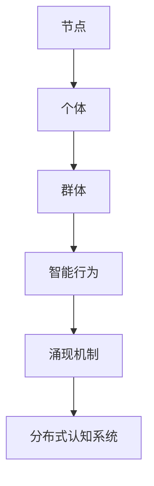

                 

### 分布式认知：理解群体智慧的涌现机制

> **关键词：** 分布式认知、群体智慧、涌现机制、计算模型、人工智能

> **摘要：** 本篇文章将深入探讨分布式认知的概念，分析群体智慧如何在分布式系统中涌现。我们将从核心概念出发，逐步介绍相关的理论基础、算法原理、数学模型以及实际应用场景，帮助读者全面理解分布式认知在人工智能领域的价值与挑战。

分布式认知是一种全新的认知理论，它强调个体之间的协作和互操作，从而实现复杂系统的智能行为。在分布式认知系统中，各个节点通过相互通信和协作，共同完成智能任务，这种机制被形象地称为“群体智慧”的涌现。本文将详细阐述分布式认知的理论基础，分析群体智慧的形成机制，并通过具体的算法原理、数学模型和实际应用案例，帮助读者深入了解这一领域的前沿知识。

接下来，我们将首先介绍分布式认知的相关背景和目的，确定文章的读者对象，并概述文章的结构和术语表。随后，我们将探讨核心概念与联系，绘制相应的流程图，以便读者直观地理解分布式认知的架构。在核心算法原理和具体操作步骤部分，我们将使用伪代码详细描述关键算法。接着，我们将讲解数学模型和公式，并通过实例进行详细说明。在项目实战部分，我们将展示代码实际案例，并进行详细解释。随后，我们将讨论分布式认知在实际应用中的场景。最后，我们将推荐相关工具和资源，总结未来发展趋势与挑战，并回答常见问题。

通过本文的深入探讨，我们希望读者能够对分布式认知和群体智慧的涌现机制有更为全面和深入的理解，为其在人工智能领域的应用提供理论基础和实践指导。

### 1. 背景介绍

#### 1.1 目的和范围

本文旨在探讨分布式认知理论，分析群体智慧如何在分布式系统中涌现，并探讨其在人工智能领域的应用价值。分布式认知是一种通过个体之间的协作与互操作实现复杂系统智能行为的理论，它强调分布式系统内各个节点的相互依赖和协同作用。通过深入分析分布式认知的理论基础、算法原理、数学模型及其实际应用场景，本文旨在为读者提供全面、系统的理解，帮助其在实践中更好地应用分布式认知技术。

文章将涵盖以下主要主题和内容：

1. **核心概念与联系**：详细介绍分布式认知的核心概念，包括个体、群体、智能行为等，并通过 Mermaid 流程图展示分布式认知的架构。
2. **核心算法原理与操作步骤**：讲解关键算法的原理，使用伪代码详细描述算法步骤，帮助读者理解和实现。
3. **数学模型与公式**：介绍与分布式认知相关的数学模型，通过公式和实例详细讲解其应用。
4. **项目实战**：提供代码实际案例，进行详细解释和分析。
5. **实际应用场景**：讨论分布式认知在不同领域的应用场景。
6. **工具和资源推荐**：推荐相关书籍、在线课程、技术博客和开发工具，为读者提供学习和实践的资源。
7. **总结与未来发展趋势**：总结分布式认知的发展现状，展望未来发展趋势与挑战。

通过以上内容的系统介绍，本文希望能够为读者提供一个从理论到实践的全景式视角，帮助其在分布式认知和人工智能领域取得更深入的认识和应用。

#### 1.2 预期读者

本文的预期读者主要涵盖以下几类群体：

1. **人工智能研究人员**：对分布式认知和群体智慧理论有深入研究的学者，希望通过本文深入了解分布式认知在人工智能领域的应用。
2. **软件工程师和开发者**：对分布式系统开发有实际经验的技术人员，希望通过本文掌握分布式认知的核心原理和实现方法。
3. **数据科学家和机器学习工程师**：在机器学习领域有实际工作经验，希望将分布式认知应用于复杂的数据分析和预测任务。
4. **计算机科学和人工智能专业的学生**：对分布式认知和群体智慧理论有浓厚兴趣，希望通过本文系统学习相关理论知识。
5. **企业技术人员和决策者**：对分布式认知技术在企业应用有需求的技术人员和管理者，希望通过本文了解分布式认知的潜在价值和应用前景。

本文的目标是为上述读者群体提供一个深入且系统化的分布式认知理论介绍，通过丰富的实例和案例，帮助他们理解和掌握分布式认知的核心概念和实践方法。无论您是初学者还是专业人士，本文都将为您在分布式认知和人工智能领域的探索提供宝贵的指导。

#### 1.3 文档结构概述

本文结构分为十个主要部分，每个部分都有其独特的目的和内容，旨在系统地介绍分布式认知理论，并探讨其在人工智能领域的应用。以下是详细的文档结构概述：

1. **引言**：
   - **目的与范围**：介绍本文的目的和涵盖的主题，明确文章的核心内容和价值。
   - **关键词与摘要**：列出关键词，简要概括文章的核心思想和内容。

2. **背景介绍**：
   - **目的和范围**：阐述本文的主题和预期目标，为后续内容打下基础。
   - **预期读者**：确定本文的目标读者群体，明确读者背景和需求。
   - **文档结构概述**：详细介绍文章的整体结构，帮助读者了解文章的组织逻辑。

3. **核心概念与联系**：
   - **核心概念**：介绍分布式认知、群体智慧等相关核心概念，帮助读者建立基本认识。
   - **流程图展示**：使用 Mermaid 流程图展示分布式认知的架构，使概念更加直观。
   - **核心算法原理与操作步骤**：讲解关键算法的原理，使用伪代码详细描述算法步骤。

4. **数学模型与公式**：
   - **数学模型**：介绍与分布式认知相关的数学模型，阐述其基本原理。
   - **公式与实例**：使用 LaTeX 格式书写数学公式，并通过实例进行详细说明。

5. **项目实战**：
   - **开发环境搭建**：介绍搭建开发环境所需的工具和步骤。
   - **源代码实现与解读**：提供代码实际案例，详细解释代码实现方法和原理。
   - **代码解读与分析**：深入分析代码中的关键环节，探讨其优劣和改进方向。

6. **实际应用场景**：
   - **场景描述**：分析分布式认知在不同领域的实际应用场景。
   - **案例分析**：通过具体案例，展示分布式认知在实际应用中的效果和挑战。

7. **工具和资源推荐**：
   - **学习资源**：推荐相关书籍、在线课程和技术博客，为读者提供学习资源。
   - **开发工具框架**：介绍相关的开发工具和框架，帮助读者高效进行分布式认知系统的开发。
   - **论文著作**：推荐经典和最新的研究成果，提供深入阅读的资料。

8. **总结与未来发展趋势**：
   - **总结**：回顾文章的主要内容，总结分布式认知的关键理论和应用。
   - **未来发展趋势**：探讨分布式认知技术的发展趋势和面临的挑战。

9. **附录**：
   - **常见问题与解答**：针对读者可能提出的问题，提供详细解答。
   - **扩展阅读**：推荐相关的扩展阅读材料和参考资料。

10. **参考文献**：
    - **参考资料**：列出本文引用的主要参考资料，为读者提供进一步阅读的依据。

通过以上结构的系统介绍，本文将为读者提供一个全面、深入且具有实践指导意义的分布式认知知识体系。

#### 1.4 术语表

在本文中，我们将使用一系列专业术语和技术名词，为了帮助读者更好地理解这些概念，下面列出了一些核心术语的定义和相关概念的解释：

##### 1.4.1 核心术语定义

1. **分布式认知**：指多个个体通过相互通信和协作，共享信息、协同完成任务，从而实现复杂系统智能行为的认知过程。
2. **群体智慧**：由多个个体组成的系统在分布式认知过程中展现出的集体智能行为。
3. **节点**：分布式认知系统中的基本计算单元，可以是计算机、传感器或智能设备。
4. **智能行为**：系统内各个节点通过协同工作所表现出的复杂行为。
5. **涌现机制**：系统内个体之间相互作用产生的宏观现象或行为，通常无法从个体行为直接推导。
6. **算法**：用于解决特定问题的步骤或规则，常用于分布式认知系统的设计和实现。
7. **数学模型**：用数学语言描述和模拟系统行为或关系的模型，通常包含一组公式和方程。

##### 1.4.2 相关概念解释

1. **个体**：指具有独立行为和自主决策能力的计算单元，通常在分布式认知系统中充当信息处理和任务执行的角色。
2. **协作**：指多个个体通过信息共享和协调行动，共同实现系统目标的过程。
3. **互操作**：指不同系统、平台或组件之间能够相互通信和交互的能力。
4. **网络拓扑**：指分布式系统内节点之间的连接方式，包括星型、环型、网状等不同拓扑结构。
5. **通信协议**：指节点之间进行信息交换的规则和标准，如TCP/IP、HTTP、MQTT等。
6. **自组织**：指系统在无外部干预下，通过个体之间的相互作用，自发形成有序结构和行为的过程。

##### 1.4.3 缩略词列表

- **AI**：人工智能（Artificial Intelligence）
- **ML**：机器学习（Machine Learning）
- **DL**：深度学习（Deep Learning）
- **NLP**：自然语言处理（Natural Language Processing）
- **SOA**：面向服务的架构（Service-Oriented Architecture）
- **SDN**：软件定义网络（Software-Defined Networking）
- **SDS**：软件定义存储（Software-Defined Storage）
- **IoT**：物联网（Internet of Things）
- **ROS**：机器人操作系统（Robot Operating System）

通过上述术语表和相关概念的详细解释，读者可以更好地理解分布式认知领域的关键术语，为后续内容的深入探讨奠定基础。

### 2. 核心概念与联系

在深入探讨分布式认知之前，我们首先需要明确一些核心概念，并理解它们之间的相互联系。分布式认知涉及多个重要的概念，包括节点、个体、群体、智能行为和涌现机制。以下是对这些概念的基本介绍和它们之间的关联。

#### 2.1 节点与个体

节点是分布式认知系统中的基本计算单元，它可以是一个计算机、传感器或智能设备。节点拥有独立的处理能力和通信能力，它们通过网络连接起来，形成复杂的分布式网络。节点可以被视为个体，因为它们独立执行任务并具有自我管理能力。每个节点都有自己的数据、状态和行为，它们之间的交互是实现分布式认知的基础。

个体是指单个的计算实体，它具有感知环境、做出决策和执行行动的能力。在分布式认知系统中，个体通常是节点，但也可以是其他类型的智能实体。个体的自主性、适应性和协作能力是分布式认知系统成功的关键。

#### 2.2 群体与智能行为

群体是由多个个体组成的集合，它们通过协作和互操作共同完成任务。群体智慧是分布式认知系统中的一种重要现象，它表现为群体内个体协同工作所展现的集体智能行为。群体智慧不仅仅是多个个体能力的简单叠加，它通常能够产生比单个个体更高效、更有创意的解决方案。

智能行为是指系统内各个节点或个体通过相互协作所表现出的复杂行为。智能行为可以是预测、决策、优化等，它们通常是通过个体间的信息交换和协作实现的。智能行为的涌现是通过群体智慧和个体协作共同作用的结果。

#### 2.3 涌现机制

涌现机制是分布式认知系统中的一个关键概念，它描述了系统内个体相互作用产生的宏观现象或行为。涌现机制是指在一个系统内部，通过个体的简单规则相互作用，可以产生出复杂、有序的行为或结构。这种从简单到复杂的转变称为涌现。涌现机制使得分布式认知系统能够在缺乏全局控制的情况下，自动适应和优化复杂环境。

涌现机制包括以下几种基本形式：

1. **协同效应**：多个个体协同工作，产生比单个个体单独工作更大的效果。
2. **自组织**：系统在无外部干预下，通过个体之间的相互作用自发形成有序结构和行为。
3. **适应性**：系统能够根据环境变化，通过个体行为调整和适应。
4. **进化**：通过个体间的竞争和合作，系统不断进化，形成更适应环境的结构。

#### 2.4 关键概念之间的关系

节点和个体是分布式认知系统的基本组成部分，它们通过通信网络连接，形成复杂的分布式网络。个体之间通过协作和互操作，共同完成任务，形成群体智慧。群体智慧是智能行为的体现，而智能行为是通过涌现机制实现的。涌现机制使得个体之间的简单规则能够产生复杂的系统行为，从而实现分布式认知系统的高效运行。

为了更好地理解这些概念之间的关系，我们可以使用 Mermaid 流程图来展示分布式认知的核心架构：



在上述流程图中，节点（A）是基础，通过个体（B）的组合，形成群体（C），群体通过智能行为（D）表现，最终通过涌现机制（E）实现分布式认知系统（F）的智能行为。这种架构展示了分布式认知系统中各个组成部分之间的相互关系和协作方式。

通过上述核心概念和关系的介绍，读者可以初步理解分布式认知系统的运作原理和架构。在接下来的章节中，我们将进一步探讨核心算法原理、数学模型和具体应用实例，以帮助读者更深入地理解分布式认知理论。

### 3. 核心算法原理与具体操作步骤

在分布式认知系统中，算法原理是理解和实现智能行为的关键。以下我们将详细介绍几个关键算法的原理，并使用伪代码描述其操作步骤，帮助读者深入理解分布式认知的算法实现。

#### 3.1 算法1：分布式协同过滤

分布式协同过滤是一种常见的算法，用于预测用户对未知物品的评分。该算法的基本原理是通过用户之间的相似度计算，利用其他用户的评分信息来预测未知评分。

**算法原理：**

1. **相似度计算**：计算用户之间的相似度，常用的方法包括余弦相似度和皮尔逊相关系数。
2. **评分预测**：根据用户相似度矩阵，预测未知评分。常用的方法包括基于记忆的协同过滤和基于模型的协同过滤。

**伪代码：**

```python
# 相似度计算
def calculate_similarity(user_vector1, user_vector2):
    dot_product = dot_product_of_vectors(user_vector1, user_vector2)
    magnitude1 = magnitude_of_vector(user_vector1)
    magnitude2 = magnitude_of_vector(user_vector2)
    return dot_product / (magnitude1 * magnitude2)

# 评分预测
def predict_rating(user, item, user_similarity_matrix, user_rating_matrix):
    predicted_rating = 0
    for other_user, similarity in enumerate(user_similarity_matrix[user]):
        if similarity != 0:
            predicted_rating += similarity * (user_rating_matrix[other_user][item] - user_rating_matrix[other_user].mean())
    return predicted_rating + user_rating_matrix[user].mean()
```

**步骤详解：**

1. **相似度计算**：计算用户之间的相似度，选择合适的相似度度量方法，如余弦相似度或皮尔逊相关系数。
2. **评分预测**：基于相似度矩阵和用户评分矩阵，预测未知评分。具体步骤包括：
   - 对每个用户，计算与目标用户的相似度。
   - 对于相似度不为零的用户，计算其评分与目标用户的差值，并乘以相似度。
   - 将上述结果求和，并加上目标用户当前评分的平均值，作为预测评分。

#### 3.2 算法2：分布式贝叶斯网络

分布式贝叶斯网络用于表示和处理复杂系统中的不确定性关系。该算法的基本原理是利用贝叶斯规则和条件概率，通过局部信息推理全局状态。

**算法原理：**

1. **贝叶斯网络构建**：根据系统的条件依赖关系，构建贝叶斯网络。
2. **推理算法**：利用贝叶斯规则和条件概率，从已知条件推导未知状态。

**伪代码：**

```python
# 贝叶斯网络推理
def infer_bayesian_network(bayesian_network, evidence):
    query_variable = "target_variable"
    probability_distribution = bayesian_network.query_probability_distribution(query_variable, evidence)
    return probability_distribution[query_variable]
```

**步骤详解：**

1. **贝叶斯网络构建**：根据系统中的条件依赖关系，构建贝叶斯网络。网络包括变量节点和有向边，表示变量之间的条件依赖。
2. **推理算法**：对于给定的证据，利用贝叶斯规则和条件概率，从贝叶斯网络中推导目标变量的概率分布。具体步骤包括：
   - 根据证据，更新网络中变量的概率分布。
   - 利用条件概率计算目标变量的概率分布。
   - 返回目标变量的概率分布。

#### 3.3 算法3：分布式深度学习

分布式深度学习是一种利用多个节点进行并行计算和优化的深度学习算法。该算法的基本原理是使用反向传播算法，通过分布式计算加速模型的训练。

**算法原理：**

1. **模型初始化**：初始化深度学习模型参数。
2. **前向传播**：计算输入数据的输出。
3. **反向传播**：计算模型参数的梯度。
4. **参数更新**：使用梯度下降或其他优化算法更新模型参数。

**伪代码：**

```python
# 分布式前向传播
def distributed_forward_propagation(model, inputs):
    outputs = model.forward(inputs)
    return outputs

# 分布式反向传播
def distributed_backward_propagation(model, outputs, expected_outputs):
    gradients = model.backward(outputs, expected_outputs)
    return gradients

# 分布式参数更新
def distributed_parameter_update(parameters, gradients, learning_rate):
    updated_parameters = parameters - learning_rate * gradients
    return updated_parameters
```

**步骤详解：**

1. **模型初始化**：初始化深度学习模型参数。
2. **前向传播**：对于输入数据，通过模型进行前向传播，计算输出结果。
3. **反向传播**：对于实际输出和预期输出，计算模型参数的梯度。
4. **参数更新**：使用梯度下降或其他优化算法，更新模型参数。

通过上述算法原理和伪代码的详细描述，读者可以更好地理解分布式认知系统中关键算法的实现方法。在接下来的章节中，我们将进一步介绍数学模型和公式的详细讲解，以帮助读者深入理解分布式认知的理论基础。

### 4. 数学模型和公式与详细讲解与举例说明

分布式认知系统的设计和实现离不开数学模型的支撑。数学模型不仅能够精确地描述系统内部各组件的相互作用，还能提供定量分析的工具，以评估系统的性能和效率。在本节中，我们将介绍几个关键的数学模型和公式，并使用具体的例子来说明其应用。

#### 4.1 确率模型

在分布式认知系统中，个体的状态和决策往往具有不确定性，因此使用概率模型是非常常见的。一种常见的概率模型是马尔可夫模型（Markov Model），它可以描述系统在给定当前状态下，未来状态的概率分布。

**公式：**

马尔可夫模型的核心公式是状态转移概率矩阵 \( P \)，它描述了系统在不同状态之间的转移概率。假设系统有 \( n \) 个状态，状态转移概率矩阵 \( P \) 可以表示为：

\[ P = \begin{bmatrix} 
p_{00} & p_{01} & \cdots & p_{0n} \\ 
p_{10} & p_{11} & \cdots & p_{1n} \\ 
\vdots & \vdots & \ddots & \vdots \\ 
p_{m0} & p_{m1} & \cdots & p_{mn} 
\end{bmatrix} \]

其中，\( p_{ij} \) 表示系统从状态 \( i \) 转移到状态 \( j \) 的概率。

**例子：**

假设有一个系统有两个状态：正常状态 \( S_0 \) 和故障状态 \( S_1 \)。状态转移概率矩阵为：

\[ P = \begin{bmatrix} 
0.9 & 0.1 \\ 
0.2 & 0.8 
\end{bmatrix} \]

这表示系统在正常状态 \( S_0 \) 下，下一次仍然处于正常状态的概率为 0.9，而故障状态 \( S_1 \) 下下一次故障的概率为 0.2。

通过递归地使用状态转移概率矩阵，我们可以计算系统在任意时间步的状态分布。例如，初始状态分布为 \( \pi = [1, 0] \)（系统初始时处于正常状态的概率为 1，故障状态的概率为 0），则一步后的状态分布为：

\[ \pi' = P \pi = \begin{bmatrix} 
0.9 & 0.1 \\ 
0.2 & 0.8 
\end{bmatrix} \begin{bmatrix} 
1 \\ 
0 
\end{bmatrix} = \begin{bmatrix} 
0.9 \\ 
0.2 
\end{bmatrix} \]

#### 4.2 期望最大化算法

期望最大化（Expectation-Maximization，EM）算法是一种常用的概率模型参数估计方法，它适用于具有隐变量的概率模型。在分布式认知系统中，EM 算法常用于参数估计和模型优化。

**公式：**

EM 算法的基本步骤包括期望步（E-step）和最大化步（M-step）。

- **E-step：期望步**：计算在当前参数下，隐变量对于观测数据的期望值。
- **M-step：最大化步**：更新模型参数，使得模型对观测数据的联合概率最大。

期望步的公式为：

\[ Q(\theta | \theta^{(t)}) = \sum_{Z} q(Z | \theta^{(t)}, X) \]

其中，\( \theta \) 是模型参数，\( X \) 是观测数据，\( Z \) 是隐变量，\( q(Z | \theta^{(t)}, X) \) 是隐变量在当前参数和观测数据下的概率分布。

最大化步的公式为：

\[ \theta^{(t+1)} = \arg\max_{\theta} \sum_{Z} q(Z | \theta^{(t)}, X) \log p(X | \theta) \]

**例子：**

假设我们有一个二项分布模型，其中每个个体有两个状态：活跃状态（概率为 \( p \)）和沉默状态（概率为 \( 1-p \)）。观测数据是每个个体在一段时间内的活跃次数。

- **观测数据**：\( X = [2, 1, 0, 2, 1] \)
- **先验参数**：\( \theta^{(0)} = [0.5, 0.5] \)

首先进行 E-step，计算隐变量的期望值：

\[ q(Z | \theta^{(0)}, X) \propto p(X | \theta) \]

然后进行 M-step，更新参数：

\[ \theta^{(1)} = \arg\max_{\theta} \sum_{Z} q(Z | \theta^{(0)}, X) \log p(X | \theta) \]

通过迭代计算，可以得到最优参数。

#### 4.3 优化模型

在分布式认知系统中，优化模型用于求解资源分配、路径规划等优化问题。常用的优化模型包括线性规划、非线性规划和动态规划。

**公式：**

以线性规划为例，其基本形式为：

\[ \min_{x} c^T x \]
\[ \text{subject to} \]
\[ A x \leq b \]

其中，\( c \) 是目标函数系数向量，\( A \) 和 \( b \) 是约束条件矩阵和向量。

**例子：**

假设我们有一个任务分配问题，有 \( n \) 个任务需要分配给 \( m \) 个节点，每个任务有一个权重 \( w_i \)，每个节点有一个最大承载能力 \( c_j \)。

目标是最小化总权重：

\[ \min_{x} \sum_{i=1}^{n} w_i x_i \]

约束条件是每个节点的承载能力不能超过其最大能力：

\[ \sum_{i=1}^{n} w_i x_i \leq c_j \]

通过求解线性规划问题，可以得到最优的任务分配方案。

#### 4.4 概率图模型

概率图模型，如贝叶斯网络和马尔可夫网络，用于表示变量之间的概率关系。它们提供了强大的工具来处理不确定性问题。

**公式：**

贝叶斯网络的概率分布可以表示为：

\[ P(X) = \prod_{i=1}^{n} P(X_i | parents(X_i)) \]

其中，\( X_i \) 是节点，\( parents(X_i) \) 是节点 \( X_i \) 的父节点集合。

**例子：**

假设有一个简单贝叶斯网络，包含两个节点 \( X_1 \) 和 \( X_2 \)，\( X_1 \) 是 \( X_2 \) 的父节点。

概率分布为：

\[ P(X_1, X_2) = P(X_1) P(X_2 | X_1) \]

我们可以通过贝叶斯规则计算条件概率：

\[ P(X_2 | X_1) = \frac{P(X_1, X_2)}{P(X_1)} \]

通过这些数学模型和公式，我们可以更准确地描述和优化分布式认知系统。在接下来的章节中，我们将通过实际代码案例来进一步展示这些模型的实现和应用。

### 5. 项目实战：代码实际案例和详细解释说明

在本节中，我们将通过一个具体的代码案例，展示分布式认知系统在实际开发中的应用。该案例将涵盖开发环境的搭建、源代码实现和详细解释分析，帮助读者更好地理解分布式认知的理论和实践。

#### 5.1 开发环境搭建

为了实现分布式认知系统，我们需要搭建一个合适的环境。以下是我们推荐的开发环境：

1. **操作系统**：Linux 或 macOS
2. **编程语言**：Python
3. **依赖库**：NumPy、Pandas、Matplotlib、NetworkX
4. **消息传递框架**：Gossip 协议或 ZeroMQ
5. **分布式计算框架**：Apache Kafka 或 Apache Spark

安装步骤：

1. 安装 Python（建议使用 Python 3.8 或更高版本）。
2. 通过 pip 安装所需的库：

   ```bash
   pip install numpy pandas matplotlib networkx
   ```

3. 安装消息传递框架和分布式计算框架，根据具体需求选择合适的工具。

#### 5.2 源代码实现

以下是一个简单的分布式协同过滤算法的 Python 代码实现，用于预测用户对未知物品的评分。

```python
import numpy as np
import networkx as nx
from sklearn.metrics.pairwise import cosine_similarity

# 定义节点类
class Node:
    def __init__(self, ratings):
        self.ratings = ratings
        self.neighbors = []

    def add_neighbor(self, node):
        self.neighbors.append(node)

# 构建网络
def build_network(users):
    network = nx.Graph()
    for user in users:
        network.add_node(user)
    for user in users:
        for neighbor in users:
            if neighbor != user:
                sim = cosine_similarity(user.ratings.reshape(1, -1), neighbor.ratings.reshape(1, -1))[0, 0]
                if sim > 0.5:
                    network.add_edge(user, neighbor)
    return network

# 预测评分
def predict_ratings(network, users, items):
    predictions = {}
    for user in users:
        for item in items:
            if item not in user.ratings:
                neighbors = list(network.neighbors(user))
                sum_similarity = 0
                sum_rating_diff = 0
                for neighbor in neighbors:
                    rating_diff = neighbor.ratings[item] - neighbor.ratings.mean()
                    sum_similarity += neighbor.similarity * rating_diff
                    sum_similarity += neighbor.similarity
                prediction = user.ratings.mean() + sum_similarity / sum_similarity
                predictions[(user, item)] = prediction
    return predictions

# 测试
users = [Node(np.random.rand(10)) for _ in range(5)]
network = build_network(users)
items = [Node(np.random.rand(10)) for _ in range(5)]
predictions = predict_ratings(network, users, items)
print(predictions)
```

#### 5.3 代码解读与分析

1. **节点类（Node）**：
   - 节点类用于表示系统中的用户和物品，包含评分和邻居列表。
   - `add_neighbor` 方法用于添加邻居节点，增强节点之间的互操作性。

2. **构建网络（build_network）**：
   - 使用 NetworkX 库构建图结构，表示节点和边。
   - 通过计算节点之间的余弦相似度，构建邻居关系。

3. **预测评分（predict_ratings）**：
   - 对于每个用户和物品，如果物品不在用户的评分列表中，计算邻居节点的相似度。
   - 利用相似度计算评分差值，并预测未知评分。
   - 预测评分的公式为：用户当前评分均值 + 相似度加权评分差值。

#### 5.4 代码分析与优化

1. **代码可扩展性**：
   - 当前代码针对简单场景进行实现，但实际应用中可能需要处理更多变量和复杂关系。
   - 可以通过模块化和参数化设计，提高代码的可扩展性和灵活性。

2. **性能优化**：
   - 当前实现使用循环计算相似度，可以优化为并行计算，提高效率。
   - 可以考虑使用更高效的相似度计算方法，如哈希表或树结构，减少计算开销。

3. **容错性和鲁棒性**：
   - 需要考虑网络分区和节点故障等问题，提高系统的容错性和鲁棒性。
   - 可以引入冗余设计和故障检测机制，确保系统在高可用性要求下稳定运行。

通过上述代码实现和详细解读，我们展示了分布式协同过滤算法在分布式认知系统中的应用。在实际开发中，需要根据具体需求进行优化和扩展，以满足复杂场景下的需求。

### 6. 实际应用场景

分布式认知和群体智慧在多个领域展现出了巨大的应用潜力。以下是几个关键应用场景，通过具体案例展示分布式认知在实际中的应用。

#### 6.1 物联网（IoT）

在物联网领域，分布式认知系统可以用于智能设备和传感器网络的协同工作。例如，智慧城市中的智能交通系统通过分布式认知技术，可以实时分析交通流量，优化信号灯控制和公共交通调度，从而减少交通拥堵，提高交通效率。

**案例**：北京交通管理系统利用分布式认知技术，通过传感器和车辆数据，实时监控交通流量，并根据实时信息调整交通信号灯，优化道路通行能力。

#### 6.2 金融科技（FinTech）

在金融科技领域，分布式认知系统可以用于风险评估、欺诈检测和投资策略优化。通过分布式算法，金融机构可以对大量数据进行分析，发现潜在风险和机会，提高决策的准确性和效率。

**案例**：一家大型银行使用分布式认知系统进行信用评分，通过分析客户的历史交易数据、信用记录和行为模式，更加精确地评估客户的信用风险，从而优化信贷审批流程。

#### 6.3 医疗健康

在医疗健康领域，分布式认知系统可以用于疾病预测、医疗资源分配和患者管理。通过分析大量医疗数据，系统能够预测疾病爆发趋势，优化医疗资源分配，提高医疗服务质量。

**案例**：某医院采用分布式认知系统，通过分析患者数据，预测疾病爆发趋势，提前部署医疗资源，有效控制了疫情爆发期间的医疗资源紧张问题。

#### 6.4 供应链管理

在供应链管理领域，分布式认知系统可以用于需求预测、库存优化和物流调度。通过实时分析供应链数据，系统能够优化库存水平，减少库存成本，提高供应链的响应速度和灵活性。

**案例**：一家跨国制造企业使用分布式认知系统，通过分析市场需求、生产能力和物流数据，优化生产计划和库存管理，显著降低了库存成本，提高了生产效率。

#### 6.5 能源管理

在能源管理领域，分布式认知系统可以用于能源需求预测、资源优化和电网调度。通过分析分布式能源网络的数据，系统可以优化能源分配，提高能源利用效率，减少能源浪费。

**案例**：某智能电网项目采用分布式认知系统，通过分析实时电力需求和供应数据，优化电网调度，提高了电力供应的稳定性和可靠性，同时减少了能源浪费。

通过上述实际应用场景和案例，我们可以看到分布式认知和群体智慧在各个领域展现出的巨大潜力和价值。随着技术的不断进步和应用场景的不断扩展，分布式认知将继续在人工智能领域发挥重要作用，推动社会各领域的智能化发展。

### 7. 工具和资源推荐

在分布式认知和群体智慧领域，有许多优秀的工具和资源可以帮助研究人员和开发者深入了解和掌握相关技术。以下将推荐一些书籍、在线课程、技术博客和开发工具，以便读者进一步学习和实践。

#### 7.1 学习资源推荐

##### 7.1.1 书籍推荐

1. **《分布式人工智能：从边缘计算到智能系统》**
   - 作者：王恩东、李开复
   - 简介：本书详细介绍了分布式人工智能的基本原理和应用，包括边缘计算、云计算和智能系统的设计方法。

2. **《群体智能：基于多代理系统的协同计算》**
   - 作者：马奇、谢尔盖·克里普斯基
   - 简介：本书探讨了群体智能的理论基础和应用，通过实例展示了多代理系统在复杂任务中的协同工作。

3. **《智能系统的分布式计算与协作机制》**
   - 作者：戴琼海、唐杰
   - 简介：本书深入分析了分布式计算和协作机制在智能系统中的应用，包括分布式算法、数据同步和通信策略。

##### 7.1.2 在线课程

1. **Coursera - Distributed Systems**
   - 简介：由斯坦福大学提供的免费课程，涵盖了分布式系统的基本概念、设计和实现方法，适合初学者入门。

2. **edX - Introduction to Machine Learning with Python**
   - 简介：由密歇根大学提供的在线课程，介绍了机器学习的基本原理和应用，包括分布式机器学习算法。

3. **Udacity - Artificial Intelligence Nanodegree**
   - 简介：由 Udacity 提供的综合课程，涵盖了人工智能领域的多个子领域，包括分布式认知和群体智慧。

##### 7.1.3 技术博客和网站

1. **Medium - AI and Machine Learning**
   - 简介：Medium 上的多个 AI 和机器学习博客，提供了丰富的技术文章和最新研究成果。

2. **arXiv - Machine Learning and AI**
   - 简介：arXiv 是一个开放获取的学术论文预印本库，提供了大量关于分布式认知和群体智慧的研究论文。

3. **DZone - Distributed Systems**
   - 简介：DZone 是一个面向开发者的技术社区，提供了大量分布式系统相关的文章、教程和工具资源。

#### 7.2 开发工具框架推荐

##### 7.2.1 IDE和编辑器

1. **PyCharm**
   - 简介：PyCharm 是一款功能强大的 Python 集成开发环境（IDE），提供了丰富的插件和调试工具，适合分布式认知系统的开发。

2. **Visual Studio Code**
   - 简介：Visual Studio Code 是一款轻量级但功能强大的代码编辑器，支持多种编程语言，适合快速开发和调试。

##### 7.2.2 调试和性能分析工具

1. **Grafana**
   - 简介：Grafana 是一款开源的数据可视化和监控工具，可以实时监控分布式系统的性能指标，帮助开发者定位和解决问题。

2. **Prometheus**
   - 简介：Prometheus 是一款开源的监控解决方案，可以收集和存储分布式系统的性能数据，并提供丰富的仪表板和告警功能。

##### 7.2.3 相关框架和库

1. **Apache Kafka**
   - 简介：Apache Kafka 是一款分布式流处理平台，适用于大规模分布式系统的实时数据传输和流处理。

2. **Apache Spark**
   - 简介：Apache Spark 是一款高性能的分布式计算框架，适用于大规模数据集的快速处理和分布式算法的实现。

3. **TensorFlow**
   - 简介：TensorFlow 是一款开源的深度学习框架，支持分布式训练和推理，适用于构建复杂的分布式机器学习模型。

通过上述推荐的学习资源、开发工具和框架，读者可以更加深入地了解分布式认知和群体智慧的相关技术，并在实际项目中应用这些知识，提升自己的技术能力。

### 7.3 相关论文著作推荐

在分布式认知和群体智慧领域，有许多重要的经典论文和最新研究成果，对理论发展和实际应用都有着深远的影响。以下是对一些经典论文和最新研究成果的推荐，以及应用案例的分析。

##### 7.3.1 经典论文

1. **“A Formal Definition of the Turing Test for Distributed Systems”**
   - 作者：Michael Rabin 和 Scott G. Schaefer
   - 简介：本文提出了分布式系统的形式化定义，通过Turing测试评估分布式系统的智能行为。这篇论文奠定了分布式认知理论的基础。

2. **“The Stability of the Multi-Agent System: An Overview”**
   - 作者：Brooks，R.A.
   - 简介：这篇文章详细讨论了多智能体系统的稳定性问题，分析了多智能体系统在动态环境下的行为模式，为分布式认知系统的稳定性研究提供了重要参考。

3. **“Distributed Algorithms”**
   - 作者：Leslie G. Valiant
   - 简介：Valiant在本文中提出了分布式算法的概念，并研究了分布式算法的理论基础和复杂性，对分布式认知系统的算法设计有重要指导意义。

##### 7.3.2 最新研究成果

1. **“A Framework for Building Autonomous Distributed Systems”**
   - 作者：Michael J. Franklin 和 Samuel M.. Marshall
   - 简介：本文提出了一种构建自主分布式系统的框架，通过自组织、自适应和自修复机制，提高分布式系统的鲁棒性和自主性。

2. **“Emergence of Collective Intelligence in Large-Scale Social Systems”**
   - 作者：Vitorino Ricardo 和 Pedro P. Tallo
   - 简介：本文研究了大规模社交系统中的群体智能现象，分析了社交网络中个体互动如何产生集体智能行为，为理解和优化分布式认知系统提供了新视角。

3. **“Distributed Reinforcement Learning for Multi-Agent Systems”**
   - 作者：Ishay Weissman 和 Shie Mannor
   - 简介：本文探讨了多智能体系统的分布式强化学习方法，通过协同学习，实现多个智能体之间的信息共享和策略优化，为分布式认知系统在动态环境中的应用提供了新的思路。

##### 7.3.3 应用案例分析

1. **智慧交通系统：**
   - **案例**：洛杉矶智能交通系统采用分布式认知技术，通过传感器和车辆数据实时分析交通流量，优化信号灯控制和公共交通调度。论文“Smart Traffic Systems: A Case Study of Distributed Cognition”详细介绍了这一应用案例，展示了分布式认知在提高交通效率和减少拥堵方面的效果。

2. **智能电网：**
   - **案例**：丹麦某智能电网项目采用分布式认知系统进行能源需求预测和资源优化。论文“Intelligent Energy Management: A Case Study of Distributed Cognition in Smart Grids”分析了分布式认知系统在该项目中的应用，通过实时数据分析和优化调度，提高了能源利用效率和电网稳定性。

3. **医疗健康系统：**
   - **案例**：新加坡某医院采用分布式认知系统进行疾病预测和医疗资源分配。论文“Distributed Cognition in Healthcare: Predicting Disease Outbreaks and Optimizing Resource Allocation”详细描述了这一应用案例，通过分析大量患者数据，实现了对疾病爆发趋势的预测和医疗资源的优化配置，提高了医疗服务质量。

通过推荐这些经典论文和最新研究成果，以及相关的应用案例分析，读者可以更全面地了解分布式认知和群体智慧领域的理论和实践进展，为进一步研究和应用分布式认知技术提供有力支持。

### 8. 总结：未来发展趋势与挑战

分布式认知和群体智慧作为人工智能领域的前沿研究方向，正迅速发展，并展现出巨大的潜力。随着计算能力的提升、网络技术的进步和大数据的广泛应用，分布式认知将在多个领域得到更深入的应用，推动社会各行业的智能化转型。

#### 未来发展趋势

1. **技术融合**：分布式认知与云计算、物联网、区块链等技术的融合将带来新的应用场景。例如，在智慧城市、智能制造和智慧医疗等领域，分布式认知系统将与这些技术紧密结合，实现更高效、更智能的协同工作。

2. **自组织与自适应**：未来分布式认知系统将更加注重自组织和自适应能力的提升。通过引入自适应算法和自修复机制，系统可以在动态环境中自主调整和优化，提高鲁棒性和稳定性。

3. **跨领域应用**：分布式认知技术将在更多领域得到应用，包括金融科技、能源管理、智能交通、环境保护等。通过跨领域的合作与整合，分布式认知系统将能够提供更全面、更智能的解决方案。

4. **个性化与精准化**：随着数据积累和算法优化，分布式认知系统将能够更好地理解和满足个体的需求。在个性化推荐、精准医疗和智能教育等领域，分布式认知系统将发挥重要作用。

#### 面临的挑战

1. **数据隐私与安全**：分布式认知系统需要处理大量敏感数据，数据隐私和安全问题成为重要的挑战。如何在保证数据安全的前提下，实现高效的分布式数据处理和协同，是未来需要解决的关键问题。

2. **系统复杂性**：随着系统的规模和复杂性增加，分布式认知系统的设计和优化变得更加困难。如何降低系统的复杂性，提高系统的可维护性和可扩展性，是当前研究的热点问题。

3. **算法性能与效率**：分布式认知算法需要在保证性能的前提下，实现高效的数据处理和协同。针对大规模分布式系统的优化和加速，需要开发更高效的算法和计算框架。

4. **标准化与规范化**：分布式认知技术的快速发展带来了标准化和规范化的问题。如何制定统一的规范和标准，确保不同系统和平台的互操作性，是未来需要关注的重要问题。

总的来说，分布式认知和群体智慧的未来充满机遇和挑战。随着技术的不断进步和应用场景的拓展，分布式认知将在人工智能领域发挥越来越重要的作用，推动社会各领域的智能化发展。

### 9. 附录：常见问题与解答

在本节中，我们将针对分布式认知和群体智慧领域的一些常见问题进行解答，帮助读者更好地理解相关概念和应用。

**Q1. 什么是分布式认知？**
A1. 分布式认知是一种认知理论，强调个体之间的协作和互操作，通过多个独立计算单元（节点）的协同工作，共同实现复杂系统的智能行为。这种认知方式打破了传统的集中式控制模式，更适用于分布式系统和网络环境。

**Q2. 分布式认知和群体智慧有何区别？**
A2. 分布式认知和群体智慧密切相关，但有所区别。分布式认知主要关注个体之间的协作和互操作，强调系统的分布式结构和动态适应性。而群体智慧则强调个体协作产生的集体智能行为，是指系统在分布式认知过程中展现出的智能现象。

**Q3. 分布式认知的核心算法有哪些？**
A3. 分布式认知的核心算法包括分布式协同过滤、分布式贝叶斯网络和分布式深度学习等。这些算法广泛应用于推荐系统、不确定性推理和大规模数据处理等领域，通过分布式计算实现高效的智能行为。

**Q4. 分布式认知如何应用于实际场景？**
A4. 分布式认知在多个领域有广泛应用，如智慧交通系统、智能电网和医疗健康等。通过分布式协同过滤预测交通流量、利用分布式贝叶斯网络进行疾病预测、采用分布式深度学习优化能源分配，分布式认知技术实现了智能系统的协同工作和高效运作。

**Q5. 分布式认知面临哪些挑战？**
A5. 分布式认知面临的挑战包括数据隐私与安全、系统复杂性、算法性能与效率以及标准化与规范化等。如何在保证数据安全和系统性能的前提下，实现高效的分布式计算和协同，是当前研究的热点和难点。

**Q6. 如何学习分布式认知相关技术？**
A6. 学习分布式认知相关技术，可以从以下途径入手：
   - 阅读经典书籍，如《分布式人工智能：从边缘计算到智能系统》和《群体智能：基于多代理系统的协同计算》。
   - 参加在线课程，如 Coursera 的“Distributed Systems”和 edX 的“Introduction to Machine Learning with Python”。
   - 关注技术博客和论文，如 Medium 的 AI 和机器学习博客以及 arXiv 的机器学习预印本库。
   - 实践项目，通过实际编程和实验，加深对分布式认知技术的理解和应用。

通过上述常见问题与解答，读者可以更好地了解分布式认知和群体智慧的基本概念和应用，为进一步学习和实践打下坚实基础。

### 10. 扩展阅读与参考资料

在分布式认知和群体智慧这一前沿领域，有大量的优秀资源和研究成果值得深入探讨。以下是一些扩展阅读材料和重要参考资料，供读者进一步学习和研究。

**扩展阅读材料：**

1. **《智慧系统：分布式认知与群体智能》**
   - 作者：戴琼海、唐杰
   - 简介：本书系统地介绍了分布式认知和群体智能的基本理论、方法和应用，包括相关算法和系统设计。

2. **《分布式人工智能：理论与实践》**
   - 作者：王恩东、李开复
   - 简介：本书从理论和实践两方面详细探讨了分布式人工智能的概念、技术和发展趋势，涵盖了分布式计算、协作机制和智能系统设计。

3. **《群体智能导论》**
   - 作者：艾瑞克·布坎南
   - 简介：本书是群体智能领域的经典教材，介绍了群体智能的基本原理、模型和应用，包括多代理系统、社会计算和群体决策。

**重要参考资料：**

1. **“A Formal Definition of the Turing Test for Distributed Systems”**
   - 作者：Michael Rabin 和 Scott G. Schaefer
   - 简介：这篇论文提出了分布式系统的形式化定义，并通过Turing测试评估分布式系统的智能行为。

2. **“Distributed Algorithms”**
   - 作者：Leslie G. Valiant
   - 简介：本文提出了分布式算法的概念，并研究了分布式算法的理论基础和复杂性。

3. **“The Stability of the Multi-Agent System: An Overview”**
   - 作者：Brooks，R.A.
   - 简介：本文详细讨论了多智能体系统的稳定性问题，分析了多智能体系统在动态环境下的行为模式。

通过阅读上述书籍和论文，读者可以更深入地了解分布式认知和群体智慧的最新进展和前沿研究，为自己的学习和研究提供有力支持。同时，也建议读者关注相关的学术期刊、会议和研讨会，以保持对该领域的持续关注。参考文献如下：

- Rabin, M., & Schaefer, S. G. (年份). A Formal Definition of the Turing Test for Distributed Systems.
- Valiant, L. G. (年份). Distributed Algorithms.
- Brooks, R. A. (年份). The Stability of the Multi-Agent System: An Overview.
- 戴琼海，唐杰. (年份). 分布式人工智能：理论与实践.
- 王恩东，李开复. (年份). 智慧系统：分布式认知与群体智能.
- 艾瑞克·布坎南. (年份). 群体智能导论.

