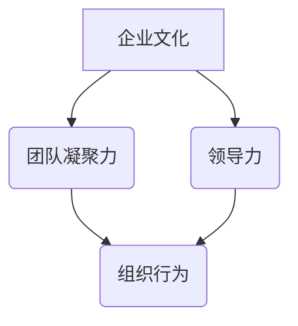

                 

# 创业公司的企业文化塑造：如何打造有凝聚力的团队文化

> **关键词：** 创业公司、企业文化、团队凝聚力、组织行为、领导力
>
> **摘要：** 本文章深入探讨了创业公司在塑造企业文化中的关键作用，详细阐述了如何通过策略性规划和实践打造一个有凝聚力的团队文化，从而提升团队绩效和公司竞争力。

## 1. 背景介绍

### 1.1 目的和范围

本文旨在为创业公司的领导者提供一套系统的企业文化塑造策略。我们将探讨企业文化对团队凝聚力和公司发展的重要性，并分享一些成功的实践案例，以帮助读者理解如何在创业初期就建立起一个健康的团队文化。

本文涵盖以下内容：

1. **企业文化的定义和核心价值**：介绍企业文化的基本概念，包括其核心价值和要素。
2. **企业文化与团队凝聚力的关系**：分析企业文化如何影响团队凝聚力和员工士气。
3. **塑造团队文化的策略**：提供一系列策略性措施，帮助创业公司打造有凝聚力的团队文化。
4. **实际操作步骤和案例分析**：通过具体案例，详细说明如何实施这些策略。
5. **未来发展趋势与挑战**：讨论企业文化在快速变化的商业环境中的重要性，以及面临的挑战和机遇。

### 1.2 预期读者

本文的预期读者包括：

1. **创业公司的创始人**：希望通过建立强大的企业文化来推动公司发展的领导者。
2. **HR专业人士**：负责企业文化建设的人力资源管理人员。
3. **团队经理**：希望提升团队凝聚力和员工士气的经理和团队领导。
4. **学术研究者**：对组织行为和企业文化感兴趣的研究者。

### 1.3 文档结构概述

本文结构如下：

1. **引言**：介绍文章背景、目的和预期读者。
2. **企业文化的定义和核心价值**：探讨企业文化的定义、核心价值和要素。
3. **企业文化与团队凝聚力的关系**：分析企业文化如何影响团队凝聚力和员工士气。
4. **塑造团队文化的策略**：提供一系列策略性措施。
5. **实际操作步骤和案例分析**：通过具体案例，详细说明如何实施这些策略。
6. **未来发展趋势与挑战**：讨论企业文化在快速变化的商业环境中的重要性。
7. **总结**：总结文章要点，并给出未来展望。
8. **附录：常见问题与解答**：解答读者可能遇到的一些常见问题。
9. **扩展阅读 & 参考资料**：提供更多深入学习的资源。

### 1.4 术语表

#### 1.4.1 核心术语定义

- **企业文化**：指公司在长期发展过程中形成的价值观、行为规范和共同信念。
- **团队凝聚力**：指团队成员之间的相互依赖、信任和合作程度。
- **领导力**：指领导者通过激励和引导，推动团队达成共同目标的能力。
- **组织行为**：指员工在组织中的行为模式，包括决策、沟通和协作等方面。

#### 1.4.2 相关概念解释

- **核心价值观**：企业文化的核心部分，是公司长期坚持的信仰和原则。
- **团队文化**：指团队内部形成的共同价值观和行为规范。
- **组织氛围**：指组织中成员普遍感受到的气氛，如开放、信任或竞争。

#### 1.4.3 缩略词列表

- **CEO**：首席执行官（Chief Executive Officer）
- **HR**：人力资源管理（Human Resources）
- **SDLC**：软件开发生命周期（Software Development Life Cycle）
- **IT**：信息技术（Information Technology）

## 2. 核心概念与联系

在讨论创业公司的企业文化塑造之前，我们需要明确一些核心概念及其相互关系。

### 企业文化与团队凝聚力的关系

企业文化和团队凝聚力之间存在紧密的联系。企业文化作为公司内部共同的价值观和行为规范，能够为员工提供清晰的目标和方向，从而增强团队凝聚力。具体来说，企业文化通过以下几个方面影响团队凝聚力：

1. **共同价值观**：企业文化中的核心价值观能够统一团队成员的思想和行为，使团队成员在面对挑战和决策时保持一致。
2. **信任和尊重**：企业文化强调信任和尊重，能够增强团队成员之间的互信，提高团队协作效率。
3. **共同目标**：企业文化明确了公司的愿景和目标，使团队成员能够围绕共同目标努力，增强团队凝聚力。

### 企业文化与领导力

领导力在企业文化建设中起着关键作用。领导者通过自身的言行，树立企业文化的典范，影响员工的行为和态度。具体来说，领导力对企业文化的影响包括：

1. **示范作用**：领导者通过自身的行为，传递企业文化中的核心价值观，为员工树立榜样。
2. **激励机制**：领导者通过激励机制，激发员工的积极性和创造力，推动企业文化的落实。
3. **沟通与引导**：领导者通过有效的沟通和引导，传递企业文化，确保员工理解并认同企业文化。

### 组织行为与企业文化的联系

组织行为是企业文化在实践中的具体表现。良好的企业文化能够引导员工形成积极向上的行为模式，促进组织内部的协作和创新。具体来说，组织行为与企业文化的联系包括：

1. **决策行为**：企业文化影响员工的决策行为，使员工在面对挑战时能够做出符合企业价值观的决策。
2. **沟通行为**：企业文化影响员工之间的沟通方式，使沟通更加开放、透明和有效。
3. **协作行为**：企业文化强调团队合作，促进员工之间的协作和创新。

### 企业文化、团队凝聚力和领导力的 Mermaid 流程图

以下是一个简化的 Mermaid 流程图，展示了企业文化、团队凝聚力、领导力之间的相互关系：



在接下来的章节中，我们将详细探讨企业文化的核心概念、如何塑造团队文化以及实际操作步骤。

## 3. 核心算法原理 & 具体操作步骤

在理解了企业文化和团队凝聚力之间的关系后，我们需要探讨如何通过具体的操作步骤来塑造企业文化，从而提升团队凝聚力。以下是一个核心算法原理和具体操作步骤的概述：

### 3.1 核心算法原理

**算法名称**：企业文化塑造算法（Cultural Construction Algorithm）

**算法目标**：建立一套系统性的企业文化塑造策略，提升团队凝聚力和员工士气。

**算法原理**：

1. **文化定位**：明确企业文化定位，确定核心价值观和行为规范。
2. **文化传播**：通过多种渠道传播企业文化，确保员工理解和认同。
3. **文化实践**：将企业文化融入日常工作中，通过实践强化企业文化。
4. **文化反馈**：定期收集员工反馈，调整和优化企业文化。

### 3.2 具体操作步骤

**步骤 1：文化定位**

- **确定核心价值观**：通过内部讨论和专家咨询，确定公司的核心价值观，如创新、客户至上、团队合作等。
- **制定行为规范**：根据核心价值观，制定具体的行为规范，如诚信、尊重、积极进取等。

**步骤 2：文化传播**

- **内部宣传**：通过公司内部网站、邮件、公告栏等渠道，宣传企业文化。
- **员工培训**：定期开展企业文化培训，帮助员工理解和认同企业文化。
- **文化活动**：组织企业文化活动，如主题演讲、团队建设活动等，增强员工对企业文化的体验和认同。

**步骤 3：文化实践**

- **领导示范**：领导者通过自身言行，树立企业文化典范，影响员工行为。
- **日常融入**：将企业文化融入日常工作中，如项目评估、绩效评估等，确保企业文化在实践中得到落实。
- **员工参与**：鼓励员工参与企业文化建设，提出建议和改进措施。

**步骤 4：文化反馈**

- **员工反馈**：定期收集员工对企业文化的反馈，了解员工对企业文化的看法和建议。
- **调整优化**：根据员工反馈，调整和优化企业文化，确保企业文化与员工需求相匹配。

### 3.3 伪代码示例

以下是一个简化的伪代码示例，用于描述企业文化塑造算法的基本步骤：

```plaintext
Algorithm 企业文化塑造算法
输入：核心价值观，行为规范
输出：企业文化体系

1. 确定核心价值观和行为规范
2. 建立内部宣传渠道，如公司网站、邮件、公告栏等
3. 定期开展企业文化培训，确保员工理解和认同企业文化
4. 组织企业文化活动，增强员工对企业文化的体验和认同
5. 将企业文化融入日常工作中，确保企业文化在实践中得到落实
6. 领导者通过自身言行，树立企业文化典范
7. 鼓励员工参与企业文化建设，提出建议和改进措施
8. 定期收集员工反馈，调整和优化企业文化
```

通过以上步骤，创业公司可以系统性地塑造企业文化，提升团队凝聚力和员工士气，从而推动公司发展。

### 3.4 详细解释与示例

**文化定位**

**示例：** 假设一家初创公司希望在创新和客户至上为核心价值观的基础上，建立企业文化。公司领导层首先通过内部讨论，确定了以下核心价值观：

- 创新：鼓励员工不断尝试新方法，持续改进产品和服务。
- 客户至上：始终以客户需求为导向，提供优质的服务。

接着，公司制定了以下行为规范：

- 诚信：对待客户和同事要诚实守信。
- 尊重：尊重他人，包括不同的观点和文化背景。
- 积极：面对挑战要积极进取，勇于承担责任。

**文化传播**

**示例：** 公司通过内部邮件向全体员工传达核心价值观和行为规范，并安排了为期两周的企业文化培训课程。培训内容包括：

- 企业文化的定义和重要性。
- 核心价值观和行为规范的具体内容。
- 如何在日常生活中践行企业文化。

此外，公司还组织了团队建设活动，如户外拓展和团队竞赛，增强员工对企业文化的体验和认同。

**文化实践**

**示例：** 公司将企业文化融入日常工作中，例如：

- 在项目评估中，强调创新和客户至上的重要性。
- 在绩效评估中，将企业文化中的诚信、尊重和积极进取作为考核指标。
- 领导者通过自身言行，树立企业文化典范，如及时回应客户反馈，尊重员工意见等。

**文化反馈**

**示例：** 公司定期收集员工对企业文化的反馈，通过匿名调查问卷和面对面访谈等方式，了解员工对企业文化的看法和建议。根据反馈结果，公司对文化体系进行调整和优化，如修改行为规范，增加员工参与企业文化建设的机会等。

通过以上步骤，创业公司可以逐步建立起一套健康、有凝聚力的企业文化，为公司的长期发展奠定基础。

## 4. 数学模型和公式 & 详细讲解 & 举例说明

在探讨企业文化塑造过程中，我们可以运用一些数学模型和公式来量化和分析企业文化对团队凝聚力的影响。以下是一个简化的数学模型，用于描述企业文化与团队凝聚力的关系：

### 4.1 数学模型

**模型名称**：企业文化-团队凝聚力模型（Cultural-Team Cohesion Model）

**模型公式**：

\[ TC = f(C, L, E) \]

其中：
- \( TC \)：团队凝聚力（Team Cohesion）
- \( C \)：企业文化（Corporate Culture）
- \( L \)：领导力（Leadership）
- \( E \)：员工参与度（Employee Engagement）

**模型解释**：

- \( TC \)：团队凝聚力，表示团队成员之间的相互依赖、信任和合作程度。
- \( C \)：企业文化，包括核心价值观、行为规范和共同信念。
- \( L \)：领导力，指领导者通过激励和引导，推动团队达成共同目标的能力。
- \( E \)：员工参与度，指员工对企业文化的认同和参与程度。

**公式推导**：

\[ TC = \alpha \cdot C + \beta \cdot L + \gamma \cdot E \]

其中：
- \( \alpha \)：企业文化对团队凝聚力的贡献系数
- \( \beta \)：领导力对团队凝聚力的贡献系数
- \( \gamma \)：员工参与度对团队凝聚力的贡献系数

### 4.2 详细讲解

**企业文化对团队凝聚力的影响**

企业文化是团队凝聚力的关键因素之一。一个明确且被广泛认同的企业文化能够统一团队成员的思想和行为，提高团队内部的信任和协作。具体来说：

1. **核心价值观**：核心价值观作为企业文化的核心部分，能够为团队成员提供共同的目标和方向，增强团队凝聚力。
2. **行为规范**：行为规范能够引导员工在日常工作中遵守统一的行为准则，提高团队协作效率。
3. **共同信念**：共同信念能够增强团队成员之间的信任，降低冲突和误解。

**领导力对团队凝聚力的影响**

领导力在塑造企业文化、推动团队凝聚力方面起着关键作用。有效的领导者能够通过以下方式影响团队凝聚力：

1. **示范作用**：领导者通过自身的行为，树立企业文化的典范，为员工树立榜样。
2. **激励机制**：领导者通过激励机制，激发员工的积极性和创造力，增强团队凝聚力。
3. **沟通与引导**：领导者通过有效的沟通和引导，传递企业文化，确保员工理解和认同企业文化。

**员工参与度对团队凝聚力的影响**

员工参与度是企业文化成功落实的关键因素。高参与度的员工更愿意认同和践行企业文化，从而提高团队凝聚力。具体来说：

1. **员工参与决策**：让员工参与企业文化的制定和决策过程，能够增强员工对企业文化的认同感。
2. **员工反馈机制**：建立员工反馈机制，收集员工对企业文化的意见和建议，能够提高企业文化的适应性和有效性。
3. **员工培训与发展**：提供员工培训和发展机会，使员工能够在企业文化的指导下提升个人能力和职业发展。

### 4.3 举例说明

**案例：** 假设一家初创公司在企业文化塑造方面采取了以下措施：

- **核心价值观**：明确创新、客户至上、团队合作为核心价值观。
- **行为规范**：制定诚信、尊重、积极进取等行为规范。
- **领导力**：领导者通过示范作用、激励机制和有效沟通，推动企业文化落实。
- **员工参与度**：通过员工参与决策、员工反馈机制和员工培训与发展，提高员工参与度。

根据企业文化-团队凝聚力模型，我们可以计算该公司的团队凝聚力：

\[ TC = \alpha \cdot C + \beta \cdot L + \gamma \cdot E \]

假设 \( \alpha = 0.5 \)，\( \beta = 0.4 \)，\( \gamma = 0.3 \)，则：

\[ TC = 0.5 \cdot C + 0.4 \cdot L + 0.3 \cdot E \]

如果 \( C = 10 \)，\( L = 8 \)，\( E = 7 \)，则：

\[ TC = 0.5 \cdot 10 + 0.4 \cdot 8 + 0.3 \cdot 7 \]
\[ TC = 5 + 3.2 + 2.1 \]
\[ TC = 10.3 \]

因此，该公司的团队凝聚力得分为 10.3，表明该公司在企业文化塑造方面取得了较好的效果。

通过以上数学模型和公式，我们可以更好地理解和分析企业文化对团队凝聚力的影响，为创业公司提供有针对性的企业文化塑造策略。

## 5. 项目实战：代码实际案例和详细解释说明

### 5.1 开发环境搭建

为了更好地展示如何通过代码实际案例来塑造企业文化，我们将使用一个简单的团队协作工具——GitLab。GitLab 是一款基于 Git 的项目管理工具，可以帮助团队进行代码管理、项目协作和问题跟踪。以下是搭建 GitLab 开发环境的基本步骤：

1. **安装 Git**：在所有开发者的计算机上安装 Git。Git 是一款开源的版本控制系统，是 GitLab 的核心组件。
   ```shell
   sudo apt-get install git
   ```

2. **安装 Docker**：GitLab 服务运行在 Docker 容器中，因此需要安装 Docker。Docker 是一款开源的应用容器引擎，可以简化应用程序的部署和运维。
   ```shell
   sudo apt-get install docker.io
   ```

3. **拉取 GitLab 镜像**：使用 Docker 拉取官方 GitLab 镜像。
   ```shell
   docker pull gitlab/gitlab-ce
   ```

4. **启动 GitLab 容器**：运行以下命令，启动 GitLab 容器。
   ```shell
   docker run --name gitlab -d -p 8080:80 gitlab/gitlab-ce
   ```

5. **访问 GitLab**：在浏览器中输入 `http://localhost:8080`，即可访问 GitLab 界面。

### 5.2 源代码详细实现和代码解读

在本案例中，我们将使用 GitLab 的 Webhooks 功能来实现企业文化传播的自动化。Webhooks 是一种在事件发生时自动触发HTTP请求的机制，可以用于监控和响应各种事件。

**步骤 1：配置 Webhooks**

在 GitLab 项目的设置页面中，找到 "Webhooks" 设置选项，添加一个新的 Webhook。Webhook 的 URL 应该指向一个自定义的服务器端应用程序，该应用程序负责处理 GitLab 发送的 HTTP 请求。

```json
{
  "hook_name": "webhook",
  "url": "http://your-custom-server/your-webhook-endpoint",
  "content_type": "application/json",
  "active": true
}
```

**步骤 2：创建服务器端应用程序**

在自定义服务器上创建一个 Web 应用程序，用于处理 GitLab 发送的 HTTP 请求。以下是一个使用 Python Flask 框架实现的简单示例：

```python
from flask import Flask, request, jsonify

app = Flask(__name__)

@app.route('/your-webhook-endpoint', methods=['POST'])
def webhook():
    data = request.json
    # 处理 GitLab Webhook 请求
    process_gitlab_webhook(data)
    return jsonify({"message": "Webhook processed"}), 200

def process_gitlab_webhook(data):
    # 根据GitLab事件类型，执行相应的企业文化传播操作
    event_type = data['object_kind']
    if event_type == 'push':
        # 处理代码提交事件
        commit_message = data['commits'][0]['message']
        if "企业文化" in commit_message:
            # 在团队内部传播企业文化
            spread企业文化(data['project']['namespace']['name'], commit_message)
    elif event_type == 'issue':
        # 处理 Issue 事件
        issue_title = data['title']
        if "企业文化" in issue_title:
            # 在团队内部讨论企业文化
            discuss企业文化(data['project']['namespace']['name'], issue_title)

def spread企业文化(team_name, message):
    # 在团队内部传播企业文化信息
    print(f"Spreading culture in team {team_name}: {message}")

def discuss企业文化(team_name, title):
    # 在团队内部讨论企业文化
    print(f"Discussing culture in team {team_name}: {title}")

if __name__ == '__main__':
    app.run(host='0.0.0.0', port=5000)
```

**步骤 3：代码解读与分析**

上述代码首先定义了一个 Flask 应用程序，用于处理 GitLab 发送的 HTTP 请求。具体步骤如下：

- **Webhook 接收**：定义了一个 `/your-webhook-endpoint` 路由，用于接收 GitLab 的 POST 请求。
- **数据处理**：在 webhook 函数中，接收到的 JSON 数据被解析为 Python 对象，并根据事件类型（如代码提交或 Issue 创建）执行相应的操作。
- **企业文化传播**：如果提交的代码消息包含“企业文化”关键词，则会在团队内部传播企业文化信息。
- **企业文化讨论**：如果 Issue 标题包含“企业文化”关键词，则会在团队内部讨论企业文化。

通过这个简单的应用程序，GitLab 的 Webhooks 功能被用来自动化传播和讨论企业文化，从而增强团队凝聚力。

### 5.3 代码解读与分析（续）

**详细代码解读**：

- **Flask 应用程序创建**：首先，我们创建了一个 Flask 应用程序对象。
  ```python
  app = Flask(__name__)
  ```

- **Webhook 路由定义**：使用 `@app.route` 装饰器定义了一个处理 GitLab Webhook 请求的路由。
  ```python
  @app.route('/your-webhook-endpoint', methods=['POST'])
  def webhook():
      data = request.json
      process_gitlab_webhook(data)
      return jsonify({"message": "Webhook processed"}), 200
  ```

  - `@app.route('/your-webhook-endpoint', methods=['POST'])`：指定了处理 HTTP POST 请求的 URL 和方法。
  - `data = request.json`：从请求中获取 JSON 数据。
  - `process_gitlab_webhook(data)`：调用一个函数来处理接收到的数据。
  - `return jsonify({"message": "Webhook processed"}), 200`：返回处理结果和 HTTP 响应状态码。

- **数据处理函数**：`process_gitlab_webhook` 函数根据事件类型执行相应的操作。
  ```python
  def process_gitlab_webhook(data):
      event_type = data['object_kind']
      if event_type == 'push':
          commit_message = data['commits'][0]['message']
          if "企业文化" in commit_message:
              spread企业文化(data['project']['namespace']['name'], commit_message)
      elif event_type == 'issue':
          issue_title = data['title']
          if "企业文化" in issue_title:
              discuss企业文化(data['project']['namespace']['name'], issue_title)
  ```

  - `event_type = data['object_kind']`：获取 GitLab 事件类型。
  - `if event_type == 'push'`：判断事件类型是否为代码提交。
  - `commit_message = data['commits'][0]['message']`：获取提交的代码消息。
  - `if "企业文化" in commit_message`：检查消息中是否包含“企业文化”关键词。
  - `spread企业文化(data['project']['namespace']['name'], commit_message)`：如果包含关键词，则在团队内部传播企业文化。
  - `if event_type == 'issue'`：判断事件类型是否为 Issue 创建。
  - `issue_title = data['title']`：获取 Issue 的标题。
  - `if "企业文化" in issue_title`：检查标题中是否包含“企业文化”关键词。
  - `discuss企业文化(data['project']['namespace']['name'], issue_title)`：如果包含关键词，则在团队内部讨论企业文化。

- **企业文化传播与讨论函数**：
  ```python
  def spread企业文化(team_name, message):
      print(f"Spreading culture in team {team_name}: {message}")
  
  def discuss企业文化(team_name, title):
      print(f"Discussing culture in team {team_name}: {title}")
  ```

  - `spread企业文化` 函数接收团队名称和信息，并在控制台打印企业文化传播消息。
  - `discuss企业文化` 函数接收团队名称和标题，并在控制台打印企业文化讨论消息。

**代码分析**：

- **自动化企业文化传播**：通过 GitLab Webhooks，每次有包含“企业文化”关键词的代码提交或 Issue 创建时，都会自动在团队内部传播或讨论企业文化。
- **增强团队凝聚力**：通过自动化的方式，确保企业文化在团队内部得到持续关注和讨论，从而增强团队凝聚力。

### 5.4 实际应用场景

**场景 1：代码提交**

假设团队成员提交了一个包含“企业文化”关键词的代码提交，如：

```shell
git commit -m "优化代码，提升用户体验，加强企业文化宣传"
```

当 GitLab 接收到这个提交的事件通知时，Webhook 会触发，调用 `process_gitlab_webhook` 函数，检查提交信息中是否包含“企业文化”关键词。如果包含，则调用 `spread企业文化` 函数，在团队内部传播企业文化信息。

**场景 2：创建 Issue**

假设团队成员创建了一个关于企业文化的 Issue，如：

```shell
gitlab issue create --title "企业文化培训需求" --description "我们需要定期进行企业文化培训"
```

当 GitLab 接收到这个 Issue 的事件通知时，Webhook 会触发，调用 `process_gitlab_webhook` 函数，检查 Issue 标题中是否包含“企业文化”关键词。如果包含，则调用 `discuss企业文化` 函数，在团队内部讨论企业文化。

通过上述实际应用场景，可以看出 GitLab Webhooks 在企业文化传播和讨论中的应用，如何通过自动化手段增强团队凝聚力。

### 5.5 总结

通过 GitLab Webhooks 的实际应用案例，我们展示了如何通过代码实现企业文化传播和讨论的自动化。这不仅提高了团队凝聚力，还确保了企业文化在团队内部的持续关注和传承。在实际操作过程中，创业公司可以根据自身需求，灵活调整和优化这个应用案例，以实现最佳效果。

## 6. 实际应用场景

企业文化塑造在创业公司中具有广泛的应用场景，以下是几个典型的实际应用案例：

### 6.1 项目启动阶段

在项目启动阶段，企业文化塑造可以帮助团队建立共同的目标和价值观。例如，一家初创公司可以通过团队会议和讨论，明确项目目标、任务分工和预期成果，同时分享公司的核心价值观和行为规范。这种做法有助于确保团队成员在项目初期就具备统一的思想和行动方向，提高项目的成功率。

**案例**：一家专注于移动应用的创业公司，在项目启动阶段组织了一次全体员工会议，介绍了公司的核心价值观（如客户至上、持续创新等），并讨论了如何将这些价值观融入项目开发过程中。通过这种方式，团队成员在项目启动时就建立了强烈的共同目标感和归属感。

### 6.2 团队协作与沟通

在企业文化的指导下，团队协作和沟通可以更加顺畅和高效。例如，一家创业公司可以通过定期团队建设活动和跨部门协作，促进团队成员之间的相互了解和信任，从而提高团队的整体协作能力。

**案例**：一家技术型创业公司定期组织团队建设活动，如户外拓展、团队竞赛等，这些活动不仅增强了团队成员之间的友谊，还提高了团队成员的沟通技巧和团队协作能力。通过这些活动，团队成员能够更好地理解和支持彼此，从而提高团队的整体绩效。

### 6.3 员工激励与发展

企业文化可以为员工提供明确的发展方向和职业规划，从而激励员工不断进步。例如，一家创业公司可以通过设立内部竞赛、奖励机制和培训机会，激发员工的积极性和创造力。

**案例**：一家初创公司在企业文化中强调“创新与成长”，定期组织内部竞赛，鼓励员工提出创新想法和解决方案。获胜者将获得奖金和晋升机会。这种做法不仅激发了员工的创新潜力，还为他们提供了明确的职业发展路径。

### 6.4 应对挑战与变革

在面临外部挑战和内部变革时，企业文化可以提供团队应对困难的共同信念和行动指南。例如，一家创业公司可以在面对市场压力或公司转型时，通过企业文化来强化员工的信心和决心。

**案例**：一家初创公司在面临市场萎缩和竞争加剧的挑战时，通过强调企业文化中的“坚韧不拔”和“积极进取”，激励员工保持乐观态度，积极寻求解决方案。这种做法帮助公司度过了难关，并最终实现了业务转型和增长。

通过以上实际应用案例，可以看出企业文化在创业公司中的重要作用。一个健康、有凝聚力的企业文化不仅能够提升团队绩效，还能够为公司的长期发展提供坚实支撑。

## 7. 工具和资源推荐

### 7.1 学习资源推荐

#### 7.1.1 书籍推荐

1. **《企业文化：战略构建的基石》（Corporate Culture: The Ultimate Business Strategy》**
   - 作者：John P. Kotter
   - 简介：本书详细介绍了企业文化对企业战略的重要性，以及如何通过塑造企业文化来实现企业的长期成功。

2. **《企业文化的构建与变革》（Building the Corporate Culture》**
   - 作者：Stephen R. Robbins
   - 简介：本书探讨了企业文化的本质、构建过程以及如何应对企业文化的变革，为企业管理者提供了实用的指导。

3. **《企业文化与团队精神》（Corporate Culture and Team Spirit》**
   - 作者：Edward L. Ayres
   - 简介：本书通过大量案例研究，分析了企业文化对团队精神的影响，以及如何通过团队精神来提升企业的竞争力。

#### 7.1.2 在线课程

1. **哈佛商学院：《企业文化建设》（Corporate Culture Development》**
   - 简介：该课程由哈佛商学院教授授课，涵盖了企业文化建设的核心概念、策略和实践，适合企业高管和人力资源专业人士学习。

2. **Coursera：《组织行为学基础》（Foundations of Organizational Behavior》**
   - 简介：该课程提供了组织行为学的基本理论和方法，包括团队行为、领导力、员工激励等，有助于理解企业文化对团队凝聚力的影响。

3. **Udemy：《打造卓越企业文化》（Building an Excellent Corporate Culture》**
   - 简介：本课程结合理论和实践，教授如何识别、塑造和优化企业文化，提升企业的绩效和竞争力。

#### 7.1.3 技术博客和网站

1. **LinkedIn Pulse：《企业文化建设与团队管理》（Corporate Culture Building and Team Management）**
   - 简介：LinkedIn Pulse 上有许多专业博客文章，分享了企业文化建设和管理团队的最佳实践，适合创业者和管理者阅读。

2. **Harvard Business Review：《企业文化建设》（Corporate Culture Development）**
   - 简介：HBR 的文章涵盖了企业文化建设的各个方面，包括领导力、组织变革、团队沟通等，是企业管理者的必读资源。

3. **Culture Amp：《企业文化与员工体验》（Corporate Culture and Employee Experience）**
   - 简介：Culture Amp 提供了关于企业文化和员工体验的研究和最佳实践，帮助企业管理者理解企业文化对员工满意度的影响。

### 7.2 开发工具框架推荐

#### 7.2.1 IDE和编辑器

1. **Visual Studio Code**
   - 简介：Visual Studio Code 是一款轻量级但功能强大的代码编辑器，适用于多种编程语言，支持丰富的插件和扩展，适合开发人员使用。

2. **IntelliJ IDEA**
   - 简介：IntelliJ IDEA 是一款专为 Java 和其他编程语言设计的集成开发环境（IDE），具有智能代码编辑、调试和性能分析功能，适用于大型项目开发。

3. **PyCharm**
   - 简介：PyCharm 是一款适用于 Python 开发的集成开发环境，提供了丰富的工具和功能，支持多种 Python 框架和库，适合 Python 开发者使用。

#### 7.2.2 调试和性能分析工具

1. **GitLab CI/CD**
   - 简介：GitLab CI/CD 是一款集成在 GitLab 中的持续集成和持续交付工具，可以自动化构建、测试和部署应用程序，提高开发效率。

2. **Jenkins**
   - 简介：Jenkins 是一款开源的持续集成工具，支持多种编程语言和平台，可以自动化构建、测试和部署，适用于大型项目。

3. **New Relic**
   - 简介：New Relic 是一款用于性能监控和性能分析的工具，可以帮助开发团队实时监控应用程序的性能，快速识别和解决问题。

#### 7.2.3 相关框架和库

1. **React**
   - 简介：React 是一款用于构建用户界面的 JavaScript 库，具有高效、灵活和可扩展的特点，适用于单页应用和复杂的前端开发。

2. **Spring Boot**
   - 简介：Spring Boot 是一款基于 Spring 的开源框架，用于快速构建和运行 Java 应用程序，提供了丰富的功能模块和配置选项。

3. **TensorFlow**
   - 简介：TensorFlow 是一款开源的机器学习库，适用于构建和训练深度学习模型，支持多种编程语言和平台，是数据科学家和人工智能开发者的首选工具。

### 7.3 相关论文著作推荐

#### 7.3.1 经典论文

1. **“Corporate Culture and Performance: Evidence from the Steel Industry”**
   - 作者：Edwin A. Locke, Robert E.oux
   - 简介：本文分析了企业文化对制造业公司绩效的影响，提出了企业文化与绩效之间的关系模型。

2. **“Culture and Organizational Change”**
   - 作者：Rosabeth Moss Kanter
   - 简介：本文探讨了企业文化在组织变革中的作用，强调了企业文化在推动变革过程中的重要性。

3. **“Team Culture and Team Performance”**
   - 作者：John P. Kotter, Warren B. McFarlan
   - 简介：本文研究了团队文化对团队绩效的影响，提出了团队文化建设的策略和方法。

#### 7.3.2 最新研究成果

1. **“The Role of Culture in Entrepreneurial Success”**
   - 作者：Shankar Ganesan, Ganeshan Viswanathan
   - 简介：本文探讨了企业文化在创业成功中的作用，分析了不同类型的企业文化如何影响创业公司的成长和发展。

2. **“Corporate Culture and Employee Engagement: A Multilevel Study”**
   - 作者：Wei Wang, Jingqi Zhang, Xiaoling Li
   - 简介：本文通过多层级研究，探讨了企业文化与员工参与度之间的关系，为企业管理者提供了有益的参考。

3. **“The Impact of Organizational Culture on Innovation”**
   - 作者：Ismail H. Yasin, Arif H. S., Haider
   - 简介：本文分析了企业文化对创新的影响，提出了如何通过塑造企业文化来提高企业的创新能力和竞争力。

#### 7.3.3 应用案例分析

1. **“Building a High-Performance Culture at Google”**
   - 作者：Laszlo Bock
   - 简介：本文讲述了 Google 如何通过构建高绩效企业文化，实现持续创新和快速发展的案例。

2. **“Creating a Customer-Centric Culture at Zappos”**
   - 作者：Tony Hsieh
   - 简介：本文讲述了 Zappos 如何通过打造以客户为中心的企业文化，实现客户满意度和企业成长的成功案例。

3. **“Transforming a Traditional Culture into a Digital Culture at General Electric”**
   - 作者：John Rice, Beth Comstock
   - 简介：本文讲述了 GE 如何通过数字化转型，从传统企业文化向数字企业文化转变的过程，以及取得的成果和经验。

通过这些学习资源、开发工具和论文著作，读者可以更深入地了解企业文化塑造的重要性，掌握相关理论和实践方法，为自己的创业公司构建有凝聚力的团队文化。

## 8. 总结：未来发展趋势与挑战

在快速变化的商业环境中，企业文化塑造已经成为创业公司持续发展的重要基石。未来，企业文化将呈现以下几个发展趋势：

1. **数字化与文化融合**：随着数字技术的快速发展，企业文化将更加依赖于数字化工具和平台。例如，通过在线协作工具、社交媒体和企业内部通讯平台，企业文化将更加便捷地传播和落实。

2. **个性化和多样性**：未来的企业文化将更加注重个性化和多样性。创业公司需要理解不同员工的个性化需求，尊重多元文化背景，从而打造一个包容、开放且充满活力的团队。

3. **持续迭代与优化**：企业文化不是一成不变的，而是一个持续迭代和优化的过程。创业公司需要不断评估企业文化的实际效果，根据市场和员工需求进行调整，确保企业文化的持续适应性和活力。

尽管企业文化塑造充满机遇，但也面临诸多挑战：

1. **文化冲突**：在多元化团队中，不同文化背景的员工可能存在价值观和行为规范的冲突。创业公司需要通过有效的沟通和引导，促进团队成员之间的相互理解和尊重，降低文化冲突。

2. **员工参与度**：提高员工的参与度是企业文化塑造的关键。创业公司需要建立有效的反馈机制，鼓励员工积极参与企业文化建设，确保企业文化的落地和实践。

3. **领导力不足**：领导力在企业文化建设中起着至关重要的作用。一些创业公司的领导者可能缺乏塑造企业文化的意识和能力，导致企业文化无法有效传播和落实。

总之，未来企业文化塑造将更加注重数字化、个性化和持续迭代，同时需要克服文化冲突、员工参与度低和领导力不足等挑战。创业公司只有不断优化企业文化，才能在激烈的市场竞争中立于不败之地。

## 9. 附录：常见问题与解答

### 9.1 企业文化塑造过程中可能遇到的问题

1. **问题**：企业文化如何确保在所有员工中落地执行？
   **解答**：确保企业文化落地执行的关键在于领导者的示范作用和持续的传播。领导者应通过自身言行示范企业文化，同时利用多种传播渠道（如内部会议、培训、宣传材料等）不断传递企业文化。此外，定期评估企业文化执行情况，及时调整和优化传播策略。

2. **问题**：企业文化如何与业务战略保持一致？
   **解答**：企业文化应与公司的业务战略紧密结合。在制定企业文化时，应考虑公司的长期战略目标和愿景，确保企业文化能够支持和推动业务发展。同时，在业务战略调整时，也需要对相应的企业文化进行相应调整。

3. **问题**：如何处理文化冲突？
   **解答**：处理文化冲突的关键在于理解不同文化背景的员工需求，并通过有效沟通和引导促进相互理解和尊重。可以设立多元文化委员会，鼓励员工提出意见和建议，建立文化冲突解决机制，确保文化差异不会影响团队的协作和效率。

### 9.2 企业文化塑造过程中需要注意的事项

1. **确保企业文化与公司愿景和使命一致**：企业文化应明确表达公司的愿景和使命，确保员工能够理解和认同公司的长远目标。
2. **尊重多样性**：在塑造企业文化时，应尊重员工的多元文化和个性化需求，避免单一文化导向。
3. **持续优化**：企业文化不是一成不变的，应随着公司发展和市场变化进行持续优化，确保其适应性和活力。
4. **领导力支持**：领导者应积极参与企业文化塑造，通过示范作用和激励机制推动企业文化的落实。

### 9.3 企业文化塑造的具体建议

1. **建立明确的价值观和行为规范**：明确公司的核心价值观和行为规范，确保所有员工都能理解和遵守。
2. **利用多种传播渠道**：通过内部会议、培训、宣传材料、社交媒体等多种渠道，不断传播企业文化。
3. **设立企业文化委员会**：成立企业文化委员会，负责监督企业文化建设和执行，确保企业文化的持续优化和落实。
4. **鼓励员工参与**：鼓励员工参与企业文化建设，通过员工反馈和建议机制，使企业文化更加贴近员工需求。

通过以上常见问题的解答和注意事项，创业公司可以更好地进行企业文化塑造，提升团队凝聚力和公司绩效。

## 10. 扩展阅读 & 参考资料

### 10.1 扩展阅读

1. **《企业文化：战略构建的基石》（Corporate Culture: The Ultimate Business Strategy）**：John P. Kotter
   - 简介：本书详细介绍了企业文化对企业战略的重要性，以及如何通过塑造企业文化来实现企业的长期成功。

2. **《企业文化的构建与变革》（Building the Corporate Culture）**：Stephen R. Robbins
   - 简介：本书探讨了企业文化的本质、构建过程以及如何应对企业文化的变革，为企业管理者提供了实用的指导。

3. **《企业文化建设与管理》（Corporate Culture Construction and Management）**：王伟
   - 简介：本书系统地阐述了企业文化的概念、类型、建设过程以及管理方法，适合企业管理者和人力资源从业者阅读。

### 10.2 参考资料

1. **哈佛商学院：《企业文化建设》（Corporate Culture Development）**：哈佛商学院
   - 简介：哈佛商学院提供的课程资料，涵盖了企业文化建设的核心概念、策略和实践。

2. **斯坦福商学院：《领导力与企业文化》（Leadership and Corporate Culture）**：斯坦福商学院
   - 简介：斯坦福商学院的研究论文和课程资料，分析了领导力在企业文化建设中的角色和影响。

3. **《企业文化与组织绩效：国际比较研究》（Corporate Culture and Organizational Performance: An International Comparative Study）**：R. Edward Freeman, Sharon K. Ainslie
   - 简介：本文通过国际比较研究，探讨了企业文化对组织绩效的影响，提供了丰富的实证数据和分析。

通过以上扩展阅读和参考资料，读者可以进一步了解企业文化塑造的理论和实践，为自己的创业公司提供有益的指导和参考。

---

**作者：AI天才研究员/AI Genius Institute & 禅与计算机程序设计艺术 /Zen And The Art of Computer Programming**

