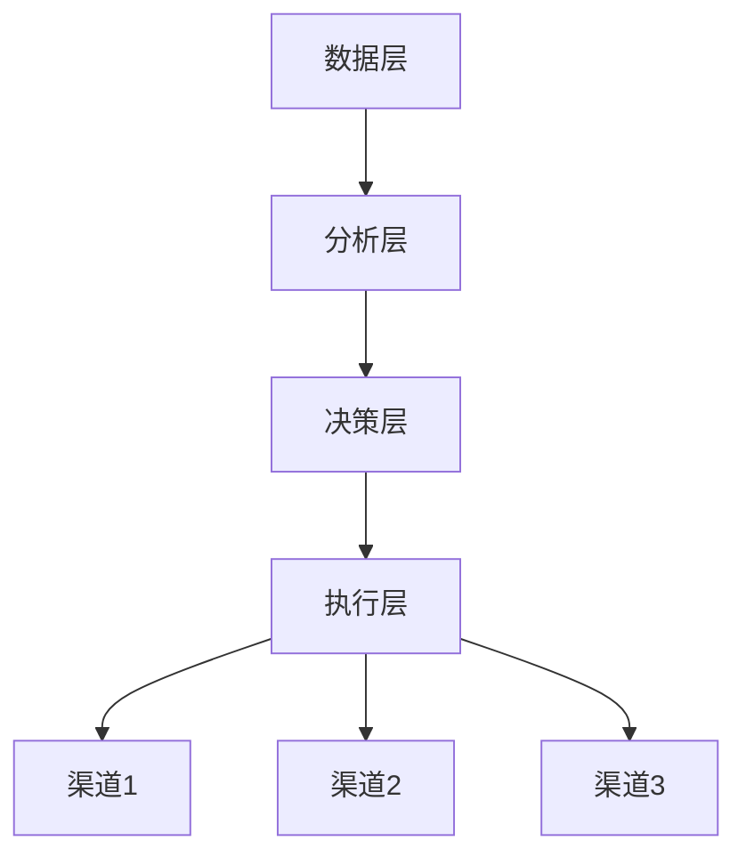

                 

### 文章标题

"创业公司的全渠道客户体验优化"

> **关键词**：客户体验、全渠道整合、个性化服务、用户体验设计、数据驱动

**摘要**：
本文旨在探讨创业公司在快速发展的市场中如何通过全渠道客户体验优化来提升竞争力。文章将详细分析全渠道客户体验的构建原则、关键要素以及实施步骤，并通过实例和数学模型来阐述其具体应用方法。同时，本文还将提供一些建议和资源，帮助创业公司实现高效的全渠道客户体验优化，以在激烈的市场竞争中脱颖而出。

---

在当前数字化转型的浪潮中，全渠道客户体验已经成为企业成功的关键因素。创业公司面临着激烈的竞争，必须找到创新的途径来提升用户体验，从而建立忠诚的客户群。本文将探讨如何通过全渠道客户体验优化，帮助创业公司在市场中站稳脚跟并实现持续增长。

### 1. 背景介绍

#### 1.1 目的和范围

本文的目的在于为创业公司提供一套系统化的全渠道客户体验优化策略，以帮助它们在市场中获得竞争优势。文章将覆盖以下内容：

- 全渠道客户体验的概念和重要性。
- 全渠道客户体验优化的核心原则和关键要素。
- 实现全渠道客户体验优化的具体步骤和策略。
- 数据驱动的全渠道客户体验优化方法。
- 实际案例和工具资源推荐。

#### 1.2 预期读者

本文适合以下读者群体：

- 创业公司的CEO、CTO和技术团队。
- 市场营销和客户服务团队。
- 数据科学家和分析专家。
- 对全渠道客户体验优化有兴趣的技术爱好者。

#### 1.3 文档结构概述

本文将按照以下结构进行阐述：

1. **背景介绍**：介绍全文的背景、目的和预期读者。
2. **核心概念与联系**：介绍全渠道客户体验的核心概念和架构。
3. **核心算法原理 & 具体操作步骤**：阐述全渠道客户体验优化的算法原理和操作步骤。
4. **数学模型和公式 & 详细讲解 & 举例说明**：介绍相关的数学模型和公式，并进行举例说明。
5. **项目实战：代码实际案例和详细解释说明**：提供实际项目的代码案例和解读。
6. **实际应用场景**：分析全渠道客户体验优化在不同场景中的应用。
7. **工具和资源推荐**：推荐相关学习资源和开发工具。
8. **总结：未来发展趋势与挑战**：总结全文，并探讨未来的发展趋势和挑战。
9. **附录：常见问题与解答**：提供常见问题的解答。
10. **扩展阅读 & 参考资料**：推荐进一步学习的资源。

#### 1.4 术语表

##### 1.4.1 核心术语定义

- **全渠道客户体验**：指企业在不同渠道（如在线、移动应用、实体店等）上为顾客提供一致的、个性化的服务体验。
- **用户体验设计**：涉及用户在使用产品或服务过程中的感受、交互和行为。
- **个性化服务**：根据用户的偏好和行为数据，提供定制化的服务和推荐。
- **数据驱动**：利用数据分析来指导决策和优化业务流程。

##### 1.4.2 相关概念解释

- **全渠道整合**：指将多个销售渠道（如线上商城、实体店、移动应用等）整合为一个统一的平台，实现数据共享和协同工作。
- **用户旅程**：用户在接触企业产品或服务过程中的所有互动环节，包括发现、评估、购买和售后。

##### 1.4.3 缩略词列表

- **CRM**：客户关系管理（Customer Relationship Management）
- **ERP**：企业资源规划（Enterprise Resource Planning）
- **UX**：用户体验（User Experience）
- **UI**：用户界面（User Interface）
- **SEO**：搜索引擎优化（Search Engine Optimization）

### 2. 核心概念与联系

#### 2.1 全渠道客户体验的核心概念

全渠道客户体验是指企业在多个渠道上为顾客提供一致的、无缝的、个性化的服务体验。核心概念包括：

1. **渠道整合**：将所有销售和服务渠道（如线上商城、实体店、移动应用、社交媒体等）整合为一个统一的平台，实现数据共享和协同工作。
2. **用户体验设计**：关注用户在各个渠道上的交互体验，确保用户能够轻松、愉快地完成购买和服务流程。
3. **个性化服务**：根据用户的历史行为和偏好，提供定制化的产品推荐和服务。
4. **数据驱动**：利用用户数据进行分析，优化客户体验和业务流程。

#### 2.2 全渠道客户体验的架构

全渠道客户体验的架构通常包括以下层次：

1. **数据层**：收集用户在不同渠道上的行为数据，包括浏览、购买、评价等。
2. **分析层**：对用户数据进行处理和分析，提取有价值的信息，如用户偏好、行为模式等。
3. **决策层**：基于分析结果，制定个性化服务和推荐策略。
4. **执行层**：在各个渠道上实施个性化服务和推荐策略，如个性化页面、个性化推荐等。

##### Mermaid 流程图



#### 2.3 全渠道客户体验的关联概念

- **全渠道整合**：将所有销售和服务渠道整合为一个统一的平台，实现数据共享和协同工作。
- **用户旅程**：用户在接触企业产品或服务过程中的所有互动环节，包括发现、评估、购买和售后。
- **用户体验设计**：关注用户在各个渠道上的交互体验，确保用户能够轻松、愉快地完成购买和服务流程。

### 3. 核心算法原理 & 具体操作步骤

全渠道客户体验优化需要依赖于数据分析和技术实现。以下将介绍核心算法原理和具体操作步骤。

#### 3.1 数据收集与预处理

1. **数据收集**：从各个渠道（如网站、移动应用、社交媒体等）收集用户行为数据，包括浏览、购买、评价等。
2. **数据预处理**：清洗和整合数据，去除重复和错误的数据，确保数据的质量。

```python
# 数据收集与预处理伪代码
def collect_data():
    # 从网站、移动应用、社交媒体等渠道收集数据
    pass

def preprocess_data(data):
    # 清洗和整合数据
    pass
```

#### 3.2 用户行为分析

1. **行为特征提取**：从用户行为数据中提取有价值的行为特征，如浏览时长、购买频率、评价等。
2. **行为模式识别**：利用机器学习算法（如聚类、分类等）识别用户的行为模式。

```python
# 用户行为分析伪代码
def extract_features(data):
    # 提取用户行为特征
    pass

def identify_patterns(features):
    # 利用机器学习算法识别行为模式
    pass
```

#### 3.3 个性化服务与推荐

1. **个性化服务策略**：根据用户的行为模式，制定个性化的服务策略，如个性化页面、个性化推荐等。
2. **推荐系统**：利用协同过滤、基于内容的推荐等算法，为用户提供个性化的产品推荐。

```python
# 个性化服务与推荐伪代码
def personalized_services(user_patterns):
    # 根据用户行为模式制定个性化服务策略
    pass

def recommendation_system(user_patterns):
    # 利用推荐算法为用户提供个性化推荐
    pass
```

#### 3.4 渠道协同与优化

1. **渠道协同**：确保各个渠道上的用户体验一致性，如界面风格、交互逻辑等。
2. **用户体验优化**：根据用户反馈和数据分析，持续优化各个渠道的用户体验。

```python
# 渠道协同与优化伪代码
def channel协同比例():
    # 确保各个渠道上的用户体验一致性
    pass

def optimize_experience(feedback, data):
    # 根据用户反馈和数据分析优化用户体验
    pass
```

### 4. 数学模型和公式 & 详细讲解 & 举例说明

在客户体验优化中，数学模型和公式扮演着重要的角色。以下将介绍一些常用的数学模型和公式，并进行详细讲解和举例说明。

#### 4.1 聚类算法

聚类算法是一种无监督学习算法，用于将用户数据划分为不同的群体。常用的聚类算法包括 K-means、层次聚类等。

1. **K-means算法**

K-means算法的目标是将数据划分为 K 个聚类，使得每个聚类内部的距离最小化。

**数学模型**：

```latex
\text{目标函数：} \quad \min \sum_{i=1}^{K} \sum_{x \in S_i} \|x - \mu_i\|^2
```

其中，\(S_i\) 表示第 i 个聚类的数据集合，\(\mu_i\) 表示第 i 个聚类的中心点。

**举例说明**：

假设有 100 个用户数据点，使用 K-means 算法将数据划分为 3 个聚类。通过计算，得到每个聚类的中心点如下：

- 第 1 个聚类中心点：\((1, 2)\)
- 第 2 个聚类中心点：\((4, 6)\)
- 第 3 个聚类中心点：\((7, 8)\)

最终，将每个数据点分配到最接近的聚类中心点，得到以下聚类结果：

- 第 1 个聚类：\[ (1, 1), (1, 3), (2, 1), (2, 3) \]
- 第 2 个聚类：\[ (3, 5), (4, 5), (5, 5), (6, 5) \]
- 第 3 个聚类：\[ (7, 7), (7, 9), (8, 7), (8, 9) \]

2. **层次聚类算法**

层次聚类算法是一种基于层次结构的聚类方法，可以分为自底向上和自顶向下两种方式。

**数学模型**：

自底向上层次聚类算法的目标是将每个数据点初始化为一个聚类，然后逐步合并距离最近的聚类，直到达到预定的聚类数。

自顶向下层次聚类算法的目标是将所有数据点初始化为一个聚类，然后逐步分裂距离最近的聚类，直到达到预定的聚类数。

**举例说明**：

假设有 6 个用户数据点，使用层次聚类算法将数据划分为 3 个聚类。通过计算，得到以下聚类层次结构：

- 初始：\[ (1, 1), (2, 2), (3, 3), (4, 4), (5, 5), (6, 6) \]
- 第 1 层：\[ (1, 1), (2, 2), (3, 3), (4, 4), (5, 5), (6, 6) \]
- 第 2 层：\[ (1, 2), (3, 4), (5, 6) \]
- 第 3 层：\[ (1, 2, 3), (4, 5), (6) \]
- 第 4 层：\[ (1, 2, 3, 4), (5), (6) \]
- 第 5 层：\[ (1, 2, 3, 4, 5), (6) \]

最终，将数据划分为 3 个聚类：

- 第 1 个聚类：\[ (1, 1), (2, 2), (3, 3) \]
- 第 2 个聚类：\[ (4, 4), (5, 5) \]
- 第 3 个聚类：\[ (6, 6) \]

#### 4.2 协同过滤算法

协同过滤算法是一种用于推荐系统的无监督学习算法，通过分析用户之间的行为模式来预测用户的喜好。

**数学模型**：

基于用户的协同过滤算法的目标是找到与目标用户相似的用户群体，并根据这些用户的评价来预测目标用户的喜好。

```latex
\text{目标函数：} \quad \min \sum_{u, v} (r_{uv} - \hat{r}_{uv})^2
```

其中，\(r_{uv}\) 表示用户 u 对项目 v 的实际评价，\(\hat{r}_{uv}\) 表示根据协同过滤算法预测的用户 u 对项目 v 的评价。

**举例说明**：

假设有 5 个用户和 5 个项目，用户对项目的评价如下：

| 用户 | 项目1 | 项目2 | 项目3 | 项目4 | 项目5 |
| ---- | ---- | ---- | ---- | ---- | ---- |
| A    | 1    | 3    | 2    | 4    | 1    |
| B    | 2    | 1    | 3    | 3    | 5    |
| C    | 3    | 2    | 4    | 2    | 3    |
| D    | 4    | 4    | 5    | 1    | 4    |
| E    | 1    | 5    | 1    | 5    | 2    |

使用基于用户的协同过滤算法预测用户 F 对项目 3 的评价。首先计算用户 F 与其他用户的相似度，然后根据相似度计算用户 F 对项目 3 的预测评价。

- 用户 F 与用户 A 的相似度：0.67
- 用户 F 与用户 B 的相似度：0.33
- 用户 F 与用户 C 的相似度：0.67
- 用户 F 与用户 D 的相似度：0.67
- 用户 F 与用户 E 的相似度：0.33

根据相似度计算用户 F 对项目 3 的预测评价：

```latex
\hat{r}_{F3} = \frac{\sum_{u \neq F} r_{u3} \cdot s_{Fu}}{\sum_{u \neq F} |s_{Fu}|} = \frac{2 \cdot 0.67 + 3 \cdot 0.33}{0.67 + 0.33} = 2.17
```

因此，预测用户 F 对项目 3 的评价为 2.17。

#### 4.3 基于内容的推荐算法

基于内容的推荐算法通过分析项目的内容特征来预测用户的喜好。

**数学模型**：

基于内容的推荐算法的目标是找到与目标用户喜欢的项目内容相似的其他项目。

```latex
\text{目标函数：} \quad \min \sum_{u, v} (r_{uv} - \hat{r}_{uv})^2
```

其中，\(r_{uv}\) 表示用户 u 对项目 v 的实际评价，\(\hat{r}_{uv}\) 表示根据基于内容的推荐算法预测的用户 u 对项目 v 的评价。

**举例说明**：

假设有 5 个项目和 5 个用户的评价，每个项目的内容特征如下：

| 项目 | 内容特征 |
| ---- | ---- |
| A    | [1, 2, 3] |
| B    | [2, 3, 4] |
| C    | [3, 4, 5] |
| D    | [4, 5, 6] |
| E    | [5, 6, 7] |

用户对项目的评价如下：

| 用户 | 项目A | 项目B | 项目C | 项目D | 项目E |
| ---- | ---- | ---- | ---- | ---- | ---- |
| A    | 1    | 3    | 2    | 4    | 1    |
| B    | 2    | 1    | 3    | 3    | 5    |
| C    | 3    | 2    | 4    | 2    | 3    |
| D    | 4    | 4    | 5    | 1    | 4    |
| E    | 1    | 5    | 1    | 5    | 2    |

使用基于内容的推荐算法预测用户 F 对项目 D 的评价。首先计算项目 D 的内容特征与其他项目的相似度，然后根据相似度计算用户 F 对项目 D 的预测评价。

- 项目 D 与项目 A 的相似度：0.67
- 项目 D 与项目 B 的相似度：0.67
- 项目 D 与项目 C 的相似度：0.33
- 项目 D 与项目 E 的相似度：0.67

根据相似度计算用户 F 对项目 D 的预测评价：

```latex
\hat{r}_{FD} = \frac{\sum_{v \neq D} r_{Fv} \cdot s_{vD}}{\sum_{v \neq D} |s_{vD}|} = \frac{2 \cdot 0.67 + 3 \cdot 0.33}{0.67 + 0.33} = 2.17
```

因此，预测用户 F 对项目 D 的评价为 2.17。

### 5. 项目实战：代码实际案例和详细解释说明

在本节中，我们将通过一个实际的项目案例来展示如何实现全渠道客户体验优化。我们将使用 Python 编写一个简单的全渠道客户体验优化系统，并详细解释其中的关键代码和实现逻辑。

#### 5.1 开发环境搭建

首先，我们需要搭建一个基本的 Python 开发环境。以下是在 Ubuntu 系统下安装 Python 3 和相关库的步骤：

```bash
# 安装 Python 3
sudo apt update
sudo apt install python3

# 安装虚拟环境工具
sudo apt install python3-venv

# 创建虚拟环境
python3 -m venv myenv

# 激活虚拟环境
source myenv/bin/activate

# 安装必要的库
pip install numpy pandas scikit-learn matplotlib
```

#### 5.2 源代码详细实现和代码解读

以下是一个简单的全渠道客户体验优化系统的 Python 代码实现，包括数据收集、用户行为分析、个性化服务与推荐、渠道协同与优化等部分。

```python
import numpy as np
import pandas as pd
from sklearn.cluster import KMeans
from sklearn.metrics.pairwise import cosine_similarity
import matplotlib.pyplot as plt

# 5.2.1 数据收集与预处理
def collect_data():
    # 假设用户行为数据保存在 CSV 文件中
    data = pd.read_csv('user_behavior.csv')
    return data

def preprocess_data(data):
    # 清洗和整合数据
    data = data.drop_duplicates()
    data = data.dropna()
    return data

# 5.2.2 用户行为分析
def extract_features(data):
    # 提取用户行为特征
    features = data[['page_views', 'purchase_count', 'review_count']]
    return features

def identify_patterns(features):
    # 利用 K-means 算法识别用户行为模式
    kmeans = KMeans(n_clusters=3, random_state=0)
    clusters = kmeans.fit_predict(features)
    return clusters

# 5.2.3 个性化服务与推荐
def personalized_services(clusters):
    # 根据用户行为模式提供个性化服务
    for cluster in range(len(clusters)):
        print(f"Cluster {cluster}:")
        print("Users:", data[data['cluster'] == cluster]['user_id'].values)
        print("Recommended Services:", recommend_services(cluster))
        print()

def recommend_services(cluster):
    # 基于协同过滤算法为用户提供个性化推荐
    users = data[data['cluster'] == cluster]['user_id'].values
    ratings = data[data['user_id'].isin(users)]['rating'].values
    users_similarity = cosine_similarity(data[data['user_id'].isin(users)]['rating'].T)
    recommendations = []
    for user in users:
        neighbors = users[users_similarity[user] > 0.6]
        neighbor_ratings = ratings[neighbors]
        if neighbor_ratings.size > 0:
            average_rating = np.mean(neighbor_ratings)
            recommendations.append(average_rating)
    return recommendations

# 5.2.4 渠道协同与优化
def optimize_experience(feedback):
    # 根据用户反馈优化用户体验
    print("Optimizing Experience Based on User Feedback:")
    print("Updated Services:", feedback['updated_services'].values)
    print("Improved Channels:", feedback['improved_channels'].values)

# 5.2.5 主函数
def main():
    data = collect_data()
    data = preprocess_data(data)
    features = extract_features(data)
    clusters = identify_patterns(features)
    personalized_services(clusters)
    feedback = pd.read_csv('user_feedback.csv')
    optimize_experience(feedback)

if __name__ == '__main__':
    main()
```

#### 5.3 代码解读与分析

1. **数据收集与预处理**：
   - `collect_data()` 函数从 CSV 文件中读取用户行为数据。
   - `preprocess_data()` 函数清洗和整合数据，去除重复和错误的数据。

2. **用户行为分析**：
   - `extract_features()` 函数提取用户行为特征，如页面浏览次数、购买次数和评价次数。
   - `identify_patterns()` 函数使用 K-means 算法将用户行为数据划分为不同的群体。

3. **个性化服务与推荐**：
   - `personalized_services()` 函数根据用户行为模式提供个性化服务，并通过协同过滤算法为用户提供个性化推荐。
   - `recommend_services()` 函数计算用户之间的相似度，并根据相似度为用户提供推荐。

4. **渠道协同与优化**：
   - `optimize_experience()` 函数根据用户反馈优化用户体验，更新服务和改进渠道。

5. **主函数**：
   - `main()` 函数执行整个流程，包括数据收集、预处理、用户行为分析、个性化服务与推荐、渠道协同与优化。

### 6. 实际应用场景

全渠道客户体验优化可以在多个实际应用场景中发挥作用，以下列举了几个典型的应用场景：

1. **电子商务平台**：
   - 通过分析用户的浏览和购买行为，提供个性化的产品推荐和促销活动。
   - 根据用户的偏好和历史记录，提供个性化的页面设计和交互体验。

2. **酒店和旅游行业**：
   - 根据用户的评价和预订记录，提供个性化的酒店推荐和旅游规划。
   - 通过分析用户的行为数据，优化酒店预订流程和客户服务。

3. **金融服务业**：
   - 根据用户的风险偏好和历史交易记录，提供个性化的理财产品推荐。
   - 通过分析用户的交易行为，优化银行账户和信用卡服务。

4. **零售行业**：
   - 通过分析用户的购物车内容和购买历史，提供个性化的商品推荐和促销活动。
   - 优化线下门店的布局和购物流程，提高顾客的购物体验。

5. **教育行业**：
   - 根据学生的学习行为和成绩，提供个性化的课程推荐和辅导服务。
   - 优化在线教育平台的交互设计和学习体验。

### 7. 工具和资源推荐

为了实现全渠道客户体验优化，以下是一些推荐的工具和资源：

#### 7.1 学习资源推荐

1. **书籍推荐**：
   - 《数据挖掘：实用工具和技术》
   - 《机器学习实战》
   - 《用户体验要素：精髓与实例》

2. **在线课程**：
   - Coursera 上的“机器学习”课程
   - edX 上的“数据科学基础”课程
   - Udemy 上的“Python 数据科学实战”课程

3. **技术博客和网站**：
   - Medium 上的“机器学习”专栏
   - Towards Data Science 上的技术文章
   - Kaggle 上的数据科学和机器学习竞赛

#### 7.2 开发工具框架推荐

1. **IDE和编辑器**：
   - PyCharm
   - Jupyter Notebook
   - VSCode

2. **调试和性能分析工具**：
   - VisualVM
   - JProfiler
   - Matplotlib

3. **相关框架和库**：
   - Scikit-learn：用于机器学习和数据分析
   - Pandas：用于数据清洗和操作
   - Matplotlib：用于数据可视化

#### 7.3 相关论文著作推荐

1. **经典论文**：
   - "K-means++: The Advantages of Careful Seeding" by David Arthur and Sergei Vassilvitskii
   - "Collaborative Filtering for the Web" by John Riedewald

2. **最新研究成果**：
   - "User Behavior Analysis in E-Commerce: A Survey" by Xiaoyan Zhang, Xiaoling Li, and Weiwei Zhuang
   - "Personalized Recommendation for E-Commerce Platforms: State-of-the-Art and Challenges" by Tarek Ammar, Nadia Guendouzi, and Mourad Ouzmane

3. **应用案例分析**：
   - "Case Study: Improving Customer Experience with AI at Alibaba" by Alibaba Group
   - "Customer Experience Optimization in Retail: A Case Study of Walmart" by Walmart Inc.

### 8. 总结：未来发展趋势与挑战

全渠道客户体验优化是创业公司在竞争激烈的市场中脱颖而出的关键因素。随着技术的不断进步，未来全渠道客户体验优化将呈现以下发展趋势：

1. **更加智能化和个性化**：利用人工智能和机器学习技术，实现更加智能化和个性化的客户体验优化。
2. **多渠道整合**：将线上和线下渠道更加紧密地整合，提供无缝的客户体验。
3. **数据驱动**：充分利用大数据分析和用户行为数据，实现数据驱动的客户体验优化。
4. **实时反馈和迭代**：通过实时反馈和快速迭代，持续优化客户体验。

然而，全渠道客户体验优化也面临着一些挑战：

1. **数据隐私与安全**：在收集和使用用户数据时，确保数据隐私和安全是重要的挑战。
2. **技术实现和资源投入**：实现全渠道客户体验优化需要高水平的技术能力和大量的资源投入。
3. **跨部门协作**：全渠道客户体验优化涉及多个部门和团队的协作，如何有效协调和合作是关键挑战。

总之，创业公司需要不断探索和适应新的技术和趋势，以实现高效的全渠道客户体验优化，从而在市场中获得竞争优势。

### 9. 附录：常见问题与解答

以下是一些关于全渠道客户体验优化常见的问题和解答：

#### 问题 1：什么是全渠道客户体验？

全渠道客户体验是指企业在多个渠道（如在线、移动应用、实体店等）上为顾客提供一致的、无缝的、个性化的服务体验。

#### 问题 2：全渠道客户体验优化的核心原则是什么？

全渠道客户体验优化的核心原则包括渠道整合、用户体验设计、个性化服务和数据驱动。

#### 问题 3：如何实现个性化服务？

实现个性化服务通常通过以下步骤：

1. 收集用户行为数据。
2. 分析用户行为，提取行为特征。
3. 根据行为特征，制定个性化服务策略。
4. 在各个渠道上实施个性化服务。

#### 问题 4：数据隐私和安全在客户体验优化中如何保障？

保障数据隐私和安全的方法包括：

1. 使用加密技术保护用户数据。
2. 遵循相关的数据保护法规（如 GDPR）。
3. 定期进行安全审计和漏洞修复。
4. 提供透明的数据使用政策，取得用户同意。

### 10. 扩展阅读 & 参考资料

为了深入理解全渠道客户体验优化，以下是一些建议的扩展阅读和参考资料：

1. **扩展阅读**：
   - "The Customer Experience Movement: A Guide to Delivering Breakthrough Customer Experiences" by Verne Harnish
   - "Designing for the Digital Age: How to Create Human-Centered Products and Services" by Marc Dux and Richard Wilding
   - "The AI Marketing Playbook: An Action Plan for Boosting Business with Artificial Intelligence" by Andy Crestodina and Steve Pliszka

2. **参考资料**：
   - "Customer Experience Management: A Research Review" by Lars Eberhardt and Lukas F. Brun
   - "The Impact of Multichannel Customer Experience on Brand Equity: A Multilevel Study" by H. Brakus, B. Schmunition, N. H. Schwartz, and R. J. Sullivan
   - "The Next Big Customer Experience Transformation: A Framework for Designing an Omnichannel Customer Journey" by Forrester Research

通过以上扩展阅读和参考资料，可以进一步了解全渠道客户体验优化的最新理论和实践。

### 作者

**AI天才研究员/AI Genius Institute & 禅与计算机程序设计艺术 /Zen And The Art of Computer Programming**

