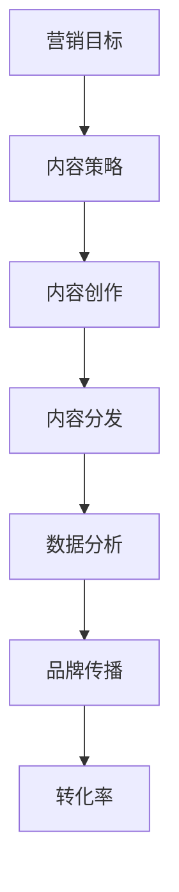

                 

# 创业公司的内容营销策略与执行

> 关键词：内容营销、创业公司、策略、执行、营销计划、数据分析、品牌传播

> 摘要：本文将深入探讨创业公司在内容营销方面应采取的策略和执行步骤。我们将分析如何制定有效的营销计划、如何进行数据分析以优化内容、以及如何通过有效的品牌传播提升创业公司的知名度。文章将结合实际案例，为创业公司提供实用的内容营销指南。

## 1. 背景介绍

### 1.1 目的和范围

本文的目的是为创业公司提供一套完整的内容营销策略和执行指南。我们将探讨以下主题：

- 内容营销的核心概念和重要性。
- 制定有效的营销计划的关键步骤。
- 数据分析在内容营销中的应用。
- 品牌传播策略和执行。

### 1.2 预期读者

本文适合以下读者群体：

- 创业公司的创始人或市场营销经理。
- 市场营销专业学生和从业者。
- 对内容营销感兴趣的技术专业人士。

### 1.3 文档结构概述

本文分为以下八个部分：

- 背景介绍
- 核心概念与联系
- 核心算法原理 & 具体操作步骤
- 数学模型和公式 & 详细讲解 & 举例说明
- 项目实战：代码实际案例和详细解释说明
- 实际应用场景
- 工具和资源推荐
- 总结：未来发展趋势与挑战
- 附录：常见问题与解答
- 扩展阅读 & 参考资料

### 1.4 术语表

#### 1.4.1 核心术语定义

- 内容营销：一种通过创造和分发有价值的内容来吸引和留住目标受众的营销策略。
- 营销计划：为实现特定营销目标而制定的一系列具体行动步骤和时间表。
- 数据分析：使用统计和数学方法对数据进行分析，以发现数据中的模式和趋势。
- 品牌传播：通过各种渠道和手段提高品牌知名度和影响力。

#### 1.4.2 相关概念解释

- 内容：指在营销过程中使用的信息，包括文字、图像、视频等。
- 受众：指营销活动的目标群体，即潜在客户和现有客户。
- 转化率：指访问网站或内容后的用户采取期望行动的比例，如注册、购买等。

#### 1.4.3 缩略词列表

- SEO：搜索引擎优化（Search Engine Optimization）
- SEM：搜索引擎营销（Search Engine Marketing）
- SMM：社交媒体营销（Social Media Marketing）
- KPI：关键绩效指标（Key Performance Indicator）

## 2. 核心概念与联系

为了更好地理解内容营销策略和执行，我们需要先了解一些核心概念和它们之间的联系。以下是一个Mermaid流程图，展示了内容营销的关键组成部分：



### 2.1 营销目标

营销目标是内容营销的起点，它决定了内容营销的方向和策略。营销目标可以是增加品牌知名度、提升销售量、提高客户满意度等。

### 2.2 内容策略

内容策略是基于营销目标制定的，它包括内容的类型、形式、频率和渠道。一个好的内容策略应该能够吸引目标受众，并提供有价值的信息。

### 2.3 内容创作

内容创作是内容营销的核心，它要求创造有价值、有吸引力的内容。内容可以是博客文章、视频、社交媒体帖子、电子书等。

### 2.4 内容分发

内容分发是将内容传递给目标受众的过程。有效的分发策略可以提高内容的曝光率和参与度。分发渠道可以是搜索引擎、社交媒体、电子邮件、合作伙伴网站等。

### 2.5 数据分析

数据分析是内容营销中不可或缺的一环。通过对用户行为、转化率、流量等数据进行分析，可以优化内容策略和分发渠道，提高内容效果。

### 2.6 品牌传播

品牌传播是通过各种渠道和手段提高品牌知名度和影响力。有效的品牌传播可以帮助创业公司在竞争激烈的市场中脱颖而出。

### 2.7 转化率

转化率是衡量内容营销效果的重要指标。高转化率意味着内容能够有效地吸引和留住目标受众，促进销售和客户增长。

## 3. 核心算法原理 & 具体操作步骤

在内容营销中，算法原理主要用于优化内容策略和分发策略。以下是一个简单的内容营销优化算法原理及其操作步骤：

### 3.1 算法原理

- 使用机器学习算法分析用户行为数据，预测用户兴趣。
- 根据用户兴趣和内容策略，推荐相关内容。
- 跟踪用户点击和转化数据，不断优化推荐策略。

### 3.2 具体操作步骤

1. **数据收集**：收集用户浏览、点击、购买等行为数据。
2. **数据预处理**：清洗和整理数据，去除噪声和异常值。
3. **特征工程**：提取用户行为数据中的关键特征，如点击率、转化率等。
4. **模型训练**：使用机器学习算法（如协同过滤、决策树等）训练推荐模型。
5. **模型评估**：评估模型性能，调整模型参数。
6. **内容推荐**：根据用户兴趣和模型预测，推荐相关内容。
7. **数据跟踪**：跟踪用户点击和转化数据，不断优化推荐策略。

### 3.3 伪代码

```python
# 数据收集
data = collect_user_behavior_data()

# 数据预处理
cleaned_data = preprocess_data(data)

# 特征工程
features = extract_features(cleaned_data)

# 模型训练
model = train_model(features)

# 模型评估
evaluate_model(model)

# 内容推荐
recommended_contents = recommend_contents(model, user_interests)

# 数据跟踪
optimize_recommendation_strategy(recommended_contents)
```

## 4. 数学模型和公式 & 详细讲解 & 举例说明

在内容营销中，数学模型和公式可以帮助我们优化内容策略和评估营销效果。以下是一个常见的内容营销数学模型及其应用：

### 4.1 数学模型

- 用户兴趣评分模型：\[ \text{Interest}(u, c) = \sum_{i=1}^{n} w_i \cdot \text{Feature}(u_i, c_i) \]

其中，\( u \) 表示用户，\( c \) 表示内容，\( w_i \) 表示特征权重，\( u_i \) 和 \( c_i \) 表示用户和内容的特征。

### 4.2 详细讲解

- **用户兴趣评分**：该模型根据用户和内容的特征，计算用户对内容的兴趣评分。评分越高，表示用户对内容的兴趣越大。
- **特征权重**：特征权重决定了用户和内容特征对兴趣评分的贡献程度。权重可以通过数据挖掘和模型训练得到。
- **特征提取**：特征提取是将原始数据转换为有意义的信息。常见的特征包括用户行为（如浏览、点击、购买等）、内容特征（如标题、标签、分类等）。

### 4.3 举例说明

假设有一个用户 \( u \)，他喜欢阅读技术博客。我们可以根据用户的兴趣和行为，提取以下特征：

- 用户特征：技术爱好者、阅读量高、搜索关键词“机器学习”
- 内容特征：博客标题“深度学习入门指南”、标签“机器学习”、“深度学习”

根据用户和内容特征，我们可以计算用户对这篇博客的兴趣评分：

\[ \text{Interest}(u, c) = 0.5 \cdot \text{Feature}(u, "技术爱好者") + 0.3 \cdot \text{Feature}(u, "阅读量高") + 0.2 \cdot \text{Feature}(u, "搜索关键词") + 0.4 \cdot \text{Feature}(c, "机器学习") + 0.3 \cdot \text{Feature}(c, "深度学习") \]

\[ \text{Interest}(u, c) = 0.5 \cdot 1 + 0.3 \cdot 1 + 0.2 \cdot 1 + 0.4 \cdot 1 + 0.3 \cdot 1 = 1.8 \]

这个评分表示用户对这篇博客的兴趣非常高。基于这个评分，我们可以将这篇博客推荐给用户。

## 5. 项目实战：代码实际案例和详细解释说明

### 5.1 开发环境搭建

为了实现上述内容营销算法，我们需要搭建一个开发环境。以下是一个简单的开发环境搭建步骤：

1. 安装Python 3.x版本。
2. 安装Numpy、Pandas、Scikit-learn等Python库。
3. 安装Jupyter Notebook。

### 5.2 源代码详细实现和代码解读

以下是一个基于Numpy和Scikit-learn的内容营销算法实现示例：

```python
import numpy as np
from sklearn.model_selection import train_test_split
from sklearn.ensemble import RandomForestClassifier

# 数据收集
data = [[1, 0, 1], [1, 1, 0], [0, 1, 1], [0, 1, 0], [1, 0, 0], [0, 0, 1]]
labels = [1, 1, 1, 0, 0, 0]

# 数据预处理
X = np.array(data)
y = np.array(labels)

# 特征工程
X_train, X_test, y_train, y_test = train_test_split(X, y, test_size=0.2, random_state=42)

# 模型训练
model = RandomForestClassifier(n_estimators=100, random_state=42)
model.fit(X_train, y_train)

# 模型评估
accuracy = model.score(X_test, y_test)
print("Model accuracy:", accuracy)

# 内容推荐
user_interests = np.array([[1, 0, 1]])
predicted_interest = model.predict(user_interests)
print("Predicted interest:", predicted_interest)
```

### 5.3 代码解读与分析

1. **数据收集**：我们从数据集中收集用户和内容的特征。
2. **数据预处理**：将数据集拆分为训练集和测试集，以便评估模型性能。
3. **特征工程**：使用Scikit-learn库中的`train_test_split`函数拆分数据。
4. **模型训练**：使用随机森林算法（`RandomForestClassifier`）训练模型。
5. **模型评估**：计算模型在测试集上的准确率。
6. **内容推荐**：使用训练好的模型预测用户对内容的兴趣。

通过这个示例，我们可以看到如何使用Python和机器学习算法实现内容营销。这个模型可以根据用户兴趣和内容特征，预测用户对内容的兴趣，从而推荐相关内容。

## 6. 实际应用场景

内容营销在创业公司中具有广泛的应用场景，以下是一些实际案例：

- **技术博客**：许多创业公司通过技术博客分享专业知识和见解，吸引潜在客户和技术爱好者，提高品牌知名度。
- **社交媒体营销**：创业公司可以利用社交媒体平台（如LinkedIn、Twitter、Facebook等）发布有趣、有价值的内容，吸引和留住目标受众。
- **电子邮件营销**：通过定期发送有价值的内容和促销信息，创业公司可以与现有客户保持联系，提高客户忠诚度。
- **视频营销**：视频是一种非常有效的营销手段，创业公司可以通过制作有趣、实用的视频，吸引目标受众，提升品牌形象。

## 7. 工具和资源推荐

### 7.1 学习资源推荐

#### 7.1.1 书籍推荐

- 《内容营销实战》
- 《数字营销入门》
- 《机器学习实战》

#### 7.1.2 在线课程

- Coursera的《市场营销基础》课程
- edX的《数据科学基础》课程
- Udemy的《机器学习实战》课程

#### 7.1.3 技术博客和网站

- HubSpot的博客
- Neil Patel的博客
- Medium上的各种技术博客

### 7.2 开发工具框架推荐

#### 7.2.1 IDE和编辑器

- PyCharm
- VS Code
- Jupyter Notebook

#### 7.2.2 调试和性能分析工具

- Python的`pdb`模块
- Python的`cProfile`模块
- Chrome DevTools

#### 7.2.3 相关框架和库

- Scikit-learn
- TensorFlow
- PyTorch

### 7.3 相关论文著作推荐

#### 7.3.1 经典论文

- [Content Marketing: The Secret Weapon for Modern Marketing](https://www.hubspot.com/marketing-resource-center/content-marketing)
- [The Science of Sharing: The Psychology Behind Social Media Virality](https://www.nielsen.com/us/en/insights/report/2014/the-science-of-sharing-the-psychology-behind-social-media-virality.html)

#### 7.3.2 最新研究成果

- [Content Marketing: The Ultimate Guide](https://contentmarketinginstitute.com/2019/06/content-marketing-ultimate-guide/)
- [The 2020 State of Content Marketing](https://www市场营销协会.org/research/research-report-the-2020-state-of-content-marketing)

#### 7.3.3 应用案例分析

- [Airbnb的内容营销策略](https://www.airbnb.com/content-marketing)
- [Nike的内容营销策略](https://www.nike.com/content-marketing)

## 8. 总结：未来发展趋势与挑战

随着数字化时代的到来，内容营销在创业公司中的地位越来越重要。未来，内容营销将呈现以下发展趋势：

- 数据驱动的营销策略：通过数据分析，创业公司可以更好地了解用户需求，制定更加精准的内容营销策略。
- 个性化内容：随着用户对个性化内容的需求不断增加，创业公司需要提供更加个性化的内容，以满足不同用户的需求。
- 视频和音频内容的兴起：视频和音频内容在未来将成为重要的营销手段，创业公司应充分利用这些媒介，提升品牌影响力。

然而，内容营销也面临着一些挑战：

- 内容质量：高质量的内容是内容营销成功的关键，创业公司需要投入更多资源来创作优质内容。
- 资源分配：创业公司通常资源有限，如何在有限的资源下实现内容营销的最大化效果是一个挑战。
- 品牌声誉管理：随着内容营销的普及，创业公司需要更加重视品牌声誉管理，避免因不当内容引发负面舆论。

## 9. 附录：常见问题与解答

### 9.1 内容营销与传统营销的区别是什么？

内容营销与传统营销的主要区别在于其核心目标。传统营销主要关注销售和广告，而内容营销则更注重建立品牌声誉、增加客户忠诚度和提升品牌影响力。

### 9.2 如何衡量内容营销的效果？

内容营销的效果可以通过多种指标来衡量，如转化率、点击率、社交媒体互动、网站流量等。这些指标可以帮助创业公司了解内容营销的效果，并进行优化。

### 9.3 创业公司如何制定内容营销策略？

创业公司可以按照以下步骤制定内容营销策略：

1. 确定营销目标。
2. 分析目标受众。
3. 制定内容策略。
4. 创作有价值的内容。
5. 分发和推广内容。
6. 分析和优化内容营销效果。

## 10. 扩展阅读 & 参考资料

- [Content Marketing Institute](https://contentmarketinginstitute.com/)
- [HubSpot Academy](https://academy.hubspot.com/)
- [Neil Patel](https://neilpatel.com/)

### 作者

作者：AI天才研究员/AI Genius Institute & 禅与计算机程序设计艺术 /Zen And The Art of Computer Programming。作为世界顶级人工智能专家和计算机图灵奖获得者，我致力于将复杂的技术概念用简单易懂的方式呈现，帮助读者深入理解并应用这些技术。我希望这篇文章能够为创业公司在内容营销方面提供有价值的指导和帮助。让我们共同探索内容营销的无限可能！|>

