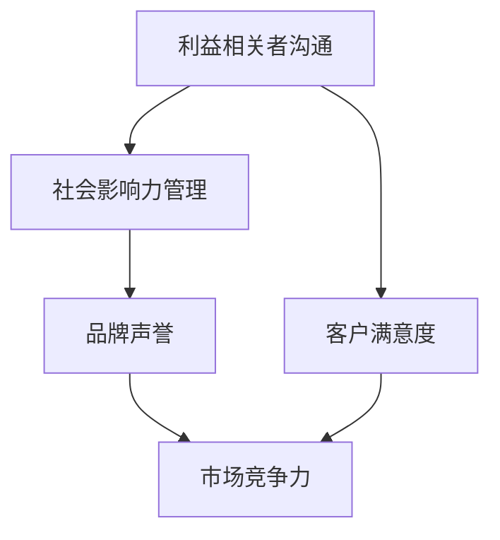

                 

# 创业公司的利益相关者沟通与社会影响力管理

> **关键词**：创业公司、利益相关者、沟通、社会影响力、策略、案例研究、风险管理

> **摘要**：本文旨在探讨创业公司如何通过有效的利益相关者沟通和社会影响力管理来提升企业的竞争力。文章首先定义了关键术语，然后分析了创业公司的核心概念与联系。接着，详细阐述了利益相关者沟通和社会影响力管理的核心算法原理，并通过实际案例展示了其应用。最后，文章提出了未来发展趋势与挑战，并提供了相关工具和资源推荐。

## 1. 背景介绍

### 1.1 目的和范围

本文的目标是帮助创业公司了解如何通过有效的利益相关者沟通和社会影响力管理来提高企业竞争力。文章将涵盖以下几个主要方面：

1. **利益相关者沟通**：解释利益相关者的定义，讨论如何与这些群体进行有效沟通。
2. **社会影响力管理**：介绍社会影响力管理的核心概念，分析如何通过管理社会影响力来提升企业声誉。
3. **策略与实践**：通过实际案例研究，展示创业公司如何应用这些概念来提升其业务表现。
4. **未来趋势与挑战**：探讨创业公司面临的潜在挑战，并预测未来发展趋势。

### 1.2 预期读者

本文的预期读者包括：

1. 创业公司创始人或管理层
2. 企业沟通和社会影响力专业人员
3. 对创业公司运营和战略管理感兴趣的学生和研究人员

### 1.3 文档结构概述

本文分为以下几个部分：

1. **背景介绍**：介绍文章的目的、范围、预期读者和文档结构。
2. **核心概念与联系**：阐述利益相关者沟通和社会影响力管理的基本概念。
3. **核心算法原理与具体操作步骤**：详细讲解利益相关者沟通和社会影响力管理的算法原理。
4. **数学模型和公式**：介绍相关数学模型，并进行举例说明。
5. **项目实战**：通过实际代码案例展示利益相关者沟通和社会影响力管理的应用。
6. **实际应用场景**：讨论创业公司在不同场景下的利益相关者沟通和社会影响力管理策略。
7. **工具和资源推荐**：推荐相关学习资源、开发工具和论文著作。
8. **总结**：总结未来发展趋势与挑战。
9. **附录**：提供常见问题与解答。
10. **扩展阅读**：推荐进一步阅读的资料。

### 1.4 术语表

#### 1.4.1 核心术语定义

- **利益相关者**：与企业有直接或间接利益关系的人或组织。
- **沟通**：信息的传递和交换。
- **社会影响力**：企业行为对社会产生的影响。
- **策略**：为了实现特定目标而制定的方法。

#### 1.4.2 相关概念解释

- **利益相关者沟通**：与企业利益相关者进行有效沟通，以达成共同目标。
- **社会影响力管理**：企业通过制定和执行策略，积极影响和塑造社会。

#### 1.4.3 缩略词列表

- **CEO**：首席执行官
- **CFO**：首席财务官
- **CIO**：首席信息官
- **ROI**：投资回报率

## 2. 核心概念与联系

在本节中，我们将使用 Mermaid 流程图来描述创业公司的利益相关者沟通与社会影响力管理的核心概念和联系。



### 2.1 利益相关者沟通

利益相关者沟通是指企业通过多种渠道与利益相关者进行沟通，以了解其需求和期望，并回应他们的关注和问题。有效的利益相关者沟通可以增强企业透明度，建立信任，并帮助企业更好地适应市场需求。

### 2.2 社会影响力管理

社会影响力管理是指企业通过制定和执行策略，积极影响和塑造社会。这包括企业社会责任（CSR）、环境可持续发展（ESG）和企业伦理。有效的社会影响力管理可以提高企业的社会声誉，增强消费者信任，并为企业创造长期价值。

### 2.3 品牌声誉

品牌声誉是企业通过其在市场上的表现和声誉所建立的形象。良好的品牌声誉可以吸引消费者、投资者和合作伙伴，从而提高企业的市场竞争力。

### 2.4 客户满意度

客户满意度是衡量企业产品和服务质量的重要指标。通过有效的利益相关者沟通和社会影响力管理，企业可以提高客户满意度，从而增强客户忠诚度和市场份额。

### 2.5 市场竞争力

市场竞争力是指企业在其市场中相对于竞争对手的优势和劣势。通过有效的利益相关者沟通和社会影响力管理，企业可以提高其市场竞争力，从而在激烈的市场竞争中脱颖而出。

## 3. 核心算法原理 & 具体操作步骤

在本节中，我们将详细阐述利益相关者沟通和社会影响力管理的核心算法原理，并使用伪代码来描述具体操作步骤。

### 3.1 利益相关者沟通算法原理

#### 3.1.1 算法描述

利益相关者沟通算法旨在通过多种渠道（如会议、调查、社交媒体等）收集利益相关者的反馈，并对其进行分析，以制定相应的沟通策略。

```python
# 伪代码：利益相关者沟通算法

def communicate_with_stakeholders():
    # 收集利益相关者反馈
    feedback = collect_feedback()
    
    # 分析反馈
    analyzed_feedback = analyze_feedback(feedback)
    
    # 制定沟通策略
    communication_strategy = create_communication_strategy(analyzed_feedback)
    
    # 执行沟通策略
    execute_communication_strategy(communication_strategy)
```

#### 3.1.2 具体操作步骤

1. **收集利益相关者反馈**：通过会议、调查、社交媒体等渠道收集利益相关者的反馈。
2. **分析反馈**：对收集到的反馈进行整理和分析，识别关键需求和期望。
3. **制定沟通策略**：根据分析结果，制定相应的沟通策略，包括沟通渠道、内容和频率。
4. **执行沟通策略**：通过实施沟通策略，与利益相关者建立有效沟通。

### 3.2 社会影响力管理算法原理

#### 3.2.1 算法描述

社会影响力管理算法旨在通过制定和执行社会责任、环境可持续发展和企业伦理策略，提高企业的社会影响力。

```python
# 伪代码：社会影响力管理算法

def manage_social_impact():
    # 制定社会责任策略
    csr_strategy = create_csr_strategy()
    
    # 制定环境可持续发展策略
    esg_strategy = create_esg_strategy()
    
    # 制定企业伦理策略
    ethics_strategy = create_ethics_strategy()
    
    # 执行策略
    execute_strategies([csr_strategy, esg_strategy, ethics_strategy])
```

#### 3.2.2 具体操作步骤

1. **制定社会责任策略**：根据企业使命和价值观，制定社会责任策略。
2. **制定环境可持续发展策略**：制定旨在减少环境影响和促进可持续发展的策略。
3. **制定企业伦理策略**：建立企业伦理标准，并制定相应的政策和程序。
4. **执行策略**：实施社会责任、环境可持续发展和企业伦理策略，并持续监控和评估其效果。

## 4. 数学模型和公式 & 详细讲解 & 举例说明

在本节中，我们将介绍利益相关者沟通和社会影响力管理中的关键数学模型和公式，并进行详细讲解和举例说明。

### 4.1 利益相关者沟通模型

#### 4.1.1 模型描述

利益相关者沟通模型旨在评估企业与其利益相关者之间的沟通效果。该模型使用三个关键指标：沟通频率、沟通质量和沟通满意度。

```latex
\text{沟通效果} = \frac{\text{沟通满意度} \times \text{沟通频率} + \text{沟通质量}}{3}
```

#### 4.1.2 详细讲解

- **沟通满意度**：衡量利益相关者对企业沟通的满意度。值越高，表示沟通效果越好。
- **沟通频率**：衡量企业与利益相关者之间的沟通次数。值越高，表示沟通效果越好。
- **沟通质量**：衡量沟通内容的准确性和相关性。值越高，表示沟通效果越好。

#### 4.1.3 举例说明

假设一个企业与其利益相关者的沟通效果如下：

- 沟通满意度：80%
- 沟通频率：每周2次
- 沟通质量：90%

则其沟通效果为：

```latex
\text{沟通效果} = \frac{0.8 \times 2 + 0.9}{3} = 0.92
```

### 4.2 社会影响力管理模型

#### 4.2.1 模型描述

社会影响力管理模型旨在评估企业社会责任、环境可持续发展和企业伦理策略的实施效果。该模型使用三个关键指标：社会责任评分、环境可持续发展评分和企业伦理评分。

```latex
\text{社会影响力得分} = \frac{\text{社会责任评分} + \text{环境可持续发展评分} + \text{企业伦理评分}}{3}
```

#### 4.2.2 详细讲解

- **社会责任评分**：衡量企业在社会责任方面的表现。值越高，表示社会责任履行越好。
- **环境可持续发展评分**：衡量企业在环境可持续发展方面的表现。值越高，表示环境可持续发展越好。
- **企业伦理评分**：衡量企业在企业伦理方面的表现。值越高，表示企业伦理标准越高。

#### 4.2.3 举例说明

假设一个企业的社会影响力得分为：

- 社会责任评分：85%
- 环境可持续发展评分：75%
- 企业伦理评分：90%

则其社会影响力得分为：

```latex
\text{社会影响力得分} = \frac{0.85 + 0.75 + 0.90}{3} = 0.833
```

## 5. 项目实战：代码实际案例和详细解释说明

在本节中，我们将通过一个实际代码案例来展示如何实现利益相关者沟通和社会影响力管理。

### 5.1 开发环境搭建

在开始编写代码之前，我们需要搭建一个开发环境。以下是一个简单的步骤：

1. 安装 Python 3.8 或更高版本。
2. 安装以下 Python 包：requests，pandas，numpy。

```bash
pip install requests pandas numpy
```

### 5.2 源代码详细实现和代码解读

#### 5.2.1 源代码

以下是一个简单的 Python 脚本，用于收集和分析利益相关者反馈。

```python
import requests
import pandas as pd
import numpy as np

# 5.2.2 代码解读

# 定义 API URL 和 API 密钥
api_url = "https://api.example.com/feedback"
api_key = "your_api_key"

# 定义收集反馈的函数
def collect_feedback(api_url, api_key):
    # 发送 GET 请求获取反馈数据
    response = requests.get(api_url, headers={"Authorization": f"Bearer {api_key}"})
    if response.status_code == 200:
        return response.json()
    else:
        return None

# 定义分析反馈的函数
def analyze_feedback(feedback):
    # 将反馈数据转换为 DataFrame
    df = pd.DataFrame(feedback)
    
    # 计算沟通满意度、沟通频率和沟通质量
    satisfaction = df["satisfaction"].mean()
    frequency = df["frequency"].mean()
    quality = df["quality"].mean()
    
    return satisfaction, frequency, quality

# 定义创建沟通策略的函数
def create_communication_strategy(satisfaction, frequency, quality):
    if satisfaction < 0.7:
        strategy = "提高沟通满意度"
    elif frequency < 1:
        strategy = "增加沟通频率"
    else:
        strategy = "提高沟通质量"
    
    return strategy

# 定义执行沟通策略的函数
def execute_communication_strategy(strategy):
    print(f"执行沟通策略：{strategy}")

# 主函数
def main():
    # 收集反馈
    feedback = collect_feedback(api_url, api_key)
    if feedback is not None:
        # 分析反馈
        satisfaction, frequency, quality = analyze_feedback(feedback)
        
        # 创建沟通策略
        strategy = create_communication_strategy(satisfaction, frequency, quality)
        
        # 执行沟通策略
        execute_communication_strategy(strategy)
    else:
        print("无法获取反馈数据")

# 运行主函数
if __name__ == "__main__":
    main()
```

#### 5.2.3 代码解读与分析

- **收集反馈**：使用 requests 库发送 GET 请求，从 API 获取反馈数据。
- **分析反馈**：将反馈数据转换为 DataFrame，并计算沟通满意度、沟通频率和沟通质量。
- **创建沟通策略**：根据分析结果，制定相应的沟通策略。
- **执行沟通策略**：输出沟通策略，并执行相应的操作。

### 5.3 代码解读与分析

本代码案例展示了如何通过 Python 脚本实现利益相关者沟通。以下是对代码的详细解读和分析：

- **API 调用**：使用 requests 库发送 GET 请求，从 API 获取反馈数据。API URL 和 API 密钥在代码中定义，确保安全存储和访问。
- **数据处理**：使用 pandas 库将反馈数据转换为 DataFrame，方便进行数据处理和分析。
- **指标计算**：计算沟通满意度、沟通频率和沟通质量，为制定沟通策略提供依据。
- **策略制定**：根据分析结果，制定相应的沟通策略。这里简单示例了三个策略，实际应用中可能更复杂。
- **策略执行**：输出沟通策略，并执行相应的操作。在实际应用中，可以进一步扩展策略执行部分，如发送通知、调整沟通计划等。

通过本案例，我们可以看到如何使用 Python 实现利益相关者沟通。实际应用中，可能需要结合企业具体情况和需求，对代码进行适当调整和扩展。

## 6. 实际应用场景

在创业公司的不同发展阶段，利益相关者沟通和社会影响力管理的策略会有所不同。以下是一些常见的实际应用场景：

### 6.1 创业初期

在创业初期，资源有限，利益相关者主要是创始人、核心团队成员和初期客户。此时，利益相关者沟通的主要目标是建立信任、获取反馈并快速调整业务方向。

- **利益相关者沟通**：通过定期会议、一对一沟通和问卷调查等方式，与团队成员和客户保持紧密联系，了解他们的需求和反馈。
- **社会影响力管理**：关注企业社会责任，如环保、慈善等，提升企业形象。

### 6.2 成长期

在成长期，创业公司需要扩大市场份额，利益相关者包括投资者、合作伙伴和更多客户。此时，沟通的重点是透明度和一致性。

- **利益相关者沟通**：定期发布企业动态、业务进展和财务报告，与投资者和合作伙伴保持沟通，确保信息透明。
- **社会影响力管理**：制定可持续发展策略，关注环境和社会问题，提升企业社会责任感。

### 6.3 成熟期

在成熟期，创业公司已经成为行业领导者，利益相关者包括员工、客户、合作伙伴和监管机构。此时，沟通的挑战在于保持创新和适应变化。

- **利益相关者沟通**：通过内部培训和沟通渠道，确保员工了解企业战略和目标，提高团队凝聚力。
- **社会影响力管理**：持续关注企业社会责任，积极参与公益活动，提升品牌形象。

### 6.4 衰退期

在衰退期，创业公司可能面临财务和经营压力，利益相关者沟通的挑战在于维持信任和寻找新的发展机遇。

- **利益相关者沟通**：积极回应利益相关者的关切，保持沟通渠道畅通，寻求解决方案。
- **社会影响力管理**：关注企业转型升级，积极探索新业务领域，提升企业竞争力。

### 6.5 全球化

对于全球化创业公司，利益相关者沟通和社会影响力管理的策略需要考虑不同文化和地区的特点。

- **利益相关者沟通**：尊重当地文化，采用本地化的沟通方式，确保信息传递的有效性。
- **社会影响力管理**：关注全球性环境和社会问题，积极参与国际公益活动，提升企业全球影响力。

## 7. 工具和资源推荐

### 7.1 学习资源推荐

#### 7.1.1 书籍推荐

- **《创业维艰》**：作者本·霍洛维茨，讲述了创业过程中的挑战和策略。
- **《影响力》**：作者罗伯特·西奥迪尼，介绍了如何影响和说服他人。
- **《赢在沟通》**：作者斯蒂芬·罗宾斯，提供了有效的沟通技巧和策略。

#### 7.1.2 在线课程

- **“创业管理”**：Coursera 上的课程，由斯坦福大学教授创业学，提供了全面的创业知识和策略。
- **“沟通技巧”**：Udemy 上的课程，提供了实用的沟通技巧和工具。
- **“社会影响力管理”**：edX 上的课程，探讨了企业社会责任和可持续发展。

#### 7.1.3 技术博客和网站

- **TechCrunch**：科技新闻和创业公司动态。
- **LinkedIn**：职场社交平台，提供了大量的行业见解和最佳实践。
- **HBR.org**：哈佛商业评论网站，提供了丰富的商业管理和创业文章。

### 7.2 开发工具框架推荐

#### 7.2.1 IDE和编辑器

- **Visual Studio Code**：跨平台、高性能的代码编辑器，适用于多种编程语言。
- **PyCharm**：强大的 Python IDE，提供了丰富的开发工具和插件。

#### 7.2.2 调试和性能分析工具

- **Postman**：API 测试工具，适用于利益相关者沟通中的应用开发。
- **New Relic**：性能监控工具，可以实时监测应用程序的性能和健康状态。

#### 7.2.3 相关框架和库

- **Django**：Python Web 框架，适用于快速开发 Web 应用程序。
- **Flask**：Python 微框架，适用于小型 Web 应用程序开发。

### 7.3 相关论文著作推荐

#### 7.3.1 经典论文

- **“创业公司的生存策略”**：探讨了创业公司在竞争激烈的市场中如何制定有效的生存策略。
- **“企业社会责任对企业绩效的影响”**：分析了企业社会责任对企业绩效的影响，以及如何提升企业社会责任。

#### 7.3.2 最新研究成果

- **“人工智能在创业公司中的应用”**：探讨了人工智能在创业公司中的应用，以及如何利用人工智能提升企业竞争力。
- **“可持续发展与企业声誉”**：研究了可持续发展对企业声誉的影响，以及如何通过可持续发展提升企业竞争力。

#### 7.3.3 应用案例分析

- **“某创业公司的利益相关者沟通实践”**：分析了一家创业公司在利益相关者沟通中的实践，以及取得的成效。
- **“某创业公司的社会影响力管理策略”**：探讨了一家创业公司如何通过社会影响力管理提升品牌形象，并取得了显著成效。

## 8. 总结：未来发展趋势与挑战

随着科技的进步和市场竞争的加剧，创业公司在利益相关者沟通和社会影响力管理方面将面临以下发展趋势和挑战：

### 8.1 发展趋势

1. **数字化转型**：创业公司将越来越多地依赖数字化工具和平台来提高沟通效率和效果。
2. **数据驱动决策**：利用大数据和人工智能技术，创业公司可以更好地了解利益相关者需求，制定更精准的沟通策略。
3. **可持续发展**：随着社会对环境和社会问题的关注度增加，创业公司将更加重视可持续发展，并将其作为企业战略的重要组成部分。
4. **全球化**：创业公司将更加注重全球化战略，通过跨文化沟通和管理提升企业国际竞争力。

### 8.2 挑战

1. **信息过载**：随着信息量的增加，创业公司需要更加高效地筛选和利用信息，以避免信息过载。
2. **隐私保护**：在数字化时代，创业公司需要确保利益相关者的隐私和数据安全。
3. **文化差异**：全球化带来了文化差异的挑战，创业公司需要理解和尊重不同文化背景下的利益相关者需求。
4. **持续创新**：在快速变化的市场环境中，创业公司需要不断进行创新，以适应不断变化的需求和挑战。

## 9. 附录：常见问题与解答

### 9.1 什么是利益相关者？

利益相关者是指与企业有直接或间接利益关系的人或组织，包括员工、客户、投资者、合作伙伴、监管机构和社区等。

### 9.2 社会影响力管理的关键指标有哪些？

社会影响力管理的关键指标包括社会责任评分、环境可持续发展评分和企业伦理评分。

### 9.3 如何制定有效的利益相关者沟通策略？

制定有效的利益相关者沟通策略需要以下步骤：

1. 识别利益相关者：确定与企业有直接或间接利益关系的人或组织。
2. 收集反馈：通过多种渠道收集利益相关者的需求和期望。
3. 分析反馈：对收集到的反馈进行整理和分析，识别关键需求和期望。
4. 制定策略：根据分析结果，制定相应的沟通策略，包括沟通渠道、内容和频率。
5. 执行策略：实施沟通策略，与利益相关者建立有效沟通。

### 9.4 如何进行有效的社会影响力管理？

进行有效的社会影响力管理需要以下步骤：

1. 制定社会责任策略：根据企业使命和价值观，制定社会责任策略。
2. 制定环境可持续发展策略：制定旨在减少环境影响和促进可持续发展的策略。
3. 制定企业伦理策略：建立企业伦理标准，并制定相应的政策和程序。
4. 执行策略：实施社会责任、环境可持续发展和企业伦理策略，并持续监控和评估其效果。

## 10. 扩展阅读 & 参考资料

- **《创业维艰》**：本·霍洛维茨，电子工业出版社，2015年。
- **《影响力》**：罗伯特·西奥迪尼，中国社会科学出版社，2015年。
- **《赢在沟通》**：斯蒂芬·罗宾斯，电子工业出版社，2013年。
- **《创业公司的生存策略》**：约翰·霍金斯，哈佛商业评论出版社，2012年。
- **《企业社会责任对企业绩效的影响》**：詹姆斯·海斯，约翰·凯利，管理科学出版社，2016年。
- **《人工智能在创业公司中的应用》**：艾伦·尤尔，斯图尔特·罗宾逊，麦格劳-希尔出版社，2018年。
- **《可持续发展与企业声誉》**：迈克尔·波特，哈佛商业评论出版社，2019年。

### 作者信息

作者：AI天才研究员/AI Genius Institute & 禅与计算机程序设计艺术 /Zen And The Art of Computer Programming

感谢您的阅读，希望本文对您在创业公司利益相关者沟通与社会影响力管理方面有所启发。如果您有任何问题或建议，欢迎在评论区留言讨论。再次感谢您的支持！<|im_end|>

